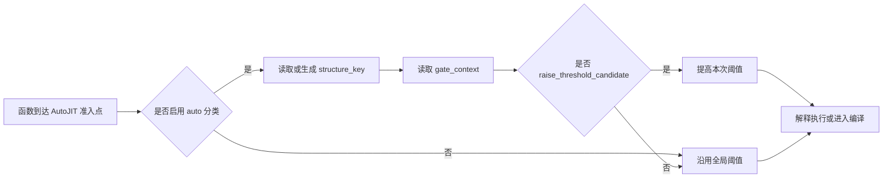
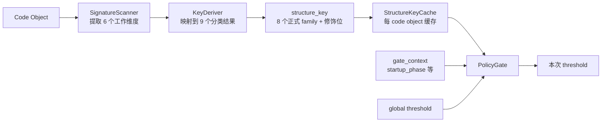
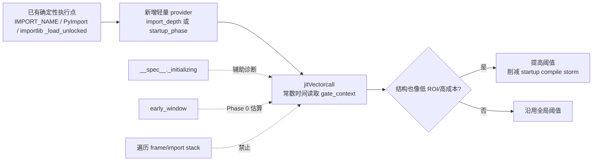
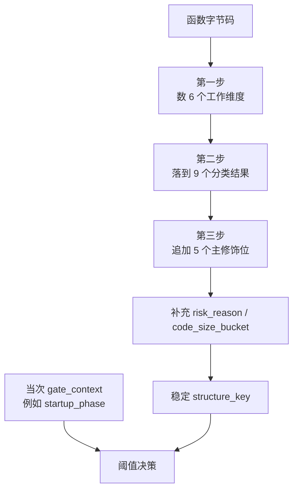
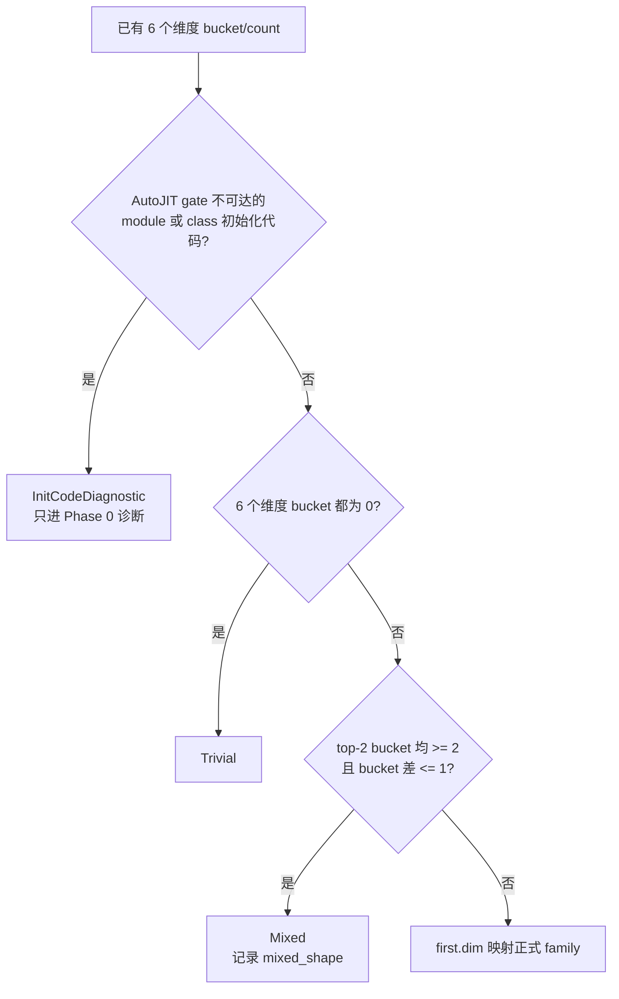
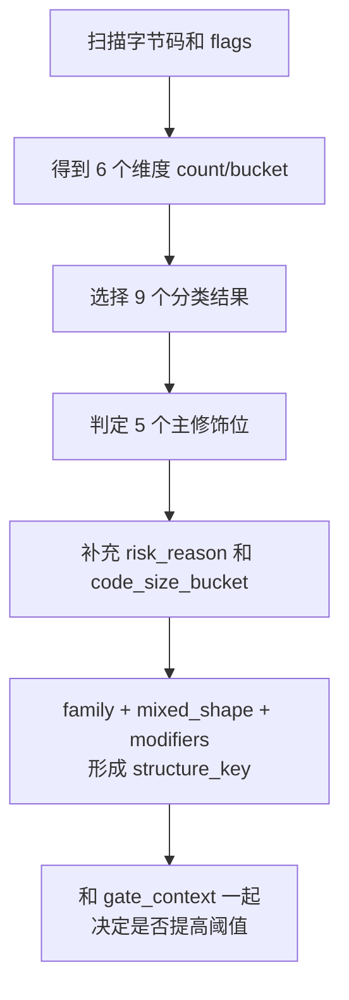
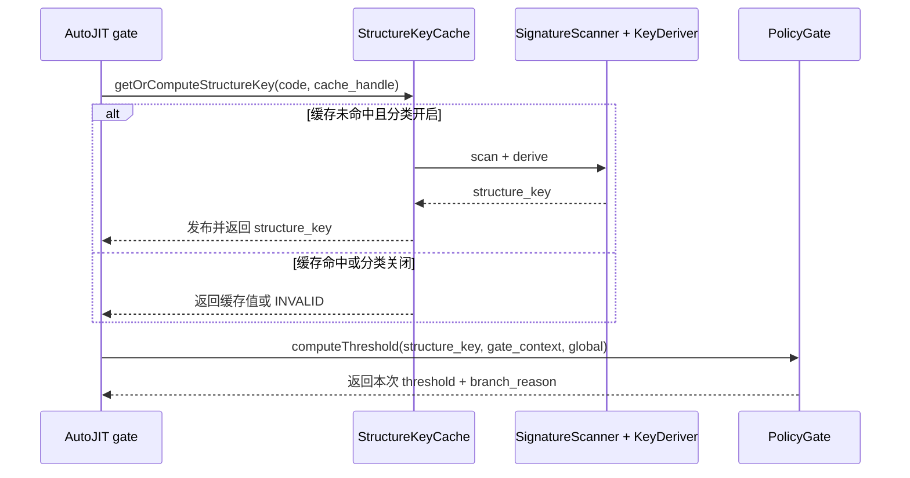
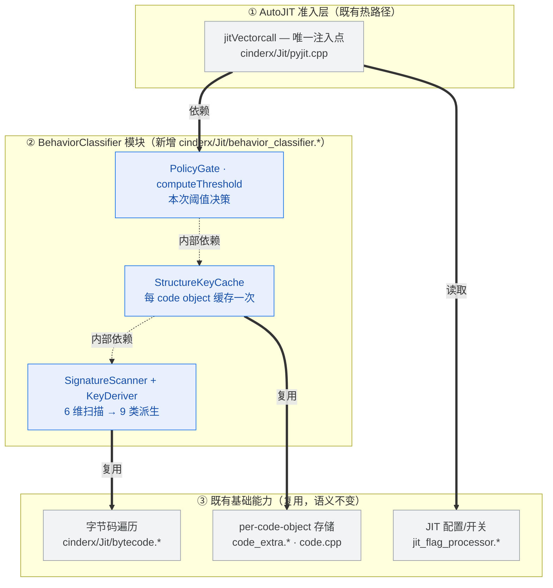
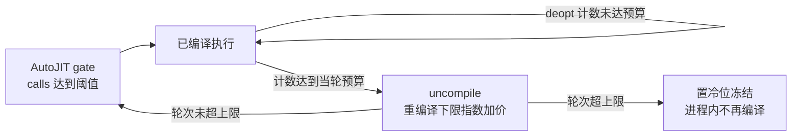

# 功能设计说明书 — 自适应 AutoJIT 行为模式分类

## 1 产品版本&密级

| 项 | 内容 |
|---|---|
| 产品 | CinderX JIT（**目标 Python 3.14**，含 Static Python） |
| 特性 | 自适应 AutoJIT 行为模式分类（Behavior Pattern Classification） |
| 版本 | v0.3（草案） |
| 密级 | 内部公开 |
| 适用分支 | `codex/hot-loop-osr-lightweight-docs` 及后续 AutoJIT 演进分支 |

## 2 拟制信息

| 角色 | 信息 |
|---|---|
| 拟制 | @sisibeloved |
| 日期 | 2026-06-01 |
| 上游需求 | `docs/design/autojit-behavior-classification/【需求分析】AutoJIT 行为模式分类.md` |
| 关联 Issue | sisibeloved/cinderx#3《探索基于行为模式的自适应 AutoJIT 阈值策略》 |
| 评审 | 待评审（已过一轮 Codex 对抗式审查，三项 high/medium 已闭环） |

## 3 修订记录

| 版本 | 日期 | 修订人 | 修订说明 |
|---|---|---|---|
| v0.1 | 2026-06-01 | @sisibeloved | 首版。依据需求文档 R1–R26 与源码实测，拆分 4 个功能项，定义逻辑接口、调用路径与 DFX。 |
| v0.2 | 2026-06-02 | @sisibeloved | 根据 Phase 0 C++ dump 与 gdb 定位更新证据边界：冻结 gate-side 分类 schema/Mixed 红线，禁止 `jitVectorcall` 内 frame/code metadata import-stack 采样，并将安全 import signal provider 与策略/default A/B 列为 v1 release gate。 |
| v0.3 | 2026-06-02 | @sisibeloved | 按功能设计模板优化表达：前置功能目标、使用边界、模块关系和验收口径，弱化代码级实现细节。 |
| v0.4 | 2026-06-02 | @sisibeloved | 优化 4+1 视图表达：开发视图重画为分层依赖图（准入层→分类器模块→基础能力，标注新增/复用与代码归属）；逻辑视图的数据流水线图上移至 §8.1.1 整体流程，逻辑视图聚焦模块协作时序；核心分类模型补充“5 个修饰位”表与三段式 `structure_key` 公式及分类决策图。 |
| v0.5 | 2026-06-02 | @sisibeloved | 补充特化时序边界：§8.1.2 说明 `structure_key` 走 canonical `opcode()`（`unspecialize(uninstrument(...))`），对自适应特化构造性不变（R20/AE8）；§8.5 说明 `specialization_band` 是 gate 前解释执行累积的滞后信号，且与阈值策略存在 policy↔band 反馈耦合，须 Phase-3 单独评估。 |
| v0.6 | 2026-06-02 | @sisibeloved | 补充开销与收益论证：§8.7.3.1 准入点改为先判 `calls >= global` 再分类（严格行为等价，被扫描函数数 ~416k→~30k）；§8.4.3.2 补 loop_score 开销分解（count≈免费、nesting 为 ≤16 区间定长后处理、4 档可早饱和）与三个前提（禁堆分配/只认明确后向跳转/16-cap）；§8.4.7.4 补单函数扫描开销分解表；§8.8.1 新增性能收益论证模型（净收益不等式、`calls>=global` 门控、R21 细化为测什么/达标线）。 |
| v0.7 | 2026-06-02 | @sisibeloved | ce-doc-review 回灌：§8.1.2 “9 分类结果”副标题改为“8 个正式 family（策略可见）+ 1 诊断分类（仅 Phase 0）”消除歧义；§8.7.3.2 补 `gate_view`(概念)=`structure_key`+`gate_context` 术语对齐注。 |
| v0.8 | 2026-06-02 | @sisibeloved | Open Question 决策 1 回灌：v1 价值主张与 release gate 拆成 provider 前 / provider 后两档；provider 前仅承诺分类基建与非 startup low_roi/risk-defer 最小策略，provider 后才启用 startup-init 并声明 ImportInit 收益。 |
| v0.9 | 2026-06-02 | @sisibeloved | Open Question 决策 2 回灌：Phase-3 特化观测保留为参考边界，移出 v1 功能项/SR/接口主线；v1 不定义 `readSpecializationBand` 或 `SpecBand` 接口。 |
| v0.10 | 2026-06-02 | @sisibeloved | Open Question 决策 3 回灌：`startup_init_candidate` 受限纳入 Mixed，仅 top-2 均为 dynamic/dispatch/object/control 且无 loop、非 static 时启用；含 compute/suspend 的 Mixed 不纳入。 |
| v0.11 | 2026-06-02 | @sisibeloved | Open Question 决策 4 回灌：收窄 v1 ROI 价值主张，不承诺完整 ROI 预测；补 mis-defer 守门，要求被后移 top candidate 证明省下的静态成本大于丢掉的动态收益。 |
| v0.12 | 2026-06-02 | @sisibeloved | Open Question 决策 5 回灌：bootstrap defaults 作为 coding/experiment defaults 进入实现和实验，`auto[:N]` 保持 opt-in；生产 policy/default 不在设计期冻结，需 A/B、相邻配置、mis-defer 与 provider 后 startup A/B。 |
| v0.13 | 2026-06-02 | @sisibeloved | ce-doc-review 决策 1 回灌：provider 前发布门槛只保留 opt-in `auto[:N]` vs `N` 非 startup A/B；相邻 cutoff/floor/δ/loop 比较与 mis-defer 守门归入生产 policy/default freeze。 |
| v0.14 | 2026-06-02 | @sisibeloved | ce-doc-review 批处理回灌：补 provider gate 量化通过线、provider-only startup 基线、post-import provider 前隔离、mis-defer 测量协议、`auto_classify` 状态转换和 `autojit_config_id`。 |
| v0.15 | 2026-06-02 | @sisibeloved | 补充 ROI 成本模型：将风险统一为成本的不确定/尾部项，§8.8.1 拆分 JIT 静态成本、动态成本与动态收益，新增成本阶段表、family 成本收益表和 `warmups=3` 解释口径。 |
| v0.16 | 2026-06-02 | @sisibeloved | 补充 startup/import 信号通俗说明：区分已有 import 执行点、实验信号、禁止的 frame 遍历和需新增的安全 import-depth provider，明确生产 provider 需要修改 CPython/CinderX import 路径并由 JIT O(1) 读取。 |
| v0.17 | 2026-06-02 | @sisibeloved | 修复 startup/import 通俗模型 Mermaid 兼容性：节点文案避免 `O(1)` 括号触发旧版 Mermaid 解析错误。 |
| v0.18 | 2026-06-02 | @sisibeloved | 重写核心分类模型说明：用三步法、表格和流程图说明 6 个工作维度、9 个分类结果、5 个修饰位分别如何划分和判定。 |
| v0.19 | 2026-06-02 | @sisibeloved | 补强功能项 1 分设计：明确 6 个工作维度为静态扫描结果，给出 opcode 分类映射表、`ScanSummary` 输出、9 类派生伪代码和 5 个修饰位判定规则。 |
| v0.20 | 2026-06-02 | @sisibeloved | 修正功能项 1 分设计：将 6 个工作维度表扩展为 3.14 + CinderX 全量 opcode 覆盖表，并把 family、Mixed、loop、risk、synthetic 等所有条件改为确定阈值。 |
| v0.21 | 2026-06-03 | @sisibeloved | ce-doc-review 决策回灌：v1 目标收敛为 Python 3.14-only；统一 `isAutoJitClassifiable` 判定；unknown opcode fail-closed；`StructureKey` 增加 `risk_reason` 与 `code_size_bucket`，`high_risk` 改为派生；`computeThreshold` 输出 `branch_reason` 以支撑 mis-defer。 |
| v0.22 | 2026-06-04 | @sisibeloved | 补充 AutoJIT 入口激活契约：`PYTHONJITAUTO` / `-X jit-auto` 等入口设置阈值时必须安装 frame evaluator；验收新增初始化后新定义函数计数并触发 JIT 的端到端回归。 |
| v0.23 | 2026-06-05 | @sisibeloved | 根据 `2to3` 穿刺证据修订 import/setup 策略：新增 `active_dim_mask` 诊断字段，区分 incidental `Compute` 与 compute-dominant；引入 opt-in CinderX-only `lib2to3_main` setup provider 验证 main/refactor 窗口。 |
| v0.24 | 2026-06-09 | @sisibeloved | 回灌 import/setup split-only 结论：`GateContext` 保留合并 `startup_phase`，并拆出 `import_phase`/`setup_phase` 做诊断；当前阈值策略暂不按 import/setup 分叉，待分阶段 A/B 证明后再冻结。 |
| v0.25 | 2026-06-10 | @sisibeloved | 新增功能项 5：负 ROI 动态反馈与退避（RoiBackoff，需求 KD9/R28–R31/L6/AE14–AE16，v1.5 切片、默认关闭）；§8.2.1 增加反馈退避子部件，§8.3 增加动态纠错规格行；原 §8.8/§8.9/§8.10 顺延为 §8.9/§8.10/§8.11，正文活引用同步。 |
| v0.26 | 2026-06-11 | @guo | 根据 RoiBackoff 守门批次更新默认策略：默认开启函数级负 ROI 退避，保留 `CINDERX_AUTOJIT_ROI_BACKOFF=0` 显式回退；同步功能项 5 的启用方式、规格、Release Gate 与证据表引用。 |
| v0.27 | 2026-06-12 | @sisibeloved | 根据 PR 评审收紧 provider 与 RoiBackoff 口径：明确当前 setup wrapper 依赖 import provider 打开 `StartupInit` 策略；RoiBackoff 当前只承诺 gate stats 计数，不承诺 `roi_*` compile-events 和 reason histogram。 |

## 4 Keywords 关键词

AutoJIT、行为签名、structure_key、特化观测、编译准入阈值、free-threaded 发布、osr backedge、Static Python、compile storm、RoiBackoff、deopt 退避。

## 5 Abstract 摘要

本功能要解决的问题很直接：AutoJIT 现在用同一个调用次数阈值对待所有函数，低阈值会在启动期和 import 阶段把大量低收益函数推去编译，形成 compile storm。v1 不试图一次做完整 ROI 预测或自适应策略，而是先给每个函数打一个稳定的行为标签 `structure_key`，再在准入点只对明确低收益或高成本（含不确定/尾部成本）的候选函数提高编译阈值。

功能设计的核心边界是：**分类器负责回答“这个函数像哪类工作、是否值得马上编译”，策略只负责“本次阈值是否需要后移”。** v1 输出 `structure_key + gate_context`，不输出特化 band，不持久化 profile；v1 不做完整在线反馈，v1.5 增加唯一的函数级动态反馈切片 **RoiBackoff（功能项 5，默认开启，可用 `CINDERX_AUTOJIT_ROI_BACKOFF=0` 关闭）**——编译后 deopt 风暴函数被 uncompile、指数退避、限定轮次后进程内冻结，兜住静态分类原理上看不见的 steady 负 ROI（sqlalchemy/dask deopt 风暴、deepcopy expected-exception 对），状态存 `CodeExtra`、不进 `structure_key`。2026-06-02 Phase 0 C++ dump 已证明分类 schema 可以作为编码/实验起点；2026-06-05 `2to3` 穿刺进一步证明：只靠 import-depth 只能覆盖 import 阶段，覆盖不了 `lib2to3.main.main()` 里的 refactor/setup 初始化风暴；同时，静态 `Compute` 计数只能当作提示，只有 `NumericLoop` 或 `Mixed` top-2 含 `Compute` 才视为 compute-dominant。bootstrap defaults 可进入实现，`PYTHONJITAUTO=auto[:N]` 保持 opt-in；生产推荐默认策略还必须通过 `auto[:N]` 相对数值 `N` 的 A/B、相邻参数比较、mis-defer 和 provider A/B 后才能冻结。入口层面还必须保证：任何设置 `compile_after_n_calls` 的 AutoJIT 启用路径都安装 frame evaluator，否则配置看似生效，初始化后新定义函数却不会计数、不会触发 JIT，A/B 数据也不可信。

## 6 List of abbreviations 缩略语清单

| 缩略语 | 英文全称 | 中文名 |
|---|---|---|
| JIT | Just-In-Time compilation | 即时编译 |
| OSR | On-Stack Replacement | 栈上替换 |
| HIR | High-level Intermediate Representation | 高层中间表示 |
| ROI | Return On Investment | 收益成本比 |
| AE | Acceptance Example | 验收示例 |
| FT | Free-Threaded (Python) | 自由线程 Python |
| CFG | Control Flow Graph | 控制流图 |
| SP | Static Python | 静态 Python |
| DFX | Design for X | 面向 X 的设计 |
| FMEA | Failure Mode and Effects Analysis | 失效模式与影响分析 |
| PGO | Profile-Guided Optimization | 基于剖析的优化 |
| SR | System Requirement | 系统需求 |

## 7 前言

本文档是上游需求文档（`docs/design/autojit-behavior-classification/【需求分析】AutoJIT 行为模式分类.md`，下称"需求文档"，其条目以 R1–R27、KD1–KD8、AE1–AE13 引用）的功能设计落地。读者对象为 CinderX JIT 开发者与评审。本文档聚焦**模块对功能的实现方式、模块间逻辑接口与调用路径**，以语言无关伪代码描述新增逻辑；对既有 C/C++ 结构（如 `CodeExtra`、`jitVectorcall`、`BytecodeInstruction`）仅作为集成边界引用，不重述其实现。具体到某语言/运行环境的内部实现留待详细设计。第一可信源为项目代码，关键设计点均标注已核实的源码位置。

---

# 8 功能域：自适应 AutoJIT 行为模式分类

## 8.1 功能域概述

### 8.1.1 功能域总述

当前 AutoJIT 像一把同样刻度的尺子：只看“这个函数被调用了多少次”，不看“它是哪类函数”。这在低阈值实验里会把大量启动期、import 期、薄包装和生成代码推入 JIT，编译成本先发生，运行收益却未必能收回来。

本功能域引入一个行为分类器，让 AutoJIT 在编译前多看一眼函数的静态行为，把“所有函数共享一个阈值”升级为“不同类型函数可以有不同准入倾向”。v1 的目标不是做复杂策略，而是完成一个可验证的最小闭环：

| 读者关心的问题 | v1 回答 |
|---|---|
| 面向谁 | CinderX JIT 准入路径、性能优化人员、后续阈值策略/反馈系统 |
| 解决什么 | 低阈值 AutoJIT 在 startup/import 和低 ROI 函数上产生 compile storm |
| 输入是什么 | gate 可达 code object、当前全局阈值、当次 gate 上下文 |
| 输出是什么 | 稳定 `structure_key`、当次 `gate_context`、最终 `compile threshold` |
| 直接收益 | 推迟明确低收益/高成本候选函数的编译；CinderX-only provider 已验证可覆盖 `lib2to3` setup/refactor 窗口；生产 CPython provider 仍需单独冻结 |
| 不做什么 | 不消费 HIR，不做 profile 持久化，不做完整在线反馈，不在 v1 实现特化 band |
| 发布门槛 | opt-in `auto[:N]` vs `N` A/B；setup/import provider 必须给出覆盖率、误伤率和 gdb/稳定性证据；生产默认冻结：相邻参数比较 + mis-defer 守门 |

整体流程如下：



从数据视角看，同一条流程是一次确定的数据变换：code object 被依次扫描、派生、缓存，最终与运行上下文一起决定本次阈值。这条处理流水线贯穿后文各功能项（扫描派生＝功能项 1，缓存＝功能项 3，阈值决策＝功能项 4）：



**startup/import 信号的通俗模型**

startup/import/setup 不是一个新的 family，也不是用时间猜出来的分类。它只是在 gate 当下回答一个问题：**这个函数是不是在 import/module 初始化或明确 setup 执行域里被低阈值推到 JIT 了？** 如果答案为是，并且 `structure_key` 又显示它结构上非数值且高成本，才提高阈值。



| 信号/来源 | 当前状态 | 生产策略地位 | 简单解释 |
|---|---|---|---|
| import 执行点 | 已存在 | 可作为新增 provider 的挂点 | 解释器本来就知道什么时候在执行 import，只是没有把这个状态暴露给 AutoJIT |
| CinderX import wrapper | 已有实验实现 | 可作为 CinderX-only opt-in 验证路径 | 包装 importlib `_find_and_load` 或 `builtins.__import__`，用现有 depth 暂时标记 import 执行域 |
| CinderX setup wrapper | 已有 `lib2to3_main` / `multiprocessing_pool` 实现 | 只覆盖明确模块入口，不是通用生产 provider | 包装 `lib2to3.main.main()` 和 `multiprocessing.pool.Pool` 关键入口，把 main/refactor setup 与进程池构造、context 和任务提交窗口放进同一 depth，验证不改 CPython 是否够用；不包装 result iterator/get |
| 生产安全 provider | 需新增或冻结 | 通过 Phase 0.5/gdb 后才能默认启用 import/setup 后移 | 在 CPython/CinderX import 路径维护轻量 depth/counter，JIT 只读 bool |
| `module_initializing` | 已有诊断信号 | 不能单独上线 | 覆盖太窄，只表示某个模块 spec 正在初始化 |
| `early_window` | 已有实验窗口 | 不能单独上线 | 只能估算启动期规模，会误伤启动后立刻进入的热代码 |
| frame/import-stack 遍历 | 已禁用 | 禁止 | gdb 已定位该路径会在 `jitVectorcall` 热路径崩溃 |

弱特化观测、完整阈值映射以及 pattern 级在线反馈属下游功能域；本设计仅保留 Phase-3 参考边界，v1 不定义、不实现、不读取 `specialization_band`。

### 8.1.2 核心分类模型

本功能的核心不是“多扫一遍字节码”，而是把一个函数回答成三个很普通的问题：

| 步骤 | 问题 | 输出 |
|---|---|---|
| 第一步 | 这个函数主要在做哪类工作？ | 6 个工作维度的计数和 0/1/2/3 bucket |
| 第二步 | 这个函数整体最像哪一类？ | 9 个分类结果，其中 8 个正式 family + 1 个诊断分类 |
| 第三步 | 同一类里面，它是不是更值得或更不值得马上编译？ | 5 个主修饰位，以及 `risk_reason` / `code_size_bucket` 风险细节 |

最终 `structure_key` 由 **正式 family + 可选 mixed_shape + 5 个主修饰位 + 风险细节字段 + active_dim_mask**组成。这里的 5 个主修饰位仍是读者理解策略的入口；其中 `high_risk` 是从 `risk_reason` 派生出来的结论，不再作为裸 bool 单独缓存。`active_dim_mask` 记录哪些工作维度 bucket 非 0，用来解释“带一点 compute”与“compute 主导”的差异。startup/import 这种当次上下文不放进 `structure_key`，只放进 `gate_context`，避免同一个函数因为执行时机不同被切成多个身份。



**第一步：6 个工作维度如何划分**

划分原则很简单：**每条有意义的字节码只归到最像的一种工作里**。维度不是在猜业务语义，而是在回答“这段函数的时间和成本大概率花在哪类操作上”。

| 维度 | 一句话理解 | 主要看什么 | 为什么要单独分出来 |
|---|---|---|---|
| `compute` | 在算东西 | 算术、比较、类型化 primitive 运算 | 循环里的计算通常最容易让 JIT 回本 |
| `control` | 在做分支和异常控制 | 条件跳转、异常边、merge 目标 | 分支和异常会增加编译复杂度和 guard/deopt 成本 |
| `object` | 在搬对象或操作容器 | 属性读写、下标访问、容器构造和更新 | 对象形态稳定时可能收益高，不稳定时成本高 |
| `dispatch` | 在调用别人 | Python call、method invoke、handler dispatch | 调用密度高的函数可能只是薄分发器，编译不一定回本 |
| `suspend` | 在保存和恢复执行状态 | generator、coroutine、yield、await、send | 状态机迁移有额外动态成本，不能和普通函数混看 |
| `dynamic` | 在做动态名字和反射 | global/name/deref、format/template、生成代码痕迹 | 静态可预测性弱，startup/import 阶段常见 |

实现上会把每个维度计数，再按函数长度转成 `0/1/2/3` bucket。这样大函数不会因为绝对 opcode 数多就天然占优，小函数也不会因为一两条 opcode 被误判。

**第二步：9 个分类结果如何划分**

分类结果不是再数一遍 opcode，而是把第一步的 6 个维度收敛成读者能理解的函数类型。

判定顺序如下：



| 分类结果 | 怎么判定 | 通俗解释 | 策略含义 |
|---|---|---|---|
| `NumericLoop` | 排序后 `first.dim=compute` | 数值或类型化计算函数 | 有 loop 时一般保留全局阈值，避免误推迟高收益函数 |
| `BranchFSM` | 排序后 `first.dim=control` | 控制流/异常控制占主要排序位 | 需要看 loop 和 risk，不能一刀切 |
| `ObjectManipulator` | 排序后 `first.dim=object` | 属性、容器、对象搬运为主 | 单独聚合，后续看对象形态稳定性和 ROI |
| `CallDispatcher` | 排序后 `first.dim=dispatch` | 调用和分发为主 | 无 loop 时常像薄分发器，是后移候选 |
| `AsyncStateMachine` | 排序后 `first.dim=suspend` | generator、coroutine、async 状态机 | 动态状态迁移成本高，默认更保守 |
| `ReflectionMeta` | 排序后 `first.dim=dynamic` | 动态名字、反射、模板/生成代码 | startup/import 中常见，需要重点观察 |
| `Trivial` | 6 个维度都低于 floor | 很薄的 getter、forwarder、包装函数 | 典型低 ROI，v1 默认后移 |
| `Mixed` | top-2 bucket 均 `>=2` 且 bucket 差 `<=1` | 很难安全说它只像一种函数 | 记录 `mixed_shape`，例如 dynamic + dispatch，避免信息丢失 |
| `InitCodeDiagnostic` | module/class body 等不走 AutoJIT gate 的初始化代码 | 只为解释启动期分布 | 只出现在 Phase 0，不生成 v1 `structure_key` |

**第三步：5 个修饰位如何判定**

主族只回答“像哪类工作”。修饰位回答“同一类里，这个函数是否更值得马上编译，或者更应该推迟”。修饰位不改变主族，只改变解释和阈值判断。

| 修饰位 | 怎么判定 | 通俗解释 | 对阈值策略的意义 |
|---|---|---|---|
| `loop_score` | 看后向跳转数量和嵌套深度，离散成 0 到 3 | 分数越高，重复执行结构越明显 | 高 loop 通常更容易让 JIT 回本，不能轻易后移 |
| `is_static` | 看 `CI_CO_STATICALLY_COMPILED` 等 Static Python 标志 | 类型信息更明确 | 倾向保留全局阈值，因为收益更稳定 |
| `is_suspendable` | 看 generator、coroutine、async generator 等 code flags | 函数会挂起再恢复 | 状态保存/恢复成本高，需单独解释动态成本 |
| `high_risk` | `risk_reason != 0`；`risk_reason` 由 suspend/dynamic/exception/huge-code 四类明确来源置位 | 成本不确定或尾部成本重 | 只有无 loop、非 static 时才作为 risk-defer 依据；A/B 失败后按来源精确收窄 |
| `is_synthetic` | 看生成代码文件名或等价稳定元数据 | 代码可能来自模板或生成器 | 无 loop、非 static 且特定 family 时默认低 ROI |

这里的 `high_risk` 不是“风险”这个独立概念，而是成本的一种说法：可能编译成本更高、动态 guard/deopt 成本更高，或尾部成本更难预测。为了避免“risk-defer 失败后不知道该关哪一类”，v1 在 key 里保留风险来源：

| 风险细节字段 | 判定 | 用途 |
|---|---|---|
| `risk_reason.suspend` | `dim_bucket.suspend >= 2` | 识别状态机保存/恢复成本 |
| `risk_reason.dynamic` | `dim_bucket.dynamic >= 2` | 识别动态名字、反射、模板路径成本 |
| `risk_reason.exception` | `exception_control_count >= 2` | 识别异常控制与尾部成本 |
| `risk_reason.huge_code` | `effective_instruction_count >= 200` | 识别大函数编译与 code cache 成本 |
| `code_size_bucket` | `0:<50`、`1:50-199`、`2:200-499`、`3:>=500` | A/B 失败后区分普通函数、大函数和超大函数 |
| `active_dim_mask` | 任一工作维度 bucket 非 0 即置对应位 | 解释次要工作维度；策略上只有 `NumericLoop` 或 `Mixed` top-2 含 `Compute` 才视为 compute-dominant |

**完整判定流程**



**两个例子**

| 函数形态 | 6 维度结果 | 9 分类结果 | 5 修饰位结果 | 策略直觉 |
|---|---|---|---|---|
| 数值循环函数 | 排序后 `first.dim=compute` | `NumericLoop` | `loop_score>=1` | 倾向保留全局阈值，JIT 可能回本 |
| import 期薄分发函数 | 排序后 `first.dim=dispatch` 或 `dynamic`，且 `loop_score=0` | `CallDispatcher` 或 `ReflectionMeta` | `loop_score=0`，可能 `startup_phase=true` | provider 通过后可提高阈值，削减启动期编译浪费 |
| `2to3` refactor/setup 大对象函数 | 主族为 `ObjectManipulator` 或 `BranchFSM`，但 `active_dim_mask` 里可能有 `Compute` | 非 compute-dominant | `code_size_bucket>0` 或 `risk_reason!=0`，`startup_phase=true` | 应提高阈值；一点 incidental `Compute` 不能保护它 |

> **为什么对特化不变（设计保证，非约定）：** 解释器的自适应特化（PEP 659，对应 `Interpreter/3.14/.../ceval_macros.h` 的 `DEOPT_IF`/`backoff_counter`）会在解释执行中把 `LOAD_ATTR`/`CALL`/`BINARY_OP` 等指令就地改写成特化形态。但本分类器扫描走的 `opcode()` 实为 `unspecialize(uninstrument(...))`（见 `cinderx/Jit/bytecode.cpp` `opcode()`/`word()`），始终读**规范化、去特化、去插桩**的 opcode。因此无论函数预热到何种程度、特化成何种形态，六维计数与 `structure_key` 都不漂移——这是 R20/AE8“身份不随预热改变”的**构造性保证**。特化态本身留给 Phase-3 的 `specialization_band`（§8.5），与身份严格隔离。

## 8.2 功能域总体方案

### 8.2.1 模块划分

新增单一模块 **行为分类器（BehaviorClassifier）**。它的主职责是在 AutoJIT gate 上提供稳定分类和本次阈值建议；v1 内部分成 3 个协作子部件，v1.5 增加第 4 个子部件，在编译后用 deopt 证据纠正编译前的静态预测。Phase-3 特化观测仅作为 8.5 参考附录，不属于 v1 模块职责。

| 子部件 | 功能项 | 职责 |
|---|---|---|
| 签名扫描与派生（SignatureScanner + KeyDeriver） | 功能项 1（8.4） | 把函数分到稳定行为类别，例如数值循环、分发器、对象操作、动态反射、薄包装 |
| 结构身份缓存（StructureKeyCache） | 功能项 3（8.6） | 让每个 code object 的分类结果只计算一次，后续 gate 快速读取 |
| 准入点集成（PolicyGate） | 功能项 4（8.7） | 读取分类和上下文，给出本次阈值；分类失败或关闭时回到现状 |
| 负 ROI 反馈退避（RoiBackoff） | 功能项 5（8.8） | 编译后观测 deopt 风暴，uncompile 并指数退避，限定轮次后进程内冻结；静态分类盲区的实证兜底（v1.5，默认开启，可显式关闭） |

模块边界：

| 边界 | 说明 |
|---|---|
| 分类器输入 | code object 的静态字节码/flags、当前 gate 上下文、全局阈值 |
| 分类器输出 | `structure_key`、`gate_context`、`threshold`、`branch_reason` |
| 分类器不负责 | JIT 编译本身、HIR 优化、profile 持久化、在线学习 |
| 下游可依赖 | `structure_key` 是唯一聚合身份；`gate_context` 只影响本次 gate，不落库 |

### 8.2.2 模块级 4+1 视图

**逻辑视图（Logical）**

逻辑视图关注一次 gate 中各逻辑模块如何协作。数据从 code object 变成阈值的处理流水线已在 §8.1.1 给出，这里只描述模块间的调用与回退关系。



AutoJIT gate 先向缓存请求 `structure_key`：缓存未命中且分类开启时，由扫描派生计算并发布；缓存命中或分类关闭时直接返回缓存值或 INVALID。随后 gate 携 `structure_key、gate_context、global threshold` 调用 PolicyGate 得到本次阈值和 `branch_reason`。任意环节返回 INVALID（分类关闭、缓存失败）时，gate 回退现状全局阈值，不读取半初始化状态。

**进程视图（Process）**

进程视图关注进程间交互。本功能没有新增进程、后台 worker、IPC、跨进程共享状态或进程生命周期变化；分类在 AutoJIT 准入路径同步执行，仍处于调用线程所在的 CinderX 进程内。因此进程视图不单独画交互图。

**开发视图（Development）**

开发视图关注代码的分层组织与**依赖/从属**方向（不是运行期调用时序——后者由逻辑视图的时序图表达）。三层自上而下逐层依赖：准入层依赖新增的 BehaviorClassifier 模块，分类器模块再复用既有基础能力；既有能力层语义不变。下图中实线箭头表示“依赖/复用”，蓝色为本特性新增、灰色为既有复用，每个盒子标注其代码归属。



读图要点：(1) **分层** —— 准入层（既有）→ 分类器模块（新增）→ 基础能力（既有），上层依赖下层；(2) **新增边界** —— 全部新增代码集中在单一模块 `behavior_classifier.*`，准入层只新增一个注入点；(3) **复用边界** —— 模块不自带字节码遍历、存储或配置能力，分别复用 `bytecode.*`、`code_extra.*/code.cpp`、`jit_flag_processor.*`，不改其语义。

**物理/部署视图（Physical）**

部署视图关注物理节点、网络、容器、跨进程部署和外部系统边界。本特性完全在 CinderX 进程内运行，无网络/分布式形态，不新增部署单元，不改变容器或主机拓扑。因此部署视图不涉及，不单独画图。

**场景视图（Scenarios）**：v1 关注三类典型场景：(1) 应保留现状阈值的高收益函数，如数值循环、compute-dominant Mixed 和 Static Python 类型化函数；(2) 应后移阈值的低收益/高成本候选，如薄包装、部分 synthetic、risk-defer，以及 setup/import 窗口内的高成本非数值函数；(3) 必须保持稳定的分类与回退，如不同预热程度下 `structure_key` 不漂移、并发首次分类不读半初始化状态。AE10 特化多态回归随 Phase-3 特化观测实现。

### 8.2.3 总体调用路径变更（功能域级）

**变更前（现状：只看调用次数）**

```
jitVectorcall(func)
  ├─ limit = config.compile_after_n_calls
  ├─ calls = countCalls(code)
  └─ calls < limit ? 解释 : 编译
```

**变更后（v1：先分类，再按最小策略调整阈值）**

```
jitVectorcall(func)
  ├─ calls = read calls
  ├─ sk    = read-or-compute structure_key
  ├─ ctx   = read gate_context
  ├─ decision = computeThreshold(sk, ctx, global)
  │         ├─ 分类关 / 分类失败 → 沿用全局阈值
  │         ├─ low_roi / steady risk-defer → 提高阈值 + branch_reason
  │         ├─ import/setup 高成本非数值 → 提高阈值 + branch_reason
  │         └─ 其它函数 → 沿用全局阈值
  ├─ limit = decision.limit
  └─ calls < limit ? 解释 : 编译
```

## 8.3 功能域规格设计

| 规格项 | v1 规格 | 验收口径 |
|---|---|---|
| 稳定身份 | 每个 gate 可达 code object 恰好一个 `structure_key`；同一 code object 不因预热程度改变身份 | AE8、AE11 |
| 有界分类 | 9 个分类结果：8 个正式 `structure_key` family + 1 个 Phase 0 诊断分类；`Mixed` 子形态 ≤ 15 | Phase 0 summary + AE12 |
| 清晰边界 | `structure_key` 用于聚合；`gate_context` 只影响本次 gate；Phase-3 band 不进入 v1 | 接口评审 + AE8 |
| 可回退 | 分类关闭、分类失败、缓存失败时逐函数回到现状全局阈值 | `PYTHONJITAUTO=N` A/B |
| 可生产化 | provider、policy/default、synthetic/risk-defer、mis-defer 都有 release gate | Provider gate + Policy A/B + mis-defer guard |
| 低开销 | 首次扫描一次，命中缓存后 O(1) 读取；准入路径不能成为新热点 | startup/stable micro-bench |
| 动态纠错（v1.5） | RoiBackoff 默认开启；deopt 风暴函数被 uncompile/退避/冻结，状态存 `CodeExtra`、不进 `structure_key`、不聚合；`CINDERX_AUTOJIT_ROI_BACKOFF=0` 必须保持现状等价回退 | AE14–AE16 + RoiBackoff on/off A/B |

---

## 8.4 功能项 1：行为签名提取与 structure_key 派生

### 8.4.1 功能概述

#### 8.4.1.1 功能项总述

这个功能项负责给函数“贴标签”。标签不是给人看的分类名，而是后续策略和统计都能稳定复用的 `structure_key`。一个好标签要满足三点：同一个函数永远贴同一个标签；标签数量不能爆炸；标签要能区分“值得早点编译”和“更适合晚点编译”的行为差异。

| 项 | 内容 |
|---|---|
| 输入 | gate 可达 code object 的字节码、flags、可静态识别的结构信息 |
| 输出 | `StructureKey(family, mixed_shape, modifiers, risk_reason, code_size_bucket)` |
| 核心能力 | 识别函数主要工作类型，并保留 loop/static/synthetic/risk 等影响 ROI 的修饰位 |
| 不处理 | 不判断运行期类型，不读取 HIR，不把 startup/import 上下文写进 key |
| 主要收益 | 下游策略可以按稳定模式聚合统计，不会因为同一函数预热程度不同而切碎 |
| 主要风险 | 分类过粗会失去策略价值；分类过细会让反馈统计稀释 |

Phase 0 诊断 scanner 额外识别不可达 module/class body 为 `InitCodeDiagnostic`，但该诊断桶不属于 v1 `structure_key`。覆盖需求 R1–R10、R12–R20、R22–R25。

### 8.4.2 实现思路

分类器在运行时 gate 被触发，但**分类本身是静态划分**：它只读取当前 code object 已经固化的字节码、`co_flags` 和稳定元数据，不读取参数值、局部变量、HIR、机器码、T1 特化热度、import 栈或本次 startup/import 上下文。换句话说，`jitVectorcall` 只是“什么时候问一次分类器”，分类器回答的是“这个函数从结构上像什么”。

功能项 1 的逻辑流水线如下：

1. **静态扫描字节码。** 将 canonical opcode 映射到 compute / control / object / dispatch / suspend / dynamic 六个工作维度；未表达业务工作的 opcode 进入 neutral，只计入分母。
2. **形成 `ScanSummary`。** 输出六维计数、有效指令数、六维 bucket、backedge 摘要、异常计数和稳定元数据判定所需的子信号。
3. **派生 9 个分类结果。** 先判 `Trivial`，再判 `Mixed(top2)`，否则由排序规则得到的 `first.dim` 映射到 6 个主族；Phase 0 诊断路径额外保留 `InitCodeDiagnostic`。
4. **派生 5 个主修饰位和风险细节。** `loop_score`、`is_static`、`is_suspendable`、`high_risk`、`is_synthetic` 只来自静态扫描和稳定元数据；其中 `high_risk` 由 `risk_reason != 0` 派生，`risk_reason` 与 `code_size_bucket` 也进入 key。
5. **产出稳定 key。** `StructureKey(family, mixed_shape, modifiers, risk_reason, code_size_bucket)` 是同一 code object 的稳定身份，进入缓存后不随预热轮次变化。

设计上刻意把两类信息分开：`structure_key` 是稳定身份，`gate_context` 是本次调用的上下文。startup/import 只影响本次阈值，不改变函数身份。

### 8.4.3 实现设计

#### 8.4.3.1 工作维度设计

六个工作维度是**静态扫描输出**，不是运行时观测输出。输入全集固定为目标 3.14 运行时的 opcode 名称集合：CPython 3.14 `opcode.opmap` 154 条、`opcode._specialized_opmap` 84 条、CinderX 3.14 `cinder_opcode_ids.h` 扩展 43 条，加上 `cinder_opcode.h` 固定的 `EAGER_IMPORT_NAME` / `EXTENDED_OPCODE` 2 条；合计 **283 条唯一 opcode 名称**。下表覆盖 283/283，任何新增或删除 opcode 都必须更新此表并改变 `autojit_config_id`。`opcode_stubs.h` 中为跨版本兼容定义的 out-of-range stub 不属于 3.14 可执行 opcode 输入集，不能混入此表。

扫描器只给每条有效指令记一次账：

- 落入六个工作维度之一：递增对应 `dim_count.<dim>`，并计入 `effective_instruction_count`。
- 落入 `neutral`：只计入 `effective_instruction_count`，不递增任何工作维度。
- 落入 `ignored`：不计入分母，也不递增任何工作维度。

specialized / instrumented opcode 在实现中可先 canonicalize，但文档仍逐项列出；若实现走 canonical lookup，这些别名必须解析到表中同一分类。

| 查表结果 | 数量 | opcode 全量清单 |
|---|---:|---|
| `compute` | 31 | `BINARY_OP`, `BINARY_OP_ADD_FLOAT`, `BINARY_OP_ADD_INT`, `BINARY_OP_ADD_UNICODE`, `BINARY_OP_EXTEND`<br/>`BINARY_OP_INPLACE_ADD_UNICODE`, `BINARY_OP_MULTIPLY_FLOAT`, `BINARY_OP_MULTIPLY_INT`, `BINARY_OP_SUBTRACT_FLOAT`<br/>`BINARY_OP_SUBTRACT_INT`, `CAST`, `CAST_CACHED`, `COMPARE_OP`, `COMPARE_OP_FLOAT`, `COMPARE_OP_INT`, `COMPARE_OP_STR`<br/>`CONTAINS_OP`, `CONTAINS_OP_DICT`, `CONTAINS_OP_SET`, `CONVERT_PRIMITIVE`, `IS_OP`, `LOAD_TYPE`, `PRIMITIVE_BINARY_OP`<br/>`PRIMITIVE_BOX`, `PRIMITIVE_COMPARE_OP`, `PRIMITIVE_UNARY_OP`, `PRIMITIVE_UNBOX`, `REFINE_TYPE`, `UNARY_INVERT`<br/>`UNARY_NEGATIVE`, `UNARY_NOT` |
| `control` | 54 | `CHECK_EG_MATCH`, `CHECK_EXC_MATCH`, `CLEANUP_THROW`, `END_FOR`, `EXIT_INIT_CHECK`, `FOR_ITER`, `FOR_ITER_GEN`<br/>`FOR_ITER_LIST`, `FOR_ITER_RANGE`, `FOR_ITER_TUPLE`, `INSTRUMENTED_END_FOR`, `INSTRUMENTED_FOR_ITER`<br/>`INSTRUMENTED_JUMP_BACKWARD`, `INSTRUMENTED_JUMP_FORWARD`, `INSTRUMENTED_NOT_TAKEN`, `INSTRUMENTED_POP_JUMP_IF_FALSE`<br/>`INSTRUMENTED_POP_JUMP_IF_NONE`, `INSTRUMENTED_POP_JUMP_IF_NOT_NONE`, `INSTRUMENTED_POP_JUMP_IF_TRUE`<br/>`INSTRUMENTED_RETURN_VALUE`, `JUMP`, `JUMP_BACKWARD`, `JUMP_BACKWARD_JIT`, `JUMP_BACKWARD_NO_INTERRUPT`<br/>`JUMP_BACKWARD_NO_JIT`, `JUMP_FORWARD`, `JUMP_IF_FALSE`, `JUMP_IF_TRUE`, `JUMP_NO_INTERRUPT`, `NOT_TAKEN`, `POP_BLOCK`<br/>`POP_EXCEPT`, `POP_JUMP_IF_FALSE`, `POP_JUMP_IF_NONE`, `POP_JUMP_IF_NONZERO`, `POP_JUMP_IF_NOT_NONE`<br/>`POP_JUMP_IF_TRUE`, `POP_JUMP_IF_ZERO`, `PUSH_EXC_INFO`, `RAISE_VARARGS`, `RERAISE`, `RETURN_PRIMITIVE`<br/>`RETURN_VALUE`, `SETUP_CLEANUP`, `SETUP_FINALLY`, `SETUP_WITH`, `TO_BOOL`, `TO_BOOL_ALWAYS_TRUE`, `TO_BOOL_BOOL`<br/>`TO_BOOL_INT`, `TO_BOOL_LIST`, `TO_BOOL_NONE`, `TO_BOOL_STR`, `WITH_EXCEPT_START` |
| `object` | 72 | `BINARY_OP_SUBSCR_DICT`, `BINARY_OP_SUBSCR_GETITEM`, `BINARY_OP_SUBSCR_LIST_INT`, `BINARY_OP_SUBSCR_LIST_SLICE`<br/>`BINARY_OP_SUBSCR_STR_INT`, `BINARY_OP_SUBSCR_TUPLE_INT`, `BINARY_SLICE`, `BUILD_CHECKED_LIST`<br/>`BUILD_CHECKED_LIST_CACHED`, `BUILD_CHECKED_MAP`, `BUILD_CHECKED_MAP_CACHED`, `BUILD_LIST`, `BUILD_MAP`, `BUILD_SET`<br/>`BUILD_SLICE`, `BUILD_TUPLE`, `DELETE_ATTR`, `DELETE_SUBSCR`, `DICT_MERGE`, `DICT_UPDATE`, `FAST_LEN`, `GET_ITER`<br/>`GET_LEN`, `LIST_APPEND`, `LIST_DEL`, `LIST_EXTEND`, `LOAD_ATTR`, `LOAD_ATTR_CLASS`<br/>`LOAD_ATTR_CLASS_WITH_METACLASS_CHECK`, `LOAD_ATTR_GETATTRIBUTE_OVERRIDDEN`, `LOAD_ATTR_INSTANCE_VALUE`<br/>`LOAD_ATTR_METHOD_LAZY_DICT`, `LOAD_ATTR_METHOD_NO_DICT`, `LOAD_ATTR_METHOD_WITH_VALUES`, `LOAD_ATTR_MODULE`<br/>`LOAD_ATTR_NONDESCRIPTOR_NO_DICT`, `LOAD_ATTR_NONDESCRIPTOR_WITH_VALUES`, `LOAD_ATTR_PROPERTY`, `LOAD_ATTR_SLOT`<br/>`LOAD_ATTR_WITH_HINT`, `LOAD_FIELD`, `LOAD_ITERABLE_ARG`, `LOAD_MAPPING_ARG`, `LOAD_OBJ_FIELD`, `LOAD_PRIMITIVE_FIELD`<br/>`MAP_ADD`, `MATCH_CLASS`, `MATCH_KEYS`, `MATCH_MAPPING`, `MATCH_SEQUENCE`, `SEQUENCE_GET`, `SEQUENCE_SET`, `SET_ADD`<br/>`SET_UPDATE`, `STORE_ATTR`, `STORE_ATTR_INSTANCE_VALUE`, `STORE_ATTR_SLOT`, `STORE_ATTR_WITH_HINT`, `STORE_FIELD`<br/>`STORE_OBJ_FIELD`, `STORE_PRIMITIVE_FIELD`, `STORE_SLICE`, `STORE_SUBSCR`, `STORE_SUBSCR_DICT`<br/>`STORE_SUBSCR_LIST_INT`, `TP_ALLOC`, `TP_ALLOC_CACHED`, `UNPACK_EX`, `UNPACK_SEQUENCE`, `UNPACK_SEQUENCE_LIST`<br/>`UNPACK_SEQUENCE_TUPLE`, `UNPACK_SEQUENCE_TWO_TUPLE` |
| `dispatch` | 44 | `CALL`, `CALL_ALLOC_AND_ENTER_INIT`, `CALL_BOUND_METHOD_EXACT_ARGS`, `CALL_BOUND_METHOD_GENERAL`, `CALL_BUILTIN_CLASS`<br/>`CALL_BUILTIN_FAST`, `CALL_BUILTIN_FAST_WITH_KEYWORDS`, `CALL_BUILTIN_O`, `CALL_FUNCTION_EX`, `CALL_INTRINSIC_1`<br/>`CALL_INTRINSIC_2`, `CALL_ISINSTANCE`, `CALL_KW`, `CALL_KW_BOUND_METHOD`, `CALL_KW_NON_PY`, `CALL_KW_PY`, `CALL_LEN`<br/>`CALL_LIST_APPEND`, `CALL_METHOD_DESCRIPTOR_FAST`, `CALL_METHOD_DESCRIPTOR_FAST_WITH_KEYWORDS`<br/>`CALL_METHOD_DESCRIPTOR_NOARGS`, `CALL_METHOD_DESCRIPTOR_O`, `CALL_NON_PY_GENERAL`, `CALL_PY_EXACT_ARGS`<br/>`CALL_PY_GENERAL`, `CALL_STR_1`, `CALL_TUPLE_1`, `CALL_TYPE_1`, `INSTRUMENTED_CALL`, `INSTRUMENTED_CALL_FUNCTION_EX`<br/>`INSTRUMENTED_CALL_KW`, `INSTRUMENTED_LOAD_SUPER_ATTR`, `INVOKE_FUNCTION`, `INVOKE_FUNCTION_CACHED`<br/>`INVOKE_INDIRECT_CACHED`, `INVOKE_METHOD`, `INVOKE_NATIVE`, `LOAD_METHOD_STATIC`, `LOAD_METHOD_STATIC_CACHED`<br/>`LOAD_SPECIAL`, `LOAD_SUPER_ATTR`, `LOAD_SUPER_ATTR_ATTR`, `LOAD_SUPER_ATTR_METHOD`, `PUSH_NULL` |
| `suspend` | 13 | `END_ASYNC_FOR`, `END_SEND`, `GET_AITER`, `GET_ANEXT`, `GET_AWAITABLE`, `GET_YIELD_FROM_ITER`<br/>`INSTRUMENTED_END_ASYNC_FOR`, `INSTRUMENTED_END_SEND`, `INSTRUMENTED_YIELD_VALUE`, `RETURN_GENERATOR`, `SEND`<br/>`SEND_GEN`, `YIELD_VALUE` |
| `dynamic` | 32 | `ANNOTATIONS_PLACEHOLDER`, `BUILD_INTERPOLATION`, `BUILD_STRING`, `BUILD_TEMPLATE`, `CONVERT_VALUE`, `COPY_FREE_VARS`<br/>`DELETE_DEREF`, `DELETE_GLOBAL`, `DELETE_NAME`, `EAGER_IMPORT_NAME`, `FORMAT_SIMPLE`, `FORMAT_WITH_SPEC`<br/>`IMPORT_FROM`, `IMPORT_NAME`, `LOAD_BUILD_CLASS`, `LOAD_CLASS`, `LOAD_CLOSURE`, `LOAD_DEREF`<br/>`LOAD_FROM_DICT_OR_DEREF`, `LOAD_FROM_DICT_OR_GLOBALS`, `LOAD_GLOBAL`, `LOAD_GLOBAL_BUILTIN`, `LOAD_GLOBAL_MODULE`<br/>`LOAD_LOCALS`, `LOAD_NAME`, `MAKE_CELL`, `MAKE_FUNCTION`, `SETUP_ANNOTATIONS`, `SET_FUNCTION_ATTRIBUTE`, `STORE_DEREF`<br/>`STORE_GLOBAL`, `STORE_NAME` |
| `neutral` | 26 | `COPY`, `DELETE_FAST`, `INSTRUMENTED_POP_ITER`, `INTERPRETER_EXIT`, `LOAD_COMMON_CONSTANT`, `LOAD_CONST`<br/>`LOAD_CONST_IMMORTAL`, `LOAD_CONST_MORTAL`, `LOAD_FAST`, `LOAD_FAST_AND_CLEAR`, `LOAD_FAST_BORROW`<br/>`LOAD_FAST_BORROW_LOAD_FAST_BORROW`, `LOAD_FAST_CHECK`, `LOAD_FAST_LOAD_FAST`, `LOAD_LOCAL`, `LOAD_SMALL_INT`<br/>`POP_ITER`, `POP_TOP`, `PRIMITIVE_LOAD_CONST`, `STORE_FAST`, `STORE_FAST_LOAD_FAST`, `STORE_FAST_MAYBE_NULL`<br/>`STORE_FAST_STORE_FAST`, `STORE_LOCAL`, `STORE_LOCAL_CACHED`, `SWAP` |
| `ignored` | 11 | `CACHE`, `ENTER_EXECUTOR`, `EXTENDED_ARG`, `EXTENDED_OPCODE`, `INSTRUMENTED_INSTRUCTION`, `INSTRUMENTED_LINE`<br/>`INSTRUMENTED_RESUME`, `NOP`, `RESERVED`, `RESUME`, `RESUME_CHECK` |

工作维度扫描输出不是最终分类名，而是一组中间量：

```
type ScanSummary = record {
  effective_instruction_count: integer,
  dim_count: map<WorkDim, integer>,
  dim_bucket: map<WorkDim, 0..3>,
  backedge_summary: bounded backedge intervals,
  exception_control_count: integer,
  metadata_signals: { static_flag, suspendable_flag, synthetic_filename },
  diagnostic_bucket: none | InitCodeDiagnostic
}
```

维度桶由以下冻结常量决定：

| 常量 | 值 |
|---|---:|
| `COUNT_FLOOR` | 2 |
| `LOW_CUTOFF` | 0.10 |
| `MID_CUTOFF` | 0.25 |
| `HIGH_CUTOFF` | 0.50 |

精确规则如下，比较均为 `>=`：

```
function bucketDim(count, effective):
  if effective == 0:
    return 0
  if count < COUNT_FLOOR:
    return 0

  density = count / effective
  if density >= HIGH_CUTOFF:
    return 3
  if density >= MID_CUTOFF:
    return 2
  if density >= LOW_CUTOFF:
    return 1
  return 0
```

静态扫描伪代码如下：

```
function scanCode(code):
  summary = empty ScanSummary

  for instr in canonicalInstructions(code):
    op = canonicalOpcode(instr)
    lookup = opcodeLookupTable[op]

    if lookup == ignored:
      continue

    summary.effective_instruction_count += 1

    if lookup in WorkDim:
      summary.dim_count[lookup] += 1

    if isBackedge(op):
      summary.backedge_summary.addBounded(backedgeInterval(instr))

    if op in exceptionControlOpcodeSet:
      summary.exception_control_count += 1

  for dim in WorkDim:
    summary.dim_bucket[dim] =
      bucketDim(summary.dim_count[dim], summary.effective_instruction_count)

  summary.metadata_signals.static_flag = hasStaticFlag(code)
  summary.metadata_signals.suspendable_flag = hasSuspendableFlag(code)
  summary.metadata_signals.synthetic_filename = hasSyntheticFilename(code)
  summary.diagnostic_bucket = detectPhase0DiagnosticOnly(code)
  return summary
```

#### 8.4.3.2 loop_score 派生设计

`loop_score` 是 v1 最重要的收益信号之一，因为 JIT 收益通常来自循环内反复执行的代码。v1 把 loop 分为 0–3 四档，判定条件固定如下：

| 条件 | 输出 |
|---|---:|
| `backedge_count == 0` | 0 |
| `backedge_count >= 16` | 3 |
| `backedge_count == 1` 且最大嵌套深度 `max_nesting_depth <= 1` | 1 |
| `backedge_count in [2, 3]` 且 `max_nesting_depth <= 2` | 2 |
| `backedge_count >= 4` 或 `max_nesting_depth >= 3` | 3 |

等价伪代码：

```
function deriveLoopScore(backedges):
  if backedges.empty:
    return 0
  if backedges.count >= 16:
    return 3

  count_score =
    1 if backedges.count == 1
    2 if backedges.count in [2, 3]
    3 if backedges.count >= 4

  nesting_score = min(3, maxNestingDepth(backedges))
  return min(3, max(count_score, nesting_score))
```

实现上只要求分类器能在同一次字节码遍历中收集 loop 结构信息，不触发 OSR 编译，不额外引入第二条扫描链路。bootstrap 映射使用 Phase 0 起点值，可作为 coding/experiment defaults；进入生产推荐默认策略前按 release gate 重新验证。

**开销分解。** `loop_score = max(count_score, nesting_score)`，两部分成本量级不同：

- **count_score（backedge 数）≈ 免费。** 主扫描本就逐条解码 opcode 并查 `OpcodeClass` 全量表；识别 backedge 只是在已有 switch 上多认 `JUMP_BACKWARD`/`JUMP_BACKWARD_NO_INTERRUPT`（3.14 还有 `JUMP_BACKWARD_JIT`/`JUMP_BACKWARD_NO_JIT`）。命中时由 `oparg`（主扫描已解码）做一次 `target = nextInstrOffset() - oparg` 的 O(1) 算术。边际成本 ≈ 每指令一个可预测分支 + 命中时一次 O(1) 写入。
- **nesting_score（嵌套深度）= 唯一“算法”部分，但是定长常数。** 单趟前向遍历无法直接得到嵌套，故：扫描中把每个 backedge 的区间 `[target, here]` 压入**栈上定长数组**（≤16 槽，对齐 `CI_OSR_MAX_BACKEDGES=16`）；扫描结束后对 ≤16 个区间求最大重叠层数（排序 ≤32 端点 + 一次扫线）。该后处理为 `O(b log b), b≤16`，是与函数大小 `n` **无关的定长常数**。

**4 档输出可提前饱和。** `loop_score ∈ {0,1,2,3}` 仅 2 bit，不需精确计数/嵌套：count 累到桶上限（`backedge_count >= 4`）即可早停、不再存区间；nesting 算到深度 3 即可停。故上面那个后处理在多数函数上跑不满。

**三个必须守住的前提（否则上述估算不成立）：**

1. **不调 `collectBackedgeTargetOffsets`（`osr.cpp`）。** 它用 `std::vector` + `sort` + `unique`，会**堆分配**；gate 路径必须就地用定长栈数组收端点（审校 T1.3），否则每函数一次 malloc，开销性质完全改变。
2. **只认语义明确的后向跳转。** 异常跳转归 control、不计 loop（§8.4.7.1 FMEA）；backedge opcode 集合本就干净，无需额外 CFG 分析——省且对。
3. **backedge 数 >=16 直接按最高档处理**，对 0–3 的 score 无害（`backedge_count >= 4` 已顶最高桶）。

结论：loop_score 完全骑在扫描器已解码的 `opcode`/`oparg` 之上，只多一个定长后处理，**不改 O(n) 阶、不显著改常数因子、不分配**。每函数扫描成本仍由主扫描 O(n) 主导，loop_score 只是其中不改阶的常数项；总开销的主导项是“被扫描函数数”（见 §8.4.7.4、§8.9.1），而非 loop_score。

#### 8.4.3.3 9 个分类结果派生设计

六个工作维度扫描完后，分类器不再看 opcode 原文，只看 `ScanSummary.dim_count`、`ScanSummary.dim_bucket` 和少量诊断信息。9 个分类结果按下面顺序派生，所有条件均为确定表达式：

| 常量 | 值 |
|---|---|
| `MIXED_MIN_BUCKET` | 2 |
| `MIXED_BUCKET_DELTA` | 1 |
| `TIE_BREAK_ORDER` | `compute > dispatch > object > control > dynamic > suspend` |

`InitCodeDiagnostic` 与运行时分类共用同一个 `isAutoJitClassifiable` 判定。这个判定不是新策略，而是把 AutoJIT/JIT-list 既有 eligibility、required flags 和预加载路径已经拒绝的 code 统一成一个入口：只有判定为 true 的 code object 才允许生成 `StructureKey`、写入 `skey_word`、进入 `computeThreshold`；false 只能进诊断桶或直接回退全局阈值。

```
required_flags = CO_OPTIMIZED | CO_NEWLOCALS

isAutoJitClassifiable(code) =
  existingAutoJitOrJitListEligibility(code) and
  (co_flags & required_flags) == required_flags and
  co_name != "<module>" and
  (co_flags & CO_ASYNC_GENERATOR) == 0 and
  (co_flags & CI_CO_SUPPRESS_JIT) == 0 and
  not isCinderXInternalModule(code)

diagnostic_bucket =
  InitCodeDiagnostic if
    isAutoJitClassifiable(code) == false and
    (co_name == "<module>" or (co_flags & required_flags) != required_flags)
  else none
```

| 派生顺序 | 分类结果 | 判定规则 | 说明 |
|---|---|---|---|
| 1 | `InitCodeDiagnostic` | `isAutoJitClassifiable(code) == false` 且 `(co_name == "<module>" OR required flags 不满足)` | 只进诊断 dump，不进入 v1 `StructureKey` |
| 2 | `Trivial` | `dim_bucket.compute == dim_bucket.control == dim_bucket.object == dim_bucket.dispatch == dim_bucket.suspend == dim_bucket.dynamic == 0` | 极薄函数，编译静态成本通常难以回收 |
| 3 | `Mixed` | 设排序后第一维为 `first`、第二维为 `second`；当 `first.bucket >= 2 AND second.bucket >= 2 AND first.bucket - second.bucket <= 1` | 保留 canonical unordered top-2 作为 `mixed_shape` |
| 4 | `NumericLoop` | 非 `Trivial`、非 `Mixed`，且 `first.dim == compute` | 数值/比较/primitive 运算为主；loop 修饰位决定收益等级 |
| 5 | `BranchFSM` | 非 `Trivial`、非 `Mixed`，且 `first.dim == control` | 分支、状态机、异常控制为主 |
| 6 | `ObjectManipulator` | 非 `Trivial`、非 `Mixed`，且 `first.dim == object` | 属性、下标、容器构造/更新为主 |
| 7 | `CallDispatcher` | 非 `Trivial`、非 `Mixed`，且 `first.dim == dispatch` | 调用分发为主，收益取决于 callee 稳定性，不在 caller 展开 |
| 8 | `AsyncStateMachine` | 非 `Trivial`、非 `Mixed`，且 `first.dim == suspend` | await/yield/send/async 状态推进为主，动态成本常偏高 |
| 9 | `ReflectionMeta` | 非 `Trivial`、非 `Mixed`，且 `first.dim == dynamic` | 名字解析、全局/闭包动态访问、字符串格式化/模板为主 |

排序规则也固定：先按 `bucket` 降序，再按 `dim_count` 降序，最后按 `TIE_BREAK_ORDER`。因此“主族”不是自然语言判断，而是这个排序规则下的 `first.dim`；是否进入 `Mixed` 由上表第三行决定。

分类伪代码如下：

```
function deriveFamily(summary):
  if summary.diagnostic_bucket == InitCodeDiagnostic:
    return DiagnosticOnly(InitCodeDiagnostic)

  if summary.dim_bucket.compute == 0 and
     summary.dim_bucket.control == 0 and
     summary.dim_bucket.object == 0 and
     summary.dim_bucket.dispatch == 0 and
     summary.dim_bucket.suspend == 0 and
     summary.dim_bucket.dynamic == 0:
    return Family.Trivial

  ranked = rankBy(
    key = (
      bucket descending,
      dim_count descending,
      TIE_BREAK_ORDER
    )
  )

  first = ranked[0]
  second = ranked[1]
  if first.bucket >= 2 and second.bucket >= 2 and
     first.bucket - second.bucket <= 1:
    return Family.Mixed with canonicalPair(first.dim, second.dim)

  return familyForFirstDim(first.dim)

function familyForFirstDim(dim):
  switch dim:
    compute  -> NumericLoop
    control  -> BranchFSM
    object   -> ObjectManipulator
    dispatch -> CallDispatcher
    suspend  -> AsyncStateMachine
    dynamic  -> ReflectionMeta
```

#### 8.4.3.4 5 个修饰位派生设计

修饰位回答“这个分类结果应该怎样被策略理解”。它们不创造新的 family，但会改变阈值策略的成本收益判断。

| 修饰位 | 输入来源 | 判定规则 | 策略含义 |
|---|---|---|---|
| `loop_score` | `backedge_summary` | 按 §8.4.3.2 输出 0/1/2/3 | 高 loop 通常提高 JIT 动态收益，低 loop 更容易静态成本回收不足 |
| `is_static` | code object flags | `(co_flags & CI_CO_STATICALLY_COMPILED) != 0` | 静态类型信息通常降低动态不确定性，策略不应轻易后移 |
| `is_suspendable` | `co_flags` + suspend opcode | `((co_flags & (CO_GENERATOR \| CO_COROUTINE \| CO_ASYNC_GENERATOR)) != 0) OR dim_count.suspend > 0` | OSR/frame 状态迁移、状态保存恢复等动态成本更高 |
| `is_synthetic` | `co_filename` | `filename` 以 `<` 开头，或 lowercase filename 包含 `generated`、`/_generated`、`/genshi/`、`/mako/`、`/jinja`、`/django/template/` 任一片段 | 生成代码可能数量大、形态重复；必须结合 loop/static 判断，不能一概后移 |
| `high_risk` | `risk_reason` 派生 | `risk_reason != 0` | risk 是成本的不确定/尾部项；用于 risk-defer，不重复计 opcode |

`high_risk` 是派生位，不是第七个工作维度。它只组合已经收集到的信号，避免“dynamic 既抬主族又额外抬风险”造成重复计量。v1 还把风险来源和代码规模一起写入 key，供 release gate 按来源收窄：

| 常量 | 值 |
|---|---:|
| `RISK_SUSPEND_BUCKET` | 2 |
| `RISK_DYNAMIC_BUCKET` | 2 |
| `RISK_EXCEPTION_FLOOR` | 2 |
| `RISK_EFFECTIVE_INSTRUCTION_FLOOR` | 200 |

| 字段 | 判定规则 |
|---|---|
| `risk_reason.suspend` | `dim_bucket.suspend >= RISK_SUSPEND_BUCKET` |
| `risk_reason.dynamic` | `dim_bucket.dynamic >= RISK_DYNAMIC_BUCKET` |
| `risk_reason.exception` | `exception_control_count >= RISK_EXCEPTION_FLOOR` |
| `risk_reason.huge_code` | `effective_instruction_count >= RISK_EFFECTIVE_INSTRUCTION_FLOOR` |
| `code_size_bucket` | `0` if `<50`; `1` if `50..199`; `2` if `200..499`; `3` if `>=500` |

`exception_control_count` 只统计下列 canonical opcode；instrumented opcode 先去掉 `INSTRUMENTED_` 前缀后再匹配：

| 计数项 | opcode |
|---|---|
| exception control | `CHECK_EG_MATCH`, `CHECK_EXC_MATCH`, `CLEANUP_THROW`, `POP_EXCEPT`, `PUSH_EXC_INFO`, `RERAISE`, `WITH_EXCEPT_START` |

```
function deriveModifiers(summary, code):
  modifiers.loop_score = deriveLoopScore(summary.backedge_summary)
  modifiers.is_static =
    (code.co_flags & CI_CO_STATICALLY_COMPILED) != 0

  modifiers.is_suspendable =
    (code.co_flags & (CO_GENERATOR | CO_COROUTINE | CO_ASYNC_GENERATOR)) != 0 or
    summary.dim_count.suspend > 0

  modifiers.is_synthetic =
    filenameStartsWith(code.co_filename, "<") or
    lowercase(code.co_filename).contains("generated") or
    lowercase(code.co_filename).contains("/_generated") or
    lowercase(code.co_filename).contains("/genshi/") or
    lowercase(code.co_filename).contains("/mako/") or
    lowercase(code.co_filename).contains("/jinja") or
    lowercase(code.co_filename).contains("/django/template/")

  modifiers.risk_reason = {
    suspend: summary.dim_bucket.suspend >= RISK_SUSPEND_BUCKET,
    dynamic: summary.dim_bucket.dynamic >= RISK_DYNAMIC_BUCKET,
    exception: summary.exception_control_count >= RISK_EXCEPTION_FLOOR,
    huge_code: summary.effective_instruction_count >= RISK_EFFECTIVE_INSTRUCTION_FLOOR
  }
  modifiers.code_size_bucket = bucketCodeSize(summary.effective_instruction_count)
  modifiers.high_risk = modifiers.risk_reason != 0

  return modifiers
```

诊断路径的 `deriveClassificationForDump` 把前面两步合起来：

```
function deriveClassificationForDump(code):
  summary = scanCode(code)
  family_or_diagnostic = deriveFamily(summary)

  if family_or_diagnostic is DiagnosticOnly:
    return DiagnosticOnly(family_or_diagnostic)

  modifiers = deriveModifiers(summary, code)
  return StructureKey(
    family = family_or_diagnostic.family,
    mixed_shape = family_or_diagnostic.mixed_shape,
    modifiers = modifiers,
    risk_reason = modifiers.risk_reason,
    code_size_bucket = modifiers.code_size_bucket
  )
```

runtime 路径只对 gate 可达 code object 调 `deriveStructureKey`，因此不会把 `InitCodeDiagnostic` 放进缓存或策略：

```
function deriveStructureKey(classifiable_code):
  result = deriveClassificationForDump(classifiable_code)
  assert result is StructureKey
  return result
```

#### 8.4.3.5 单次遍历设计

单次遍历只收集功能设计需要的逻辑信息，所有派生规则都消费这份 `ScanSummary`：

| 收集项 | 进入输出 | 用途 |
|---|---|---|
| 六个工作维度计数 | `dim_count`、`dim_bucket` | 决定 family / Mixed |
| 有效指令数 | `effective_instruction_count` | 计算密度，避免大函数和小函数不可比 |
| loop 结构 | `backedge_summary` | 生成 `loop_score`，识别高收益循环 |
| 异常控制计数 | `exception_control_count` | 派生 `high_risk`，不重复计入主族 |
| 稳定元数据 | `metadata_signals` | 派生 `is_static`、`is_suspendable`、`is_synthetic` |
| 诊断可达性 | `diagnostic_bucket` | Phase 0 区分不可达 init code，不生成 v1 key |

Phase-3 特化观测可复用类似遍历思路，但 v1 不采集、不缓存、不读取该信号。

### 8.4.4 增量SR清单

| SR 编号 | 描述 | 对应需求 |
|---|---|---|
| SR-CLS-01 | 提供 `deriveStructureKey(code)`，对任意 AutoJIT gate 可达 code object 产出唯一 family；不可达 module/class body 仅由 Phase 0 `InitCodeDiagnostic` 诊断桶覆盖 | R15/R19 |
| SR-CLS-02 | 维护覆盖 CPython 3.14 base/specialized + CinderX 3.14 extended 的 283/283 opcode 静态工作维度表，扫描输出 `ScanSummary.dim_count/dim_bucket` | R23/R24/KD5 |
| SR-CLS-03 | 由 OSR backedge 派生 `loop_score`（0–3） | R7 |
| SR-CLS-04 | 由 `co_flags`/`CI_CO_STATICALLY_COMPILED`/稳定 filename 等元数据派生 5 个结构修饰位 | R9/R10 |
| SR-CLS-05 | risk 由已分配计数派生，不重复计 opcode | R8/R25 |
| SR-CLS-06 | density 分桶固定为 `COUNT_FLOOR=2`、cutoff `0.10/0.25/0.50`，9 类派生顺序固定，排序键与 Mixed 条件固定 | R14/R15/R16 |

### 8.4.5 实现接口设计

#### 8.4.5.1 实现接口设计（说明）

功能项 1 对外暴露一个纯函数式接口 `deriveStructureKey`，输入 gate 可达的只读 code object，输出值类型 `StructureKey`。内部可拆成 `scanCode -> deriveFamily -> deriveModifiers` 三个逻辑步骤，便于诊断 dump 暴露中间量。Phase 0 dump 可用 `deriveClassificationForDump` 返回 `DiagnosticOnly(InitCodeDiagnostic)`；runtime cache/policy 只消费 `StructureKey`。v1 无特化观测旁路写入，扫描过程不读取特化态；内部工作维度表为冻结常量。

#### 8.4.5.2 实现接口定义（逻辑接口，语言无关）

```
type WorkDim   = enum { compute, control, object, dispatch, suspend, dynamic }
type Family    = enum { NumericLoop, BranchFSM, ObjectManipulator,    // T2.4: 去 ScalarCompute
                        CallDispatcher, AsyncStateMachine, ReflectionMeta,
                        Trivial, Mixed }                              // v1 key family 共 8 个
type MixedShape = enum { none, pair(compute,control), ... }            // 仅 Mixed 使用；canonical unordered pair，≤15
type RiskReason = bitset { suspend, dynamic, exception, huge_code }
type Modifiers = record { loop_score: 0..3, is_suspendable: bool,
                          is_static: bool, is_synthetic: bool,
                          risk_reason: RiskReason,
                          code_size_bucket: 0..3,
                          high_risk: derived bool = (risk_reason != 0) }
type ScanSummary = record { effective_instruction_count: integer,
                            dim_count: map<WorkDim, integer>,
                            dim_bucket: map<WorkDim, 0..3>,
                            backedge_summary: bounded intervals,
                            exception_control_count: integer,
                            metadata_signals: stable metadata bits,
                            diagnostic_bucket: none | InitCodeDiagnostic }
type StructureKey = record { family: Family, mixed_shape: MixedShape,
                             modifiers: Modifiers,
                             active_dim_mask: bitset<WorkDim> }       # 即聚合身份
type ClassificationResult = StructureKey | DiagnosticOnly
type GateContext  = record { startup_phase: bool }                    # 新增安全 import-depth provider 冻结来源；不入 key / 不聚合

const OPCODE_TABLE_COVERAGE = 283
const COUNT_FLOOR = 2
const DENSITY_CUTOFFS = { low: 0.10, mid: 0.25, high: 0.50 }
const MIXED_MIN_BUCKET = 2
const MIXED_BUCKET_DELTA = 1
const TIE_BREAK_ORDER = [compute, dispatch, object, control, dynamic, suspend]
const RISK_SUSPEND_BUCKET = 2
const RISK_DYNAMIC_BUCKET = 2
const RISK_EXCEPTION_FLOOR = 2
const RISK_EFFECTIVE_INSTRUCTION_FLOOR = 200
const CODE_SIZE_BUCKETS = { small: "<50", medium: "50..199", large: "200..499", huge: ">=500" }

interface scanCode(code: ReadOnlyCode) -> ScanSummary                 # 静态扫描输出
interface isAutoJitClassifiable(code: ReadOnlyCode) -> bool
interface deriveFamily(summary: ScanSummary) -> Family | DiagnosticOnly
interface deriveModifiers(summary: ScanSummary, code: ReadOnlyCode) -> Modifiers
interface deriveClassificationForDump(code: ReadOnlyCode) -> ClassificationResult
interface deriveStructureKey(code: AutoJitClassifiableCode) -> StructureKey # 确定、纯函数；不可分类 code 不调用
```

### 8.4.6 功能规格设计

- 单次扫描复杂度 O(指令数)；不分配大对象（计数器为栈上小数组）。
- 确定性：对同一 code object 的字节码 + `co_flags`，输出恒定（R20）。
- 穷尽：可分类 code object 返回 8 个 v1 key family 之一；Phase 0 诊断路径额外可返回 `InitCodeDiagnostic`。若运行时遇到 3.14 表外 opcode，分类结果为 INVALID/nullopt，gate 回退全局阈值，不把未知 opcode 当 `Neutral` 处理。

### 8.4.7 DFX分析

#### 8.4.7.1 可靠性分析

##### FMEA分析

| 失效模式 | 原因 | 影响 | 缓解 |
|---|---|---|---|
| 新 opcode 漏归类 | 版本升级新增 opcode 未入 283/283 覆盖表 | 分类失败并回退全局阈值，不能 silently under-count | 单元测试对目标 3.14 opcode 集合断言全覆盖；新增/删除 opcode 必须更新 per-minor 表并改变 `autojit_config_id`；运行时未知 opcode 返回 INVALID/nullopt，不回退 `Neutral` |
| 选族抖动 | 维度近并列 | 同类函数分到不同族 | Mixed 兜底（R16）+ canonical top-2 `mixed_shape`（T3.7）+ benefit-first 固定 tie-break（T3.8）；正交性规则（R25）减小相关维度耦合 |
| loop 嵌套误判 | 非规约后向边/异常跳转 | loop_score 偏高/偏低 | 只识别语义明确的后向跳转；异常跳转归 control，不计 loop |

#### 8.4.7.2 可服务性分析

提供 Phase 0 诊断输出：先落一条不接入 policy 的 scanner/dump 路径，对给定 code object dump `(autojit_config_id, workdim counts, buckets, family, mixed_shape, modifiers, risk_reason, code_size_bucket, active_dim_mask, structure_key, gate_context, startup_signal_mask, diagnostic_bucket)`，便于分布采样与标定。Phase 0 scanner 可用 bootstrap defaults 起跑：`count_floor=2`、density cutoff `0.10/0.25/0.50`、`MIXED_BUCKET_DELTA=1`、`MIXED_MIN_BUCKET=2`、`loop_score=max(nesting_score,count_score)`。`autojit_config_id` 覆盖 Python minor、opcode 表版本、payload 布局、cutoff/floor/δ/loop、risk/synthetic 阈值、code size bucket 边界、active dim mask 布局和 defer factor；它只进 dump/log/report，不进 `skey_word`。2026-06-02 C++ gate-side dump（`scratch/autojit_phase0/results/blue-98-20260602-cpp/report.md`）已通过 schema 红线：`process_count=53`、`observed_records=417389`、`gate_reachable=416381`、`storm_candidates_reached_threshold=30605`、`compiled_records=23446`、`Mixed(storm)=2.9%`。因此这些 bootstrap defaults 可作为 v1 coding/experiment defaults；进入 gate/cache/policy 后分类 schema/config 仍按 T3.11 进程内不可变，已缓存 `skey_word` 不失效。生产 policy/default 不在设计期冻结，`auto[:N]` 保持 opt-in；生产推荐默认值还需 A/B、相邻 cutoff/floor/δ/loop/risk 配置比较、mis-defer 和 provider A/B，不能仅由 Mixed/family 红线推出。

`diagnostic_bucket=InitCodeDiagnostic` 用于缺 required flags / `<module>` 的不可达初始化代码；`mixed_shape` 用于解释 `Mixed` 分布是否集中在少数 top-2 组合；`startup_signal_mask` 同时记录 importlib/module initializing、安全 import 状态 provider、早期进程窗口等候选信号。注意：Phase 0 C++ gdb 证据禁止在 `jitVectorcall` 内遍历 Python frame/code metadata 来采样 `import_stack`；`module_initializing` 在 clean summary 中只覆盖 795/30605 个 storm，不能单独作为 `startup_phase`；`early_window` 只能作辅助/对照信号。`gate_context.startup_phase` 必须等安全 import signal provider 复跑通过覆盖率/误伤率后，才冻结为热路径 bool。通过线为 compile-time 加权覆盖率 ≥80% 或 top-20 startup/import compile-time candidate 全覆盖/逐项解释，post-import steady-state 误伤率数量与 compile-time 加权均 ≤5%。建议复用既有 JIT 日志开关风格（如 `PYTHONJITDUMPHIRSTATS` 的形态）。

#### 8.4.7.3 安全设计检查

##### 安全设计确认

仅读取 code object 既有不可变字节码与 flags，不解析外部输入、不分配可被外部规模放大的缓冲。无新增攻击面。

##### 敏感操作检查

**不涉及**敏感操作（无文件/网络/权限/进程控制）。

#### 8.4.7.4 可用性/性能分析

单次扫描在首个 `calls >= global` 的 gate 发生一次；命中缓存后该功能项不再执行（功能项 3）。扫描成本相对"被推迟的一次编译"可忽略，须以启动期 micro-bench 实测确认（R21，Outstanding）。

**单函数扫描开销分解（分析估算，未实测）：**

| 组成 | 复杂度 | 随 n 增长 | 分配 |
|---|---|---|---|
| 主扫描（`OpcodeClass` 全量表查表，六维共用） | O(n) | 是 | 否 |
| loop_score 每指令边际（backedge 分支 + 命中 O(1) 捕获） | 折叠进 O(n) 常数 | 常数因子，不改阶 | 否（定长 16 槽栈数组） |
| nesting 后处理（≤16 区间求重叠） | O(b log b), b≤16 | 否（定长常数） | 否 |
| 修饰位/risk 子信号 | 与主扫描同遍历 | 折叠进 O(n) | 否 |

单函数总开销 ≈ `c · n`（`c` = 每指令 `OpcodeClass` 查表 + loop_score 边际，近似不变），单次编译为 µs–ms 量级、比单次扫描高几个数量级。因此**每函数维度上扫描相对编译可忽略**；真正能放大总开销的是“被扫描函数数”，由 §8.7.3.1 的 `calls >= global` 门控收敛到编译候选量级（详见 §8.9.1 预算公式）。

### 8.4.8 影响点列表

| 影响点 | 说明 |
|---|---|
| `cinderx/Jit/bytecode.*` | 复用归一接口；可能新增 `isExceptionControlOpcode` / `opcodeClassOf` 辅助 |
| `cinderx/Jit/osr.*` | 沿用后向边 opcode 语义；不调用 `collectBackedgeTargetOffsets`，端点在分类器扫描内收集 |
| 新增 `cinderx/Jit/behavior_classifier.*` | 承载本功能项主体 |

### 8.4.9 分配需求

承接需求文档 R1–R10、R12–R20、R22–R25；为功能项 3（缓存）提供被缓存的 `StructureKey` 值；为功能项 4（接口）提供聚合身份输入。

---

## 8.5 Phase-3 参考：特化观测旁路信号（v1 不实现）

> **⚠ v1 不实现（审校 T2.2 / Open Question 决策 2）：** T3.1(b) 最小策略不读 `specialization_band`，本节只保留 Phase-3 参考边界，不是 v1 功能项、SR 或接口定义。v1 的 `gate_view` 仅含 `structure_key + gate_context`（T3.4），不含 `specialization_band`。

### 8.5.1 参考边界概述

#### 8.5.1.1 参考总述

本节只保留 Phase-3 设计意图，不属于 v1 交付。它想解决的问题是：解释器特化状态能不能作为“这个函数可能更适合 JIT”的旁路提示。

结论是谨慎使用。特化状态只能说明“这个函数曾经热过或曾经单态”，不能证明“现在仍稳定”。因此 Phase-3 即使恢复该信号，也只能作为本次 gate 的小幅微调输入，不能进入 `structure_key`，不能作为统计聚合键。

这一谨慎来自它的**时序本质**，有两点必须在引入前认清：

1. **band 是 gate 前解释执行累积的滞后信号。** 特化按“单条指令执行次数”触发（与 AutoJIT 按“函数调用次数”计数的 gate 是两个解耦的计数器），且只能发生在 gate 放行后的解释执行体内。因此 gate 读到的特化态，反映的永远是**此前若干次解释执行已经沉淀下来的过去行为**，而非当次的实时类型稳定性——这正是“只能证明曾经热/曾经单态”的根因。

2. **band 与阈值策略存在反馈耦合。** v1 策略“抬阈值后移编译”会让函数多解释跑若干轮，到（被推迟的）编译时刻累积的特化态更多。对 v1 无害（`structure_key` 走 canonical opcode，对特化不变，见 §8.1.2）；但 Phase-3 一旦用 band 做微调，band 的取值就会被阈值策略本身影响，形成 policy↔band 回路。该回路的稳定性必须在 Phase-3 单独评估，不能假设 band 是策略的独立外生输入。

| 项 | Phase-3 参考边界 |
|---|---|
| 输入 | code object 的特化存在性 |
| 输出 | low/mid/high 的旁路信号 |
| 可做 | 对已经偏向编译或延迟的函数做小幅阈值修正 |
| 不可做 | 不得单凭高特化比例提前编译高 deopt 风险函数 |
| v1 状态 | 不实现、不缓存、不读取 |

### 8.5.2 实现思路

Phase-3 的实现思路是把“特化存在性”离散成少数几个 band，并用滞回避免在边界附近来回跳。它和 `structure_key` 的关系必须保持单向隔离：分类身份不依赖 band，统计聚合不包含 band，策略只在本次 gate 临时读取 band。

### 8.5.3 实现设计

#### 8.5.3.1 特化态判定设计

不涉及 v1。Phase-3 只需保证两点：一是分母只包含可特化指令，二是该信号和工作维度分类互不污染。具体判定表和读取方式由详细设计或 Phase-3 设计单独展开。

#### 8.5.3.2 比例与滞回设计

Phase-3 使用 low/mid/high 三档，而不是连续比例。进入高档和跌出高档使用不同阈值，避免相邻 gate 上阈值来回翻转。刷新频率属于 Phase-3 待定项，v1 不承担该开销。

### 8.5.4 Phase-3 参考任务（不纳入 v1 SR）

| 参考项 | 描述 | 对应需求 |
|---|---|---|
| SPEC-REF-01 | Phase-3 可引入独立 band 读取能力，输出 low/mid/high | R11 |
| SPEC-REF-02 | 带滞回的带跃迁，进/出高带不同 cutoff | R20 |
| SPEC-REF-03 | 与归一遍历同次采集、互不污染；不进 structure_key | R22/R18 |

### 8.5.5 Phase-3 候选接口边界（不纳入 v1）

#### 8.5.5.1 边界说明

v1 不定义 `SpecBand` 类型，也不暴露 `readSpecializationBand` 接口。Phase-3 若恢复弱信号，接口必须在 Phase-3 设计中重新定义，并满足：输出仅消费于 gate 微调；严格禁止流入功能项 3 的聚合身份与下游统计聚合键。

#### 8.5.5.2 候选形态约束

- 输入只能是只读 code object 或等价只读执行状态。
- 输出必须是有限离散 band，不得输出连续比例给策略直接使用。
- band 类型不得作为 map / 统计 / profile 的 key 组成部分。

### 8.5.6 功能规格设计

- 弱语义：仅产生有限幅度的阈值微调，单凭高 band 不得把高 deopt 风险函数判为"应提前编译"（AE10）。
- 旁路隔离：band 不出现在任何聚合键中（R18）。

### 8.5.7 DFX分析

#### 8.5.7.1 可靠性分析

##### FMEA分析

| 失效模式 | 原因 | 影响 | 缓解 |
|---|---|---|---|
| 误把"曾单态"当"现稳定" | 特化形态 miss 后保留 | 多态函数被高估，提前编译→deopt | 弱语义限幅 + AE10 多态回归；真稳定信号（计数式）列为 Deferred |
| 带抖动 | presence 在 cutoff 附近 | 相邻 gate 阈值翻转 | 滞回（R20）；惰性刷新降低频率 |

#### 8.5.7.2 可服务性分析

诊断 dump 可附带 `(presence, band)`，与 `structure_key` 分列展示，强调其旁路、非聚合属性。

#### 8.5.7.3 安全设计检查

##### 安全设计确认

只读 code object 字节码特化态，无副作用、无外部输入解析。

##### 敏感操作检查

**不涉及**。

#### 8.5.7.4 可用性/性能分析

若每次 gate 重扫，成本与功能项 1 同阶；可用惰性刷新摊薄。须实测刷新频率对准入路径开销影响（R21）。

### 8.5.8 影响点列表

| 影响点 | 说明 |
|---|---|
| `cinderx/Jit/bytecode.*` | 复用 `specializedOpcode()` 覆盖集判定特化态 |
| 新增 `behavior_classifier.*` | 承载旁路统计与滞回 |

### 8.5.9 分配需求

承接 R11、KD6、R20（滞回）；Phase-3 后续可为功能项 4 提供 `specialization_band` 微调输入，并评估是否与功能项 1 共享遍历。v1 不分配实现工作。

---

## 8.6 功能项 3：structure_key 缓存与 free-threaded 发布

### 8.6.1 功能概述

#### 8.6.1.1 功能项总述

这个功能项负责让“贴标签”只发生一次。分类本身虽然便宜，但 AutoJIT gate 是热路径；如果每次 gate 都重新扫描字节码，分类器就可能变成新的开销来源。

| 项 | 内容 |
|---|---|
| 输入 | code object、功能项 1 产出的 `structure_key` |
| 输出 | 可重复读取的缓存结果，或明确的 INVALID 回退信号 |
| 核心能力 | 首次分类后缓存，后续 gate O(1) 读取 |
| 失败行为 | 缓存不可用时回退全局阈值，不影响正确性 |
| 并发要求 | FT 构建下不能读到半初始化 key |
| 不做什么 | 不支持运行期调参后让旧 key 自动失效 |

分类 schema/config 在进入 gate/cache/policy 前冻结，缓存命中后不做运行期失效或版本比对（T3.11）。覆盖 R21、R26、KD8。

### 8.6.2 实现思路

缓存方案遵循三个原则：

1. **只发布一个完整结果。** valid 标志和 key payload 作为同一个发布单元，避免读侧看到半成品。
2. **并发首次分类允许良性重复。** 因为分类是冻结配置下的纯函数，多线程同时算出的结果应逐位一致。
3. **失败即回退。** 缓存载体不可用时，不阻塞、不崩溃、不改变语义，直接使用全局阈值。

具体字段布局、原子 helper 和结构体扩展由详细设计落地。

### 8.6.3 实现设计

#### 8.6.3.1 缓存内容设计

缓存只保存 v1 需要的稳定身份，不保存诊断字符串，不保存 Phase-3 特化 band，不保存运行期反馈。字符串展示只用于 dump/log 解码，不能成为热路径或聚合主表示。

#### 8.6.3.2 发布/读取设计

| 场景 | 行为 |
|---|---|
| 缓存命中 | 直接返回已发布 `structure_key` |
| 缓存未命中 | 调用功能项 1 计算并发布 |
| 并发首次 | 允许重复计算；结果必须一致 |
| 缓存不可用 | 返回 INVALID，由功能项 4 回退全局阈值 |

#### 8.6.3.3 失败回退设计

任何缓存失败都只影响性能收益，不影响语义。功能项 4 收到 INVALID 后按现状全局阈值继续，绝不读取部分初始化状态。

### 8.6.4 增量SR清单

| SR 编号 | 描述 | 对应需求 |
|---|---|---|
| SR-CACHE-01 | 提供 per-code-object 的 `structure_key` 缓存 | R21/R26 |
| SR-CACHE-02 | 缓存发布/读取在 FT 构建下不读半初始化状态 | R26/KD8 |
| SR-CACHE-03 | 并发首次计算良性竞态（纯函数逐位相等）或 compare_exchange 单发布 | R26 |
| SR-CACHE-04 | 缓存不可用→返回 INVALID，由 gate 回退默认阈值 | KD8(c) |

### 8.6.5 实现接口设计

#### 8.6.5.1 实现接口设计（说明）

缓存接口对功能项 4 暴露 `getOrComputeStructureKey`（含发布逻辑）。所有跨线程可见字段必须通过并发安全的发布/读取方式访问。Phase-3 若恢复 `band` 旁路读写，须与 `structure_key` 缓存保持类型与聚合键隔离。

#### 8.6.5.2 实现接口定义（逻辑接口，语言无关）

```
interface getOrComputeStructureKey(code, cache_handle) -> StructureKey | INVALID
// cache_handle 由 AutoJIT gate helper 提供；具体承载字段见详细设计
```

### 8.6.6 功能规格设计

- 每 code object `structure_key` 至多计算 O(线程数) 次（良性重复），命中后 O(1)。
- 读取永不撕裂、永不读半初始化状态。
- 分类配置进程内冻结；缓存命中后不失效、不版本比对、不重算。
- 回退路径不崩、不泄漏。

### 8.6.7 DFX分析

#### 8.6.7.1 可靠性分析

##### FMEA分析

| 失效模式 | 原因 | 影响 | 缓解 |
|---|---|---|---|
| 读到半初始化 key | 值/标志分离发布 | 误用错误阈值 | key 与 valid 状态作为同一个完整结果发布 |
| 撕裂读 | 非安全访问缓存字段 | 错误 key | 缓存读写使用并发安全访问方式 |
| 运行期修改分类配置 | cutoff/floor/δ/tie-break 等在已有 key 后变化 | 已缓存 key 与新配置不一致 | 不支持运行期修改；Phase 0 可反复调参，进入 gate/cache/policy 后配置冻结，变更需新进程或清空 code objects（T3.11） |
| 分配失败崩溃 | OOM/shutdown | 准入路径异常 | 返回 INVALID + 回退默认阈值（不崩） |

#### 8.6.7.2 可服务性分析

诊断可输出某 code object 是否已有缓存、解码后的 `structure_key`，辅助排查"为何走默认阈值"（即回退命中）。

#### 8.6.7.3 安全设计检查

##### 安全设计确认

复用既有 per-code-object 扩展存储和生命周期管理，不新增独立所有权模型。

##### 敏感操作检查

涉及**并发内存发布**这一敏感点：禁止裸读写跨线程字段。具体原子访问方式由详细设计约束。无文件/网络/权限操作。

#### 8.6.7.4 可用性/性能分析

命中后零额外成本；未命中一次扫描。FT 下良性重复计算最多 N(线程) 次，概率低且每次 O(n)，可接受。

### 8.6.8 影响点列表

| 影响点 | 说明 |
|---|---|
| per-code-object 缓存载体 | 承载 `structure_key` 缓存，具体字段见详细设计 |
| AutoJIT gate helper | 统一读取 calls、缓存句柄和 gate context |
| 行为分类器模块 | 对外提供 get-or-compute 缓存接口 |

### 8.6.9 分配需求

承接 R21、R26、KD8；向功能项 4 提供命中即 O(1) 的 `structure_key` 获取与回退信号。

---

## 8.7 功能项 4：分类器与准入点（jitVectorcall）逻辑接口集成

### 8.7.1 功能概述

#### 8.7.1.1 功能项总述

这个功能项把分类结果真正接到 AutoJIT 的“是否编译”判断上。它不改变解释路径和编译路径，只改变“本次需要达到多少调用次数才允许编译”。

| 项 | 内容 |
|---|---|
| 输入 | `structure_key`、`gate_context`、现有全局阈值 |
| 输出 | 本次 AutoJIT gate 使用的阈值，以及 `branch_reason` |
| 核心能力 | 对明确低收益或高成本候选函数提高阈值，其余函数保持现状 |
| 启用方式 | `PYTHONJITAUTO=auto[:N]` 开分类；数值 `N` 回到现状 |
| 回退方式 | 分类关、分类失败、缓存失败都回到全局阈值 |
| 发布门禁 | provider gate、policy A/B、branch_reason + mis-defer guard |

覆盖 R18、R26（回退）、KD8。特化观测 `specialization_band` 为 Phase-3 输入，v1 不读（T2.2）。

### 8.7.2 实现思路

集成方案保持最小侵入：先按现状读取调用计数，再读取分类结果和 gate 上下文，最后由 `computeThreshold(structure_key, gate_context, global)` 给出本次阈值和命中原因。命中原因进入日志/A-B report，支撑 mis-defer 判断。

v1 只识别三类需要后移编译的候选：

| 候选 | 判定意图 | 默认动作 |
|---|---|---|
| low ROI | 薄函数、部分无 loop/非 static 的 synthetic 生成代码 | 提高阈值 |
| import/setup high-cost nonnumeric | import/setup 窗口内可达、非 static、非 compute-dominant，且 `risk_reason!=0` 或 `code_size_bucket>0` | provider 命中时提高阈值；用于削减启动/初始化编译风暴 |
| risk-defer | 成本不确定性或尾部成本较高的函数 | 按 `risk_reason` / `code_size_bucket` 做 mis-defer 守门；失败后精确收窄 |

其它函数走现状全局阈值或稳态 warmup 阈值，尤其是数值循环、compute-dominant Mixed、Static Python 类型化函数、synthetic 高 loop/static/generated 函数，不因分类开启而默认后移。

`startup_phase` 不是结构分类器的输出。它来自 provider 在当前线程上维护的轻量 depth/bool：CinderX-only 实验路径可由 import wrapper、`lib2to3_main` setup wrapper 或 `multiprocessing_pool` setup wrapper 维护；生产路径仍需冻结安全 provider。当前 `GateContext` 同时保留三个位：`startup_phase = import_phase || setup_phase`，用于现有阈值策略；`import_phase` 和 `setup_phase` 用于 compile event 诊断、phase A/B 和后续更细粒度决策。实现上，`StartupInit` 策略总开关由 import provider 打开，setup wrapper 只是附加窗口；`import=off/setup=on` 不代表已发布的 setup-only 策略。已有穿刺显示，提前在 import 期强制分类冻结会把第一次调用的字节码扫描成本前移，未形成稳定收益；扩大 setup/main window 又会误放行更多编译。因此当前策略暂不按 import/setup 分叉。import/setup 分支的关键保护条件仍是 `computeDominantHint`：`NumericLoop` 或 `Mixed` top-2 含 `Compute` 才算 compute-dominant；`ObjectManipulator` / `BranchFSM` 等主族即使 `active_dim_mask` 里带一点 `Compute`，仍按非数值高成本函数处理。`computeThreshold` 出现第二种策略时再提升为接口（T2.1）。

### 8.7.3 实现设计

#### 8.7.3.1 准入点改造设计（调用路径前后对比）

**改造前：只按全局阈值判断**

```
jitVectorcall(func):
  limit = config.compile_after_n_calls
  if countCalls(code) < limit: return 解释路径
  return 编译路径
```

**改造后：分类失败等价现状，且仅对够到基准阈值的函数分类**

```
jitVectorcall(func):
  state  = readAutoJitGateState(code)
  global = config.compile_after_n_calls
  # 短路：v1 策略只会维持或抬高阈值（computeThreshold >= global），
  # 故 calls < global 时无论分类结果如何都必然解释，分类是死功，跳过。
  if state.calls < global: return 解释路径
  sk = classifier.getOrComputeStructureKey(code, state.cache_handle)
  if sk == INVALID or not config.auto_classify:
      limit = global
  else:
      decision = computeThreshold(sk, state.gate_context, global)
      limit = decision.limit
      recordBranchReason(decision.branch_reason, sk.risk_reason, sk.code_size_bucket)
  if state.calls < limit: return 解释路径
  return 编译路径
```

**为什么先判 `calls < global` 再分类（行为等价 + 开销有界）：** v1 `computeThreshold` 是关于 `global` 的**单调非降**策略，恒满足 `limit >= global`。因此 `calls < global` 的函数无论落哪一类都会走解释路径，对它们分类是纯损耗。把分类下沉到 `calls >= global` 之后是**严格行为等价**的改写，却把"被扫描函数数"从全部 gate 可达函数压到"够到基准阈值的编译候选"（Phase 0：约 416k → 30k），使分类开销与它要优化的编译工作量同阶。该短路的前提是策略单调非降；若未来策略（含 Phase-3）可能把阈值降到 `global` 以下，须重新评估此处顺序。

#### 8.7.3.2 策略边界设计

`computeThreshold(structure_key, gate_context, global)` 是功能域对下游的**唯一阈值决策点**。分类器只提供稳定身份；策略只决定本次阈值和 `branch_reason`。这样后续从启发式升级到在线反馈时，可以替换策略而不重写分类器。

> **术语对齐：** 需求文档的 `gate_view` 是**概念名**，v1 中等于 `structure_key + gate_context`（不含 SpecBand，T2.2），它**不是持久化结构体**；功能/详细设计统一用 `gate_context` 指代“当次上下文”部分，用 `structure_key` 指代“聚合身份”部分。只有 `structure_key` 落库与聚合，`gate_context`/`gate_view` 均不落库。

统计聚合**必须**以 `structure_key` 为键（R18）；`gate_context` 不落库、不聚合。特化观测 `specialization_band` 为 Phase-3 输入，v1 不参与（T2.2）。

### 8.7.4 增量SR清单

| SR 编号 | 描述 | 对应需求 |
|---|---|---|
| SR-GATE-01 | `jitVectorcall` 注入分类与 `computeThreshold`，保持解释/编译二分 | R18 |
| SR-GATE-02 | `computeThreshold(structure_key, gate_context, global)` 最小策略返回 `{limit, branch_reason}`：low_roi、risk-defer、import/setup 高成本非数值候选抬阈值；compute-dominant（`NumericLoop` 或 `Mixed` top-2 含 `Compute`）保持保护 | T3.1b/T3.4/T3.5/T3.6/T3.7 |
| SR-GATE-03 | `PYTHONJITAUTO=<N>`（分类关）/ `structure_key` 无效 → 回退全局阈值，逐函数等价现状 | R26/KD8/T2.3 |
| SR-GATE-04 | `PYTHONJITAUTO` 解析扩展为 `auto[:N]`（FlagProcessor string 重载），数值路径不变 | T2.3 |
| SR-GATE-05 | import/setup 分支必须依赖 provider 维护的 O(1) `startup_phase`；当前实现由 import provider 打开策略，setup wrapper 作为附加窗口；CinderX-only wrapper 可作 opt-in 验证，生产默认仍需 gdb smoke、覆盖率和误伤率证据 | R12/KD2 |
| SR-GATE-06 | opt-in 发布门槛：`PYTHONJITAUTO=auto[:N]` vs 数值 `N` A/B，candidate 编译次数/耗时下降、非 candidate 行为等价、启动/吞吐无显著回归；报告中 startup/setup 与 steady 指标分开，并按 `branch_reason + risk_reason + code_size_bucket + active_dim_mask` 输出 mis-defer 样本 | R14/KD2 |
| SR-GATE-07 | provider 方案必须单独验证 ImportInit / setup/refactor compile storm 削减效果；若完整分类策略相对 provider-only 没有增量，则 startup 发布口径收窄为 provider-only | R12/KD2 |
| SR-GATE-08 | bootstrap defaults 可作为 coding/experiment defaults；生产 policy/default freeze 必须另行通过至少一组相邻 cutoff/floor/δ/loop/risk 设置、mis-defer 守门和 provider A/B；冻结前 `auto[:N]` 保持 opt-in；dump/log/report 携带 `autojit_config_id` | R14/R26/KD2 |
| SR-GATE-09 | AutoJIT 激活入口不得只写配置：`PYTHONJITAUTO=<N>`、`PYTHONJITAUTO=auto[:N]`、`-X jit-auto[=...]` 和 Python API 设置阈值后，初始化路径必须安装 CinderX frame evaluator；否则初始化后新定义函数不会累计解释调用，也不会进入 `jitVectorcall` 阈值门 | R27/T2.3 |

### 8.7.5 实现接口设计

#### 8.7.5.1 实现接口设计（说明）

对上游准入点暴露 gate helper 与 `classifyAndThreshold` 便捷封装（内部串联功能项 1+3 与 `computeThreshold`）。gate helper 负责统一读取 calls、缓存句柄与 `gate_context`。v1 无 `band`，不暴露特化观测。

#### 8.7.5.2 实现接口定义（逻辑接口，语言无关）

```
type BranchReason = enum { none, low_roi, startup_init, risk_defer, fallback_invalid }
type ThresholdDecision = record { limit: uint, branch_reason: BranchReason }

interface computeThreshold(sk: StructureKey, ctx: GateContext, global: uint) -> ThresholdDecision
interface readAutoJitGateState(code) -> { cache_handle, calls, gate_context }
interface classifyAndThreshold(code, gate_state) -> uint
    # 内部: if not config.auto_classify: return config.compile_after_n_calls   # PYTHONJITAUTO=N
    #       sk = getOrComputeStructureKey(code, gate_state.cache_handle)
    #       if sk==INVALID: return config.compile_after_n_calls
    #       decision = computeThreshold(sk, gate_state.gate_context, config.compile_after_n_calls)
    #       log decision.branch_reason with sk.risk_reason and sk.code_size_bucket
    #       return decision.limit
// PYTHONJITAUTO 解析：=N→{auto_classify=false, global=N}；=auto[:N]→{auto_classify=true, global=N|默认}
// 聚合契约: 任何 pattern 级统计的 key == structure_key（v1 无 band）
```

`PYTHONJITAUTO` parser contract：

| 输入 | 解析结果 | 说明 |
|---|---|---|
| `-X jit-auto`（空 X-option） | `global=1`，`auto_classify=false` | 保留现状；空 env 不等价于 1 |
| 十进制 `uint32_t N` | `global=N`，`auto_classify=false` | 数值路径逐函数等价现状 |
| `auto` | `global=默认值`，`auto_classify=true` | 开分类 + 最小策略 |
| `auto:N` | `global=N`，`auto_classify=true` | 开分类，base=N |
| malformed / negative / empty env / overflow | 记录 invalid，字段保持原值 | 不静默开启分类，不静默转成阈值 1 |

`auto_classify` 状态转换必须独立列入实现契约：

| 入口 | `compile_after_n_calls` | `auto_classify` |
|---|---|---|
| `PYTHONJITAUTO=auto[:N]` | 默认值或 N | true |
| `PYTHONJITAUTO=<N>` / `-X jit-auto` 空值 | N 或 1 | false |
| `PYTHONJITALL` | 0 | false |
| Python API `compile_after_n_calls(calls)` | calls | false |
| Python API `auto_jit()` | 1000 | false |
| malformed / overflow / empty env | 保持原值 | 保持原值 |
| JIT 初始化后重放已有阈值并调度函数 | 保持原值 | 保持原值 |

入口激活契约必须和 parser contract 一起实现：只要初始化结束后 `compile_after_n_calls.has_value()`，就必须已经安装 CinderX frame evaluator。配置字段只能说明“阈值被解析了”，不能说明“函数调用会被 AutoJIT 计数”。功能验收必须新定义一个普通函数，先调用两次验证 `count_interpreted_calls==N` 且未编译，再调用第 `N+1` 次验证触发 JIT；`auto[:N]` 样例必须使用带循环的非 low-ROI 函数，避免最小策略抬阈值把入口问题掩盖掉。

### 8.7.6 功能规格设计

- 行为等价性（分类关时）：`PYTHONJITAUTO=<N>`（数值）下编译时机与现状逐函数一致（回归基线）；`=auto` 时仅 `raise_threshold_candidate` 编译时机后移。
- 可回退：分类/缓存任一不可用 → 全路径退回现有全局阈值语义。
- 边界清晰：v1 下游只见 `structure_key + gate_context`，看不到内部维度/计数；Phase-3 若恢复特化旁路信号，仍不得进入聚合键。

### 8.7.7 DFX分析

#### 8.7.7.1 可靠性分析

##### FMEA分析

| 失效模式 | 原因 | 影响 | 缓解 |
|---|---|---|---|
| 准入路径异常 | 分类器不可用或返回失败 | 函数永不编译或崩溃 | 任何 INVALID→回退默认阈值 |
| 入口只解析阈值、不安装 frame evaluator | 初始化路径把 `compile_after_n_calls` 当成普通配置，未真正接管新函数调用 | 新定义函数不计数、不触发 JIT，性能 A/B 结论失真 | R27：所有 AutoJIT 激活入口必须安装 frame evaluator；AE13 端到端验证新函数计数与编译 |
| 统计被切碎 | 误用 gate 上下文或 Phase-3 信号入聚合键 | 反馈学习失真 | 接口契约强制聚合键==structure_key；AE8/代码评审守门 |
| 灰度回退失败 | 改造耦合过深 | 无法快速止血 | 默认策略薄封装 + 单一注入点，开关即回退 |

#### 8.7.7.2 可服务性分析

提供开关：禁用分类（直接走默认阈值）以隔离问题；诊断可打印每函数 `(structure_key, mixed_shape, gate_context, diagnostic_bucket, chosen_limit, 是否回退)`。

#### 8.7.7.3 安全设计检查

##### 安全设计确认

仅在既有准入路径内增加只读分类与一次策略查询，无新增外部交互面。

##### 敏感操作检查

涉及**改变编译准入决策**（影响性能而非正确性）。约束：决策仅影响"何时编译"，不改变编译产物语义；最坏情形退回现状阈值。无文件/网络/权限敏感操作。

#### 8.7.7.4 可用性/性能分析

准入路径新增：一次缓存命中读取（O(1)）+ 一次策略查询（默认 O(1)）。gate helper 统一读取 calls 与缓存句柄，避免重复访问 per-code-object 存储。首次另含一次扫描。须以启动期与稳态 micro-bench 验证准入路径无显著回归（R21）。

### 8.7.8 影响点列表

| 影响点 | 说明 |
|---|---|
| `cinderx/Jit/pyjit.cpp` (`jitVectorcall`) | 注入分类与策略查询（唯一准入改造点） |
| `cinderx/Jit/pyjit.cpp` (`jit::initialize`) | `compile_after_n_calls` 已设置时先安装 frame evaluator，再调度已有函数；保证初始化后新定义函数进入 AutoJIT 计数/阈值门 |
| 新增 `computeThreshold` 自由函数 | v1 最小策略返回 `{limit, branch_reason}`；启用 low_roi / risk-defer / import-setup high-cost nonnumeric candidate；下游升级时提升为接口 |
| 配置/开关 | 扩展 `PYTHONJITAUTO` 解析为 `auto[:N]`（复用既有 AutoJIT 入口；FlagProcessor string 重载，T2.3），并按 R27 绑定入口激活验收；`CINDERX_AUTOJIT_SETUP_PROVIDER=lib2to3_main,multiprocessing_pool` 仅为 CinderX-only provider 实验开关 |

### 8.7.9 分配需求

承接 R18、R20、R26、KD2/KD8；对下游功能域（阈值映射、在线反馈）输出 `structure_key + gate_context` 逻辑接口与聚合契约。Phase-3 若恢复特化旁路信号，只能作为当次 gate 输入，仍不得进入聚合键。

---

## 8.8 功能项 5：负 ROI 动态反馈与退避（RoiBackoff）

### 8.8.1 功能概述

#### 8.8.1.1 功能项总述

前四个功能项都发生在**编译前**：静态分类预测"这个函数像不像值得编译"。这个功能项发生在**编译后**：用真实运行证据纠正预测错误。需求 L1/L5 已声明静态签名看不见运行期动态成本；证据表确认了三类静态形状相同、动态 ROI 相反的案例（sqlalchemy ORM guard 风暴、dask deopt 风暴、deepcopy 的 expected-exception 对）。RoiBackoff 的回答方式很朴素：**编译出去的函数如果反复 deopt 到风暴级，就把它收回来（uncompile），让它用更高的门槛重新证明自己；屡犯不改的，本进程内不再编译。**

| 项 | 内容 |
|---|---|
| 面向谁 | steady 阶段 JIT 动态负 ROI 用例（sqlalchemy/dask 类）；功能项 4 静态策略的盲区兜底 |
| 输入 | 既有 deopt 出口的 `DeoptReason` 事件、`CodeExtra` 中的退避状态 |
| 输出 | uncompile/冻结动作、`roi_recompile_floor`（gate 的 calls 域下限）、诊断事件 |
| 核心能力 | deopt 风暴检测 → uncompile → 指数重编译门槛 → 有限轮次后进程内冻结 |
| 不做什么 | 不测量动态收益（需求 L6）；不进 `structure_key`；不跨进程持久化；不按 `structure_key` 聚合调阈值（Phase-3） |
| 启用方式 | 默认开启；不要求 `auto_classify` 开启；可用 `CINDERX_AUTOJIT_ROI_BACKOFF=0` 显式关闭 |
| 发布门槛 | P1/P2 实现前提核实 + RuntimeTests/集成测试 + RoiBackoff on/off A/B（mis-backoff 守门）；当前 blue-98 容器 gdb smoke 受 seccomp/ptrace 限制，作为环境补验项单列 |

覆盖需求 KD9、R28–R31、L6、AE14–AE16。

#### 8.8.1.2 与功能项 4 的关系

| | 功能项 4（静态策略） | 功能项 5（动态反馈） |
|---|---|---|
| 时机 | 编译前 | 编译后 |
| 依据 | 字节码结构（预测） | deopt 事件（实证） |
| 动作 | 抬高首次编译阈值 | 取消编译 + 抬高重编译阈值 + 冻结 |
| 误判形态 | mis-defer（错过收益） | mis-backoff（收回净正收益函数） |
| 守门 | mis-defer 协议 | mis-backoff 协议（镜像） |

两者长期互补：RoiBackoff 兜底后，功能项 4 中预测力最弱的静态分支（如 `risk_reason.exception` 驱动的 risk-defer——证据表已表明 expected-exception 形状静态不可判）可以考虑收窄甚至退役：与其编译前粗拦，不如编译后实证纠错。该演化需单独 A/B，不在本功能项范围。

### 8.8.2 实现思路

控制回路参照解释器自适应特化的 `backoff_counter` 模式（需求 KD6 已核实该机制）：失败计数 → 退避 → 指数加价。状态机如下，全部动作复用既有机制：



设计上三条硬约束：

1. **快路径零成本。** 唯一观测点是 deopt 出口（帧重建慢路径），新增一次 relaxed 计数；编译态正常执行、解释执行、gate 命中路径不加任何新 per-call 工作（gate 只在 `calls >= global` 之后多读一个字段）。
2. **状态不是身份。** 退避状态存 `CodeExtra`，绝不进 `structure_key`（KD9）；事件日志按 `structure_key` 标注，为 Phase-3 pattern 级反馈积累标注数据。
3. **动作复用既有机制。** uncompile 复用 OSR 路径已使用的 `jit::uncompile`；重新计数复用 AutoJIT gate；冻结复用 `DECIDED_COLD` 冷位 fast path。不新增编译器/运行时机制。

### 8.8.3 实现设计

#### 8.8.3.1 调用路径变更（变更前后对比）

**变更前（现状：deopt 后无反馈）**

```
compiled code 触发 guard 失败 / 异常
  └─ deopt 出口：重建解释器帧 → 回解释器继续执行
       （编译入口保持；下次调用仍进编译态，风暴函数反复支付 deopt 成本）
```

**变更后（v1.5：deopt 出口闭环）**

```
compiled code 触发 guard 失败 / 异常
  └─ deopt 出口：重建解释器帧
       ├─ reason 在 mask 内 → roi_deopt_count += 1（relaxed）
       ├─ 计数 < 当轮预算 → 与现状一致，回解释器（绝大多数路径到此为止）
       └─ 计数 >= 当轮预算（罕见慢路径）
            ├─ CAS 抢占退避权（并发 deopt 单线程胜出）
            ├─ uncompile：解除该 code 全部关联 function 入口 + jit_compiled 缓存
            ├─ floor = calls + global × rewarm × 2^round；round += 1；计数清零
            ├─ round 超上限 → 置 DECIDED_COLD + frozen，gate stats 记 roi_frozen
            └─ 否则设置 floor 并重新调度，gate stats 记 roi_uncompile
  函数回到 AutoJIT gate：
  └─ 在 computeThreshold 之后，floor 作为 calls 域下限
       ├─ calls < floor → 解释执行（重新预热；当前不写 compile-events branch_reason）
       └─ calls >= max(limit, floor) → 重编译（进入下一轮观察，预算已翻倍）
  OSR 准入：osrCompileBudgetCheck 同时尊重 frozen/floor（封死循环函数后门）
```

#### 8.8.3.2 判定常量

| 常量 | bootstrap 值 | 含义 |
|---|---:|---|
| `kRoiDeoptBudgetBase` | 32 | 第 0 轮 deopt 预算；第 k 轮为 `32 << k` |
| `kRoiBackoffMaxRounds` | 1 | 第一次预算耗尽后冻结；需要多轮观测时可用环境变量提高 |
| `kRoiRewarmFactor` | 64 | 重编译下限增量 = `global × 64 × 2^k` |
| reason mask 默认 | 排除 `PeriodicTaskFailure` 与 instrumentation deopt，其余计入 | 与函数 ROI 无关的 deopt 不计数 |

与需求 R14 同契约：coding/experiment defaults，集中配置、可按部署覆盖、进入 gate 后进程内冻结；生产值由 A/B 冻结。校准依据（证据表）：`pickle_pure_python` 全程仅 3 次 harness deopt（正常函数远低于首轮预算）；`sqlalchemy_declarative` worker `GuardFailure=21714`、`dask` deopt 合计 1020754（风暴函数轻松越过任意轮预算）；deepcopy 类 expected-exception 函数介于两者之间，由有限轮次 + 守门样本兜误伤。

#### 8.8.3.3 动力学说明（为什么是指数阶梯）

- **真负 ROI 风暴函数**：deopt 率高，每轮预算很快用尽；而重编译下限指数增长，解释执行窗口随轮次指数变长，编译态占比快速收敛到 0，超过轮次上限后冻结。省下的是每次 deopt 的帧重建、guard 失败与重入成本。
- **高热、带 deopt 但净收益为正的函数**：会振荡。编译态时间占比近似 `budget_base / (budget_base + r × global × rewarm)`（r 为每调用 deopt 率；预算与下限同乘 `2^k`，占比与轮次无关）——这正是需求 L6 的极限：deopt 单边信号判不了净收益。对策是保守预算（低 r 函数不触发）、有限轮次内可恢复、mis-backoff 守门用 named guard case（deepcopy 系列等）压住误伤。
- **单次 deopt 不冻结**：默认策略要求先耗尽一整个 deopt 预算窗口才冻结，避免偶发 deopt 触发退避；若某类净正收益函数会稳定耗尽预算，需按 mis-backoff 守门结果调 reason mask / budget / rounds。

### 8.8.4 增量SR清单

| SR 编号 | 描述 | 对应需求 |
|---|---|---|
| SR-ROI-01 | deopt 出口按 reason mask 对 `CodeExtra.roi_deopt_count` relaxed 自增；编译态执行/解释/gate 命中路径零新增 per-call 成本 | R28 |
| SR-ROI-02 | 计数达 `kRoiDeoptBudgetBase << round` 触发退避：CAS 单胜出 → uncompile → floor 指数加价 → round+1；超过 `kRoiBackoffMaxRounds` 置 `DECIDED_COLD` + frozen | R29 |
| SR-ROI-03 | gate 在 `computeThreshold` 后以 `roi_recompile_floor` 作为 calls 域下限；当前 floor 命中走解释并由 gate stats/A-B 观察，`BranchReason::RoiBackoff` 归因留作后续增强；`osrCompileBudgetCheck` 尊重 frozen/floor | R30 |
| SR-ROI-04 | 显式关闭（`CINDERX_AUTOJIT_ROI_BACKOFF=0`）→ deopt/gate 路径 bit-for-bit 等价现状；开关独立于 `auto_classify` | R30 |
| SR-ROI-05 | 退避状态只存 `CodeExtra`，不进 `structure_key`、不持久化；当前可观测面为 `AutoJitGateStats` 的 `roi_uncompile/roi_recompile/roi_frozen` 计数，compile-events 只记录 forced compile 的阶段和形状 | R31/KD9 |
| SR-ROI-06 | uncompile 必须经 per-code funcs 注册表解除该 code 全部 function 入口（P2），且不释放活跃机器码（P1）；前提不成立时降级为 pending 标志 + 安全点执行 | R31/Outstanding P1/P2 |

### 8.8.5 实现接口设计

新增逻辑接口（语言无关伪代码）：

```
// deopt 出口调用（唯一观测点；帧重建完成后）
procedure recordDeoptForRoi(code, reason, is_instrumentation):
  if not config.roi_backoff_enabled: return
  if is_instrumentation or reason in excluded_reasons: return
  extra = codeExtra(code); if extra missing: return
  if extra.roi_ctl.frozen: return
  count = atomic_increment_relaxed(extra.roi_deopt_count)
  if count >= budgetFor(extra.roi_ctl.round):
    triggerRoiBackoff(code, extra)            // 罕见慢路径

procedure triggerRoiBackoff(code, extra):
  if not cas(extra.roi_ctl.pending, 0 -> 1): return   // 并发 deopt 单胜出
  uncompileAllFuncsOf(code)                   // 复用既有 uncompile + per-code funcs 注册表
  k = extra.roi_ctl.round
  extra.roi_recompile_floor = calls(extra) + global * kRoiRewarmFactor * (1 << k)
  extra.roi_deopt_count = 0
  if k + 1 >= kRoiBackoffMaxRounds:
    markDecidedCold(extra); extra.roi_ctl.frozen = 1; inc(roi_frozen)
  else:
    extra.roi_ctl.round = k + 1; inc(roi_uncompile)
  extra.roi_ctl.pending = 0

// gate 侧（功能项 4 computeThreshold 之后）
floor = atomic_load_relaxed(extra.roi_recompile_floor)
if calls < floor: 解释执行
```

接口边界：

| 边界 | 说明 |
|---|---|
| 观测点 | 既有 deopt 出口；不在编译产物内插桩 |
| 动作执行者 | deopt 出口慢路径同步执行（P1 成立时）；否则降级 pending + 安全点 |
| gate 消费 | 只读 `roi_recompile_floor` 与 frozen（经冷位 fast path）；不感知轮次/预算 |
| 诊断消费 | gate stats 计数器；compile-events JSONL 仍用于 forced compile、phase 和 shape 辅助定位 |

### 8.8.6 功能规格设计

| 规格项 | v1.5 规格 | 验收口径 |
|---|---|---|
| 默认行为 | 默认开启；显式 `CINDERX_AUTOJIT_ROI_BACKOFF=0` 时 bit-for-bit 等价现状 | AE16 + CI 等价门 |
| 风暴收敛 | 风暴函数有限轮次后进程内冻结，不再产生编译/deopt 事件 | AE14 |
| 可恢复性 | 未达轮次上限的函数在 floor 后可重编译 | AE15(a) |
| 误伤上界 | 守门样本 on/off A/B 无超噪声回归 | AE15(b) + mis-backoff 协议 |
| 身份不变 | 退避全程 `structure_key` 不变、聚合统计不切碎 | AE14(c) |

### 8.8.7 DFX分析

| 维度 | 分析 |
|---|---|
| 性能 | 计数在 deopt 慢路径（帧重建已是主要成本），relaxed +1 为零阶；gate 仅多一次 relaxed load 且仅在 `calls >= global` 之后；退避动作本身罕见（默认预算 32 起步，且只在 deopt 慢路径累计） |
| 可靠性 | P1：uncompile 不得释放活跃机器码——deopt 调用点本身处在该函数的编译帧内，递归/FT 并发激活同理；实现前必须核实 `jit::uncompile`/`uncompileImpl` 仅解除链接，否则降级 pending + 安全点。P2：经 per-code funcs 注册表解除全部入口。gdb smoke 为 release gate |
| 并发 | 计数 relaxed；状态迁移 CAS 单胜出（KD8 同款良性竞态）；floor 写在入口保护内、gate 读 relaxed；frozen 经冷位 fast path |
| 内存 | `CodeExtra` 约 +16B/code object；1 万 unique code 量级 ≈ 160KB，可忽略 |
| 可观测 | `roi_uncompile/roi_recompile/roi_frozen` 计数器 + forced compile 事件辅助定位；当前不承诺 ROI 事件 JSONL、round 和 reason 直方图。高频触发的 code/shape 分支必须通过 gate stats、compile-events 与 deopt dump 关联后回灌证据表，不得静默当作"已解决" |
| 可回退 | 单一开关；关闭即现状；frozen 状态进程内有效、重启即清 |

### 8.8.8 影响点列表

| 影响点 | 变更 |
|---|---|
| deopt 出口 | 新增 reason 过滤 + relaxed 计数 + 罕见退避慢路径 |
| `CodeExtra` | 新增 3 个退避字段（约 +16B） |
| AutoJIT gate | `computeThreshold` 之后增加 floor 下限比较；`BranchReason` 枚举新增 `RoiBackoff` |
| OSR 准入 | `osrCompileBudgetCheck` 增加 frozen/floor 检查 |
| 配置 | 新增独立开关与 budget/rounds/rewarm/mask 常量（进程内冻结契约同 T3.11） |
| 诊断 | gate stats 增加 ROI 计数；compile-events 保持 forced compile 事件 |

### 8.8.9 分配需求

承接需求文档 KD9、R28、R29、R30、R31、L6、AE14–AE16；P1/P2 实现前提与 mis-backoff 守门见需求文档 Outstanding Questions。

## 8.9 功能域级 DFX 与验证映射（汇总）

| 验证场景（需求 AE） | 覆盖功能项 | 验证要点 |
|---|---|---|
| AE1–AE7 | 功能项 1 | 各族 structure_key 正确派生 |
| AE8 | 功能项 1+3 | structure_key 确定性（不同预热/特化形态不影响身份） |
| AE9 | 功能项 1 | 正交性（每 opcode 唯一归属） |
| AE10 | Phase-3 参考项 | 多态下弱信号不误判（v1 不跑） |
| AE11 | 功能项 3 | FT 并发首次分类一致 + 分配失败回退 |
| AE12 | 功能项 1+3 | Mixed top-2 shape 编码/缓存/聚合身份保真 |
| AE13 | 功能项 4 | `PYTHONJITAUTO=2`、`PYTHONJITAUTO=auto:2`、`-X jit-auto=auto:2` 初始化后新定义函数能计数并在第 3 次调用触发 JIT；覆盖 frame evaluator 激活契约 |
| Provider gate | 功能项 4 | import/setup-time JIT gdb smoke 正常退出；dump 证明 startup/setup signal compile-time 加权覆盖率 ≥80% 或 top-20 全覆盖/逐项解释，post-import steady-state 误伤率数量与 compile-time 加权均 ≤5% |
| Policy A/B | 功能项 4 | `auto[:N]` 相对数值 `N` 减少 candidate 编译次数/编译耗时，非 candidate 等价，启动/吞吐无显著回归；startup/setup 与 steady 指标分开报告 |
| Provider-only 对照 | 功能项 4 | 固定 `N`、provider-only deferral、完整 `auto[:N]` 三组对比，证明 ImportInit/setup storm 削减及分类器增量价值 |
| Mis-defer guard | 功能项 4 | 按 `branch_reason + risk_reason + code_size_bucket` 输出 top call-count / top compile-time / top lost-dynamic-benefit candidate 的 saved static cost 与 lost dynamic benefit；默认后移分支 aggregate 为正且无未解释 top candidate 净损失 |

### 8.9.1 性能收益论证模型（开销 vs 收益）

**先把 ROI 拆成三本账。** 本特性不改变某个函数已经编译后的机器码质量，直接收益来自**编译准入预算的重新分配**：把编译力气花在能回本的函数上，省掉回不了本的函数。但判断“某类函数该不该后移”时，仍必须回到 JIT 本身的 ROI：JIT 有静态成本、动态成本，也有动态收益。`risk` 不是 ROI 之外的第三类概念，而是成本中的不确定项、条件触发项或尾部项。

**净收益不等式（发布须证明）：**

```
净收益 = Σ(保留/提前编译函数的 JIT 动态收益)
        + Σ(被后移低 ROI 函数省下的 JIT 静态成本)
        − Σ(保留/提前编译函数的 JIT 动态成本)
        − Σ(全部被扫描函数的分类开销)
        − Σ(误推迟高 ROI 函数造成的动态收益损失)
```

```
总分类开销 ≈ (被扫描函数数) × (c · 平均指令数)         # c 见 §8.4.7.4，近似不变
```

`§8.7.3.1` 的 `calls >= global` 门控把“被扫描函数数”从全部 gate 可达（Phase 0 ~416k）收敛到编译候选（~30k），使分类开销侧有界，且每次扫描都挂在一次“做或不做”的编译决策上。但这只证明分类开销可控，不能自动证明 ROI 为正。v1 的静态签名不保证完整 ROI 预测，因此被后移的 top call-count / top time candidate 必须单独做 mis-defer 守门，证明省下的静态成本大于丢掉的动态收益；对高动态成本 family，还必须确认稳态执行收益能覆盖 JIT 运行期自身成本。

**JIT 成本阶段表**

| 成本项 | 发生阶段 | `warmups=3` 是否可能屏蔽 | 典型指标 | 对哪些分类特别敏感 |
|---|---|---|---|---|
| 编译计算 | 达到 AutoJIT 阈值后，同步编译前 | 很可能。若在 warmup 内跨阈并编译，正式 values 不再包含这次成本 | 编译次数、累计编译耗时、HIR/LIR/codegen 耗时 | `Trivial`、startup `CallDispatcher`、startup `ReflectionMeta`、startup-like `Mixed` |
| 编译产物占用 | 编译完成后到 code object 生命周期结束 | pyperformance 正式值通常不直接计入，但会通过 cache 压力间接体现 | JIT code size、code cache 峰值、metadata | 大函数、`high_risk`、复杂 `ObjectManipulator`/`AsyncStateMachine` |
| 首次进入/初始化 | 编译后第一次进入 JIT 或首次走特殊入口 | 可能。若 warmup 已完成首次进入，正式 values 看不到 | prologue 初始化、runtime metadata 绑定、首次 helper 初始化 | 所有 family；短函数 `Trivial` 中占比更高 |
| OSR 帧状态迁移 | 解释器热循环中切入 JIT | 可能。若 warmup 已完成 OSR，正式 values 主要看 OSR 后稳态 | OSR entry 次数、frame state 迁移耗时、live-in 搬运、延迟 DECREF | `NumericLoop`、带 loop 的 `BranchFSM`/`ObjectManipulator` |
| 状态保存/恢复 | generator/coroutine 挂起、恢复、yield-from 协议 | 不完全屏蔽；正式 values 中每次 suspend/resume 仍会发生 | suspend/resume 次数、GenDataFooter 访问、reify/deopt 次数 | `AsyncStateMachine`、含 suspend 的 `Mixed` |
| guard / fallback / deopt | JIT 热路径运行中，按分支或 miss 触发 | 不屏蔽；正式 values 会反映持续成本 | guard miss、deopt、fallback helper、invalidation | `ObjectManipulator`、`ReflectionMeta`、高 control `BranchFSM` |
| runtime helper 调用 | JIT 无法原生化、需要调用 C/Python helper | 不屏蔽；正式 values 会反映持续成本 | helper call 次数、helper wall time、call boundary 开销 | `CallDispatcher`、`ObjectManipulator`、`AsyncStateMachine`、`ReflectionMeta` |
| 不确定/尾部成本 | 低概率但影响大的异常路径或协议路径 | 通常不稳定，可能被单次 run 掩盖 | deopt storm、协议 reify 失败、finalizer 重入、安全 gate 失败 | `high_risk` modifier、`AsyncStateMachine`、动态/异常密集形态 |

**`warmups=3` 的解释口径**

pyperformance 的 warmup 会执行 benchmark 代码，但 warmup values 不进入最终 mean/compare。因此 warmup 可能遮住静态编译成本、首次进入成本和一次性 OSR 迁移成本；它不会遮住正式 values 中持续发生的 guard、helper、suspend/resume、fallback/deopt 等动态成本。由此可得两个判断：

| 现象 | 能说明什么 | 不能说明什么 |
|---|---|---|
| 正式 values 变快 | JIT 动态收益覆盖了正式测量期内的持续动态成本 | 不能证明收益覆盖了 warmup 内已经支付的静态编译成本 |
| 正式 values 持平或变慢 | 即使不算静态编译成本，该分类的动态 ROI 也可疑 | 不能直接定位是 helper、guard、deopt 还是状态保存成本 |
| compile count / compile time 下降 | 静态成本下降，compile storm 被削弱 | 不能证明误推迟没有损失动态收益 |
| code cache 峰值下降 | 少编译低价值代码，内存与 i-cache 压力降低 | 不能单独证明吞吐收益 |

**按分类的成本收益表**

| 分类 | 静态成本侧 | 动态成本侧 | 动态收益侧 | v1 判断重点 |
|---|---|---|---|---|
| `NumericLoop` | 编译成本可能不低，但通常有执行次数摊还 | OSR 迁移、loop guard、spill/reload | 消除字节码 dispatch，寄存器化，primitive/数值快路径 | 高 `loop_score` 或 `is_static` 时保留全局阈值；即使 warmup 遮住编译成本，也要确认稳态收益覆盖 OSR/guard 成本 |
| `BranchFSM` | 分支/异常 CFG 会增加编译复杂度 | guard、异常边、deopt/fallback 条件成本 | 热循环内状态转移可受益于 native 分支 | 有 loop 才容易回本；无 loop/startup 形态更像后移候选 |
| `ObjectManipulator` | layout/attr/container 路径会增加编译与 metadata 成本 | type/layout guard、attr fallback、deopt | 字段/容器访问快路径、稳定 layout 收益 | `is_static`、高 loop、layout 稳定时保留；动态对象形态需看 guard/fallback 成本 |
| `CallDispatcher` | call/invoke 相关编译成本高，startup/import 中数量多 | call helper、vectorcall 边界、inline 失败 | 热 call path 或可 inline 分发可收益 | startup/setup compile storm 重点；provider A/B 必须证明分类器相对 provider-only deferral 有增量 |
| `AsyncStateMachine` | generator/coroutine 编译和协议闭合成本高 | suspend/resume、状态保存/恢复、协议 reify/deopt | 状态机优化成功时可消除递归 generator 帧切换和 helper | 不因 startup 形态默认后移含 suspend 的 Mixed；需要单独证明动态收益覆盖状态机成本 |
| `ReflectionMeta` | 动态名字/反射/模板路径静态成本高且预测弱 | globals/name lookup、动态 guard miss、fallback/deopt | 稳定动态路径可能收益，但置信度低 | 无 loop/非 static，尤其 startup/synthetic 时偏后移；高 loop 或明确稳定 workload 需单独证明 |
| `Trivial` | 单次编译固定成本占比最高 | JIT entry/prologue 可能接近函数本体成本 | 很少，薄包装执行体太短 | 典型 low ROI；warmup 很容易遮住其静态浪费，必须看 compile count/time |
| `Mixed` | 不确定，取决于 top-2 维度 | 不确定，若含 suspend/dynamic/control 成本可能高 | 若 top-2 含 compute、或 loop/static 明确，仍可能高收益 | 必须看 `mixed_shape` 和修饰位；compute-dominant Mixed 不进入 import/setup 后移 |
| `InitCodeDiagnostic` | 只诊断 module/class body 等 gate 不可达初始化代码的启动期分布 | 不进 v1 gate，无正式动态成本策略 | 不作为正式收益分类 | 用于解释 startup/import 分布，不生成 `structure_key` |

**R21 细化为“测什么 / 达标线”**（`auto[:N]` vs 数值 `N`，后者为分类关=基线）：

| 维度 | 指标 | 达标线 |
|---|---|---|
| 静态成本 | candidate 编译次数、累计编译耗时、JIT code size/code cache 峰值 | 后移分支显著下降，非 candidate 不增加 |
| 动态成本 | OSR entry/deopt、guard miss/fallback、helper call、suspend/resume/reify 等持续运行期成本 | 不得让目标 workload 的稳态执行成本显著上升；高动态成本 family 需单列 |
| 动态收益 | 稳态吞吐、candidate 执行时间、branch-ablation/microbench 代理 | 保留/未后移分类应维持或提升；后移分类不能造成未解释净损失 |
| 启动 | 启动时延 / 到稳态时间 | 改善或持平 |
| 内存 | JIT code cache 峰值 | 不上升（预期下降） |
| 守门 | 稳态吞吐 | **不回归**（回归即说明误伤了应编译的函数） |
| 误推迟 | 被后移 top call-count / top time candidate 的 saved static cost vs lost dynamic benefit；按 `structure_key + branch_reason + risk_reason + code_size_bucket + code identity` 归因 | saved static cost > lost dynamic benefit；否则按 `risk_reason` / `code_size_bucket` / family / `mixed_shape` 收窄或禁用对应分支 |
| 开销 | 扫描 micro-bench（单函数 + 启动期总量） | 远小于省下的编译耗时 |

发布门槛是同时满足：`Σ省下的静态成本 > Σ分类扫描开销`、被后移 top candidate 通过 mis-defer guard，**且**稳态吞吐不回归。mis-defer report 至少记录 baseline/auto 是否编译、调用次数、baseline compile time、auto compile time、JIT code size、candidate 执行时间或 branch-ablation/microbench 代理，并记录 `branch_reason`、`risk_reason`、`code_size_bucket`、guard/deopt/helper/suspend/OSR 相关动态成本计数；risk-defer / suspend / dynamic / exception 分支缺这些动态成本计数时不得发布该分支，只能作为实验 FYI。`saved_static_cost = baseline_compile_time + baseline_code_cache_cost - auto_compile_time - auto_code_cache_cost`，`lost_dynamic_benefit = max(0, runtime_auto - runtime_baseline)` 或等价候选级估计。门控之后分类开销由结构保证，验证重心落在“误推迟不造成净损失”“高动态成本分类不被误判为低成本”“吞吐不回归”与“启动/内存确有改善”。

## 8.10 待决项 / Release Gates（与需求 Outstanding 对齐）

- RoiBackoff（功能项 5）实现前提与守门：P1 机器码生命周期（`jit::uncompile` 不释放活跃机器码，否则降级 pending + 安全点）和 P2 共享 code 的全量 function 入口解除已进入实现/测试守门；mis-backoff on/off A/B 已覆盖负样本与守门样本（`dask`、`deepcopy` 子集、`generators`、`2to3`、`pickle_pure_python`、`nbody`、`richards`、`sqlalchemy_declarative`），结论支持默认开启。默认开启后保留 `CINDERX_AUTOJIT_ROI_BACKOFF=0` 为止血退路；当前 blue-98 容器 gdb smoke 被 seccomp/ptrace 权限阻断，需在允许 ptrace 的环境补验。
- `startup_phase` 的安全 provider：不得在 `jitVectorcall` 中遍历 Python frame/code metadata；候选方案包括 import machinery 侧轻量 depth/counter、thread-local import state、CinderX-only import wrapper 或明确 setup wrapper。`lib2to3_main` setup wrapper 已验证可覆盖 `2to3` main/refactor 窗口；`multiprocessing_pool` setup wrapper 覆盖 `Pool` 构造、context manager 和 `map/imap/imap_unordered/starmap/*_async` 任务提交，用于 `bench_mp_pool/concurrent_imap` 这类进程池固定成本窗口。`IMapIterator.next` 与 `ApplyResult.get` 是 result 消费/等待路径，不属于 setup window，当前明确不包装。当前实现仍依赖 import provider 打开 `StartupInit` 策略，setup wrapper 不是独立生产 provider。provider gate 需满足 gdb smoke、startup/import/setup 覆盖、post-import 误伤和热路径 O(1) 四条通过线。`import_phase/setup_phase` 当前只作为诊断和 A/B 维度；生产默认分叉策略必须另有证据证明比合并 `startup_phase` 更好。
- policy/default freeze（已决为 release gate）：schema 红线已过，bootstrap defaults 可作为 coding/experiment defaults；生产默认策略不在设计期冻结，仍需 `auto[:N]` vs 数值 `N` A/B、相邻 cutoff/floor/δ/loop/risk 配置比较、synthetic/risk-defer ROI 证明、mis-defer 和 provider A/B。所有报告必须携带 `autojit_config_id`。
- Phase-3：`specialization_band` 边界与滞回宽度、`specialization_presence` 重读频率（每 gate vs 惰性刷新）。

**审校（ce-doc-review 2026-06-01）决策已定**（记录于需求文档《审校决策》一节），对本设计的影响：
- **T3.1(b)/T3.4/T3.5/T3.6/T3.7/T3.8/T3.9/T3.10/T3.11**：§8.7 默认策略由 no-op 改为**最小策略**——low_roi、risk-defer 与 import/setup 高成本非数值 candidate 抬阈值；其余族走现状或稳态 warmup 阈值。compute-dominant 只认 `NumericLoop` 或 `Mixed` top-2 含 `Compute`，incidental `Compute` 不保护对象/控制/分发主族；不可分类 module/class body 只进 Phase 0 `InitCodeDiagnostic`；`high_risk` 不再一刀切等同低 ROI，而由 `risk_reason != 0` 派生；synthetic 低 ROI 只默认覆盖无 loop、非 static、ReflectionMeta/Trivial；`Mixed` 记录 top-2 `mixed_shape`，`active_dim_mask` 记录非零维度；未落 `Mixed` 的并列选族使用 benefit-first tie-break；`structure_key` 物理缓存固定为 32-bit `skey_word`，字符串仅作诊断展示；分类配置进程内冻结，缓存无运行期失效。2026-06-02 Phase 0 C++ gate-side dump 已通过 Mixed/family 红线，可冻结分类 schema/evidence，并支撑 bootstrap 值作为 coding/experiment defaults；`startup_phase` 来源和生产 policy/default 仍需 release gate。
- **T2.1**：`AutoJitPolicy` 虚类 → 自由函数 `computeThreshold(structure_key, gate_context, ...)`（§8.7）。
- **T2.2**：特化观测整条 defer 到 Phase-3；v1 `gate_view` 含 `structure_key + gate_context`，§8.5 仅为参考边界，不在 v1 实现、不形成 v1 接口。
- **T2.3**：AutoJIT 分类入口仍复用 `PYTHONJITAUTO=auto[:N]` 启用（功能项 4），并按 R27 验证入口激活后新定义函数真的进入 AutoJIT 计数/编译路径；provider 实验可使用单独 CinderX-only env 开关，不改变 `PYTHONJITAUTO` 语义。
- **T2.4/T3.4**：去 `ScalarCompute`，并移除不可达 `ImportInit` family；v1 `structure_key` 正式 family 为 8 个，外加 `InitCodeDiagnostic` 诊断分类，共 9 个分类结果（§8.1.2/§8.4）。
- **T3.2/T3.3/T3.9/T3.11**：Phase 0 C++ gate-side dump 已完成并通过分类红线；标定用混合语料 + 可 env 覆盖 cutoff；dump 必须区分 `InitCodeDiagnostic`、`mixed_shape`、low_roi / import-setup / risk-defer candidate、`branch_reason`、`risk_reason`、`code_size_bucket`、`active_dim_mask` 与 startup 候选信号 mask；进入热路径后配置不再变化。ImportInit/setup 相关候选信号仍需安全 provider 复跑后冻结；production default 不在设计期冻结，需 A/B、相邻配置、mis-defer 和 provider A/B 后冻结。

## 8.11 参考与可信源

第一可信源为项目代码，关键位置：
- `cinderx/Jit/codegen/gen_asm.cpp:149`（`prepareForDeopt`，统一 deopt 出口，RoiBackoff 唯一观测点）；`cinderx/Jit/code_runtime.h:61`（`CodeRuntime::code()` 回链 code object）；`cinderx/Jit/deopt.h:86`（`DeoptReason` 全集，reason mask 输入）。
- `cinderx/Jit/context.h:161`（`jit::uncompile`）、`cinderx/Jit/osr.cpp:655`（OSR "uncompile 后重编译"先例）、`cinderx/Jit/pyjit.cpp:1671`/`:4229`（`deoptFuncImpl`/`uncompileImpl`，P1/P2 核实入口）；`cinderx/Common/code_extra.h`（`CI_CODE_EXTRA_SKEY_DECIDED_COLD_BIT` 冷位）；`cinderx/Jit/pyjit.cpp:93`（`AutoJitGateStats` 计数模式）。
- `cinderx/Jit/pyjit.cpp:183`（`jitVectorcall` 准入点，阈值门 `:197`）、`:101`（`countCalls`/`codeExtra`）、`:96`（`required_code_flags`）、`:1160`/`:1199`（eligibility flags gate）、`:300`（`PYTHONJITAUTO` 注册）、`:3696` 附近（初始化后 `compile_after_n_calls` 重放，必须先安装 frame evaluator 再调度/计数）；`cinderx/Interpreter/interpreter_base.cpp:16`（`Ci_InitFrameEvalFunc`）。
- `cinderx/Jit/jit_flag_processor.h:84`（`addOption` 的 `void(const std::string&)` 重载，支撑 `PYTHONJITAUTO=auto[:N]`，T2.3）。
- `cinderx/Jit/jit_flag_processor.cpp`（空 `-X jit-auto` 走现状阈值 1；空 env 不等价于 1；支撑 parser contract 的兼容边界）。
- `cinderx/Interpreter/3.14/Includes/generated_cases.c.h` / `3.15/Includes/generated_cases.c.h`（`IMPORT_NAME`/`IMPORT_FROM` 调用 import C 入口，可作为 provider 挂点核对来源）。
- `cinderx/Jit/bytecode.cpp:106` 公有 `opcode()`（canonical + SP `EXTENDED_OPCODE_FLAG` 复合）、`:153`（`specializedOpcode` 覆盖集）；`uninstrumentedOpcode` 为 private 勿用（审校 T1.2）。
- `cinderx/Jit/osr.cpp:327` / `osr.h:159` `collectBackedgeTargetOffsets`（仅 target、上限 16）；loop_score 端点改为单次扫描内就地收集（审校 T1.3）。
- `cinderx/Common/code_extra.h:12`（`CodeExtra` 结构）；release/acquire 发布范式见 `cinderx/Jit/context.cpp:523`（`jit_compiled`），`code_extra.h` 的 `calls` 访问器为 relaxed/seq_cst（审校 T4.1）。
- `cinderx/Common/code.cpp:185`（`codeExtra` get-or-create + `CriticalSectionGuard`）。
- `cinderx/Jit/hir/preload.cpp:449`（`CI_CO_STATICALLY_COMPILED`）、`cinderx/Jit/hir/builder.cpp`（opcode 处理权威集合）。
- `cinderx/Interpreter/3.14/Includes/ceval_macros.h`（`DEOPT_IF`/`backoff_counter`/`JUMP_TO_PREDICTED`，特化弱语义依据）。
- 上游需求：`docs/design/autojit-behavior-classification/【需求分析】AutoJIT 行为模式分类.md`（R1–R31、KD1–KD9、AE1–AE16；AE10 为 Phase-3，R28–R31/AE14–AE16 为 v1.5 RoiBackoff）。
- Phase 0 C++ evidence：`scratch/autojit_phase0/results/blue-98-20260602-cpp/report.md`、`summary-clean/summary.json`、`logs/autojit-phase0-gdb-debug-container-20260602-115858.log`、`logs/autojit-phase0-gdb-after-fix-20260602-120011.log`。
