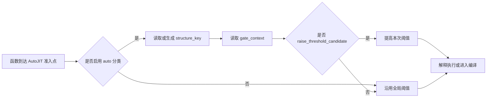
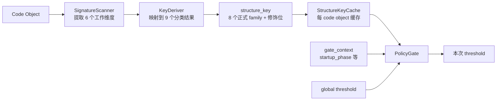
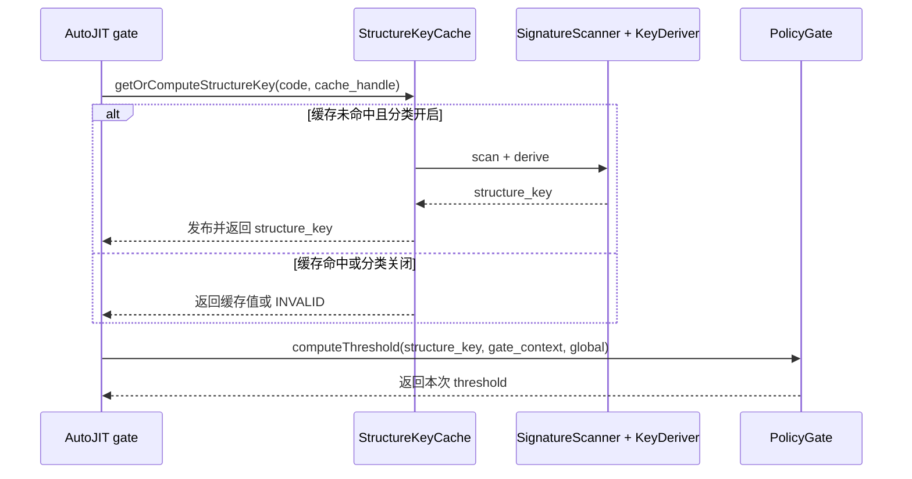
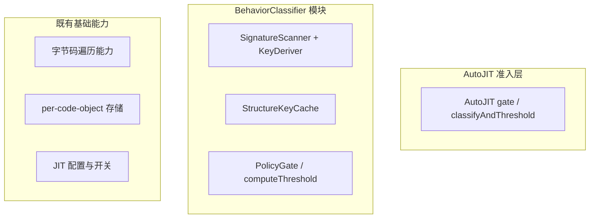

# 功能设计说明书 — 自适应 AutoJIT 行为模式分类

## 1 产品版本&密级

| 项 | 内容 |
|---|---|
| 产品 | CinderX JIT（**目标 Python 3.14+**，含 Static Python） |
| 特性 | 自适应 AutoJIT 行为模式分类（Behavior Pattern Classification） |
| 版本 | v0.3（草案） |
| 密级 | 内部公开 |
| 适用分支 | `codex/hot-loop-osr-lightweight-docs` 及后续 AutoJIT 演进分支 |

## 2 拟制信息

| 角色 | 信息 |
|---|---|
| 拟制 | CinderX 性能优化组 |
| 日期 | 2026-06-01 |
| 上游需求 | `docs/design/autojit-behavior-classification/【需求分析】AutoJIT 行为模式分类.md` |
| 关联 Issue | sisibeloved/cinderx#3《探索基于行为模式的自适应 AutoJIT 阈值策略》 |
| 评审 | 待评审（已过一轮 Codex 对抗式审查，三项 high/medium 已闭环） |

## 3 修订记录

| 版本 | 日期 | 修订人 | 修订说明 |
|---|---|---|---|
| v0.1 | 2026-06-01 | 性能优化组 | 首版。依据需求文档 R1–R26 与源码实测，拆分 4 个功能项，定义逻辑接口、调用路径与 DFX。 |
| v0.2 | 2026-06-02 | 性能优化组 | 根据 Phase 0 C++ dump 与 gdb 定位更新证据边界：冻结 gate-side 分类 schema/Mixed 红线，禁止 `jitVectorcall` 内 frame/code metadata import-stack 采样，并将安全 import signal provider 与策略/default A/B 列为 v1 release gate。 |
| v0.3 | 2026-06-02 | 性能优化组 | 按功能设计模板优化表达：前置功能目标、使用边界、模块关系和验收口径，弱化代码级实现细节。 |

## 4 Keywords 关键词

AutoJIT、行为签名、structure_key、特化观测、编译准入阈值、free-threaded 发布、osr backedge、Static Python、compile storm。

## 5 Abstract 摘要

本功能要解决的问题很直接：AutoJIT 现在用同一个调用次数阈值对待所有函数，低阈值会在启动期和 import 阶段把大量低收益函数推去编译，形成 compile storm。v1 不试图一次做完整自适应策略，而是先给每个函数打一个稳定的行为标签 `structure_key`，再在准入点只对明确低收益或高风险的候选函数提高编译阈值。

功能设计的核心边界是：**分类器负责回答“这个函数像哪类工作、是否值得马上编译”，策略只负责“本次阈值是否需要后移”。** v1 输出 `structure_key + gate_context`，不输出特化 band，不做在线反馈，不持久化 profile。2026-06-02 Phase 0 C++ dump 已证明分类 schema 可以作为编码起点；生产默认策略还必须通过 `PYTHONJITAUTO=auto[:N]` 相对数值 `N` 的 A/B、相邻参数比较，以及安全 import signal provider 的 Phase 0.5/gdb 验证后才能冻结。

## 6 List of abbreviations 缩略语清单

| 缩略语 | 英文全称 | 中文名 |
|---|---|---|
| JIT | Just-In-Time compilation | 即时编译 |
| OSR | On-Stack Replacement | 栈上替换 |
| HIR | High-level Intermediate Representation | 高层中间表示 |
| ROI | Return On Investment | 收益成本比 |
| AE | Acceptance Example | 验收示例 |
| FT | Free-Threaded (Python) | 自由线程 Python |
| CFG | Control Flow Graph | 控制流图 |
| SP | Static Python | 静态 Python |
| DFX | Design for X | 面向 X 的设计 |
| FMEA | Failure Mode and Effects Analysis | 失效模式与影响分析 |
| PGO | Profile-Guided Optimization | 基于剖析的优化 |
| SR | System Requirement | 系统需求 |

## 7 前言

本文档是上游需求文档（`docs/design/autojit-behavior-classification/【需求分析】AutoJIT 行为模式分类.md`，下称"需求文档"，其条目以 R1–R26、KD1–KD8、AE1–AE12 引用）的功能设计落地。读者对象为 CinderX JIT 开发者与评审。本文档聚焦**模块对功能的实现方式、模块间逻辑接口与调用路径**，以语言无关伪代码描述新增逻辑；对既有 C/C++ 结构（如 `CodeExtra`、`jitVectorcall`、`BytecodeInstruction`）仅作为集成边界引用，不重述其实现。具体到某语言/运行环境的内部实现留待详细设计。第一可信源为项目代码，关键设计点均标注已核实的源码位置。

---

# 8 功能域：自适应 AutoJIT 行为模式分类

## 8.1 功能域概述

### 8.1.1 功能域总述

当前 AutoJIT 像一把同样刻度的尺子：只看“这个函数被调用了多少次”，不看“它是哪类函数”。这在低阈值实验里会把大量启动期、import 期、薄包装和生成代码推入 JIT，编译成本先发生，运行收益却未必能收回来。

本功能域引入一个行为分类器，让 AutoJIT 在编译前多看一眼函数的静态行为，把“所有函数共享一个阈值”升级为“不同类型函数可以有不同准入倾向”。v1 的目标不是做复杂策略，而是完成一个可验证的最小闭环：

| 读者关心的问题 | v1 回答 |
|---|---|
| 面向谁 | CinderX JIT 准入路径、性能优化人员、后续阈值策略/反馈系统 |
| 解决什么 | 低阈值 AutoJIT 在 startup/import 和低 ROI 函数上产生 compile storm |
| 输入是什么 | gate 可达 code object、当前全局阈值、当次 gate 上下文 |
| 输出是什么 | 稳定 `structure_key`、当次 `gate_context`、最终 `compile threshold` |
| 直接收益 | 推迟明确低收益/高风险候选函数的编译，减少启动期编译浪费 |
| 不做什么 | 不消费 HIR，不做 profile 持久化，不做完整在线反馈，不在 v1 实现特化 band |
| 发布门槛 | provider gdb/Phase 0.5、`auto[:N]` vs `N` A/B、相邻默认参数比较 |

整体流程如下：



弱特化观测、完整阈值映射以及 pattern 级在线反馈属下游功能域；本设计仅保留 Phase-3 参考接口，v1 不实现、不读取 `specialization_band`。

### 8.1.2 核心分类模型

本功能的核心不是“多扫一遍字节码”，而是把函数先拆成 **6 个工作维度**，再收敛成读者和策略都能理解的 **9 个分类结果**。其中 8 个是 v1 `structure_key` 的正式 family，`InitCodeDiagnostic` 是 Phase 0 诊断分类，不进入 `structure_key`，但在读报告时也需要作为一类结果理解。

**6 个工作维度：函数主要在做什么**

| 工作维度 | 通俗解释 | 典型信号 | 对阈值策略的意义 |
|---|---|---|---|
| `compute` | 算术、比较、数值处理 | 数值运算、比较、类型化 primitive 运算 | 有 loop 时通常 JIT 收益高，应避免误推迟 |
| `control` | 分支、异常、状态机式控制流 | 条件跳转、异常处理、merge 密度 | 控制流复杂会增加编译成本和不确定性 |
| `object` | 属性、容器、对象搬运 | 属性读写、下标访问、容器构造/更新 | 收益依赖对象形态稳定性，适合单独聚合 |
| `dispatch` | Python 调用和分发 | call、method invoke、handler dispatch | 调用密度高但函数本体可能很薄，需和 loop/static 区分 |
| `suspend` | generator/coroutine/async | yield/send/await/async 状态迁移 | 状态机复杂，常作为风险/延迟信号 |
| `dynamic` | 名字查找、反射、模板/动态代码 | global/name/deref、format/template、生成代码元数据 | 静态可预测性弱，startup/import 中常见 |

**9 个分类结果：策略最终看到什么**

| 分类结果 | 类型 | 来源/触发条件 | 策略含义 |
|---|---|---|---|
| `NumericLoop` | 正式 family | `compute` 主导；是否真的有 loop 由 `loop_score` 修饰 | 数值/类型化计算，尤其有 loop 时通常保留全局阈值 |
| `BranchFSM` | 正式 family | `control` 主导 | 控制流/状态机函数，风险由修饰位进一步决定 |
| `ObjectManipulator` | 正式 family | `object` 主导 | 对象/容器搬运型函数，单独聚合便于后续 ROI 反馈 |
| `CallDispatcher` | 正式 family | `dispatch` 主导 | 分发器/调用密集函数，无 loop 时可能是 defer candidate |
| `AsyncStateMachine` | 正式 family | `suspend` 主导或可挂起结构明显 | async/generator 状态机，常带较高编译风险 |
| `ReflectionMeta` | 正式 family | `dynamic` 主导 | 动态名字/反射/模板类函数，startup/import 中需重点观察 |
| `Trivial` | 正式 family | 六个维度都低于 floor | 薄 getter/forwarder/包装函数，典型低 ROI |
| `Mixed` | 正式 family | 两个强维度接近，无法安全选单一主族 | 保守兜底，同时记录 top-2 `mixed_shape` 保留解释力 |
| `InitCodeDiagnostic` | 诊断分类 | module/class body 等不可达 AutoJIT gate 的初始化代码 | 只出现在 Phase 0 诊断，不生成 v1 `structure_key` |

工作原理可以概括为：先按六个维度计数和分桶；如果全都弱，进入 `Trivial`；如果两个强维度接近，进入 `Mixed`；否则由最强维度映射到主 family；最后附加 `loop_score/is_static/is_suspendable/high_risk/is_synthetic` 等修饰位，形成稳定 `structure_key`。

## 8.2 功能域总体方案

### 8.2.1 模块划分

新增单一模块 **行为分类器（BehaviorClassifier）**。它只做一件事：在 AutoJIT gate 上提供稳定分类和本次阈值建议。v1 内部分成 3 个协作子部件；Phase-3 特化观测仅作为 8.5 参考附录，不属于 v1 模块职责。

| 子部件 | 功能项 | 职责 |
|---|---|---|
| 签名扫描与派生（SignatureScanner + KeyDeriver） | 功能项 1（8.4） | 把函数分到稳定行为类别，例如数值循环、分发器、对象操作、动态反射、薄包装 |
| 结构身份缓存（StructureKeyCache） | 功能项 3（8.6） | 让每个 code object 的分类结果只计算一次，后续 gate 快速读取 |
| 准入点集成（PolicyGate） | 功能项 4（8.7） | 读取分类和上下文，给出本次阈值；分类失败或关闭时回到现状 |

模块边界：

| 边界 | 说明 |
|---|---|
| 分类器输入 | code object 的静态字节码/flags、当前 gate 上下文、全局阈值 |
| 分类器输出 | `structure_key`、`gate_context`、`threshold` |
| 分类器不负责 | JIT 编译本身、HIR 优化、profile 持久化、在线学习 |
| 下游可依赖 | `structure_key` 是唯一聚合身份；`gate_context` 只影响本次 gate，不落库 |

### 8.2.2 模块级 4+1 视图

**逻辑视图（Logical）**

逻辑视图关注模块间调用关系和行为流转。第一幅图说明数据如何从 code object 变成阈值，第二幅图说明一次 gate 中各逻辑模块如何协作。





code object 先被扫描成 6 个工作维度，再派生为分类结果和 `structure_key`，最后和 `gate_context/global threshold` 一起进入阈值决策。缓存命中时不会重新扫描；分类关闭或缓存失败时返回 INVALID，由 gate 回退现状阈值。

**进程视图（Process）**

进程视图关注进程间交互。本功能没有新增进程、后台 worker、IPC、跨进程共享状态或进程生命周期变化；分类在 AutoJIT 准入路径同步执行，仍处于调用线程所在的 CinderX 进程内。因此进程视图不单独画交互图。

**开发视图（Development）**



开发视图关注代码组织和从属关系：AutoJIT 准入层调用 BehaviorClassifier；BehaviorClassifier 内部由扫描派生、缓存、策略门三个子部件组成；底层复用既有字节码遍历、per-code-object 存储和 JIT 配置能力。图中不画调用箭头，调用关系由逻辑视图表达。

**物理/部署视图（Physical）**

部署视图关注物理节点、网络、容器、跨进程部署和外部系统边界。本特性完全在 CinderX 进程内运行，无网络/分布式形态，不新增部署单元，不改变容器或主机拓扑。因此部署视图不涉及，不单独画图。

**场景视图（Scenarios）**：v1 关注三类典型场景：(1) 应保留现状阈值的高收益函数，如数值循环和 Static Python 类型化函数；(2) 应后移阈值的低收益/高风险候选，如薄包装、部分 synthetic、startup/import 普通函数；(3) 必须保持稳定的分类与回退，如不同预热程度下 `structure_key` 不漂移、并发首次分类不读半初始化状态。AE10 特化多态回归随 Phase-3 特化观测实现。

### 8.2.3 总体调用路径变更（功能域级）

**变更前（现状：只看调用次数）**

```
jitVectorcall(func)
  ├─ limit = config.compile_after_n_calls
  ├─ calls = countCalls(code)
  └─ calls < limit ? 解释 : 编译
```

**变更后（v1：先分类，再按最小策略调整阈值）**

```
jitVectorcall(func)
  ├─ calls = read calls
  ├─ sk    = read-or-compute structure_key
  ├─ ctx   = read gate_context
  ├─ limit = computeThreshold(sk, ctx, global)
  │         ├─ 分类关 / 分类失败 → 沿用全局阈值
  │         ├─ low_roi / startup-init / risk-defer → 提高阈值
  │         └─ 其它函数 → 沿用全局阈值
  └─ calls < limit ? 解释 : 编译
```

## 8.3 功能域规格设计

| 规格项 | v1 规格 | 验收口径 |
|---|---|---|
| 稳定身份 | 每个 gate 可达 code object 恰好一个 `structure_key`；同一 code object 不因预热程度改变身份 | AE8、AE11 |
| 有界分类 | 9 个分类结果：8 个正式 `structure_key` family + 1 个 Phase 0 诊断分类；`Mixed` 子形态 ≤ 15 | Phase 0 summary + AE12 |
| 清晰边界 | `structure_key` 用于聚合；`gate_context` 只影响本次 gate；Phase-3 band 不进入 v1 | 接口评审 + AE8 |
| 可回退 | 分类关闭、分类失败、缓存失败时逐函数回到现状全局阈值 | `PYTHONJITAUTO=N` A/B |
| 可生产化 | provider、policy/default、synthetic/risk-defer 都有 release gate | Provider gate + Policy A/B |
| 低开销 | 首次扫描一次，命中缓存后 O(1) 读取；准入路径不能成为新热点 | startup/stable micro-bench |

---

## 8.4 功能项 1：行为签名提取与 structure_key 派生

### 8.4.1 功能概述

#### 8.4.1.1 功能项总述

这个功能项负责给函数“贴标签”。标签不是给人看的分类名，而是后续策略和统计都能稳定复用的 `structure_key`。一个好标签要满足三点：同一个函数永远贴同一个标签；标签数量不能爆炸；标签要能区分“值得早点编译”和“更适合晚点编译”的行为差异。

| 项 | 内容 |
|---|---|
| 输入 | gate 可达 code object 的字节码、flags、可静态识别的结构信息 |
| 输出 | `StructureKey(family, mixed_shape, modifiers)` |
| 核心能力 | 识别函数主要工作类型，并保留 loop/static/synthetic/risk 等影响 ROI 的修饰位 |
| 不处理 | 不判断运行期类型，不读取 HIR，不把 startup/import 上下文写进 key |
| 主要收益 | 下游策略可以按稳定模式聚合统计，不会因为同一函数预热程度不同而切碎 |
| 主要风险 | 分类过粗会失去策略价值；分类过细会让反馈统计稀释 |

Phase 0 诊断 scanner 额外识别不可达 module/class body 为 `InitCodeDiagnostic`，但该诊断桶不属于 v1 `structure_key`。覆盖需求 R1–R10、R12–R20、R22–R25。

### 8.4.2 实现思路

分类过程分三步：

1. **看主要工作类型。** 把字节码行为归到 compute / control / object / dispatch / suspend / dynamic 六个工作维度，每条指令只贡献给一个维度，避免重复计数。
2. **看影响收益的结构信息。** 额外记录 loop 强度、Static Python、可挂起、风险和 synthetic/generated 等修饰位。这些信息不改变“主族”，但会影响阈值策略。
3. **产出稳定 key。** 明显单一主导的函数落到主族；多个维度接近时落 `Mixed`，并保留 top-2 组合；极薄函数落 `Trivial`。最终 key 只由静态结构决定。

设计上刻意把两类信息分开：`structure_key` 是稳定身份，`gate_context` 是本次调用的上下文。startup/import 只影响本次阈值，不改变函数身份。

### 8.4.3 实现设计

#### 8.4.3.1 工作维度设计

工作维度描述函数“主要在做什么”，不是描述具体 opcode 实现。具体 opcode 清单、Static Python 编码和版本差异由详细设计和源码表维护；功能设计只规定分类语义。

| 工作维度 | 通俗含义 | 典型收益/风险含义 |
|---|---|---|
| compute | 算术、比较、数值处理 | 如果有 loop，通常 JIT 收益高 |
| control | 分支、异常、状态机式控制流 | CFG 复杂度可能提高编译成本 |
| object | 属性、容器、对象搬运 | 收益依赖访问形态和对象稳定性 |
| dispatch | Python 调用、分发器 | 调用密度高但本体可能较薄 |
| suspend | generator/coroutine/async | 状态机复杂，编译风险更高 |
| dynamic | 全局/名字/模板/动态代码 | 静态可预测性较弱 |

未体现业务语义的指令归为中性。旧版本 opcode 不进入目标 3.14+ 家族表；新增版本通过扩表保持兼容。

#### 8.4.3.2 loop_score 派生设计

`loop_score` 是 v1 最重要的收益信号之一，因为 JIT 收益通常来自循环内反复执行的代码。v1 把 loop 分为 0–3 四档：无 loop、简单 loop、多 loop/浅嵌套、深嵌套/大量 loop。

实现上只要求分类器能在同一次字节码遍历中收集 loop 结构信息，不触发 OSR 编译，不额外引入第二条扫描链路。bootstrap 映射使用 Phase 0 起点值；进入生产默认策略前按 release gate 重新验证。

#### 8.4.3.3 派生流水线设计

| 步骤 | 判断 | 输出 |
|---|---|---|
| 可达性分流 | 不是 AutoJIT gate 可达的初始化代码 | Phase 0 诊断桶 `InitCodeDiagnostic`，不生成 v1 key |
| 薄函数过滤 | 所有工作维度都低于 floor | `Trivial` |
| 分桶 | 按密度和绝对 floor 给六个维度打 0–3 桶 | 维度强弱分布 |
| Mixed 判断 | top-1/top-2 足够接近且都不弱 | `Mixed(top2 shape)` |
| 主族选择 | 有明确主导维度 | `NumericLoop` / `CallDispatcher` / 等主族 |
| 修饰位合成 | loop/static/suspend/risk/synthetic | 完整 `structure_key` |

#### 8.4.3.4 单次遍历设计

单次遍历只收集功能设计需要的逻辑信息：

| 收集项 | 用途 |
|---|---|
| 六个工作维度计数 | 决定 family / Mixed |
| 有效指令数 | 计算密度，避免大函数和小函数不可比 |
| loop 结构 | 生成 `loop_score`，识别高收益循环 |
| 异常/动态/async 等子信号 | 派生 `high_risk`，不重复计入主族 |
| 稳定元数据 | 派生 `is_static`、`is_suspendable`、`is_synthetic` |

Phase-3 特化观测可复用类似遍历思路，但 v1 不采集、不缓存、不读取该信号。

### 8.4.4 增量SR清单

| SR 编号 | 描述 | 对应需求 |
|---|---|---|
| SR-CLS-01 | 提供 `deriveStructureKey(code)`，对任意 code object 产出唯一族 | R15/R19 |
| SR-CLS-02 | 维护覆盖 3.14 基础 + Static Python 两类 opcode 的家族表，按家族匹配 | R23/R24/KD5 |
| SR-CLS-03 | 由 OSR backedge 派生 `loop_score`（0–3） | R7 |
| SR-CLS-04 | 由 `co_flags`/`CI_CO_STATICALLY_COMPILED` 派生结构修饰位 | R9/R10 |
| SR-CLS-05 | risk 由已分配计数派生，不重复计 opcode | R8/R25 |
| SR-CLS-06 | density 分桶带 floor，argmax 选族带 benefit-first tie-break/Mixed | R14/R15/R16 |

### 8.4.5 实现接口设计

#### 8.4.5.1 实现接口设计（说明）

功能项 1 对外暴露一个纯函数式接口 `deriveStructureKey`，输入只读 code object，输出值类型 `StructureKey`。无副作用（特化观测旁路写入由功能项 2 承接，且只读特化态）。内部家族表为编译期常量。

#### 8.4.5.2 实现接口定义（逻辑接口，语言无关）

```
type WorkDim   = enum { compute, control, object, dispatch, suspend, dynamic }
type Family    = enum { NumericLoop, BranchFSM, ObjectManipulator,    // T2.4: 去 ScalarCompute
                        CallDispatcher, AsyncStateMachine, ReflectionMeta,
                        Trivial, Mixed }                              // 共 8 个
type MixedShape = enum { none, pair(compute,control), ... }            // 仅 Mixed 使用；canonical unordered pair，≤15
type Modifiers = record { loop_score: 0..3, is_suspendable: bool,
                          is_static: bool, high_risk: bool,
                          is_synthetic: bool }
type StructureKey = record { family: Family, mixed_shape: MixedShape,
                             modifiers: Modifiers }                   # 即聚合身份
type GateContext  = record { startup_phase: bool }                    # 安全 import signal provider 冻结来源；不入 key / 不聚合

interface deriveStructureKey(code: ReadOnlyCode) -> StructureKey      # 确定、纯函数
```

### 8.4.6 功能规格设计

- 单次扫描复杂度 O(指令数)；不分配大对象（计数器为栈上小数组）。
- 确定性：对同一 code object 的字节码 + `co_flags`，输出恒定（R20）。
- 穷尽：返回族集合覆盖全部输入，无"未知"（R19）。

### 8.4.7 DFX分析

#### 8.4.7.1 可靠性分析

##### FMEA分析

| 失效模式 | 原因 | 影响 | 缓解 |
|---|---|---|---|
| 新 opcode 漏归类 | 版本升级新增 opcode 未入表 | 落入 NEUTRAL，密度被低估 | 家族表按家族匹配 + 单元测试对全 opcode 集合断言有归属；未知 opcode 计入分母但不致崩溃 |
| 选族抖动 | 维度近并列 | 同类函数分到不同族 | Mixed 兜底（R16）+ canonical top-2 `mixed_shape`（T3.7）+ benefit-first 固定 tie-break（T3.8）；正交性规则（R25）减小相关维度耦合 |
| loop 嵌套误判 | 非规约后向边/异常跳转 | loop_score 偏高/偏低 | 只识别语义明确的后向跳转；异常跳转归 control，不计 loop |

#### 8.4.7.2 可服务性分析

提供 Phase 0 诊断输出：先落一条不接入 policy 的 scanner/dump 路径，对给定 code object dump `(workdim counts, buckets, family, mixed_shape, modifiers, structure_key, gate_context, startup_signal_mask, diagnostic_bucket)`，便于分布采样与标定。Phase 0 scanner 可用 bootstrap defaults 起跑：`count_floor=2`、density cutoff `0.10/0.25/0.50`、`MIXED_BUCKET_DELTA=1`、`MIXED_MIN_BUCKET=2`、`loop_score=max(nesting_score,count_score)`。2026-06-02 C++ gate-side dump（`scratch/autojit_phase0/results/blue-98-20260602-cpp/report.md`）已通过 schema 红线：`process_count=53`、`observed_records=417389`、`gate_reachable=416381`、`storm_candidates_reached_threshold=30605`、`compiled_records=23446`、`Mixed(storm)=2.9%`。因此这些 bootstrap defaults 可作为 v1 编码起点；进入 gate/cache/policy 后分类 schema/config 仍按 T3.11 进程内不可变，已缓存 `skey_word` 不失效。生产 policy/default 冻结还需 A/B 与相邻 cutoff/floor/δ/loop 配置比较，不能仅由 Mixed/family 红线推出。

`diagnostic_bucket=InitCodeDiagnostic` 用于缺 required flags / `<module>` 的不可达初始化代码；`mixed_shape` 用于解释 `Mixed` 分布是否集中在少数 top-2 组合；`startup_signal_mask` 同时记录 importlib/module initializing、安全 import 状态 provider、早期进程窗口等候选信号。注意：Phase 0 C++ gdb 证据禁止在 `jitVectorcall` 内遍历 Python frame/code metadata 来采样 `import_stack`；`module_initializing` 在 clean summary 中只覆盖 795/30605 个 storm，不能单独作为 `startup_phase`；`early_window` 只能作辅助/对照信号。`gate_context.startup_phase` 必须等安全 import signal provider 复跑通过覆盖率/误伤率后，才冻结为热路径 bool。建议复用既有 JIT 日志开关风格（如 `PYTHONJITDUMPHIRSTATS` 的形态）。

#### 8.4.7.3 安全设计检查

##### 安全设计确认

仅读取 code object 既有不可变字节码与 flags，不解析外部输入、不分配可被外部规模放大的缓冲。无新增攻击面。

##### 敏感操作检查

**不涉及**敏感操作（无文件/网络/权限/进程控制）。

#### 8.4.7.4 可用性/性能分析

单次扫描在首次调用发生一次；命中缓存后该功能项不再执行（功能项 3）。扫描成本相对"被推迟的一次编译"可忽略，须以启动期 micro-bench 实测确认（R21，Outstanding）。

### 8.4.8 影响点列表

| 影响点 | 说明 |
|---|---|
| `cinderx/Jit/bytecode.*` | 复用归一接口；可能新增"isExceptionOpcode/家族查表"辅助 |
| `cinderx/Jit/osr.*` | 沿用后向边 opcode 语义；不调用 `collectBackedgeTargetOffsets`，端点在分类器扫描内收集 |
| 新增 `cinderx/Jit/behavior_classifier.*` | 承载本功能项主体 |

### 8.4.9 分配需求

承接需求文档 R1–R16、R19、R22–R25；为功能项 3（缓存）提供被缓存的 `StructureKey` 值；为功能项 4（接口）提供聚合身份输入。

---

## 8.5 Phase-3 参考：特化观测旁路信号（v1 不实现）

> **⚠ v1 不实现（审校 T2.2）：** T3.1(b) 最小策略不读 `specialization_band`，本功能项整条 **defer 到 Phase-3**（与计数式真稳定性信号一起做）。下文为 Phase-3 设计参考；v1 的 `gate_view` 仅含 `structure_key + gate_context`（T3.4），不含 `specialization_band`。

### 8.5.1 功能概述

#### 8.5.1.1 功能项总述

本节只保留 Phase-3 设计意图，不属于 v1 交付。它想解决的问题是：解释器特化状态能不能作为“这个函数可能更适合 JIT”的旁路提示。

结论是谨慎使用。特化状态只能说明“这个函数曾经热过或曾经单态”，不能证明“现在仍稳定”。因此 Phase-3 即使恢复该信号，也只能作为本次 gate 的小幅微调输入，不能进入 `structure_key`，不能作为统计聚合键。

| 项 | Phase-3 参考边界 |
|---|---|
| 输入 | code object 的特化存在性 |
| 输出 | low/mid/high 的旁路信号 |
| 可做 | 对已经偏向编译或延迟的函数做小幅阈值修正 |
| 不可做 | 不得单凭高特化比例提前编译高 deopt 风险函数 |
| v1 状态 | 不实现、不缓存、不读取 |

### 8.5.2 实现思路

Phase-3 的实现思路是把“特化存在性”离散成少数几个 band，并用滞回避免在边界附近来回跳。它和 `structure_key` 的关系必须保持单向隔离：分类身份不依赖 band，统计聚合不包含 band，策略只在本次 gate 临时读取 band。

### 8.5.3 实现设计

#### 8.5.3.1 特化态判定设计

不涉及 v1。Phase-3 只需保证两点：一是分母只包含可特化指令，二是该信号和工作维度分类互不污染。具体判定表和读取方式由详细设计或 Phase-3 设计单独展开。

#### 8.5.3.2 比例与滞回设计

Phase-3 使用 low/mid/high 三档，而不是连续比例。进入高档和跌出高档使用不同阈值，避免相邻 gate 上阈值来回翻转。刷新频率属于 Phase-3 待定项，v1 不承担该开销。

### 8.5.4 Phase-3 参考 SR（不纳入 v1）

| SR 编号 | 描述 | 对应需求 |
|---|---|---|
| SR-SPEC-01 | 提供 `readSpecializationBand(code)`，输出 low/mid/high | R11 |
| SR-SPEC-02 | 带滞回的带跃迁，进/出高带不同 cutoff | R20 |
| SR-SPEC-03 | 与归一遍历同次采集、互不污染；不进 structure_key | R22/R18 |

### 8.5.5 实现接口设计

#### 8.5.5.1 实现接口设计（说明）

弱信号接口，输出仅消费于功能项 4 的 gate 微调；严格禁止流入功能项 3 的聚合身份与下游统计聚合键。

#### 8.5.5.2 实现接口定义（逻辑接口，语言无关）

```
type SpecBand = enum { low, mid, high }
interface readSpecializationBand(code: ReadOnlyCode) -> SpecBand   # 自适应、带滞回
// 约束：SpecBand 不得作为 map/统计的 key 组成部分
```

### 8.5.6 功能规格设计

- 弱语义：仅产生有限幅度的阈值微调，单凭高 band 不得把高 deopt 风险函数判为"应提前编译"（AE10）。
- 旁路隔离：band 不出现在任何聚合键中（R18）。

### 8.5.7 DFX分析

#### 8.5.7.1 可靠性分析

##### FMEA分析

| 失效模式 | 原因 | 影响 | 缓解 |
|---|---|---|---|
| 误把"曾单态"当"现稳定" | 特化形态 miss 后保留 | 多态函数被高估，提前编译→deopt | 弱语义限幅 + AE10 多态回归；真稳定信号（计数式）列为 Deferred |
| 带抖动 | presence 在 cutoff 附近 | 相邻 gate 阈值翻转 | 滞回（R20）；惰性刷新降低频率 |

#### 8.5.7.2 可服务性分析

诊断 dump 可附带 `(presence, band)`，与 `structure_key` 分列展示，强调其旁路、非聚合属性。

#### 8.5.7.3 安全设计检查

##### 安全设计确认

只读 code object 字节码特化态，无副作用、无外部输入解析。

##### 敏感操作检查

**不涉及**。

#### 8.5.7.4 可用性/性能分析

若每次 gate 重扫，成本与功能项 1 同阶；可用惰性刷新摊薄。须实测刷新频率对准入路径开销影响（R21）。

### 8.5.8 影响点列表

| 影响点 | 说明 |
|---|---|
| `cinderx/Jit/bytecode.*` | 复用 `specializedOpcode()` 覆盖集判定特化态 |
| 新增 `behavior_classifier.*` | 承载旁路统计与滞回 |

### 8.5.9 分配需求

承接 R11、KD6、R20（滞回）；为功能项 4 提供 `specialization_band` 微调输入；与功能项 1 共享单次遍历。

---

## 8.6 功能项 3：structure_key 缓存与 free-threaded 发布

### 8.6.1 功能概述

#### 8.6.1.1 功能项总述

这个功能项负责让“贴标签”只发生一次。分类本身虽然便宜，但 AutoJIT gate 是热路径；如果每次 gate 都重新扫描字节码，分类器就可能变成新的开销来源。

| 项 | 内容 |
|---|---|
| 输入 | code object、功能项 1 产出的 `structure_key` |
| 输出 | 可重复读取的缓存结果，或明确的 INVALID 回退信号 |
| 核心能力 | 首次分类后缓存，后续 gate O(1) 读取 |
| 失败行为 | 缓存不可用时回退全局阈值，不影响正确性 |
| 并发要求 | FT 构建下不能读到半初始化 key |
| 不做什么 | 不支持运行期调参后让旧 key 自动失效 |

分类 schema/config 在进入 gate/cache/policy 前冻结，缓存命中后不做运行期失效或版本比对（T3.11）。覆盖 R21、R26、KD8。

### 8.6.2 实现思路

缓存方案遵循三个原则：

1. **只发布一个完整结果。** valid 标志和 key payload 作为同一个发布单元，避免读侧看到半成品。
2. **并发首次分类允许良性重复。** 因为分类是冻结配置下的纯函数，多线程同时算出的结果应逐位一致。
3. **失败即回退。** 缓存载体不可用时，不阻塞、不崩溃、不改变语义，直接使用全局阈值。

具体字段布局、原子 helper 和结构体扩展由详细设计落地。

### 8.6.3 实现设计

#### 8.6.3.1 缓存内容设计

缓存只保存 v1 需要的稳定身份，不保存诊断字符串，不保存 Phase-3 特化 band，不保存运行期反馈。字符串展示只用于 dump/log 解码，不能成为热路径或聚合主表示。

#### 8.6.3.2 发布/读取设计

| 场景 | 行为 |
|---|---|
| 缓存命中 | 直接返回已发布 `structure_key` |
| 缓存未命中 | 调用功能项 1 计算并发布 |
| 并发首次 | 允许重复计算；结果必须一致 |
| 缓存不可用 | 返回 INVALID，由功能项 4 回退全局阈值 |

#### 8.6.3.3 失败回退设计

任何缓存失败都只影响性能收益，不影响语义。功能项 4 收到 INVALID 后按现状全局阈值继续，绝不读取部分初始化状态。

### 8.6.4 增量SR清单

| SR 编号 | 描述 | 对应需求 |
|---|---|---|
| SR-CACHE-01 | 提供 per-code-object 的 `structure_key` 缓存 | R21/R26 |
| SR-CACHE-02 | 缓存发布/读取在 FT 构建下不读半初始化状态 | R26/KD8 |
| SR-CACHE-03 | 并发首次计算良性竞态（纯函数逐位相等）或 compare_exchange 单发布 | R26 |
| SR-CACHE-04 | 缓存不可用→返回 INVALID，由 gate 回退默认阈值 | KD8(c) |

### 8.6.5 实现接口设计

#### 8.6.5.1 实现接口设计（说明）

缓存接口对功能项 4 暴露 `getOrComputeStructureKey`（含发布逻辑）。所有跨线程可见字段必须通过并发安全的发布/读取方式访问。Phase-3 若恢复 `band` 旁路读写，须与 `structure_key` 缓存保持类型与聚合键隔离。

#### 8.6.5.2 实现接口定义（逻辑接口，语言无关）

```
interface getOrComputeStructureKey(code, cache_handle) -> StructureKey | INVALID
// cache_handle 由 AutoJIT gate helper 提供；具体承载字段见详细设计
```

### 8.6.6 功能规格设计

- 每 code object `structure_key` 至多计算 O(线程数) 次（良性重复），命中后 O(1)。
- 读取永不撕裂、永不读半初始化状态。
- 分类配置进程内冻结；缓存命中后不失效、不版本比对、不重算。
- 回退路径不崩、不泄漏。

### 8.6.7 DFX分析

#### 8.6.7.1 可靠性分析

##### FMEA分析

| 失效模式 | 原因 | 影响 | 缓解 |
|---|---|---|---|
| 读到半初始化 key | 值/标志分离发布 | 误用错误阈值 | key 与 valid 状态作为同一个完整结果发布 |
| 撕裂读 | 非安全访问缓存字段 | 错误 key | 缓存读写使用并发安全访问方式 |
| 运行期修改分类配置 | cutoff/floor/δ/tie-break 等在已有 key 后变化 | 已缓存 key 与新配置不一致 | 不支持运行期修改；Phase 0 可反复调参，进入 gate/cache/policy 后配置冻结，变更需新进程或清空 code objects（T3.11） |
| 分配失败崩溃 | OOM/shutdown | 准入路径异常 | 返回 INVALID + 回退默认阈值（不崩） |

#### 8.6.7.2 可服务性分析

诊断可输出某 code object 是否已有缓存、解码后的 `structure_key`，辅助排查"为何走默认阈值"（即回退命中）。

#### 8.6.7.3 安全设计检查

##### 安全设计确认

复用既有 per-code-object 扩展存储和生命周期管理，不新增独立所有权模型。

##### 敏感操作检查

涉及**并发内存发布**这一敏感点：禁止裸读写跨线程字段。具体原子访问方式由详细设计约束。无文件/网络/权限操作。

#### 8.6.7.4 可用性/性能分析

命中后零额外成本；未命中一次扫描。FT 下良性重复计算最多 N(线程) 次，概率低且每次 O(n)，可接受。

### 8.6.8 影响点列表

| 影响点 | 说明 |
|---|---|
| per-code-object 缓存载体 | 承载 `structure_key` 缓存，具体字段见详细设计 |
| AutoJIT gate helper | 统一读取 calls、缓存句柄和 gate context |
| 行为分类器模块 | 对外提供 get-or-compute 缓存接口 |

### 8.6.9 分配需求

承接 R21、R26、KD8；向功能项 4 提供命中即 O(1) 的 `structure_key` 获取与回退信号。

---

## 8.7 功能项 4：分类器与准入点（jitVectorcall）逻辑接口集成

### 8.7.1 功能概述

#### 8.7.1.1 功能项总述

这个功能项把分类结果真正接到 AutoJIT 的“是否编译”判断上。它不改变解释路径和编译路径，只改变“本次需要达到多少调用次数才允许编译”。

| 项 | 内容 |
|---|---|
| 输入 | `structure_key`、`gate_context`、现有全局阈值 |
| 输出 | 本次 AutoJIT gate 使用的阈值 |
| 核心能力 | 对明确低收益或高风险候选函数提高阈值，其余函数保持现状 |
| 启用方式 | `PYTHONJITAUTO=auto[:N]` 开分类；数值 `N` 回到现状 |
| 回退方式 | 分类关、分类失败、缓存失败都回到全局阈值 |
| 发布门禁 | provider gate、policy A/B、synthetic/risk-defer ROI gate |

覆盖 R18、R26（回退）、KD8。特化观测 `specialization_band` 为 Phase-3 输入，v1 不读（T2.2）。

### 8.7.2 实现思路

集成方案保持最小侵入：先按现状读取调用计数，再读取分类结果和 gate 上下文，最后由 `computeThreshold(structure_key, gate_context, global)` 给出本次阈值。

v1 只识别三类需要后移编译的候选：

| 候选 | 判定意图 | 默认动作 |
|---|---|---|
| low ROI | 薄函数、部分无 loop/非 static 的 synthetic 生成代码 | 提高阈值 |
| startup-init | import/startup 阶段可达、结构上低收益的普通函数 | provider 通过后提高阈值 |
| risk-defer | 无 loop、非 static、编译风险较高的函数 | ROI 证明通过后提高阈值 |

其它函数走现状全局阈值，尤其是数值循环、Static Python 类型化函数、synthetic 高 loop/static/generated 函数，不因分类开启而默认后移。

`startup_phase` 不是结构分类器的输出。它必须来自安全 import signal provider；provider 未通过 Phase 0.5/gdb 验证前，startup-init 分支关闭。`computeThreshold` 出现第二种策略时再提升为接口（T2.1）。

### 8.7.3 实现设计

#### 8.7.3.1 准入点改造设计（调用路径前后对比）

**改造前：只按全局阈值判断**

```
jitVectorcall(func):
  limit = config.compile_after_n_calls
  if countCalls(code) < limit: return 解释路径
  return 编译路径
```

**改造后：分类失败仍然等价现状**

```
jitVectorcall(func):
  state  = readAutoJitGateState(code)
  global = config.compile_after_n_calls
  sk     = classifier.getOrComputeStructureKey(code, state.cache_handle)
  if sk == INVALID or not config.auto_classify:
      limit = global
  else:
      limit = computeThreshold(sk, state.gate_context, global)
  if state.calls < limit: return 解释路径
  return 编译路径
```

#### 8.7.3.2 策略边界设计

`computeThreshold(structure_key, gate_context, global)` 是功能域对下游的**唯一阈值决策点**。分类器只提供稳定身份；策略只决定本次阈值。这样后续从启发式升级到在线反馈时，可以替换策略而不重写分类器。

统计聚合**必须**以 `structure_key` 为键（R18）；`gate_context` 不落库、不聚合。特化观测 `specialization_band` 为 Phase-3 输入，v1 不参与（T2.2）。

### 8.7.4 增量SR清单

| SR 编号 | 描述 | 对应需求 |
|---|---|---|
| SR-GATE-01 | `jitVectorcall` 注入分类与 `computeThreshold`，保持解释/编译二分 | R18 |
| SR-GATE-02 | `computeThreshold(structure_key, gate_context, global)` 最小策略：low_roi / startup-init / risk-defer candidate 抬阈值 | T3.1b/T3.4/T3.5/T3.6 |
| SR-GATE-03 | `PYTHONJITAUTO=<N>`（分类关）/ `structure_key` 无效 → 回退全局阈值，逐函数等价现状 | R26/KD8/T2.3 |
| SR-GATE-04 | `PYTHONJITAUTO` 解析扩展为 `auto[:N]`（FlagProcessor string 重载），数值路径不变 | T2.3 |
| SR-GATE-05 | startup-init 分支必须依赖安全 import signal provider；provider 未通过 gdb smoke + Phase 0.5 复跑时分支关闭 | R12/KD2 |
| SR-GATE-06 | policy/default freeze 必须通过 `PYTHONJITAUTO=auto[:N]` vs 数值 `N` A/B，并比较至少一组相邻 cutoff/floor/δ/loop 设置 | R14/KD2 |

### 8.7.5 实现接口设计

#### 8.7.5.1 实现接口设计（说明）

对上游准入点暴露 gate helper 与 `classifyAndThreshold` 便捷封装（内部串联功能项 1+3 与 `computeThreshold`）。gate helper 负责统一读取 calls、缓存句柄与 `gate_context`。v1 无 `band`，不暴露特化观测。

#### 8.7.5.2 实现接口定义（逻辑接口，语言无关）

```
interface computeThreshold(sk: StructureKey, ctx: GateContext, global: uint) -> uint
interface readAutoJitGateState(code) -> { cache_handle, calls, gate_context }
interface classifyAndThreshold(code, gate_state) -> uint
    # 内部: if not config.auto_classify: return config.compile_after_n_calls   # PYTHONJITAUTO=N
    #       sk = getOrComputeStructureKey(code, gate_state.cache_handle)
    #       if sk==INVALID: return config.compile_after_n_calls
    #       return computeThreshold(sk, gate_state.gate_context, config.compile_after_n_calls)
// PYTHONJITAUTO 解析：=N→{auto_classify=false, global=N}；=auto[:N]→{auto_classify=true, global=N|默认}
// 聚合契约: 任何 pattern 级统计的 key == structure_key（v1 无 band）
```

`PYTHONJITAUTO` parser contract：

| 输入 | 解析结果 | 说明 |
|---|---|---|
| `-X jit-auto`（空 X-option） | `global=1`，`auto_classify=false` | 保留现状；空 env 不等价于 1 |
| 十进制 `uint32_t N` | `global=N`，`auto_classify=false` | 数值路径逐函数等价现状 |
| `auto` | `global=默认值`，`auto_classify=true` | 开分类 + 最小策略 |
| `auto:N` | `global=N`，`auto_classify=true` | 开分类，base=N |
| malformed / negative / empty env / overflow | 记录 invalid，字段保持原值 | 不静默开启分类，不静默转成阈值 1 |

### 8.7.6 功能规格设计

- 行为等价性（分类关时）：`PYTHONJITAUTO=<N>`（数值）下编译时机与现状逐函数一致（回归基线）；`=auto` 时仅 `raise_threshold_candidate` 编译时机后移。
- 可回退：分类/缓存任一不可用 → 全路径退回现有全局阈值语义。
- 边界清晰：v1 下游只见 `structure_key + gate_context`，看不到内部维度/计数；Phase-3 若恢复特化旁路信号，仍不得进入聚合键。

### 8.7.7 DFX分析

#### 8.7.7.1 可靠性分析

##### FMEA分析

| 失效模式 | 原因 | 影响 | 缓解 |
|---|---|---|---|
| 准入路径异常 | 分类器不可用或返回失败 | 函数永不编译或崩溃 | 任何 INVALID→回退默认阈值 |
| 统计被切碎 | 误用 gate 上下文或 Phase-3 信号入聚合键 | 反馈学习失真 | 接口契约强制聚合键==structure_key；AE8/代码评审守门 |
| 灰度回退失败 | 改造耦合过深 | 无法快速止血 | 默认策略薄封装 + 单一注入点，开关即回退 |

#### 8.7.7.2 可服务性分析

提供开关：禁用分类（直接走默认阈值）以隔离问题；诊断可打印每函数 `(structure_key, mixed_shape, gate_context, diagnostic_bucket, chosen_limit, 是否回退)`。

#### 8.7.7.3 安全设计检查

##### 安全设计确认

仅在既有准入路径内增加只读分类与一次策略查询，无新增外部交互面。

##### 敏感操作检查

涉及**改变编译准入决策**（影响性能而非正确性）。约束：决策仅影响"何时编译"，不改变编译产物语义；最坏情形退回现状阈值。无文件/网络/权限敏感操作。

#### 8.7.7.4 可用性/性能分析

准入路径新增：一次缓存命中读取（O(1)）+ 一次策略查询（默认 O(1)）。gate helper 统一读取 calls 与缓存句柄，避免重复访问 per-code-object 存储。首次另含一次扫描。须以启动期与稳态 micro-bench 验证准入路径无显著回归（R21）。

### 8.7.8 影响点列表

| 影响点 | 说明 |
|---|---|
| `cinderx/Jit/pyjit.cpp` (`jitVectorcall`) | 注入分类与策略查询（唯一准入改造点） |
| 新增 `computeThreshold` 自由函数 | v1 最小策略（low_roi / startup-init / risk-defer candidate 抬阈值，T3.1b/T3.4/T3.5/T3.6/T2.1）；下游升级时提升为接口 |
| 配置/开关 | 扩展 `PYTHONJITAUTO` 解析为 `auto[:N]`（复用既有 env，不新增；FlagProcessor string 重载，T2.3） |

### 8.7.9 分配需求

承接 R18、R20、R26、KD2/KD8；对下游功能域（阈值映射、在线反馈）输出 `structure_key + gate_context` 逻辑接口与聚合契约。Phase-3 若恢复特化旁路信号，只能作为当次 gate 输入，仍不得进入聚合键。

---

## 8.8 功能域级 DFX 与验证映射（汇总）

| 验证场景（需求 AE） | 覆盖功能项 | 验证要点 |
|---|---|---|
| AE1–AE7 | 功能项 1 | 各族 structure_key 正确派生 |
| AE8 | 功能项 1+3 | structure_key 确定性（不同预热/特化形态不影响身份） |
| AE9 | 功能项 1 | 正交性（每 opcode 唯一归属） |
| AE10 | Phase-3 功能项 2 | 多态下弱信号不误判（v1 不跑） |
| AE11 | 功能项 3 | FT 并发首次分类一致 + 分配失败回退 |
| AE12 | 功能项 1+3 | Mixed top-2 shape 编码/缓存/聚合身份保真 |
| Provider gate | 功能项 4 | import-time JIT gdb smoke 正常退出；Phase 0.5 dump 证明 startup signal 覆盖率/误伤率 |
| Policy A/B | 功能项 4 | `auto[:N]` 相对数值 `N` 减少 candidate 编译次数/编译耗时，非 candidate 等价，启动/吞吐无显著回归 |

## 8.9 待决项（与需求 Outstanding 对齐）

- `startup_phase` 的安全 import signal provider：不得在 `jitVectorcall` 中遍历 Python frame/code metadata；候选方案包括 import machinery 侧轻量 depth/counter、thread-local import state 或等价安全来源。provider 复跑 Phase 0.5 dump 前，startup-init 分支关闭，v1 不能宣称覆盖 ImportInit 收益目标。
- policy/default freeze：schema 红线已过，但生产默认策略还需 `auto[:N]` vs 数值 `N` A/B、相邻 cutoff/floor/δ/loop 配置比较、synthetic/risk-defer ROI 证明。
- Phase-3：`specialization_band` 边界与滞回宽度、`specialization_presence` 重读频率（每 gate vs 惰性刷新）。

**审校（ce-doc-review 2026-06-01）决策已定**（记录于需求文档《审校决策》一节），对本设计的影响：
- **T3.1(b)/T3.4/T3.5/T3.6/T3.7/T3.8/T3.9/T3.10/T3.11**：§8.7 默认策略由 no-op 改为**最小策略**——对 low_roi / startup-init / risk-defer candidate 抬阈值削减 compile storm，其余族走现状阈值；不可达 module/class body 只进 Phase 0 `InitCodeDiagnostic`；`high_risk` 不再一刀切等同低 ROI；synthetic 低 ROI 只默认覆盖无 loop、非 static、ReflectionMeta/Trivial；`Mixed` 记录 top-2 `mixed_shape`；未落 `Mixed` 的并列选族使用 benefit-first tie-break；`structure_key` 物理缓存固定为 32-bit `skey_word`，字符串仅作诊断展示；分类配置进程内冻结，缓存无运行期失效。2026-06-02 Phase 0 C++ gate-side dump 已通过 Mixed/family 红线，可冻结分类 schema/evidence 与编码起点；`startup_phase` 来源和生产 policy/default 仍需 release gate。
- **T2.1**：`AutoJitPolicy` 虚类 → 自由函数 `computeThreshold(structure_key, gate_context, ...)`（§8.7）。
- **T2.2**：**功能项 2（特化观测）整条 defer 到 Phase-3**；v1 `gate_view` 含 `structure_key + gate_context`，§8.5 不在 v1 实现。
- **T2.3**：不新增环境变量，复用 `PYTHONJITAUTO=auto[:N]` 启用（功能项 4）。
- **T2.4/T3.4**：去 `ScalarCompute`，并移除不可达 `ImportInit` family；v1 `structure_key` 正式 family 为 8 个，外加 `InitCodeDiagnostic` 诊断分类，共 9 个分类结果（§8.1.2/§8.4）。
- **T3.2/T3.3/T3.9/T3.11**：Phase 0 C++ gate-side dump 已完成并通过分类红线；标定用混合语料 + 可 env 覆盖 cutoff；dump 必须区分 `InitCodeDiagnostic`、`mixed_shape`、low_roi / startup-init / risk-defer candidate 与 startup 候选信号 mask；进入热路径后配置不再变化。ImportInit 相关 startup 候选信号仍需安全 provider 复跑后冻结；生产默认策略需 A/B 与相邻配置比较后冻结。

## 8.10 参考与可信源

第一可信源为项目代码，关键位置：
- `cinderx/Jit/pyjit.cpp:183`（`jitVectorcall` 准入点，阈值门 `:197`）、`:101`（`countCalls`/`codeExtra`）、`:96`（`required_code_flags`）、`:1160`/`:1199`（eligibility flags gate）、`:300`（`PYTHONJITAUTO` 注册）。
- `cinderx/Jit/jit_flag_processor.h:84`（`addOption` 的 `void(const std::string&)` 重载，支撑 `PYTHONJITAUTO=auto[:N]`，T2.3）。
- `cinderx/Jit/jit_flag_processor.cpp`（空 `-X jit-auto` 走现状阈值 1；空 env 不等价于 1；支撑 parser contract 的兼容边界）。
- `cinderx/Interpreter/3.14/Includes/generated_cases.c.h` / `3.15/Includes/generated_cases.c.h`（`IMPORT_NAME`/`IMPORT_FROM` 调用 import C 入口，可作为 provider 挂点核对来源）。
- `cinderx/Jit/bytecode.cpp:106` 公有 `opcode()`（canonical + SP `EXTENDED_OPCODE_FLAG` 复合）、`:153`（`specializedOpcode` 覆盖集）；`uninstrumentedOpcode` 为 private 勿用（审校 T1.2）。
- `cinderx/Jit/osr.cpp:327` / `osr.h:159` `collectBackedgeTargetOffsets`（仅 target、上限 16）；loop_score 端点改为单次扫描内就地收集（审校 T1.3）。
- `cinderx/Common/code_extra.h:12`（`CodeExtra` 结构）；release/acquire 发布范式见 `cinderx/Jit/context.cpp:523`（`jit_compiled`），`code_extra.h` 的 `calls` 访问器为 relaxed/seq_cst（审校 T4.1）。
- `cinderx/Common/code.cpp:185`（`codeExtra` get-or-create + `CriticalSectionGuard`）。
- `cinderx/Jit/hir/preload.cpp:449`（`CI_CO_STATICALLY_COMPILED`）、`cinderx/Jit/hir/builder.cpp`（opcode 处理权威集合）。
- `cinderx/Interpreter/3.14/Includes/ceval_macros.h`（`DEOPT_IF`/`backoff_counter`/`JUMP_TO_PREDICTED`，特化弱语义依据）。
- 上游需求：`docs/design/autojit-behavior-classification/【需求分析】AutoJIT 行为模式分类.md`（R1–R26、KD1–KD8、AE1–AE12；AE10 为 Phase-3）。
- Phase 0 C++ evidence：`scratch/autojit_phase0/results/blue-98-20260602-cpp/report.md`、`summary-clean/summary.json`、`logs/autojit-phase0-gdb-debug-container-20260602-115858.log`、`logs/autojit-phase0-gdb-after-fix-20260602-120011.log`。
