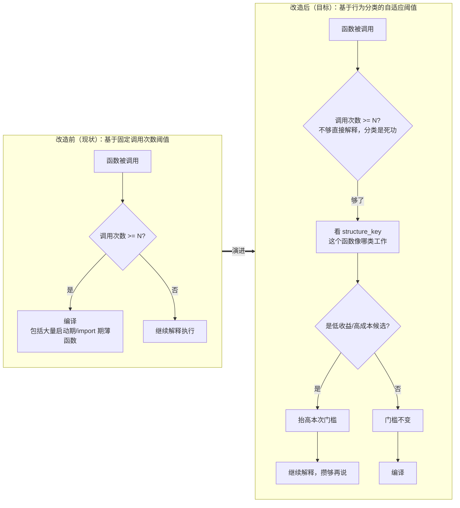
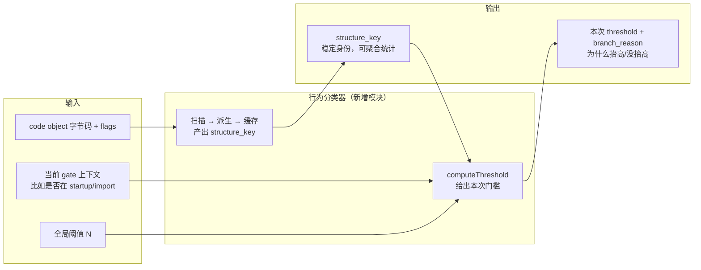
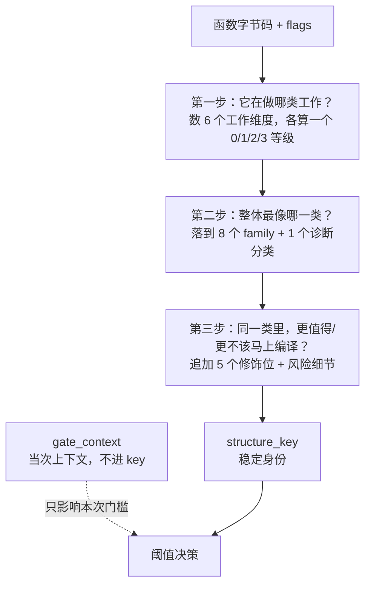
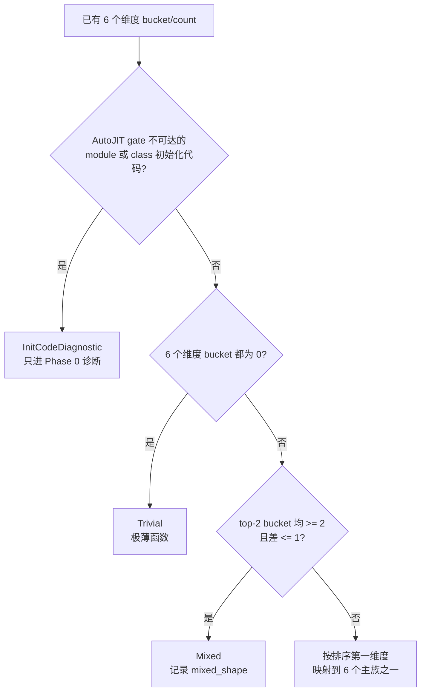
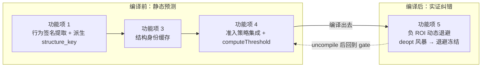
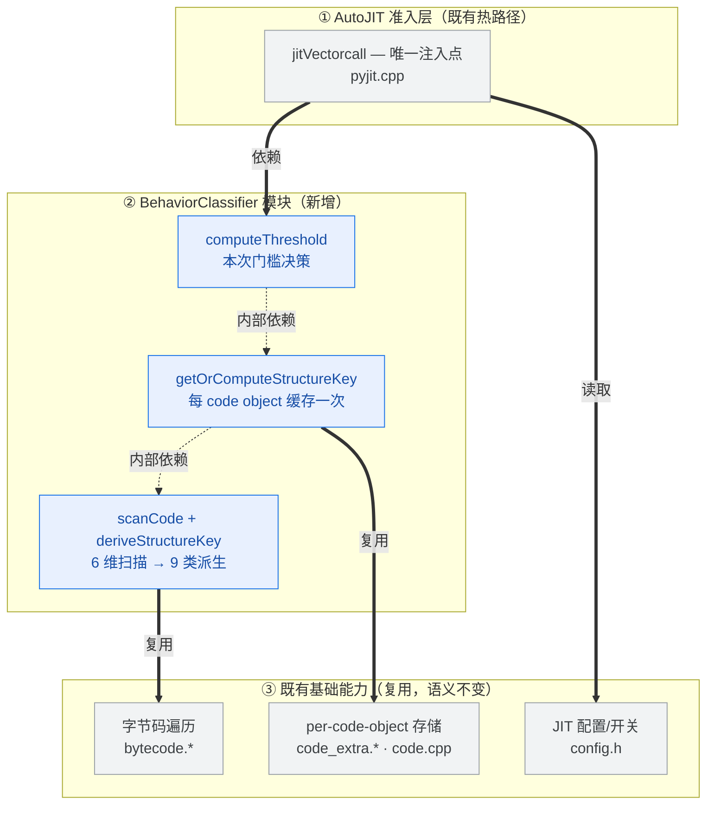
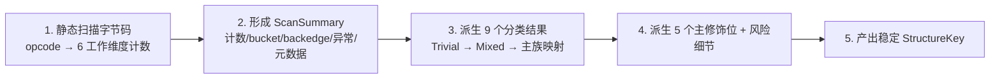
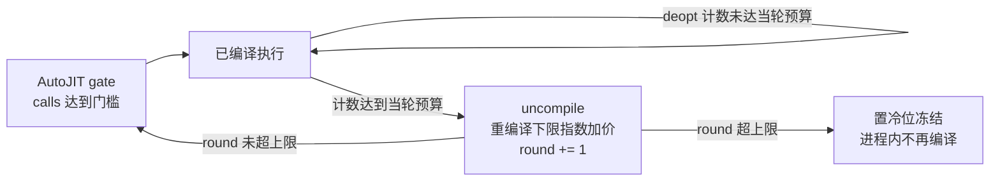

# 功能设计说明书 — 自适应 AutoJIT 行为模式分类

| 项 | 内容 |
|---|---|
| 产品 | CinderX JIT（目标 Python 3.14，含 Static Python，含自由线程构建） |
| 特性 | 自适应 AutoJIT 行为模式分类（Behavior Pattern Classification） |
| 版本 | v1.0（重写版，对照已实现源码） |
| 密级 | 内部公开 |

## 1 拟制信息

| 角色 | 信息 |
|---|---|
| 拟制 | @sisibeloved |
| 上游需求 | `【需求分析】AutoJIT 行为模式分类.md` |
| 关联详细设计 | `【详细设计】AutoJIT 行为模式分类.md` |
| 实现可信源 | `cinderx/Jit/behavior_classifier.{h,cpp}`、`cinderx/Jit/pyjit.cpp`、`cinderx/Common/code_extra.h` |

---

## 2 缩略语清单

| 缩略语 | 英文全称 | 中文名 |
|---|---|---|
| JIT | Just-In-Time compilation | 即时编译 |
| AutoJIT | Adaptive AutoJIT | 自适应自动 JIT（CinderX 按调用次数阈值自动触发编译的机制） |
| OSR | On-Stack Replacement | 栈上替换（解释执行中切入 JIT 编译） |
| HIR | High-level Intermediate Representation | 高层中间表示 |
| ROI | Return On Investment | 收益成本比 |
| deopt | Deoptimization | 反优化（从 JIT 编译态退回解释执行） |
| FT | Free-Threaded (Python) | 自由线程（`Py_GIL_DISABLED` 构建） |
| SP | Static Python | 静态 Python（CinderX 类型化方言） |
| PEP 659 | Specializing Adaptive Interpreter | CPython 自适应特化解释器（解释器就地改写热字节码为特化形态） |
| CFG | Control Flow Graph | 控制流图 |
| DFX | Design for X | 面向 X 的设计（可靠性/性能/可服务性等） |
| FMEA | Failure Mode and Effects Analysis | 失效模式与影响分析 |

---

## 3 特性概述

**AutoJIT 以前用同一把尺子量所有函数（"调用够 N 次就编译"），现在它在编译前先看一眼这个函数长什么样，只对明显"白费力气"的函数把编译门槛抬高，其余函数照旧。** 这样启动期、import 期那些大量低收益的薄函数不会再被推去编译、白白消耗编译时间。

下面这张图把"为什么要做"和"做了什么"一次说清：



---

## 4 文档结构导读

本特性由 **1 个核心思想 + 5 个功能项** 组成。读者可以按下面的顺序跳读：

| 想了解 | 看这一节 |
|---|---|
| 整体在做什么、不做什么 | §5 总述 |
| 核心思想：怎么给函数"分类" | §6 核心分类模型 |
| 5 个功能项分别负责什么 | §7 功能项一览 |
| 每个功能项的细节 | §8（功能项 1–5） |
| 验证标准 | §9 验收与发布门槛 |
| 还没下结论的事 | §10 待决项 |

---

## 5 总述

### 5.1 解决什么问题

AutoJIT 的"自动编译"靠一个全局阈值：函数被调用到一定次数（`compile_after_n_calls`）就触发 JIT 编译。问题是这个阈值对**所有**函数一视同仁。当阈值设得低（例如 `PYTHONJITAUTO=2`），大量**在启动期和 import 期一次性跑过、但之后再也不会热**的薄函数（属性包装、转发函数、生成代码）会被推去编译。编译成本先发生，运行收益却收不回来——这叫 **compile storm（编译风暴）**。

> 一个直白的比喻：低阈值 AutoJIT 像一个"见到谁就招进培训"的公司，启动期把几乎所有人（包括只来一天就走的临时工）都送进了昂贵的培训班。我们想让它变成"先看看这人是长期员工还是临时工，临时工就不送培训了"。

### 5.2 v1 的边界：只做最小闭环

v1 **不**试图做这些事（它们留给后续阶段）：

| 不做 | 原因 |
|---|---|
| 完整预测每个函数的 JIT 收益 | 静态字节码看不出真实执行占比和类型稳定性 |
| 在线学习 / profile 持久化 | 这是 Phase-3 及以后的工作 |
| 特化观测（specialization_band） | 见 §10，已 defer 到 Phase-3 |

v1 **做**这些事：

| 做 | 一句话说明 |
|---|---|
| 给每个函数打一个稳定标签 `structure_key` | 同一个函数永远同一个标签，不随预热程度漂移 |
| 把标签缓存起来，每个 code object 只算一次 | 准入热路径只多一次 O(1) 读取 |
| 在准入点只对**明确低收益或高成本**的候选抬高编译门槛 | 削减 compile storm，其余函数照旧 |
| 编译后用真实 deopt 证据纠错（v1.5，默认开启） | 静态分类看不见的"运行期才暴露的负 ROI"，由 RoiBackoff 兜底 |

### 5.3 输入和输出



**关键设计纪律：** 分类器只回答"这个函数**从结构上像什么**"（稳定身份）；"本次要不要抬高门槛"由策略 `computeThreshold` 根据身份 + 当次上下文决定。**身份和上下文严格分开**——同一个函数不会因为它在 import 期被调用一次就被切成另一个身份。

---

## 6 核心分类模型：怎么给函数分类

### 6.1 三步走

分类不是"多扫一遍字节码再猜一遍"，而是把一个函数回答成三个朴素问题：



| 步骤 | 问题 | 输出 |
|---|---|---|
| 第一步 | 这个函数主要在做哪类工作？ | 6 个工作维度的计数和 0/1/2/3 等级（bucket） |
| 第二步 | 这个函数整体最像哪一类？ | 9 个分类结果：8 个正式 family + 1 个仅诊断用的分类 |
| 第三步 | 同一类里，它是不是更值得或更不该马上编译？ | 5 个主修饰位，以及 `risk_reason` / `code_size_bucket` 风险细节 |

最终 `structure_key` = **正式 family + 可选 mixed_shape + 5 个主修饰位 + 风险细节字段 + active_dim_mask**。

### 6.2 第一步：6 个工作维度

划分原则：**每条字节码只归到最像的一种工作里**。维度不是在猜业务语义，而是在回答"这段函数的时间和成本大概率花在哪类操作上"。

| 维度 | 一句话理解 | 主要看什么 | 为什么单独分出来 |
|---|---|---|---|
| `compute` | 在算东西 | 算术、比较、类型化 primitive 运算 | 循环里的计算通常最容易让 JIT 回本 |
| `control` | 在做分支和异常控制 | 条件跳转、异常边、merge 目标 | 分支和异常增加编译复杂度和 guard/deopt 成本 |
| `object` | 在搬对象或操作容器 | 属性读写、下标访问、容器构造更新 | 对象形态稳定时可能收益高，不稳定时成本高 |
| `dispatch` | 在调用别人 | Python call、method invoke、handler dispatch | 调用密度高的函数可能只是薄分发器，编译不一定回本 |
| `suspend` | 在保存和恢复执行状态 | generator、coroutine、yield、await、send | 状态机迁移有额外动态成本，不能和普通函数混看 |
| `dynamic` | 在做动态名字和反射 | global/name/deref、format/template、生成代码痕迹 | 静态可预测性弱，startup/import 阶段常见 |

**怎么从"计数"变成"等级"：** 把每个维度的 opcode 出现次数，除以函数有效指令数得到密度，再按下表分档。这样大函数不会因为绝对 opcode 多就天然占优，小函数也不会因为一两条 opcode 被误判。

| 常量名（源码） | 值 | 含义 |
|---|---:|---|
| `kDimCountFloor` | 2 | 计数不到 2 直接判 0 档，避免极小函数因 1 条指令触发假信号 |
| `kLowCutoffPct` | 10% | density ≥ 10% → 1 档 |
| `kMidCutoffPct` | 25% | density ≥ 25% → 2 档 |
| `kHighCutoffPct` | 50% | density ≥ 50% → 3 档 |

> 源码位置：`cinderx/Jit/behavior_classifier.cpp` 匿名命名空间常量（`kDimCountFloor`、`kLowCutoffPct` 等），分档逻辑 `bucketDim`。

### 6.3 第二步：9 个分类结果

6 个维度数完后，分类器不再看 opcode 原文，只看 6 个 bucket。按下图顺序判定，第一个命中的就是它的 family：



8 个正式 family（可进入 v1 `structure_key`）+ 1 个诊断分类：

| family | 怎么判定 | 通俗解释 | 策略直觉 |
|---|---|---|---|
| `NumericLoop` | 排序第一维 = `compute` | 数值或类型化计算函数 | 有 loop 时一般保留全局阈值 |
| `BranchFSM` | 排序第一维 = `control` | 控制流/异常控制占主要位 | 要看 loop 和 risk，不能一刀切 |
| `ObjectManipulator` | 排序第一维 = `object` | 属性、容器、对象搬运为主 | 看对象形态稳定性和 ROI |
| `CallDispatcher` | 排序第一维 = `dispatch` | 调用和分发为主 | 无 loop 时常像薄分发器，后移候选 |
| `AsyncStateMachine` | 排序第一维 = `suspend` | generator/coroutine/async 状态机 | 动态成本高，默认更保守 |
| `ReflectionMeta` | 排序第一维 = `dynamic` | 动态名字、反射、模板/生成代码 | startup/import 中常见，重点观察 |
| `Trivial` | 6 个维度都低于 floor | 极薄的 getter、forwarder、包装函数 | 典型低 ROI，v1 默认后移 |
| `Mixed` | top-2 bucket 均 `>=2` 且差 `<=1` | 很难安全说它只像一种函数 | 记录 top-2 组合，避免信息丢失 |
| `InitCodeDiagnostic`（仅诊断） | module/class body 等 gate 不可达代码 | 解释启动期分布用 | 不生成 v1 `structure_key` |

**排序规则固定**：先按 `bucket` 降序，再按 `dim_count` 降序，最后按固定 tie-break `compute > dispatch > object > control > dynamic > suspend`。是否进 `Mixed` 由 `kMixedMinBucket=2`、`kMixedBucketDelta=1` 两个常量决定（源码 `behavior_classifier.cpp`）。因此"主族"不是自然语言判断，而是排序规则下第一维度的映射。

### 6.4 第三步：5 个主修饰位 + 风险细节

主族只回答"像哪类工作"。修饰位回答"同一类里，这个函数是更值得马上编译，还是更应该推迟"。修饰位**不改变主族**，只改变解释和阈值判断。

| 修饰位 | 怎么判定 | 通俗解释 | 对策略的意义 |
|---|---|---|---|
| `loop_score` | 看后向跳转数量和嵌套深度，离散成 0–3 | 分数越高，循环结构越明显 | 高 loop 通常更容易让 JIT 回本，不能轻易后移 |
| `is_static` | `(co_flags & CI_CO_STATICALLY_COMPILED) != 0` | Static Python 类型化函数 | 收益更稳定，倾向保留全局阈值 |
| `is_suspendable` | code flags 是 generator/coroutine，或有 suspend opcode | 函数会挂起再恢复 | 状态保存/恢复成本高，需单独解释 |
| `high_risk` | `risk_reason != 0`（派生位） | 成本不确定或尾部成本重 | 只有无 loop、非 static 时才作为 risk-defer 依据 |
| `is_synthetic` | 文件名以 `<` 开头，或含 `generated`/`jinja`/`mako`/`django/template` 等片段 | 代码可能来自模板或生成器 | 无 loop、非 static 且特定 family 时默认低 ROI |

**`high_risk` 不是"风险"这个独立概念，而是成本的一种说法**：可能编译成本更高、动态 guard/deopt 成本更高、或尾部成本更难预测。为了让"risk-defer 失败后知道该关哪一类"，v1 在 key 里保留风险**来源**：

| 风险来源字段 | 判定（源码常量） | 用途 |
|---|---|---|
| `risk_reason.suspend` | `dim_bucket.suspend >= kRiskSuspendBucket(2)` | 识别状态机保存/恢复成本 |
| `risk_reason.dynamic` | `dim_bucket.dynamic >= kRiskDynamicBucket(2)` | 识别动态名字/反射/模板成本 |
| `risk_reason.exception` | `exception_control_count >= kRiskExceptionFloor(2)` | 识别异常控制与尾部成本 |
| `risk_reason.huge_code` | `effective_instruction_count >= kRiskEffectiveInstructionFloor(200)` | 识别大函数编译/code cache 成本 |
| `code_size_bucket` | `0:<50` / `1:50–199` / `2:200–499` / `3:>=500`（源码 `codeSizeBucket`） | A/B 失败后区分普通/大/超大函数 |
| `active_dim_mask` | 记录哪些工作维度 bucket 非 0 | 解释次要维度；策略上只有 `NumericLoop` 或 `Mixed` top-2 含 `Compute` 才算 compute-dominant |

> `high_risk` 是从 `risk_reason` **派生**出来的结论（`risk_reason != 0` 即置位），不再作为裸 bool 单独缓存。`active_dim_mask` 记录非零维度，用来区分"带一点 compute"和"compute 主导"。

### 6.5 一个设计保证：身份不随预热改变

解释器的自适应特化（PEP 659）会在解释执行中把 `LOAD_ATTR`/`CALL`/`BINARY_OP` 等指令改写成特化形态。但本分类器扫描走的是 **canonical opcode**（即 `unspecialize(uninstrument(...))`，见 `cinderx/Jit/bytecode.cpp` 的 `opcode()`），永远读的是**规范化、去特化、去插桩**的 opcode。因此无论函数预热到何种程度、特化成何种形态，六维计数和 `structure_key` 都不漂移——这是"身份不随预热改变"的**构造性保证**。

---

## 7 功能项一览

本特性拆成 5 个功能项。前 4 个发生在**编译前**，第 5 个发生在**编译后**：



| 功能项 | 时机 | 一句话职责 |
|---|---|---|
| 1. 行为签名提取与 structure_key 派生 | 编译前 | 给函数打稳定标签 `structure_key`（§8.1） |
| 3. 结构身份缓存 | 编译前 | 让每个 code object 只算一次，后续 O(1) 读取（§8.2） |
| 4. 编译准入策略集成 | 编译前 | 把标签接到"是否编译"的判断上（§8.3） |
| 5. 负 ROI 动态退避（RoiBackoff，v1.5） | 编译后 | deopt 风暴函数 uncompile + 退避 + 冻结（§8.4） |

> 编号沿用上游需求文档：原 v1 计划中预留的"功能项 2"已被并入功能项 1，故序号为 1/3/4/5。

新增代码集中在单一模块 `cinderx/Jit/behavior_classifier.{h,cpp}`；对外只对 AutoJIT 准入点 `jitVectorcall`（`cinderx/Jit/pyjit.cpp`）做受控改动。分层依赖见下图：



---

## 8 功能项细节

### 8.1 功能项 1：行为签名提取与 structure_key 派生

#### 8.1.1 在做什么

这个功能项负责给函数"贴标签"。标签不是给人看的分类名，而是后续策略和统计都能稳定复用的 `structure_key`。一个好标签要满足三点：

1. **稳定**：同一个函数永远贴同一个标签；
2. **有界**：标签数量不会爆炸（Mixed 子形态 ≤ 15 种）；
3. **有区分度**：能区分"值得早点编译"和"更适合晚点编译"。

| 项 | 内容 |
|---|---|
| 输入 | gate 可达 code object 的字节码、flags、可静态识别的结构信息 |
| 输出 | `StructureKey(family, mixed_shape, modifiers, risk_reason, code_size_bucket, active_dim_mask)` |
| 核心能力 | 识别函数主要工作类型，保留 loop/static/synthetic/risk 等影响 ROI 的修饰位 |
| 不处理 | 不读运行期类型值，不读 HIR，不把 startup/import 上下文写进 key |

#### 8.1.2 实现要点（对照源码）

分类在 gate 触发，但**分类本身是静态的**：只读已固化的字节码 + `co_flags` + 稳定元数据，不读参数值、局部变量、HIR、机器码、import 栈或本次 startup 上下文。换句话说，`jitVectorcall` 只是"什么时候问一次分类器"，分类器回答的是"这个函数**从结构上像什么**"。

逻辑流水线（对应源码 `behavior_classifier.cpp` 的 `scanCode` → `deriveStructureKey`）：



**283 条 opcode 全覆盖。** 输入全集固定为 Python 3.14 运行时的 opcode 名称集合：CPython base 154 + specialized 84 + CinderX 扩展 43 + 固定 2 条 = **283 条**。源码用一个巨型 `switch`（`opcodeClassOf`，`behavior_classifier.cpp`）把每条 opcode 唯一归入 8 类之一：6 个工作维度、`Neutral`（只计入分母）、`Ignored`（既不计入分母也不计入维度）。任何新增/删除 opcode 必须更新此表并改变 `autojit_config_id`；运行时遇到未知 opcode **fail-closed** 返回 `nullopt`，gate 回退全局阈值，绝不静默当 `Neutral`。

**loop_score 派生（最高价值的收益信号）。** JIT 收益通常来自循环内反复执行的代码，故循环结构必须分级而非 1 bit：

| 条件（源码 `loopScore`） | loop_score |
|---|---:|
| 无后向跳转 | 0 |
| backedge 数 ≥ 16 或最大嵌套深度 ≥ 3 | 3 |
| backedge 数 == 1 且嵌套深度 ≤ 1 | 1 |
| backedge 数 ∈ [2,3] 且嵌套深度 ≤ 2 | 2 |
| backedge 数 ≥ 4 | 3 |

**开销说明：** loop_score 完全骑在主扫描已解码的 `opcode`/`oparg` 之上。`count_score`（backedge 数）几乎免费（主扫描本就在 switch 上认 `JUMP_BACKWARD*`）；`nesting_score`（嵌套深度）是唯一"算法"部分，但用**栈上定长数组（≤16 槽）**收集 backedge 区间后做一次扫线，是**与函数大小无关的定长常数**。关键是**不调** `osr.cpp` 的 `collectBackedgeTargetOffsets`（它会堆分配），而是就地收集端点。结论：loop_score 不改 O(n) 阶、不分配、不显著改常数因子。

#### 8.1.3 DFX 要点

| 维度 | 要点 |
|---|---|
| 可靠性 | 新 opcode 漏归类 → fail-closed 回退全局阈值，不静默 under-count；选族抖动 → Mixed 兜底 + 固定 tie-break |
| 安全 | 只读既有不可变字节码与 flags，无新增攻击面 |
| 性能 | 单次扫描在首个 `calls >= global` 的 gate 发生一次；命中缓存后不再执行（功能项 3） |
| 可服务性 | Phase 0 诊断 dump 暴露 `(opcode counts, buckets, family, mixed_shape, modifiers, risk_reason, code_size_bucket, active_dim_mask, structure_key, gate_context, diagnostic_bucket)` |

---

### 8.2 功能项 3：结构身份缓存

#### 8.2.1 在做什么

分类本身虽然便宜，但 AutoJIT gate 是热路径；如果每次 gate 都重新扫描字节码，分类器就成了新的开销来源。这个功能项负责让“贴标签”只发生一次。缓存后，后续 gate 只需 O(1) 读取。

| 项 | 内容 |
|---|---|
| 输入 | code object、功能项 1 产出的 `structure_key` |
| 输出 | 可重复读取的缓存结果，或明确的 INVALID 回退信号 |
| 并发要求 | 自由线程构建下不能读到半初始化 key |
| 失败行为 | 缓存不可用时回退全局阈值，不影响正确性 |

#### 8.2.2 实现要点：单字原子发布

缓存用 `CodeExtra` 里新增的一个 32-bit 字 `skey_word`（`cinderx/Common/code_extra.h`）。`StructureKey` 被位打包成 24-bit payload，再和 1 个 valid 位合成**单个 32-bit 字**一次发布。关键设计：**用单字单次 release/acquire 发布，从根本上消除"先写值后写标志"的排序风险**。

`skey_word` 位布局：

```
bit 31        valid           1=已分类（零初始化 => 0=未分类）
bits [20..23] mixed_shape     0=none；1..15=Mixed canonical top-2 组合
bits [16..19] family          8 个 family 之一
bits [14..15] loop_score      0..3
bit  13       is_suspendable
bit  12       is_static
bit  11       is_synthetic
bits [7..10]  risk_reason     bit0=suspend, bit1=dynamic, bit2=exception, bit3=huge_code
bits [5..6]   code_size_bucket
bits [0..4]   active_dim_mask bit0=Compute, bit1=Control, bit2=Object, bit3=Dispatch, bit4=Dynamic
bit 30        DECIDED_COLD    稳态判冷位（功能项 4/5 共用）
PAYLOAD_MASK = 0x00FFFFFF ; VALID_BIT = 0x80000000
```

读 / 写语义（源码 `getOrComputeStructureKey`，`behavior_classifier.cpp`）：

| 场景 | 行为 |
|---|---|
| 缓存命中 | acquire-load，看到 valid 位 → 直接 unpack 返回 |
| 缓存未命中 | 计算 StructureKey → release-store `pack() \| VALID_BIT` |
| 并发首次 | 允许各自计算（冻结配置下的纯函数，结果逐位相等），最后写入者胜出——良性竞态 |
| 缓存不可用 / 分类失败 | 返回 INVALID，由功能项 4 回退全局阈值 |

> 自由线程构建下，load 用 `__atomic_load_n(..., __ATOMIC_ACQUIRE)`，store 用 `__atomic_store_n(..., __ATOMIC_RELEASE)`，OR 冷位用 `__atomic_fetch_or(..., __ATOMIC_RELEASE)`。GIL 构建下是普通读写。

**分类配置进程内冻结。** schema（Python minor 版本、opcode 表、cutoff/floor/δ/loop/risk 阈值、payload 位布局）进入 gate/cache/policy 前冻结为进程内常量；`skey_word` valid 后**不失效、不做运行期版本比对、不重算**。调参只能在 Phase 0 scanner/dump 或新进程中进行。

---

### 8.3 功能项 4：编译准入策略集成

#### 8.3.1 在做什么

这个功能项把分类结果真正接到 AutoJIT 的"是否编译"判断上。它**不改变**解释路径和编译路径，只改变"本次需要达到多少调用次数才允许编译"。

| 项 | 内容 |
|---|---|
| 输入 | `structure_key`、`gate_context`、现有全局阈值 |
| 输出 | 本次 AutoJIT gate 使用的门槛 + `branch_reason`（为什么抬高/没抬高） |
| 启用方式 | `PYTHONJITAUTO=auto[:N]` 开分类；纯数值 `N` 回到现状 |
| 回退方式 | 分类关、分类失败、缓存失败都回到全局阈值 |

#### 8.3.2 准入点改造：先判全局阈值，再分类

**改造前（现状：只看调用次数）**

```
jitVectorcall(func)
  limit = config.compile_after_n_calls
  if countCalls(code) < limit: 继续解释
  else: 编译
```

**改造后（源码 `pyjit.cpp` 的 `jitVectorcall`）**

```
jitVectorcall(func)
  state  = readAutoJitGateState(code)          # 读 calls + cache_handle + gate_context
  global = config.compile_after_n_calls

  # 短路：v1 策略只会维持或抬高门槛（computeThreshold >= global），
  # 故 calls < global 时无论分类结果如何都必然解释，分类是死功，跳过。
  if state.calls < global: 继续解释（计数）

  # RoiBackoff 闸门（功能项 5）：冻结/退避中的函数回到解释
  if frozen 或 calls < roi_recompile_floor: 继续解释

  # 分类 + 策略
  if config.auto_classify:
      sk = getOrComputeStructureKey(code, state.extra)
      if sk 有效:
          decision = computeThreshold(sk, state.context, global)
          effective_limit = decision.limit        # >= global
      else:
          effective_limit = global                # 分类失败回退
  else:
      effective_limit = global                    # PYTHONJITAUTO=N

  if state.calls < effective_limit: 继续解释（可能冻结冷函数）
  else: 编译
```

**为什么先判 `calls < global` 再分类？** v1 策略是关于 `global` 的**单调非降**策略，恒满足 `effective_limit >= global`。因此 `calls < global` 的函数无论落哪一类都会走解释路径，对它们分类是纯损耗。这个短路把"被扫描函数数"从全部 gate 可达函数（Phase 0 ≈ 416k）压到"够到基准阈值的编译候选"（≈ 30k），使分类开销与它要优化的编译工作量同阶。**这是严格行为等价的改写**，前提是策略单调非降；若未来策略可能降到 `global` 以下，须重新评估。

> **重要澄清（对照源码）：** 在 `auto_classify` 开启时，CinderX **不**安装 frame evaluator，而是把 `jitVectorcall` 设为函数的 vectorcall 来驱动计数和门槛门（见 `pyjit.cpp` `initialize` 的注释与 `scheduleJitCompile`）。这一点和早期文档"必须安装 frame evaluator"的描述不同——vectorcall 本身就是计数入口。

#### 8.3.3 `computeThreshold`：识别哪些候选要后移

`computeThreshold(key, context, global) -> {limit, branch_reason}` 是功能域对下游的**唯一门槛决策点**。分类器只提供稳定身份；策略只决定本次门槛和原因。这样后续从启发式升级到在线反馈时，可以替换策略而不重写分类器。

v1 只对**明确低收益或高成本**的候选抬高门槛，其余函数走全局阈值（尤其是 `NumericLoop`、compute-dominant `Mixed`、Static Python 类型化函数、高 loop/synthetic 函数）。源码 `computeThreshold`（`behavior_classifier.cpp`）按下面几类候选判定，**先命中先返回**：

| 候选类别 | branch_reason | 直觉 |
|---|---|---|
| 启动期/初始化窗口内的**高成本非数值**函数 | `StartupInit` 或 `RiskDefer` | 削减 startup/import/setup compile storm |
| 稳态期**异常/大对象框架**函数、**期望异常循环**函数 | `RiskDefer` | 静态形状看不出、但成本结构差 |
| 稳态期**多维度对象图**、**纯调用分发循环**、**大分支 warmup** 函数 | `LowRoi` | 形态上倾向低 ROI |
| 薄函数（`Trivial`）或特定 synthetic 函数 | `LowRoi` | 典型编译静态成本难回收 |
| 其它 | `None` | 走全局阈值 |

**启动期/初始化分支的关键保护条件（compute-dominant 判定）：** 只有 `family == NumericLoop` 或 `family == Mixed && mixed_shape top-2 含 Compute` 才算 compute-dominant，受保护；`ObjectManipulator`/`BranchFSM` 等主族即使 `active_dim_mask` 里带一点 incidental `Compute`，仍按非数值高成本处理。import/setup 窗口内的后移条件是：`startup_phase && !is_static && !computeDominantHint() && (risk_reason != 0 || code_size_bucket > 0)`。

**关于 startup_phase 的来源：** `startup_phase` **不是**结构分类器的输出，而来自 provider 在当前线程维护的轻量 depth/bool（`gate_context.startup_phase = import_phase || setup_phase`，源码 `readGateContext`）。当前实现把 import provider 作为 `StartupInit` 策略的总开关（`enable_startup_init_policy` 默认 **false**，由 import provider 打开），`CINDERX_AUTOJIT_SETUP_PROVIDER=lib2to3_main,multiprocessing_pool` 作为 CinderX-only 的附加 setup 窗口验证：`lib2to3_main` 覆盖 `2to3` main/refactor，`multiprocessing_pool` 覆盖 `Pool` 构造、context manager 与 `map/imap/imap_unordered/starmap/*_async` 任务提交窗口（`bench_mp_pool`/`concurrent_imap` 这类进程池固定成本）；result 消费/等待路径（`IMapIterator.next`、`ApplyResult.get`）不包装。**生产默认 provider 仍需 gdb smoke、覆盖率和误伤率证据**才能上线——因为 Phase 0 的 gdb 证据已证明：**在 `jitVectorcall` 热路径遍历 Python frame/code metadata 来判断 import 栈会 SIGSEGV**。

**5 个稳态"白名单"修饰（源码 `computeThresholdForCode`）。** `computeThreshold` 之上还有一层修饰，避免把某些"看着像低 ROI 但其实稳态正收益"的常见形态误伤：

| 修饰 | 作用 | 方向 |
|---|---|---|
| asyncio 事件循环框架 helper | 把门槛抬到 startup-defer 级别 | **更冷**（唯一抬门槛的修饰） |
| 普通 generator（无 coroutine flag） | 把已判 LowRoi 的决策降回全局阈值 | 更暖 |
| trivial state helper（纯 load/store-attr + 单 return） | 同上 | 更暖 |
| 复合状态谓词（BranchFSM + 布尔判断） | 同上 | 更暖 |
| protocol dispatch core（有界 dynamic/call） | 同上 | 更暖 |

> `BranchReason::RoiBackoff` 虽然在枚举里，但**不**由 `computeThreshold` 产生——它由功能项 5 的运行期退避路径设置（见 §8.4）。

#### 8.3.4 入口激活契约

所有让 `compile_after_n_calls.has_value()` 的入口（`PYTHONJITAUTO=<N>`、`PYTHONJITAUTO=auto[:N]`、`-X jit-auto[=...]`、Python API `compile_after_n_calls`）都必须真正接管函数调用计数。`auto_classify` 路径通过 `setVectorcall(func, jitVectorcall)` 驱动；非 auto 路径安装 frame evaluator。验收不能只看配置字段，必须**端到端验证初始化后新定义函数在第 N+1 次调用触发 JIT**。`auto[:N]` 样例必须用带循环的非 low-ROI 函数，避免策略抬门槛把入口问题误判成"策略生效"。

`PYTHONJITAUTO` parser 契约：

| 输入 | 解析结果 |
|---|---|
| 纯数值 `N` | `global=N`，`auto_classify=false`（逐函数等价现状） |
| `auto` | `global=默认值`，`auto_classify=true` |
| `auto:N` | `global=N`，`auto_classify=true` |
| `-X jit-auto`（空） | `global=1`，`auto_classify=false` |
| malformed / overflow / 空 env | 保持原值，不静默开分类 |

---

### 8.4 功能项 5（v1.5）：编译后用 deopt 证据纠错（RoiBackoff）

#### 8.4.1 在做什么

前四个功能项都发生在**编译前**：静态分类预测"这个函数像不像值得编译"。但有些函数**静态形状相同、运行期 ROI 却相反**——静态分类原理上看不见（证据：`sqlalchemy_declarative` worker deopt 21714 次、`dask` worker 合计 deopt 超百万次、`deepcopy` 的 expected-exception 对）。这个功能项发生在**编译后**：用真实 deopt 证据纠正预测错误。

回答方式很朴素：**编译出去的函数如果反复 deopt 到风暴级，就把它收回来（uncompile），让它用更高的门槛重新证明自己；屡犯不改的，本进程内不再编译。**

| 项 | 内容 |
|---|---|
| 时机 | 编译后（对照功能项 4 的编译前） |
| 输入 | 既有 deopt 出口的 `DeoptReason` 事件、`CodeExtra` 中的退避状态 |
| 输出 | uncompile/冻结动作、`roi_recompile_floor`（重编译下限）、诊断计数 |
| 启用方式 | **默认开启**，独立于 `auto_classify`；`CINDERX_AUTOJIT_ROI_BACKOFF=0` 显式关闭 |
| 不做什么 | 不测量动态收益（分子只有 deopt）；不进 `structure_key`；不跨进程持久化 |

#### 8.4.2 控制回路（状态机）



退避语义参照解释器自适应特化的 `backoff_counter` 模式（指数预算 + 指数重编译下限 + 有限轮次）。三条硬约束：

1. **快路径零成本。** 唯一观测点是 deopt 出口（帧重建慢路径，源码 `gen_asm.cpp` `prepareForDeopt`），新增一次 relaxed 计数；编译态正常执行、解释执行、gate 命中路径不加任何新 per-call 工作。
2. **状态不是身份。** 退避状态存 `CodeExtra`，**绝不进 `structure_key`**；事件日志按 `structure_key` 标注，为 Phase-3 pattern 级反馈积累标注数据。
3. **动作复用既有机制。** uncompile 复用 `jit::uncompile`；重新计数复用 AutoJIT gate；冻结复用 `DECIDED_COLD` 冷位 fast path。**不新增**编译器/运行时机制。

#### 8.4.3 判定常量（源码 `config.h`）

| 常量（源码字段） | 默认值 | 含义 |
|---|---:|---|
| `roi_deopt_budget_base` | 32 | 第 0 轮 deopt 预算；第 k 轮为 `32 << k` |
| `roi_backoff_max_rounds` | 1 | 第一次预算耗尽即冻结；需要多轮观测时可用环境变量提高 |
| `roi_rewarm_factor` | 64 | 重编译下限增量 = `global × 64 × 2^k` |
| reason mask | 默认计入 `GuardFailure`/`YieldFrom`/`Raise`/`RaiseStatic`/`UnhandledException` 等，排除 `PeriodicTaskFailure` 与 instrumentation deopt | 与函数 ROI 无关的 deopt 不计数 |

**动力学说明（为什么是指数阶梯）：**
- **真负 ROI 风暴函数**：deopt 率高，每轮预算很快用尽；重编译下限指数增长，编译态占比快速收敛到 0，超轮次后冻结。省下的是每次 deopt 的帧重建、guard 失败与重入成本。
- **高热但净收益为正、带 deopt 的函数**：会振荡。编译态时间占比近似 `budget / (budget + r × global × rewarm)`（r 为每调用 deopt 率；预算与下限同乘 2^k，占比与轮次无关）——这正是"deopt 单边信号判不了净收益"的极限。对策是保守预算（低 r 函数不触发）、有限轮次内可恢复、mis-backoff 守门用 named guard case 压住误伤。
- **单次 deopt 不冻结**：默认要求先耗尽一整个 deopt 预算窗口才冻结，避免偶发 deopt 触发退避。

#### 8.4.4 准入集成

gate 在 `computeThreshold` 之后以 `roi_recompile_floor` 作为 calls 域下限（源码 `jitVectorcall` + `roiBackoffStateAllowsCompile`）：

```
floor = relaxed-load(extra.roi_recompile_floor)
if frozen: 永久回解释（vectorcall 重写、停止计数）
elif floor == 0: 正常走 computeThreshold
elif calls < floor: 继续解释（重新预热，预算已翻倍）
else: 清除 floor（release-store），stats 计 roi_recompile，允许重编译
```

OSR 编译预算检查（`osrCompileBudgetCheck`）同时尊重 frozen/floor，**封死带循环的风暴函数从 OSR 后门重编译**。

**显式关闭等价现状：** `CINDERX_AUTOJIT_ROI_BACKOFF=0` 时，deopt 路径与 gate 路径与现状 **bit-for-bit 等价**；开关独立于 `auto_classify`，数值 `PYTHONJITAUTO=N` 下同样可用。

#### 8.4.5 诊断面（当前承诺范围）

`AutoJitGateStats` 新增 `roi_uncompile`/`roi_recompile`/`roi_frozen` 计数；compile-events 继续记录 forced compile 的 code identity、阶段和 `structure_key`。**当前不承诺**输出 `roi_*` compile-events 事件或 reason 直方图——高频触发的 code/shape 分支必须通过 gate stats、compile-events 与 deopt dump 关联后回灌证据表，不得静默当作"已解决"。

---

## 9 验收与发布门槛

### 9.1 核心不变量

| 不变量 | 验收口径 |
|---|---|
| 稳定身份 | 每个 gate 可达 code object 恰好一个 `structure_key`；同一 code object 不因预热程度/特化形态改变身份 |
| 有界分类 | 9 个分类结果：8 个正式 family + 1 个 Phase 0 诊断分类；Mixed 子形态 ≤ 15 |
| 清晰边界 | `structure_key` 用于聚合；`gate_context` 只影响本次 gate；Phase-3 band 不进入 v1 |
| 可回退 | 分类关 / 分类失败 / 缓存失败 → 逐函数回到现状全局阈值 |
| 动态纠错（v1.5） | RoiBackoff 默认开启；deopt 风暴函数 uncompile/退避/冻结；状态存 `CodeExtra`、不进 key；`CINDERX_AUTOJIT_ROI_BACKOFF=0` 保持现状等价 |
| 低开销 | 首次扫描一次，命中缓存后 O(1)；准入路径不成为新热点 |

### 9.2 性能收益论证（开销 vs 收益）

**先拆成三本账。** 本特性不改变已编译函数的机器码质量，直接收益来自**编译准入预算的重新分配**：把编译力气花在能回本的函数上，省掉回不了本的。判断"某类函数该不该后移"时，仍必须回到 JIT 本身的 ROI：JIT 有静态成本、动态成本，也有动态收益。`risk` 不是 ROI 之外的第三类概念，而是成本中的不确定/条件/尾部项。

**净收益不等式（发布须证明为正）：**

```
净收益 = Σ(保留/提前编译函数的 JIT 动态收益)
        + Σ(被后移低 ROI 函数省下的 JIT 静态成本)
        − Σ(保留/提前编译函数的 JIT 动态成本)
        − Σ(全部被扫描函数的分类开销)
        − Σ(误推迟高 ROI 函数造成的动态收益损失)
```


**JIT 成本阶段表**（哪些成本会被 `warmups=3` 遮住）：

| 成本项 | 阶段 | `warmups=3` 是否遮住 | 对哪些分类敏感 |
|---|---|---|---|
| 编译计算 | 达到阈值后同步编译前 | **很可能**遮住 | `Trivial`、startup `CallDispatcher`/`ReflectionMeta` |
| 编译产物占用 | 编译完成到 code object 结束 | 间接体现 | 大函数、`high_risk` |
| OSR 帧状态迁移 | 解释器热循环切入 JIT | 可能 | `NumericLoop`、带 loop 的 `BranchFSM` |
| 状态保存/恢复 | generator/coroutine 挂起恢复 | **不**遮住 | `AsyncStateMachine`、含 suspend 的 `Mixed` |
| guard / fallback / deopt | JIT 热路径运行中 | **不**遮住 | `ObjectManipulator`、`ReflectionMeta` |
| runtime helper 调用 | JIT 调 C/Python helper | **不**遮住 | `CallDispatcher`、`ObjectManipulator` |
| 不确定/尾部成本 | 低概率但影响大的异常路径 | 通常不稳定 | `high_risk`、动态/异常密集形态 |

由此得两个判断：**正式 values 变快**只能说明 JIT 动态收益覆盖了测量期内的持续动态成本，**不能**证明收益覆盖了 warmup 内已支付的静态编译成本；**compile count/time 下降**说明静态成本下降，**不能**证明没有误推迟动态收益。

### 9.3 发布门槛（与需求 Outstanding 对齐）

发布需**同时**满足：

1. **opt-in A/B**：`auto[:N]` 相对数值 `N` 的 A/B——candidate 编译次数/耗时下降、非 candidate 行为等价、启动/吞吐无显著回归；startup/setup 与 steady 指标分开报告。
2. **mis-defer 守门**：被后移的 top call-count / top time candidate 必须证明 **saved static cost > lost dynamic benefit**；否则按 `risk_reason` / `code_size_bucket` / family / `mixed_shape` 收窄或禁用对应分支。
3. **稳态吞吐不回归**（回归即说明误伤了应编译的函数）。
4. **扫描开销**远小于省下的编译耗时。
5. **provider gate**（启动期策略）：gdb smoke 正常退出 + 覆盖率 ≥80%（或 top-20 全覆盖/逐项解释）+ post-import 误伤率 ≤5% + 热路径 O(1)。
6. **RoiBackoff 守门**：on/off A/B 在负样本（`dask`、`deepcopy` 子集、`generators`、`2to3`、`pickle_pure_python`、`nbody`、`richards`、`sqlalchemy_declarative`）上无超噪声回归。

---

## 10 待决项 / 后续阶段

| 项 | 状态 | 说明 |
|---|---|---|
| **生产 policy/default 冻结** | release gate | schema 红线已过，bootstrap defaults 可作 coding/experiment defaults；生产默认策略**不在设计期冻结**，需 A/B、相邻 cutoff/floor/δ/loop 比较、mis-defer 和 provider A/B。所有报告必须携带 `autojit_config_id` |
| **`startup_phase` 安全 provider** | release gate | 不得在 `jitVectorcall` 遍历 frame/code metadata；候选方案：import machinery 侧轻量 depth/counter、thread-local import state、CinderX-only wrapper。`lib2to3_main` setup wrapper 已验证可覆盖 `2to3` main/refactor 窗口；`multiprocessing_pool` setup wrapper 覆盖 `Pool` 构造、context manager 与 `map/imap/imap_unordered/starmap/*_async` 任务提交，用于 `bench_mp_pool/concurrent_imap` 这类进程池固定成本窗口（result iterator/get 是消费路径，不包装）。当前实现仍依赖 import provider 打开策略总开关 |
| **import/setup 分叉阈值** | 待 A/B | 当前策略只按合并位 `startup_phase` 执行；`import_phase`/`setup_phase` 暂作诊断和 A/B 细分位。按 import/setup 分叉阈值前，必须证明它比合并位更好 |
| **RoiBackoff 实现前提** | 守门中 | P1（`jit::uncompile` 不释放活跃机器码）和 P2（共享 code 全量 function 入口解除）由实现/测试守门；当前 blue-98 容器 gdb smoke 受 seccomp/ptrace 限制，需在允许 ptrace 的环境补验 |
| **Phase-3 特化观测** | defer | `specialization_band`（low/mid/high）+ 滞回宽度 + 重读频率。见 §10.1 |

### 10.1 Phase-3 参考：特化观测旁路信号（v1 不实现）

> **⚠ v1 不实现。** 本节只保留 Phase-3 设计意图，不是 v1 功能项、SR 或接口。v1 的 `gate_view` 仅含 `structure_key + gate_context`。

#### 什么是 Phase-3，它处于哪一阶段

本特性的演进按阶段推进，每阶段解决一类问题。读者需要先知道 Phase-3 在整条路线上的位置，才能理解本节为什么"只看不做"：

| 阶段 | 时机 | 解决的问题 | 状态 |
|---|---|---|---|
| **v1** | 编译**前** | 用静态字节码结构（`structure_key`）预测哪些函数值得编译 | 已实现（本文档主线） |
| **v1.5** | 编译**后** | 用真实 deopt 证据（RoiBackoff）纠正预测错误 | 已实现（功能项 5） |
| **Phase-3** | 编译**后** | 用解释器**特化状态**作为旁路信号，小幅修正阈值 | **未实现**（本节讨论） |
| **Phase-4** | 跨进程 | profile 持久化、pattern 级在线反馈 | 远期规划 |

可以看到：v1 和 v1.5 都靠"字节码结构 + deopt 计数"两类信号工作，它们**看不到**函数在解释执行期积累的类型稳定性信息。Phase-3 想补上这一块。

#### 什么是"特化"，为什么它和 JIT 相关

CPython 3.11+ 的解释器是"自适应的"（PEP 659）。当某条字节码被解释执行很多次后，解释器会把它**就地改写**成针对当前类型的快速形态。例如：

- `LOAD_ATTR`（通用属性访问）→ `LOAD_ATTR_SLOT`（按对象槽位访问，假设对象布局稳定）
- `BINARY_OP`（通用二元运算）→ `BINARY_OP_ADD_INT`（整数加法快路径）
- `LOAD_GLOBAL` → `LOAD_GLOBAL_MODULE`（假设是模块级全局变量）

这些"被改写过的形态"就是**特化态**。它隐含了一个信号：**这条指令曾经很热、且曾经长期稳定在某种类型上**——这正是 JIT 编译最希望获得的前提（类型稳定时编译收益高）。

> 关键区分：本特性 v1 扫描走的是 **canonical opcode**（去特化、去插桩后的原始 opcode），所以 `structure_key` **对特化不变**——函数预热到任何程度，身份都不漂移（§6.5）。Phase-3 想做的是反过来**读取**特化态本身，作为额外的旁路提示。

#### Phase-3 的设想与它的两道难题

Phase-3 的设想是：把"特化存在性"（多少比例的指令已被特化）离散成 low/mid/high 三档，作为 gate 时刻的一个**旁路微调输入**，轻微地提前或推迟编译。

但深入分析后发现两道难题，因此 v1 不实现：

1. **特化态是"滞后信号"，不能证明"现在稳定"。** 特化按"单条指令执行次数"触发（与 AutoJIT 按"函数调用次数"计数的 gate 是两个解耦的计数器），且只能发生在 gate 放行后的解释执行体内。更关键的是，特化形态在 miss 时会**保留原地**并退避，**不会撤销**。因此一个"曾经单态、后来变多态"的函数，特化比例仍然显示为高——这恰恰是它 deopt 风险升高、最不该提前编译的时刻。换句话说，特化态只证明"**曾经**热过、**曾经**单态"，不能证明"**当前**稳定"。

2. **特化态会和阈值策略形成反馈回路。** v1 策略"抬门槛后移编译"会让函数多解释跑若干轮，到编译时刻累积的特化态更多。对 v1 无害（`structure_key` 对特化不变）；但 Phase-3 一旦用特化档位做微调，这个档位的取值就会被阈值策略本身影响——形成 policy↔band 回路。这种回路的稳定性必须单独评估，不能假设特化档位是策略的独立外生输入。

#### Phase-3 如果恢复，必须遵守的边界

综合上述难题，Phase-3 即使恢复特化观测，也只能作为**当次 gate 的小幅微调输入**，并满足：

- **不得进入 `structure_key`、不得作为统计聚合键**（否则同一函数的统计会被切碎到多个 key 上，破坏 v1 的核心不变量）；
- **不得单凭高特化档位把高 deopt 风险函数判为"应提前编译"**；
- **必须用滞回**（进入高档和跌出高档用不同阈值），避免在边界附近两次相邻 gate 反复翻转阈值。

#### 更强的稳定性信号与后续工作

真正的“当前类型稳定性”信号（hit/miss/deopt/backoff 计数式）成本更高，留待 Phase-3 一并设计。本节只保留设计意图，不构成 v1 的功能项、SR 或接口。

---

## 11 术语与可信源

**第一可信源为项目代码**，关键位置：

| 主题 | 源码位置 |
|---|---|
| 分类器主体 | `cinderx/Jit/behavior_classifier.h` / `.cpp`（`deriveStructureKey`、`scanCode`、`loopScore`、`computeThreshold`、`computeThresholdForCode`、`getOrComputeStructureKey`、`opcodeClassOf`） |
| 准入点 / RoiBackoff | `cinderx/Jit/pyjit.cpp`（`jitVectorcall`、`initialize`、`triggerRoiBackoff`、`recordDeoptForRoiBackoff`、`roiBackoffStateAllowsCompile`、`readGateContext`） |
| 缓存载体 | `cinderx/Common/code_extra.h`（`skey_word` 位布局、`roi_ctl`/`roi_deopt_count`/`roi_recompile_floor`、原子访问器） |
| 配置 | `cinderx/Jit/config.h`（`auto_classify`、`enable_startup_init_policy`、`roi_backoff_enabled` 及其 budget/rounds/rewarm 常量） |
| deopt 出口 | `cinderx/Jit/codegen/gen_asm.cpp`（`prepareForDeopt`，RoiBackoff 唯一观测点） |
| canonical opcode | `cinderx/Jit/bytecode.cpp`（`opcode()` = `unspecialize(uninstrument(...))`） |
| uncompile / OSR | `cinderx/Jit/context.h`（`jit::uncompile`）、`cinderx/Jit/osr.cpp`（`collectBackedgeTargetOffsets`——不用于 loop_score） |

**上游文档：**
- 需求：`【需求分析】AutoJIT 行为模式分类.md`（R1–R31、KD1–KD9、AE1–AE16）
- 详细设计：`【详细设计】AutoJIT 行为模式分类.md`
- Phase 0 证据：`scratch/autojit_phase0/results/blue-98-20260602-cpp/report.md`

**术语对照：**

| 术语 | 含义 |
|---|---|
| `structure_key` | 逻辑聚合身份（解码后的 `StructureKey` 值），下游策略/统计/profile 的唯一聚合键 |
| `skey_word` | `structure_key` 的物理容器（valid 位 + 24-bit payload 的 32-bit 字） |
| `gate_context` | 当次 gate 上下文（`startup_phase`/`import_phase`/`setup_phase`），不落库、不聚合 |
| `gate_view` | 概念名 = `structure_key + gate_context`（v1 不含 `specialization_band`），非持久化结构体 |
| `autojit_config_id` | dump/log/report 层的配置 hash（覆盖 Python minor、opcode 表版本、payload 布局、阈值等），**不写入 `skey_word`** |
