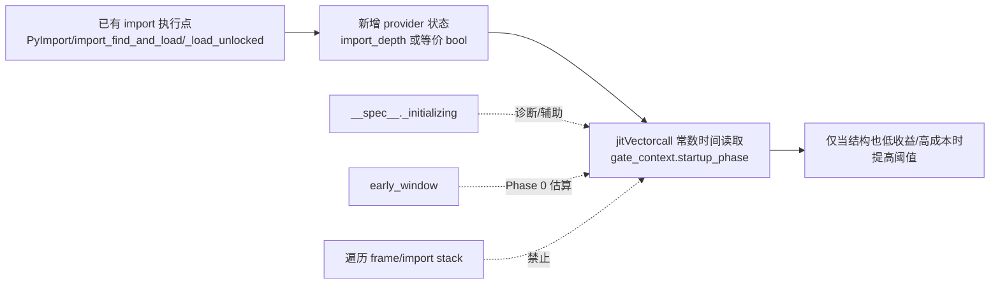

# 需求分析文档 — 自适应 AutoJIT 行为模式分类

## Summary

为自适应 AutoJIT 定义一套**证据充分、可生产化推进**的函数行为分类方案：从字节码 + `co_flags` 提取一个**确定性的结构核**（衡量"做哪类工作 + 有多少热工作"），收敛为一个**有界、版本与特化鲁棒**的稳定 `structure_key`，作为下游策略 / 统计 / profile 的**唯一聚合身份**。`structure_key` 把当前全局固定的 `compile_after_n_calls` 阈值，替换为"按行为模式区分"的编译准入依据；弱特化观测（specialization observation）仅作为 Phase-3 旁路信号保留设计意图，v1 不实现、不进入聚合键。

本文档 v1 **交付分类法 + 最小阈值策略 + opt-in provider 验证路径**：产出稳定 `structure_key`，并通过 `computeThreshold(structure_key, gate_context, global)` 只对明确 `raise_threshold_candidate` 抬阈值以削减 compile storm。2026-06-05 的 `2to3` 穿刺证明：只调静态分类只能部分减少编译风暴；若 `startup_phase` 只来自 import depth，覆盖不了 `lib2to3.main.main()` 里的 refactor/setup 初始化窗口。因此当前实现允许先用 CinderX-only wrapper provider 验证：`CINDERX_AUTOJIT_IMPORT_PROVIDER=find_and_load` 覆盖 import 窗口，`CINDERX_AUTOJIT_SETUP_PROVIDER=lib2to3_main` 覆盖明确的 `lib2to3` setup/main 窗口。2026-06-09 的 split-only 穿刺进一步明确：`gate_context.startup_phase` 是现有策略使用的合并位，`import_phase/setup_phase` 先只作为诊断和 A/B 细分位；生产默认按 import/setup 分叉阈值前，必须证明它比合并位更好。生产默认仍需安全 provider 的 gdb smoke、覆盖率和误伤率证据。完整阈值映射（`threshold = f(pattern)`）、弱特化观测、pattern 级在线反馈、profile 持久化是明确的下游工作（见 Scope Boundaries）。2026-06-10 增补 **v1.5 最小动态反馈位 RoiBackoff**：静态分类原理上看不见的 steady 负 ROI（sqlalchemy/dask 的 deopt 风暴、deepcopy 的 expected-exception 对）由"编译 → 观测 deopt → 退避"闭环兜底；状态存 `CodeExtra`、绝不进 `structure_key`。2026-06-11 守门批次通过后，RoiBackoff 改为默认开启，保留 `CINDERX_AUTOJIT_ROI_BACKOFF=0` 作为显式回退（KD9、R28–R31、L6、AE14–AE16）。

## Evidence Update（2026-06-02 Phase 0 C++ dump）

C++ Phase 0 dump 已在 `blue-98` / `cinderx-test` 上复跑并形成冻结证据，产物见 `scratch/autojit_phase0/results/blue-98-20260602-cpp/report.md` 与 `summary-clean/summary.json`。clean 口径覆盖 pyperformance subset + django 专项，共 53 个 dump 进程、417389 条 record、10434 个 unique `record_key`；`gate_reachable=416381`（99.8%）、`storm_candidates_reached_threshold=30605`、`compiled_records=23446`、`gate_observations=104232`。`Mixed(storm)=873`（2.9%），未触发 `Mixed > 40%` 红线；最大 storm family 为 `CallDispatcher=8796`，未触发“任一族 > 50%”红线。由此可冻结的是 **schema/evidence 层**：Phase 0 dump schema、gate-side evidence 价值、family/Mixed 分类区分度、Mixed 红线和 family 区分能力。Open Question 决策 5 明确：bootstrap cutoff/floor/δ/loop defaults 可作为 **coding/experiment defaults** 进入实现和实验，`PYTHONJITAUTO=auto[:N]` 仍为 opt-in；这些值不能等同于生产 policy/default 冻结，生产推荐默认值还需经过混合语料 A/B、至少一组相邻 cutoff/floor/δ/loop 配置对比、mis-defer 守门和 provider A/B 后冻结。

family 名称以 v1 文档为准：`BranchFSM`、`ObjectManipulator` 是规范名。已归档 Phase 0 C++ artifact 中若出现 `BranchyControl`、`ObjectAccess`，分别视为 `BranchFSM`、`ObjectManipulator` 的历史别名；后续 scanner/report/golden summary 必须输出规范名，或在比较前显式做 alias normalize，避免 schema 已冻而 artifact 名称漂移。

但 startup/import 信号不能一起冻结。gdb 修复前 crash 证据见 `logs/autojit-phase0-gdb-debug-container-20260602-115858.log`：SIGSEGV 栈为 `PyType_HasFeature -> autojit_phase0::unicodeAsStringNoError -> isImportFrame -> hasImportStack -> currentSignalMask -> recordGate -> jitVectorcall -> CPython import machinery`。这证明**不能在 `jitVectorcall` 热路径通过遍历 Python frame/code metadata 来实现 `import_stack`**。修复后 gdb 正常退出，见 `logs/autojit-phase0-gdb-after-fix-20260602-120011.log`。当前 C++ clean summary 的 `import_stack={}` 是 gdb 驱动的稳定性边界，不表示 ImportInit 不重要；Python-only Phase 0 曾显示 import stack 是 ImportInit storm 的主要信号。C++ clean summary 中 `module_initializing` 只覆盖 795/30605 个 storm，不能替代完整 ImportInit 判定；`early_window` 覆盖 22451 个 storm，但早期时间窗口只能作辅助/对照，不能单独成为默认策略来源。

用最简单的话说：我们现在**有 import 执行路径上的确定性位置**，但还**没有一个给 AutoJIT 生产读取的确定性状态字段**。`startup_phase` 要成为上线策略，必须新增一个轻量 provider，把“当前线程正在执行 import/module top-level 初始化”折成 JIT gate 可 O(1) 读取的 bool。

## Evidence Update（2026-06-05 `2to3` provider 穿刺）

`2to3` 的核心问题分两段：第一段是 `import lib2to3.main`；第二段是 `main()` 进入 refactor/pattern 初始化。import wrapper 只能覆盖第一段，不能覆盖第二段。实测证据见 `docs/design/autojit-behavior-classification/【证据表】AutoJIT 用例函数形状与策略判断.md`：

| 口径 | 结果 | 说明 |
|---|---:|---|
| compute-dominant 修正，无 setup provider | 1.315s；debug 158 个编译事件、累计 483.207ms | import 阶段有收益，但 refactor/setup 仍有大量编译 |
| runpy 原型包住 main/refactor 窗口 | debug 118 个编译事件、累计 187.628ms | 证明需要覆盖 main/refactor setup 窗口 |
| `CINDERX_AUTOJIT_SETUP_PROVIDER=lib2to3_main` | 0.968s；final wheel 复跑 0.965s；debug 122 个编译事件、累计 196.548ms | CinderX-only wrapper 能把 `2to3` 拉到接近解释执行口径，剩余差距不再主要是 compile storm |

本次还修正了 compute 保护规则：`active_dim_mask` 里出现 `Compute` 只能说明函数含有一点计算；只有 `family == NumericLoop` 或 `family == Mixed && mixed_shape top-2 含 Compute` 才视为 compute-dominant。`ObjectManipulator` / `BranchFSM` 等主族即使带 incidental `Compute`，在 import/setup 窗口内只要 `risk_reason!=0` 或 `code_size_bucket>0`，仍可后移。

| 名称 | 现在是什么 | 能不能上线用作 `startup_phase` | 原因 |
|---|---|---|---|
| `module_initializing` | 从 `__spec__._initializing` 读到的模块初始化状态 | 不能单独用 | 只说明某个模块对象正在初始化，覆盖不足，不等价于当前调用链在 import 执行域内 |
| `early_window` | 进程启动后前若干毫秒/记录的实验窗口 | 不能 | 只是估算 startup storm 规模，会误伤启动后立即进入的真实热代码 |
| `import_stack` | Phase 0 原想通过遍历 frame/code metadata 判断 import 栈 | 不能 | gdb 已证明这种热路径遍历会崩溃；当前 C++ 实现稳定边界是空信号 |
| CinderX import wrapper | 包装 import 入口并维护现有 depth | 可 opt-in 验证，不作为生产默认 | 覆盖 import 窗口，不改 CPython，但覆盖不到业务 setup/main 阶段 |
| CinderX setup wrapper | 包装明确模块入口，如 `lib2to3.main.main()` | 可 opt-in 验证，不作为通用生产默认 | 覆盖特定 setup/main 窗口，适合先低成本验证 `2to3` |
| 安全 provider | 需要新增的 import-depth/thread-local 状态 | 可以，验证通过后 | 在 import machinery 安全点维护轻量计数，`jitVectorcall` 只做 O(1) 读取 |



## Decision Update（2026-06-10 最小动态反馈位 RoiBackoff）

证据表已确认一类静态分类原理上解决不了的回归：**函数的静态形状相同，运行期 JIT 动态 ROI 却相反**。`sqlalchemy_declarative` worker-only 复跑 deopt 合计 22133 次（`GuardFailure` 占 21714）；`dask` 4 个 worker 合计 deopt 1020754 次；`deepcopy` 的 `_deepcopy_tuple` 与 `_keep_alive` 静态形状一致（expected `KeyError` deopt），最优策略却相反（证据表 v0.7/v0.8）。这些都发生在 steady 阶段、编译之后，bytecode-only 签名（KD1/L1/L5）在编译前看不到；继续在 `computeThreshold` 里加静态特例只会向 benchmark 白名单退化（`generators`/`richards`/`dask` 三轮修复已显此趋势）。

因此把原 Phase-3 "pattern 级在线反馈"中**最小的函数级切片**提前为 v1.5：**RoiBackoff（负 ROI 退避）**——编译后在既有 deopt 出口 O(1) 计数，deopt 次数达到风暴级预算时取消编译（复用 `jit::uncompile`）、按指数抬高重编译门槛，限定轮次后进程内冻结（复用 `DECIDED_COLD` 冷位）。它是**退避控制回路而非 ROI 测量**（L6）：分子只有 deopt、没有收益项，无法区分"高 deopt 净正收益"与"净负收益"，只能用指数退避把误判成本变成有界、递减的振荡。设计见 KD9 与 R28–R31；per-`structure_key` 聚合反馈与收益侧计量仍是 Phase-3。

已核实的实现前提：统一 deopt 出口 `prepareForDeopt`（`cinderx/Jit/codegen/gen_asm.cpp:149`）持有 `CodeRuntime`，可经 `CodeRuntime::code()`（`code_runtime.h:61`）回链 code object 与 `CodeExtra`；`jit::uncompile`（`context.h:161`）已被 OSR 路径用于"uncompile 后重编译"（`osr.cpp:655`）；`CI_CODE_EXTRA_SKEY_DECIDED_COLD_BIT` 冷位 fast path 已落地（`code_extra.h`）。两个待核实前提（机器码生命周期 P1、共享 code 的兄弟 function 入口 P2）列入 Outstanding Questions，核实前不得进入默认开启路径。

## Problem Frame

单一固定阈值（如 `PYTHONJITAUTO=2`）过于粗糙：低阈值在启动期制造 compile storm，编译开销泄漏进 benchmark 与冷启动 / 短生命周期 worker 的真实 workload；而当前"延迟编译护栏"本质是改变了 workload，而非教会编译器"何时值得编译"。

分类法是整条自适应路线的**地基**：阈值策略、ROI 反馈、成本修正全部以 **`structure_key`** 为聚合维度。成败标准不是"维度选得漂不漂亮"，而是这套 key 能否在生产里**稳定、廉价、无遗漏**地给每个 code object 打标，并让 v1 可靠识别一批**明确低收益或高成本（含不确定/尾部成本）**的后移候选。v1 不承诺完整预测每个函数的 JIT ROI；完整 ROI 预测要等 pattern 级在线反馈与 profile 后续阶段补齐。**关键不变量：聚合身份必须不随函数运行而漂移**——否则同一函数的 candidate/compile/reuse/deopt 统计会被切碎到多个 key 上，策略在一个 key 下学习却在另一个 key 下决策（这正是审查指出的高危缺陷，见 KD6/R18/R20）。

**判据：签名是 JIT ROI（收益 − 成本）的弱代理。** 一个维度只有当它能解释收益或成本时才配占一个槽。成本分为两类：一是 JIT 静态成本（编译次数、累计编译耗时、code cache、首轮/启动期耗时），二是 JIT 动态成本（OSR 帧状态迁移、状态保存/恢复、guard/fallback/deopt、runtime helper 等运行时代价）。风险不是成本之外的第三类概念，而是成本中的不确定项、条件触发项或尾部项。v1 的默认策略必须按保守口径使用该代理：只削减明确低收益/高成本形态，并用 A/B 的 mis-defer 守门证明没有把真正高收益函数推迟掉。

关键约束（已核实）：AutoJIT 准入发生在 `jitVectorcall`（`cinderx/Jit/pyjit.cpp:183`，阈值门在 `:197`）——`countCalls(code) < compile_after_n_calls` 时继续解释，否则编译。**此刻 HIR 尚不存在**（编译期才构建），故 v1 的结构签名只能来自字节码 + `co_flags`，不能消费 HIR。解释器已沉淀的特化状态只作为 Phase-3 弱旁路输入保留设计意图，不属于 v1 签名来源。

## Key Decisions

- **KD1. v1 结构签名来源：bytecode + co_flags。** 不消费 HIR（HIR 仅在编译后存在，只能做下游二级反馈）。解释器特化状态不进入 v1 `structure_key`、不进入 v1 接口工件；Phase-3 若恢复，只能作为独立弱旁路信号读取。

- **KD2. 交付边界：分类法 + 最小阈值策略 + opt-in provider 验证（审校 T3.1/T3.4/T3.5/T3.6 + Phase 0 C++ 证据修订 + 2026-06-05 穿刺回灌）。** 产出稳定 `structure_key`，并带一个**最小有用策略** `computeThreshold(structure_key, gate_context, global)`：低 ROI 形态、risk-defer 形态、以及 provider 命中的 import/setup 高成本非数值形态抬阈值；其余函数走现状或稳态 warmup 阈值。import/setup 高成本非数值的默认条件是：`startup_phase && !is_static && family != NumericLoop && !computeDominantHint() && (risk_reason != 0 || code_size_bucket > 0)`。risk-defer 必须携带 `branch_reason`，并通过分支级 mis-defer 守门；不通过则按 `risk_reason` / `code_size_bucket` / family / `mixed_shape` / `active_dim_mask` 收窄或禁用。完整阈值映射、pattern 级在线反馈、特化观测、profile 持久化仍为下游（v1 不做）。v1 不实现特化观测（T2.2）。

- **KD3. Key 派生：Approach C —— 排序首维 + Mixed 形态 + 结构修饰位 + active 维度掩码 = 稳定 `structure_key`。** 6 个工作维度先按固定规则分桶，再按 `bucket desc -> dim_count desc -> compute > dispatch > object > control > dynamic > suspend` 排序；若满足 `first.bucket >= 2 && second.bucket >= 2 && first.bucket - second.bucket <= 1`，落 `Mixed` 并记录 canonical top-2 工作维度组合 `mixed_shape`（最多 15 种，非 `Mixed` 为 `none`）；否则由 `first.dim` 映射到 6 个正式 family。loop / suspend / static / risk / synthetic 作为正交**结构修饰位**；`active_dim_mask` 记录 bucket 非 0 的维度，支持区分 incidental `Compute` 与 compute-dominant。`family + mixed_shape + 结构修饰位 + active_dim_mask` 即 `structure_key`，**完全确定、即聚合身份**（有界 key 空间；Mixed 不再全部混成单桶）。特化观测（KD6）是独立旁路信号，**不并入 `structure_key`**。

- **KD4. risk 是成本修饰位，不是 family。** 工作维度衡量"做哪类工作"以及可能产生什么动态收益；`high_risk` 衡量成本分布更差、条件成本更多或尾部成本更重。v1 不再只缓存一个裸 bool，而是把风险来源写入 `risk_reason` 位集：`suspend_bucket>=2`、`dynamic_bucket>=2`、`exception_control_count>=2`、`effective_instruction_count>=200` 分别置位；`high_risk = risk_reason != 0`。同时缓存 `code_size_bucket`（`<50` / `50-199` / `200-499` / `>=500`），其中 `>=200` 触发 huge-code risk reason。risk 是 modifier，不是 family，也不自动代表低 ROI；v1 只有在 `loop_score==0 && !is_static` 时才把 `high_risk` 作为 risk-defer 候选，并必须用 `risk_reason` / `code_size_bucket` 支撑失败后的精准收窄。

- **KD5. v1 目标仅 Python 3.14；opcode 表必须全量、唯一、可审校。** v1 输入全集固定为目标 3.14 运行时 opcode 名称集合：CPython 3.14 `opcode.opmap` 154 条、`opcode._specialized_opmap` 84 条、CinderX 3.14 `cinder_opcode_ids.h` 扩展 43 条，加 `cinder_opcode.h` 固定的 `EAGER_IMPORT_NAME` / `EXTENDED_OPCODE` 2 条；合计 **283 条唯一 opcode 名称**。详细设计 / 实现表必须覆盖 283/283，且每条 opcode 恰好落入 `compute/control/object/dispatch/suspend/dynamic/neutral/ignored` 一类；多一条、少一条、重复归属都不能通过验收。运行时遇到未知 opcode 必须 fail-closed：返回 INVALID/nullopt 并回退全局阈值，不能把未知 opcode 当 `Neutral` 静默 under-count。旧式 3.10/3.11 opcode 在 3.14 已不存在，**不入表**；3.15 及未来 minor 版本必须单独生成输入全集、全量表、coverage gate 和 `autojit_config_id`，不得复用 3.14 表上线。

- **KD6. 特化观测是一个*弱*旁路信号，不是类型稳定性证明，也不进聚合键（审查 Finding 2 修订）。** CPython 自适应解释器会把热字节码特化为 `BINARY_OP_ADD_INT`、`LOAD_ATTR_SLOT` 等形态。但已核实（`cinderx/Interpreter/3.14/Includes/ceval_macros.h` 的 `DEOPT_IF` + `backoff_counter`/`advance_backoff_counter` + `JUMP_TO_PREDICTED`）：特化路径在 miss 时**带 guard 跳回基础语义并退避，而特化 opcode 形态原地保留**。因此"已特化"只证明*曾经热过 / 曾经单态*，**不代表当前单态稳定**——一个先单态预热、后被多态调用的函数仍会被记为高特化比例，恰是 ROI 可疑、deopt 风险升高之时。故本信号**降级**为 `specialization_presence`（弱"特化存在性"），仅作 gate 时**次级微调**输入，**绝不并入 `structure_key`**，也**不作统计聚合维度**。更强的真稳定性信号（hit/miss/deopt/backoff 计数）成本更高，列为 Deferred（见 Scope）。

- **KD7. 每个 opcode 只计入唯一一个表项；risk 从已分配计数派生，不重复计原始 opcode。** 六个工作维度、`neutral`、`ignored` 合计必须覆盖 KD5 的 283 条输入。落入 `ignored` 的 opcode 不计入有效指令分母；落入 `neutral` 的 opcode 只计入分母，不递增任何工作维度；落入六个维度之一的 opcode 既计入分母也递增对应维度。`risk` 从 `dim_bucket`、异常子计数和有效指令数派生，不重复计原始 opcode。这消除维度间双计数，使排序选族稳定（见 R25 与 Known Accuracy Limits）。

- **KD8. `structure_key` 缓存须遵守 free-threaded 发布契约（审查 Finding 3 修订）。** CinderX 支持自由线程构建（`Py_GIL_DISABLED`，已核实 `cinderx/Common/code_extra.h:35`、`cinderx/Jit/config.h:157`）。**注（审校 T4.1）：`code_extra.h` 自身的 `calls` 访问器用的是 relaxed/seq_cst（`_Py_atomic_add_uint64`/`_load_uint64_relaxed`），并非 release/acquire；可沿用的 release/acquire 发布范式来自 `jit_compiled` 指针发布（`cinderx/Jit/context.cpp:523` `_Py_atomic_store_ptr_release`），`code_extra.h:26-27` 仅以注释描述该发布发生在别处。** `structure_key` 缓存须沿用 jit_compiled 范式，并定义初始化标志、并发首次调用的良性竞态语义、以及发布 / 分配失败时的回退（退回全局默认阈值），不得引入对部分初始化状态的读取（见 R26）。

- **KD9. 动态反馈是 per-code 运行期状态，不是身份；动作只复用既有机制（2026-06-10，2026-06-11 默认化）。** RoiBackoff 的全部状态（deopt 计数、退避轮次、重编译下限、冻结位）存 `CodeExtra`，**绝不进入 `structure_key`**，不破坏 KD3/R18 的聚合身份不变量；退避事件按 `structure_key` 标注进诊断日志，为 Phase-3 pattern 级反馈积累标注数据。观测只发生在既有 deopt 慢路径（帧重建已是主要成本，新增一次 relaxed 计数为零阶开销）；编译态正常执行、解释路径、gate 命中路径不加任何新 per-call 成本。动作复用 `jit::uncompile` + AutoJIT gate 重新计数 + `DECIDED_COLD` 冷位，不新增编译器/运行时机制。退避语义参照解释器 `backoff_counter` 模式（KD6 已核实该机制）：指数预算 + 指数重编译下限 + 有限轮次。特性默认开启、独立于 `auto_classify`；`CINDERX_AUTOJIT_ROI_BACKOFF=0` 必须保留为等价回退，因为 `PYTHONJITAUTO=2`（分类关）下的 sqlalchemy/dask 回归同样适用。

## Requirements

### A. 工作维度（Work Dimensions，确定性，参与排序选族）

> 6 个维度来自固定 opcode 查表。需求层不复制 283 条全量表，但要求功能/详细设计和实现必须以 KD5 的 283 条输入全集为准，完成 283/283 覆盖，并把每条 opcode 唯一归入 `compute/control/object/dispatch/suspend/dynamic/neutral/ignored`。每个 opcode 只归属一个表项（R25）。

R1. **`compute_score` — 算术 / 数值运算。** 3.14 基础：`BINARY_OP`（oparg 选运算）、`BINARY_OP_*` 算术特化、`UNARY_*`、`COMPARE_OP`(+`_INT/FLOAT/STR` 特化)、`CONTAINS_OP*`、`IS_OP`；Static：`PRIMITIVE_BINARY_OP`、`PRIMITIVE_COMPARE_OP`、`PRIMITIVE_UNARY_OP`、`CONVERT_PRIMITIVE`、`PRIMITIVE_BOX/UNBOX`、`CAST/CAST_CACHED`、`LOAD_TYPE`、`REFINE_TYPE`。循环区域内的算术加权（见 R7）。

R2. **`control_score` — 分支 / CFG 复杂度 / merge 密度。** `POP_JUMP_IF_*`、`JUMP*`、`FOR_ITER*`、`TO_BOOL*`；异常控制流 `SETUP_CLEANUP/FINALLY/WITH`、`PUSH_EXC_INFO`、`CHECK_EXC_MATCH`、`CHECK_EG_MATCH`、`RERAISE`、`RAISE_VARARGS`、`WITH_EXCEPT_START`、`CLEANUP_THROW`。merge 密度≈唯一跳转目标数/指令数。**注：异常类 opcode 在此计入 control（CFG 复杂度），但 risk_score 不重复计原始 opcode，而是读取 control 已统计出的"异常子计数"（R8、R25）。**

R3. **`object_traffic_score` — 属性 / 容器 / 对象搬运。** `LOAD/STORE/DELETE_ATTR`(+特化)、`BINARY_OP_SUBSCR_*`、`STORE_SUBSCR*`、`DELETE_SUBSCR`、`BUILD_LIST/MAP/SET/TUPLE/SLICE`、`LIST_APPEND/EXTEND/DEL`、`SET_ADD/UPDATE`、`DICT_MERGE/UPDATE`、`UNPACK_SEQUENCE/EX`、`GET_LEN/FAST_LEN`；Static：`LOAD/STORE_FIELD`、`LOAD/STORE_OBJ_FIELD`、`LOAD/STORE_PRIMITIVE_FIELD`、`SEQUENCE_GET/SET`、`BUILD_CHECKED_LIST/MAP`、`TP_ALLOC`。`BUILD_STRING` 归 dynamic（R6），不在 object 维度重复计数；`COPY/SWAP` 为 neutral，只计入分母。

R4. **`dispatch_score` — Python 调用 / dispatch 密度。** `CALL`、`CALL_KW`、`CALL_FUNCTION_EX`、`CALL_*` 特化、`PUSH_NULL`、`LOAD_SUPER_ATTR*`、`LOAD_SPECIAL`；Static：`INVOKE_FUNCTION/METHOD/NATIVE`、`LOAD_METHOD_STATIC`。旧式 3.10/3.11 `CALL_FUNCTION/METHOD/KW` opcode 按 KD5 不进入 3.14 输入表。

R5. **`suspend_score` — generator / coroutine / async。** `SEND`、`SEND_GEN`、`YIELD_VALUE`、`GET_AWAITABLE/AITER/ANEXT/YIELD_FROM_ITER`、`END_ASYNC_FOR`、`END_SEND`、`RETURN_GENERATOR` 以及对应 instrumented async/yield opcode。

R6. **`dynamic_score` — 反射 / 模板 / 动态代码。** 高密度 `LOAD/STORE_GLOBAL`、`LOAD/STORE_NAME`、`LOAD/STORE_DEREF`、`LOAD_FROM_DICT_OR_*`、`IMPORT_*`、`FORMAT_SIMPLE/WITH_SPEC`、`BUILD_STRING/TEMPLATE/INTERPOLATION`、`CONVERT_VALUE`、`MAKE_FUNCTION`、`LOAD_BUILD_CLASS`。synthetic 启发式由 R8 的 `is_synthetic` 独立表达。**已知局限**：`globals()/locals()/eval` 呈现为 `LOAD_GLOBAL`+`CALL`，静态不可精确识别（记为假设）。

### B. 结构上下文信号（Structural Context，确定性，不参与维度排序，作修饰位）

R7. **`loop_score`（0–3，分级，取代原 has_loop）—— 最高价值的 benefit 信号。** JIT 收益由"循环内时间"主导，故循环结构必须分级而非 1 bit：`0`=无后向边；`1`=单层平坦循环；`2`=嵌套或多个平坦循环；`3`=深嵌套 / 多循环。**bootstrap 映射（审校 T3.9，Phase 0 起跑用）：** `score = max(nesting_score, count_score)`；`nesting_score = min(max_static_nesting_depth, 3)`；`count_score = 0/1/2/3` 对应 backedge 数 `0 / 1 / 2–3 / >=4`。该映射进入 gate/cache/policy 前必须由 Phase 0 分布 dump 冻结或调整，不是永久调参结论。**实现路径（审校 T1.3 修正）**：既有 `collectBackedgeTargetOffsets`（`cinderx/Jit/osr.cpp:327` / `osr.h:159`）只返回 backedge 的 target 偏移（去重、上限 16），**不提供 `{source,target}` 端点对**；而嵌套深度需要源+目标区间。故 `loop_score` 不复用该 API，而在分类器**自身单次字节码扫描内就地收集** `(source, getJumpTarget())`（扫描本就逐指令遍历），既避免第二遍扫描，又不引入不存在的依赖。`loop_score` 既参与 family 细分（compute + loop → NumericLoop），又是下游阈值的首要输入。

R8. **`high_risk`、`risk_reason`、`code_size_bucket` 与 synthetic modifier（派生 modifier，非 family）。** risk 由已分配计数派生（**不重复计原始 opcode**，KD7/R25），并拆成可收窄的来源位集：`risk_reason.suspend = (dim_bucket.suspend >= 2)`、`risk_reason.dynamic = (dim_bucket.dynamic >= 2)`、`risk_reason.exception = (exception_control_count >= 2)`、`risk_reason.huge_code = (effective_instruction_count >= 200)`；`high_risk = risk_reason != 0`。`code_size_bucket` 按 `effective_instruction_count` 固定为 `0:<50`、`1:50-199`、`2:200-499`、`3:>=500`，其中 bucket `>=2` 触发 `risk_reason.huge_code`。`exception_control_count` 只统计 canonical opcode：`CHECK_EG_MATCH`、`CHECK_EXC_MATCH`、`CLEANUP_THROW`、`POP_EXCEPT`、`PUSH_EXC_INFO`、`RERAISE`、`WITH_EXCEPT_START`。synthetic / generated code 由 `co_filename` 映射为独立 `is_synthetic` 位：filename 以 `<` 开头，或 lowercase filename 包含 `generated`、`/_generated`、`/genshi/`、`/mako/`、`/jinja`、`/django/template/` 任一片段。这样避免把"生成代码低 ROI"和"一般成本不确定性高"混在一个 risk bit 里。**（T3.6 对齐）`high_risk` 是成本/安全信号，不等于低 ROI**。v1 只把 `is_synthetic && loop_score==0 && !is_static && family ∈ {ReflectionMeta, Trivial}` 作为 synthetic 低 ROI candidate；synthetic NumericLoop、static synthetic、或高 loop synthetic 仍走全局阈值，除非 A/B 证明其 JIT 静态+动态成本高于动态收益。`high_risk` 只在 `loop_score==0 && !is_static` 时作为 `compile_risk_defer_candidate`，并需用分支级 mis-defer 守门证明 saved static cost 大于 lost dynamic benefit；若不能证明正 ROI，默认应按 `risk_reason` / `code_size_bucket` / family / `mixed_shape` 收窄或禁用。

R9. **`is_static`（modifier）。** 由 `CI_CO_STATICALLY_COMPILED`（已核实：`cinderx/Jit/hir/preload.cpp:449`、`inliner.cpp:172`）。Static Python 类型化函数编译收益高且可靠——独立成高置信修饰位，不再溶解进 compute/dispatch。

R10. **`is_suspendable`（modifier）。** 判定式固定为：`((co_flags & (CO_GENERATOR | CO_COROUTINE | CO_ASYNC_GENERATOR)) != 0) || dim_count.suspend > 0`。`co_flags` 是主信号；`dim_count.suspend > 0` 覆盖可挂起 opcode 已进入字节码但 flags 未表达完整状态的保守场景。

### C. 特化观测（Specialization Observation — 弱旁路信号，gate 时读取，不进 `structure_key`）

> **⚠ v1 不实现（审校 T2.2 决策）：** T3.1(b) 的最小策略不读特化观测，故本节整条（R11、滞回、`spec_band`、AE10）**defer 到 Phase-3**，与计数式真稳定性信号一起做。下文保留设计意图供后续阶段参考；v1 的 `gate_view` 仅含 `structure_key + gate_context`（T3.4），不含 `specialization_band`。

R11. **`specialization_presence` = 已特化 opcode 数 / 可特化 opcode 数（弱信号，审查 Finding 2 修订；分母经审校 T4.3 由"有效 opcode"改为"可特化 opcode"——只在能被解释器特化的 opcode 集合内取比例，避免被大量不可特化指令稀释）。** 解释器在 AutoJIT 观察前*已将热字节码特化*（`BINARY_OP_ADD_INT`、`LOAD_ATTR_SLOT` …，证实于 `cinderx/Jit/bytecode.cpp:293`）。**但这只是"特化存在性"，不是类型稳定性证明**：特化路径 miss 时 guard + 退避并保留特化形态（KD6，证实于 `ceval_macros.h` `DEOPT_IF`/`backoff_counter`），故单态预热后转多态仍记高比例。因此：(a) 仅作 gate 时**次级微调**（如对结构上已偏好编译的族略微提前 / 推迟），(b) **不并入 `structure_key`、不作聚合维度**（R18），(c) 离散为 low/mid/high 三带，并须配**滞回（hysteresis）**避免边界抖动（R20）。**采集分工**：扫描时用公有 `opcode()` 取归一后的 canonical opcode 以判定*属于哪个工作维度*（R22），同时用 `specializedOpcode() != opcode()` 旁路记录该 opcode *是否处于特化态*以累加本观测——两者互不污染。**用作阈值输入前必须有交替形态（单态→多态）验收测试**（AE10）。

### D. 预过滤（Pre-filters，在维度排序之前判定，保证无遗漏）

R12. **classifiable 预过滤与 import/setup 路径分流（替代原 `ImportInit` family，审校 T3.4/T3.5 + Phase 0 C++ 证据修订 + 2026-06-05 穿刺回灌）。** v1 定义共享 `isAutoJitClassifiable(code, func/module)` predicate，Phase 0 dump、runtime `getOrComputeStructureKey` 和 policy 必须使用同一口径。最小条件为：已满足现有 AutoJIT/JIT-list 必要 eligibility、`required_code_flags = CO_OPTIMIZED | CO_NEWLOCALS`、`co_name != "<module>"`、非 CinderX 自身模块、`(co_flags & CI_CO_SUPPRESS_JIT) == 0`、`(co_flags & CO_ASYNC_GENERATOR) == 0`。不满足该 predicate 的 code object 不生成 `structure_key`、不落 `skey_word`、不参与 `computeThreshold`；Phase 0 可单独标为 **`InitCodeDiagnostic`** 或其它 diagnostic bucket，runtime 则回退现状全局阈值 / 既有编译拒绝路径。`startup_phase` 只作为 gate 当次上下文输入，不并入 `structure_key`，不切碎聚合统计。import/setup 分支的目标是**classifiable 的高成本非数值候选**：`gate_context.startup_phase == true`、非 static、非 compute-dominant，且 `risk_reason != 0` 或 `code_size_bucket > 0`。compute-dominant 判定固定为 `family == NumericLoop` 或 `family == Mixed && mixed_shape top-2 含 Compute`；`active_dim_mask` 中带一点 incidental `Compute` 不足以保护对象/控制/分发主族。provider 可分两档推进：CinderX-only wrapper 用于快速验证特定窗口（如 import wrapper 与 `lib2to3_main` setup wrapper）；生产默认必须有安全 provider 或等价安全来源，满足：(a) import/setup-time JIT gdb smoke 与代表性 workload 均正常退出；(b) dump 输出 provider 命中分子/分母，并对 classifiable startup/import/setup storm candidate 达到 compile-time 加权覆盖率 ≥80%，或覆盖 top-20 candidate 且逐项解释未覆盖原因；(c) post-import steady-state 中 provider 误置 `startup_phase=true` 的 candidate 数量与 compile-time 加权占比均 ≤5%；(d) 热路径读取保持 O(1)，不遍历 frame/code metadata。provider A/B 必须比较固定阈值 `N`、provider-only deferral、完整 `auto[:N]` 分类策略；若完整策略相对 provider-only 没有明确增量，则 startup/setup 发布只保留 provider-only，分类器继续作为诊断或 steady opt-in。

R13. **Trivial 预过滤。** 六个工作维度 bucket 全为 0（即 `dim_bucket.compute == dim_bucket.control == dim_bucket.object == dim_bucket.dispatch == dim_bucket.suspend == dim_bucket.dynamic == 0`）→ 直接判 `Trivial`。

### E. 分桶（Bucketing）

R14. **基于密度而非原始计数；bucket 条件固定。** 每个工作维度 `density = dim_count / effective_instruction_count`，按 cutoff 离散为 `0/1/2/3`，并设**绝对计数下限 floor**，避免极小函数因 1 条指令触发假信号。v1 coding/experiment defaults 固定为：`COUNT_FLOOR=2`；density cutoff `LOW=0.10`、`MID=0.25`、`HIGH=0.50`，比较均为 `>=`。精确规则：`effective==0` 或 `count<2` 时 bucket=0；否则 density `>=0.50` 为 3，`>=0.25` 为 2，`>=0.10` 为 1，其余为 0。这些值集中配置、可按部署覆盖，并可作为实现内置的编码/实验默认值，但覆盖只在 Phase 0 dump / 进程启动 / 进入 gate 前生效；Phase 0 C++ 只冻结 schema/evidence，并支撑这些值作为 coding/experiment defaults，不冻结生产 policy/default。`PYTHONJITAUTO=auto[:N]` 在生产默认冻结前保持 opt-in；进入 `jitVectorcall`/cache/policy 后配置进程内不再变化。只有通过 pyperformance + import/dispatch 密集真实 workload 的 A/B、至少一组相邻 cutoff/floor/δ/loop 设置、mis-defer 守门和 provider A/B 后，才能冻结并宣称生产推荐默认值。

### F. Pattern Key 派生（Approach C）

R15. **`family = first.dim` 固定排序映射 + benefit-first tie-break（审校 T3.8）。** 排序键固定为 `bucket desc -> dim_count desc -> compute > dispatch > object > control > dynamic > suspend`。近并列先按 R16 落 `Mixed(+mixed_shape)`；未落 `Mixed` 时由排序后的 `first.dim` 映射到 family。`family` 只表达主要收益/工作类型，风险与成本由 `is_suspendable`、`high_risk`、`is_synthetic`、`gate_context` 等 modifier/context 处理，避免 tie-break 把风险策略混入主族。映射：

| `first.dim` | family |
|---|---|
| compute | `NumericLoop`（由 `loop_score` modifier 区分：`loop≥1` 数值循环 / `loop0` 直线算术，原 `ScalarCompute` 并入，审校 T2.4） |
| control | `BranchFSM` |
| object | `ObjectManipulator` |
| dispatch | `CallDispatcher` |
| suspend | `AsyncStateMachine` |
| dynamic | `ReflectionMeta` |
| （预过滤）| `Trivial` |

R16. **`Mixed` 兜底 + `mixed_shape`（审校 T3.7）：** 设 R15 排序后的第一维为 `first`、第二维为 `second`；当 `first.bucket >= 2 && second.bucket >= 2 && first.bucket - second.bucket <= 1` 时落 `Mixed`，同时把 top-2 工作维度记录为 canonical unordered pair `mixed_shape`（如 `dynamic+dispatch`、`object+control`；最多 `C(6,2)=15` 种）。非 `Mixed` family 的 `mixed_shape=none`。这样保留 Mixed 的保守兜底，又避免所有近并列函数聚合成一个不可解释的大桶。与 `Trivial` 一起保证**零空洞**。不可达初始化代码由 `InitCodeDiagnostic` 诊断桶覆盖，不属于 v1 `structure_key` 空间。

R17. **结构修饰位 = `{loop_score(0–3), is_suspendable, is_static, risk_reason(含 high_risk 派生), code_size_bucket, is_synthetic}`，全部确定；`mixed_shape` 是 Mixed-only 结构子形态。** `loop_score` 按 R7，`is_static` 按 `(co_flags & CI_CO_STATICALLY_COMPILED) != 0`，`is_suspendable` 按 R10，`risk_reason` / `code_size_bucket` / `high_risk` 与 `is_synthetic` 按 R8。特化观测（`specialization_presence` 带）**不是修饰位**，独立携带。

R18. **两个明确分离的标识（审查 Finding 1 修订）：**
- **`structure_key = "{family}[mixed_shape]|{结构修饰位}"`**（如 `NumericLoop|loop3,static`、`AsyncStateMachine|susp,risk=suspend`、`ReflectionMeta|synthetic,size1`、`Mixed(dynamic+dispatch)|loop0,risk=dynamic`）——**完全确定，是下游策略 / 统计 / profile 的唯一聚合身份**。candidate/compile/reuse/deopt 一律按 `structure_key` 聚合。
- **`gate_view = (structure_key, gate_context)`**——仅用于**当次**编译准入的即时阈值选择，**不落库、不作聚合维度**。v1 的 `gate_context` 至少含 startup/import/setup 上下文：`startup_phase` 是策略合并位，`import_phase/setup_phase` 是诊断和 A/B 细分位；Phase-3 才追加 `specialization_band` 旁路。把上下文/特化带从聚合键中剥离，确保同一函数的统计永远归并到同一 `structure_key`。

### G. 覆盖性、确定性与生产契约

R19. **穷尽：** 每个 `isAutoJitClassifiable == true` 的 code object 恰好映射一个 family；`Trivial`/`Mixed` 作 catch-all，零空洞。不满足 classifiable predicate 的 module/class body、async generator、suppressed-JIT code 等只进入诊断/现状回退，不生成 v1 `structure_key`。

R20. **聚合身份完全确定；gate 上下文 / 特化观测均不入聚合（审查 Finding 1 + T3.4/T3.7 修订）：** v1 交付部分是 **`structure_key`**（family + Mixed-only `mixed_shape` + 结构修饰位）：它是静态字节码 + `co_flags` 的纯函数，对同一 code object 恒定，**就是聚合身份**。`gate_context.startup_phase/import_phase/setup_phase` 随调用时机变化，v1 仅进 `gate_view` 做当次阈值选择或诊断，**永不参与聚合**。当前最小策略只消费 `startup_phase` 合并位；若后续按 `import_phase/setup_phase` 分叉阈值，也仍不得进入 `structure_key`。**`specialization_band`** 随函数预热演进、gate 时读取，Phase-3 才加入 `gate_view` 做即时微调，**永不参与聚合**；其 low/mid/high 跃迁须用**滞回阈值**（进入高带与跌出高带用不同 cutoff），避免边界反复抖动导致阈值在两次相邻 gate 间翻转。即：v1 只实现结构身份稳定；Phase-3 再实现特化 band 的阻尼微调。

R21. **廉价：** `structure_key` 为对 `co_code` 的单次 O(n) 扫描，按 R26 发布进 `codeExtra`（与 `countCalls` 同处，`cinderx/Jit/pyjit.cpp:101`），每 code object 仅算一次。v1 不采集、不缓存、不读取 `specialization_presence`；Phase-3 若恢复，可在 gate 时低成本重读（再扫特化位，或缓存上次值 + 惰性刷新），但必须重新评估热路径开销。准入判断本身不得成为新热点（issue 开放问题三）。

R22. **指令化 / 特化处理（双用，审校 T1.2 修正）：** 工作维度归类用**公有** `BytecodeInstruction::opcode()`（`cinderx/Jit/bytecode.cpp:106`，已 unspecialize 且对 SP 复合 `EXTENDED_OPCODE_FLAG`，喂 `structure_key`）——**不要**用 `private` 的 `uninstrumentedOpcode()`（返回未复合 flag 的 ≤255 原始字节，会漏掉全部 SP opcode）。Phase-3 才用 `specializedOpcode() != opcode()` 旁路记录该 opcode 是否处于特化态（喂 `specialization_presence`，R11）；v1 不采集、不缓存、不读取特化观测。两路互不污染。`EXTENDED_ARG`/`EXTENDED_OPCODE` 作 `ignored`，不计入有效指令分母。

R23. **版本鲁棒：** v1 只支持 Python 3.14 的全量 opcode 覆盖表。新增 minor 版本不能靠前缀或家族模糊匹配直接上线，必须重新生成输入全集、验证全覆盖与唯一归属，并改变 `autojit_config_id`。运行时未知 opcode 必须 fail-closed 返回 INVALID/nullopt，策略回退全局阈值；不得静默按 `Neutral` 处理。

R24. **Static Python 感知：** `PRIMITIVE_*`→compute、`INVOKE_*`→dispatch、`SEQUENCE_*/STORE_FIELD/SEQ_*`→object、`CAST/CONVERT_PRIMITIVE`→compute；并置 `is_static` 修饰位（R9）。

R25. **正交性：每个 opcode 只计入唯一一个表项。** risk（R8）从已分配计数*派生*，不重复计原始 opcode；synthetic/generated 从稳定元数据派生为 `is_synthetic`，不参与 opcode 计数。这消除 control∩risk、dynamic∩dispatch、dynamic∩init 的双计数，使排序选族稳定（见 Known Accuracy Limits）。

R26. **`codeExtra` 缓存的 free-threaded 发布契约（审查 Finding 3 + T3.10/T3.11 修订）。** `structure_key` 缓存须沿用既有 `jit_compiled` 的 release/acquire 发布范式（`cinderx/Jit/context.cpp:523` `_Py_atomic_store_ptr_release`；`code_extra.h:26-27` 注释指明该范式）。v1 物理表示固定为 **`uint32_t skey_word`**：bit31 是 valid 位，低 24 bit 是 `StructureKey` payload（`family + mixed_shape + loop_score + is_suspendable + is_static + is_synthetic + risk_reason + code_size_bucket`），字符串只用于诊断 dump/log 的解码展示，不进入热路径、缓存或聚合存储；`high_risk` 由 `risk_reason != 0` 解码得到，不必重复占位。分类 schema/config（Python minor 版本、opcode 全量表、cutoff/floor/δ/loop 阈值、排序键、risk/synthetic 阈值、payload 位布局）在进入 gate/cache/policy 前冻结为进程内常量；`skey_word` valid 后**不失效、不做运行期版本比对、不重算**。调参只能在 Phase 0 scanner/dump 或新进程中进行；变更已冻结配置需要重启进程或清空 code objects。诊断 dump、policy log 与 A/B report 必须额外携带 `autojit_config_id`（不写入 `skey_word`）：hash 覆盖 Python minor 版本、opcode 表版本/覆盖数、payload 位布局、cutoff/floor/δ/loop、`risk_reason`/`code_size_bucket` 阈值、synthetic filename set、`kDeferThresholdFactor` 等影响 key 或阈值决策的配置，避免不同配置产物被误比较。具体：(a) 把不可变的 `structure_key` payload 与 valid 位合并为单字，以 release-store 发布，读侧一次 acquire-load 后才 unpack 使用；(b) 并发首次调用允许各自计算——因 `structure_key` 是冻结配置下的纯函数，结果逐位相等，竞态**良性**，最后写入者胜出即可（或用 `compare_exchange` 只发布一次）；(c) 若 `codeExtra` 分配、发布不可用，或扫描遇到未知 opcode / 非 classifiable code，**回退到全局默认 `compile_after_n_calls`**，绝不读取部分初始化状态。Phase-3 若恢复 `specialization_presence` 惰性刷新，同样须以原子读写保证不撕裂；v1 不实现该刷新。

R27. **AutoJIT 入口激活契约：设置阈值必须同时安装 frame evaluator。** `PYTHONJITAUTO=<N>`、`PYTHONJITAUTO=auto[:N]`、`-X jit-auto[=...]` 与 Python API `compile_after_n_calls(calls)` 都是 AutoJIT 激活入口，不只是配置解析入口。任何入口只要让 `compile_after_n_calls.has_value()`，就必须保证 CinderX frame evaluator 已安装，然后才能调度已有函数或等待新函数计数；否则配置值会显示为已生效，但后续新定义函数仍走 CPython 默认 evaluator，不会累计 `count_interpreted_calls`，也不会到达 `jitVectorcall` 阈值门。验收不能只看 `compile_after_n_calls` / `auto_classify` 字段，必须端到端验证初始化后新定义函数在第 `N+1` 次调用触发 JIT。`auto[:N]` 路径还必须选择一个非 low-ROI 的循环函数做样例，避免策略抬阈值把入口问题误判成分类策略生效。

### H. 负 ROI 动态反馈（RoiBackoff — v1.5 最小切片，per-code 运行期状态，不进 `structure_key`）

R28. **观测通道：deopt 出口 O(1) 计数，快路径零新增成本。** 唯一观测点是既有 deopt 出口 `prepareForDeopt`（`gen_asm.cpp:149`），经 `CodeRuntime::code()` 取 `CodeExtra` 后对 `roi_deopt_count` 做一次 relaxed 自增（饱和）。按 `DeoptReason`（`deopt.h:86`）mask 过滤：默认计入 `GuardFailure`、`YieldFrom`、`Raise`、`RaiseStatic`、`UnhandledException`、`UnhandledUnboundLocal/Freevar/NullField`，排除 `PeriodicTaskFailure` 与 instrumentation deopt（与函数 ROI 无关）。mask 可配置，按 reason 收窄是 A/B 失败后的第一杠杆。不在编译产物内插入计数指令，不在 gate / 解释路径加新 per-call 工作。

R29. **退避阶梯：指数预算 → uncompile → 指数重编译下限 → 有限轮次 → 冷位冻结。** 第 k 轮（k 从 0）当 `roi_deopt_count >= kRoiDeoptBudgetBase << k` 时触发：(a) CAS 完成状态迁移，并发 deopt 单线程胜出（KD8 同款良性竞态）；(b) 调用 `jit::uncompile` 解除该 code 关联 function 入口与 `jit_compiled` 缓存，函数回到 AutoJIT gate；(c) 置 `roi_recompile_floor = calls_now + global × kRoiRewarmFactor × 2^k`（饱和），计数清零；(d) `k+1 >= kRoiBackoffMaxRounds` 时置 `DECIDED_COLD` 冷位 + frozen 位，进程内不再编译、停止计数。当前默认值：`kRoiDeoptBudgetBase=32`、`kRoiBackoffMaxRounds=1`、`kRoiRewarmFactor=64`；与 R14 同契约：集中配置、可按部署覆盖、进入 gate 后进程内冻结，并写入 `autojit_config_id`。校准依据（证据表）：`dask` 风暴函数会快速越过预算且 on/off 有小正收益；`deepcopy` 子集、`generators`、`richards`、`2to3`、`pickle_pure_python`、`nbody`、`sqlalchemy_declarative` 守门批次未发现默认开启误伤。

R30. **准入集成与等价性。** gate 在 `computeThreshold` 之后以 `roi_recompile_floor` 作为 calls 域下限（floor 生效时本次走解释，记 `branch_reason = RoiBackoff`，枚举新增一员）；OSR 编译预算检查（`osrCompileBudgetCheck`）必须同时尊重 frozen/floor，封死带循环风暴函数从 OSR 后门重编译。显式关闭 `CINDERX_AUTOJIT_ROI_BACKOFF=0` 时 deopt 路径与 gate 路径与现状 bit-for-bit 等价（V3 同款 CI 门）。开关独立于 `auto_classify`：数值 `PYTHONJITAUTO=N` 下同样可用；`auto_classify` 开启时事件附 `structure_key` 标注。

R31. **状态、并发与诊断契约。** `CodeExtra` 新增 `roi_deopt_count`（u32，relaxed）、`roi_ctl`（u32：frozen/pending/round，CAS 迁移）、`roi_recompile_floor`（u64；退避线程在入口保护内写，gate 读 relaxed），约 +16B/code object（Phase 0 1 万 unique code 量级 ≈ 160KB，可忽略）。状态不跨进程持久化（profile 持久化仍是 Phase-4）。诊断：`AutoJitGateStats` 新增 `roi_uncompile/roi_recompile/roi_frozen` 计数；compile-events 新增 `event=roi_uncompile|roi_freeze`，记录 code identity、`structure_key`、round、deopt 计数、reason 直方图、`calls`、floor。高频触发的 `structure_key` 分支必须回灌证据表，不得静默当作"已解决"。**uncompile 安全前提 P1/P2 见 Outstanding Questions，核实前不得合入默认开启路径。**

## Known Accuracy Limits

> 诚实声明 bytecode-only gating 的精度上限，并给出缓解 / 去重规则。

- **L1. 静态构成 ≠ 执行构成（Gap D）。** density 平等计入冷热代码：一个静态上 90% 是异常处理字节码的函数，运行时可能 99.9% 走 happy path。这是 bytecode-only（KD1）的固有上限。**缓解：`loop_score`（R7）加权——循环是唯一可靠跟踪动态热度的静态信号，故循环结构在 family 细分与下游阈值中权重最高。** 残余偏差由下游 pattern 级 reuse/deopt 反馈纠正（超出本范围）。

- **L2. 维度非完全正交（Gap E）。** 概念上相关的维度（如高 control 常伴高 risk）会让维度排序对小扰动敏感。**去重规则：** (a) 每 opcode 仅归一个表项（R25）；(b) risk 从已分配计数派生而非重复计原始 opcode（R8）；(c) module/class 体在 Phase 0 走 `InitCodeDiagnostic` 诊断桶而非进 dynamic 排序（R12）；(d) 近似并列时落 `Mixed` 并记录 canonical top-2 `mixed_shape`（R16），而非强行夺标或把所有 Mixed 混成单桶。

- **L4. startup/import/setup 上下文不是结构身份。** `startup_phase/import_phase/setup_phase` 影响"此刻是否值得编译"或帮助解释"此刻处在哪个阶段"，但不是 code object 的静态结构属性，故不得并入 `structure_key`。CinderX-only wrapper 可以作为 opt-in 验证路径，但生产默认必须证明 provider 覆盖率、误伤率和 gdb 安全性。报告必须分列 import/setup/startup 与 steady 指标，不能只用总体编译次数下降证明 targeted ImportInit 收益。

- **L5. v1 静态签名不保证完整 ROI 预测。** bytecode-only 结构无法知道真实执行路径占比、类型稳定性和 workload 生命周期；`loop_score` 是 v1 最可靠的收益信号，非 loop family 的抬阈值必须被视为**明确低收益/高成本形态削减**，而非普遍 ROI 预测。opt-in 发布前必须做 mis-defer 守门：对每个被后移分支，按 top call-count、top compile-time、以及 top lost-dynamic-benefit/runtime-regression 样本证明 saved static cost 大于 lost dynamic benefit；否则按 `risk_reason` / `code_size_bucket` / family / `mixed_shape` / `active_dim_mask` 收窄或禁用。pyperformance `warmups=3` 可能遮住编译、首次进入和一次性 OSR 等静态/一次性成本，因此生产证据必须同时报告编译次数、累计编译耗时、code cache、启动/首轮耗时以及正式 values 中的动态成本/收益。

- **L3. 纯动态行为不可静态识别。** `globals()/eval` 类（R6 局限）靠密度 + synthetic 文件名启发式近似，非精确。

- **L6. RoiBackoff 是退避控制回路，不是 ROI 测量。** 触发条件的分子只有 deopt 次数，没有动态收益项：无法区分"高 deopt 但净收益为正"与"高 deopt 净负收益"。缓解：(a) 单次 deopt 不触发，必须耗尽默认 32 次预算窗口；(b) budget/rounds/reason mask 可按部署覆盖并进入 `autojit_config_id`；(c) mis-backoff 守门（AE15 / Outstanding Questions）把残余误伤限定在可测范围。收益侧计量（编译态调用计数/耗时采样）是 Phase-3 的真 ROI 信号，不属于本切片。

## Visualizations

### Gating 生命周期（分层签名落点）

```
call N 命中 jitVectorcall (pyjit.cpp:183，阈值门 :197)
  └─ gate_state = readAutoJitGateState(code)   # 一次 codeExtra get，读取 calls
  └─ structure_key = scanBytecode(code)  [按 R26 原子发布进 codeExtra，仅算一次]
        ├─ 6 工作维度计数（uninstrument+unspecialize 归一，每 opcode 唯一归属）
        ├─ density 分桶 0/1/2/3 (COUNT_FLOOR=2, cutoff=0.10/0.25/0.50)
        ├─ loop_score 0-3（沿用 OSR 后向边语义；分类器单次扫描内收集 source/target）
        ├─ 结构修饰位 {is_static, is_suspendable, risk_reason/code_size_bucket(high_risk派生), is_synthetic}
        └─ family = 固定排序 first.dim | Mixed(+mixed_shape) | Trivial 预过滤
        ⇒ structure_key = "family[mixed_shape]|结构修饰位"   # 确定，即聚合身份（落库）
  └─ gate_context = {startup_phase, ...}  # 不入 structure_key，不聚合
  └─ threshold = computeThreshold(structure_key, gate_context, global)  # v1 最小策略
       # Phase-3 才加入 specialization_band 旁路微调；不落库、不聚合
  └─ if countCalls >= threshold: 编译
       # 下游统计 candidate/compile/reuse/deopt 一律按 structure_key 聚合
       # codeExtra 分配/发布失败 → 回退全局默认阈值（R26）
```

### 分层签名结构

```
structure_key 结构核 (确定，聚合身份)      特化观测 (弱旁路，不聚合)
┌─────────────────────────────┐          ┌──────────────────────────┐
│ 工作维度排序:                │          │ specialization_presence =│
│  compute control object      │          │   特化 opcode / 可特化 opcode │
│  dispatch suspend dynamic    │          │  -> low/mid/high + 滞回   │
│ 结构修饰位:                  │          └──────────┬───────────────┘
│  loop_score(0-3)             │                     │ 仅当次微调
│  is_static is_suspendable    │                     │ (不落库/不聚合)
│  high_risk / is_synthetic    │                     │
└──────────┬──────────────────┘                     │
   固定排序 / 预过滤 / Mixed(+top2 shape)              │
           ▼                                          │
   structure_key = "family[mixed_shape]|结构修饰位" ──┐ │
        (~30–50 活跃 key, 落库聚合)        ▼            ▼
                              gate_view = (structure_key, gate_context[, specialization_band])
                                         └─ 仅供当次编译准入阈值选择
```

## Acceptance Examples

- **AE1. 数值嵌套循环**（双重 for + `BINARY_OP` + 下标，已被解释器特化为 `BINARY_OP_*_INT`）
  - **Then:** `structure_key=NumericLoop|loop2`（聚合身份）。覆盖 R1/R7/R15/R18。Phase-3 的 `specialization_band` 旁路验证见 AE10。

- **AE2. async 协程**（`co_flags` 含 `CO_COROUTINE`，含 `GET_AWAITABLE/SEND`）
  - **Then:** `structure_key=AsyncStateMachine|susp,risk`。覆盖 R5/R8/R10/R18。

- **AE3. Static Python 类型化数值函数**（`CI_CO_STATICALLY_COMPILED`，`PRIMITIVE_*`，单循环）
  - **Then:** `structure_key=NumericLoop|loop1,static`——`is_static` 不再被稀释。覆盖 R7/R9/R24。

- **AE4. 分发器**（`handler_map[k](*args)` 多调用，无循环）→ family=`CallDispatcher`。覆盖 R4。

- **AE5. 初始化路径可达性回归。**
  - module/class body（缺 `CO_OPTIMIZED|CO_NEWLOCALS` 或 `co_name=="<module>"`）→ Phase 0 dump 标为 `InitCodeDiagnostic`，不生成 v1 `structure_key`，不进入 `computeThreshold`。覆盖 R12/R19。
  - startup/import/setup 阶段被 `jitVectorcall` 命中的高成本非数值函数（通过 required flags、非 static、非 compute-dominant，且 `risk_reason!=0` 或 `code_size_bucket>0`）→ 生成稳定 `structure_key`；provider 证明并冻结 `gate_context.startup_phase=true` 来源后，由 `computeThreshold` 抬阈值。`NumericLoop` 与 top-2 含 `Compute` 的 `Mixed` 不因 import/setup 规则抬阈值；对象/控制/分发主族的 incidental `Compute` 不保护。覆盖 KD2/R12/R16/R18。

- **AE6. 薄 getter**（`return self._x`）→ 全维度低于 floor → 预过滤判 `Trivial`。覆盖 R13/R19。

- **AE7. synthetic 生成代码**（`co_filename=="<lambdifygenerated>"`，高 `LOAD_GLOBAL`/format，无 loop、非 static）→ `structure_key=ReflectionMeta|synthetic`（可同时带 `risk`），作为 v1 synthetic 低 ROI candidate 抬阈值；synthetic NumericLoop、static synthetic、或高 loop synthetic 不因 `is_synthetic` 单独抬阈值，需 A/B 证明后再纳入。普通 `high_risk` 不因此被一刀切视为低 ROI。覆盖 R6/R8/T3.6。

- **AE8. `structure_key` 确定性回归：** 同一 code object 在不同预热程度下分类，**`structure_key`（family + Mixed-only `mixed_shape` + 结构修饰位）必须完全一致**，不随解释器特化形态变化而漂移。覆盖 R18/R20/R22。`specialization_band` 迁移验证 defer 到 Phase-3/AE10。

- **AE9. 正交性回归：** 含 `LOAD_GLOBAL; CALL` 序列的函数，`LOAD_GLOBAL` 只增 dynamic、`CALL` 只增 dispatch，无双计数；`BUILD_STRING` 只增 dynamic、不增 object；异常 opcode 只增 control，risk 从其子计数派生。全量表 golden 测试必须断言 283/283 opcode 覆盖，且每条 opcode 唯一归入 `compute/control/object/dispatch/suspend/dynamic/neutral/ignored` 一类；重复归属、漏归属、额外归属即失败。覆盖 R25/L2。

- **AE12. Mixed 形态保真（审校 T3.7）：** 一个 dynamic 与 dispatch 维度近并列的函数、一个 object 与 control 维度近并列的函数都应落 `Mixed`，但 `structure_key` 分别为 `Mixed(dynamic+dispatch)|...` 与 `Mixed(object+control)|...`；非 `Mixed` 函数的 `mixed_shape=none`。覆盖 R16/R18。

- **AE10. 特化观测多态回归（审查 Finding 2）：** 同一函数先以**单一参数/对象形态**预热（特化命中）、再以**交替形态**调用（触发 `DEOPT_IF` + 退避）。断言：(a) `structure_key` 全程不变；(b) `specialization_presence` 不被当作"类型稳定"——即在多态阶段，弱信号至多做次级微调，**不得**单凭它把高 deopt 风险函数判为"应提前编译"。证明降级语义落地。覆盖 R11/KD6。

- **AE11. free-threaded 并发首次分类（审查 Finding 3）：** 多线程在 `Py_GIL_DISABLED` 构建下并发首次调用同一未分类 code object。断言：(a) 各线程读到的 `structure_key` 逐位一致；(b) 无对部分初始化状态的读取（initialized 标志 acquire 后才用）；(c) 注入 `codeExtra` 分配失败时，回退全局默认阈值且不崩。覆盖 R26/KD8。

- **AE13. AutoJIT 入口端到端激活回归：** 在 `PYTHONJITAUTO=2`、`PYTHONJITAUTO=auto:2` 与 `-X jit-auto=auto:2` 三个入口下，JIT 初始化后新定义一个带循环的普通函数。断言：(a) `compile_after_n_calls==2`；(b) 数值入口 `auto_classify=false`，`auto:2` 入口 `auto_classify=true`；(c) 调用两次后 `count_interpreted_calls(target)==2` 且尚未编译；(d) 第三次调用后 `jit.is_jit_compiled(target)==true`。覆盖 R27/T2.3。

- **AE14. deopt 风暴退避：** 构造每次调用必触发 `GuardFailure` deopt 的函数（如交替对象形态破坏 guard），`PYTHONJITAUTO=2` + RoiBackoff 开启下预热编译。断言：(a) `roi_deopt_count` 达预算后产生 `roi_uncompile` 事件，函数入口回到 gate，`calls < floor` 期间解释执行；(b) 重新达到 floor 后重编译、再次风暴，超过 `kRoiBackoffMaxRounds` 后产生 `roi_freeze` 事件并置冷位，之后无新编译事件，gate stats `roi_frozen` 递增；(c) 退避全程 `structure_key` 不变、聚合统计不切碎。覆盖 R28/R29/R30/KD9。

- **AE15. 误伤守门与可恢复性：** deepcopy 形状函数（expected `KeyError` deopt、净收益不定）：(a) 保守默认预算下 pyperformance `deepcopy/deepcopy_reduce/deepcopy_memo` 不触发，或仅低轮次触发且能在 floor 后重编译（非一击冻结）；(b) RoiBackoff on/off A/B 中上述用例与守门子集（`richards`、`generators`、`2to3`、`pickle_pure_python`）无超出噪声的回归。覆盖 R29/L6。

- **AE16. 等价性与并发回归：** (a) 显式关闭：deopt 路径与 gate 路径与现状 bit-for-bit 等价；(b) FT 构建下多线程并发 deopt 同一函数：退避动作恰好执行一次（CAS 单胜出），无半初始化读取；(c) 注入 `codeExtra` 缺失/分配失败时安全跳过、不崩。覆盖 R30/R31/KD8。

## Scope Boundaries

**本次交付（v1 = Python 3.14 分类法 + 最小策略 + opt-in provider 验证）：** R1–R10、R12–R27 的 v1 部分（**R11 特化观测 defer；R20/R26 中 specialization band / presence 刷新语义 defer**）+ Known Accuracy Limits + AE1–AE9、AE11–AE13（**AE10 defer**）+ 最小策略 `computeThreshold(structure_key, gate_context, global)`（T3.1b/T3.4/T3.5/T3.6/T3.7/T3.8/T3.9/T3.10）+ 复用 `PYTHONJITAUTO=auto[:N]` 启用 AutoJIT 分类（T2.3），且所有 AutoJIT 激活入口满足 frame evaluator 安装契约（R27）。family 枚举 8 个，`Mixed` 子形态最多 15 个；`risk_reason`、`code_size_bucket` 与 `active_dim_mask` 进入 key-bearing payload；bootstrap cutoff/floor/δ/loop/risk defaults 已通过 C++ gate-side 红线，可作为 v1 coding/experiment defaults；`structure_key` 物理缓存固定为 32-bit `skey_word`（valid + 24-bit payload），字符串仅用于诊断。opt-in 发布必须证明 `PYTHONJITAUTO=auto[:N]` 相对数值 `N` 对后移 candidate 的 saved static cost 大于 lost dynamic benefit，且非 candidate 行为等价、启动/吞吐无显著回归；报告必须分列 startup/setup 与 steady，不能把“总体少编译了”写成 targeted ImportInit 收益。provider 路径先允许 CinderX-only wrapper 验证特定 workload；生产默认还需安全 provider 的覆盖率、误伤率和 gdb smoke。生产 policy/default 本轮不冻结，`auto[:N]` 保持 opt-in；冻结生产推荐默认值前必须至少比较一组相邻 cutoff/floor/δ/loop 配置，并按 mis-defer 协议守门。

**v1.5 增量切片（2026-06-10/11）：RoiBackoff 函数级动态反馈（KD9、R28–R31、L6、AE14–AE16）。** 默认开启、独立于 `auto_classify`；`CINDERX_AUTOJIT_ROI_BACKOFF=0` 保留为显式等价回退。P1/P2 实现前提由实现与测试守门；gdb smoke 在当前 blue-98 容器受 seccomp/ptrace 限制，需在允许 ptrace 的环境补验。per-`structure_key` 聚合反馈与收益侧计量不在本切片内。

**Deferred for later（明确后续）：**
- 完整阈值映射 `threshold = f(structure_key, ...)`（每族编译方向与具体值；v1 仅做最小策略）。
- **特化观测整条（审校 T2.2）**：`specialization_presence`/`spec_band`/滞回/AE10 → Phase-3，与下条计数式信号一起做。
- **真类型稳定性信号：** 基于 hit/miss/deopt/backoff 计数的稳定性度量（比 `specialization_presence` 强，KD6/审查 Finding 2），Phase-3 一等输入。
- pattern 级在线反馈：`candidate/compile/reuse/deopt/bailout` 统计（**一律按 `structure_key` 聚合**）与动态调阈值（issue Phase 3）。其**函数级最小切片 RoiBackoff 已提前为 v1.5**（R28–R31）；Phase-3 保留的是 per-`structure_key` 聚合反馈、收益侧计量（编译态调用计数/耗时采样）与据此的阈值自适应。RoiBackoff 事件日志按 `structure_key` 标注，即为 Phase-3 积累的标注数据。
- 跨 run profile 持久化 / 轻量 PGO（issue Phase 4）。
- `computeThreshold` 提升为多态策略接口（出现第二种策略时，T2.1）。
- post-v1 经验重标定：bucket cutoff / floor / δ / loop count / risk 阈值可按 T3.3 协议随 workload 变化重新冻结；3.15 及未来 minor 版本必须先生成 per-minor opcode 表与 coverage gate。冻结后的新配置需新进程或清空 code objects 才能进入 gate/cache/policy。

**Outside this product's identity（明确不做）：**
- 消费 HIR / 运行期类型反馈进入 **gating 签名**（KD1；HIR 只做下游二级反馈）。
- ML 驱动的 pattern 选择。
- 跨 run native code / 机器码缓存复用（issue 第一阶段非目标）。

## Dependencies / Assumptions

- **依赖** `BytecodeInstruction` 公有接口：`opcode()`（canonical，含 SP flag 复合）`/oparg/isBranch/getJumpTarget/specializedOpcode`（`cinderx/Jit/bytecode.cpp`）——均已存在；`uninstrumentedOpcode/unspecialize` 为 `private`/底层辅助，**不直接调用**（审校 T1.2）。
- **依赖** OSR 后向边 opcode 语义 / 计数设施（`cinderx/Jit/osr.h`）作为 `loop_score` 语义参照；`loop_score` 的 source/target 端点由分类器单次字节码扫描内就地收集。
- **依赖** `codeExtra` 承载缓存 `structure_key`，并沿用 `jit_compiled` 的 release/acquire 发布范式（`context.cpp:523`；FT 构建 `Py_GIL_DISABLED`）——见 R26/KD8。
- **依赖** `CI_CO_STATICALLY_COMPILED`（`preload.cpp:449`）判 `is_static`。
- **Phase-3 假设** `specialization_band` 配滞回后，其旁路微调不致策略在相邻 gate 间抖动（R20）——须实测确认。
- **Phase-3 假设** 弱特化观测仅作次级微调时不引入系统性误判（KD6）——AE10 须验证多态场景。
- **假设** 单次 `structure_key` 扫描的总开销相对"被推迟的编译"可忽略（issue 开放问题三）——须实测。
- **假设** opcode 全量表覆盖 KD5 的 Python 3.14 283 条输入全集，权威清单 = CPython 3.14 `opcode.opmap` + `_specialized_opmap` + `cinderx/Interpreter/3.14/cinder_opcode_ids.h` + `EAGER_IMPORT_NAME/EXTENDED_OPCODE`。

## Outstanding Questions / Release Gates

**Resolve before production default / before enabling provider by default：**
- **安全 provider。** Phase 0 C++ + gdb 已关闭分类 schema 红线，但没有关闭生产默认 `startup_phase` 来源：原始 `import_stack` frame/code metadata 遍历在 `jitVectorcall` 中 SIGSEGV，`module_initializing` 覆盖不足，`early_window` 不能单独作为默认来源。当前可先用 CinderX-only import/setup wrapper 验证特定 workload；生产默认必须先选择并验证安全 provider，再把它作为 `readGateContext().startup_phase` 的来源。provider gate 必须给出四条线：gdb smoke 正常退出；startup/import/setup storm 覆盖率（compile-time 加权 ≥80% 或 top-20 全覆盖/逐项解释）；post-import steady-state 误伤率（数量与 compile-time 加权均 ≤5%）；热路径 O(1) 读取且无 frame/code metadata 遍历。
- **生产 policy/default 冻结（已决策为 release gate，不在设计期冻结）。** `schema_freeze` 已有 Phase 0 C++ 证据；bootstrap cutoff/floor/δ/loop/risk 与 `kDeferThresholdFactor` 可作为 coding/experiment defaults 进入实现；`PYTHONJITAUTO=auto[:N]` 保持 opt-in。`policy/default_freeze` 必须等 `auto[:N]` vs 数值 `N` A/B、相邻 cutoff/floor/δ/loop/risk 配置比较、mis-defer 守门和 provider A/B 通过后再冻结，不能由 Mixed/family 红线直接推出。所有 dump/A-B/report 必须携带 `autojit_config_id`，否则不同配置结果不得合并比较。
- **mis-defer 守门协议。** A/B report 必须按 `structure_key + branch_reason + risk_reason + code_size_bucket + active_dim_mask + code identity` 记录：baseline 是否编译、auto 是否编译/延后、调用次数、baseline compile time、auto compile time、JIT code size/code cache、候选在 benchmark/top-list 中的执行时间或可复现实验代理，并记录 guard/deopt/helper/suspend/OSR 等动态成本计数；risk-defer / suspend / dynamic / exception 分支缺这些动态成本计数时，不得发布该分支，只能作为实验 FYI。`saved_static_cost = baseline_compile_time + baseline_code_cache_cost - auto_compile_time - auto_code_cache_cost`（未编译视为省下全部 baseline 静态成本）；`lost_dynamic_benefit = max(0, runtime_auto - runtime_baseline)` 或候选级 microbench/branch-ablation 的等价估计。对每个默认后移分支，top call-count、top compile-time、top lost-dynamic-benefit/runtime-regression 样本都必须满足 branch-level saved/lost 分布与 p95/worst-top 无未解释净损失；否则按 `risk_reason` / `code_size_bucket` / family / `mixed_shape` / `active_dim_mask` 收窄或禁用。
- **RoiBackoff 默认开启后的守门（v1.5，2026-06-11）。** (P1) **机器码生命周期**：`jit::uncompile`（`context.h:161`）/`uncompileImpl`（`pyjit.cpp:4229`）必须只解除入口链接与 per-code 缓存、**不释放可能仍在任意线程栈上活跃的机器码**——deopt 出口调用点本身就处在该函数的编译帧内，递归/FT 并发激活同理。若该不变量不成立，退避动作降级为 pending 标志 + 安全点执行（候选：周期任务/eval-breaker 侧，或 gate 侧全局 pending 队列）。(P2) **共享 code**：同一 code object 被多个 function 对象引用时，必须经 Context 的 per-code funcs 注册表（`pyjit.cpp:1671` `deoptFuncImpl`、`:4064` 遍历先例）解除全部入口，否则兄弟 function 持续风暴。(G) **mis-backoff 守门**：RoiBackoff on/off A/B 已覆盖负样本（`sqlalchemy_declarative`、`dask`、`deepcopy` 子集）与守门样本（`richards`、`generators`、`2to3`、`pickle_pure_python`、`nbody`），结论支持默认开启；后续新增 reason mask / budget / rounds 变更必须重新跑同类守门并更新 `autojit_config_id`。当前 blue-98 容器 gdb smoke 被 seccomp/ptrace 权限阻断，应在允许 ptrace 的环境补验。
- 已关闭：默认 bucket cutoff / floor / `loop_score` 嵌套阈值采用 bootstrap defaults + Phase 0 C++ gate-side dump 通过红线；这些值是 coding/experiment defaults，不是生产推荐默认值；`structure_key` 缓存无运行期失效，分类配置进程内冻结（T3.11）。

**Deferred to planning：**
- **Phase-3：** `specialization_band` 边界与滞回宽度、`specialization_presence` 重读频率（每次 gate 重扫特化位，还是缓存 + 每 N 次惰性刷新）。

### From 2026-06-02 ce-doc-review（待决，best-judgment 批处理后移交）

> 本轮 5 persona 审校（coherence/feasibility/product-lens/scope-guardian/adversarial）的判断/前提类发现。同步与缺省值类修复已直接回灌正文。P1/P2/P3/P4 和生产 policy/default 分期均已定；剩余 release gate 见上文 Outstanding Questions。

- **[P1] ✅ 历史分层：v1 价值主张曾按 provider 前 / provider 后两档表达；2026-06-05 已扩展为 opt-in provider 验证路径。** 原 provider 前/后分层用于避免在 provider 未证实时声明 ImportInit 收益；当前边界改为：CinderX-only wrapper 可先验证特定 import/setup 窗口，生产默认仍需安全 provider 的覆盖率、误伤率和 gdb 证据。最新口径见 KD2、R12 与 Scope Boundaries。
- **[P2] ✅ 已定：Phase-3 设计意图保留，但移出 v1 接口/实现主线。** v1 接口、结构体与伪代码只保留实际要实现的分类、缓存、gate 策略；`isSpecializableOpcode`、`Signature.specialized/specializable`、`readSpecializationBand`、`CodeExtra.spec_band` 等只作为 Phase-3 参考边界，不出现在 v1 公有接口或主线伪代码中。
- **[P2] ✅ 历史决策：受限纳入 `Mixed` 到 `startup_init_candidate`。** 该旧规则仅当 `startup_phase && loop_score==0 && !is_static && family==Mixed`，且 `mixed_shape` top-2 均来自 `{dynamic, dispatch, object, control}` 时纳入；2026-06-05 已被下一条 P2 更新覆盖。
- **[P2-2026-06-05] ✅ 已更新：`startup_init_candidate` 收敛为 import/setup 高成本非数值候选。** 旧的“无 loop 且 top-2 均为 dynamic/dispatch/object/control”规则被 `startup_phase && !is_static && !computeDominantHint() && (risk_reason != 0 || code_size_bucket > 0)` 取代；compute-dominant 只认 `NumericLoop` 或 `Mixed` top-2 含 `Compute`，incidental `Compute` 不保护对象/控制/分发主族。
- **[P2] ✅ 已定：收窄 v1 ROI 价值主张，并增加 mis-defer 守门。** v1 不保证完整 ROI 预测精度，只削减明确低收益/高成本形态；默认策略冻结前必须对被后移的 top call-count / top time candidate 证明 saved static cost 大于 lost dynamic benefit，否则收窄或禁用对应分支。

## 审校决策（ce-doc-review 2026-06-01，已定）

> 来自一轮四 persona 审校。T1（源码事实错误）与 T4（一致性/锚点）已在文档内直接修复；**T2（范围裁剪）** 与 **T3（前提/分期）** 经逐项决策，结论如下，并已回灌正文。

**T3 — 前提/分期（决定整体形态）：**
- **T3.1 ✅ 采纳 (b)：v1 带最小有用策略。** 默认策略不再是 no-op，而是对明确 `raise_threshold_candidate` 抬阈值。当前切片启用 low ROI、risk-defer、以及 provider 命中的 import/setup 高成本非数值候选。其余族走现状或稳态 warmup 阈值。这把 v1 从"零收益脚手架"变为"最小可用切片"，端到端验证管线。**KD2 的"只分类"边界相应放宽为"分类 + 最小阈值策略 + opt-in provider 验证"。**
- **T3.2 ✅ Phase 0 C++ gate-side dump 已完成；startup/import signal 仍需补证。** C++ clean summary（`scratch/autojit_phase0/results/blue-98-20260602-cpp/summary-clean/summary.json`）跑过 pyperformance subset + django 专项，`Mixed(storm)=2.9%`、最大 storm family 未超过 50%、`gate_reachable=99.8%`，因此 family/Mixed schema、gate observation 口径和 bootstrap cutoff/floor/δ/loop defaults 可进入 v1 coding/experiment defaults。它冻结的是 `schema_freeze`；编码/实验起点已有证据支撑，但不是 `policy/default_freeze`。红线未通过的部分是 startup/import signal：`module_initializing` 只覆盖 795/30605 个 storm；`import_stack` 原始 C++ frame 遍历由 gdb 定位为 SIGSEGV；`early_window` 只能作辅助。若 v1 继续宣称解决 ImportInit 收益目标，必须补实现安全 import signal provider 并复跑 dump。
- **T3.3 ✅ 定轻量标定协议。** (1) 标定语料用混合集（pyperformance + import/dispatch 密集的真实 workload，平衡目标按后者）；(2) cutoff/floor/δ/risk 比率做成**可按部署覆盖**（env/config），非编译期硬编码；(3) 文档记录 CPython 版本升级触发重标定；(4) coding/experiment defaults 可先进入实现，生产 policy/default freeze 必须跑 `PYTHONJITAUTO=auto[:N]` vs 数值 `N` A/B，并至少比较一组相邻 cutoff/floor/δ/loop 配置、通过 mis-defer 守门和 provider A/B。与 T3.2/Phase 0.5 实验合并跑。

**T2 — 范围裁剪：**
- **T2.1 ✅ `AutoJitPolicy` 虚类降为自由函数** `computeThreshold(structure_key, gate_context, ...)`，内含 T3.1(b)/T3.4/T3.5/T3.6 最小策略；出现第二种策略再提升为接口（YAGNI）。
- **T2.2 ✅ v1 整体砍掉特化观测。** 因 T3.1(b)/T3.4/T3.5/T3.6 最小策略不读 `specialization_band`，整条旁路（`spec_band` 字段、`readSpecializationBand`、滞回、AE10）v1 无消费者，**整体 defer 到 Phase-3**，与其后继的计数式真稳定性信号一起做。`gate_view` 在 v1 简化为 `structure_key + gate_context`。
- **T2.3 ✅ AutoJIT 分类入口复用 `PYTHONJITAUTO`（扩展取值）。** 把 `PYTHONJITAUTO` 从纯数值改为可接受 `auto[:N]`（已核实 FlagProcessor 有 `void(const std::string&)` 重载，`jit_flag_processor.h:84`）；CinderX-only provider 实验开关不改变 `PYTHONJITAUTO` 语义：
  - `-X jit-auto`（空 X-option）→ 保留现状：阈值 1、**分类关**；注意空 env（`PYTHONJITAUTO=`）不等价于 1；
  - `PYTHONJITAUTO=<N>`（整数）→ 现状：固定阈值 N、**分类关**（不变，既有测试 `PYTHONJITAUTO=10` 不受影响）；
  - `PYTHONJITAUTO=auto` → **分类开**，base 阈值取默认；`PYTHONJITAUTO=auto:N` → 分类开、base=N。
  - `auto_classify` 状态转换表固定为：只有 `PYTHONJITAUTO=auto[:N]` 把它置 true；`PYTHONJITAUTO=<N>`、`-X jit-auto` 空值、`PYTHONJITALL`、Python API `compile_after_n_calls(calls)`、Python API `auto_jit()` 都显式置 false，保持现状语义；malformed/overflow/empty env 不静默改状态；JIT 初始化后重放既有 `compile_after_n_calls` 只负责调度已有函数，不得清除已由 parser 置好的 `auto_classify`。
  - **入口激活补充（R27）：** parser 置好 `compile_after_n_calls` 后，初始化路径必须安装 CinderX frame evaluator；验收以“初始化后新定义函数计数并触发 JIT”为准，不能只验配置字段。
  - malformed / negative / empty env / overflow → 记录 invalid，字段保持原值，不静默开启分类，也不静默转成阈值 1。
  - A/B 对照 / 热路径止血 = 把值改回数字（分类关）。语义比独立布尔开关更融入现有使用场景，且与 INVALID 回退（仅分类失败时）正交。
- **T2.4 ✅ 砍掉 `ScalarCompute` 族。** `first.dim == compute` 一律归 `NumericLoop`，由 `loop_score` modifier 区分有无循环（`NumericLoop|loop0` 即原 ScalarCompute）。结合 T3.4 移除不可达 `ImportInit` 后，v1 family 枚举为 8 个。
- **T3.4 ✅ 修正 ImportInit 可达性。** startup/import/setup compile storm 是本特性主收益目标之一，但当前 `ImportInit` 定义（缺 required flags / `<module>`）在 `jitVectorcall` gate 上不可达。文档改为：不可达初始化代码进入 Phase 0 `InitCodeDiagnostic` 诊断桶；v1 策略命中可达的 import/setup 高成本非数值 candidate，通过 `gate_context.startup_phase` 参与 `computeThreshold`，但不并入 `structure_key`。
- **T3.5 ✅ `startup_phase` 来源先采样后冻结；C++ 原始 `import_stack` 实现禁止进入热路径。** 不在设计期把 `startup_phase` 绑定到单一信号。Phase 0 dump 同时采样 importlib/module initializing、安全 import 状态 provider、早期进程窗口等候选信号；早期进程窗口只作对照，不得单独成为默认策略来源。2026-06-02 gdb 证据证明，在 `jitVectorcall` 中遍历 Python frame/code metadata 计算 `import_stack` 不安全；正式实现必须改为 import machinery 侧轻量 depth/counter、thread-local import state 或等价安全来源。只有当候选信号覆盖主要可达 compile storm 且误伤可解释时，才冻结为 `readGateContext()` 的 bool 输入并接入热路径。
- **T3.6 ✅ `high_risk` 不等同低 ROI。** `risk` 是成本/安全信号，不再一刀切抬阈值。v1 抬阈值条件改为 `raise_threshold_candidate = low_roi_candidate || import_setup_high_cost_nonnumeric_candidate || compile_risk_defer_candidate`；其中 `low_roi_candidate = Trivial || (is_synthetic && loop_score==0 && !is_static && family ∈ {ReflectionMeta, Trivial})`，`import_setup_high_cost_nonnumeric_candidate = startup_phase && !is_static && !computeDominantHint() && (risk_reason != 0 || code_size_bucket > 0)`。`high_risk` 由 `risk_reason != 0` 派生；`risk_reason` 至少区分 suspend/dynamic/exception/huge-code，`code_size_bucket` 至少区分 `<50`、`50-199`、`200-499`、`>=500`。risk-defer 在 opt-in 最小策略中启用，但 A/B 失败时必须能按 `risk_reason` / `code_size_bucket` / family / `mixed_shape` / `active_dim_mask` 收窄或禁用。synthetic/generated 从 `high_risk` 中拆出为独立 `is_synthetic` modifier。
- **T3.7 ✅ Mixed 保留 top-2 形态。** `Mixed` 仍是近并列兜底，但 v1 在 `structure_key` 中记录 canonical top-2 工作维度组合 `mixed_shape`（非 Mixed 为 `none`，最多 15 个子形态）。这避免 `Mixed` 聚合过粗，又不把完整 bucket tuple 扩散到所有 family。
- **T3.8 ✅ tie-break 改为 benefit-first。** `Mixed` 已承接近并列，剩余并列场景按 `compute > dispatch > object > control > dynamic > suspend` 选主族；风险/成本不再通过 tie-break 抢主族，而由 `is_suspendable`、`high_risk`、`is_synthetic`、`gate_context` 等 modifier/context 进入策略。
- **T3.9 ✅ 给 bootstrap defaults，并由 Phase 0 C++ gate-side dump 通过分类红线。** 文档给 `count_floor=2`、density cutoff `0.10/0.25/0.50`、Mixed bucket gap `<=1` 且双方 bucket `>=2`、`loop_score=max(nesting_score,count_score)`（backedge 数 `0/1/2–3/>=4` → `0/1/2/3`）作为 scanner 起跑值；2026-06-02 C++ clean summary 未触发 Mixed/family 红线，可作为 v1 coding/experiment defaults。实现里这些常量集中配置并可按部署覆盖；生产默认值不在设计期冻结，必须由 A/B、相邻参数比较、mis-defer 和 provider A/B 冻结。后续重新标定必须在新进程或清空 code objects 后进入 gate/cache/policy。
- **T3.10 ✅ `structure_key` 物理表示固定为 32-bit `skey_word`。** 逻辑 `StructureKey` 是聚合身份；物理缓存/发布使用 `uint32_t skey_word`（bit31 valid + 低 24 bit payload：`family + mixed_shape + loop_score + is_suspendable + is_static + is_synthetic + risk_reason + code_size_bucket`；`high_risk` 由 `risk_reason != 0` 派生，不单独占位）。热路径、缓存、统计键使用紧凑整数或解码后的结构值；字符串只在 Phase 0 dump、日志和诊断中由 payload 解码生成，不作为缓存或聚合主表示。
- **T3.11 ✅ `structure_key` 缓存无运行期失效。** Phase 0 scanner/dump 可用 bootstrap/覆盖参数反复采样；一旦进入 gate/cache/policy，分类 schema/config（opcode 表、cutoff/floor/δ/loop 阈值、tie-break、payload 布局）在进程内冻结。`skey_word` valid 后不失效、不版本比对、不重算；配置变更需要新进程或清空 code objects。

## Sources / Research

- `cinderx/Jit/pyjit.cpp:183` `jitVectorcall`（阈值门 `:197`）—— AutoJIT 准入点，签名注入位置。
- `cinderx/Jit/pyjit.cpp:1705` Python API `compile_after_n_calls` 入口、`:300` `PYTHONJITAUTO` 注册、`:3696` 附近初始化后 `compile_after_n_calls` 重放路径；`cinderx/Interpreter/interpreter_base.cpp:16` `Ci_InitFrameEvalFunc` —— R27 入口激活契约的源码锚点。
- `cinderx/Jit/pyjit.cpp:101` `countCalls`/`codeExtra` —— 既有 per-code-object 计数与缓存，结构核复用此处。
- `cinderx/Jit/pyjit.cpp:96` `required_code_flags`(`CO_OPTIMIZED|CO_NEWLOCALS`)；`getCompilationEligibility` 与 `compilePreloaderImpl` 均拒绝缺 flags code —— `InitCodeDiagnostic` / gate 可达性依据（R12/T3.4）。
- `cinderx/Jit/hir/builder.cpp` —— opcode 处理集合，R1–R6 证据来源（取其 3.14 分支）。
- `cinderx/Interpreter/3.14/cinder_opcode_ids.h` —— Static Python opcode 定义（`EXTENDED_OPCODE_FLAG=0x200`，SP opcode ≥512），R24/全量 opcode 表依据。
- `cinderx/Jit/bytecode.cpp:106` 公有 `opcode()`（canonical + SP flag）、`:153` `specializedOpcode()` —— 归一（R22）与特化位读取（R11）；`uninstrumentedOpcode` 为 private，勿用（审校 T1.2）。
- `cinderx/Jit/bytecode.cpp:293` —— 证实自适应特化形态存在于 code object（`specialization_presence` 的依据）。
- `cinderx/Interpreter/3.14/Includes/ceval_macros.h`（`DEOPT_IF`、`backoff_counter`/`advance_backoff_counter`、`JUMP_TO_PREDICTED`）—— 证实特化路径 miss 时 guard+退避、特化形态原地保留，是 KD6/R11 把特化观测降级为弱信号的依据（审查 Finding 2）。
- `cinderx/Common/code_extra.h:12` `CodeExtra`、`:35`/`cinderx/Jit/config.h:157` `Py_GIL_DISABLED` 支持；`code_extra.h` 的 `calls` 访问器为 relaxed/seq_cst（非 release/acquire）。release/acquire 发布范式见 `cinderx/Jit/context.cpp:523`（`jit_compiled`）——R26/KD8 沿用此范式（审查 Finding 3，锚点经审校 T4.1 修正）。
- `cinderx/Jit/osr.cpp:327` / `osr.h:159` `collectBackedgeTargetOffsets` —— 仅返回 backedge target 偏移（去重、上限 16），**不含 source 端点**；`loop_score`（R7）改为在分类器单次扫描内就地收集端点（审校 T1.3）。运行期 backedge 计数（`osr.h` 的 `BackedgeEntry`）可作下游热度反馈来源，非本期 gating 输入。
- `cinderx/Jit/hir/preload.cpp:449`、`inliner.cpp:172` —— `CI_CO_STATICALLY_COMPILED`，`is_static`（R9）依据。
- `cinderx/Jit/hir/hir_stats.cpp`（`PYTHONJITDUMPHIRSTATS`）—— HIR 层"按函数计指令/类型"先例；下游反馈可用，**不用于 gating 签名**（KD1）。
- Phase 0 C++ evidence：`scratch/autojit_phase0/results/blue-98-20260602-cpp/report.md`、`summary-clean/summary.json`、`logs/autojit-phase0-gdb-debug-container-20260602-115858.log`、`logs/autojit-phase0-gdb-after-fix-20260602-120011.log`。
- `cinderx/Jit/codegen/gen_asm.cpp:149` `prepareForDeopt` —— 统一 deopt 出口（含帧重建慢路径），RoiBackoff 唯一观测点（R28）。
- `cinderx/Jit/code_runtime.h:61` `CodeRuntime::code()` —— deopt 出口回链 code object → `CodeExtra` 的依据（R28）。
- `cinderx/Jit/context.h:161` `jit::uncompile`、`cinderx/Jit/osr.cpp:655`（OSR "uncompile 后重编译"先例）、`cinderx/Jit/pyjit.cpp:1671` `deoptFuncImpl` / `:4229` `uncompileImpl` —— R29 退避动作复用的既有机制与 P1/P2 核实入口。
- `cinderx/Jit/deopt.h:86` `DeoptReason` —— R28 reason mask 的输入全集。
- `cinderx/Common/code_extra.h` `CI_CODE_EXTRA_SKEY_DECIDED_COLD_BIT` —— R29 冻结复用的冷位 fast path。
- `cinderx/Jit/pyjit.cpp:93` `AutoJitGateStats` —— R31 诊断计数器沿用的既有全局原子计数模式。
- 证据表（RoiBackoff 动机样本）：`docs/design/autojit-behavior-classification/【证据表】AutoJIT 用例函数形状与策略判断.md` v0.23（dask deopt 1020754）、v0.24（sqlalchemy GuardFailure 21714）、v0.7/v0.8（deepcopy `_deepcopy_tuple` vs `_keep_alive`）。
- GitHub issue: sisibeloved/cinderx#3《探索基于行为模式的自适应 AutoJIT 阈值策略》—— 需求母体。
