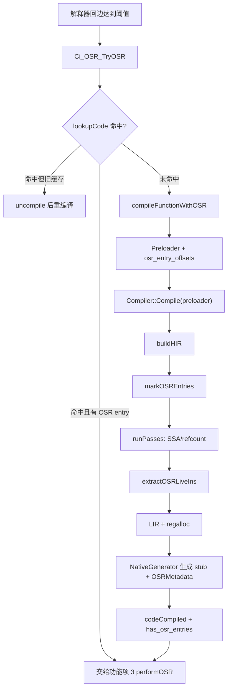
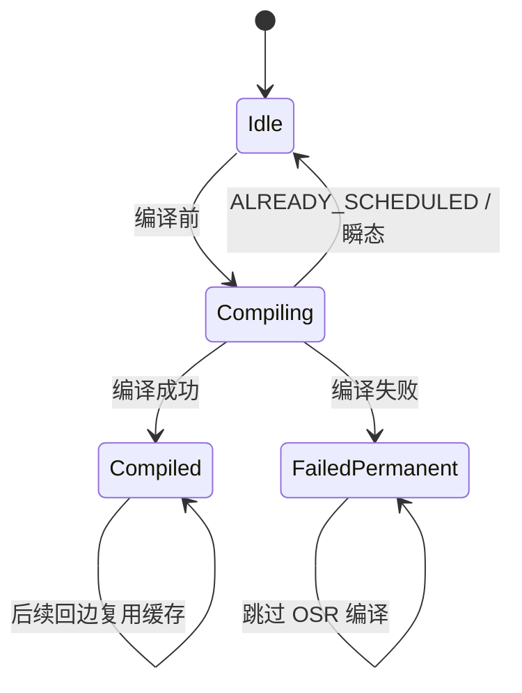
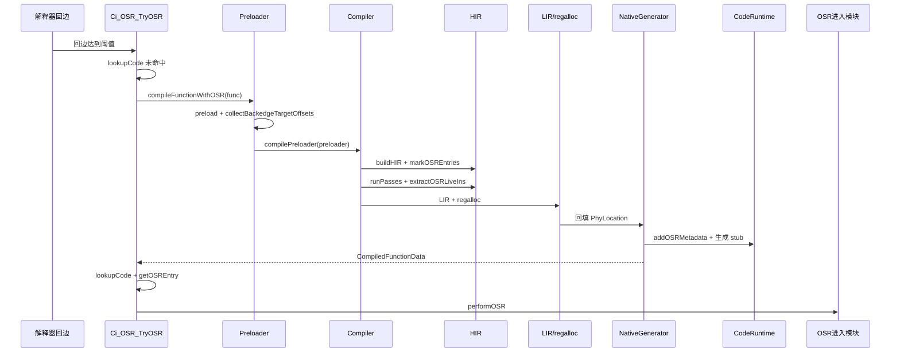

# 1. 详细设计说明书 - OSR 编译模块（Loop Header Secondary Entry）

## 1.1 产品版本&密级

| 产品名称 | CinderX JIT |
| -------- | ----------- |
| 版本号 | 3.14 |
| 密级 | 内部公开 |

## 1.2 拟制信息

| 角色 | 姓名 | 日期 |
| ---- | ---- | ---- |
| 拟制 | @codex | 2026-05-21 |
| 审核 |  |  |
| 批准 |  |  |

## 1.3 修订记录

| 日期 | 版本 | 修改描述 |
| ---- | ---- | -------- |
| 2026-05-21 | V1.0 | 初始版本，依据 `hot-loop-osr-function-design.md` 的功能项 2 拆分 OSR 编译详细设计 |

## 1.4 Keywords 关键词

OSR, On-Stack Replacement, JIT, HIR, LIR, Loop Header, Secondary Entry, FrameState, OSRMetadata, DeoptMetadata, Preloader, PhyLocation

## 1.5 Abstract 摘要

本文档描述 CinderX JIT 热循环 OSR 能力中的 **OSR 编译模块**。该模块在热循环被检测到后，为热循环所在函数生成普通函数入口和 loop-header secondary entry 共存的 JIT 编译产物。模块复用现有 `Preloader -> Compiler::Compile -> HIR -> LIR -> regalloc -> NativeGenerator` 编译管线，通过 `Preloader` 传递 OSR 入口偏移，在 HIR loop header 处插入 OSR entry 锚点，提取可从解释器帧恢复的 live-in 集合，并在寄存器分配后生成 per-backedge OSR entry stub 和 `OSRMetadata`。OSR 编译模块不负责解释器回边计数，也不负责运行时帧迁移；它向 OSR 进入模块交付 `CompiledFunction`、`OSRMetadata[]` 和 `has_osr_entries` 标志。

## 1.6 List of abbreviations 缩略语清单

| 缩略语 | 英文全称 | 中文名 |
| ------ | -------- | ------ |
| OSR | On-Stack Replacement | 栈上替换 |
| JIT | Just-In-Time Compilation | 即时编译 |
| HIR | High-level Intermediate Representation | 高级中间表示 |
| LIR | Low-level Intermediate Representation | 低级中间表示 |
| SSA | Static Single Assignment | 静态单赋值 |
| CFG | Control Flow Graph | 控制流图 |
| BCIndex | Bytecode Index | 字节码 code-unit 索引 |
| BCOffset | Bytecode Offset | 字节码字节偏移 |
| FrameState | Frame State | HIR 中的解释器帧抽象状态 |
| PhyLocation | Physical Location | 寄存器分配后的物理位置 |
| Deopt | Deoptimization | 逆优化 |
| Stub | Stub Code | 入口桥接机器码片段 |
| DFX | Design for Excellence | 可靠性、性能、安全等工程属性设计 |

## 1.7 简介

### 1.7.1 文档目的

本文档面向负责功能项 2 的开发者，给出可直接指导实现的详细设计。重点回答以下问题：

1. OSR 编译如何复用现有函数级 JIT 编译链路。
2. loop header secondary entry 信息如何从解释器侧回边转换为编译期入口偏移。
3. `OSRMetadata` 如何从 HIR `FrameState`、refcount live regs 和 regalloc 结果中构建。
4. NativeGenerator 如何额外生成 per-backedge OSR entry stub。
5. 编译缓存、失败持久化和与 OSR 进入模块的交付边界如何定义。

### 1.7.2 模块边界

本模块负责：

| 子能力 | 说明 |
| ------ | ---- |
| OSR-aware 编译入口 | 在热循环触发时编译带 OSR entry 的函数，或升级旧缓存 |
| OSR 偏移注入 | 收集函数中 `JUMP_BACKWARD` 的循环头目标，写入 `Preloader` |
| HIR entry 标注 | 在 HIR loop header basic block 上插入 `OSREntry` 锚点 |
| live-in 提取 | 从 `OSREntry` 的 `FrameState` 和 `live_regs()` 提取可恢复值 |
| 元数据构建 | 生成 `OSRMetadata` / `OSRLiveIn`，并在 regalloc 后回填 `PhyLocation` |
| stub 生成 | 生成 per-backedge OSR entry stub 的机器码，并记录 entry point offset |
| 缓存策略 | 标识 OSR-aware 编译产物，避免旧缓存和不可进入回边导致重复编译 |

本模块不负责：

| 非职责 | 所属功能项 |
| ------ | ---------- |
| 解释器 `JUMP_BACKWARD_JIT` 回边计数、阈值判断 | 功能项 1：热循环检测 |
| `performOSR()` 清理非 live-in、构造 `OSRState`、调用 stub | 功能项 3：OSR 进入 |
| stub 运行期间的帧所有权和三态返回处理 | 功能项 3：OSR 进入 |
| JIT guard 失败后的 deopt 恢复和降级 | 功能项 4：OSR 退出与降级 |

### 1.7.3 设计原则

1. **不新建 trace JIT**：仍编译完整函数，OSR entry 只是额外入口。
2. **不改变 `Compiler::Compile()` 对外签名**：OSR 信息放入 `hir::Preloader`。
3. **复用 deopt 元数据思想**：deopt 是 `JIT -> 解释器`，OSR 编译元数据描述反向的 `解释器 -> JIT`。
4. **保守拒绝**：无法从 `FrameState` 安全恢复的 live-in 直接拒绝该 entry。
5. **正常 JIT 行为兼容**：非 OSR 场景下 `Preloader::osrEntryTargetOffsets()` 为空，编译行为保持不变。

# 2. 上游文档引用

| 文档或源码 | 版本/位置 | 说明 |
| ---------- | --------- | ---- |
| `docs/design/hot-loop-osr/hot-loop-osr-function-design.md` | V7.0 | 上游功能设计，功能项 2 是本文档直接输入 |
| `cinderx/Jit/compiler.cpp` | `Compiler::Compile(const Preloader&)` | 当前 HIR 构建、pass、LIR/codegen 主链路 |
| `cinderx/Jit/hir/preload.h` | `Preloader::makePreloader()` | OSR entry 偏移的传递载体 |
| `cinderx/Jit/hir/builder.cpp` | `HIRBuilder::translate()` | 当前已有 `loop_headers` 集合，可用于匹配 loop header |
| `cinderx/Jit/hir/frame_state.h` | `FrameState` | live-in 源 slot 反查依据 |
| `cinderx/Jit/hir/refcount_insertion.cpp` | `fillDeoptLiveRegs()` / `bindGuards()` | 获取 `RegState`、`RefKind`、`ValueKind` 的可复用位置 |
| `cinderx/Jit/deopt.h` | `DeoptMetadata` / `LiveValue` | `OSRMetadata` 对称设计依据 |
| `cinderx/Jit/code_runtime.h` | `CodeRuntime::addDeoptMetadata()` | 新增 `addOSRMetadata()` 的对称扩展点 |
| `cinderx/Jit/codegen/gen_asm.cpp` | `NativeGenerator::getVectorcallEntry()` / `generateCode()` | LIR、regalloc、FrameInfo 和机器码生成路径 |
| `cinderx/Jit/codegen/environ.h` | `Environ::asm_tstate` 等 | OSR stub 需要设置的 Environ VReg |
| `cinderx/Jit/bytecode.h` | `BytecodeInstruction::getJumpTarget()` | 收集 `JUMP_BACKWARD` 目标偏移的结构化 API |

# 3. 实现设计：OSR 编译模块

## 3.1 实现概述

### 3.1.1 总体方案

OSR 编译模块在现有编译管线中增加一条“旁路信息流”：



核心思路是：`Preloader` 只多携带一个 “这个函数有哪些 loop header 可以作为 OSR entry” 的列表；后续所有编译阶段从这个列表逐步生成可执行入口和可恢复元数据。

### 3.1.2 现有编译链路中的插入点

当前 `Compiler::Compile(const Preloader&)` 的关键顺序是：

1. 检查 globals/builtins 是否为 dict。
2. `hir::buildHIR(preloader)` 构建 HIR。
3. `Compiler::runPasses(*irfunc, config)` 执行 SSA、优化、refcount 等 pass。
4. `NativeGenerator` 将 HIR 降到 LIR、做寄存器分配、生成机器码。
5. 组装 `CompiledFunctionData`。

OSR 编译需要三个插入点：

| 插入点 | 位置 | 新增动作 |
| ------ | ---- | -------- |
| HIR 构建后、pass 前 | `compiler.cpp` 中 `buildHIR` 后 | `irfunc->markOSREntries(preloader.osrEntryTargetOffsets())` |
| refcount pass 后、LIR 前 | `runPasses` 后 | `irfunc->extractOSRLiveIns()`，得到稳定 live-in HIR register 列表 |
| regalloc 后、机器码生成时 | `NativeGenerator::generateCode()` 附近 | 回填 `PhyLocation`，生成 OSR entry stub |

### 3.1.3 设计约束

| 约束 | 设计处理 |
| ---- | -------- |
| `Compile()` 现有调用点多 | 不改 `Compile()` 签名，所有信息通过 `Preloader` 传入 |
| `Preloader` 在 `compilePreloaderImpl()` 中是 `const` | 在 `Preloader::makePreloader()` 创建阶段注入 OSR 偏移，不使用 `const_cast` |
| kNormal 模式无内联帧 | `pyjit.cpp` 已在 `frame_mode != kLightweight` 时关闭 inliner，OSR 无需额外禁用 |
| 非空操作数栈难以恢复 | MVP 仅接受空操作数栈 loop header，`stack_index` 保留给 Phase 2 |
| live-in 所有权必须明确 | MVP 仅接受 `RefKind::kOwned`、`ValueKind::kObject` 且有 localsplus 源 slot 的值 |
| aarch64 stub 与 x86_64 ABI 不同 | MVP 仅在 `CINDER_AARCH64` 下启用 stub 生成 |

## 3.2 关键算法与流程

### 3.2.1 回边目标收集：`collectBackedgeTargetOffsets`

目标：从 `PyCodeObject` 中收集所有 `JUMP_BACKWARD` / `JUMP_BACKWARD_NO_INTERRUPT` 的跳转目标，也就是 loop header 的 `BCOffset`。

输入输出：

| 项 | 类型 | 说明 |
| -- | ---- | ---- |
| 输入 | `BorrowedRef<PyCodeObject> code` | 当前待编译函数的 code object |
| 输出 | `std::vector<BCOffset>` | loop header 字节偏移列表 |

伪代码：

```cpp
std::vector<BCOffset> collectBackedgeTargetOffsets(BorrowedRef<PyCodeObject> code) {
  std::vector<BCOffset> result;
  BytecodeInstructionBlock block{code};
  for (BytecodeInstruction instr : block) {
    int op = instr.opcode();
    if (op == JUMP_BACKWARD || op == JUMP_BACKWARD_NO_INTERRUPT) {
      result.push_back(instr.getJumpTarget());
    }
  }
  sort(result.begin(), result.end());
  result.erase(unique(result.begin(), result.end()), result.end());
  if (result.size() > CI_OSR_MAX_BACKEDGES) {
    result.resize(CI_OSR_MAX_BACKEDGES);
  }
  return result;
}
```

实现要点：

1. 使用 `BytecodeInstructionBlock`，不要手写 `_Py_CODEUNIT` 扫描。它已处理 `EXTENDED_ARG`，`BytecodeInstruction::oparg()` 可得到完整 oparg。
2. 使用 `BytecodeInstruction::getJumpTarget()`，避免重复实现 inline cache size、正向/反向跳转差异。
3. 输出使用 `BCOffset`，因为 HIR block 和 `FrameState::cur_instr_offs` 使用字节偏移；解释器侧 `BackedgeEntry` 可以继续保存 `BCIndex`。
4. 去重后保留稳定顺序，方便日志、测试和 metadata 输出稳定。

### 3.2.2 `Preloader` 扩展与 OSR 偏移注入

在 `cinderx/Jit/hir/preload.h` 中扩展 `Preloader`：

```cpp
class Preloader {
 public:
  const std::vector<BCOffset>& osrEntryTargetOffsets() const {
    return osr_entry_offsets_;
  }

  void setOSREntryTargetOffsets(std::vector<BCOffset> offsets) {
    osr_entry_offsets_ = std::move(offsets);
  }

 private:
  std::vector<BCOffset> osr_entry_offsets_;
};
```

注入位置：`Preloader::makePreloader(...)` 创建 `preloader`、执行 `preloader->preload()` 成功后、返回前。

```cpp
auto preloader = std::unique_ptr<Preloader>(new Preloader(...));
bool success = preloader->preload();
if (!success) {
  return nullptr;
}
#if defined(CINDER_AARCH64)
preloader->setOSREntryTargetOffsets(collectBackedgeTargetOffsets(code));
#endif
return preloader;
```

为什么放在 `makePreloader()`：

1. 覆盖所有编译路径：`compile_func`、`tryCompilePreloaded`、后台 compile worker 都最终使用 preloader。
2. `compilePreloaderImpl()` 的 `preloader` 参数是 `const hir::Preloader&`，不应在其中修改。
3. 即使正常函数级 JIT 先发生，也能生成 OSR-aware 产物，避免后续 OSR 命中旧缓存。

### 3.2.3 OSR 专用编译入口：`compileFunctionWithOSR`

`compileFunctionWithOSR()` 是热循环触发时使用的入口。它不绕过现有 preload 机制，只是用更严格的运行时校验包装现有流程。

接口：

```cpp
Result compileFunctionWithOSR(BorrowedRef<PyFunctionObject> func);
```

伪代码：

```cpp
Result compileFunctionWithOSR(BorrowedRef<PyFunctionObject> func) {
  JIT_CHECK(PyFunction_Check(func), "OSR only supports function frames");

  BorrowedRef<PyCodeObject> pinned_code{func->func_code};

  hir::IsolatedPreloaders ip;
  trackEligibleCodeObjects(func, pinned_code);

  hir::Preloader* preloader = preload(func);
  if (preloader == nullptr) {
    PyErr_Clear();
    return Result::CANNOT_SPECIALIZE;
  }

  if (func->func_code != pinned_code) {
    return Result::CANNOT_SPECIALIZE;
  }

  return compilePreloader(*preloader, func);
}
```

关键点：

1. `preload(func)` 可能执行 Python 代码，所以必须 pin `func->func_code` 并在 preload 后 revalidate。
2. OSR 从字节码处理程序触发，失败时应透明回退解释器；preload 失败产生的异常要清掉。
3. 使用 `IsolatedPreloaders`，与 `compile_func()` 隔离递归 preload 状态的做法一致。
4. 不单独传入某个 backedge offset。`Preloader::makePreloader()` 已收集该 code 的所有 OSR entry 目标。

### 3.2.4 编译调度：`Ci_OSR_TryOSR` 中与编译相关的部分

`Ci_OSR_TryOSR()` 横跨功能项 2 和功能项 3。本文档只定义其中编译调度和缓存查找部分，真正调用 stub 和迁移帧交给功能项 3。

编译状态按 `CompilationKey(code, builtins, globals)` 管理：



编译调度伪代码：

```cpp
int Ci_OSR_TryOSR(..., PyObject** out_result) {
  auto code = _PyFrame_GetCode(frame);
  auto builtins = _PyFrame_GetBuiltins(frame);
  auto globals = _PyFrame_GetGlobals(frame);
  BCIndex target_idx = computeJumpTargetIndex(backedge_instr, oparg);

  auto counters = Ci_OSR_GetOrCreateBackedgeCounters(code);
  if (counters == nullptr || isFailedPermanentPerCode(counters, source_idx)) {
    return 0;
  }

  auto cs = getOSRCompileState(counters, builtins, globals);
  if (cs != nullptr) {
    if (cs->state == FailedPermanent || cs->state == Compiling) {
      return 0;
    }
    if (cs->state == Compiled) {
      goto cache_lookup;
    }
  }

cache_lookup:
  auto compiled = jitCtx()->lookupCode(code, builtins, globals);
  if (compiled != nullptr) {
    auto osr_meta = getOSREntry(compiled, target_idx);
    if (osr_meta != nullptr) {
      return performOSR(...);  // 功能项 3
    }
    if (compiled->hasOSREntries()) {
      markFailedPermanentPerCode(counters, source_idx);
      return 0;
    }
    uncompile(func);
  }

  cs = getOrCreateOSRCompileState(counters, builtins, globals);
  if (cs == nullptr || !osrCompileBudgetCheck(code)) {
    markFailedPermanentPerCode(counters, source_idx);
    return 0;
  }

  cs->state = Compiling;
  Result result = compileFunctionWithOSR(func);
  if (result == Result::ALREADY_SCHEDULED) {
    cs->state = Idle;
    return 0;
  }
  if (result != Result::OK) {
    cs->state = FailedPermanent;
    return 0;
  }
  cs->state = Compiled;

  compiled = jitCtx()->lookupCode(code, builtins, globals);
  auto osr_meta = getOSREntry(compiled, target_idx);
  return osr_meta != nullptr ? performOSR(...) : 0;
}
```

### 3.2.5 `Compiler::Compile()` 内部处理

在 `hir::buildHIR(preloader)` 后、`runPasses` 前插入 OSR 标注：

```cpp
std::unique_ptr<hir::Function> irfunc(hir::buildHIR(preloader));
irfunc->reifier = ThreadedRef<>::create(preloader.reifier());

if (!preloader.osrEntryTargetOffsets().empty()) {
  irfunc->markOSREntries(preloader.osrEntryTargetOffsets());
}

Compiler::runPasses(*irfunc, config);

if (irfunc->hasOSREntries()) {
  irfunc->extractOSRLiveIns();
}
```

顺序要求：

1. `markOSREntries()` 必须在 SSA/refcount 前执行，让后续 pass 能看到 `OSREntry` 锚点。
2. `extractOSRLiveIns()` 必须在 `RefcountInsertion` 后执行，因为 `RefKind` 来自 refcount pass 填充的 `live_regs()`。
3. 代码生成阶段再回填 `PhyLocation`，因为寄存器/栈槽只有 regalloc 后才确定。

### 3.2.6 HIR entry 标注：`markOSREntries`

新增 HIR 指令：

```cpp
class OSREntry : public DeoptBase {
 public:
  explicit OSREntry(BCOffset target_offset)
      : DeoptBase(Opcode::kOSREntry, FrameState{}),
        target_offset_(target_offset) {}

  BCOffset targetOffset() const {
    return target_offset_;
  }

 private:
  BCOffset target_offset_;
};
```

新增 `hir::Function` 字段和方法：

```cpp
class Function {
 public:
  void markOSREntries(const std::vector<BCOffset>& offsets);
  bool isOSREntry(const BasicBlock* block) const;
  bool hasOSREntries() const;
  void extractOSRLiveIns();

 private:
  UnorderedMap<BCOffset, OSREntry*> osr_entries_;
};
```

`markOSREntries()` 流程：

```cpp
void Function::markOSREntries(const std::vector<BCOffset>& offsets) {
  auto wanted = UnorderedSet<BCOffset>{offsets.begin(), offsets.end()};

  for (BasicBlock& block : cfg.blocks) {
    Instr* first = block.GetFirstInstr();
    if (first == nullptr || !first->IsSnapshot()) {
      continue;
    }

    auto* snapshot = static_cast<Snapshot*>(first);
    FrameState* fs = snapshot->frameState();
    if (fs == nullptr || !wanted.contains(fs->instrOffset())) {
      continue;
    }

    if (!isEligibleOSREntry(*fs)) {
      continue;
    }

    auto* entry = OSREntry::create(fs->instrOffset());
    block.insertAfter(*first, entry);
    osr_entries_.emplace(fs->instrOffset(), entry);
  }
}
```

`isEligibleOSREntry()` 检查：

| 检查项 | 拒绝条件 | 理由 |
| ------ | -------- | ---- |
| 异常保护区 | `target_offset` 落在 `co_exceptiontable` protected range 内 | 运行时无法重建异常处理状态 |
| `FrameState::parent` | 非空 | MVP 不支持跨内联帧 OSR；kNormal 下通常不会出现 |
| `FrameState::stack` | 非空 | MVP 不恢复操作数栈上的 live-in |
| `FrameState::block_stack` | 非空 | MVP 不恢复块栈状态 |
| 已有 entry | 同一 offset 已标注 | 去重，避免重复 stub |

OSREntry 插入位置必须在 loop header block 的 `Snapshot` 之后。`bindGuards()` 会用最近的 `Snapshot` 给 deopt-like 指令绑定 `FrameState`，然后删除 `Snapshot`。因此需要扩展 `bindGuards()` 的条件，使 `OSREntry` 也获得 `FrameState`：

```cpp
if (instr.IsGuard() || instr.IsGuardIs() || instr.IsGuardType() ||
    instr.IsDeopt() || instr.IsDeoptPatchpoint() || instr.IsOSREntry()) {
  auto& deopt_like = static_cast<DeoptBase&>(instr);
  deopt_like.setFrameState(*fs);
}
```

### 3.2.7 live-in 提取：`extractOSRLiveIns`

live-in 是从解释器帧切入 JIT loop header 时，JIT 代码马上需要读取的值。它必须同时满足：

1. HIR/SSA 认为该 register 在 OSR entry 处活跃。
2. 该 register 能从解释器帧 `localsplus[]` 中找到源 slot。
3. 值类型和引用所有权可以安全转移。

算法：

```cpp
void Function::extractOSRLiveIns() {
  for (auto& [target_offset, entry] : osr_entries_) {
    FrameState* fs = entry->frameState();
    if (fs == nullptr) {
      rejectEntry(target_offset);
      continue;
    }

    bool rejected = false;
    std::vector<OSRLiveIn> live_ins;
    for (const RegState& state : entry->live_regs()) {
      OSRLiveIn live_in;
      live_in.hir_reg = state.reg;
      live_in.ref_kind = state.ref_kind;
      live_in.value_kind = state.value_kind;
      live_in.localsplus_index = findInLocalsplus(*fs, state.reg);
      live_in.stack_index = -1;  // MVP: FrameState::stack 必须为空
      live_in.reconstructible =
          live_in.value_kind == ValueKind::kObject &&
          live_in.ref_kind == RefKind::kOwned &&
          live_in.localsplus_index >= 0;

      if (!live_in.reconstructible) {
        rejectEntry(target_offset);
        rejected = true;
        live_ins.clear();
        break;
      }
      live_ins.push_back(live_in);
    }

    if (!rejected && !live_ins.empty()) {
      addOSRMetadataSkeleton(target_offset, std::move(live_ins));
    }
  }
}
```

`findInLocalsplus()`：

```cpp
int findInLocalsplus(const FrameState& fs, Register* reg) {
  for (int i = 0; i < fs.localsplus.size(); ++i) {
    if (fs.localsplus[i] == reg) {
      return i;
    }
  }
  return -1;
}
```

MVP 拒绝条件：

| 条件 | 处理 |
| ---- | ---- |
| `ValueKind != kObject` | 拒绝 entry |
| `RefKind != kOwned` | 拒绝 entry |
| `localsplus_index < 0` | 拒绝 entry |
| `FrameState::stack` 非空 | 拒绝 entry |
| `FrameState::parent != nullptr` | 拒绝 entry |

注意：被拒绝的 entry 不应生成空 `OSRMetadata`。否则运行时可能找到一个 entry，但 stub 无 live-in 初始化，导致 JIT body 读取未初始化寄存器。

### 3.2.8 LIR、regalloc 与 `PhyLocation` 回填

问题：`extractOSRLiveIns()` 阶段只能知道 HIR `Register*`，不知道这个值最终在物理寄存器还是栈槽中。

解决方案：在 LIR 中加入 `kOSREntry` pseudo instruction，把 live-in 的 HIR register 作为 operand 带过 regalloc。

流程：


实现要点：

1. `lir::LIRGenerator` 遇到 `OSREntry` 时生成 `kOSREntry` pseudo instruction。
2. `kOSREntry` 不生成正常机器指令，只用于保留 operand 和 metadata 关联。
3. regalloc 后调用 `fillOSRLiveInLocations()`，读取每个 operand 的 `getPhyRegOrStackSlot()`，写回 `OSRMetadata.live_ins[i].destination`。
4. `tstate_location`、`func_location`、`frame_location` 也需要在 regalloc 后从 `env_.asm_tstate`、`env_.asm_func`、`env_.asm_interpreter_frame` 的分配结果回填。

### 3.2.9 OSR entry stub 生成

每个 OSR entry 需要一个独立 stub，因为每个 loop header 的 live-in 集合和目标 `PhyLocation` 都可能不同。

stub 生成位置：`NativeGenerator::generateCode()` 在 `computeFrameInfo()` 后、`generateAssemblyBody()` 前后均可，推荐在 `generateAssemblyBody()` 前生成 label 并在 body label 已建立后绑定跳转目标。

stub 编译期输入：

| 输入 | 来源 |
| ---- | ---- |
| `target_offset` | `OSRMetadata` |
| loop header label | `env_.block_label_map[osr_basic_block]` |
| frame layout | `FrameInfo::size()`、`header_and_spill_size`、`saved_regs` |
| Environ VReg locations | regalloc 后的 `asm_tstate` / `asm_func` / `asm_interpreter_frame` location |
| live-in locations | `OSRLiveIn.destination` |

stub 行为由功能项 3 使用，但机器码由本模块生成：

```cpp
void NativeGenerator::generateOSREntryStub(OSRMetadata& meta) {
  meta.entry_point_offset = currentCodeOffset();

  emitSetupFrameLikePrologue(
      meta.resume_frame_total_size,
      meta.resume_header_and_spill_size,
      meta.resume_saved_regs);

  load state->tstate into tmp_tstate;
  load state->frame into tmp_frame;
  load frame->f_funcobj into tmp_func;

  moveToPhyLocation(meta.tstate_location, tmp_tstate);
  moveToPhyLocation(meta.frame_location, tmp_frame);
  moveToPhyLocation(meta.func_location, tmp_func);

  for (OSRLiveIn& live_in : meta.live_ins) {
    tmp_value = load frame->localsplus[live_in.localsplus_index];
    tmp_value = untagPyStackRef(tmp_value);
    moveToPhyLocation(live_in.destination, tmp_value);
    store PyStackRef_NULL to frame->localsplus[live_in.localsplus_index];
  }

  branch env_.block_label_map[meta.osr_block];
}
```

`moveToPhyLocation()` 必须按 `PhyLocation` 类型分派：

| 目标类型 | 生成方式 |
| -------- | -------- |
| 物理寄存器 | `mov target_reg, tmp` |
| 栈槽 | `str tmp, [fp, offset]` 或现有架构封装 |
| invalid | `JIT_ABORT` 或拒绝 entry |

stub 禁止执行 C helper 调用和 `DECREF`。原因是 caller-saved 寄存器可能保存 live-in，且 frame 仍处于当前执行帧链中。非 live-in 的延迟 DECREF 是功能项 3 的职责。

### 3.2.10 编译缓存升级策略

现有 `CompilationKey` 只包含 `(code, builtins, globals)`。如果一个函数先被普通函数级 JIT 编译，后续 OSR 触发时会命中旧缓存。为避免 “旧缓存没有 OSR entry”：

1. aarch64 上 `Preloader::makePreloader()` 默认注入所有回边目标。
2. 新编译产物设置 `CompiledFunctionData::has_osr_entries`。
3. `Ci_OSR_TryOSR()` 命中缓存时：
   - 若找到目标 `OSRMetadata`，直接交给功能项 3。
   - 若 `has_osr_entries == true` 但找不到目标，说明该回边被编译期拒绝，标记 per-code `FailedPermanent`。
   - 若 `has_osr_entries == false`，说明是旧缓存，执行 `uncompile(func)` 后重编译。

### 3.2.11 编译预算

`osrCompileBudgetCheck(code)` 在真正编译前执行，避免热循环路径同步编译过大函数。

建议 MVP 检查项：

| 检查项 | 默认阈值 | 失败状态 |
| ------ | -------- | -------- |
| code units 数量 | 1024 | per-code FailedPermanent |
| 回边数量 | 16 | 超出部分截断或 per-code FailedPermanent |
| `co_exceptiontable` 复杂度 | 不单独拒绝，只在 entry 级别拒绝 protected range | entry reject |
| async generator | 沿用 `compilePreloaderImpl()` 禁止逻辑 | per-CompilationKey FailedPermanent |

编译预算不是真正超时。同步编译一旦开始，不在中途取消。

## 3.3 行为模型

### 3.3.1 正常流程



### 3.3.2 异常流程

| 场景 | 模块行为 | 对用户程序影响 |
| ---- | -------- | -------------- |
| preload 失败 | `PyErr_Clear()`，返回 `CANNOT_SPECIALIZE` | 透明回退解释器 |
| preload 期间 `func.__code__` 变化 | 放弃本次 OSR 编译 | 透明回退解释器 |
| 已有编译任务进行中 | `ALREADY_SCHEDULED` 视为瞬态，状态回到 Idle | 后续回边可重试 |
| code size 超预算 | 标记 per-code FailedPermanent | 不再尝试该回边 OSR |
| loop header 在异常保护区 | 拒绝该 entry，不生成 metadata | 该回边不 OSR，其他回边可继续 |
| live-in 无法恢复 | 拒绝该 entry，不生成 metadata | 该回边不 OSR，其他回边可继续 |
| stub 生成失败 | 整体编译失败，状态 FailedPermanent | 透明回退解释器 |
| 缓存命中但无目标 entry | 若 OSR-aware 则标记该回边失败；若旧缓存则重编译 | 避免无限重编译 |

## 3.4 数据模型

### 3.4.1 数据结构定义

#### 3.4.1.1 `OSRLiveIn`

```cpp
struct OSRLiveIn {
  int localsplus_index{-1};
  int stack_index{-1};
  jit::codegen::PhyLocation destination;
  hir::ValueKind value_kind{hir::ValueKind::kObject};
  hir::RefKind ref_kind{hir::RefKind::kOwned};
  bool reconstructible{false};
  bool is_phi{false};

  // 编译期临时字段，不应作为运行时持久元数据使用。
  hir::Register* hir_reg{nullptr};
};
```

字段说明：

| 字段 | 含义 |
| ---- | ---- |
| `localsplus_index` | 源值在 `_PyInterpreterFrame::localsplus[]` 中的索引 |
| `stack_index` | 源值在操作数栈中的索引，MVP 固定为 -1 |
| `destination` | regalloc 后 JIT 期望的物理位置 |
| `value_kind` | live-in 值类型，MVP 仅接受 `kObject` |
| `ref_kind` | 引用所有权，MVP 仅接受 `kOwned` |
| `reconstructible` | 是否可从解释器帧恢复 |
| `hir_reg` | 与 LIR operand 关联的 HIR register，编译结束后不再使用 |

#### 3.4.1.2 `OSRMetadata`

```cpp
struct OSRMetadata {
  BCOffset target_offset;
  FrozenList<OSRLiveIn> live_ins;
  int owned_ref_count{0};
  ptrdiff_t entry_point_offset{-1};

  jit::codegen::PhyLocation tstate_location;
  jit::codegen::PhyLocation func_location;
  jit::codegen::PhyLocation frame_location;

  int32_t resume_frame_total_size{0};
  int32_t resume_header_and_spill_size{0};
  jit::codegen::PhyRegisterSet resume_saved_regs{0};

  void* entryPoint(const CompiledFunction& cf) const;
  bool allReconstructible() const;
};
```

生命周期：存储在 `CodeRuntime::osr_metadatas_` 中，生命周期与 `CompiledFunction` 一致。结构内不持有 `PyObject*` 强引用，不需要新增 GC traverse。

#### 3.4.1.3 `CodeRuntime` 扩展

```cpp
class CodeRuntime {
 public:
  std::size_t addOSRMetadata(OSRMetadata&& meta);
  OSRMetadata& getOSRMetadata(std::size_t id);
  const std::vector<OSRMetadata>& osrMetadatas() const;
  bool hasOSREntries() const;

 private:
  std::vector<OSRMetadata> osr_metadatas_;
};
```

设计要求：

1. 与 `addDeoptMetadata()` 对称，LIR/codegen 可通过 index 访问。
2. `osr_metadatas_` 只保存值类型，不持有 Python 对象。
3. `CodeRuntime::releaseReferences()` 不需要额外清理 OSR metadata。

#### 3.4.1.4 `CompiledFunctionData` 扩展

```cpp
struct CompiledFunctionData {
  ...
  bool has_osr_entries{false};
};
```

`Compiler::Compile()` 组装 `CompiledFunctionData` 时设置：

```cpp
compiled_data.has_osr_entries = code_runtime->hasOSREntries();
```

`CompiledFunction` 应提供只读访问器：

```cpp
bool hasOSREntries() const;
```

#### 3.4.1.5 `OSRCompileState`

```cpp
struct OSRCompileState {
  uint8_t state{Idle};
  uintptr_t builtins_id{0};
  uintptr_t globals_id{0};
};
```

说明：

1. 不持有 `PyObject*` 强引用，避免 `code -> co_extra -> globals -> function -> code` 不可回收环。
2. 以 `builtins` 和 `globals` 身份区分 `CompilationKey`。
3. 若未来进入生产化，应补充 dict version 校验或绑定现有 `CompilationKey` 生命周期。

### 3.4.2 数据流转


## 3.5 接口设计

### 3.5.1 内部接口设计

接口分为四类：

| 类别 | 目标调用方 | 说明 |
| ---- | ---------- | ---- |
| 编译入口 | `Ci_OSR_TryOSR` | 触发 OSR-aware 编译 |
| Preloader 查询 | `Compiler::Compile` | 获取 OSR target offsets |
| HIR 元数据 | `Compiler` / `LIRGenerator` | 标注 OSR entry、提取 live-in |
| 运行时查询 | OSR 进入模块 | 从 `CompiledFunction` 查找目标 entry |

### 3.5.2 内部接口定义

```cpp
// cinderx/Jit/osr.h
Result compileFunctionWithOSR(BorrowedRef<PyFunctionObject> func);

std::vector<BCOffset> collectBackedgeTargetOffsets(
    BorrowedRef<PyCodeObject> code);

const OSRMetadata* getOSREntry(
    BorrowedRef<CompiledFunction> compiled,
    BCIndex target_index);

bool osrCompileBudgetCheck(BorrowedRef<PyCodeObject> code);
```

```cpp
// cinderx/Jit/hir/preload.h
const std::vector<BCOffset>& Preloader::osrEntryTargetOffsets() const;
void Preloader::setOSREntryTargetOffsets(std::vector<BCOffset> offsets);
```

```cpp
// cinderx/Jit/hir/function.h
void Function::markOSREntries(const std::vector<BCOffset>& offsets);
bool Function::hasOSREntries() const;
void Function::extractOSRLiveIns();
```

```cpp
// cinderx/Jit/code_runtime.h
std::size_t CodeRuntime::addOSRMetadata(OSRMetadata&& meta);
const std::vector<OSRMetadata>& CodeRuntime::osrMetadatas() const;
bool CodeRuntime::hasOSREntries() const;
```

功能项 2 向功能项 3 交付的接口：

```cpp
using osr_entry_fn = PyObject* (*)(OSRState*);

struct OSRState {
  PyThreadState* tstate;
  _PyInterpreterFrame* frame;
  const OSRMetadata* osr_meta;
};

void* OSRMetadata::entryPoint(const CompiledFunction& cf) const;
```

## 3.6 代码实现要点

### 3.6.1 文件级改动清单

| 文件 | 改动 |
| ---- | ---- |
| `cinderx/Jit/osr.h` | 新增 `OSRLiveIn`、`OSRMetadata`、`OSRCompileState`、编译入口和查询接口 |
| `cinderx/Jit/osr.cpp` | 实现回边目标收集、预算检查、编译状态管理、`compileFunctionWithOSR()` |
| `cinderx/Jit/hir/preload.h` | `Preloader` 增加 OSR offsets 字段和访问器 |
| `cinderx/Jit/hir/preload.cpp` | 或 `preload.h` inline factory 中注入 OSR offsets |
| `cinderx/Jit/compiler.cpp` | 在 HIR build 后调用 `markOSREntries()`，pass 后调用 `extractOSRLiveIns()` |
| `cinderx/Jit/hir/hir_ops.h` | 增加 `OSREntry` opcode |
| `cinderx/Jit/hir/hir.h/.cpp` | 增加 `OSREntry` 指令类和 `IsOSREntry()` |
| `cinderx/Jit/hir/function.h/.cpp` | 增加 OSR entry 标注和 live-in 提取 |
| `cinderx/Jit/hir/refcount_insertion.cpp` | `bindGuards()` 支持 `OSREntry` |
| `cinderx/Jit/lir/instruction.*` | 增加 `kOSREntry` pseudo instruction |
| `cinderx/Jit/lir/generator.cpp` | HIR `OSREntry` 到 LIR `kOSREntry` 的转换 |
| `cinderx/Jit/codegen/autogen.cpp` | 回填 OSR live-in 的 post-regalloc location |
| `cinderx/Jit/codegen/gen_asm.h/.cpp` | 生成 OSR entry stub，记录 `entry_point_offset` |
| `cinderx/Jit/code_runtime.h/.cpp` | 存储 OSR metadata |
| `cinderx/Jit/compiled_function.h/.cpp` | 增加 `has_osr_entries` |

### 3.6.2 HIR verifier 和 printer

需要同步更新：

1. `hir/printer.cpp`：打印 `OSREntry` 的 target offset 和 live regs，便于 dump HIR。
2. `hir/instr_effects.cpp`：声明 `OSREntry` 不产生普通输出、不消耗 Python 值。
3. HIR verifier：允许 `OSREntry` 位于 `Snapshot` 后，要求其有 `FrameState` 和合法 target offset。

### 3.6.3 测试建议

| 测试层级 | 用例 |
| -------- | ---- |
| 单元测试 | `collectBackedgeTargetOffsets()` 处理 while、for、EXTENDED_ARG、重复目标 |
| HIR 测试 | loop header 处插入 `OSREntry`；异常保护区 entry 被拒绝 |
| metadata 测试 | `FrameState.localsplus` 可反查时生成 `OSRLiveIn`；borrowed/primitive/无源 slot 被拒绝 |
| LIR/regalloc 测试 | `kOSREntry` operand 经 regalloc 后回填到 `PhyLocation` |
| codegen 测试 | aarch64 stub 包含 setup frame、Environ VReg 设置、live-in steal、branch loop header |
| 集成测试 | 热 while 循环触发 OSR 后结果与解释器一致 |
| 回归测试 | 普通函数级 JIT 编译不含回边函数行为不变 |

# 4. DFX分析

## 4.1 可靠性分析

| 风险 | 影响 | 缓解 |
| ---- | ---- | ---- |
| 生成 entry 但 live-in 不完整 | JIT 读取未初始化值 | `allReconstructible()` 不通过则不生成 metadata |
| `FrameState` 与 loop header 不匹配 | 从错误字节码位置进入 | 使用 `BCOffset` 匹配 `FrameState::instrOffset()`，保留 debug assert |
| 旧缓存无 OSR entry | OSR 永远无法进入或无限重编译 | `has_osr_entries` 区分旧缓存和已拒绝 entry |
| preload 执行 Python 代码导致 code 改变 | 编译产物与运行帧不一致 | pin `func->func_code` 并 revalidate |
| 编译重入 | 状态机重复编译或死循环 | `OSRCompileState::Compiling` 防重入，`ALREADY_SCHEDULED` 回 Idle |
| stub 栈布局与正常 JIT 不一致 | deopt/epilogue 读取错误位置 | stub 使用 `FrameInfo` 同源字段：total size、header/spill、saved regs |

## 4.2 异常处理设计

1. OSR 编译失败不得向用户 Python 代码传播异常。热回边处没有语义上应抛出的用户异常，失败必须回退解释器。
2. `preload()` 失败产生的异常在 `compileFunctionWithOSR()` 清除。
3. `compilePreloaderImpl()` 返回 `PYTHON_EXCEPTION` 时，本模块也视为 OSR 编译失败并清理异常。
4. C++ 编译异常沿用现有 `compilePreloaderImpl()` 捕获逻辑，返回 `UNKNOWN_ERROR`。
5. entry 级拒绝不应影响同一函数其他回边。

## 4.3 性能分析

| 项 | 开销 | 控制方式 |
| -- | ---- | -------- |
| 正常编译时收集回边 | 线性扫描字节码 | 仅 aarch64 注入；无回边时列表为空 |
| HIR 标注 | 遍历 basic blocks | offsets 使用 set 查询 |
| live-in 提取 | 遍历 `live_regs` 和 `FrameState.localsplus` | 函数 localsplus 通常较小；上限由编译预算控制 |
| OSR stub 代码大小 | 每个回边约几十到数百字节 | `CI_OSR_MAX_BACKEDGES` 限制 |
| 同步编译停顿 | 与普通 JIT 编译同量级 | 编译前预算检查，失败持久化 |

验收要求：

1. 无 OSR 可用回边的普通 JIT 编译时间增量可量化。
2. pyperformance 无显著回归。
3. 代码大小增量与回边数量线性相关，符合上限预期。

## 4.4 安全和韧性分析

| 检查项 | 结论 |
| ------ | ---- |
| Python 语义 | OSR 是内部优化，失败透明回退，不改变用户可见语义 |
| 内存安全 | metadata 不持有 Python 强引用，避免 co_extra 引用环 |
| UAF 风险 | stub entry point 在功能项 3 获取并调用；本模块只保证 `CodeRuntime` 生命周期与 `CompiledFunction` 一致 |
| 架构韧性 | 非 aarch64 默认不生成/不启用 OSR stub |
| 并发编译 | 复用 `ThreadedCompileSerialize` 和 `CompilationKey` 活跃编译状态 |
| 降级策略 | 所有拒绝和失败均返回解释器执行 |
