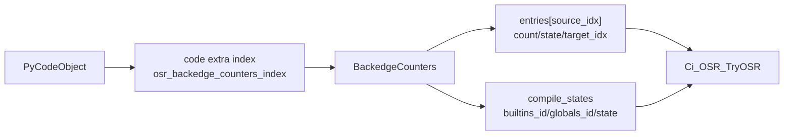
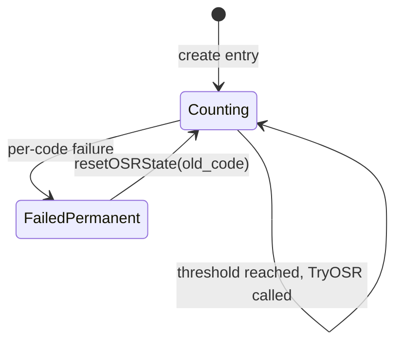
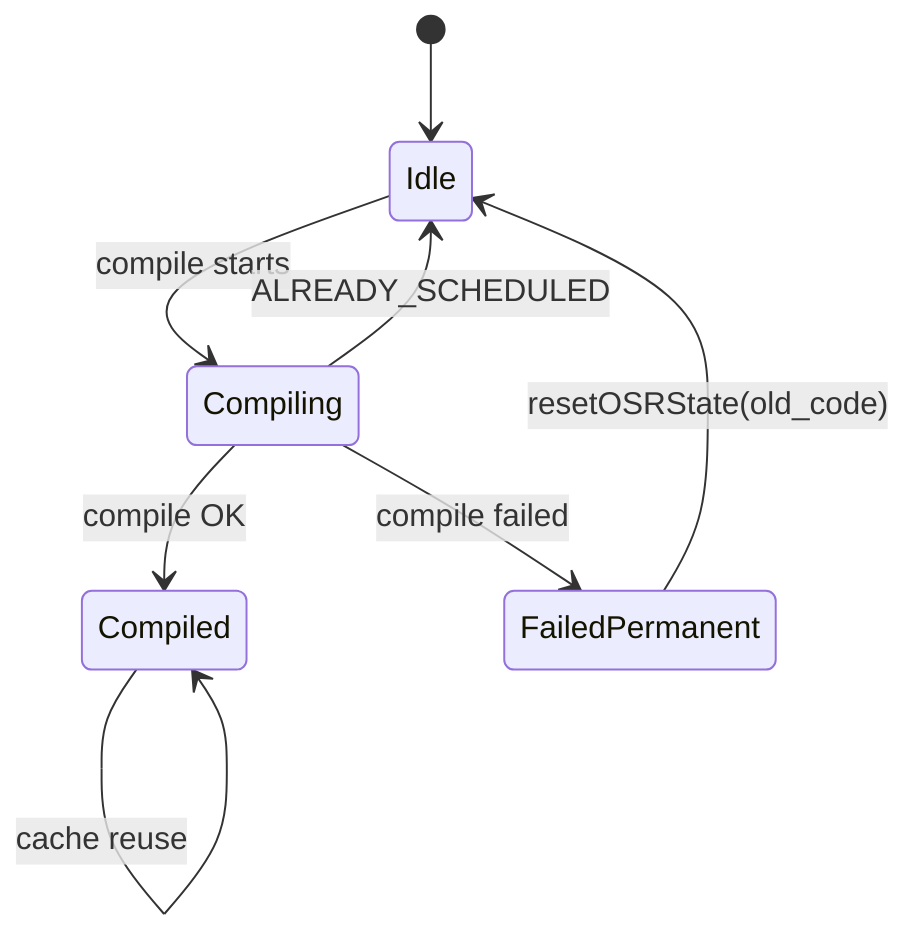

# 详细设计说明书 — OSR 热循环检测

## 产品版本&密级

| 产品 | 版本 | 密级 |
|------|------|------|
| CinderX | 3.14 | 内部公开 |

## 拟制信息

| 角色 | 姓名 | 日期 |
|------|------|------|
| 作者 | Codex | 2026-05-22 |

## 修订记录

| 版本 | 日期 | 作者 | 修改概要 |
|------|------|------|---------|
| V1.0 | 2026-05-22 | Codex | 初版，补齐功能项 1：热循环检测详细设计 |

## Keywords 关键词

OSR, hot loop, JUMP_BACKWARD, JUMP_BACKWARD_JIT, _SPECIALIZE_JUMP_BACKWARD, _JIT, BackedgeCounters, BackedgeEntry, code extra, Ci_OSR_IsEnabled, Ci_OSR_TryOSR, kNormal

## Abstract 摘要

本文档为功能设计说明书"功能项 1：热循环检测"的详细设计，聚焦解释器回边路径中的 OSR 触发逻辑。功能项 1 的职责是：在 `JUMP_BACKWARD` 回边执行时低开销地判断 OSR 是否启用，完成运行时资格门禁，对每条回边独立计数，并在计数达到阈值时调用 `Ci_OSR_TryOSR()` 进入功能项 2/3。

本模块不负责 OSR 编译、不负责帧状态迁移、不负责 JIT deopt。它向下游功能项提供唯一入口：`Ci_OSR_TryOSR(tstate, frame, this_instr, oparg, &result)`。调用后按三态返回约定处理解释器控制流：

| 返回值 | 含义 | 热循环检测模块动作 |
|--------|------|------------------|
| `1` | OSR/JIT/可能 deopt 后函数正常完成 | 恢复 caller frame，push result，继续 dispatch |
| `0` | 未尝试或拒绝 OSR，当前 frame 不变 | 恢复 stack pointer，继续解释执行 |
| `-1` | OSR/JIT/可能 deopt 后函数异常退出 | 按 `exit_unwind` 对称逻辑传播异常 |

设计重点是快速路径开销和控制流安全：OSR 默认关闭时仅执行 `static inline` 原子 flag 检查；计数路径必须严格配对 `SAVE_SP()` / `LOAD_SP()`；调用 `Ci_OSR_TryOSR()` 前必须避免持有会在返回后悬空的 `BackedgeEntry*`。

## List of abbreviations 缩略语清单

| 缩略语 | 英文全称 | 中文名 |
|--------|---------|--------|
| OSR | On-Stack Replacement | 栈上替换 |
| JIT | Just-In-Time Compilation | 即时编译 |
| BCIndex | Bytecode Index | 字节码 code-unit 索引 |
| BCOffset | Bytecode Offset | 字节码字节偏移 |
| GIL | Global Interpreter Lock | 全局解释器锁 |
| C API | C Application Programming Interface | C 接口 |
| DFX | Design for Excellence | 可靠性、性能、安全等工程属性设计 |
| FMEA | Failure Mode and Effects Analysis | 失效模式与影响分析 |

## 简介

本详细设计聚焦功能项 1 的实现层面，为开发人员提供可直接指导编码的数据结构、解释器伪代码、C/C++ 边界接口和测试建议。

**上游文档**：《OSR 热循环功能设计说明书》（`hot-loop-osr-function-design.md`）的"功能项 1：热循环检测"章节，以及核心契约章节（三态返回约定、帧所有权模型）。

**下游功能项**：功能项 2（OSR 编译）和功能项 3（OSR 进入）。功能项 1 仅触发 `Ci_OSR_TryOSR()`，不直接操作编译缓存、不生成 `OSRMetadata`、不调用 OSR entry stub。

**源码基线**（截至 2026-05-22）：

| 文件 | 用途 |
|------|------|
| `cinderx/Interpreter/3.14/cinder-bytecodes.c` | CinderX tier1 opcode override 入口 |
| `cinderx/Interpreter/3.14/Includes/generated_cases.c.h` | 自动生成的解释器 dispatch 代码，不直接编辑 |
| `cpython/Python/bytecodes.c` | 上游 `_SPECIALIZE_JUMP_BACKWARD` / `_JIT` 定义 |
| `cpython/Python/ceval_macros.h` | `SAVE_SP()` / `LOAD_SP()` / `LOAD_IP()` 宏 |
| `cpython/Include/internal/pycore_interpframe.h` | `_PyFrame_GetStackPointer()` / `_PyFrame_SetStackPointer()` / `_PyFrame_Stackbase()` |
| `cinderx/Common/code.cpp` | 现有 code extra index 申请和 get/set 模式参考 |
| `cinderx/Common/code_extra.h` | 现有 `CodeExtra` 布局，说明为什么 OSR 不直接扩展该结构 |
| `cinderx/Jit/config.h` / `pyjit.cpp` | JIT 配置、初始化、命令行 flag 注册 |

---

# 上游文档引用

| 上游文档章节 | 引用内容 |
|--------------|----------|
| 功能项 1：热循环检测 | 回边计数、两处 override、C ABI、资格门禁、SR 清单 |
| 核心契约：三态返回约定 | `Ci_OSR_TryOSR()` 返回后的解释器责任 |
| 核心契约：帧所有权模型（kNormal） | `rc=0` 帧不变；`rc!=0` 当前帧已由 JIT/deopt 路径清理 |
| 功能项 2：编译调度与缓存策略 | `Ci_OSR_TryOSR()` 内部负责编译状态，不由功能项 1 维护 |
| ADR-1：OSR 不依赖 `_Py_TIER2` | OSR 逻辑放在 `_JIT` Tier 2 逻辑之前 |
| ADR-8：CinderX 必须设置 `interp->jit` 并覆盖 `_SPECIALIZE_JUMP_BACKWARD` | 解释器回边必须路由到 `JUMP_BACKWARD_JIT` |
| ADR-9：为什么不直接扩展 CodeExtra 结构 | `BackedgeCounters` 使用独立 code extra index |
| ADR-10：解释器侧 vs 编译器侧索引单位 | 解释器侧使用 BCIndex，编译器侧使用 BCOffset |

---

# 1. 实现设计

## 1.1 实现概述

功能项 1 包含五个实现子组件：

| 子组件 | 位置 | 职责 |
|--------|------|------|
| OSR 配置与快速 flag | `cinderx/Jit/config.h`, `pyjit.cpp`, `osr.cpp`, `osr_capi.h` | 提供 `Ci_OSR_IsEnabled()` 热路径门禁 |
| 回边计数器存储 | `cinderx/Jit/osr.h`, `osr.cpp` | 通过 code extra 旁挂 `BackedgeCounters` |
| 运行时资格门禁 | `cinderx/Jit/osr.cpp`, `osr_capi.h` | 拒绝 MVP 不支持的 frame/code 形态 |
| 解释器 override | `cinderx/Interpreter/3.14/cinder-bytecodes.c` | 覆盖 `_SPECIALIZE_JUMP_BACKWARD` 和 `_JIT` |
| 三态返回处理 | `cinder-bytecodes.c` 生成后的 `_JIT` case | 根据 `Ci_OSR_TryOSR()` 返回值恢复解释器控制流 |

总体调用链：

```text
JUMP_BACKWARD 首次执行
  -> override op(_SPECIALIZE_JUMP_BACKWARD)
       强制改写为 JUMP_BACKWARD_JIT

每次 JUMP_BACKWARD_JIT 执行
  -> _CHECK_PERIODIC
  -> JUMP_BACKWARD_NO_INTERRUPT
  -> override op(_JIT)
       [0] Ci_OSR_IsEnabled() 快速门禁
       [1] SAVE_SP()
       [2] Ci_OSR_IsEligible(frame, code)
       [3] GetOrCreateBackedgeCounters(code)
       [4] FindOrCreateBackedgeEntry(source_idx)
       [5] count++，未达阈值 -> LOAD_SP() -> osr_skip
       [6] 达阈值 -> 先重置 entry count/state
       [7] Ci_OSR_TryOSR(...)
       [8] 按 rc=1/0/-1 三态恢复解释器控制流
```

## 1.2 配置与快速门禁

### 1.2.1 Config 字段

在 `Config` 中新增 OSR 配置：

```cpp
struct Config {
  bool osr_enabled{false};
  bool osr_capable{false};
  uint32_t osr_backedge_threshold{2000};
  uint32_t osr_compile_budget_code_units{1024};
  uint32_t osr_compile_warn_threshold_ms{50};
};
```

字段语义：

| 字段 | 默认值 | 语义 |
|------|--------|------|
| `osr_enabled` | `false` | 用户配置开关，生产默认关闭 |
| `osr_capable` | `false` | 当前进程是否从足够早的启动路径启用了 OSR 能力 |
| `osr_backedge_threshold` | `2000` | 单条回边触发 OSR 的执行次数 |
| `osr_compile_budget_code_units` | `1024` | 下游编译预算，功能项 1 只注册配置 |
| `osr_compile_warn_threshold_ms` | `50` | 下游编译耗时告警阈值 |

`initFlagProcessor()` 注册命令行选项：

```cpp
flag_processor.addOption(
    "osr-enabled",
    "CINDERX_OSR_ENABLED",
    getMutableConfig().osr_enabled,
    "Enable or disable OSR (On-Stack Replacement)");

flag_processor.addOption(
    "osr-backedge-threshold",
    "CINDERX_OSR_BACKEDGE_THRESHOLD",
    getMutableConfig().osr_backedge_threshold,
    "Number of backedge executions before triggering OSR compilation");

flag_processor.addOption(
    "osr-compile-budget",
    "CINDERX_OSR_COMPILE_BUDGET",
    getMutableConfig().osr_compile_budget_code_units,
    "Max code object size in code units to attempt OSR compilation");
```

### 1.2.2 C 可见全局 flag

`interpreter.c` / generated cases 是 C 代码，不能直接调用 C++ namespace 或读取 `jit::getConfig()`。热路径使用 C 可见的 `int` flag：

```c
// osr_capi.h
extern int cinderx_osr_enabled;
extern int cinderx_osr_capable;
extern int cinderx_osr_state;

static inline bool Ci_OSR_IsEnabled(void) {
    if (!_Py_atomic_load_int_relaxed(&cinderx_osr_enabled)) {
        return false;
    }
    if (!_Py_atomic_load_int_relaxed(&cinderx_osr_capable)) {
        return false;
    }
    if (_Py_atomic_load_int_relaxed(&cinderx_osr_state) != 1) {
        return false;
    }
#ifndef CINDER_AARCH64
    return false;
#endif
#ifdef Py_GIL_DISABLED
    return false;
#endif
    return true;
}
```

设计约束：

1. 使用 `int` + CPython `_Py_atomic_load_int_relaxed` / `_Py_atomic_store_int_relaxed`，避免 `_Atomic(bool)` 在 C++ 中映射为 `std::atomic<bool>` 后无法使用 C builtin 的问题。
2. `Ci_OSR_IsEnabled()` 必须是 `static inline`，不能是 extern 函数调用。
3. MVP 仅 aarch64 + GIL 构建；非支持平台直接返回 false。
4. `cinderx_osr_state == 1` 表示 JIT 处于 running 状态。具体数值应由 `syncOSRFlags()` 按 `Config::State` 映射，避免 C 侧依赖 C++ enum。

### 1.2.3 flag 同步时机

C++ 侧新增 `syncOSRFlags()`，在配置变化点同步 C 全局 flag：

```cpp
void syncOSRFlags() {
  const auto& config = getConfig();
  _Py_atomic_store_int_relaxed(&cinderx_osr_enabled, config.osr_enabled ? 1 : 0);
  _Py_atomic_store_int_relaxed(&cinderx_osr_capable, config.osr_capable ? 1 : 0);
  _Py_atomic_store_int_relaxed(
      &cinderx_osr_state,
      config.state == Config::State::kRunning ? 1 : 0);
}
```

同步点：

| 调用点 | 行为 |
|--------|------|
| `jit::initialize()` 正常启动路径 | 设置 `interp->jit = true`，设置 `osr_capable = true`，调用 `syncOSRFlags()` |
| `enable_jit_impl()` 运行期重启用 | 设置 `interp->jit = true`，但不设置 `osr_capable`，调用 `syncOSRFlags()` |
| `pause` / `resume` / `finalize` | 更新 `cinderx_osr_state` |
| flag 解析完成后 | 同步 `osr_enabled` 和阈值相关配置 |

**为什么运行期重启用不设置 `osr_capable`**：如果用户代码已执行过，部分 `JUMP_BACKWARD` 可能已经 quicken 为 `JUMP_BACKWARD_NO_JIT`，不会再进入 `_SPECIALIZE_JUMP_BACKWARD`。MVP 不做全 code object 反 quicken，因此运行期重启用时安全禁用 OSR。

## 1.3 回边计数器存储

### 1.3.1 数据结构

`BackedgeCounters` 通过独立 code extra index 旁挂到 `PyCodeObject`，不扩展现有 `CodeExtra` union。

```cpp
constexpr uint32_t CI_OSR_MAX_BACKEDGES = 16;
constexpr uint32_t CI_OSR_MAX_COMPILE_KEYS = 4;

enum class BackedgeState : uint8_t {
  kUnused = 0,
  kCounting = 1,
  kFailedPermanent = 3,
};

enum class OSRCompileStateKind : uint8_t {
  kIdle = 0,
  kCompiling = 1,
  kCompiled = 2,
  kFailedPermanent = 3,
};

struct BackedgeEntry {
  uint32_t source_index;
  uint32_t target_index;
  uint32_t count;
  uint8_t state;
  uint8_t _pad[3];
};

struct OSRCompileState {
  uintptr_t builtins_id;
  uintptr_t globals_id;
  uint8_t state;
  uint8_t _pad[7];
};

struct BackedgeCounters {
  uint32_t num_entries;
  BackedgeEntry entries[CI_OSR_MAX_BACKEDGES];
  uint32_t num_compile_states;
  OSRCompileState compile_states[CI_OSR_MAX_COMPILE_KEYS];
};
```

设计说明：

1. `BackedgeEntry` 只维护 per-code per-backedge 热度状态。`Compiling` / `Compiled` 是 per-CompilationKey 状态，放在 `OSRCompileState`。
2. `BackedgeCounters` 使用固定数组，析构时只需 `PyMem_Free`，不持有 `PyObject*` 强引用。
3. `builtins_id` / `globals_id` 是身份查找，不拥有引用，避免 `code -> co_extra -> globals -> function -> code` 环。
4. `source_index` 是回边指令位置，解释器自然单位为 code-unit index。
5. `target_index` 是 loop header 位置，由 `source_index + instruction_size - oparg` 计算，传给下游匹配 `OSRMetadata.target_offset`。

### 1.3.2 code extra 生命周期

初始化时申请独立 code extra index：

```cpp
static Py_ssize_t osr_backedge_counters_index = -1;

void initOSRCodeExtraIndex() {
  osr_backedge_counters_index =
      PyUnstable_Eval_RequestCodeExtraIndex(backedgeCountersFreefunc);
}

static void backedgeCountersFreefunc(void* ptr) {
  PyMem_Free(ptr);
}
```

访问接口：

```cpp
BackedgeCounters* getBackedgeCounters(PyCodeObject* code);
BackedgeCounters* getOrCreateBackedgeCounters(PyCodeObject* code);
```

`getOrCreateBackedgeCounters()` 算法：

```text
getOrCreateBackedgeCounters(code):
  existing = PyUnstable_Code_GetExtra(code, osr_backedge_counters_index)
  if existing != NULL:
    return existing

  counters = PyMem_Calloc(1, sizeof(BackedgeCounters))
  if counters == NULL:
    PyErr_NoMemory()
    PyErr_Clear()
    return NULL

  if PyUnstable_Code_SetExtra(code, osr_backedge_counters_index, counters) < 0:
    PyMem_Free(counters)
    PyErr_Clear()
    return NULL

  return counters
```

异常策略：功能项 1 在解释器普通执行路径中运行。分配失败或 code extra set 失败时必须清除异常并返回 `NULL`，让解释器透明继续执行。

### 1.3.3 查找或创建 BackedgeEntry

```cpp
BackedgeEntry* findOrCreateBackedgeEntry(
    BackedgeCounters* counters,
    uint32_t source_index,
    uint32_t target_index) {
  for (uint32_t i = 0; i < counters->num_entries; i++) {
    BackedgeEntry* entry = &counters->entries[i];
    if (entry->source_index == source_index) {
      return entry;
    }
  }

  if (counters->num_entries >= CI_OSR_MAX_BACKEDGES) {
    return nullptr;
  }

  BackedgeEntry* entry = &counters->entries[counters->num_entries++];
  entry->source_index = source_index;
  entry->target_index = target_index;
  entry->count = 0;
  entry->state = static_cast<uint8_t>(BackedgeState::kCounting);
  return entry;
}
```

注意事项：

1. 新 entry 必须初始化为 `Counting(1)`，否则首次遇到的新回边会因为 `state != Counting` 永久不计数。
2. 达到 `CI_OSR_MAX_BACKEDGES` 后返回 `NULL`，解释器继续执行，不抛异常。
3. `target_index` 在创建时写入，后续命中同一 `source_index` 时不再重新计算。Debug 构建可断言重新计算值一致。

### 1.3.4 C opaque 访问器

`cinder-bytecodes.c` 是 C 代码，不直接读 C++ 结构。`osr_capi.h` 暴露 opaque 类型和访问器：

```c
typedef struct Ci_BackedgeCounters Ci_BackedgeCounters;
typedef struct Ci_BackedgeEntry Ci_BackedgeEntry;

Ci_BackedgeCounters* Ci_OSR_GetBackedgeCounters(PyCodeObject* code);
Ci_BackedgeCounters* Ci_OSR_GetOrCreateBackedgeCounters(PyCodeObject* code);
Ci_BackedgeEntry* Ci_OSR_BackedgeCountersFindOrCreate(
    Ci_BackedgeCounters* counters,
    uint32_t source_index,
    uint32_t target_index);

uint32_t Ci_OSR_BackedgeGetCount(Ci_BackedgeEntry* entry);
void Ci_OSR_BackedgeSetCount(Ci_BackedgeEntry* entry, uint32_t count);
uint8_t Ci_OSR_BackedgeGetState(Ci_BackedgeEntry* entry);
void Ci_OSR_BackedgeSetState(Ci_BackedgeEntry* entry, uint8_t state);
uint32_t Ci_OSR_BackedgeIncrement(Ci_BackedgeEntry* entry);
```

MVP 不支持 free-threading，但访问器仍应集中封装读写，方便 Phase 2 将 `count/state` 切换为 `_Py_atomic_*`。

## 1.4 运行时资格门禁

`Ci_OSR_IsEligible(frame, code)` 是热路径中进入计数前的运行时门禁。它只做低成本、无需编译信息的检查；需要 HIR/FrameState 的检查留给功能项 2。

```cpp
bool isOSREligible(PyThreadState* tstate, _PyInterpreterFrame* frame, PyCodeObject* code) {
  if (code->co_flags & (CO_GENERATOR | CO_COROUTINE | CO_ASYNC_GENERATOR)) {
    return false;
  }
  if (getConfig().frame_mode != FrameMode::kNormal) {
    return false;
  }
  if (frame->frame_obj != nullptr) {
    return false;
  }
  PyObject* func = PyStackRef_AsPyObjectBorrow(frame->f_funcobj);
  if (!PyFunction_Check(func)) {
    return false;
  }
  if (frame->stackpointer != _PyFrame_Stackbase(frame)) {
    return false;
  }
  return true;
}
```

拒绝条件：

| 拒绝条件 | 检查方式 | 理由 |
|----------|----------|------|
| generator/coroutine/async generator | `co_flags` | 帧生命周期由迭代器/协程对象管理，MVP 不接管 |
| 非 kNormal | `Config::frame_mode` | 设计基于 datastack 上的 `_PyInterpreterFrame` |
| 已逃逸帧 | `frame->frame_obj != NULL` | Python 层持有 frame object，OSR 修改 locals/instr_ptr 可观测 |
| 非函数帧 | `PyFunction_Check(f_funcobj)` | 下游编译入口需要 `PyFunctionObject` |
| 操作数栈非空 | `frame->stackpointer != _PyFrame_Stackbase(frame)` | MVP 不恢复 stack live-in，`for` 循环因此被拒绝 |
| 非 aarch64 / free-threading | `Ci_OSR_IsEnabled()` 已处理 | 平台硬门禁在更早的 static inline 中完成 |

补充说明：

1. pending exception 不需要检查。`JUMP_BACKWARD` 只会在循环体正常路径到达；如果有 pending exception，解释器已跳转到 error 路径。
2. 异常保护区不在运行时检查。CPython 3.14 没有运行时 block stack 字段，protected range 检查由功能项 2 的 `markOSREntries()` 完成。
3. inliner 不需要检查。kNormal 下 `pyjit.cpp` 已禁用 HIR inliner。

## 1.5 解释器 override 设计

### 1.5.1 覆盖 `_SPECIALIZE_JUMP_BACKWARD`

CinderX 必须覆盖上游 `_SPECIALIZE_JUMP_BACKWARD`，强制把 `JUMP_BACKWARD` quicken 为 `JUMP_BACKWARD_JIT`：

```c
override tier1 op(_SPECIALIZE_JUMP_BACKWARD, (--)) {
    if (this_instr->op.code == JUMP_BACKWARD) {
        this_instr->op.code = JUMP_BACKWARD_JIT;
        next_instr = this_instr;
        DISPATCH_SAME_OPARG();
    }
}
```

设计理由：

1. 上游逻辑依赖 `tstate->interp->jit`。CinderX 不启用 `_Py_TIER2`，不能依赖上游 Tier 2 初始化。
2. OSR 必须保证未来首次执行的回边进入 `JUMP_BACKWARD_JIT`，否则 `_JIT` 子操作不会运行。
3. 已经 quicken 为 `JUMP_BACKWARD_NO_JIT` 的历史回边无法通过本 override 恢复，因此还需要 `osr_capable` 限制运行期重启用场景。

### 1.5.2 覆盖 `_JIT`

`JUMP_BACKWARD_JIT` 宏展开包含 `_JIT` 子操作。cases generator 支持 `override op(_JIT)`，不支持 `override macro(JUMP_BACKWARD_JIT)`。OSR 逻辑插在上游 Tier 2 逻辑之前：

```c
override tier1 op(_JIT, (--)) {
    if (!Ci_OSR_IsEnabled()) {
        goto osr_skip;
    }

    PyCodeObject* code = _PyFrame_GetCode(frame);
    SAVE_SP();

    if (!Ci_OSR_IsEligible(tstate, frame, code)) {
        goto osr_restore;
    }

    uint32_t source_idx = (uint32_t)(this_instr - _PyCode_CODE(code));
    uint32_t target_idx = Ci_OSR_ComputeJumpTargetIndex(code, source_idx, oparg);

    Ci_BackedgeCounters* counters = Ci_OSR_GetOrCreateBackedgeCounters(code);
    if (counters == NULL) {
        goto osr_restore;
    }

    Ci_BackedgeEntry* entry =
        Ci_OSR_BackedgeCountersFindOrCreate(counters, source_idx, target_idx);
    if (entry == NULL) {
        goto osr_restore;
    }

    if (Ci_OSR_BackedgeGetState(entry) != CI_OSR_BACKEDGE_COUNTING) {
        goto osr_restore;
    }

    uint32_t count = Ci_OSR_BackedgeIncrement(entry);
    if (count < Ci_OSR_GetBackedgeThreshold()) {
        goto osr_restore;
    }

    // entry 指针在 Ci_OSR_TryOSR 返回后可能悬空，所以调用前完成状态更新。
    Ci_OSR_BackedgeSetCount(entry, 0);
    Ci_OSR_BackedgeSetState(entry, CI_OSR_BACKEDGE_COUNTING);

    PyObject* osr_result = NULL;
    int osr_rc = Ci_OSR_TryOSR(tstate, frame, this_instr, oparg, &osr_result);

    if (osr_rc == 1) {
        _Py_LeaveRecursiveCallPy(tstate);
        frame = tstate->current_frame;
        LOAD_SP();
        LOAD_IP(frame->return_offset);
        stack_pointer[0] = PyStackRef_FromPyObjectSteal(osr_result);
        stack_pointer++;
        DISPATCH();
    }

    if (osr_rc == -1) {
        _Py_LeaveRecursiveCallPy(tstate);
        frame = tstate->current_frame;
        if (frame->owner == FRAME_OWNED_BY_INTERPRETER) {
            tstate->current_frame = frame->previous;
            return NULL;
        }
        frame->return_offset = 0;
        LOAD_SP();
        next_instr = frame->instr_ptr;
        goto error;
    }

    // osr_rc == 0: frame 不变，恢复当前 frame 的 stack pointer。
    LOAD_SP();
    goto osr_skip;

osr_restore:
    LOAD_SP();

osr_skip:
    // 保留上游 _JIT Tier 2 逻辑。
}
```

实现时应使用 cases generator 的真实变量名和栈 push helper。上方代码强调控制流和不变量，不要求逐字照搬。

### 1.5.3 `SAVE_SP()` / `LOAD_SP()` 配对规则

`SAVE_SP()` 将局部变量 `stack_pointer` 写回 `frame->stackpointer`。`LOAD_SP()` 从 `frame->stackpointer` 读回局部变量；debug 构建中 `_PyFrame_GetStackPointer()` 会把 `frame->stackpointer` 置为 `NULL`。

规则：

1. 只有在确认要访问 `frame->stackpointer` 或调用 C API 前才执行 `SAVE_SP()`。
2. 每条 `SAVE_SP()` 后继续解释当前 frame 的路径，都必须且只能执行一次 `LOAD_SP()`。
3. `rc=1/-1` 时当前 frame F 已被 JIT/deopt 路径消费，不能对旧 F 执行 `LOAD_SP()`；必须先 `frame = tstate->current_frame`。
4. `rc=0` 时 frame 不变，直接对当前 frame 执行 `LOAD_SP()`。
5. `osr_skip` 标签前不能假设 `stack_pointer` 已恢复；所有进入 `osr_skip` 的路径必须已经完成必要的恢复。

### 1.5.4 source/target index 计算

解释器侧 `source_idx` 使用 code-unit index：

```c
uint32_t source_idx = (uint32_t)(this_instr - _PyCode_CODE(code));
```

`target_idx` 必须使用已经累积完整 `EXTENDED_ARG` 的 `oparg`，不能重新从 `_Py_OPARG(*this_instr)` 读取。推荐封装：

```c
uint32_t Ci_OSR_ComputeJumpTargetIndex(
    PyCodeObject* code,
    uint32_t source_idx,
    uint32_t oparg);
```

语义等同于 CPython jump target 计算：

```text
target_idx = source_idx + instruction_size_in_code_units - oparg
```

其中 `instruction_size_in_code_units` 包含 inline cache entries。实现应复用现有 bytecode helper 或与 `BytecodeInstruction::getJumpTarget()` 保持一致，避免手写遗漏 cache size。

## 1.6 三态返回处理

### 1.6.1 rc=0：未尝试

`Ci_OSR_TryOSR()` 返回 0 时，必须满足功能项 3 的帧不变契约：

| 项 | 状态 |
|----|------|
| `frame` | 仍是进入 `_JIT` 时的当前 frame |
| `tstate->current_frame` | 未改变 |
| `localsplus` | 未改变 |
| `instr_ptr` | 未改变 |
| `stack_pointer` | 需要通过 `LOAD_SP()` 从 frame 恢复 |

处理：

```c
LOAD_SP();
goto osr_skip;
```

### 1.6.2 rc=1：函数正常完成

`rc=1` 表示 OSR 进入后函数已经运行到结束。可能是 JIT 直接 return，也可能是 JIT deopt 后解释器运行到函数结束。当前 frame F 已被 PopFrame，`tstate->current_frame` 指向 caller frame。

处理步骤：

```c
_Py_LeaveRecursiveCallPy(tstate);
frame = tstate->current_frame;
LOAD_SP();
LOAD_IP(frame->return_offset);
push osr_result;
DISPATCH();
```

注意：

1. `_Py_LeaveRecursiveCallPy()` 必须执行，用于匹配 `Ci_EvalFrame` 入口的递归计数。
2. `osr_result` 已是 owned `PyObject*`，push 到 caller 栈时使用 steal 语义。
3. `LOAD_IP(frame->return_offset)` 与普通 `RETURN_VALUE` 路径对称。

### 1.6.3 rc=-1：函数异常退出

`rc=-1` 表示 OSR 进入后函数异常退出，Python exception 已设置。当前 frame F 已被 PopFrame，`tstate->current_frame` 指向 caller frame 或 entry frame。

非顶层 Python caller：

```c
_Py_LeaveRecursiveCallPy(tstate);
frame = tstate->current_frame;
frame->return_offset = 0;
LOAD_SP();
next_instr = frame->instr_ptr;
goto error;
```

顶层 entry frame：

```c
_Py_LeaveRecursiveCallPy(tstate);
frame = tstate->current_frame;
if (frame->owner == FRAME_OWNED_BY_INTERPRETER) {
    tstate->current_frame = frame->previous;
    return NULL;
}
```

原因：`exit_unwind` 对 `FRAME_OWNED_BY_INTERPRETER` 有断言和专门处理。顶层函数 OSR 异常不能直接 `goto error`。

## 1.7 与功能项 2/3 的边界

功能项 1 只做检测和触发，明确不承担以下职责：

| 非职责 | 所属功能项 | 说明 |
|--------|------------|------|
| per-CompilationKey 编译状态迁移 | 功能项 2 | `OSRCompileState` 由 `Ci_OSR_TryOSR()` 内部管理 |
| 编译预算检查 | 功能项 2 | 功能项 1 只注册配置 |
| 旧缓存升级 / uncompile | 功能项 2 | 由 `Ci_OSR_TryOSR()` 处理 |
| live-in 提取和 `OSRMetadata` | 功能项 2 | 需要 HIR / regalloc 信息 |
| `performOSR()` | 功能项 3 | 帧迁移、stub 调用和 deferred DECREF |
| deopt 恢复 | 功能项 4 | 复用现有 JIT deopt |

功能项 1 调用下游的唯一接口：

```c
int Ci_OSR_TryOSR(
    PyThreadState* tstate,
    _PyInterpreterFrame* frame,
    _Py_CODEUNIT* backedge_instr,
    uint32_t oparg,
    PyObject** out_result);
```

---

# 2. 数据模型

## 2.1 BackedgeCounters 数据流



生命周期：

| 阶段 | 行为 |
|------|------|
| 首次热路径访问 | `GetOrCreateBackedgeCounters` 分配并挂到 code extra |
| 普通执行 | 回边通过 `source_index` 查找 entry，递增 count |
| code 修改 | 功能项 4 的 `resetOSRState(old_code)` 重置 count/state 和 compile_states |
| code 销毁 | code extra freefunc `PyMem_Free` 释放整个 `BackedgeCounters` |

## 2.2 状态机

`BackedgeEntry.state` 只包含热度层状态：



per-CompilationKey 编译状态由功能项 2 使用：



功能项 1 在解释器快速路径只检查 `BackedgeEntry.state == Counting`。不读取 `OSRCompileState`，避免把编译策略泄漏到解释器层。

---

# 3. 接口设计

## 3.1 C 头文件：`osr_capi.h`

`osr_capi.h` 被 C 解释器代码包含，必须 C/C++ 兼容。

```c
#pragma once

#include "Python.h"
#include "pycore_interpframe.h"
#include "pycore_pyatomic_ft_wrappers.h"

#ifdef __cplusplus
extern "C" {
#endif

extern int cinderx_osr_enabled;
extern int cinderx_osr_capable;
extern int cinderx_osr_state;

#define CI_OSR_BACKEDGE_COUNTING 1
#define CI_OSR_BACKEDGE_FAILED_PERMANENT 3

static inline bool Ci_OSR_IsEnabled(void);

typedef struct Ci_BackedgeCounters Ci_BackedgeCounters;
typedef struct Ci_BackedgeEntry Ci_BackedgeEntry;

bool Ci_OSR_IsEligible(
    PyThreadState* tstate,
    _PyInterpreterFrame* frame,
    PyCodeObject* code);

uint32_t Ci_OSR_GetBackedgeThreshold(void);
uint32_t Ci_OSR_ComputeJumpTargetIndex(
    PyCodeObject* code,
    uint32_t source_index,
    uint32_t oparg);

Ci_BackedgeCounters* Ci_OSR_GetBackedgeCounters(PyCodeObject* code);
Ci_BackedgeCounters* Ci_OSR_GetOrCreateBackedgeCounters(PyCodeObject* code);
Ci_BackedgeEntry* Ci_OSR_BackedgeCountersFindOrCreate(
    Ci_BackedgeCounters* counters,
    uint32_t source_index,
    uint32_t target_index);

uint32_t Ci_OSR_BackedgeIncrement(Ci_BackedgeEntry* entry);
uint32_t Ci_OSR_BackedgeGetCount(Ci_BackedgeEntry* entry);
void Ci_OSR_BackedgeSetCount(Ci_BackedgeEntry* entry, uint32_t count);
uint8_t Ci_OSR_BackedgeGetState(Ci_BackedgeEntry* entry);
void Ci_OSR_BackedgeSetState(Ci_BackedgeEntry* entry, uint8_t state);

int Ci_OSR_TryOSR(
    PyThreadState* tstate,
    _PyInterpreterFrame* frame,
    _Py_CODEUNIT* backedge_instr,
    uint32_t oparg,
    PyObject** out_result);

#ifdef __cplusplus
}
#endif
```

## 3.2 C++ 内部接口：`osr.h`

```cpp
namespace jit {

struct BackedgeEntry;
struct BackedgeCounters;

BackedgeCounters* getBackedgeCounters(BorrowedRef<PyCodeObject> code);
BackedgeCounters* getOrCreateBackedgeCounters(BorrowedRef<PyCodeObject> code);
BackedgeEntry* findOrCreateBackedgeEntry(
    BackedgeCounters* counters,
    uint32_t source_index,
    uint32_t target_index);

bool isOSREligible(
    PyThreadState* tstate,
    _PyInterpreterFrame* frame,
    BorrowedRef<PyCodeObject> code);

uint32_t getOSRBackedgeThreshold();
uint32_t computeJumpTargetIndex(
    BorrowedRef<PyCodeObject> code,
    uint32_t source_index,
    uint32_t oparg);

void syncOSRFlags();
void initOSRCodeExtraIndex();

} // namespace jit
```

## 3.3 生成代码接口

解释器修改必须通过 `cinder-bytecodes.c` 的 override 完成。不得直接编辑 `Includes/generated_cases.c.h`。

实现步骤：

1. 在 `cinderx/Interpreter/3.14/cinder-bytecodes.c` 增加 `#include "cinderx/Jit/osr_capi.h"` 或等效 include。
2. 增加 `override tier1 op(_SPECIALIZE_JUMP_BACKWARD, (--))`。
3. 增加或扩展 `override tier1 op(_JIT, (--))`。
4. 运行 cases generator 重新生成 `Includes/generated_cases.c.h`。
5. 对 3.15 目录是否同步由版本适配策略决定；本设计以 3.14 为 MVP 基线。

---

# 4. 行为模型

## 4.1 OSR 关闭

```text
JUMP_BACKWARD_JIT -> _JIT
  Ci_OSR_IsEnabled() == false
  -> osr_skip
  -> 原有 Tier 2 逻辑
  -> DISPATCH
```

特征：

1. 不调用 C 函数。
2. 不 `SAVE_SP()`。
3. 不分配 `BackedgeCounters`。
4. 热路径开销约为一次 atomic load 组合和条件分支。

## 4.2 OSR 开启但未达阈值

```text
Ci_OSR_IsEnabled() == true
  -> SAVE_SP()
  -> IsEligible OK
  -> entry.count++
  -> count < threshold
  -> LOAD_SP()
  -> osr_skip
```

特征：

1. frame 不变。
2. 每条回边独立计数。
3. `BackedgeCounters` 首次访问时惰性分配。

## 4.3 达阈值但下游拒绝

```text
count >= threshold
  -> entry.count = 0
  -> Ci_OSR_TryOSR(...)
  -> rc = 0
  -> LOAD_SP()
  -> osr_skip
```

下游可能因为编译预算、缓存无 OSR entry、live-in 不可恢复等原因拒绝。功能项 1 不解释具体原因，只按 `rc=0` 恢复当前 frame。

## 4.4 达阈值且 OSR 成功完成

```text
count >= threshold
  -> Ci_OSR_TryOSR(...)
  -> rc = 1, out_result != NULL
  -> LeaveRecursiveCallPy
  -> frame = tstate->current_frame
  -> push result to caller frame
  -> DISPATCH
```

此时原 frame 已被 JIT epilogue 或 deopt 后解释器路径清理。

## 4.5 达阈值且 OSR 异常退出

```text
count >= threshold
  -> Ci_OSR_TryOSR(...)
  -> rc = -1, PyErr set
  -> LeaveRecursiveCallPy
  -> frame = tstate->current_frame
  -> Python caller: goto error
  -> entry frame: return NULL
```

---

# 5. DFX 分析

## 5.1 可靠性分析

### 5.1.1 FMEA 分析

| 失效模式 | 影响 | 原因 | 检测手段 | 补偿措施 |
|----------|------|------|----------|----------|
| OSR 关闭时回边性能回归 | pyperformance 回归 | 快速门禁过重或发生函数调用 | perf/pyperformance | `Ci_OSR_IsEnabled()` static inline；关闭时不 `SAVE_SP()` |
| `SAVE_SP()` 后漏 `LOAD_SP()` | debug assert 或栈指针错乱 | 多出口控制流未配对 | debug build、单元测试 | 所有 restore 路径集中到 `osr_restore` |
| 对已 PopFrame 的 F 执行 `LOAD_SP()` | UAF/崩溃 | rc=1/-1 后未切换 caller frame | ASAN、异常路径测试 | rc!=0 先 `frame = tstate->current_frame` |
| `BackedgeEntry*` 返回后悬空 | UAF | `Ci_OSR_TryOSR` 触发 finalizer/code 销毁 | ASAN、finalizer 测试 | 调用前重置 count/state；调用后不再访问 entry |
| 新 entry 不计数 | OSR 永不触发 | state 零初始化为 Idle/Unused | 单元测试 | FindOrCreate 初始化为 Counting |
| 回边目标计算错误 | 编译/metadata 匹配错误 | 忽略 EXTENDED_ARG 或 inline cache size | bytecode 单测 | 封装 `Ci_OSR_ComputeJumpTargetIndex`，复用 helper |
| code extra 分配失败泄漏异常 | 正常解释执行被污染 | `PyErr_NoMemory` 未清除 | fault injection | 分配失败清异常并返回 NULL |
| 顶层函数异常 `goto error` | debug assert | entry frame 需要特殊处理 | 顶层异常集成测试 | `FRAME_OWNED_BY_INTERPRETER` 分支 return NULL |
| 运行期启用 OSR 覆盖不完整 | 部分已 quicken 回边不计数 | `JUMP_BACKWARD_NO_JIT` 不再 specialize | 启停 JIT 测试 | `osr_capable=false` 禁用 OSR |

## 5.2 异常处理设计

功能项 1 的异常原则：检测失败不影响 Python 语义。

| 场景 | 处理 |
|------|------|
| code extra 分配失败 | 清除异常，返回 `NULL`，跳过 OSR |
| eligibility 拒绝 | 不设置异常，跳过 OSR |
| counters 达上限 | 不设置异常，跳过 OSR |
| `Ci_OSR_TryOSR()` 返回 0 | 不设置异常要求，继续解释执行 |
| `Ci_OSR_TryOSR()` 返回 -1 | 要求 Python 异常已设置，解释器按异常路径处理 |

调用 `Ci_OSR_TryOSR()` 前不应存在 pending exception。若 debug 构建可断言 `!PyErr_Occurred()`。

## 5.3 性能分析

### 5.3.1 OSR 关闭

OSR 默认关闭，回边路径新增开销：

1. `_JIT` 子操作中一次 `Ci_OSR_IsEnabled()` inline。
2. 2-3 次 relaxed atomic int load。
3. 一次条件分支。

不发生：

1. C 函数调用。
2. `SAVE_SP()` / `LOAD_SP()`。
3. code extra 查找。
4. counter 分配。

验收：`pyperformance` 全套无显著回归。若出现回归，备选方案是把 `_SPECIALIZE_JUMP_BACKWARD` 强制路由改为条件化路由，或改到最终 `JUMP_BACKWARD` 路径注入计数。

### 5.3.2 OSR 开启但未达阈值

每次回边新增：

1. `SAVE_SP()` / `LOAD_SP()`。
2. eligibility 快速检查。
3. code extra 指针读取。
4. entry 查找，最多 16 项线性扫描。
5. `uint32_t` 递增和阈值比较。

`CI_OSR_MAX_BACKEDGES=16` 保证线性扫描成本有硬上限。典型函数只有 1-3 条回边。

### 5.3.3 内存开销

无回边或 OSR 关闭时不分配 `BackedgeCounters`。首次进入 OSR 计数路径时每个 code object 分配一个固定大小结构：

```text
sizeof(BackedgeCounters)
  ~= 4 + 16 * sizeof(BackedgeEntry)
   + 4 + 4 * sizeof(OSRCompileState)
```

结构不持有 Python 引用，析构成本 O(1)。

## 5.4 安全和韧性分析

1. 所有用户可控输入都是 Python 字节码和运行时 frame 状态，OSR 检测只读取内部结构，不解析外部数据。
2. 分配失败、状态溢出、超过最大回边数均安全降级为解释执行。
3. 不在解释器热路径暴露 Python 层 API。
4. MVP 不支持 free-threading，避免多线程同一 code counter 的数据竞争。

---

# 6. 测试策略

## 6.1 单元测试

| 测试项 | 预期 |
|--------|------|
| `Ci_OSR_IsEnabled()` 默认 false | OSR 关闭时不分配 counters |
| `osr_enabled=true` 但 `osr_capable=false` | 运行期启用场景仍不触发 OSR |
| `FindOrCreateBackedgeEntry` 初始化 | 新 entry state 为 Counting，count 为 0 |
| 超过 `CI_OSR_MAX_BACKEDGES` | 返回 NULL，不抛异常 |
| `Ci_OSR_ComputeJumpTargetIndex` | EXTENDED_ARG / inline cache 情况目标正确 |
| `Ci_OSR_IsEligible` 拒绝 generator/coroutine | 不计数、不触发 |
| `Ci_OSR_IsEligible` 拒绝非空操作数栈 | `for` 循环 MVP 不触发 |
| `frame_obj != NULL` | 逃逸帧拒绝 |

## 6.2 解释器集成测试

| 场景 | 验证 |
|------|------|
| 简单 `while` 热循环 | count 达阈值后调用 `Ci_OSR_TryOSR` |
| 阈值未达 | 不调用 `Ci_OSR_TryOSR` |
| `Ci_OSR_TryOSR` mock 返回 0 | 继续解释执行，结果正确 |
| mock 返回 1 | caller 栈收到 result，递归计数平衡 |
| mock 返回 -1，Python caller | 进入 error 路径，异常 traceback 正确 |
| mock 返回 -1，entry frame | 直接 return NULL，不触发 entry frame assert |
| finalizer/code 销毁压力 | `Ci_OSR_TryOSR` 返回后不访问 entry 指针 |

## 6.3 生成代码测试

1. 修改 `cinder-bytecodes.c` 后重新生成 `generated_cases.c.h`。
2. 检查生成代码中 `_SPECIALIZE_JUMP_BACKWARD` 路由到 `JUMP_BACKWARD_JIT`。
3. 检查 `_JIT` case 中 OSR 逻辑位于 Tier 2 逻辑之前。
4. Debug 构建运行循环测试，确保无 stackpointer assert。

## 6.4 性能测试

| 配置 | 测试 |
|------|------|
| OSR 默认关闭 | pyperformance 全套，重点 loop-heavy benchmark |
| OSR 开启但阈值极高 | 纯计数开销评估 |
| OSR 开启且阈值低 | 触发路径延迟与正确性 |

---

# 7. 影响点列表

| 模块 | 文件 | 影响描述 |
|------|------|----------|
| OSR C API | `cinderx/Jit/osr_capi.h`（新增） | C 解释器可调用的 static inline 和 opaque 接口 |
| OSR 运行时 | `cinderx/Jit/osr.h`, `osr.cpp`（新增） | BackedgeCounters、eligibility、flag 同步、C API 实现 |
| 配置 | `cinderx/Jit/config.h` | 新增 OSR 配置字段 |
| 配置解析 | `cinderx/Jit/pyjit.cpp` | 注册 OSR flag，初始化/启停时同步 OSR C flag |
| 解释器 | `cinderx/Interpreter/3.14/cinder-bytecodes.c` | 覆盖 `_SPECIALIZE_JUMP_BACKWARD` 和 `_JIT` |
| 生成代码 | `cinderx/Interpreter/3.14/Includes/generated_cases.c.h` | 由 cases generator 生成，不手工修改 |
| build | 相关 CMake / build 配置 | 确保 `osr.cpp` 编译进 JIT，解释器 C 文件能 include `osr_capi.h` |

---

# 8. 增量 SR 清单

| SR 编号 | 描述 | 主要落点 |
|---------|------|----------|
| SR-OSR-001 | `BackedgeCounters` 结构和 code extra 旁挂机制 | `osr.h`, `osr.cpp` |
| SR-OSR-002 | `JUMP_BACKWARD_JIT` 中植入回边计数逻辑 | `cinder-bytecodes.c` |
| SR-OSR-003 | `Config` 中新增 OSR 配置字段及命令行解析 | `config.h`, `pyjit.cpp` |
| SR-OSR-004 | `Ci_OSR_IsEligible()` 资格门禁实现 | `osr.cpp`, `osr_capi.h` |
| SR-OSR-005 | C/C++ 边界：`Ci_OSR_IsEnabled()` static inline + opaque counter API | `osr_capi.h`, `osr.cpp` |
| SR-OSR-006 | 三态返回解释器控制流处理 | `cinder-bytecodes.c` |
| SR-OSR-007 | `SAVE_SP()` / `LOAD_SP()` 配对验证和 debug 测试 | interpreter tests |

---

# 9. 分配需求

| 需求编号 | 描述 |
|----------|------|
| REQ-OSR-001 | 系统应能在解释器执行过程中检测热循环 |
| REQ-OSR-001a | OSR 默认关闭时回边路径不得引入显著性能回归 |
| REQ-OSR-001b | 每条 `JUMP_BACKWARD` 回边应独立计数 |
| REQ-OSR-001c | OSR 检测失败或资源不足时必须透明回退解释执行 |
| REQ-OSR-001d | 达阈值后应按三态返回约定正确恢复解释器控制流 |

---

# 附录：关键实现不变量

1. `Ci_OSR_IsEnabled()` 必须 static inline，且 OSR 关闭时不能 `SAVE_SP()`。
2. `BackedgeEntry` 新建时必须是 `Counting`。
3. `Ci_OSR_TryOSR()` 返回后不得再访问调用前保存的 `BackedgeEntry*`。
4. `rc=0` 必须对当前 frame 执行一次 `LOAD_SP()` 后继续解释。
5. `rc=1/-1` 必须先切到 `tstate->current_frame`，不得访问旧 frame F。
6. 顶层 entry frame 的异常路径必须 `return NULL`，不能 `goto error`。
7. 解释器侧只使用 BCIndex；编译器侧 BCOffset 转换由功能项 2 负责。
8. `generated_cases.c.h` 只能由 generator 生成，不手工编辑。
