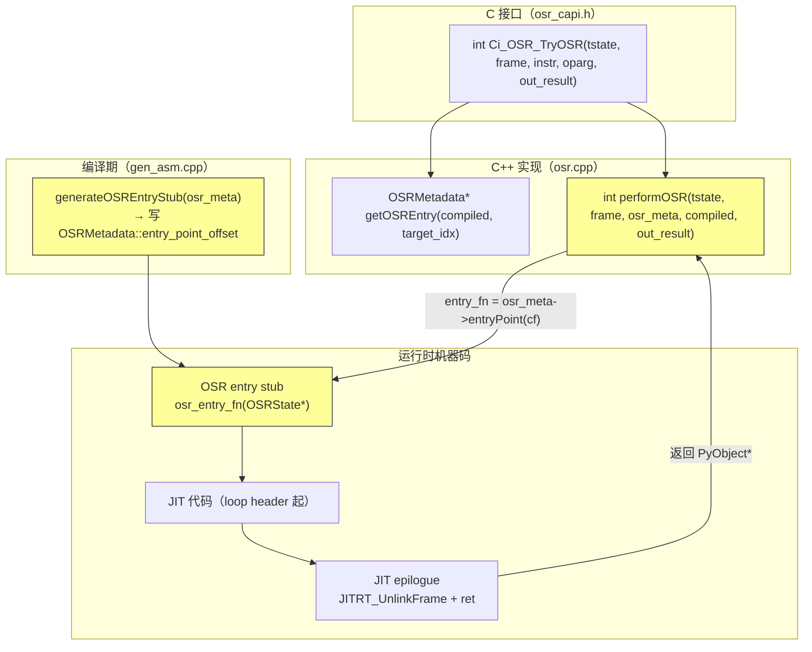

# 详细设计说明书 — OSR 进入（帧状态迁移）

## 产品版本&密级

| 产品 | 版本 | 密级 |
|------|------|------|
| CinderX | 3.14 | 内部公开 |

## 拟制信息

| 角色 | 姓名 | 日期 |
|------|------|------|
| 作者 | Claude Code | 2026-05-21 |

## 修订记录

| 版本 | 日期 | 作者 | 修改概要 |
|------|------|------|---------|
| V1.0 | 2026-05-21 | Claude Code | 初版，基于源码验证编写 |

## Keywords 关键词

OSR, performOSR, OSRState, OSRMetadata, OSRLiveIn, NativeGenerator, OSR entry stub, steal 语义, deferred DECREF, Environ VReg, PhyLocation, _PyStackRef, aarch64

## Abstract 摘要

本文档为功能设计说明书"功能项 3：OSR 进入（帧状态迁移）"的详细设计，聚焦可直接指导编码的接口定义、数据结构、算法流程和汇编级实现细节。

功能项 3 由两个协作组件构成：

**1. `performOSR`（C++ 运行时，`osr.cpp`）**：从 `Ci_OSR_TryOSR` 调用，负责前置校验、非 live-in 清理（延迟 DECREF）、构造 `OSRState`、调用 OSR entry stub、stub 返回后的延迟 DECREF 执行和三态结果报告。

**2. OSR entry stub（机器码，由 `NativeGenerator` 生成）**：每个回边循环头对应一个独立 stub，运行时被 `performOSR` 以 C 函数指针形式调用（`PyObject* osr_entry_fn(OSRState*)`）。Stub 负责建立与 kNormal JIT prologue 完全一致的 native 栈布局、设置 Environ VReg（tstate/frame/func 到 regalloc 分配的物理位置）、从解释器帧 steal live-in 到 JIT 物理寄存器/栈槽，然后直接跳转到 loop header 的 JIT 机器码继续执行。

两个组件通过 `OSRState` 结构传递数据，通过 `OSRMetadata` 共享编译期元数据。所有引用计数管理遵循 **延迟 DECREF 策略**（steal 语义）：非 live-in 槽由 `performOSR` 收集到临时数组后延迟释放；live-in 由 stub steal（写 `PyStackRef_NULL`），使 `localsplus` 进入与 `JITRT_AllocateAndLinkInterpreterFrame` 新分配帧完全相同的初始化状态，保证 deopt `reifyLocalsplus` 的盲写假设成立。

## List of abbreviations 缩略语清单

| 缩略语 | 英文全称 | 中文名 |
|--------|---------|--------|
| OSR | On-Stack Replacement | 栈上替换 |
| JIT | Just-In-Time Compilation | 即时编译 |
| deopt | Deoptimization | 逆优化 |
| ABI | Application Binary Interface | 应用二进制接口 |
| FP | Frame Pointer | 帧指针（aarch64: x29） |
| LR | Link Register | 链接寄存器（aarch64: x30） |
| SP | Stack Pointer | 栈指针（aarch64: sp） |
| DECREF | Decrement Reference Count | 减少引用计数 |
| INCREF | Increment Reference Count | 增加引用计数 |
| steal | — | 引用所有权转移（不 INCREF 不 DECREF） |
| live-in | — | 循环头活跃输入值 |
| HIR | High-level Intermediate Representation | 高级中间表示 |
| LIR | Low-level Intermediate Representation | 低级中间表示 |
| VReg | Virtual Register | 虚拟寄存器 |
| regalloc | Register Allocation | 寄存器分配 |
| MVP | Minimum Viable Product | 最小可行产品 |
| FMEA | Failure Mode and Effects Analysis | 失效模式与影响分析 |
| UAF | Use-After-Free | 释放后使用 |

## 简介

本详细设计聚焦功能项 3 的实现层面，为开发人员提供可直接指导编码的接口定义、数据结构、算法伪代码和汇编级实现细节。

**上游文档**：《OSR 热循环功能设计说明书》（`hot-loop-osr-function-design.md`）功能项 3 章节，以及核心契约章节（三态返回约定、帧所有权模型、live-in 引用所有权模型）。

**前置功能项**：功能项 1（热循环检测，提供 `Ci_OSR_TryOSR` 调用入口），功能项 2（OSR 编译，提供 `OSRMetadata`、OSR entry stub 机器码、`has_osr_entries` 标志）。

**源码基线**（截至 2026-05-21）：

| 文件 | 用途 |
|------|------|
| `cinderx/Jit/deopt.cpp:115-183` | `reifyLocalsplus` / `reifyStack`（对称参考） |
| `cinderx/Jit/codegen/gen_asm.cpp:148-388` | `prepareForDeopt` / `resumeInInterpreter` |
| `cinderx/Jit/codegen/autogen.cpp:909-1163` | `translateEpilogueEnd` / `translateSetupFrame` / `translatePrologue` |
| `cinderx/Jit/jit_rt.cpp:575-782` | `JITRT_AllocateAndLinkInterpreterFrame` / `JITRT_UnlinkFrame` |
| `cinderx/Jit/codegen/environ.h:156-159` | `resume_frame_total_size` / `resume_header_and_spill_size` / `resume_saved_regs` |
| `cinderx/Jit/codegen/arch/aarch64.h:311-319` | `CALLEE_SAVE_REGS` / `CALLER_SAVE_REGS` |
| `cinderx/Common/py-portability.h:61,197-224` | `interpFrameFromThreadState` / `Ci_STACK_*` 宏 |
| `cpython/Python/ceval_macros.h:351-361` | `LOAD_IP` / `LOAD_SP` / `SAVE_SP` |
| `cpython/Include/internal/pycore_interpframe.h:101-240` | `_PyFrame_Stackbase` / `_PyFrame_GetStackPointer` / `_PyFrame_SetStackPointer` |
| `cpython/Include/internal/pycore_stackref.h:439-525` | `PyStackRef_NULL_BITS` / `PyStackRef_AsPyObjectSteal` / `BITS_TO_PTR_MASKED` |

---

# 上游文档引用

| 上游文档章节 | 引用内容 |
|------------|---------|
| 核心契约：三态返回约定 | `performOSR` 返回值语义（1=完成，0=未尝试，-1=异常）及字节码处理程序责任 |
| 核心契约：帧所有权模型（kNormal） | F 不被 PopFrame，由 JIT epilogue 负责清理 |
| 核心契约：live-in 引用所有权模型 | steal 语义与 deferred DECREF 策略 |
| 功能项 3：OSRState 结构 | kNormal 简化版：tstate / frame / osr_meta 三字段 |
| 功能项 3：OSR ABI 完整调用/返回约定 | stub 调用约定 / Environ VReg 恢复 / live-in 恢复 / 跳转目标 |
| 功能项 3：performOSR 实现（伪代码） | 四步流程：前置校验 → 收集非 live-in → 调用 stub → 延迟 DECREF |
| 功能项 3：帧链管理 | kNormal 帧链在 OSR 前后的不变量 |
| 功能项 2：OSRMetadata 结构 | stub 所需编译期元数据字段的来源与语义 |
| 功能项 2：功能项 2 → 功能项 3 交付契约 | 功能项 3 依赖的编译产物列表 |
| ADR-4：kNormal OSR 复用 datastack 帧 | 不分配/消耗帧，直接复用解释器帧 F |
| ADR-5：MVP 仅支持 kOwned live-in | kBorrowed live-in 导致整个 entry 被拒绝 |
| ADR-6：live-in 必须使用 steal 语义 | 保证 deopt `reifyLocalsplus` 盲写假设成立 |
| ADR-7：steal 时写入 `PyStackRef_NULL(=1)` 而非零 | `PyStackRef_NULL_BITS = Py_TAG_REFCNT = 1`，不能用 `str xzr` |

---

# 1. 实现设计

## 1.1 实现概述

功能项 3 包含以下四个实现子组件：

| 子组件 | 位置 | 职责 |
|--------|------|------|
| **`OSRState`** | `cinderx/Jit/osr.h` | performOSR 与 stub 之间的数据传递结构 |
| **`performOSR`** | `cinderx/Jit/osr.cpp` | 运行时 OSR 进入入口：校验 + 收集 + 调用 stub + 延迟 DECREF |
| **OSR entry stub 生成** | `cinderx/Jit/codegen/gen_asm.cpp`（NativeGenerator） | 编译期生成 per-backedge 汇编 stub |
| **OSR entry stub 内容** | 生成的机器码 | 运行时建立 native 栈 + Environ VReg + steal live-in + jmp |

架构关系如下：

```
Ci_OSR_TryOSR(tstate, frame, instr, oparg, &result)
  └─▶ performOSR(tstate, frame, osr_meta, compiled, &result)
        ├─ [0] 前置校验：获取 entry_fn，null → return 0
        ├─ [0.5] 设置 frame->instr_ptr 到 loop header
        ├─ [1] 收集非 live-in slots → deferred_decrefs[]（steal，不 DECREF）
        ├─ [2] osr_entry_fn(&OSRState{tstate, frame, osr_meta})
        │       ├─ stub prologue: stp fp/lr; mov fp, sp; sub sp, sp, #total_size
        │       ├─ stub: 保存 callee-saved（仅 resume_saved_regs 中的）
        │       ├─ stub: 设置 Environ VReg（tstate → tstate_location 等）
        │       ├─ stub: steal live-in（从 F->localsplus[i] 读取 + AND ~Py_TAG_REFCNT + 写 JIT PhyLocation + str PyStackRef_NULL）
        │       └─ stub: b .loop_header_N（跳 JIT 代码）
        │              ↓ JIT 执行（正常/deopt/异常三路返回）
        ├─ [3] 延迟 DECREF：释放 deferred_decrefs[]（异常时用 PyErr_Get/Set 保护）
        └─ [4] 三态返回给 Ci_OSR_TryOSR
```

## 1.2 关键算法与流程

### 1.2.1 performOSR 算法

`performOSR` 是 kNormal 模式下 OSR 进入的 C++ 入口，设计要点是**延迟 DECREF 策略**——收集阶段不 DECREF 也不 unlink，确保 entry point 在 stub 调用时必然有效。

```cpp
// cinderx/Jit/osr.cpp — performOSR 详细实现
int performOSR(
    PyThreadState* tstate,
    _PyInterpreterFrame* frame,
    const OSRMetadata* osr_meta,
    const CompiledFunction* compiled,
    PyObject** out_result)
{
  // [0] 前置校验（此时帧完全不变）
  //   获取 entry point——如果为 null，帧不修改，安全 return 0
  //   osr_meta->entryPoint(compiled) = compiled->codeBuffer().data()
  //                                    + osr_meta->entry_point_offset
  using OsrEntryFn = PyObject*(*)(OSRState*);
  OsrEntryFn entry_fn =
      reinterpret_cast<OsrEntryFn>(osr_meta->entryPoint(*compiled));
  if (entry_fn == nullptr) {
    return 0;  // 帧完全未修改
  }

  // [0.5] 设置 frame->instr_ptr 到 loop header 字节码位置
  //   目的：stub 执行期间及 deopt 观察时，frame 显示正确的字节码位置
  //   code_start = PyBytes_AS_STRING(frame->f_executable.bits & ~Py_TAG_REFCNT)
  //              = 等效于 _PyFrame_GetCode(frame) 指向的字节码起始地址
  //   osr_meta->target_offset 是 BCOffset（字节单位），与 _Py_CODEUNIT* 步长一致
  _Py_CODEUNIT* code_start =
      _PyCode_CODE(_PyFrame_GetCode(frame));
  frame->instr_ptr = code_start + osr_meta->target_offset / sizeof(_Py_CODEUNIT);

  // [1] 收集非 live-in slots → deferred_decrefs[]
  //   策略：steal（写 PyStackRef_NULL），不立即 DECREF，不 unlink 帧
  //   理由：不触发任何 Python finalizer，entry point 在 stub 调用时必然有效
  //   注意：PyStackRef_NULL_BITS = Py_TAG_REFCNT = 1（非 GIL 版本）
  //
  //   live-in 集合由 osr_meta->live_ins[] 中 localsplus_index != -1 的条目确定
  //   最多 co_nlocalsplus 个 slot，不使用 VLA（大函数有栈溢出风险）
  //   → 用固定大小上限（512 slots）的栈数组或动态分配
  int num_nlocalsplus = _PyFrame_GetCode(frame)->co_nlocalsplus;

  // 构建 is_live_in 位集合（按 localsplus_index 索引）
  std::bitset<512> is_live_in_set;
  for (const auto& li : osr_meta->live_ins) {
    if (li.localsplus_index >= 0) {
      is_live_in_set.set(li.localsplus_index);
    }
  }

  // 收集非 live-in slots：untag + steal
  //   PyStackRef_AsPyObjectSteal(ref):
  //     if (ref.bits & Py_TAG_REFCNT) == 0:  // mortal 对象
  //       return (PyObject*)ref.bits          // 直接返回裸指针（owned）
  //     else:                                 // immortal/NULL
  //       return Py_NewRef(BITS_TO_PTR_MASKED(ref))  // INCREF 后返回
  //   注意 NULL 情况：PyStackRef_IsNull(ref) <=> ref.bits == Py_TAG_REFCNT(=1)
  //                  PyStackRef_AsPyObjectSteal(NULL_REF) 返回 nullptr（Py_NewRef(nullptr) 是 UB，需先检查）
  //   正确做法：先检查 IsNull，再调用 Steal

  static constexpr int kMaxDeferredDecref = 512;
  PyObject* deferred_decrefs[kMaxDeferredDecref];
  int n_deferred = 0;

  for (int i = 0; i < num_nlocalsplus && n_deferred < kMaxDeferredDecref; i++) {
    if (is_live_in_set.test(i)) {
      continue;  // live-in 槽由 stub 处理（steal + 写 PyStackRef_NULL）
    }
    _PyStackRef slot = frame->localsplus[i];
    if (!PyStackRef_IsNull(slot)) {
      // untag → owned PyObject*，收集到延迟释放数组
      // PyStackRef_AsPyObjectSteal 内部：
      //   mortal（bits & TAG == 0）→ return (PyObject*)bits（owned，无 INCREF）
      //   immortal（bits & TAG == 1）→ Py_NewRef(bits & ~TAG)（INCREF，caller owns）
      deferred_decrefs[n_deferred++] = PyStackRef_AsPyObjectSteal(slot);
    }
    frame->localsplus[i] = PyStackRef_NULL;  // 写 NULL（bits = Py_TAG_REFCNT = 1）
  }

  // [2] 调用 OSR entry stub
  OSRState state{tstate, frame, osr_meta};
  PyObject* result = entry_fn(&state);
  // stub 内部：
  //   prologue → 保存 callee-saved → 设置 Environ VReg → steal live-in → jmp .loop_header
  //   JIT 执行完毕：JITRT_UnlinkFrame → PopFrame(F) → 返回 result（或 NULL+PyErr）

  // [3] 释放延迟的 DECREF（JIT epilogue 已 unlink F，DECREF 安全）
  //   异常保护：result == NULL 时，DECREF 触发 finalizer 可能覆盖当前异常
  //   → 先保存异常，释放完毕后恢复
  PyObject* saved_exc = nullptr;
  if (result == nullptr) {
    saved_exc = PyErr_GetRaisedException();  // 3.12+ API
  }
  for (int i = 0; i < n_deferred; i++) {
    Py_XDECREF(deferred_decrefs[i]);
  }
  if (saved_exc != nullptr) {
    PyErr_SetRaisedException(saved_exc);  // 恢复原始异常
  }

  // [4] 三态返回
  if (result != nullptr) {
    *out_result = result;
    return 1;   // JIT 正常完成（epilogue 已 PopFrame）
  }
  return -1;    // JIT 异常（epilogue 已 PopFrame，PyErr 已设置）
  // rc=0 路径：entry_fn == nullptr 时在 [0] 处已提前 return 0
}
```

### 1.2.2 OSR entry stub 代码生成（NativeGenerator，aarch64）

**触发时机**：在 `NativeGenerator::generateCode()` 的末尾、正常 vectorcall entry 和 deopt exit 生成完成后，为每个 OSR entry block 生成对应的 stub。

**stub 接口**：

```
调用约定: PyObject* osr_entry_fn(OSRState* state)
  参数: state 在 x0（aarch64 ARGUMENT_REGS[0]）
返回: x0 = PyObject*（非 NULL = 正常, NULL = 异常）
```

**stub 结构（aarch64 汇编伪代码）**：

```asm
// stub 入口：每个 OSRMetadata 对应一个独立代码段
// entry_point_offset = (此处代码地址 - codeBuffer 起始) 写入 OSRMetadata::entry_point_offset

osr_entry_stub_N:
// ──────────────────────────────────────────────────────────────
// 步骤 1：建立与 kNormal JIT prologue 完全一致的 native 栈布局
// ──────────────────────────────────────────────────────────────
// 对应 translatePrologue（autogen.cpp:1063-1076）
    stp     fp, lr, [sp, #-16]!    // 分配 frame record，保存 FP/LR
    mov     fp, sp                  // fp = new SP（帧指针）

// 对应 translateSetupFrame（autogen.cpp:1081-1164）
//   sub sp, sp, #resume_frame_total_size
//   (等效拆分为：allocateHeaderAndSpillSpace + saveCalleeSaved)
    sub     sp, sp, #<resume_frame_total_size>

// 保存 resume_saved_regs 中的 callee-saved 寄存器
// 计算 base = fp - resume_header_and_spill_size（start of callee-saved area）
    sub     x13, fp, #<resume_header_and_spill_size>

// 示例：resume_saved_regs 包含 {x19, x20, x21, x22}（偶数对用 stp）
    stp     x19, x20, [x13, #-16]  // 保存寄存器对
    stp     x21, x22, [x13, #-32]
    // ... 按 CALLEE_SAVE_REGS 顺序（translateSetupFrame 的 gp_regs 遍历顺序）

// ──────────────────────────────────────────────────────────────
// 步骤 2：使用 caller-saved 临时寄存器处理 OSRState 解引用
//   使用 x9/x10/x11（caller-saved，stub 内无 bl → 始终有效）
//   不使用 x19-x28（callee-saved，可能超出 JIT body 的 epilogue 恢复范围）
// ──────────────────────────────────────────────────────────────
// x0 = OSRState* = state（函数入参）
    mov     x9, x0                  // x9 = state*

// 读取 state 字段（OSRState 布局：tstate + frame + osr_meta，各 8 字节）
    ldr     x10, [x9, #0]           // x10 = state->tstate
    ldr     x11, [x9, #8]           // x11 = state->frame（= F）
    ldr     x12, [x9, #16]          // x12 = state->osr_meta

// ──────────────────────────────────────────────────────────────
// 步骤 3：设置 Environ VReg（tstate / frame / func → PhyLocation）
//
//   osr_meta->tstate_location / func_location / frame_location
//   存储 regalloc 后的物理位置（PhyLocation）
//
//   PhyLocation 分派（is_memory() = loc < 0）：
//     is_register() → mov Xdst, Xsrc
//     is_memory()   → str Xsrc, [fp, #loc]（loc 是 FP 相对偏移，负值）
//
//   func = F->f_funcobj（需要从帧读取）
//     F->f_funcobj 是 _PyStackRef（bits 字段），需要 AND ~Py_TAG_REFCNT 提取 PyObject*
//     等效：PyStackRef_AsPyObjectBorrow(F->f_funcobj) = BITS_TO_PTR_MASKED
//         = ldr xN, [x11, #offsetof(_PyInterpreterFrame, f_funcobj)]
//           and xN, xN, ~1  // Py_TAG_REFCNT = 1
// ──────────────────────────────────────────────────────────────

// 设置 asm_tstate（示例：tstate_location = X19，即寄存器）
    mov     x19, x10                // asm_tstate_reg = tstate

// 设置 asm_interpreter_frame（示例：frame_location 是栈槽 -8）
    str     x11, [fp, #-8]          // spill frame ptr to stack slot

// 设置 asm_func（示例：func_location = X20）
//   从 F->f_funcobj 提取 PyObject*（AND ~Py_TAG_REFCNT）
    ldr     x9, [x11, #<offsetof(_PyInterpreterFrame, f_funcobj)>]
    and     x20, x9, #~1            // 剥离 Py_TAG_REFCNT 标记位

// ──────────────────────────────────────────────────────────────
// 步骤 4：steal live-in（从 F->localsplus 读取 → PhyLocation）
//
//   对每个 OSRLiveIn li in osr_meta->live_ins：
//     1. 读取 F->localsplus[li.localsplus_index]（_PyStackRef.bits）
//     2. AND ~Py_TAG_REFCNT 剥离标记位，得到 PyObject*
//        （非 free-threading：BITS_TO_PTR_MASKED = bits & ~1）
//     3. 写入 li.destination（PhyLocation）
//        is_register() → mov Xdst, Xval
//        is_memory()   → str Xval, [fp, #loc]
//     4. 写 PyStackRef_NULL（= Py_TAG_REFCNT = 1）到 F->localsplus[i]
//        str Wone, [x11, #<localsplus_offset + i*8>]
//        注意：PyStackRef_NULL.bits = 1（NOT 0），必须显式写 1
//              不能用 str xzr（零寄存器），否则 PyStackRef_IsNull 检查失败
// ──────────────────────────────────────────────────────────────

// 预加载 localsplus 基地址和 PyStackRef_NULL 常量
    add     x9, x11, #<offsetof(_PyInterpreterFrame, localsplus)>
    mov     w10, #1                 // PyStackRef_NULL_BITS = Py_TAG_REFCNT = 1

// 示例：li[0] = {localsplus_index=0, destination=X21, ref_kind=kOwned}
    ldr     x13, [x9, #0]           // 读取 localsplus[0].bits（_PyStackRef）
    and     x21, x13, #~1           // AND ~Py_TAG_REFCNT → PyObject*（steal）
    str     w10, [x9, #0]           // localsplus[0] = PyStackRef_NULL（bits=1）

// 示例：li[1] = {localsplus_index=1, destination=StackSlot(-16), ref_kind=kOwned}
    ldr     x13, [x9, #8]           // 读取 localsplus[1].bits
    and     x13, x13, #~1           // AND ~Py_TAG_REFCNT
    str     x13, [fp, #-16]         // 写入栈槽 FP-16
    str     w10, [x9, #8]           // localsplus[1] = PyStackRef_NULL

// ──────────────────────────────────────────────────────────────
// 步骤 5：跳转到 loop header 的 JIT 代码
// ──────────────────────────────────────────────────────────────
    b       .loop_header_N          // 直接跳，不是调用（bl）
                                    // JIT 代码从 loop header 开始执行

// ──────────────────────────────────────────────────────────────
// 返回路径（由 JIT epilogue 的 translateEpilogueEnd 生成）
// ──────────────────────────────────────────────────────────────
// .hard_exit_label:                // translateEpilogueEnd（autogen.cpp:990-1056）
//   恢复 callee-saved（从固定 FP 相对偏移，与 stub 保存顺序/位置一致）
//   mov sp, fp
//   ldp fp, lr, [sp], #16
//   ret lr
// → 返回 x0 = PyObject*（非 NULL = 正常返回，NULL = 异常）
```

**为什么 stub 必须复制 kNormal JIT prologue 布局**：

deopt exit 和 epilogue 的 `hard_exit_label` 从固定的 FP 相对偏移恢复 callee-saved（autogen.cpp:990-1056）。FP 由 prologue 的 `mov fp, sp` 设置。如果 stub 使用不同的栈布局，epilogue 会从错误位置读取 callee-saved → 寄存器值损坏 → ABI 违反。

`resume_frame_total_size`、`resume_header_and_spill_size`、`resume_saved_regs` 三个字段（由 `NativeGenerator::computeFrameInfo()` 计算后写入 `Environ`，再写入 `OSRMetadata`）完整描述了正常 JIT prologue 的栈布局，stub 必须完全复制这个布局。

### 1.2.3 live-in steal 语义的 _PyStackRef 转换细节

非 free-threading（MVP 唯一支持的模式）下 `_PyStackRef` 的 bits 字段布局（pycore_stackref.h:439-525）：

```
mortal 对象：   bits = (uintptr_t)obj          // TAG 位 = 0
immortal 对象： bits = (uintptr_t)obj | 1      // TAG 位 = Py_TAG_REFCNT = 1
NULL：          bits = 1                        // PyStackRef_NULL_BITS = 1
```

提取 `PyObject*` 的公式：`PyObject* obj = (PyObject*)(bits & ~1)`（即 `BITS_TO_PTR_MASKED`）。

在 stub 中用单条 `and xDst, xSrc, #~1` 指令（aarch64 AND with NOT 立即数）完成。

**三种 slot 状态的处理**：

| slot 状态 | bits | AND ~1 结果 | steal 后写入 localsplus |
|-----------|------|------------|------------------------|
| mortal PyObject* | `(uintptr_t)obj` | `obj`（正确） | `PyStackRef_NULL`（bits=1） |
| immortal PyObject* | `(uintptr_t)obj \| 1` | `obj`（正确） | `PyStackRef_NULL`（bits=1） |
| NULL | `1` | `0`（nullptr） | `PyStackRef_NULL`（bits=1，不变） |

NULL 情况：`AND ~1` 结果为 0，即 `nullptr`。JIT `refcount_insertion` 对 kOwned live-in 执行 INCREF——对 `nullptr` 执行 `Py_INCREF(nullptr)` 是 UB。因此 `extractOSRLiveIns`（阶段 2）在构建 OSRMetadata 时必须排除 slot 值可能为 NULL 的 live-in，或在 stub 中加 NULL 检查。MVP 的保守策略：`isOSREligible` 和 `markOSREntries` 已确保空操作数栈，循环头的 local 变量在进入 OSR 时必须有效，运行时 NULL local 的处理留作 Phase 2。

**与 `performOSR` 收集非 live-in 的区别**：`performOSR` 使用 `PyStackRef_AsPyObjectSteal()`（mortal → 直接返回裸指针作为 owned ref；immortal/NULL → `Py_NewRef(BITS_TO_PTR_MASKED)` INCREF 再返回）。Stub 使用 `AND ~1` 纯取位操作，不 INCREF——因为 live-in 的 INCREF 由 JIT 侧的 `refcount_insertion` pass 统一完成（steal 后寄存器持有 borrowed ref，`refcount_insertion` INCREF 创建 owned ref）。两种转换路径互补，覆盖所有 slot 类型。

### 1.2.4 Environ VReg 恢复逻辑

JIT body 通过三个固定 Environ VReg 访问运行时数据（environ.h:116-119）：

```cpp
jit::lir::Instruction* asm_tstate{nullptr};            // PyThreadState*
jit::lir::Instruction* asm_func{nullptr};              // PyFunctionObject*（f_funcobj）
jit::lir::Instruction* asm_interpreter_frame{nullptr}; // _PyInterpreterFrame*（帧指针 F）
```

正常函数 prologue（`JITRT_AllocateAndLinkInterpreterFrame` 之后）将这三个值写入 regalloc 分配的物理位置。OSR stub 跳过了正常 prologue，因此必须在 stub 内重建这三个值。

从 `OSRMetadata` 读取编译期确定的物理位置（`tstate_location`、`func_location`、`frame_location`），然后按 `PhyLocation::is_register()` / `is_memory()` 分派写入：

```
// PhyLocation 分派逻辑（C++ 伪代码，在 NativeGenerator 中生成对应汇编）
auto emit_set_environ = [&](arch::Gp value_reg, PhyLocation dest) {
  if (dest.is_register()) {
    // dest 是 GP 寄存器
    as->mov(a64::x(dest.loc), value_reg);
  } else {
    // dest 是栈槽（loc < 0，FP 相对偏移）
    as->str(value_reg, a64::ptr(arch::fp, dest.loc));
  }
};
```

`asm_func` 对应的值来源于 `F->f_funcobj`（`_PyStackRef` 类型），需要 AND ~1 提取 `PyFunctionObject*`，然后按上述逻辑写入 `func_location`。

### 1.2.5 NativeGenerator 中 OSR stub 的生成时机

在 `NativeGenerator::generateCode()` 的汇编代码生成阶段，OSR stub 在以下时机生成：

1. **函数入口代码生成完毕**（vectorcall entry + kSetupFrame + kOSREntry pseudo + HIR body）
2. **Deopt exit 生成完毕**（generateDeoptExits）
3. **OSR stubs 生成**：遍历 `irfunc_->osrEntries()`，为每个 OSR entry BasicBlock 调用 `generateOSREntryStub(osr_meta)`

`generateOSREntryStub` 在调用前记录当前代码偏移作为 `entry_point_offset` 写入 `OSRMetadata`，然后按上述汇编结构生成 stub 代码。所有 OSR stubs 共享同一 `CodeHolder`（与主函数代码在同一缓冲区），共享 `CodeRuntime`。

**与 `.loop_header_N` 标签的绑定**：stub 末尾的 `b .loop_header_N` 需要跳转到 HIR loop header block 在 asmjit 中对应的 `asmjit::Label`，该 Label 由 `env_.block_label_map` 查找（`block_label_map[osr_entry_block]`）。asmjit 在 `finalize()` 时解析所有前向引用。

### 1.2.6 OSRMetadata::entryPoint 实现

```cpp
// cinderx/Jit/osr.h
void* OSRMetadata::entryPoint(const CompiledFunction& cf) const {
  if (entry_point_offset < 0) {
    return nullptr;
  }
  const std::byte* base = cf.codeBuffer().data();
  return const_cast<std::byte*>(base) + entry_point_offset;
}
```

`codeBuffer()` 返回编译完成后的机器码缓冲区（`CompiledFunctionData::code` 字段，类型 `std::span<const std::byte>`）。`entry_point_offset` 是 stub 代码距缓冲区起始的字节偏移，由 `NativeGenerator` 在生成 stub 前确定。

## 1.3 行为模型

### 1.3.1 正常流程

#### 流程 1：OSR 进入，JIT 正常执行并返回（rc=1）

```
解释器 JUMP_BACKWARD_JIT 回边计数 ≥ 阈值
  → Ci_OSR_TryOSR(tstate, frame=F, instr, oparg, &result)
      → performOSR(tstate, F, osr_meta, compiled, &result)
          [0] entry_fn = osr_meta->entryPoint(compiled)  // 非 NULL
          [0.5] F->instr_ptr = loop_header 字节码位置
          [1] 收集非 live-in → deferred_decrefs[](steal)，F->localsplus[i] 置 NULL
          [2] result = entry_fn(&OSRState{tstate, F, osr_meta})
                stub prologue: stp fp/lr; mov fp, sp; sub sp; 保存 callee-saved
                stub: 设置 Environ VReg（tstate/frame/func → PhyLocation）
                stub: steal live-in（read + AND ~1 + write PhyLocation + str NULL）
                stub: b .loop_header_N
                [JIT 热循环执行中...]
                JIT epilogue: JITRT_UnlinkFrame → setCurrentFrame(tstate, F.previous)
                              → jitFrameClearExceptCode(F)
                              → Cix_PyThreadState_PopFrame(F)
                              translateEpilogueEnd: 恢复 callee-saved + ldp fp/lr + ret
                result = PyObject*（非 NULL）
          [3] deferred_decrefs 释放（F 已 unlink，DECREF 安全）
          [4] return 1
      → Ci_OSR_TryOSR: *out_result = result; return 1
  → _JIT 字节码处理程序：
      _Py_LeaveRecursiveCallPy(tstate)
      frame = tstate->current_frame  // = F.previous（caller 帧）
      LOAD_SP(); LOAD_IP(frame->return_offset)  // 恢复 caller 的 sp/ip
      push(result); DISPATCH()
```

**关键时序约束**：JITRT_UnlinkFrame（jit_rt.cpp:757-782）先 `setCurrentFrame(tstate, frame->previous)`，再 `jitFrameClearExceptCode(frame)`，再 `Cix_PyThreadState_PopFrame(tstate, frame)`。此时序确保 F 的引用计数在清理时不再是 `tstate->current_frame`，满足 frame.cpp:656-658 不变量。`performOSR` 步骤 [3] 的延迟 DECREF 在 JIT epilogue 已返回后执行，此时 F 已被 PopFrame，安全。

#### 流程 2：OSR 进入后 JIT deopt，解释器运行到函数结束（rc=1 或 rc=-1）

```
[JIT 热循环执行中，guard 失败]
  → stage1 trampoline: push deopt_meta_index
  → stage2 trampoline: 保存 CodeRuntime* + epilogue_addr
  → 全局 deopt trampoline: 保存所有 GP 寄存器到 regs[] 数组
  → prepareForDeopt(regs, code_runtime, deopt_idx)
      → reifyFrame: 从 DeoptMetadata 恢复 F 的 instr_ptr/localsplus/stackpointer
          reifyLocalsplus: 对 live slot: STACK_STEAL(mem.readOwned()) [盲写，假设 slots 初始为 NULL ✓]
          reifyStack: 恢复操作数栈
      → releaseRefs(meta, mem): 对 kOwned live_values 执行 DECREF
      → setCurrentFrame(tstate, F->previous)
  → resumeInInterpreter(F, code_runtime, deopt_idx, err_occurred)
      → _PyEval_EvalFrame(tstate, F, err_occurred)
          → 解释器从 guard 点字节码继续执行到函数结束
          → RETURN_VALUE / exit_unwind → _PyEval_FrameClearAndPop(F)
          → 返回 PyObject*（正常）或 NULL（异常）
  → epilogue translateEpilogueEnd: 恢复 callee-saved + ret
  → result 返回给 performOSR 的 entry_fn 调用
  → performOSR [3]: 释放 deferred_decrefs（F 已由 _PyEval_FrameClearAndPop 清理）
  → 返回 rc=1（正常）或 rc=-1（异常）
```

**`reifyLocalsplus` 兼容性保证**（deopt.cpp:115-149）：
- 对 locals（`[0, free_offset)` 范围）：dead slot → `Ci_STACK_NULL`（盲写 NULL）；live slot → `mem.readOwned() + Ci_STACK_STEAL`（盲写，不 DECREF 旧值）
- 对 freevars（`[free_offset, nlocalsplus)` 范围）：dead slot → `Ci_STACK_CLEAR`（DECREF + 写 NULL）；live slot → `Ci_STACK_XSETREF`（DECREF 旧值 + 写新值）
- OSR 的 steal 语义确保：所有 slot 已置 NULL（非 live-in 由 performOSR 清零，live-in 由 stub steal 清零）→ `Ci_STACK_STEAL` 和 `Ci_STACK_NULL` 的盲写假设成立，`Ci_STACK_CLEAR` 对 NULL 安全（Py_CLEAR 对 NULL 无操作）

### 1.3.2 异常流程

#### 异常流程 1：JIT 代码直接抛出异常（rc=-1）

JIT 代码在未触发 guard deopt 的情况下通过正常异常路径退出（如 `CALL_INTRINSIC_1` 引发的 Python 异常）。JIT epilogue 仍执行 `JITRT_UnlinkFrame` → `PopFrame(F)`，然后 `ret x0=NULL`（`PyErr` 已设置）。`performOSR` 收到 `result == NULL`，进入延迟 DECREF（带异常保护），返回 rc=-1。

字节码处理程序处理 rc=-1 时：`_Py_LeaveRecursiveCallPy(tstate)` → 恢复 `frame = tstate->current_frame`（= F.previous）→ 根据 `frame->owner` 判断是否顶层函数（见功能设计的三态返回约定）。

#### 异常流程 2：entry_fn 为 nullptr（rc=0）

`osr_meta->entryPoint(compiled)` 返回 nullptr（`entry_point_offset < 0`，即编译时此 entry 被拒绝但 OSRMetadata 被保留的情况，实际应由 `getOSREntry` 过滤不到此处）。`performOSR` 帧完全未修改，返回 rc=0，字节码处理程序走 `osr_skip` fallthrough 路径。

#### 异常流程 3：非 live-in 收集超过上限（kMaxDeferredDecref=512）

当 `co_nlocalsplus` 超过 512（极端情况）时，`n_deferred` 达到上限，后续非 live-in slot 未被收集（未写 PyStackRef_NULL）。OSR 不应在此情况下执行 stub 调用，否则 F->localsplus 处于不一致状态（部分清零，部分未清零），deopt 路径 `reifyLocalsplus` 的盲写假设不成立 → UAF。

**缓解措施**：`compileFunctionWithOSR` 的编译预算检查（`osrCompileBudgetCheck`）已拒绝 `co_nlocalsplus` 超过阈值（默认 1024 code units）的函数。实际上 512 上限远大于正常函数的 `nlocalsplus`。如需防御，在收集阶段溢出时中止 OSR（提前 return 0，在写任何 NULL 前检测）。

#### 异常流程 4：`deferred_decrefs` 中的 DECREF 触发 finalizer 设置异常

在 `result == nullptr` 路径，步骤 [3] 调用 `Py_XDECREF` 可能触发对象 `__del__` → `PyErr_NoMemory()` 等，覆盖原始异常。`performOSR` 通过 `PyErr_GetRaisedException()` 保存原始异常，`Py_XDECREF` 执行完毕后 `PyErr_SetRaisedException()` 恢复。这与 CPython 的 `_PyEval_FrameClearAndPop` 中的异常保护模式对称。

## 1.4 数据模型

### 1.4.1 数据结构定义

#### OSRState

```cpp
// cinderx/Jit/osr.h — 新增

struct OSRState {
  PyThreadState* tstate;              // 当前线程状态
  _PyInterpreterFrame* frame;         // 解释器帧 F（datastack 上，= tstate->current_frame）
  const OSRMetadata* osr_meta;        // 编译期元数据（live-in 映射 + 栈布局参数）
};

// 在 osr_capi.h 中提供 C 可见的前向声明：
// typedef struct OSRState_s OSRState;
```

`OSRState` 生命周期：在 `performOSR` 栈上分配，传递给 stub 后不持有超过 stub 执行期。Stub 通过 x0（第一个参数寄存器，aarch64）接收指针，读取完字段后不再引用。

#### OSRLiveIn

```cpp
// cinderx/Jit/osr.h — 新增

struct OSRLiveIn {
  int localsplus_index{-1};    // 源：F->localsplus[] 索引（-1 = 不在 localsplus）
  int stack_index{-1};         // 源：操作数栈索引（MVP 始终为 -1，空栈约束）
  codegen::PhyLocation destination;   // 目标：JIT 物理位置（regalloc 后回填）
  hir::ValueKind value_kind;   // MVP 仅 kObject
  hir::RefKind ref_kind;       // MVP 仅 kOwned
  bool reconstructible{true};  // 可从 FrameState 重建
  bool is_phi{false};          // 是否 SSA phi 节点（loop header 的 phi 输出）
  // 编译期临时，不写入最终产物：
  hir::Register* hir_reg{nullptr};  // 对应 HIR Register*
};
```

#### OSRMetadata

```cpp
// cinderx/Jit/osr.h — 新增

struct OSRMetadata {
  BCOffset target_offset;               // 循环头字节码偏移（BCOffset = 字节单位）
  FrozenList<OSRLiveIn> live_ins;        // live-in 映射列表（regalloc 后回填 destination）
  int owned_ref_count{0};               // kOwned live-in 计数（用于 debug 验证）
  ptrdiff_t entry_point_offset{-1};     // stub 代码在 codeBuffer 中的字节偏移（-1 = 无效）

  // Environ VReg 物理位置（regalloc 后确定）
  codegen::PhyLocation tstate_location;
  codegen::PhyLocation func_location;
  codegen::PhyLocation frame_location;

  // Stub prologue 帧布局参数（与 kNormal JIT prologue 完全一致）
  //   来源：NativeGenerator::computeFrameInfo() 计算后存入 Environ，再写入此处
  int32_t resume_frame_total_size{0};          // Environ::resume_frame_total_size
  int32_t resume_header_and_spill_size{0};     // Environ::resume_header_and_spill_size
  codegen::PhyRegisterSet resume_saved_regs;   // Environ::resume_saved_regs（= env_.changed_regs & CALLEE_SAVE_REGS）

  void* entryPoint(const CompiledFunction& cf) const;
  bool allReconstructible() const;
};
```

#### OSRLiveIn 物理位置（destination）的来源

`destination` 字段在三阶段流水线的第三阶段（regalloc 后）由 `fillOSRLiveInLocations()` 回填：

```
阶段 1（markOSREntries）：插入 kOSREntry pseudo instruction，destination 留空占位
阶段 2（extractOSRLiveIns）：从 FrameState 提取 live-in Register*，destination 仍为空
阶段 3（regalloc 后 fillOSRLiveInLocations）：
    kOSREntry pseudo instruction 携带 live-in HIR 寄存器作为 LIR operand
    → regalloc 重写为 PhyLocation
    → fillOSRLiveInLocations 遍历 live_ins[]，从 LIR operand 回填 destination
```

这与 `DeoptMetadata::live_values[i].location` 的回填路径完全对称（autogen.cpp 中 `fillDeoptLiveLocations` 的处理模式）。

### 1.4.2 数据流转

```
编译期（NativeGenerator + regalloc）：
  OSREntry HIR 锚点（含 FrameState）
    → extractOSRLiveIns: Register* + RefKind + ValueKind + localsplus_index
    → kOSREntry LIR pseudo instruction（携带 live-in VReg operand）
    → regalloc: VReg → PhyLocation
    → fillOSRLiveInLocations: 回填 OSRLiveIn::destination
  computeFrameInfo()
    → Environ::resume_frame_total_size / resume_header_and_spill_size / resume_saved_regs
    → OSRMetadata::resume_*（写入）
  代码生成 generateOSREntryStub：
    → OSRMetadata::entry_point_offset（stub 起始偏移写入）

运行时（performOSR + stub）：
  _PyInterpreterFrame* F（datastack 上，tstate->current_frame）
    → performOSR [1]: localsplus[i]（非 live-in）→ deferred_decrefs[]（steal）→ 写 NULL
    → stub step 4: localsplus[li.localsplus_index]（live-in）
                   AND ~Py_TAG_REFCNT → PyObject*
                   → li.destination（PhyLocation，寄存器或栈槽）
                   → 写 PyStackRef_NULL（bits=1）到 localsplus[i]

返回路径（JIT epilogue）：
  JITRT_UnlinkFrame → setCurrentFrame(previous) → jitFrameClearExceptCode → PopFrame
  → result 返回给 entry_fn 调用者（performOSR）
  → performOSR [3]: deferred_decrefs[] 中的 PyObject* 逐一 Py_XDECREF
```

## 1.5 接口设计

### 1.5.1 内部接口关系图



### 1.5.2 接口定义

#### performOSR（C++ 内部接口）

```cpp
// cinderx/Jit/osr.cpp

// 三态返回：1=完成（JIT epilogue 已 PopFrame），0=未尝试（帧不变），-1=异常（JIT epilogue 已 PopFrame）
// 前提：tstate->current_frame == frame，frame 在 datastack 上，OSRMetadata 有效
// 副作用：非 live-in slots 被清零（steal + deferred DECREF），live-in 由 stub steal
//         frame->instr_ptr 被设置到 loop header 位置
int performOSR(
    PyThreadState* tstate,
    _PyInterpreterFrame* frame,
    const OSRMetadata* osr_meta,
    const CompiledFunction* compiled,
    PyObject** out_result);
```

#### OSRMetadata::entryPoint

```cpp
// cinderx/Jit/osr.h

// 返回 OSR entry stub 的绝对地址（可作为函数指针调用）
// cf.codeBuffer().data() + entry_point_offset
// entry_point_offset < 0 时返回 nullptr
void* OSRMetadata::entryPoint(const CompiledFunction& cf) const;
```

#### NativeGenerator::generateOSREntryStub（新增私有方法）

```cpp
// cinderx/Jit/codegen/gen_asm.h — NativeGenerator 私有方法

// 为单个 OSR entry BasicBlock 生成汇编 stub
// 调用前 as_->cursor() 即为 stub 起始位置
// 调用后写入 osr_meta->entry_point_offset（= stub 起始距 codeBuffer 的偏移）
void generateOSREntryStub(OSRMetadata* osr_meta, asmjit::Label loop_header_label);
```

#### fillOSRLiveInLocations（新增，在 autogen.cpp 或 gen_asm.cpp 中）

```cpp
// cinderx/Jit/codegen/autogen.cpp 或 gen_asm.cpp

// regalloc 完成后，从 kOSREntry pseudo instruction 的 LIR operand 回填 destination
// 与 fillDeoptLiveLocations（现有）完全对称
void fillOSRLiveInLocations(const lir::Function& lir_func,
                             std::vector<OSRMetadata>& osr_metadatas);
```

### 1.5.3 OSR entry stub 的调用约定文档

**调用者（performOSR）合同**：
- 调用前：`F->localsplus` 中所有非 live-in slots 已被清零（steal + 写 PyStackRef_NULL）
- 调用前：`F->instr_ptr` 已设置到 loop header 字节码位置
- 调用前：`F` 仍是 `tstate->current_frame`（JIT epilogue 负责 PopFrame）
- 参数：`x0 = &OSRState{tstate, frame=F, osr_meta}`（aarch64 calling convention）

**stub 内部合同**：
- 建立与 `resume_frame_total_size` / `resume_header_and_spill_size` / `resume_saved_regs` 完全一致的 native 栈布局
- 设置所有 Environ VReg 到 `osr_meta` 记录的物理位置
- 对每个 `live_ins[i]`：从 `F->localsplus[localsplus_index]` steal（AND ~1 + 写 destination + str PyStackRef_NULL），无 DECREF，无 bl 调用
- 跳转到 loop header（`b`，不是 `bl`）

**返回值合同**：
- 非 NULL：JIT 正常完成（或 deopt 后解释器正常完成），JIT epilogue 已 PopFrame(F)
- NULL：JIT 异常退出（PyErr 已设置），JIT epilogue 已 PopFrame(F)
- **不存在** NULL + 无 PyErr 的情况（`resumeInInterpreter` → `_PyEval_EvalFrame` 保证）

---

# 2. DFX 分析

## 2.1 可靠性分析

### 2.1.1 FMEA 分析

| 失效模式 | 影响 | 原因 | 检测手段 | 补偿措施 |
|---------|------|------|---------|---------|
| stub 栈布局与 JIT prologue 不一致 | epilogue 恢复错误 callee-saved → 寄存器值损坏 → UAF / crash | `resume_*` 字段计算错误或 stub 生成未完全复制 | Debug 构建断言 / ASAN | `resume_*` 三字段从同一 `computeFrameInfo()` 结果写入 OSRMetadata，stub 生成用相同字段 |
| live-in destination 错误 | JIT body 读取错误值 → 语义错误 | `fillOSRLiveInLocations` 与 regalloc 不一致 | Debug 构建：OSR 进入后立即触发 deopt，比较帧状态 | kOSREntry LIR operand 经 regalloc 后与正常 VReg 用同一路径确定 PhyLocation |
| non-live-in slot 未清零 | deopt `reifyLocalsplus` 盲写泄漏解释器引用 | performOSR 收集循环遗漏 slot | ASAN refcount 追踪 | 遍历 `[0, co_nlocalsplus)` 全部 slot，依据 `is_live_in_set` 过滤 |
| PyStackRef_NULL 写入错误值 | `PyStackRef_IsNull` 检查失败，或解引用 NULL | stub 用 `str xzr`（=0）而非显式写 1 | Debug 构建 `PyStackRef_CheckValid` 断言 | 用 `mov w10, #1; str w10, [base, offset]` 写 bits=1 |
| deferred_decrefs 异常未保护 | 当前 Python 异常被 finalizer 覆盖 | result==NULL 时未保存/恢复异常 | Python 异常类型不符合预期 | `PyErr_GetRaisedException()` 保存 → DECREF 循环 → `PyErr_SetRaisedException()` 恢复 |
| 循环头有非空操作数栈 | stub steal 遗漏栈上值 → deopt 恢复操作数栈不一致 | `isOSREligible` 检查失效 | `frame->stackpointer != _PyFrame_Stackbase(frame)` 运行时断言 | `isOSREligible` 拒绝 `stackpointer != _PyFrame_Stackbase(frame)`（pycore_interpframe.h:101） |
| frame->instr_ptr 未设置 | 调试器/tracing 显示错误行号 | performOSR [0.5] 步骤遗漏 | sys._getframe().f_lineno 验证 | performOSR 在调用 stub 前设置 instr_ptr |
| kBorrowed live-in 进入 OSR | deopt releaseRefs 不释放 kBorrowed → 内存泄漏 | `extractOSRLiveIns` 未正确拒绝 kBorrowed | ASAN refcount 追踪 | extractOSRLiveIns 对 kBorrowed 设 `reconstructible=false`，整个 entry 被拒绝（ADR-5） |

### 2.1.2 边界条件

| 条件 | 处理 |
|------|------|
| `osr_meta->live_ins` 为空（无 live-in） | performOSR 收集全部 nlocalsplus 个 slot；stub 只做 prologue + Environ VReg + jmp，不 steal 任何值 |
| `co_nlocalsplus == 0` | 收集循环立即退出，n_deferred=0；stub 无 steal 操作 |
| 所有 slot 均为 PyStackRef_NULL | 收集循环跳过 NULL slot（`PyStackRef_IsNull` 检查），n_deferred=0；stub AND ~1 得到 nullptr（需确保此 live-in 值在运行时非 NULL，由 `extractOSRLiveIns` 保证 reconstructible） |
| stub 内 jmp 到 loop_header 时 FP 相关访问越界 | 由 `resume_frame_total_size` 保证 native 栈足够大，与 JIT body 的 spill 假设一致 |

## 2.2 可服务性分析

- Debug 构建提供 OSR 帧状态验证模式：OSR 进入后立即触发 deopt，比较 `F->localsplus` 恢复后的值与预期一致性
- `[OSR]` 日志前缀：`JIT_LOG("[OSR] performOSR: func={}, target_offset={}, live_ins={}", ...)`
- ASAN / TSAN 测试覆盖：deferred DECREF + steal 路径、deopt 后引用计数平衡
- 新增计数器：`osr_entry_count`（OSR 成功进入次数）、`osr_deopt_count`（OSR 后 deopt 次数），通过 `cinderx.jit` 模块查看

## 2.3 安全设计检查

### 2.3.1 安全设计确认

引用计数管理是本功能项的核心安全点。以下设计保证内存安全：

1. **无泄漏**：每个 `PyObject*` 在 `performOSR` 离开时恰好经历一次 DECREF（非 live-in 在步骤 [3] 释放；live-in 由 JIT `refcount_insertion` INCREF + `deopt releaseRefs` / 函数结束时 DECREF）
2. **无 double-free**：steal 语义保证每个 slot 只有一个 owner；performOSR 与 stub 分工明确（performOSR 只收集非 live-in，stub 只 steal live-in）
3. **无 UAF**：延迟 DECREF 在 JIT epilogue 已 PopFrame 之后执行；stub 内无 DECREF 操作，避免在帧链中 F 还是 current_frame 时触发 finalizer

### 2.3.2 敏感操作检查

- `Py_XDECREF` 调用在 performOSR 步骤 [3] 中，此时持有 GIL（正常 CPython 解释器环境），无并发风险
- MVP 不支持 free-threading（`isOSREligible` 拒绝 `#ifdef Py_GIL_DISABLED`），无需考虑跨线程 refcount

## 2.4 可用性/性能分析

**performOSR 运行时开销**（一次性 overhead，在 OSR 进入时发生一次）：
- 前置校验：1 次指针解引用（`entryPoint`）
- 收集非 live-in：O(co_nlocalsplus) 次 `PyStackRef_IsNull` + 条件分支 + slot 写 NULL
- Stub 执行：`sub sp + 保存 callee-saved + N 次 ldr/and/str（live-in steal）+ b`
- 延迟 DECREF：O(co_nlocalsplus - live_in_count) 次 `Py_XDECREF`

典型函数（10 个 locals，2 个 live-in）：stub 约 15-25 条指令（~10-15ns）。整个 OSR 进入包括 `performOSR` 约 1-5μs（含 Python 层 overhead）。这是一次性开销，在后续 JIT 执行的热循环收益中可以快速摊还。

---

# 3. 影响点列表

| 模块 | 文件 | 影响描述 |
|------|------|---------|
| OSR 运行时 | `cinderx/Jit/osr.h`（新增） | `OSRState`、`OSRLiveIn`、`OSRMetadata` 结构定义；`performOSR` 声明 |
| OSR 运行时 | `cinderx/Jit/osr.cpp`（新增） | `performOSR` 实现；`OSRMetadata::entryPoint` 实现 |
| Codegen | `cinderx/Jit/codegen/gen_asm.h` | `NativeGenerator` 新增 `generateOSREntryStub` 私有方法 |
| Codegen | `cinderx/Jit/codegen/gen_asm.cpp` | `generateCode()` 中新增 OSR stub 生成循环；`generateOSREntryStub` 实现（prologue + Environ VReg + steal + jmp）；`fillOSRLiveInLocations` 实现 |
| HIR Function | `cinderx/Jit/hir/function.h` | 新增 `markOSREntries()`、`isOSREntry()`、`extractOSRLiveIns()`（由功能项 2 定义，本功能项消费） |
| CodeRuntime | `cinderx/Jit/code_runtime.h` | 新增 `addOSRMetadata()`、`osrMetadatas()`、`hasOSREntries()`、`osr_metadatas_`（由功能项 2 定义，本功能项消费） |
| CompiledFunction | `cinderx/Jit/compiled_function.h` | `CompiledFunctionData` 新增 `has_osr_entries` 标记（由功能项 2 定义，本功能项消费） |
| Frame 管理 | `cinderx/Jit/jit_rt.cpp` | `JITRT_UnlinkFrame` 无修改（OSR 复用现有帧清理路径） |
| Deopt | `cinderx/Jit/deopt.h`, `deopt.cpp` | 无修改（OSR deopt 复用现有路径，见功能项 4） |

---

# 4. 增量 SR 清单

| SR 编号 | 描述 | 对应源文件 |
|---------|------|----------|
| SR-OSR-009 | `OSRState` 结构定义（tstate + frame + osr_meta，kNormal 简化版） | `osr.h` |
| SR-OSR-010 | `performOSR()` 四步算法：前置校验 + 收集非 live-in（deferred DECREF）+ 调用 stub + 延迟 DECREF + 三态返回 | `osr.cpp` |
| SR-OSR-011 | `generateOSREntryStub`：prologue（stp fp/lr + mov fp/sp + sub sp）+ callee-saved 保存（按 `resume_saved_regs`）+ Environ VReg 恢复（PhyLocation 分派）+ live-in steal（AND ~Py_TAG_REFCNT + str PyStackRef_NULL）+ b .loop_header | `gen_asm.cpp` |
| SR-OSR-012 | `fillOSRLiveInLocations`：regalloc 后从 kOSREntry LIR operand 回填 `OSRLiveIn::destination` | `autogen.cpp` 或 `gen_asm.cpp` |
| SR-OSR-013 | live-in 引用计数管理：steal 语义（performOSR 收集延迟 DECREF；stub AND ~1 无 DECREF；JIT refcount_insertion INCREF；deopt releaseRefs DECREF） | `osr.cpp`, `gen_asm.cpp` |
| SR-OSR-014 | `OSRMetadata` 存储在 `CodeRuntime::osr_metadatas_`，与 `DeoptMetadata` 对称 | `code_runtime.h`, `osr.h` |
| SR-OSR-015 | `OSRMetadata::entry_point_offset` per-backedge 存储 + `OSRMetadata::entryPoint()` 实现 | `osr.h`, `osr.cpp` |
| SR-OSR-016 | OSR deopt 路径验证：确认 OSR 进入的 JIT 代码与正常 kNormal JIT 代码共享相同的 deopt 路径（不需要修改 deopt 代码） | `gen_asm.cpp`, `deopt.cpp`（验证测试） |

---

# 5. 分配需求

| 需求编号 | 描述 |
|---------|------|
| REQ-OSR-003 | 系统应能将解释器帧状态安全迁移到 JIT 代码中执行 |

---

# 附录：关键源码位置索引

| 源码位置 | 用途 |
|---------|------|
| `cinderx/Jit/jit_rt.cpp:575-598` | `allocate_and_link_interpreter_frame`：理解 kNormal 帧初始化状态（localsplus 清零） |
| `cinderx/Jit/jit_rt.cpp:757-782` | `JITRT_UnlinkFrame`：OSR 的帧清理路径（setCurrentFrame + jitFrameClearExceptCode + PopFrame） |
| `cinderx/Jit/codegen/autogen.cpp:909-1060` | `translateEpilogueEnd`：epilogue 的 callee-saved 恢复顺序和 FP 相对偏移（stub 必须与其一致） |
| `cinderx/Jit/codegen/autogen.cpp:1063-1076` | `translatePrologue`：kNormal JIT prologue 的 `stp fp/lr + mov fp/sp`（stub 复制此结构） |
| `cinderx/Jit/codegen/autogen.cpp:1081-1164` | `translateSetupFrame`：kNormal JIT 的 `sub sp + callee-saved 保存`（stub 复制此结构） |
| `cinderx/Jit/codegen/environ.h:156-159` | `resume_frame_total_size` / `resume_header_and_spill_size` / `resume_saved_regs` 字段 |
| `cinderx/Jit/codegen/arch/aarch64.h:311-319` | `CALLEE_SAVE_REGS`（x19-x28, d8-d15）/ `CALLER_SAVE_REGS`（用于 stub 选择临时寄存器） |
| `cinderx/Jit/deopt.cpp:115-149` | `reifyLocalsplus`：对 slot 的盲写假设（OSR steal 语义保证此假设成立） |
| `cinderx/Jit/deopt.cpp:366-380` | `releaseRefs`：对 kOwned live_values DECREF（不释放 kBorrowed，OSR ADR-5 的根本原因） |
| `cinderx/Common/py-portability.h:197-224` | `Ci_STACK_*` 宏（`Ci_STACK_STEAL` / `Ci_STACK_NULL`，kNormal 模式下 localsplus 写操作） |
| `cpython/Python/ceval_macros.h:351-361` | `LOAD_IP` / `LOAD_SP` / `SAVE_SP`（字节码处理程序恢复 caller frame 的状态） |
| `cpython/Include/internal/pycore_interpframe.h:101` | `_PyFrame_Stackbase`：空操作数栈检查基准（`stackpointer != _PyFrame_Stackbase(frame)` 拒绝非空栈） |
| `cpython/Include/internal/pycore_interpframe.h:222-240` | `_PyFrame_GetStackPointer` / `_PyFrame_SetStackPointer`：debug 构建置 NULL 行为（SAVE_SP/LOAD_SP 配对约束） |
| `cpython/Include/internal/pycore_stackref.h:439-525` | `PyStackRef_NULL_BITS=1` / `BITS_TO_PTR_MASKED` / `PyStackRef_AsPyObjectSteal`：stub AND ~1 的理论基础 |
