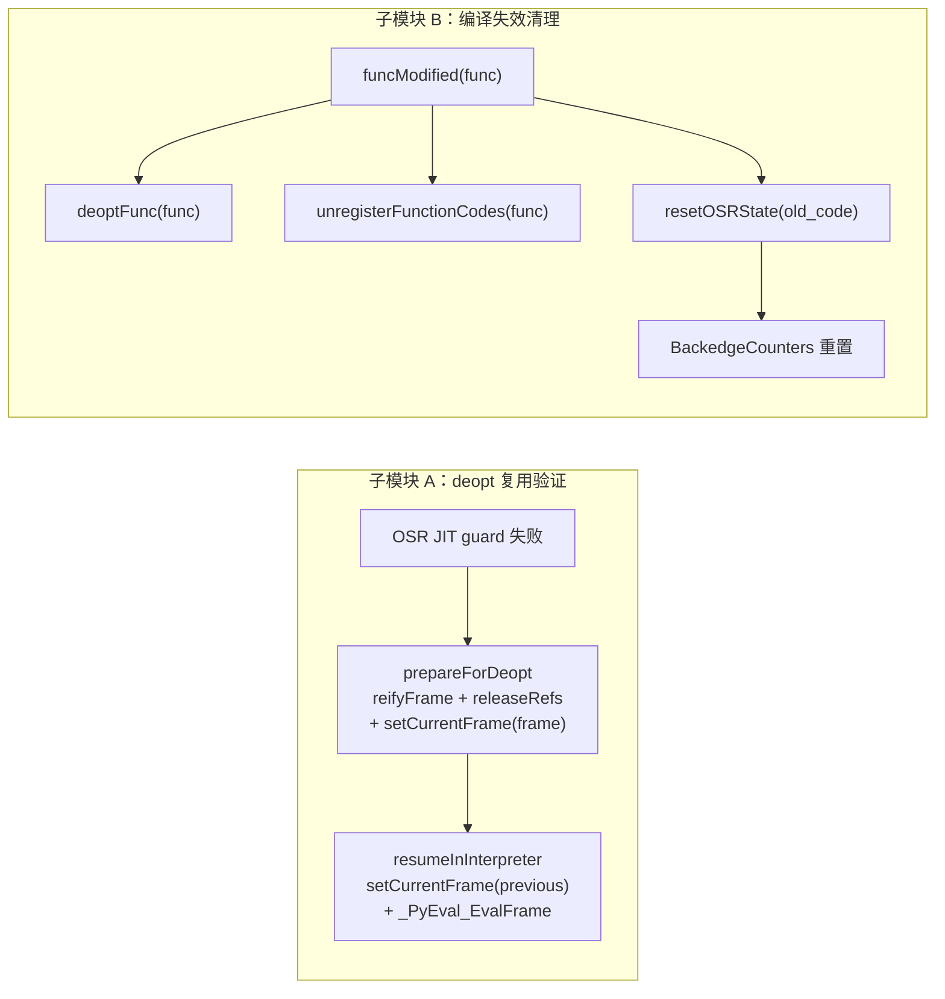

# 详细设计说明书

## 产品版本&密级

| 产品 | 版本 | 密级 |
|------|------|------|
| CinderX | 3.14 | 内部 |

## 拟制信息

| 角色 | 姓名 | 日期 |
|------|------|------|
| 作者 | Claude Code | 2026-05-20 |

## 修订记录

| 版本 | 日期 | 作者 | 修改概要 |
|------|------|------|---------|
| V1.0 | 2026-05-20 | Claude Code | 初版 |
| V1.1 | 2026-05-21 | Claude Code | 修复 Codex rescue 审查问题：BackedgeEntry 结构对齐功能设计（uint8_t state + 固定数组）；setCurrentFrame 时序修正为两处（prepareForDeopt + resumeInInterpreter）；typeModified 不重置 OSR 状态的理由澄清；resetOSRState 异常安全；codeDestroyed 与 freefunc 非直接调用关系澄清；验证清单 inline 改为 kNormal 无 inliner 断言；Mermaid deopt 图拆分 setCurrentFrame 两阶段 |

## Keywords 关键词

OSR, deopt, reifyFrame, releaseRefs, funcModified, resetOSRState, BackedgeCounters, CompiledFunction

## Abstract 摘要

本文档为功能设计说明书"功能项 4：OSR 退出与降级"的详细设计。功能项 4 覆盖两个子问题：(1) OSR JIT 代码因 guard 失败触发 deopt 退回解释器的路径；(2) OSR 编译结果因代码修改/类型修改/对象回收而失效时的清理策略。

核心设计决策：**OSR deopt 完全复用现有 kNormal JIT deopt 机制**（`prepareForDeopt` → `reifyFrame` → `releaseRefs` → `resumeInInterpreter`），不引入任何 OSR 特有分支。编译失效时在 `funcModified()` 路径中新增 `resetOSRState()` 调用，其余路径（`codeDestroyed()`、`typeModified()`）无需修改。

## List of abbreviations 缩略语清单

| 缩略语 | 英文全称 | 中文名 |
|--------|---------|--------|
| OSR | On-Stack Replacement | 栈上替换 |
| deopt | Deoptimization | 反优化 |
| FMEA | Failure Mode and Effects Analysis | 失效模式与影响分析 |
| DECREF | Decrease Reference Count | 引用计数递减 |
| JIT | Just-In-Time Compilation | 即时编译 |
| CF | CompiledFunction | 已编译函数 |

## 简介

本详细设计聚焦功能项 4 的实现层面，为开发人员提供可直接指导编码的接口定义、数据结构、算法流程和代码实现要点。

**上游文档**：《OSR 热循环功能设计说明书》（`hot-loop-osr-function-design.md`）功能项 4 章节。

**前置功能项**：功能项 1（热循环检测）、功能项 2（OSR 编译）、功能项 3（OSR 进入）。

# 上游文档引用

| 上游文档 | 引用章节 |
|---------|---------|
| 功能设计说明书 | 功能项 4：OSR 退出与降级 |
| 功能设计说明书 | 核心协议：三态返回约定 |
| 功能设计说明书 | 核心协议：帧所有权模型（kNormal） |
| 功能设计说明书 | 核心协议：live-in 引用所有权模型 |
| 功能设计说明书 | ADR-3：不需要 JIT_FRAME_OSR 标记 |
| 功能设计说明书 | ADR-5：MVP 仅支持 kOwned live-in |
| 功能设计说明书 | ADR-6：live-in 使用 steal 语义 |

# 实现设计

## 实现概述

功能项 4 包含两个独立子模块：

**子模块 A：OSR deopt 路径复用** — OSR JIT 代码与正常 JIT 代码共享完全相同的 deopt 路径。不需要修改任何现有 deopt 代码（`prepareForDeopt`、`reifyFrame`、`releaseRefs`、`resumeInInterpreter`）。实现工作为验证性测试。

**子模块 B：编译失效清理** — 在 `funcModified()` 路径中新增 `resetOSRState()` 调用，重置回边计数器和编译状态。`codeDestroyed()` 路径依赖 code extra 析构函数自动清理，无需修改。`typeModified()` 路径通过 guard deopt 机制自动处理，不需要重置 OSR 计数器/编译状态。

**关于 `typeModified` 与 `FailedPermanent` 重置**：功能设计文档（function-design.md:1228）提到"code 修改/类型修改时"调用 `resetOSRState()`，但 MVP 仅在 `funcModified()` 路径实现重置。理由：源码中 `notifyTypeModified()`（context.cpp:401-425）仅处理 inline cache 失效和类型 deopt patcher，不涉及编译缓存/计数器清理。类型修改不会使 OSR 编译结果失效（OSR 编译基于字节码不变量，非类型特化），因此 `FailedPermanent` 状态在类型修改后保持不变是正确的。功能设计文档中的"类型修改"描述适用于 Phase 2 的类型特化 OSR 场景。

## 关键算法与流程

### OSR deopt 调用链（子模块 A）

OSR JIT 代码中的 guard 失败触发的 deopt 与正常 JIT deopt 走完全相同的调用链：

```
JIT guard 失败
  → stage1 trampoline（per-guard）：push deopt_meta_index
  → stage2 trampoline（per-function）：save CodeRuntime* + epilogue addr + scratch reg
  → 全局 deopt trampoline：save 所有 GP 寄存器到栈上连续数组
  → C++ prepareForDeopt(regs, code_runtime, deopt_idx)
      → reifyFrame 循环（inline_depth + 1 层帧）
          → reifyLocalsplus(frame, meta, frame_meta, mem)：恢复 locals
              dead slot → Ci_STACK_NULL（盲写 NULL）
              live slot → mem.readOwned() + Ci_STACK_STEAL（盲写，不 DECREF 旧值）
          → reifyStack(frame, meta, frame_meta, mem)：恢复操作数栈
      → releaseRefs(deopt_meta, mem)：对 kOwned live_values 执行 DECREF
      → setCurrentFrame(tstate, frame)：恢复帧指针（gen_asm.cpp:177）
  → resumeInInterpreter(frame, code_runtime, deopt_idx, ...)
      → setCurrentFrame(tstate, frame->previous)：切换到 caller 帧（gen_asm.cpp:318）
      → _PyEval_EvalFrame(tstate, frame, err_occurred)
          → 解释器运行到函数结束
          → RETURN_VALUE / exit_unwind → _PyEval_FrameClearAndPop
      → 返回 PyObject*（非 NULL）或 NULL（异常）
  → epilogue 返回给 performOSR 的调用者
```

**OSR 复用安全性的关键保证**：

1. **`DeoptMetadata` 完整性**：`HIRBuilder` 为所有 guard 构建 `Snapshot`/`FrameState`，不区分入口点类型。OSR entry 只是另一个入口，进入后 guard 的元数据已完整。

2. **`reifyLocalsplus` 兼容性**：`reifyLocalsplus`（deopt.cpp:115-149）对 local slot 使用 `Ci_STACK_STEAL`（盲写，不 DECREF 旧值）或 `Ci_STACK_NULL`（盲写 NULL），**假设 slots 初始为 NULL**。OSR 的 steal 语义保证 `performOSR` + stub 已将 localsplus 清零（非 live-in → 延迟 DECREF 收集 + 写 `PyStackRef_NULL`；live-in → stub steal 写 `PyStackRef_NULL`），使 localsplus 进入与 `JITRT_AllocateAndLinkInterpreterFrame` 新分配帧相同的状态。

3. **`releaseRefs` 引用计数平衡**：`releaseRefs`（deopt.cpp:366-380）对 `kOwned` live_values 执行 DECREF，跳过 `kBorrowed`/`kUncounted`。OSR live-in 在 JIT 侧经过 `refcount_insertion` INCREF（创建 JIT owned ref），deopt 时 `releaseRefs` DECREF 消耗此 owned ref。MVP 仅允许 kOwned live-in（ADR-5），保证引用计数闭合。

### resetOSRState 算法（子模块 B）

当 OSR 编译结果因函数代码被修改而失效时，需要重置回边计数器和编译状态：

```
resetOSRState(code):
  counters = Ci_GetBackedgeCounters(code)  // 通过 code extra index 获取
  if counters == nullptr:
    return  // code 对象没有 OSR 状态，幂等返回
  for each entry in counters->entries[0..num_entries):
    entry.count = 0
    entry.state = Counting(1)             // 重置为初始状态
  counters->num_compile_states = 0         // 清空编译状态（uintptr_t identity，无需 DECREF）
```

**调用时机**：在 `funcModified()` 中、`func->func_code` 被更新**之前**调用（此时 `func->func_code` 仍指向旧 code）。

## 行为模型

### 正常流程

#### 流程 1：OSR JIT 代码正常执行并返回

OSR 进入后 JIT 代码执行到函数结束，走正常 return 路径。JIT epilogue 执行 `JITRT_UnlinkFrame` → `PopFrame(F)`。`performOSR` 收到 rc=1，字节码处理程序执行 `_Py_LeaveRecursiveCallPy` + `LOAD_SP(); LOAD_IP(frame->return_offset);` + push result + DISPATCH。

此流程中功能项 4 **不参与**——正常 return 不是 deopt，不涉及功能项 4。

#### 流程 2：OSR JIT 代码 deopt 退回解释器

```
[OSR JIT 执行中]
  guard 失败（类型检查、属性检查等）
  → stage1 trampoline push deopt_idx
  → stage2 trampoline save CodeRuntime + epilogue
  → 全局 deopt trampoline save 寄存器
  → prepareForDeopt: reifyFrame + releaseRefs + setCurrentFrame(frame)（gen_asm.cpp:177）
  → resumeInInterpreter: setCurrentFrame(previous)（gen_asm.cpp:318）→ _PyEval_EvalFrame
  → 解释器从 guard 点字节码位置继续执行到函数结束
  → RETURN_VALUE/exit_unwind → PopFrame
  → epilogue 返回 PyObject* 或 NULL
  → performOSR 返回 rc=1（正常完成）或 rc=-1（异常）
```

**时序约束**：`setCurrentFrame` 在两处执行——`prepareForDeopt` 设置 `setCurrentFrame(tstate, frame)` 恢复帧指针（gen_asm.cpp:177），`resumeInInterpreter` 设置 `setCurrentFrame(tstate, frame->previous)` 切换到 caller 帧（gen_asm.cpp:318），在 `_PyEval_EvalFrame` 调用前执行。此时 F 仍是 datastack 上的有效帧（未被释放），但不再是 `tstate->current_frame`。

#### 流程 3：`funcModified` 触发 OSR 状态重置

```
用户代码: func.__code__ = new_code
  → Python 层触发 func_code setter
  → CinderX hook: funcModified(func)
      → deoptFunc(func): removeCompiledFunc + setVectorcall（将 func 恢复为解释器执行）
      → unregisterFunctionCodes(func): 清除 registered_compilation_units、codeOuterFunctions
      → resetOSRState(old_code): ★ 新增调用
          → 重置 BackedgeCounters 所有 entry 的 count=0, state=Counting
          → 清空 compile_states（uintptr_t identity，无 DECREF）
  → Python 层更新 func->func_code = new_code
```

### 异常流程

#### 异常流程 1：OSR JIT 代码 deopt 时发生异常

guard deopt 可能在以下情况下带异常返回：

- `DeoptReason::kRaise`：JIT 代码显式 raise 异常
- `DeoptReason::kUnhandledNullField`：属性访问失败
- `DeoptReason::kUnhandledUnboundLocal`：局部变量未绑定
- `DeoptReason::kUnhandledUnboundFreevar`：自由变量未绑定
- `DeoptReason::kUnhandledException`：未处理的异常

这些场景下 `resumeInInterpreter` 将 `err_occurred=1` 传递给 `_PyEval_EvalFrame`，解释器进入异常处理路径。如果异常未被处理，最终 `_PyEval_EvalFrame` 返回 NULL，`performOSR` 返回 rc=-1。

**OSR 无需特殊处理**：异常路径与正常 JIT deopt 完全一致。

#### 异常流程 2：`resetOSRState` 对 null counters 及异常安全

`funcModified` 调用时，旧 code 对象可能没有 OSR 状态（该函数从未触发 OSR 编译）。`resetOSRState` 通过 `Ci_GetBackedgeCounters` 获取 null 指针后直接返回，幂等安全。

**异常安全**：`Ci_GetBackedgeCounters` 内部通过 `PyUnstable_Code_GetExtra` 获取 code extra（code.cpp:213-215）。现有 CinderX 模式中，如果 code extra 获取失败会打印警告并清除 pending exception。`resetOSRState` 实现必须保证：(1) 不泄漏 pending exception（调用前/后 PyErr 状态不变）；(2) 对 `Ci_GetBackedgeCounters` 返回 nullptr 的所有路径均安全返回。

#### 异常流程 3：deopt 过程中 `reifyFrame` 内存分配失败

`reifyFrame` 可能因内存不足失败（如 `take_ownership` 中 `_PyFrame_New_NoTrack` 失败）。现有 deopt 代码已处理此场景（frame.cpp:27-30 返回 NULL → `Py_FatalError("Cannot recover from OOM")`）。OSR 复用此路径，无新增风险。

#### 异常流程 4：编译失效时有活跃 OSR 执行

`funcModified` 在任意 Python 线程中执行。如果另一个线程（或 finalizer 回调链）中有正在执行的 OSR JIT 代码：

- `deoptFunc` 设置 vectorcall 为解释器入口 → 后续调用走解释器
- 已在执行中的 JIT 代码不受影响——`CompiledFunction` 仍持有代码引用
- JIT 代码正常完成或 deopt 退回解释器后，`CompiledFunction` 引用计数归零被回收
- `resetOSRState` 重置计数器，下次执行同一 code 时从 Counting 状态重新开始

**GIL 保证**：CPython GIL 保证 `funcModified` 和 `resetOSRState` 不会与同一帧上的 OSR 执行并发。MVP 不支持 free-threading。

## 数据模型

### 数据结构定义

#### BackedgeCounters（功能项 1 定义，功能项 4 重置）

```cpp
// cinderx/Jit/osr.h — 功能项 1 新增
// 与功能设计说明书功能项 1 保持一致（function-design.md:413-431）

struct BackedgeEntry {
  uint32_t source_index;       // 回边源指令的 code-unit 索引
  uint32_t target_index;       // 循环头目标的 code-unit 索引
  uint32_t count;              // 回边执行计数（free-threading 下用 atomic）
  uint8_t state;               // 热度状态：1=Counting, 3=FailedPermanent
  uint8_t _pad[3];             // 对齐填充
  // 注意：BackedgeEntry 不包含编译状态（Compiling/Compiled），
  // 编译状态由独立的 OSRCompileState 管理（见功能项 2）
};

struct OSRCompileState {
  uintptr_t builtins_id;  // builtins dict 身份（identity，非引用）
  uintptr_t globals_id;   // globals dict 身份（identity，非引用）
  uint32_t state;         // 0=Idle, 1=Compiling, 2=Compiled, 3=FailedPermanent
};

struct BackedgeCounters {
  BackedgeEntry entries[CI_OSR_MAX_BACKEDGES];       // 固定数组（非柔性数组）
  uint32_t num_compile_states;
  OSRCompileState compile_states[CI_OSR_MAX_COMPILE_KEYS];  // 编译状态固定数组
};
```

`BackedgeCounters` 通过 `PyUnstable_Eval_RequestCodeExtraIndex` 注册的 code extra index 旁挂在 `PyCodeObject` 上。释放机制：`codeDestroyed()`（`_cinderx-lib.cpp:516-522` 触发，`pyjit.cpp:3657-3671` 执行）仅清除 JIT 注册表；`BackedgeCounters` 的内存在同一 code dealloc 流程中由 CPython 的 code extra 析构机制调用 `backedgeCountersFreefunc`（`PyMem_Free`）释放。两者在同一 code 对象析构流程中自动触发，但不是直接调用关系。

#### DeoptMetadata（现有，OSR 只读使用）

```cpp
// cinderx/Jit/deopt.h — 现有结构，功能项 4 不修改

struct DeoptMetadata {
  std::vector<DeoptFrameMetadata> frame_meta;
  std::vector<LiveValue> live_values;
  DeoptReason reason;
  BorrowedRef<> eh_name;
  // ...
};

struct DeoptFrameMetadata {
  int cause_instr_idx;          // guard 对应的字节码位置
  std::vector<LiveValue> localsplus;
  std::vector<LiveValue> stack;
  // ...
};

struct LiveValue {
  PhyLocation location;         // JIT 寄存器/栈槽位置
  hir::RefKind ref_kind;        // kOwned/kBorrowed/kUncounted
  hir::ValueKind value_kind;    // 类型信息
  // ...
};
```

### 数据流转

#### deopt 路径数据流转

```
JIT 寄存器状态（aarch64 GP regs / x86_64 GP regs）
  → 全局 deopt trampoline 保存到栈上连续数组 uint64_t regs[]
  → prepareForDeopt 构造 MemoryView{regs}
  → reifyFrame 从 MemoryView 读取 live values 写入 _PyInterpreterFrame
  → releaseRefs 从 MemoryView 读取 kOwned values 执行 DECREF
  → resumeInInterpreter 将 _PyInterpreterFrame 交给 _PyEval_EvalFrame
```

#### resetOSRState 数据流转

```
PyCodeObject* code
  → Ci_GetBackedgeCounters(code) [code extra index 查找]
  → BackedgeCounters*
      → entries[0..N): count=0, state=Counting
      → compile_states: num_compile_states=0
```

## 接口设计

### 内部接口设计

#### 接口关系图



### 内部接口定义

#### `resetOSRState` — 重置 code 对象的 OSR 状态

```cpp
// cinderx/Jit/osr.h

namespace jit {

/// 重置 code 对象的回边计数器和编译状态。
/// 在 funcModified() 中、func_code 更新前调用。
/// 幂等：code 没有 OSR 状态时安全返回。
void resetOSRState(PyCodeObject* code);

} // namespace jit
```

**参数语义**：
- `code`：旧 code 对象（`func->func_code`，在代码被替换前仍然有效）

**前置条件**：
- `code` 指向有效的 `PyCodeObject`（引用计数 > 0）
- GIL 已持有

**后置条件**：
- 如果 `code` 有 `BackedgeCounters`，所有 entry 的 `count=0`、`state=Counting(1)`，`num_compile_states=0`
- 如果 `code` 没有 `BackedgeCounters`，无操作

**调用点**：
```cpp
// cinderx/Jit/pyjit.cpp — funcModified() 修改

void funcModified(BorrowedRef<PyFunctionObject> func) {
  FreeThreadedJITEntrypointGuard guard;
  deoptFunc(func);
  unregisterFunctionCodes(func);
  resetOSRState(borrowed(func->func_code));  // ★ 新增：在 func_code 更新前重置
}
```

#### `Ci_GetBackedgeCounters` — 获取 code 对象的回边计数器

```cpp
// cinderx/Jit/osr_capi.h — 功能项 1 新增，功能项 4 使用

/// 获取 code 对象的 BackedgeCounters（通过 code extra index）。
/// 返回 borrowed 指针（code 对象持有所有权）。
/// 返回 nullptr 表示该 code 没有 OSR 状态。
BackedgeCounters* Ci_GetBackedgeCounters(PyCodeObject* code);
```

#### 不需要新增的接口

| 现有接口 | 说明 | 功能项 4 使用方式 |
|---------|------|-----------------|
| `deoptFunc(func)` | 反优化函数（pyjit.cpp:1286） | `funcModified` 路径直接调用，无修改 |
| `unregisterFunctionCodes(func)` | 清除注册信息（pyjit.cpp） | `funcModified` 路径直接调用，无修改 |
| `codeDestroyed(code)` | code 对象销毁回调（pyjit.cpp:3657） | 不修改，依赖 code extra freefunc 自动清理 |
| `notifyTypeModified(type)` | 类型修改通知（context.cpp:401） | 不修改，通过 guard deopt 机制自动触发 |
| `prepareForDeopt` | deopt 准备（gen_asm.cpp:148） | 不修改，OSR 透明复用 |
| `reifyFrame` | 帧重建（deopt.cpp:335） | 不修改，OSR 透明复用 |
| `releaseRefs` | 引用释放（deopt.cpp:366） | 不修改，OSR 透明复用 |
| `resumeInInterpreter` | 恢复解释器执行（gen_asm.cpp:284） | 不修改，OSR 透明复用 |

## 代码实现要点

### 1. `resetOSRState` 实现

```cpp
// cinderx/Jit/osr.cpp

void resetOSRState(PyCodeObject* code) {
  BackedgeCounters* counters = Ci_GetBackedgeCounters(code);
  if (counters == nullptr) {
    return;
  }
  for (uint32_t i = 0; i < counters->num_entries; i++) {
    counters->entries[i].count = 0;
    counters->entries[i].state = 1; /* BackedgeState::Counting */
  }
  counters->num_compile_states = 0;
}
```

**实现要点**：
- 使用 `Ci_GetBackedgeCounters` 通过 code extra index 获取计数器，与功能项 1 的存储方式一致
- 所有字段为值类型或 `uintptr_t` identity，无需 `Py_XDECREF`
- 幂等：多次调用与单次调用结果相同
- 无异常抛出风险：纯内存操作，无 `PyObject*` 操作

### 2. `funcModified` 集成

```cpp
// cinderx/Jit/pyjit.cpp — 修改 funcModified()

void funcModified(BorrowedRef<PyFunctionObject> func) {
  FreeThreadedJITEntrypointGuard guard;
  deoptFunc(func);
  // Clean up registrations for the old code object.
  unregisterFunctionCodes(func);
  // ★ 新增：重置旧 code 的 OSR 状态（在 func_code 更新前执行）
  resetOSRState(borrowed(func->func_code));
}
```

**集成要点**：
- `resetOSRState` 必须在 `func->func_code` 被外部调用者更新**之前**调用（`funcModified` 不修改 `func_code`，调用者在 `funcModified` 返回后更新）
- `deoptFunc` 和 `unregisterFunctionCodes` 必须在 `resetOSRState` 之前执行——确保编译结果已反优化后再重置计数器
- 如果 `deoptFunc` 返回 false（函数未被 JIT 编译），`resetOSRState` 仍然安全调用

### 3. `codeDestroyed` 路径 — 无修改

```cpp
// cinderx/Jit/pyjit.cpp — 现有代码，不修改

void codeDestroyed(BorrowedRef<PyCodeObject> code) {
  FreeThreadedJITEntrypointGuard guard;
  if (isJitUsable()) {
    auto mod_state = cinderx::getModuleState();
    if (!mod_state) { return; }
    auto& jit_reg_units = mod_state->registered_compilation_units;
    jit_reg_units.erase(code.getObj());
    if (auto* ctx = jitCtx()) {
      ctx->codeOuterFunctions().erase(code);
    }
    notifyUnitDeletedDuringPreload(mod_state, code.getObj());
  }
  // BackedgeCounters 由 code extra 析构函数 backedgeCountersFreefunc 自动释放
  // （PyMem_Free，无需手动清理）
}
```

**清理保证链**：
1. code 对象引用计数归零 → 触发 `codeDestroyed`
2. `codeDestroyed` 清除注册信息
3. `PyCodeObject.tp_dealloc` 释放 code extra → `backedgeCountersFreefunc(PyMem_Free)`
4. `BackedgeCounters` 内存被释放（所有字段为值类型/uintptr_t，无需 DECREF）

### 4. deopt 复用验证清单

以下验证点需通过测试确认：

| 验证项 | 验证方法 | 预期结果 |
|--------|---------|---------|
| `reifyLocalsplus` 兼容性 | OSR 进入后触发 guard deopt，检查 locals 值 | 所有 local slots 被正确恢复（dead slots 为 NULL，live slots 为正确值） |
| `releaseRefs` 引用平衡 | 引用计数审计：OSR 进入前/deopt 后对象引用计数 | kOwned live-in 引用计数闭合 |
| `resumeInInterpreter` 正确性 | OSR deopt 后解释器从 guard 点继续执行 | 结果与纯解释器一致 |
| 嵌套帧 deopt | kNormal 模式下确认无 inline_depth > 0（`pyjit.cpp:721-732` 禁用 inliner）| kNormal 下 deopt 仅处理单层帧，无内联 reify 需求 |
| 异常传播 | OSR deopt 带 DeoptReason::kRaise | 异常正确传播到调用者 |

# DFX分析

## 可靠性分析

### FMEA 分析

| 失效模式 | 影响 | 严重度 | 原因 | 检测手段 | 补偿措施 |
|---------|------|--------|------|---------|---------|
| deopt 时 localsplus 非 NULL 导致引用泄漏 | 内存泄漏 | 高 | performOSR 未正确 steal 或延迟 DECREF 失败 | 引用计数审计测试 | `reifyLocalsplus` 对 dead slot 写 `Ci_STACK_NULL`，对 live slot 写 `Ci_STACK_STEAL`，两者均不 DECREF 旧值——依赖 steal 语义已清零 |
| deopt 时 `releaseRefs` 对 kBorrowed 值 DECREF | 引用计数下溢，进程崩溃 | 严重 | `releaseRefs` 跳过 kBorrowed——如果 OSR live-in 包含 kBorrowed 值 | `extractOSRLiveIns` 编译期拒绝非 kOwned live-in（ADR-5） | MVP 限制：`markOSREntries` 只允许 kOwned live-in |
| `resetOSRState` 未调用导致计数器残留 | 旧 code 的 OSR 计数器永远不清除，可能导致错误的 OSR 编译触发 | 低 | `funcModified` 忘记调用 `resetOSRState` | 单元测试验证 `funcModified` 调用链 | `resetOSRState` 幂等，多次调用安全 |
| `resetOSRState` 时机错误（func_code 更新后调用） | 新 code 的计数器被错误重置 | 中 | 调用顺序错误 | 代码审查 + 单元测试 | `resetOSRState` 必须在 `func_code` 更新前调用 |
| `codeDestroyed` 时 `BackedgeCounters` 内存泄漏 | 内存泄漏 | 低 | code extra freefunc 未注册或注册失败 | 启动时断言 code extra index 有效 | `_cinderx-lib.cpp` 模块 init 中注册 `backedgeCountersFreefunc` |
| OSR deopt 后解释器执行异常 | 功能错误 | 高 | `reifyFrame` 恢复的 `instr_ptr` 指向错误字节码位置 | 真值比对测试 | `DeoptFrameMetadata::cause_instr_idx` 保证恢复到正确的 guard 点位置 |

## 异常处理设计

### deopt 路径异常

deopt 路径中的异常由现有机制处理：

1. **guard 失败异常**：`prepareForDeopt` 根据 `DeoptReason` 设置异常（如 `kUnhandledUnboundLocal` → `UnboundLocalError`），`resumeInInterpreter` 传递 `err_occurred=1` 给 `_PyEval_EvalFrame`。

2. **内存不足**：`reifyFrame` 中 `take_ownership` 的 `_PyFrame_New_NoTrack` 失败 → `Py_FatalError`。这是不可恢复错误，正常 JIT 和 OSR 共享此行为。

3. **reify 后解释器执行期间异常**：解释器从 guard 点继续执行，异常处理完全由 CPython 解释器负责。如果异常未被处理，`_PyEval_EvalFrame` 返回 NULL → `performOSR` 返回 rc=-1 → 字节码处理程序走 error 路径。

### resetOSRState 异常

`resetOSRState` 为纯内存操作，不会抛出异常：
- `Ci_GetBackedgeCounters` 返回 null 时直接返回
- 所有字段赋值为值类型操作
- 无 `PyObject*` 操作

## 性能分析

### deopt 性能

OSR deopt 与正常 JIT deopt 性能特征完全一致：

| 阶段 | 开销 |
|------|------|
| stage1/2/3 trampoline | ~10 条指令（push/jmp 序列） |
| 全局 deopt trampoline（save 寄存器） | ~30 条指令 |
| `prepareForDeopt` | O(inline_depth × localsplus_size)，典型 < 1μs |
| `resumeInInterpreter` | 解释器执行开销，与正常 deopt 相同 |

**无 OSR 特有开销**：不引入额外检查、标记或分支。

### resetOSRState 性能

| 操作 | 开销 |
|------|------|
| `Ci_GetBackedgeCounters` | 1 次 code extra lookup（O(1)） |
| 遍历 entries | O(num_backedges)，典型 1~5 个回边 |
| 清空 compile_states | O(1)（设置 num=0） |

**总计**：~100ns 量级，仅在 `funcModified` 路径执行（低频操作）。

## 安全和韧性分析

### 安全设计确认

功能项 4 不引入新的安全风险：

1. **deopt 复用**：现有 deopt 机制已经过安全审计，OSR 透明复用不改变其行为。
2. **resetOSRState**：纯内存操作，不涉及用户输入处理、外部 API 调用或权限变更。
3. **引用计数**：steal 语义保证引用所有权转移闭合（ADR-6），`releaseRefs` 保证 kOwned 值正确 DECREF。

### 敏感操作检查

不涉及。

### 并发安全

- MVP 依赖 GIL 保证线程安全
- `funcModified` 和 `resetOSRState` 在 GIL 下执行
- `codeDestroyed` 在 GIL 下执行（CPython 引用计数回收在 GIL 下触发）
- `typeModified` 通过 `notifyTypeModified` 触发 guard deopt，在 GIL 下执行
- free-threading 支持属于 Phase 2（需要 per-thread backedge counters）
