# 功能设计说明书 — 基于热循环的 OSR（On-Stack Replacement）能力

## 产品版本&密级

| 产品名称 | CinderX JIT |
|---------|------------|
| 版本号 | 3.14 |
| 密级 | 内部公开 |

## 拟制信息

| 角色 | 姓名           | 日期 |
|------|--------------|------|
| 拟制 | @sisibeloved | 2026-05-14 |

## 修订记录

| 日期 | 版本 | 修改描述 |
|------|------|---------|
| 2026-05-14 | V1.0 | 初始版本 |
| 2026-05-18 | V3.0 | 经 14 轮 Codex 对抗性审校，架构级变更（三态控制流契约、kOwned-only live-in） |
| 2026-05-19 | V3.1~V4.2 | 多轮审校修复（OSRState/stub ABI/缓存升级/状态机/RefKind 提取/entry 拒绝策略等） |
| 2026-05-19 | V5.0 | **架构级变更**：从 lightweight 帧模型迁移到 kNormal 帧模型 |
| 2026-05-19 | V5.1~V5.6 | 六轮 Codex 审校修复（steal 语义恢复/递归计数/clobber/frame 不变量/延迟 DECREF/entry null 安全等） |
| 2026-05-19 | V5.7~V5.8 | C/C++ 边界修复（osr_capi.h atomic flag）/inliner 禁用/VLA 修复/PhyLocation 分派/状态机闭合 |
| 2026-05-20 | V5.9 | 基于源码验证的九项修复（stackpointer 不变量/for vs while/注入点/BackedgeEntry 初始化等） |
| 2026-05-20 | V5.10 | 基于源码验证的六项修复（for/while 矛盾回退/const_cast UB/atomic API/struct diff 清单等） |
| 2026-05-20 | V5.11 | 功能项 2/3 重构：厘清编译与进入边界，添加交付契约，净减 ~250 行 |
| 2026-05-20 | V6.0 | 结构重构：设计依据迁移至 ADR（CodeExtra 决策/BCIndex vs BCOffset）、OSRMetadata 章节拆分为五子节、全文档代码注释精简为伪代码 |
| 2026-05-20 | V6.1 | 恢复伪代码块的源文件路径标注（pyjit.cpp/compiler.cpp/osr.cpp/generator.cpp/autogen.cpp） |
| 2026-05-20 | V6.2 | Codex 审校修复（8 项）：[P0-1] 空操作数栈判断 stackpointer != localsplus → != _PyFrame_Stackbase(frame)（pycore_interpframe.h:101）[P0-2] rc=1 caller 恢复协议 next_instr=instr_ptr → RELOAD_STACK + LOAD_IP(return_offset)（cinder-bytecodes.c:1326-1327）[P0-3] deferred_decrefs _PyStackRef 释放模型补全 PyStackRef_AsPyObjectSteal untag + 异常保护 [P0-4] live-in 建模补充 FrameState 覆盖充分性论证 + Phase 2 扩展路径 [P1-5] MVP 范围"所有空操作数栈 while" → "受限 while"（kOwned-only）[P1-6] 文件清单补全 module_state.h/_cinderx-lib.cpp/code.cpp code extra 生命周期 [P1-7] OSRCompileState 裸指针风险缓解说明（dict 版本号校验备选）[mermaid] 3 处语义修复（rc=1 恢复协议/deferred_decrefs untag/deopt setCurrentFrame 时序） |
| 2026-05-21 | V7.0 | Codex 二轮审校修复（9 项）：[1] RELOAD_STACK → LOAD_SP()/SAVE_SP() 宏名修正（ceval_macros.h:352-356）；rc=0 双重 GetStackPointer debug 契约违反修复 [2] Code Extra API 修正 PyUnstable_Code_GetExtraIndexByName → PyUnstable_Eval_RequestCodeExtraIndex（code.cpp:170）；预处理指令格式修正 #ifndef [3] 文件清单补全 HIR/LIR 14 个必要文件（hir.h/hir.cpp/printer/instr_effects/refcount_insertion/lir/instruction/autogen 等）[4] MVP 验收精确定义首批可接受 bytecode/HIR 形状（LOAD_FAST 默认 kBorrowed 限制、guard 后 kOwned 模式）[5] instr_ptr 可观测性修复——performOSR 调用 stub 前设置 frame->instr_ptr 到 loop header [6] mermaid 4 处修复（rc=0 栈恢复/deopt 时序 setCurrentFrame/participant 声明/Ci_EvalFrame → _PyEval_EvalFrame）[7] 异常保护区检查算法补充（co_exceptiontable varint 解析 + isInProtectedRange 伪代码）[8] 生产就绪限制说明（编译预算非真正超时/缓存裸地址限制/正常 JIT 兼容性量化）[9] 编译预算/缓存失效/兼容性三项生产化 gap 显式标注为 Phase 2 |

> 详细审校记录见[附录：审校记录](#附录审校记录)。

## Keywords 关键词

OSR, On-Stack Replacement, 热循环检测, 回边计数, JIT编译, Deoptimization, HIR, LIR, FrameState

## Abstract 摘要

本文档设计 CinderX JIT 支持基于热循环的 OSR（On-Stack Replacement）能力。当前 CinderX 仅支持函数级 JIT 编译：当函数被调用足够次数后，在下一次函数入口处进入 JIT 代码执行。对于"函数只执行一次但内部存在热循环"的场景（如 `def main(): ... while ...` 模式——函数体内有长时间运行的循环，但函数本身只被调用一次），当前方案无法提供 JIT 加速。MVP 仅支持**函数帧**内的 **`while` 循环**——OSR 通过 `JUMP_BACKWARD_JIT` 回边计数触发。CPython 的 `while` 和 `for` 循环均生成 `JUMP_BACKWARD`（codegen.c:2086），但 `for` 循环的回边目标是 `FOR_ITER` 指令（codegen.c:2087），此时操作数栈上持有迭代器对象（bytecodes.c:3164: `iter -- iter, next`），`isOSREligible` 拒绝非空操作数栈（`frame->stackpointer != _PyFrame_Stackbase(frame)`，栈底为 `localsplus + co_nlocalsplus`，见 pycore_interpframe.h:101），因此 MVP 实际仅覆盖 `while` 循环（空栈回边）。模块顶层代码（`if __name__ == "__main__": while ...`）不是函数帧，`_PyFrame_GetFunction()` 对 `PyFunction_Check` 有断言（pycore_interpframe.h:97），不在 MVP 支持范围内。`for` 循环 OSR 留作 Phase 2（需要恢复栈上迭代器，见 ADR-8）。

本设计通过在解释器的回边字节码（`JUMP_BACKWARD_JIT`）中增加回边计数器，当计数器达到阈值时触发 OSR 编译，生成带有 loop-header secondary entry 的 JIT 代码，并将当前解释器帧状态迁移到 JIT 代码中继续执行。该方案复用现有 deopt 机制的对称设计，最大程度降低实现复杂度。

## List of abbreviations 缩略语清单

| 缩略语 | 英文全称 | 中文名 |
|--------|---------|--------|
| OSR | On-Stack Replacement | 栈上替换 |
| JIT | Just-In-Time Compilation | 即时编译 |
| HIR | High-level Intermediate Representation | 高级中间表示 |
| LIR | Low-level Intermediate Representation | 低级中间表示 |
| CFG | Control Flow Graph | 控制流图 |
| SSA | Static Single Assignment | 静态单赋值 |
| MVP | Minimum Viable Product | 最小可行产品 |
| ABI | Application Binary Interface | 应用二进制接口 |
| FP | Frame Pointer | 帧指针（寄存器） |
| SP | Stack Pointer | 栈指针（寄存器） |
| LR | Link Register | 链接寄存器 |
| RAII | Resource Acquisition Is Initialization | 资源获取即初始化 |
| TLS | Thread-Local Storage | 线程本地存储 |
| BCIndex | Bytecode Index | 字节码索引（code-unit 单位） |
| BCOffset | Bytecode Offset | 字节码偏移（字节单位） |
| deopt | Deoptimization | 逆优化（JIT → 解释器回退） |
| regalloc | Register Allocation | 寄存器分配 |
| codegen | Code Generation | 代码生成 |
| DFX | Design for Excellence | 卓越设计（可靠性/性能/安全等） |
| FMEA | Failure Mode and Effects Analysis | 失效模式与影响分析 |
| TSAN | ThreadSanitizer | 线程数据竞争检测工具 |
| ASAN | AddressSanitizer | 地址越界检测工具 |
| UAF | Use-After-Free | 释放后使用（内存安全缺陷） |
| GC | Garbage Collection | 垃圾回收 |
| GIL | Global Interpreter Lock | 全局解释器锁 |
| INCREF | Increment Reference Count | 增加引用计数 |
| DECREF | Decrement Reference Count | 减少引用计数 |

## 前言

本文档为 CinderX JIT "基于热循环的 OSR 能力" 功能设计说明书，定义功能域划分、实现方案、接口设计和 DFX 分析。

**设计文档层级说明**：本文档为功能设计（非详细设计），实现方案使用伪代码描述核心逻辑和关键约束。代码片段中的注释仅标注方案级要点（如边界条件、不变量、关键决策），不逐行解释实现细节。需要逐行注释的代码实现指导属于详细设计文档的范畴。

参考 Issue #76 的穿刺设计结论，该穿刺已验证以下可行性：
- CinderX 现有 deopt 机制提供了可复用的帧状态建模能力
- 3.14 解释器中 `JUMP_BACKWARD_JIT` 字节码提供了回边挂点
- HIR builder 已能识别 loop header 并插入周期性检查

本设计在穿刺结论基础上，给出考虑生产就绪性的完整方案。

---

# 功能域：基于热循环的 OSR

## 功能域概述

### 问题：函数只执行一次但内部有热循环

当前 CinderX JIT 仅支持**函数级编译**：一个函数被调用足够次数后（达到 `hot_code_threshold`），下一次从函数**入口**进入 JIT 代码。这对大多数场景有效，但无法覆盖一个常见模式：

```python
# 函数只执行一次，但循环执行很多次
# ★ 必须是 def 函数——模块顶层 while（if __name__ == "__main__": while ...）
#   不是函数帧，MVP 不支持（_PyFrame_GetFunction 断言 PyFunction_Check）
def main():
    total = 0
    i = 0
    while i < 100_000_000:  # ← 这个循环很热，但 main() 只调用一次
        total += process(i)
        i += 1
    return total

main()  # 函数级 JIT 永远不会触发（调用次数 < 阈值）
```

函数级 JIT 要求"函数被调用多次 → 编译 → 下次调用时从入口进入"。但上述场景中函数只调用一次，函数级 JIT 无法介入。循环内的代码只能以解释速度执行。

> **注意**：MVP 通过 `JUMP_BACKWARD_JIT` 回边计数触发 OSR。CPython 的 `while` 和 `for` 循环均生成 `JUMP_BACKWARD`（codegen.c:2098），但 MVP 仅覆盖**空操作数栈**的回边目标——即 `while` 循环头。`for` 循环的回边目标是 `FOR_ITER`（codegen.c:2087），此时操作数栈上有迭代器（bytecodes.c:3164），`isOSREligible` 通过 `stackpointer != _PyFrame_Stackbase(frame)` 拒绝非空栈。`for` 循环 OSR 留作 Phase 2。不支持模块顶层代码（非函数帧）。

### 解决方案：OSR（On-Stack Replacement）

OSR 的核心思想：**不等待下一次函数调用，而是在当前函数执行过程中，从循环头切入 JIT 代码**。

类比理解：
- **函数级 JIT** = 换乘：到站后换乘高铁（下次函数调用时从新入口出发）
- **OSR** = 在行驶中换引擎：车还在跑，直接把发动机换成更快的（当前函数执行中途切入 JIT）

"栈上替换"（On-Stack Replacement）的名字源于：函数的执行帧已经在调用栈上，OSR 在不离开当前函数的前提下，从解释器切换到 JIT 执行。

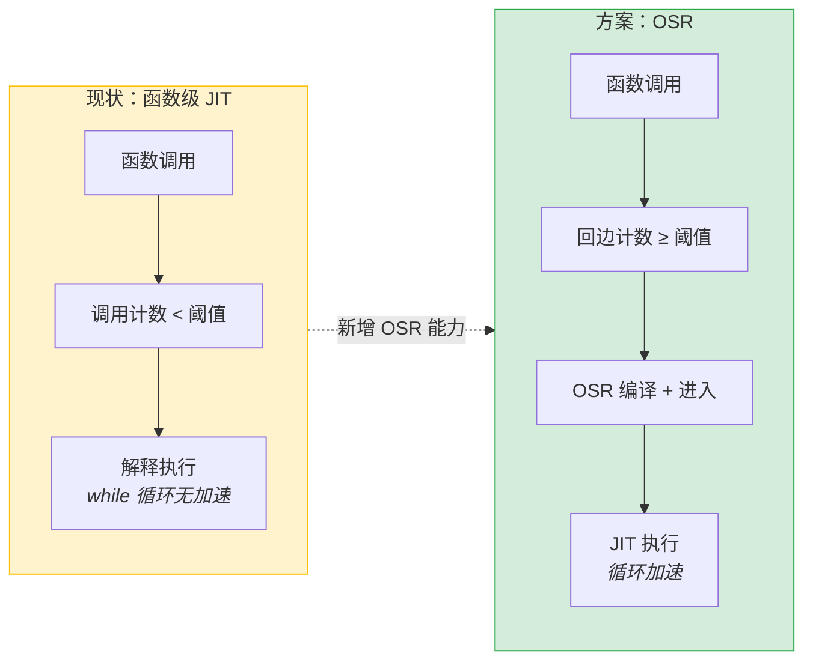

### 关键概念

**回边（Backedge）**：循环体末尾跳回循环头的指令（`JUMP_BACKWARD`）。每次循环迭代都执行一次回边。回边是检测热循环的自然观测点——回边执行越频繁，循环越热。

```
循环头 (loop header)  ←─────────────┐
│  x = ...                          │
│  y = ...                          │
│  if cond: break                   │
│  JUMP_BACKWARD  ← 回边（跳回循环头）┘
```

**循环头（Loop Header）**：循环体的第一条指令，也是回边的跳转目标。OSR 入口点设在循环头——从循环头进入 JIT 代码，意味着从此处开始的所有后续循环迭代都在 JIT 中执行。

**deopt（逆优化）**：JIT 代码在执行过程中遇到无法继续的情况（如类型 guard 失败），将当前 JIT 状态恢复为解释器帧，回到解释器继续执行。这是 OSR 的"逆操作"：
- deopt：JIT → 解释器（JIT 代码的活跃值写入解释器帧）
- OSR：解释器 → JIT（解释器帧的活跃值写入 JIT 寄存器/栈）

本设计复用 deopt 的 `LiveValue`/`PhyLocation` 建模，确保两个方向的值映射对称、可验证。

### 能力范围

本功能域为 CinderX JIT 增加"在函数执行过程中，基于热循环回边触发编译并从循环头进入 JIT 代码"的能力。包含以下核心子问题：
1. **热循环检测** — 在解释器的 `JUMP_BACKWARD` 回边指令中插入计数器，识别执行次数超过阈值的循环
2. **OSR 编译** — 为热循环所在的函数生成带有 loop-header secondary entry 的 JIT 代码
3. **OSR 进入** — 将解释器帧的活跃值（locals、栈上值）映射到 JIT 代码期望的寄存器/栈位置，从循环头切入 JIT
4. **OSR 退出与降级** — OSR 进入后的 JIT 代码复用现有 deopt 机制；deopt 后的解释器从 deopt 点继续执行到函数结束

### CinderX 帧模型背景（kNormal 模式）

OSS CinderX 3.14 使用 `FrameMode::kNormal`（`config.h:130-136`），`ENABLE_LIGHTWEIGHT_FRAMES` 仅在 Meta 内部 Python 3.12 构建中启用（`setup.py:471`）。本设计基于 kNormal 帧模型。

理解帧结构是理解后文 OSR 设计的前提。

#### `_PyInterpreterFrame` 关键字段

CPython 3.14 的 `_PyInterpreterFrame`（`cpython/Include/internal/pycore_interpframe_structs.h:30-54`）是 Python 函数调用的执行上下文：

| 字段 | 类型 | 用途 |
|------|------|------|
| `localsplus[]` | `_PyStackRef[]` | 柔性数组，连续存放 **局部变量 + cell 变量 + free 变量 + 操作数栈**，是帧的核心数据区。`localsplus[0..co_nlocals)` 为局部变量，之后为 cell/free，最后是操作数栈 |
| `instr_ptr` | `_Py_CODEUNIT*` | 当前执行到的字节码指令指针。deopt 时设为 deopt 点，使解释器从正确位置恢复执行 |
| `previous` | `_PyInterpreterFrame*` | 指向调用者帧，所有帧通过此指针形成**帧链**（Python 调用栈） |
| `f_funcobj` | `PyFunctionObject*` | 当前帧对应的函数对象 |
| `f_executable` | `PyObject*` | 代码对象，`_PyFrame_GetCode(frame)` 从此处获取 `PyCodeObject` |
| `f_globals` / `f_builtins` | `PyObject*` | 全局/内建命名空间（borrowed ref） |
| `frame_obj` | `PyFrameObject*` | 逃逸后的 Python 层帧对象（调试器/tracing/sys._getframe() 触发时从 NULL 变为非 NULL） |
| `stackpointer` | `_PyStackRef*` | 操作数栈顶指针，`localsplus + co_nlocalsplus` 为栈底 |

#### kNormal 帧分配模型

在 kNormal 模式下，**所有帧都在 datastack 上分配**——解释器帧和 JIT 帧使用相同的分配机制：

| 路径 | 分配位置 | 分配方式 | 释放方式 |
|------|---------|---------|---------|
| 解释器帧 | datastack | `_PyThreadState_PushFrame`（`pystate.c:3051`） | `_PyThreadState_PopFrame` 回收 |
| kNormal JIT 帧 | datastack | `JITRT_AllocateAndLinkInterpreterFrame`（`jit_rt.cpp:575-598`）内部调用 `Cix_PyThreadState_PushFrame` | `JITRT_UnlinkFrame` → `Cix_PyThreadState_PopFrame`（`jit_rt.cpp:777-778`） |

关键特性：
- **无 FrameHeader**：`frameHeaderSize()` 返回 0（`frame_header.cpp:19`）。JIT 帧与解释器帧结构完全相同。
- **函数内联已禁用**：kNormal 模式**自动禁用** HIR 函数内联——`pyjit.cpp:731-732` 在 `frame_mode != kLightweight` 时设置 `hir_opts.inliner = false`。原因（注释 T198250666）：内联需要 lightweight 帧的 reifier 配合恢复帧对象（`pyjit.cpp:728-730`）。因此 `compiler.cpp:157` 的条件 `hir_opts.inliner && stable_frame` 在 kNormal 下 `hir_opts.inliner == false`，Inliner pass 不执行。**OSR 无需额外禁用 inliner**——所有 kNormal 编译产物天然不含内联帧，live-in/deopt 的单帧假设自动成立。
- **JIT 代码通过 Environ VRegs 访问帧**：`asm_tstate`（线程状态）、`asm_func`（函数对象）、`asm_interpreter_frame`（帧指针）存储在 native 栈的 spill slots 中，JIT 代码通过这些 VReg 读写 `localsplus[]` 和帧字段。

#### 帧生命周期核心操作

- **链入帧链**：`setCurrentFrame(tstate, frame)` 将 frame 设为 `tstate->current_frame`，frame->previous 指向前一个 current_frame
- **清理帧内容**：`_PyFrame_ClearExceptCode(frame)` 清理 frame_obj、locals、f_funcobj，但保留 code 对象
- **回收帧空间**：`_PyThreadState_PopFrame(tstate, frame)` 回收 datastack 空间，之后 frame 指针不可再使用

**与 OSR 的关系**：OSR 不需要消耗和重建帧——解释器帧 F 已经在 datastack 上，JIT 代码通过 Environ VRegs 访问它。`performOSR` 在 C++ 土地清零非 live-in slots（延迟 DECREF 策略：先 steal 到临时数组 → 调用 stub → stub 返回后 DECREF，满足 frame.cpp:656-658 不变量）。OSR stub 需要建立 native 栈执行上下文（spills、callee-saved、Environ VRegs），steal live-in 值（读取后写 PyStackRef_NULL），然后跳转到 loop header 的 JIT 代码。帧的最终清理由 JIT epilogue 的 `JITRT_UnlinkFrame` → `PopFrame` 负责，与正常 JIT 函数返回路径完全一致。

## 功能域总体方案

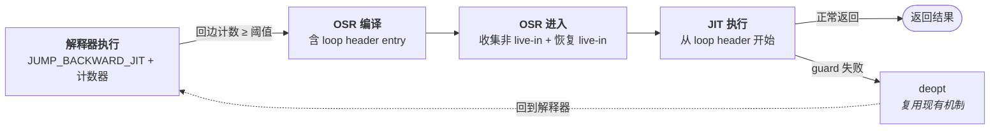

**设计原则**：
- **对称复用**：OSR 进入与现有 deopt 退出互为逆操作，复用 `FrameState`/`DeoptMetadata` 的建模思路
- **整函数编译**：仍然编译完整函数，OSR entry 只是 secondary entry point，不做 trace JIT
- **渐进式**：MVP 只支持简单循环场景，后续逐步扩展

## 功能域规格设计

| 规格项 | 要求 |
|--------|------|
| 回边计数精度 | 每个回边独立计数，精度到单条 `JUMP_BACKWARD` 字节码 |
| OSR 触发延迟 | 从计数器达到阈值到进入 JIT 代码，不超过一次额外的回边迭代 |
| 编译耗时 | OSR 编译应通过预算前置检查拒绝高成本函数（默认 1024 code units），失败后持久化状态避免重试 |
| 兼容性 | **兼容性变更**（V5.7 标注）：`override op(_SPECIALIZE_JUMP_BACKWARD)` 强制所有回边路由到 `JUMP_BACKWARD_JIT`，不依赖 `interp->jit`。当 OSR 关闭（默认配置）且 JIT 已启用时，回边路径从 `_SPECIALIZE_JUMP_BACKWARD → JUMP_BACKWARD_NO_JIT`（stock CPython 行为，`generated_cases.c.h:9298`）变为 `_SPECIALIZE_JUMP_BACKWARD → JUMP_BACKWARD_JIT → _JIT → Ci_OSR_IsEnabled() → false → goto end`。增加的开销：一次 `_JIT` dispatch + 一次 `static inline` atomic load + 条件跳转（~2-3ns）。**必须通过 pyperformance 全套基准验收**——如果检测到回归，备选方案：(a) 恢复上游 `_SPECIALIZE_JUMP_BACKWARD`，改为在 `override op(JUMP_BACKWARD)` 中注入 OSR 计数（回边最终 dispatch 的字节码）；(b) 条件化 override——仅在 `osr_capable` 为 true 时激活路由变更。不影响现有函数级 JIT 编译路径 |
| 降级安全 | OSR 失败时透明回退到解释器继续执行 |


## 核心契约：OSR 控制流与帧所有权

本节定义 OSR 进入/退出过程中所有功能项共享的核心协议。各功能项引用本节，不再重复定义。

### 三态返回约定

> **阅读前提**：解释器字节码主循环通过 `next_instr`（局部寄存器变量）驱动执行，`DISPATCH` 宏从 `next_instr` 取指并跳转。关键宏（定义在 `ceval_macros.h`）：`LOAD_IP(offset)` → `next_instr = frame->instr_ptr + (offset)`（:346-348）；`LOAD_SP()` → `stack_pointer = _PyFrame_GetStackPointer(frame)`（:352-353）；`SAVE_SP()` → `_PyFrame_SetStackPointer(frame, stack_pointer)`（:355-356）。注意 `_PyFrame_GetStackPointer` 在 debug 构建中将 `frame->stackpointer` 置 NULL（pycore_interpframe.h:230-232），因此 `LOAD_SP()` 后不可再次对同一 frame 调用 `LOAD_SP()`。OSR 返回后恢复 caller 状态与 `RETURN_VALUE`（cinder-bytecodes.c:1326-1327）和 `exit_unwind`（generated_cases.c.h:12476-12502）对称。

OSR 进入由  发起，返回 int 三态值：


| 返回值 | 帧状态 | 字节码处理程序责任 |
|--------|--------|------------------|
| 1（完成） | JIT epilogue 已执行 `JITRT_UnlinkFrame` → `PopFrame(F)`，current_frame = caller_frame | `_Py_LeaveRecursiveCallPy(tstate)`，frame = current_frame，`LOAD_SP(); LOAD_IP(frame->return_offset);`（与 RETURN_VALUE 对称，cinder-bytecodes.c:1326-1327），push result，DISPATCH |
| -1（异常） | JIT epilogue 已执行 `JITRT_UnlinkFrame` → `PopFrame(F)`，current_frame = caller_frame，Python 异常已设置 | 见下方两条子路径 |
| ↳ caller 是 Python 帧 | 同上 | `_Py_LeaveRecursiveCallPy(tstate)`，frame = current_frame，`frame->return_offset = 0`（与 exit_unwind 对称，generated_cases.c.h:12484），`LOAD_SP(); next_instr = frame->instr_ptr`（return_offset=0 → 等效 LOAD_IP(0)），goto error |
| ↳ caller 是 entry frame（`FRAME_OWNED_BY_INTERPRETER`） | 同上 | `_Py_LeaveRecursiveCallPy(tstate)`，`tstate->current_frame = frame->previous`，return NULL |
| 0（未尝试） | 帧不变（F 仍是 current_frame） | fall through（goto osr_skip → DISPATCH） |

> **entry frame 子路径说明**：`Ci_EvalFrame`（`interpreter.c:473-508`）在 Python 帧下方插入 `FRAME_OWNED_BY_INTERPRETER` entry frame。顶层函数 OSR 异常时，`current_frame` 正是这个 entry frame。如果直接 `goto error`，`exit_unwind` 的 `assert(frame->owner != FRAME_OWNED_BY_INTERPRETER)`（`bytecodes.c:5493`）会触发 debug 断言。正确做法是复用 `exit_unwind` 中 entry frame 的处理模式（`bytecodes.c:5499-5513`）：离开递归计数 → 恢复 `current_frame` 到 entry frame 的前驱 → return NULL。

> **递归计数契约说明**：`Ci_EvalFrame` 入口调用 `_Py_EnterRecursiveCallTstate(tstate, "")`（`interpreter.c:475`），递增 `tstate->recursion_depth`。正常 RETURN_VALUE 在 `generated_cases.c.h:12273` 调用 `_Py_LeaveRecursiveCallPy(tstate)` 递减；异常 `exit_unwind` 在 `generated_cases.c.h:14122` 调用 `_Py_LeaveRecursiveCallPy(tstate)` 递减。OSR 的 rc=1 和 rc=-1 路径中，JIT epilogue 已 PopFrame 消费了 F——从调用者视角，F 的执行已结束（等同于 RETURN_VALUE 或 exit_unwind），必须在恢复 caller frame 后立即调用 `_Py_LeaveRecursiveCallPy(tstate)` 以匹配 Ci_EvalFrame 入口的 Enter。遗漏会导致 `recursion_depth` 单调递增，长期运行中过早触发 `RecursionError`。

### 帧所有权模型（kNormal）

kNormal 模式下 OSR 不创建新帧——解释器帧 F 贯穿整个 OSR 生命周期。

```
OSR 进入前：F = tstate->current_frame（datastack 上，由解释器创建）
OSR stub：  保持 F 不变，建立 native 栈执行上下文，跳转到 JIT loop header
JIT 执行：  JIT 代码通过 Environ VRegs 访问 F（读写 localsplus[]）
JIT 返回：  JITRT_UnlinkFrame → PopFrame(F)，current_frame = F->previous
JIT deopt： reifyFrame 恢复 F 的 instr_ptr/stackpointer/localsplus → resumeInInterpreter
```

**关键规则**：

1. **F 不被消耗**：performOSR 不调用 PopFrame。F 在 OSR 过程中始终为 `tstate->current_frame`（performOSR 清理非 live-in 时临时 unlink/re-link，但从外部视角看 F 始终是 current_frame），JIT epilogue 负责 PopFrame。

2. **帧链完整性**：F.previous = caller_frame（由解释器设置，OSR 不修改）。tstate->current_frame 在 JIT 执行期间始终为 F，直到 JIT epilogue 的 PopFrame 将其切换为 caller_frame。

3. **deopt 复用现有机制**：OSR JIT 代码与正常 kNormal JIT 代码共享完全相同的 exit/deopt 路径。帧已在 datastack 上，deopt 只需 reifyFrame 恢复解释器状态，不需要帧转换（无 `convertInterpreterFrameFromStackToSlab`）。

4. **非 live-in 清理采用延迟 DECREF 策略**：stub 仅 steal live-in（写 PyStackRef_NULL），不执行任何 DECREF。`performOSR` 在 stub 调用前收集非 live-in 值到临时数组（steal，不 DECREF），stub 返回后（JIT epilogue 已 unlink F）再执行 DECREF。收集阶段不触发 finalizer → entry point 保证在 stub 调用时有效；释放阶段 F 已被 unlink → 满足 frame.cpp:656-658 不变量。stub 和 JIT 代码中均无 DECREF 清零逻辑。

### live-in 引用所有权模型（kNormal + steal 语义）

`performOSR` 收集非 live-in slots 到临时数组（延迟 DECREF 策略），OSR entry stub 对 live-in 执行 steal，使整个 localsplus 进入与 `JITRT_AllocateAndLinkInterpreterFrame` 新分配帧相同的状态。stub 返回后 performOSR 执行延迟的 DECREF（此时 JIT epilogue 已 unlink F，安全）。

| 阶段 | 引用所有者 | 说明 |
|------|-----------|------|
| 解释器执行期间 | F->localsplus[i]（`_PyStackRef`） | 解释器持有强引用 |
| performOSR: 清零非 live-in | performOSR（C++ 代码） | 收集非 live-in `PyStackRef` 到 `deferred_decrefs[]`：`PyStackRef_AsPyObjectSteal()` untag → owned `PyObject*`（steal，写 `PyStackRef_NULL`，不 DECREF）→ stub 返回后 JIT epilogue 已 unlink F → 执行 `Py_XDECREF`。异常时保护当前异常状态（`PyErr_GetRaisedException/SetRaisedException`） |
| OSR stub: steal live-in 到 JIT 寄存器 | JIT 寄存器（steal） | ldr + and 读取 PyStackRef.bits → 写入 JIT spill slot → **str PyStackRef_NULL 到 F->localsplus[i]**（steal：所有权从 F 转移到 JIT 寄存器，无 DECREF） |
| JIT 执行期间 | JIT 寄存器 | JIT refcount_insertion 对 kOwned live-in INCREF（JIT 获得独立引用）。JIT 可安全写入 localsplus（slots 初始为 NULL） |
| JIT 正常 return | JIT 已 DECREF + JITRT_UnlinkFrame 清理 F | `jitFrameClearExceptCode` → `_PyFrame_ClearLocals` 清理 F（slots 为 NULL 或 JIT 写入的值，均可安全 CLEAR） |
| JIT deopt | reifyLocalsplus 回填 F | slots 为 NULL → `Ci_STACK_STEAL` 盲写安全。`releaseRefs` DECREF kOwned 值（消耗 refcount_insertion 的 INCREF） |

**引用所有权转移（steal 语义）**：`performOSR` 收集非 live-in 值到临时数组（延迟 DECREF 策略：steal 到 `deferred_decrefs[]`，不立即 DECREF），OSR entry stub 对 live-in 执行 steal（从 F->localsplus 读取值后写入 `PyStackRef_NULL`），使整个 localsplus 进入与 `JITRT_AllocateAndLinkInterpreterFrame` 新分配帧相同的初始化状态。stub 返回后（JIT epilogue 已 unlink F）执行延迟的 DECREF。原因：`reifyLocalsplus`（deopt.cpp:125-136）对 local slots 使用 `Ci_STACK_STEAL`（盲写，不 DECREF 旧值）和 `Ci_STACK_NULL`（盲写，不 DECREF），假设 slots 初始为 NULL。`releaseRefs`（deopt.cpp:366-380）对 kOwned 执行 DECREF。如果 OSR 复用 F 而不清零 localsplus，deopt 路径会泄漏原始解释器引用或对 borrowed 值执行 DECREF。详见[ADR-6](#adr-6-live-in-使用-steal-语义)。

## 功能项 1：热循环检测

### 功能概述

在解释器的 `JUMP_BACKWARD_JIT` 字节码处理中，增加回边计数器。当某条回边被执行次数达到阈值时，标记该循环为"热循环"，触发 OSR 编译流程。

### 实现思路

在 `JUMP_BACKWARD_JIT` 的 `_JIT` 子操作中插入 OSR 回边计数逻辑。计数器达到阈值时调用 `Ci_OSR_TryOSR` 触发编译和进入。热循环检测与编译/进入完全解耦：功能项 1 只负责计数和触发，不涉及编译状态管理（编译状态由功能项 2 的 `OSRCompileState` 管理）。

#### 背景：字节码分派与 CinderX 覆盖机制

1. **字节码特化（quicken）**：`JUMP_BACKWARD` 首次执行时，`_SPECIALIZE_JUMP_BACKWARD`（`bytecodes.c:2906-2914`）根据 `interp->jit` 将 opcode 改写为 `JUMP_BACKWARD_JIT` 或 `JUMP_BACKWARD_NO_JIT`。改写是永久性的——如果 JIT 启用前已有 `JUMP_BACKWARD` 执行过，它会被 quicken 为 `NO_JIT` 版本，OSR 计数器永远不运行。

2. **CinderX override 机制**：`generated_cases.c.h` 由 `Tools/cases_generator/` 从 `bytecodes.c` + `cinder-bytecodes.c` 自动生成，不能直接编辑。CinderX 通过 `override tier1 op(X)` 覆盖上游定义。关键约束：cases_generator 不支持 `override macro`，只能 `override op`。

3. **`_JIT` 子操作**：`JUMP_BACKWARD_JIT` 宏展开为 `_CHECK_PERIODIC + JUMP_BACKWARD_NO_INTERRUPT + _JIT`。`_JIT` 包含 CPython Tier 2 逻辑，受 `#ifdef _Py_TIER2` 保护。CinderX 不定义 `_Py_TIER2`，`_JIT` 块为空——OSR 逻辑插入在此空块之前，独立于 Tier 2。详见 [ADR-1](#adr-1-osr-不依赖-_py_tier2)。

#### 关键约束：override 路径选择

cases_generator 的 `analyzer.py:906-913` 仅在 `add_op()` 中处理 `override` 注解，`macro_def()`（`parsing.py:514-524`）不接受注解。因此 `override macro(JUMP_BACKWARD_JIT)` 无效——必须改为 `override op(_JIT)`，覆盖 `JUMP_BACKWARD_JIT` 宏的最后一个子操作。OSR 逻辑由 CinderX 自身的运行时配置（`Config::osr_enabled`）控制，独立于 Tier 2。

#### 前提条件：interp->jit 设置

`_SPECIALIZE_JUMP_BACKWARD` 在 `JUMP_BACKWARD` 首次执行时根据 `tstate->interp->jit` 选择路由目标。CPython 上游仅在 `#ifdef _Py_TIER2` 下设置 `interp->jit = true`（`pylifecycle.c:1348`），CinderX 不定义 `_Py_TIER2`，因此默认 `interp->jit = false`。

**解决方案**（两处配套修改，均为**新增代码**）：

1. **设置 `interp->jit = true`**：在 `jit::initialize()`（`pyjit.cpp`）和 `enable_jit_impl()` 中新增 `tstate->interp->jit = true`。当前 CinderX 源码中不存在此设置（因为 CinderX 不定义 `_Py_TIER2`，上游默认 `interp->jit = false`）。此设置确保已 quicken 的 `JUMP_BACKWARD_NO_JIT` opcode 在运行时检查时也能正确路由。

2. **override `op(_SPECIALIZE_JUMP_BACKWARD)`**：覆盖上游特化逻辑，强制将 `JUMP_BACKWARD` 改写为 `JUMP_BACKWARD_JIT`（不依赖 `interp->jit`），确保**未来首次执行**的回边直接进入 JIT 路径。

两处修改互补：override 处理未来首次执行的回边；`interp->jit=true` 处理历史已 quicken 的回边。`interp->jit` 只影响特化路由和 `_JIT` 块内的 opcode 检查，不影响 CinderX 的编译/执行管线。详见 [ADR-8](#adr-8-cinderx-必须设置-interp-jit)。

### 模块调用关系

#### 原始调用路径 vs CinderX 修改后路径

> **CinderX 对热回边路由做了两处 override**（详见 `cinder-bytecodes.c`，L562-578）：
> 1. **`override op(_SPECIALIZE_JUMP_BACKWARD)`**（橙色节点）：覆盖上游特化逻辑，强制将 `JUMP_BACKWARD` 改写为 `JUMP_BACKWARD_JIT`，不依赖 `interp->jit`。上游原始逻辑按 `interp->jit` 分流到 `JUMP_BACKWARD_JIT` 或 `NO_JIT`（灰色节点），但 CinderX 不依赖此条件——直接 override 为始终选 JIT。
> 2. **`override op(_JIT)`**（绿色节点）：覆盖 `JUMP_BACKWARD_JIT` 宏的最后一个子操作，插入 OSR 计数和入口逻辑。

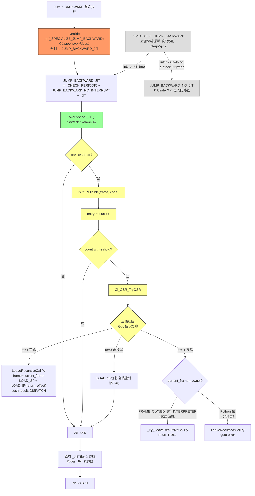

**独立性**：OSR 逻辑位于 `_JIT` 块之前，由 `Config::osr_enabled` 控制，不依赖 `_Py_TIER2`。详见 [ADR-1](#adr-1-osr-不依赖-_py_tier2)。

**性能热路径**：`osr_enabled == false` 或 `count < threshold` 时仅多执行 1 次条件判断 + 1 次 goto，不进入任何函数调用。当 OSR 完全禁用时，开销趋近于零。

计数器存储与 `CodeExtra`（`cinderx/Common/code_extra.h`）关联。当前 `CodeExtra` 结构如下：

```c
// cinderx/Common/code_extra.h — 现有定义
typedef struct CodeExtra {
  union {
    uint64_t calls;          // 函数调用计数
    struct CodeExtra* next;  // 空闲链表指针
  };
} CodeExtra;
```

由于 `CodeExtra` 是 C 结构且使用 union，无法直接扩展字段。方案是通过 `CodeExtra` 旁挂一个独立的回边计数器表，通过 `CodeExtra` 所在的 code extra 分配系统关联。

### 实现设计

#### 回边计数器存储设计

新增独立的 `BackedgeCounters` 结构，通过 code 对象的 extra data 机制旁挂（与 `CodeExtra` 使用相同的 `PyUnstable_Code_GetExtra` / `PyUnstable_Code_SetExtra` 机制，占用不同的 extra index）：

```c
// cinderx/Jit/osr.h — 新增

#define CI_OSR_MAX_BACKEDGES 16

typedef struct BackedgeEntry {
    uint32_t source_index;       // 回边源指令的 code-unit 索引
    uint32_t target_index;       // 循环头目标的 code-unit 索引
                                  // target = source + instructionSizeInCodeUnits - oparg
    uint32_t count;              // 回边计数（free-threading 下用 atomic）
    uint8_t state;               // 热度状态：1=Counting, 3=FailedPermanent(per-code)
                                  // Compiling 是 TryOSR 调用前后的瞬态标记
                                  // FailedPermanent: per-code 级失败，任何 CompilationKey 下都会失败
                                  // 编译状态由 OSRCompileState 管理（见功能项 2）
    uint8_t _pad[3];
} BackedgeEntry;

typedef struct BackedgeCounters {
    uint32_t num_entries;
    BackedgeEntry entries[CI_OSR_MAX_BACKEDGES];
    // per-CompilationKey 编译状态表（溢出策略等详见功能项 2"编译调度与缓存策略"）
    uint32_t num_compile_states;
    OSRCompileState compile_states[CI_OSR_MAX_COMPILE_KEYS];
} BackedgeCounters;

// 获取 code 对象关联的回边计数器表（可能返回 NULL）
BackedgeCounters* Ci_GetBackedgeCounters(PyCodeObject* code);

// 获取或创建回边计数器表
BackedgeCounters* Ci_GetOrCreateBackedgeCounters(PyCodeObject* code);

// 查找指定回边源索引的条目，不存在则创建（达到上限时返回 NULL）
// 新创建的 entry 初始化为 state=Counting(1)，确保首次遇到的新回边立即开始计数
BackedgeEntry* Ci_BackedgeCountersFindOrCreate(
    BackedgeCounters* counters, uint32_t source_idx);
```

**为什么不用 `CodeExtra` 扩展**：见 [ADR-9](#adr-9-为什么不直接扩展-codeextra-结构)。

**free-threading 支持**：`count` 和 `state` 在 free-threading 构建下使用 `_Py_atomic_*` 操作访问。

**code extra 析构**：`BackedgeCounters` 使用身份查找（`uintptr_t`），不持有 `PyObject*` 强引用。通过 `PyUnstable_Eval_RequestCodeExtraIndex(backedgeCountersFreefunc)` 申请独立的 code extra index（与现有 `code_extra_index` 同模式，见 code.cpp:170），注册专用 `freefunc`（仅需 `PyMem_Free`，无需 `Py_XDECREF`）。`resetOSRState()` 在 code 修改时调用（重置状态，保留内存），`backedgeCountersFreefunc` 在 code 对象销毁时调用（释放全部内存）。

#### 回边计数器阈值配置

在 `Config` 结构体中新增（`cinderx/Jit/config.h`）：

```cpp
// cinderx/Jit/config.h — Config 结构体中新增字段
struct Config {
  // ... 现有字段 ...

  // 是否启用 OSR（生产环境默认关闭，需显式启用）
  bool osr_enabled{false};
  // OSR 能力标志——在 jit::initialize() 中设置 kRunning 的同时设为 true。
  // 运行期 enable_jit_impl()（kPaused → kRunning）不设置，保持 false，
  // 因为可能有已 quicken 为 JUMP_BACKWARD_NO_JIT 的回边无法恢复（参见 ADR-8）。
  // Ci_OSR_IsEnabled() 同时检查 osr_enabled 和 osr_capable 作为完整硬门禁。
  bool osr_capable{false};
  // 触发 OSR 编译的回边计数阈值
  uint32_t osr_backedge_threshold{2000};
  // OSR 编译预算阈值（字节码 code units 数量上限）
  // 超过此大小的函数不尝试 OSR 编译
  uint32_t osr_compile_budget_code_units{1024};
  // OSR 编译耗时告警阈值（毫秒）
  // 超过此值的编译会被记录但不阻塞结果使用
  uint32_t osr_compile_warn_threshold_ms{50};
};
```

在 `initFlagProcessor()`（`cinderx/Jit/pyjit.cpp:269`）中注册对应命令行选项：

```cpp
// cinderx/Jit/pyjit.cpp — initFlagProcessor()
flag_processor.addOption(
    "osr-enabled",
    "CINDERX_OSR_ENABLED",
    getMutableConfig().osr_enabled,
    "Enable or disable OSR (On-Stack Replacement)");

flag_processor.addOption(
    "osr-backedge-threshold",
    "CINDERX_OSR_BACKEDGE_THRESHOLD",
    getMutableConfig().osr_backedge_threshold,
    "Number of backedge executions before triggering OSR compilation");

flag_processor.addOption(
    "osr-compile-budget",
    "CINDERX_OSR_COMPILE_BUDGET",
    getMutableConfig().osr_compile_budget_code_units,
    "Max code object size (in code units) to attempt OSR compilation");
```

#### \_SPECIALIZE_JUMP_BACKWARD 覆盖 + \_JIT op 覆盖

**两处覆盖**：OSR 需要两个 `override op`，确保热回边正确路由到 OSR 计数路径。

**覆盖 1：`override op(_SPECIALIZE_JUMP_BACKWARD)`**

覆盖上游 `_SPECIALIZE_JUMP_BACKWARD`（`bytecodes.c:2906-2914`），强制路由到 `JUMP_BACKWARD_JIT`，不依赖 `interp->jit`：

```c
// cinderx/Interpreter/3.14/cinder-bytecodes.c
// 上游根据 interp->jit 选择 JIT/NO_JIT，CinderX 始终选 JIT
override tier1 op(_SPECIALIZE_JUMP_BACKWARD, (--)) {
    if (this_instr->op.code == JUMP_BACKWARD) {
        this_instr->op.code = JUMP_BACKWARD_JIT;
        next_instr = this_instr;
        DISPATCH_SAME_OPARG();
    }
}
```

**覆盖 2：`override op(_JIT)`**

覆盖上游 `_JIT` op（`Python/bytecodes.c:2917`），在 Tier 2 逻辑**之前**插入 OSR 回边计数检查。OSR 逻辑独立于 `_Py_TIER2` 宏保护的 Tier 2 代码。

**关键约束**：

- **SetStackPointer/GetStackPointer 配对**：`_PyFrame_SetStackPointer` 断言 `frame->stackpointer == NULL`，`_PyFrame_GetStackPointer` 断言 `frame->stackpointer != NULL`（debug 构建下额外清除为 NULL）。每条离开 if 块的路径都必须执行一次 `GetStackPointer`，否则下次循环迭代的 `SetStackPointer` 会 assert fail。
- **BackedgeEntry 指针生命周期**：`Ci_OSR_TryOSR` 调用前必须重置 entry 状态。JIT epilogue 的 `JITRT_UnlinkFrame` → `PopFrame` 可能触发 finalizer → `codeDestroyed` → 释放 `BackedgeCounters`，返回后 entry 指针可能悬空。提前重置后即使 entry 失效，状态已正确持久化。
- **递归计数**：`Ci_EvalFrame` 入口调用 `EnterRecursiveCall`，JIT epilogue `PopFrame` 后必须配对 `LeaveRecursiveCallPy`（与 `RETURN_VALUE` L12273、`exit_unwind` L14122 对称）。
- **顶层函数异常**：如果 `frame->owner == FRAME_OWNED_BY_INTERPRETER`（`Ci_EvalFrame` 插入的 entry frame），不能 `goto error`——`exit_unwind` 的 `assert(frame->owner != FRAME_OWNED_BY_INTERPRETER)`（bytecodes.c:5493）会触发 debug 断言。复用 exit_unwind 中 entry frame 的处理：`LeaveRecursiveCallPy` → 恢复 `current_frame` → `return NULL`。
- **非顶层函数异常**：必须同步 caller_frame 的 `next_instr` 和 `stack_pointer`（error 路径用 `next_instr-1` 做 traceback/监控），然后 `goto error`。

```c
// cinderx/Interpreter/3.14/cinder-bytecodes.c
override tier1 op(_JIT, (--)) {
    if (!Ci_OSR_IsEnabled()) goto osr_skip;       // static inline, ~1-2ns

    code = _PyFrame_GetCode(frame);
    SAVE_SP();                              // _PyFrame_SetStackPointer(frame, stack_pointer)

    if (!Ci_OSR_IsEligible(frame, code)) goto restore;
    counters = Ci_OSR_GetBackedgeCounters(code) ?? Ci_OSR_GetOrCreateBackedgeCounters(code);
    if (counters == NULL) goto restore;

    entry = Ci_OSR_BackedgeCountersFindOrCreate(counters, source_idx);
    if (entry == NULL || entry.state != Counting) goto restore;

    entry.count++;
    if (entry.count < threshold) goto restore;

    // 达到阈值——提前重置 entry（TryOSR 后 entry 可能悬空）
    Ci_OSR_BackedgeSetState(entry, Counting);
    Ci_OSR_BackedgeSetCount(entry, 0);
    osr_rc = Ci_OSR_TryOSR(tstate, frame, this_instr, oparg, &osr_result);
    // entry 指针此后不可用

    switch (osr_rc):
      case 1:  // OSR 完成，帧已清理（与 RETURN_VALUE 对称）
        _Py_LeaveRecursiveCallPy(tstate);
        frame = tstate->current_frame;
        LOAD_SP();                           // stack_pointer = _PyFrame_GetStackPointer(frame)
        LOAD_IP(frame->return_offset);       // next_instr = frame->instr_ptr + return_offset
        push(osr_result); DISPATCH();
      case -1: // OSR 异常，帧已清理（与 exit_unwind 对称）
        _Py_LeaveRecursiveCallPy(tstate);
        frame = tstate->current_frame;
        if (frame->owner == FRAME_OWNED_BY_INTERPRETER):
          tstate->current_frame = frame->previous; return NULL;
        else:
          frame->return_offset = 0;            // 与 exit_unwind 对称（generated_cases.c.h:12484）
          LOAD_SP();                           // stack_pointer = _PyFrame_GetStackPointer(frame)
          next_instr = frame->instr_ptr;       // return_offset=0 → 等效 LOAD_IP(0)
          goto error;
      case 0:  // OSR 未尝试，帧不变
        // ★ SAVE_SP() 已保存，但 LOAD_SP() 会 debug-置 NULL。
        //   rc=0 帧 F 未改变，直接 LOAD_SP() 恢复即可
        LOAD_SP();

  restore:
    // ★ SAVE_SP() 已保存，LOAD_SP() 从 frame 恢复。
    //   注意：debug 构建中 LOAD_SP() 会将 frame->stackpointer 置 NULL（pycore_interpframe.h:230-232），
    //   此处是首次 LOAD_SP()，安全。
    LOAD_SP();

  osr_skip:
    // 原有 _JIT Tier 2 逻辑（#ifdef _Py_TIER2 保护，完全不变）
}
```

**C ABI 要求**：`interpreter.c` 编译为 C（`CMakeLists.txt:332-346`），不能使用 C++ namespace（`jit::`）。所有 OSR 函数通过 `extern "C"` 接口暴露，遵循现有模式（参见 `compiled_function.h:10-65` 中 `isJitCompiled()` 的声明方式）。

#### C/C++ 边界设计

##### OSR 快速路径：static inline 而非 extern "C" 函数

`Ci_OSR_IsEnabled()` 在热路径中（每次回边都调用）需要最低开销。旧方案将其声明为 `extern "C"` 函数（实现在 `osr.cpp` 中），每次回边多一次跨 C/C++ 函数调用（~5-10ns PLT 开销）。改进为 `static inline` 函数读取 C 可见的全局 `int` flag：

- **全局 flag**：`cinderx_osr_enabled`、`cinderx_osr_capable`、`cinderx_osr_state`（`int` 类型，定义在 `osr.cpp` 中），由 C++ 侧在配置变更时同步（`initialize()`/`enable_jit_impl()`/`pause`/`resume`/`finalize`）
- **原子 API 选择**：使用 CPython 自带的 `_Py_atomic_load_int_relaxed` / `_Py_atomic_store_int_relaxed`（`cpython/pyatomic.h:322,391`）。不使用 `_Atomic(bool) + __atomic_load_n` 组合——`_Atomic(bool)` 在 C++ 中映射为 `std::atomic<bool>`，而 `__atomic_load_n` 是 GCC C 内建函数，不能用于 `std::atomic<bool>*`
- **性能保障**：OSR 关闭时（默认生产配置），热路径开销 = 1 次 L1 缓存 atomic load + 1 次条件跳转（~1-2ns）

##### Opaque 指针模式

`BackedgeCounters` 和 `BackedgeEntry` 对 C 代码完全 opaque——通过 `typedef struct ..._s` 前向声明和访问器函数操作，避免 C/C++ 结构布局不兼容问题。C++ 侧实现使用 `reinterpret_cast` 在 opaque 类型与真实 `jit::BackedgeCounters`/`jit::BackedgeEntry` 之间转换。

##### 异常状态不变量

调用 `Ci_OSR_TryOSR` 时不可能有 pending exception：`JUMP_BACKWARD` 只在循环体末尾正常执行时到达，如果有 pending exception，循环体早已通过 `ERROR_NO_POP`/`error` 路径跳转到异常处理器。编译失败异常在 `compileFunctionWithOSR` 中立即清除，不传播到调用者。

##### OSR C API 概要

```c
// osr_capi.h — C/C++ 兼容头文件，interpreter.c 通过此接口调用 OSR 功能

// 全局 flag（定义在 osr.cpp，static inline Ci_OSR_IsEnabled 读取）
extern int cinderx_osr_enabled, cinderx_osr_capable, cinderx_osr_state;

static inline bool Ci_OSR_IsEnabled(void) {
    if (!_Py_atomic_load_int_relaxed(&cinderx_osr_enabled)) return false;
    if (!_Py_atomic_load_int_relaxed(&cinderx_osr_capable)) return false;
    if (_Py_atomic_load_int_relaxed(&cinderx_osr_state) != 1) return false;
#ifndef CINDER_AARCH64
    return false;   // MVP 仅 aarch64
#endif
#ifdef Py_GIL_DISABLED
    return false;   // MVP 不支持自由线程
#endif
    return true;
}

// 门禁与计数器
bool Ci_OSR_IsEligible(frame, code);
typedef opaque Ci_BackedgeCounters, Ci_BackedgeEntry;
Ci_BackedgeCounters* GetBackedgeCounters(code);
Ci_BackedgeCounters* GetOrCreateBackedgeCounters(code);
Ci_BackedgeEntry*    BackedgeCountersFindOrCreate(counters, source_idx);
// 访问器：GetCount/GetState/SetCount/SetState

// OSR 进入尝试（三态返回：1=完成, 0=未尝试, -1=异常）
int Ci_OSR_TryOSR(tstate, frame, this_instr, oparg, out_result);
void Ci_OSR_ResetState(code);
```

```cpp
// osr.cpp — C++ 侧 extern "C" 实现（所有函数均为简单转发到 jit:: namespace）
// Ci_OSR_TryOSR → jit::Ci_TryOSR
// Ci_OSR_IsEligible → jit::isOSREligible
// Ci_OSR_ResetState → jit::resetOSRState
// BackedgeCounters/Entry 访问器 → reinterpret_cast 后读写 jit:: 类型字段
```

> 三态返回约定、帧所有权模型和 live-in 引用所有权详见[核心契约](#核心契约osr-控制流与帧所有权)章节。

### 增量 SR 清单

| SR 编号 | 描述 |
|---------|------|
| SR-OSR-001 | `BackedgeCounters` 结构和 code extra 旁挂机制 |
| SR-OSR-002 | `JUMP_BACKWARD_JIT` 中植入回边计数逻辑 |
| SR-OSR-003 | `Config` 中新增 OSR 配置字段及命令行解析 |
| SR-OSR-004 | `isOSREligible()` 资格门禁实现（generator/异常块/free-threading/非空栈/非函数帧/已逃逸帧检查） |

### 实现接口设计

本功能项为解释器内部逻辑改造，不暴露 Python 层 API。

#### 实现接口定义

**OSR eligibility 门禁**（`isOSREligible`）在回边计数快速路径中调用，拒绝不支持的帧形态：

| 拒绝条件 | 检查方式 | 设计理由 |
|---------|---------|---------|
| generator/coroutine/async generator | `code->co_flags` 位检查 | 生成器帧生命周期由迭代器控制，OSR 无法安全接管 |
| free-threading 构建 | 编译期 `#ifdef Py_GIL_DISABLED` | MVP 不支持自由线程 |
| 非 kNormal 帧模式 | `getConfig().frame_mode != kNormal` | 仅 kNormal 帧有稳定的 datastack 布局 |
| 非空操作数栈 | `frame->stackpointer != _PyFrame_Stackbase(frame)`（栈底为 `localsplus + co_nlocalsplus`，pycore_interpframe.h:101） | MVP 不支持循环头有栈上值；因此 `OSRLiveIn.stack_index` 始终为 -1 |
| 非函数帧 | `PyFunction_Check(f_funcobj)` | `performOSR` 需要 `PyFunctionObject` 作为编译入口 |
| 已逃逸帧 | `frame_obj != NULL` | JIT 执行可能修改 locals/instr_ptr，与用户持有的 `PyFrameObject` 不一致 |

**补充说明**：
- 内联帧不需要检查：kNormal 模式已全局禁用 inliner（`pyjit.cpp:731-732`），所有 kNormal 编译产物天然不含内联帧
- 异常处理块不在 `isOSREligible` 中检查（3.14 无 `block_stack` 字段），而在编译期 `markOSREntries()` 中拒绝

```c
// cinderx/Jit/osr.h — C 接口概要
int isOSREligible(frame, code);
BackedgeCounters* Ci_GetBackedgeCounters(code);
BackedgeCounters* Ci_GetOrCreateBackedgeCounters(code);
BackedgeEntry* Ci_BackedgeCountersFindOrCreate(counters, source_idx);
int Ci_OSR_TryOSR(tstate, frame, backedge_instr, oparg, out_result);  // 三态: 1=完成, 0=未尝试, -1=异常
```

### 功能规格设计

| 规格项 | 规格 |
|--------|------|
| 默认启用 | 生产环境默认关闭（`osr_enabled{false}`），需显式启用 |
| 资格检查 | `isOSREligible()` 在热路径第一层拒绝不支持的帧形态 |
| 计数器原子性 | free-threading 下使用 `_Py_atomic_*` 操作 |
| 阈值范围 | 100 ~ 100000 |
| 最大回边数 | 每个函数 `CI_OSR_MAX_BACKEDGES`（16） |
| 内存开销 | 无回边的函数零开销；有回边的函数额外 ~320 字节（含 target_index） |
| 计数器溢出 | 阈值检查使用 `>=`，溢出后仍能触发 |

### DFX 分析

#### 可靠性分析

##### FMEA 分析

| 失效模式 | 影响 | 原因 | 检测手段 | 补偿措施 |
|---------|------|------|---------|---------|
| 回边计数器溢出 | 误触发 OSR 或不触发 | uint32 溢出回绕到 0 | 阈值上限约束 | 阈值检查使用 `>=` |
| BackedgeCounters 并发访问 | 数据竞争 | free-threading 下多线程同时执行同一函数 | TSAN | count/state 使用 `_Py_atomic_*` |
| BackedgeCounters 内存泄漏 | 内存泄漏 | code 销毁时未释放计数器 | ASAN | 在 `jit::codeDestroyed()` 中清理 |

#### 可服务性分析

- 通过 `-X osr-enabled=false` 关闭 OSR
- 通过 `-X osr-backedge-threshold=N` 调整阈值
- OSR 编译日志复用现有 `JIT_LOG` 宏，增加 `[OSR]` 前缀

#### 安全设计检查

##### 安全设计确认

回边计数器不涉及用户输入处理，不引入新的攻击面。

##### 敏感操作检查

不涉及。

#### 可用性/性能分析

**性能开销分析**：

回边计数引入的开销 = 1 次 `CodeExtra` 指针读取 + 1 次整数递增 + 1 次条件判断，约 2~5 ns/次回边。在典型热循环中（每次迭代含微秒级操作），该开销可忽略（<0.1%）。

**惰性初始化开销**：仅首次遇到回边时触发一次 `Ci_GetOrCreateBackedgeCounters()` 分配，后续访问为指针读取。

### 影响点列表

| 模块 | 文件 | 影响描述 |
|------|------|---------|
| OSR 公共 | `cinderx/Jit/osr.h`（新增） | BackedgeCounters 结构定义和 C 接口 |
| 解释器 | `cinderx/Interpreter/3.14/cinder-bytecodes.c` | 两处 override：（1）`override op(_SPECIALIZE_JUMP_BACKWARD)` 强制路由到 `JUMP_BACKWARD_JIT`（不依赖 `interp->jit`）；（2）`override op(_JIT)` 在 Tier 2 逻辑之前插入 OSR 回边计数检查。`override` 注解仅对 `inst`/`op` 有效。`generated_cases.c.h` 为自动生成文件，不直接编辑 |
| JIT 初始化 | `cinderx/Jit/pyjit.cpp:jit::initialize()` | 正常启动路径（`-X jit`）：**新增** `tstate->interp->jit = true`（当前源码中不存在此设置，需新增），与 `Config::state = kRunning` 同步，同时设置 `osr_capable = true`。此路径在 `getMutableConfig() = Config{}` 重置后、`state = kRunning` 之前完成 |
| JIT 重启用 | `cinderx/Jit/pyjit.cpp:enable_jit_impl()` | 运行期重新启用（`kPaused → kRunning`）：**新增** `tstate->interp->jit = true`（同上，需新增），但**不**设置 `osr_capable`（保持 false），因为可能有已 quicken 的 `JUMP_BACKWARD_NO_JIT` 回边 |
| 配置 | `cinderx/Jit/config.h` | `Config` 结构体新增 `osr_enabled`、`osr_capable`、`osr_backedge_threshold`、`osr_compile_warn_threshold_ms` |
| 配置 | `cinderx/Jit/pyjit.cpp:initFlagProcessor()` | 注册 OSR 命令行选项 |

### 分配需求

| 需求编号 | 描述 |
|---------|------|
| REQ-OSR-001 | 系统应能在解释器执行过程中检测热循环 |

---

## 功能项 2：OSR 编译（Loop Header Secondary Entry）

### 功能概述

当热循环被检测到后，编译包含 loop-header secondary entry 的完整函数 JIT 代码。OSR entry 与正常函数入口共享后端优化和代码生成，区别仅在于入口点的帧状态初始化。

### 实现思路

复用现有编译管线，不修改 `Compiler::Compile()` 签名。OSR entry 信息通过 `hir::Preloader` 传递——`Preloader` 是 `Compile()` 的唯一输入参数，且天然与特定函数绑定，是传递 OSR entry 偏移最自然的位置。

### 模块调用关系

#### 原始编译链路（函数级 JIT）

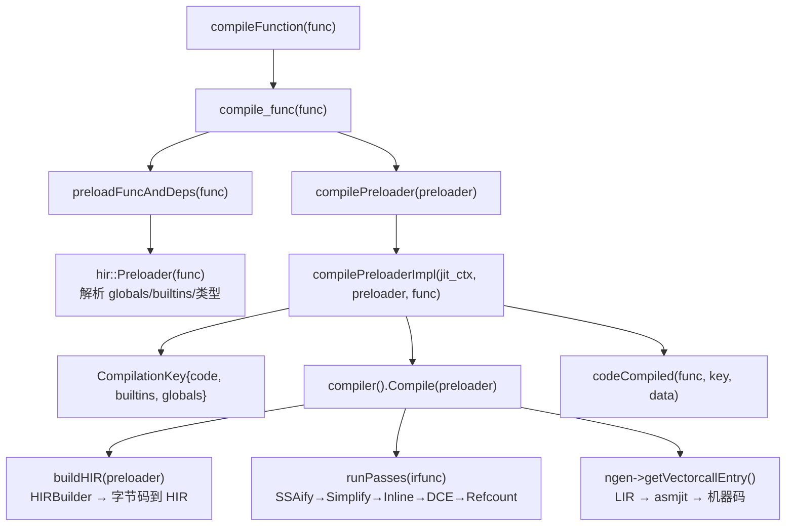

#### OSR 编译链路（新增，复用 Compile）

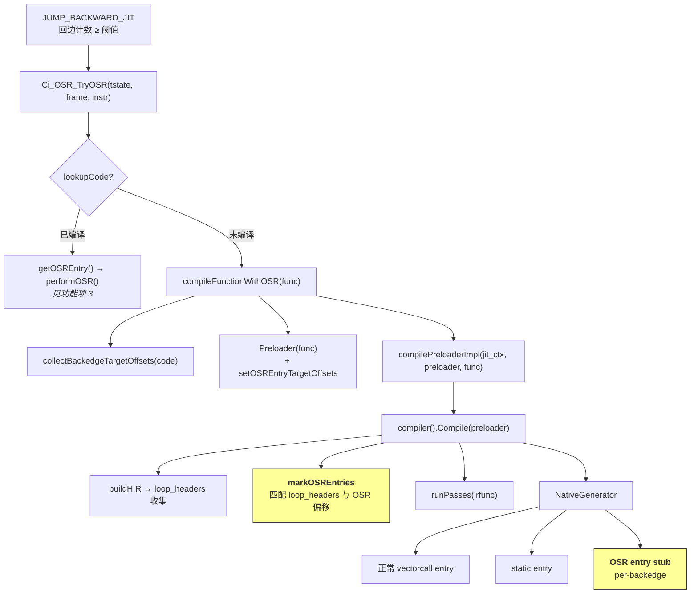

**关键差异**：OSR 编译与正常编译走同一条 `compilePreloaderImpl` → `Compile(preloader)` 路径。唯一区别是 `Preloader` 多携带了 `osr_entry_offsets_` 数据，`Compile()` 内部据此额外生成 OSR entry stub。所有现有调用点（`compileFunction()`、批量编译等）的 `Preloader` 中 `osr_entry_offsets_` 为空，行为完全不变。

### 实现设计

#### 方案要点

1. **复用编译管线**：OSR entry 信息通过 `Preloader` 传递，不修改 `Compile()` 签名，不影响现有调用点
2. **专用编译入口**：新增 `compileFunctionWithOSR()`，走标准 `preload()` 路径获取完整 Preloader，`IsolatedPreloaders` RAII 隔离编译状态
3. **HIR 标注 + 三阶段元数据**：`markOSREntries()` 标注 loop-header secondary entry，编译期拒绝非 kOwned live-in；OSRMetadata 使用与 DeoptMetadata 相同的三阶段机制（占位→虚拟寄存器→regalloc 回填 PhyLocation）
4. **per-backedge Stub**：NativeGenerator 为每个回边生成独立 OSR entry stub，共享正常 JIT 代码缓冲区和 CodeRuntime
5. **同步编译 + 失败持久化**：首次达到阈值时同步编译，高成本函数通过预算前置检查拒绝，失败后持久化状态避免重试

#### 编译数据流

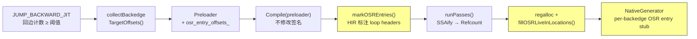

#### OSR 编译入口与数据传递

##### Preloader 扩展

在 `hir::Preloader`（`cinderx/Jit/hir/preload.h`）中新增 OSR 相关字段：

```cpp
// cinderx/Jit/hir/preload.h — Preloader 扩展

class Preloader {
 public:
  // ... 现有方法不变 ...

  // OSR entry 偏移列表（BCOffset，字节偏移）。为空表示普通函数编译。
  const std::vector<BCOffset>& osrEntryTargetOffsets() const;

  // 接受 BCIndex 列表（循环头目标索引），内部转为 BCOffset
  void setOSREntryTargetOffsets(std::vector<BCIndex> indices);

 private:
  std::vector<BCOffset> osr_entry_offsets_;
};
```

**BCIndex vs BCOffset 索引单位**：解释器侧使用 `BCIndex`（code-unit 索引），HIR/Compiler 侧使用 `BCOffset`（字节偏移），通过 `BCIndex::asOffset()` 转换。详见 [ADR-10](#adr-10-解释器侧-vs-编译器侧的索引单位)。

**设计考量**：Preloader 是 `Compile()` 的唯一参数，OSR 信息作为其属性最自然。非 OSR 场景下 `osr_entry_offsets_` 为空，`Compile()` 行为完全不变，不修改签名、不引入全局状态。

**回边源 vs 循环头目标**：解释器按回边源位置索引（`BackedgeEntry::source_index`），编译和 `OSRMetadata::target_offset` 使用跳转目标（`BackedgeEntry::target_index`）。`collectBackedgeTargetOffsets()` 返回目标偏移，与 HIR loop header 匹配。已 quicken 字节码的透明处理见 [ADR-10](#adr-10-解释器侧-vs-编译器侧的索引单位)。

##### compileFunctionWithOSR 实现

在 `cinderx/Jit/pyjit.cpp` 中新增 OSR 专用编译入口。

**关键约束**：
- 必须复用现有 `preload()` 路径来获取完整填充的 `Preloader`（globals/builtins 缓存、注解、frame reifier、静态调用目标等），不能创建空的 `Preloader` 直接调用 `compilePreloaderImpl()`
- 必须使用 `IsolatedPreloaders` RAII 保护，防止 OSR 运行时路径污染全局 `PreloaderManager`（与 `compile_func()` 对称）
- `preload()` 可能执行 Python 代码（运行时加载），期间可能发生 `func.__code__` 被修改、JIT uncompile、递归重入——需 pin + revalidate
- preload 失败时必须清除异常：OSR 从字节码处理程序调用，字节码处理程序无法处理传播的异常（rc=0 路径继续正常字节码执行，若有活跃异常会导致未定义行为）
- 不需要显式禁用 inliner：kNormal 模式已全局禁用（`pyjit.cpp:731-732`），OSR 的单帧假设自动成立

```
// cinderx/Jit/pyjit.cpp — compileFunctionWithOSR 实现
Result compileFunctionWithOSR(func):
    pinned_code = func->func_code

    IsolatedPreloaders ip           // RAII 隔离 PreloaderManager
    preloader = preload(func)       // 标准预加载路径
    if preloader == nullptr:
        // preload 失败——清除异常（字节码处理程序无法处理）
        PyErr_Clear()
        return CANNOT_SPECIALIZE

    if func->func_code != pinned_code:
        return CANNOT_SPECIALIZE    // code 被 preload 期间修改

    // OSR entry 偏移已在 makePreloader 中通过 collectBackedgeTargetOffsets 注入
    // compilePreloaderImpl → Compile(preloader) 内部读取 osrEntryTargetOffsets
    return compilePreloaderImpl(jit_ctx, *preloader, func)
```

`compilePreloaderImpl()` 本身不需要任何修改——它调用 `jit_ctx->compiler().Compile(preloader)`，`Compile()` 内部从 `preloader->osrEntryTargetOffsets()` 读取 OSR 信息。

#### 编译管线扩展

##### Compiler::Compile() 内部的 OSR 处理

`Compiler::Compile()` 签名不变。在 HIR 构建完成后、pass 管线之前，增加一步 `markOSREntries`：

```
// cinderx/Jit/compiler.cpp — Compiler::Compile() OSR 扩展
Compile(preloader):
    irfunc = BuildHIR(preloader, ...)
    if preloader.osrEntryTargetOffsets() 非空:
        irfunc->markOSREntries(osr_offsets)    // 标记 HIR 中的 OSR entry points
    runPasses(irfunc, kAll)                     // 现有管线不变
    // 代码生成不变（codegen 内部读取 OSR entry 标记）
```

##### HIR 层面的 OSR Entry 标注

HIR builder 已在 `buildBody()` 中识别 loop headers（`cinderx/Jit/hir/builder.cpp:742` `loop_headers` 集合）。`markOSREntries()` 在构建完成后遍历 `loop_headers`，匹配传入的偏移列表，为匹配的 loop header basic block 打标记：

`markOSREntries()` 在 HIR 构建完成后遍历 `loop_headers` 集合，匹配传入的偏移列表，为匹配的 loop header basic block 打标记。**编译期异常处理检查**：拒绝 loop header 落在 `co_exceptiontable` protected range 内的 OSR entry（3.14 无 `block_stack` 字段，运行时无法判断异常处理状态）。

```cpp
// cinderx/Jit/hir/function.h — Function 类扩展
void markOSREntries(const std::vector<BCOffset>& offsets);
bool isOSREntry(const BasicBlock* block) const;
// 内部：std::unordered_set<const BasicBlock*> osr_entries_;
```

#### OSR Entry Stub 的代码生成

**什么是 OSR Entry Stub**

Stub 是一段短小的机器码片段（50~200 字节），充当解释器与 JIT 代码之间的**桥梁**——它将 C 函数调用约定（`osr_entry_fn(OSRState*)`）转换为 JIT 内部期望的寄存器/栈状态。

**为什么需要 stub**：正常 JIT 入口走 vectorcall ABI（`func, args, nargs`），prologue 调用 `JITRT_AllocateAndLinkInterpreterFrame` 在 datastack 上分配帧（清零 localsplus）、设置 Environ VRegs。OSR 从循环头进入，不走函数入口——帧 F 已在 datastack 上（`tstate->current_frame`），不需要分配帧，但需要：(1) 建立 native 栈执行上下文，(2) 恢复 live-in 到 JIT 物理位置。Stub 只负责三项工作：
1. 建立与 kNormal JIT prologue 完全一致的 native 栈布局（spills + callee-saved）
2. 设置 Environ VRegs（tstate、func、interpreter_frame）到 regalloc 分配的位置
3. Steal live-in（读取值 + 写 PyStackRef_NULL）并恢复到 JIT 物理位置

**为什么每个回边需要独立的 stub**：不同循环头的 live-in 集合不同（循环 A 用变量 i/total，循环 B 用 j/result），JIT 编译器为每个 live-in 分配的物理位置（寄存器 X14、栈槽 FP-8 等）也不同。每个 stub 硬编码了"从 F->localsplus[X] 加载 → 写入 PhyLocation Y"的映射。所有 stub 共享同一个代码缓冲区和 `CodeRuntime`，不增加编译缓存维度。

**与正常 prologue 的关系**：stub 必须复制 kNormal JIT prologue 的 native 栈布局（spills + callee-saved），因为后续 deopt exit 和 epilogue（`translateEpilogueEnd`）从固定的 FP 相对偏移读写数据。布局不一致会导致 deopt 恢复错误值。

对于每个 OSR entry basic block，`NativeGenerator`（`cinderx/Jit/codegen/gen_asm.h`）额外生成一个入口 stub。

**架构限制**：MVP 仅支持 aarch64。`Ci_OSR_IsEnabled()` 在非 aarch64 架构上返回 false（通过 `#ifndef CINDER_AARCH64` 保护），OSR 编译和入口 stub 生成不会触发。x86_64 的 stub 需要处理不同的 callee-saved 寄存器集、prologue 布局和 deopt trampoline 约定，作为 Phase 2 的扩展点。

**Stub 接口契约**（编译期定义，运行时由功能项 3 调用）：

```
调用签名：PyObject* osr_entry_fn(OSRState* state)
输入：
  state->tstate  = PyThreadState*
  state->frame   = F（解释器帧，已在 datastack 上）
  state->osr_meta = OSRMetadata*（live-in 映射 + Environ VReg 位置 + 栈布局参数）

Stub 内部操作（由 NativeGenerator 生成）：
  1. prologue: stp fp/lr, sub sp（与 kNormal JIT prologue 栈布局一致）
     保存 callee-saved（仅 env_.changed_regs & CALLEE_SAVE_REGS）
  2. 设置 Environ VRegs: tstate/frame/func → regalloc 分配的 PhyLocation
     PhyLocation 分派：REG → mov, STACK → str
  3. Steal live-in: 从 F->localsplus[localsplus_index] 读取 → 写入 destination PhyLocation
     写 PyStackRef_NULL 到源 slot（steal 语义，无 DECREF）
     PyStackRef → PyObject* 转换：AND ~Py_TAG_REFCNT（非 free-threading）
  4. 跳转: b .loop_header_N

返回：JIT epilogue 通过 ret 返回 PyObject*（非 NULL = 正常, NULL = 异常）
```

Stub 的运行时行为细节（帧安全、寄存器选择、延迟 DECREF 交互）见[功能项 3：OSR ABI 与 Stub 运行时行为](#osr-abi完整的调用返回约定)。

**编译期信息来源**（写入 OSRMetadata）：

| OSRMetadata 字段 | Stub 使用方式 | 来源 |
|------------------|-------------|------|
| `resume_frame_total_size` | `sub sp, sp, #size` | FrameInfo::size()（gen_asm.h:120） |
| `resume_header_and_spill_size` | callee-saved 保存偏移 | FrameInfo::header_and_spill_size() |
| `resume_saved_regs` | 哪些 callee-saved 需保存 | env_.changed_regs & CALLEE_SAVE_REGS |
| `tstate_location`/`func_location`/`frame_location` | Environ VReg 目标 PhyLocation | regalloc 后回填 |
| `live_ins[].localsplus_index` | live-in 源 slot | extractOSRLiveIns（从 FrameState 反查） |
| `live_ins[].destination` | live-in 目标 PhyLocation | regalloc 后回填 |
| `entry_point_offset` | stub 代码在代码缓冲区中的偏移 | NativeGenerator 生成时确定 |

#### OSRMetadata 结构

OSRMetadata 记录"哪些值需要恢复"、"从解释器帧的哪个 slot 来"、"放到 JIT 的哪个物理位置"。JIT 编译器为每个活跃值分配了特定的物理位置，OSR entry stub 必须将值放到**确切物理位置**。

**与 DeoptMetadata 的对称关系**：`DeoptMetadata` 记录"JIT → 解释器"映射，`OSRMetadata` 记录反向映射。两者使用相同的 `PhyLocation` 建模，确保双向映射一致。`OSRMetadata` 存储在 `CodeRuntime` 中，生命周期与 `CompiledFunction` 一致。

##### 结构定义

```cpp
// cinderx/Jit/osr.h — C++ 部分

struct OSRLiveIn {
  int localsplus_index{-1};       // 源：f_localsplus[] 索引，-1=不在 localsplus
  int stack_index{-1};            // 源：操作数栈索引，-1=不在栈上
  PhyLocation destination;        // 目标：JIT 物理位置（regalloc 后回填）
  ValueKind value_kind;           // 值类型（MVP 仅 kObject）
  RefKind ref_kind;               // 引用类型（MVP 仅 kOwned，见 ADR-5）
  bool reconstructible{true};     // 可从解释器帧重建：kObject && kOwned && 有源 slot
  bool is_phi{false};             // 是否 SSA phi 节点
  Register* hir_reg;              // 编译期临时：关联 HIR Register*（不写入最终产物）
};

struct OSRMetadata {
  BCOffset target_offset;                         // 循环头字节码偏移
  FrozenList<OSRLiveIn> live_ins;                  // live-in 映射列表
  int owned_ref_count{0};                          // kOwned live-in 计数
  ptrdiff_t entry_point_offset;                    // stub 代码偏移

  // Environ VReg 物理位置（regalloc 后确定，供 stub 设置 tstate/func/frame）
  PhyLocation tstate_location;
  PhyLocation func_location;
  PhyLocation frame_location;

  // Stub prologue 帧布局参数（必须与 kNormal JIT prologue 一致，见 Stub 章节）
  int32_t resume_frame_total_size;                 // FrameInfo::size()
  int32_t resume_header_and_spill_size;            // FrameInfo::header_and_spill_size()
  PhyRegisterSet resume_saved_regs;                // env_.changed_regs & CALLEE_SAVE_REGS

  void* entryPoint(const CompiledFunction& cf) const;
  bool allReconstructible() const;
};
```

##### 构建时机与三阶段流水线

OSRMetadata 不能一步构建，因为物理位置在 HIR 阶段不存在。采用与 `DeoptMetadata` 相同的三阶段机制：

1. **HIR 阶段（markOSREntries）**：标记 loop header 为 OSR entry，插入 `OSREntry` 锚点（`DeoptBase` 子类），仅做轻量级拒绝检查。**不能在此阶段捕获 `Register*`**——SSA pass 会重命名寄存器，后续 pass 会修改引用所有权
2. **SSA/Refcount 后（extractOSRLiveIns）**：从 `OSREntry` 锚点的稳定 `FrameState` 提取 live-in `Register*` + `RefKind` + `ValueKind`（通过 `DeoptBase::live_regs()`），线性扫描 `FrameState.localsplus[]`/`stack[]` 反查源 slot。`destination` 留空占位
3. **regalloc 后（codegen 回填）**：`kOSREntry` pseudo instruction 携带 live-in HIR 寄存器作为 LIR operand，经 regalloc 后由 `fillOSRLiveInLocations()` 回填 `PhyLocation`

```
// cinderx/Jit/compiler.cpp — 三阶段元数据构建流水线
Compile(preloader):
    irfunc = BuildHIR(preloader)
    irfunc->markOSREntries(osr_offsets)    // 阶段 1：标记 + 插入锚点
    runPasses(irfunc)                       // SSA/refcount：bindGuards 转移 FrameState 到 OSREntry
    irfunc->extractOSRLiveIns()             // 阶段 2：提取 live-in Register*
    // 阶段 3 在 codegen 中自动完成（与 DeoptMetadata 回填路径相同）
```

##### markOSREntries（阶段 1）

在 `BuildHIR` 后、`runPasses` 前调用。对每个 target offset：查找 loop header block → 拒绝检查（异常保护区、非空 block_stack）→ 插入 `OSREntry` 锚点指令（继承 `DeoptBase`，不设初始 `FrameState`）。

**异常保护区检查算法**（`isInProtectedRange(code, target_offset)`）：

CPython 3.14 的 `co_exceptiontable`（`PyBytesObject*`）是一组变长编码条目，格式为 `[start_offset, size, handler, depth_and_lasti]`（ceval.c:1601-1648）。每个条目覆盖 `[start_offset, start_offset + size)` 范围内的字节码偏移。

```
// 检查 target_offset 是否落在任何异常保护区内
bool isInProtectedRange(code, target_offset):
    table = PyBytes_AS_STRING(code->co_exceptiontable)
    end = table + PyBytes_GET_SIZE(code->co_exceptiontable)
    scan = table
    while scan < end:
        scan = parse_varint(scan, &start_offset)
        if start_offset > target_offset: break
        scan = parse_varint(scan, &size)
        if start_offset <= target_offset < start_offset + size:
            return true  // 在保护区内，拒绝 OSR entry
        scan = skip_to_next_entry(scan, end)
    return false
```

拒绝理由：保护区内可能存在活跃的 `try/except` 或 `try/finally`，OSR 跳入后无法重建正确的异常处理状态（3.14 无运行时 `block_stack` 字段）。

关键：`OSREntry` 必须插入在 entry Snapshot **之后**——`entrySnapshot()` 要求第一个非 Phi 是 Snapshot，`bindGuards()` 中 Snapshot 先设置 fs 然后 `OSREntry` 才能获取。

**bindGuards() 扩展**：在条件列表中显式添加 `instr.IsOSREntry()`（不用 `IsDeopt()`——OSREntry 不是 deopt 点，不应影响 DCE 等 pass 对 Deopt 的特殊处理）。`bindGuards()` 将 Snapshot 的 FrameState 转移给 OSREntry，然后删除所有 Snapshot。OSREntry 持有独立的 FrameState 副本，不受 Snapshot 删除影响。

##### extractOSRLiveIns（阶段 2）

在 `runPasses` 完成后、LIR 生成前调用。对每个 OSR entry block：

1. 从 `OSREntry` 锚点获取 `FrameState`（由 bindGuards 转移）
2. 遍历 `anchor->live_regs()`（`RegState`：Register* + RefKind + ValueKind，由 `fillDeoptLiveRefs` 在 refcount pass 中填充）
3. 对每个 live-in：线性扫描 `FrameState.localsplus[]`/`stack[]` 反查源 slot → 设置 `reconstructible` 标记
4. 不可重建的 live-in（非 kObject / 非 kOwned / 无源 slot）导致整个 entry 被拒绝

> **FrameState 覆盖充分性论证**：OSR entry 插入在 loop header block。SSA pass 在 loop header 为所有跨迭代活跃的值创建 phi 节点，phi 输出映射到 `FrameState.localsplus[]`/`stack[]`。因此所有 Python 可见的活跃值（local/cell/freevar/stack）都可通过 FrameState 反查源 slot。非 Python 可见的编译器临时值（如被提升的常量、全局变量缓存、循环不变量外提）不属于 FrameState → 反查失败 → `reconstructible = false` → 整个 entry 被拒绝。这是安全的保守策略：宁可拒绝也不跳入未初始化寄存器。Phase 2 扩展路径：在 OSR HIR 构建时为编译器临时值预留 FrameState slot，或为 OSR entry block 独立计算 full block live-in（使用 `LiveRanges` 分析）而不是依赖 `DeoptBase::live_regs()`。

**不可重建场景**（MVP 中遇到任一即 reject）：
- `ValueKind != kObject`：SSA 优化的 int/float 值
- `RefKind != kOwned`：borrowed 引用（deopt releaseRefs 不释放 → 泄漏，见 ADR-5）
- 无对应源 slot：编译器临时值或 inlined frame 的 local
- 被常量折叠优化掉：FrameState 指向 LoadConst Register

被拒绝的 entry 不生成 metadata（`continue` 跳过），确保 `getOSREntry()` 永远不会匹配到 live_ins 为空的条目。

**Phi 节点处理**：SSA 后 loop header 的 `FrameState::localsplus[i]` 指向 phi 输出 Register。所有 phi 输入对应同一 `localsplus[i]` slot，可安全重建。

##### LIR/regalloc/回填（阶段 3）

完全复用 `DeoptMetadata` 的回填路径。`kOSREntry` pseudo instruction 携带 live-in HIR 寄存器作为 LIR operand → regalloc 重写为 PhyLocation → `fillOSRLiveInLocations()` 回填 `OSRLiveIn.destination`。

```
// cinderx/Jit/lir/generator.cpp: 为每个 OSR entry 生成 kOSREntry，携带 live-in VReg operand
// cinderx/Jit/codegen/autogen.cpp: fillOSRLiveInLocations() 回填 PhyLocation
```

关键不变量：LIR operand 经 regalloc 后持有正确的 PhyLocation——这是 DeoptMetadata 正确性的前提，OSRMetadata 复用同一保证。

#### 编译调度与缓存策略

##### 编译状态管理

**per-CompilationKey 状态分离**：CinderX 编译缓存使用 `CompilationKey(code, builtins, globals)`，同一 code object 可被不同 globals/builtins 的 function 复用。热度按 code/backedge 记录（`BackedgeEntry`，code 相同→循环头相同→热度可共享），但编译状态必须按 CompilationKey 记录——不同 globals/builtins 下的编译结果是独立的。与 globals/builtins 无关的失败（如 code-size/budget 超限）可标记为 per-code `FailedPermanent`。

```c
#define CI_OSR_MAX_COMPILE_KEYS 4  // 同一 code 对象通常只有 1~2 个 CompilationKey

// per-CompilationKey 编译状态（定义在 BackedgeCounters 内部）
typedef struct OSRCompileState {
    // 状态机迁移：
    //   Idle(0) ──[编译前]──→ Compiling(1)
    //   Compiling(1) ──[成功]──→ Compiled(2)
    //   Compiling(1) ──[ALREADY_SCHEDULED]──→ Idle(0)（允许重试）
    //   Compiling(1) ──[失败]──→ FailedPermanent(3)
    //   Compiled(2) ──[步骤 0 检查]──→ goto cache_lookup
    uint8_t state;
    // CompilationKey 三元组（code 已隐含在所属 BackedgeCounters 中）
    // 身份查找（非 owning）——不持有 PyObject* 强引用：
    //   PyCode_Type 不是 GC-tracked 对象，code extra 强引用 globals/builtins
    //   会形成 code→co_extra→globals→function→code 不可回收环
    // ★ 地址复用风险缓解：
    //   builtins 通常是 __builtins__（解释器生命周期内不变）
    //   globals 通常是模块 dict（模块生命周期内不变，且 func.__code__ 修改时
    //   resetOSRState 会清除所有 OSRCompileState）
    //   如果未来需要更严格保证：可增加 dict 版本号校验（dict->ma_version_tag）
    //   或在 cache lookup 时比对 PyDict_GetItem 签名
    uintptr_t builtins_id;   // (uintptr_t)builtins — identity only
    uintptr_t globals_id;    // (uintptr_t)globals — identity only
} OSRCompileState;
```

**溢出策略**：`CI_OSR_MAX_COMPILE_KEYS` 默认 4，覆盖绝大多数场景。槽满时 `getOrCreateOSRCompileState` 返回 NULL，`Ci_OSR_TryOSR` 将对应回边标记为 per-code `FailedPermanent`。这是最安全的降级——不丢失已有状态，不引入不稳定的淘汰机制。不使用动态表或 LRU 淘汰：固定数组确保 O(1) 析构（freefunc 只需 `PyMem_Free`，不需要 `Py_XDECREF`）。

##### 编译调度策略

OSR 编译采用**带预算的同步编译 + 失败持久化**策略：

**核心原则**：OSR 编译在解释器线程中同步执行（持有 GIL），通过 `Ci_OSR_TryOSR()` 触发。不在编译管线内部做超时取消（管线代码不是取消安全的），而是在调用方做预算检查和失败持久化。

```
// cinderx/Jit/osr.cpp — Ci_OSR_TryOSR 实现
int Ci_OSR_TryOSR(tstate, frame, backedge_instr, oparg, out_result):
    func = frame→f_funcobj
    source_idx = backedge_instr - code_start

  // 0. 编译状态检查（per-CompilationKey）
    counters = GetBackedgeCounters(code) ?? GetOrCreateBackedgeCounters(code)
    if counters == NULL: return 0

    if isFailedPermanentPerCode(counters, source_idx): return 0

    cs = getOSRCompileState(counters, builtins, globals)
    if cs != NULL:
        if cs.state == FailedPermanent: return 0
        if cs.state == Compiling: return 0        // 防止重入
        if cs.state == Compiled: goto cache_lookup  // 复用已有产物

    // 计算循环头目标索引
    // oparg 已由解释器累积完整（含 EXTENDED_ARG），不能用 _Py_OPARG
    // target = source + 1 + cache_size - oparg（getJumpTarget 语义）
    cache_size = inlineCacheSize(code, source_idx)
    target_idx = source_idx + 1 + cache_size - oparg

  // 1. 缓存查找
  cache_lookup:
    compiled = lookupCode(code, builtins, globals)
    if compiled != NULL:
        osr = getOSREntry(compiled, target_idx)
        if osr != NULL:
            return performOSR(tstate, frame, osr, compiled, out_result)

        // 缓存命中但无此回边的 OSR entry
        if compiled.has_osr_entries:
            // OSR-aware 编译明确跳过了此回边（异常保护区/非 kOwned 等）
            // 标记 per-code FailedPermanent，避免无限 uncompile/recompile
            markFailedPermanentPerCode(counters, source_idx)
            return 0
        else:
            // 旧缓存（CinderX 初始化前编译），uncompile 后重编译
            uncompile(func)

    // 1.5 编译状态槽溢出 → per-code FailedPermanent
    cs = getOrCreateOSRCompileState(counters, builtins, globals)
    if cs == NULL:
        markFailedPermanentPerCode(counters, source_idx); return 0

  // 2. 预算检查（静态特征估算，不执行编译）
    if !osrCompileBudgetCheck(code):
        markFailedPermanentPerCode(counters, source_idx); return 0

  // 3. 同步编译（持有 GIL）
    cs.state = Compiling                  // 防止重入
    result = compileFunctionWithOSR(func)

    if result == ALREADY_SCHEDULED:
        cs.state = Idle; return 0         // 瞬态，允许重试
    if result != OK:
        cs.state = FailedPermanent        // per-CompilationKey 失败
        return 0

    cs.state = Compiled

  // 4. 编译成功，执行 OSR 进入
    compiled = lookupCode(...)
    osr = getOSREntry(compiled, target_idx)
    if osr == NULL: return 0
    return performOSR(tstate, frame, osr, compiled, out_result)
```

**`osrCompileBudgetCheck()` 预算估算**：基于 code 对象的静态特征做快速判断（不执行编译），包括：
- 字节码长度 > 阈值（如 1024 code units）→ 拒绝
- 嵌套深度 > 阈值 → 拒绝
- 包含 `eval()`/`exec()` 等动态特性 → 拒绝

**`FailedPermanent` 状态**：区分两级持久化失败。进入此状态后不再触发 OSR 编译尝试，直到 `resetOSRState()` 被调用（code 修改/类型修改时）。`FailedPermanent` 覆盖三种情况：
- **per-code per-backedge 失败**（`BackedgeEntry.state = 3`）：与 globals/builtins 无关的失败。两种来源：(a) code-size 超预算（`osrCompileBudgetCheck` 拒绝），(b) OSR-aware 编译明确跳过了此回边（异常保护区、非 kOwned live-in 等，通过 `osrMetadatas().empty()` 检测）。标记到对应回边的 `BackedgeEntry.state`，解释器快速路径 `state==3` 检查自然跳过。**不影响同一函数的其他回边**（`BackedgeEntry` 按 source_index 独立索引）。
- **per-CompilationKey 编译失败**（`OSRCompileState.state = 3`）：特定 globals/builtins 下的编译失败（如 preload 异常）。仅影响当前 CompilationKey，其他 CompilationKey 仍可尝试。

**与事后超时的区别**：原方案在编译完成后检查 `elapsed_ms`，只能"事后发现"超时。新方案在编译**之前**通过预算检查拒绝已知高成本函数，编译失败后持久化状态避免重试。编译本身的耗时无法通过同步方式截断——如果未来需要真正的非阻塞编译，需要引入后台编译队列和状态机，作为 Phase 2 的扩展点。

##### 编译缓存升级策略

**问题**：`CompilationKey` 仅由 `(code, builtins, globals)` 构成，`compilePreloaderImpl()` 命中缓存后直接返回。如果函数先正常 JIT 编译（无 OSR entry），后续 OSR 触发时命中旧缓存。

**策略：在 aarch64 上无条件生成 OSR entry**

正常 JIT 编译时，如果函数包含回边，在 `#ifdef CINDER_AARCH64` 下总是设置回边偏移（不检查 `osr_enabled`）。这消除了"先编译者决定能力"问题——`osr_enabled` 只控制运行时计数/触发，不影响编译产物。

**三层缓存机制**：
1. 新编译产物总是包含 OSR entry（aarch64 上无条件注入）
2. 存量旧缓存通过 `has_osr_entries` 标志检测 → `uncompile` + 重编译
3. OSR-aware 编译明确跳过的回边标记 per-code `FailedPermanent`，避免无限 uncompile/recompile

**注入方案**：OSR 偏移在 `Preloader::makePreloader` 创建阶段注入（V5.10 修正）。`compilePreloaderImpl()` 接收 `const` 引用，不能在内部修改 preloader（`const_cast` 是 UB）。在 `makePreloader` 中 `preload()` 完成后、返回前，通过 `collectBackedgeTargetOffsets(code)` 收集回边目标并设置。此注入覆盖所有编译路径（`compile_func`/`compile_all`/`tryCompilePreloaded`/`compile_worker_thread`），无需 `const_cast`。

##### 生产就绪限制说明

> **编译预算不是真正超时**：当前方案是编译前静态预算检查 + 编译后失败持久化。同步 OSR 编译（持有 GIL）在 pathological case 下仍可能阻塞解释器。真正的非阻塞编译需要后台编译队列、状态机和延迟安装——这是 Phase 2 的扩展点，MVP 明确不提供。

> **缓存失效的裸地址限制**：`OSRCompileState` 用 `uintptr_t` 存储 builtins/globals 身份。生产方案至少需要：(a) 绑定现有 `CompilationKey`/`CodeRuntime` 生命周期，或 (b) 在 cache lookup 时校验 `dict->ma_version_tag`。MVP 的缓解措施见功能项 2 `OSRCompileState` 注释。

> **正常 JIT 路径兼容性**：aarch64 下无条件注入 OSR 偏移可能影响编译时间（markOSREntries + extractOSRLiveIns 两个额外 pass）、代码大小（per-backedge OSR entry stub）、和优化 pass 行为（OSREntry 作为 DeoptBase 阻止 DCE）。验收时需量化：(a) 正常 JIT 编译时间增量，(b) 代码大小增量（per-backedge stub 约 64-128 字节），(c) pyperformance 无回归。

##### 数据结构新增清单（struct diff）

以下字段和方法需要添加到现有类型中。标注了生命周期、所有权和 GC/traverse 语义。

**1. `CompiledFunctionData`（compiled_function.h:90）**

| 新增字段 | 类型 | 生命周期 | 说明 |
|----------|------|---------|------|
| `has_osr_entries` | `bool` | 与 `CompiledFunctionData` 相同（编译产物生成时设置，`CompiledFunction` 构造时转移） | 标记编译产物是否包含 OSR entry stub。在 `compilePreloaderImpl` 完成编译后从 `CodeRuntime` 读取（如果 `!osrMetadatas().empty()` 则为 true）。用于缓存升级策略——旧缓存（`has_osr_entries=false`）命中时触发 uncompile+重编译 |

**2. `CodeRuntime`（code_runtime.h:77）**

| 新增方法/字段 | 签名 | 说明 |
|--------------|------|------|
| `addOSRMetadata()` | `size_t addOSRMetadata(OSRMetadata&& meta)` | 与现有 `addDeoptMetadata()`（code_runtime.h:117）对称。返回索引，供生成代码通过索引查找。在 `NativeGenerator` 代码生成期间调用 |
| `osrMetadatas()` | `const std::vector<OSRMetadata>& osrMetadatas() const` | 返回所有 OSR metadata 的只读引用 |
| `hasOSREntries()` | `bool hasOSREntries() const` | 便捷方法，`!osr_metadatas_.empty()` |
| `osr_metadatas_` | `std::vector<OSRMetadata>` | 存储 OSR entry stub 元数据。**GC/traverse**：`OSRMetadata` 仅包含值类型（BCOffset, int, PhyLocation, PhyRegisterSet, FrozenList<OSRLiveIn>），不持有 `PyObject*` 强引用。`OSRLiveIn` 的值在运行时从帧的 localsplus 动态获取，不在 metadata 中缓存。因此不需要额外的 GC traverse/untrack |

**3. `Preloader`（preload.h:79）**

| 新增方法/字段 | 签名 | 说明 |
|--------------|------|------|
| `setOSREntryTargetOffsets()` | `void setOSREntryTargetOffsets(std::vector<BCOffset> offsets)` | 在 `makePreloader` 中调用（`#ifdef CINDER_AARCH64`），设置循环头目标偏移 |
| `osrEntryTargetOffsets()` | `const std::vector<BCOffset>& osrEntryTargetOffsets() const` | 被 `Compiler::Compile()` 读取 |
| `osr_entry_offsets_` | `std::vector<BCOffset>` | 默认空。`Compile()` 检查非空时触发 `markOSREntries` |

**4. `PyCodeObject` 的 `co_extra`（通过 `BackedgeCounters` 旁挂）**

| 新增结构 | 说明 |
|---------|------|
| `BackedgeCounters` | 通过 `co_extra` 旁挂机制（与 CinderX 现有 `CodeExtra` 模式一致）关联到 `PyCodeObject`。包含 `std::vector<BackedgeEntry>` 和 `OSRCompileState`。生命周期由 `co_extra` 的 `freefunc` 管理——`code` 对象释放时自动清理 |
| `BackedgeEntry` | 按 `source_index` 索引的回边计数器。包含 `count`、`state`（Counting/Compiling/Compiled/FailedPermanent）、`source_index`、`target_index`。free-threading 下使用 `_Py_atomic_*` 操作 |
| `OSRCompileState` | per-CompilationKey 的编译状态。`state` 字段（Idle/Compiling/Compiled/FailedPermanent），`uintptr_t builtins_id/globals_id`（identity 查找，不持有强引用） |

**5. 新增独立文件**

| 文件 | 说明 |
|------|------|
| `cinderx/Jit/osr.h` | C++ 内部定义（BackedgeCounters, BackedgeEntry, OSRCompileState, OSRMetadata, OSRLiveIn, performOSR, compileFunctionWithOSR 等） |
| `cinderx/Jit/osr.cpp` | C++ 实现 |
| `cinderx/Jit/osr_capi.h` | C 接口（供 interpreter.c 调用），包含 `static inline Ci_OSR_IsEnabled()` |

#### 功能项 2 → 功能项 3 交付契约

功能项 2 编译完成后，为功能项 3 提供以下产物：

1. **CompiledFunction**：包含完整 JIT 机器码（函数入口 + per-backedge OSR entry stub）
2. **OSRMetadata[]**：每个回边的元数据（通过 `CodeRuntime::osrMetadatas()` 访问）
   - `target_offset`：循环头字节码偏移
   - `entry_point_offset`：stub 代码偏移（`osr_meta->entryPoint(cf)` 获取绝对地址）
   - `live_ins[]`：live-in 映射（源 `localsplus_index` → 目标 `PhyLocation`）
   - `tstate_location`/`func_location`/`frame_location`：Environ VReg 物理位置
   - `resume_frame_total_size`/`resume_header_and_spill_size`/`resume_saved_regs`：stub 栈布局参数
3. **has_osr_entries** 标志（CompiledFunctionData）：标记编译产物是否尝试过 OSR entry 生成

功能项 3 通过以下接口获取产物：
- `Ci_OSR_TryOSR` → `lookupCode(code, builtins, globals)` → 获取 CompiledFunction
- `getOSREntry(target_idx)` → 从 OSRMetadata[] 中按 `target_offset` 匹配回边
- `osr_meta->entryPoint(compiled)` → 获取 stub 入口地址

### 增量 SR 清单

| SR 编号 | 描述 |
|---------|------|
| SR-OSR-004 | `Preloader` 扩展 OSR entry 偏移字段 |
| SR-OSR-005 | `OSRMetadata`/`OSRLiveIn` 结构定义（寄存器分配后从 post-regalloc FrameState 构建） |
| SR-OSR-006 | OSR entry stub 代码生成（live-in 恢复） |
| SR-OSR-007 | `Compiler::Compile()` 内部读取 `Preloader` 的 OSR 偏移并标记 |
| SR-OSR-008 | `Ci_OSR_TryOSR()` 编译调度实现（预算检查 + 失败持久化） |
| SR-OSR-008a | `osrCompileBudgetCheck()` 预算估算 |
| SR-OSR-008b | `compilePreloaderImpl()` 总是生成 OSR entry（缓存升级策略） |
| SR-OSR-008c | `compileFunctionWithOSR()` preload 前状态 pin + preload 后 revalidate（func.__code__ 一致性检查） |

### 实现接口设计

#### 实现接口定义

```cpp
// cinderx/Jit/osr.h — C++ 接口概要
Result compileFunctionWithOSR(func);  // 编译含 OSR entry 的函数（收集所有回边目标，不需外部传入索引）
OSRMetadata* getOSREntry(cf, target_index);  // 按循环头目标索引查找 OSR entry
vector<BCIndex> collectBackedgeTargetOffsets(code);  // 收集所有 JUMP_BACKWARD 跳转目标
```

### 功能规格设计

| 规格项 | 规格 |
|--------|------|
| OSR entry 数量 | 每个编译函数最多 `CI_OSR_MAX_BACKEDGES`（16）个 |
| 编译预算 | 默认 1024 code units（`Config::osr_compile_budget_code_units`），超过则拒绝 |
| 编译失败策略 | 静默回退到解释器，不影响程序正确性 |
| 与函数级 JIT 的关系 | OSR 编译产出的 `CompiledFunction` 可被后续函数调用通过 `Context::lookupCode()` 直接复用 |

### DFX 分析

#### 可靠性分析

##### FMEA 分析

| 失效模式 | 影响 | 原因 | 检测手段 | 补偿措施 |
|---------|------|------|---------|---------|
| OSR 编译超时 | 解释器阻塞时间长 | 函数过大/过复杂但通过预算检查 | 预算阈值 + 耗时日志 | 编译前预算检查拒绝已知高成本函数；失败持久化（FailedPermanent） |
| OSR entry stub 状态不一致 | JIT 代码执行语义错误 | locals 映射或栈映射不正确 | 真值比对模式 | Debug 构建中 OSR 进入后立即 deopt 验证 |
| 循环头操作数栈非空 | OSR 状态恢复不完整 | `FOR_ITER` 等在循环头有栈上值 | 编译时检查 | 拒绝非空栈循环头的 OSR entry（`stackpointer != _PyFrame_Stackbase(frame)`） |
| preload 期间 func.__code__ 被修改 | 编译结果与当前 code 不匹配 | preload() 执行 Python 代码期间外部修改 func | pin + revalidate 检查 | preload 后比对 func->func_code == pinned_code，不一致则放弃编译 |
| preload 期间递归重入 | 编译状态混乱 | preload() 触发同一函数的再次编译 | `IsolatedPreloaders` RAII | preloaderManager 隔离递归编译请求 |

#### 可服务性分析

- 新增日志标签 `[OSR]`，记录编译触发、成功、失败
- 支持通过 `cinderx.jit` 模块查看 OSR 统计信息

#### 安全设计检查

##### 安全设计确认

OSR 编译为内部优化行为，不改变 Python 语义，不引入安全风险。

##### 敏感操作检查

不涉及。

#### 可用性/性能分析

**编译开销**：OSR 编译与普通 JIT 编译共享管线，额外开销仅为 `markOSREntries()` 遍历和 OSR entry stub 代码生成（约 50~200 字节/entry）。

**代码缓存影响**：OSR entry stub 增加编译代码体积，每个 stub 约 50~200 字节。16 个 entry 上限意味着最大额外 ~3.2KB。

### 影响点列表

| 模块 | 文件 | 影响描述 |
|------|------|---------|
| Preloader | `cinderx/Jit/hir/preload.h` | 新增 `osr_entry_offsets_` 字段和存取方法 |
| HIR Function | `cinderx/Jit/hir/function.h` | 新增 `markOSREntries()` / `isOSREntry()` |
| Compiler | `cinderx/Jit/compiler.cpp` | `Compile()` 内部读取 `preloader.osrEntryTargetOffsets()` |
| Codegen | `cinderx/Jit/codegen/gen_asm.h`, `gen_asm.cpp` | 为 OSR entry block 生成入口 stub |
| OSR 运行时 | `cinderx/Jit/osr.h`, `osr_capi.h`, `osr.cpp`（新增） | `OSRMetadata`、`OSRLiveIn`、`compileFunctionWithOSR()`、`Ci_OSR_TryOSR()`、预算检查 |

### 分配需求

| 需求编号 | 描述 |
|---------|------|
| REQ-OSR-002 | 系统应能编译包含 loop-header secondary entry 的 JIT 代码 |

---

## 功能项 3：OSR 进入（帧状态迁移）

**前置依赖**：功能项 3 依赖功能项 2 产出的编译产物（详见功能项 2"功能项 2 → 功能项 3 交付契约"）。本功能项不涉及编译逻辑——只使用 OSRMetadata 和 stub entry point。

### 功能概述

将当前正在解释器中执行的帧状态（locals、操作数栈、block stack 等）迁移到 JIT 代码的 OSR entry point，实现从解释器到 JIT 的中途切换。

### 实现思路

OSR 进入是 deopt 退出（`reifyFrame()`，`cinderx/Jit/deopt.cpp:335`）的逆操作：
- **Deopt**（`reifyFrame`）：从 JIT 的 `DeoptMetadata::live_values`（寄存器/栈槽）读取值，写入解释器的 `frame->localsplus` 和操作数栈
- **OSR**：从解释器的 `frame->localsplus` 和操作数栈读取值，写入 JIT 代码期望的寄存器位置

现有 `reifyframe()` 的关键机制（`cinderx/Jit/deopt.cpp:274~333`）：
1. 设置 `frame->instr_ptr` 到目标字节码位置
2. `reifyLocalsplus()` 从 `DeoptMetadata::live_values` 恢复 locals
3. `reifyStack()` 从 `DeoptMetadata::live_values` 恢复操作数栈

OSR 进入需要做对称操作：建立 native 栈执行上下文（spills + callee-saved），将 F 的 live-in 值恢复到 JIT 寄存器/栈槽，构造 `OSRState`（指向 datastack 上的 F）传递给专用 OSR entry 函数。

### 模块调用关系

#### 原始 deopt 退出路径（JIT → 解释器，现有机制）

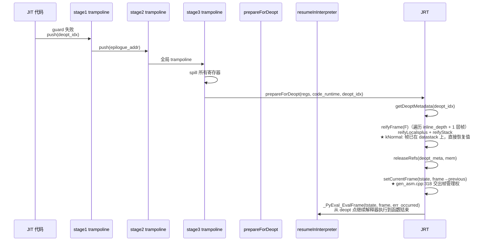

#### OSR 进入路径（解释器 → JIT，新增）

OSR 进入是 deopt 的**逆向操作**，对称关系：

```
deopt 方向:  JIT 寄存器/栈 ──reifyFrame()──▶ frame->localsplus / 操作数栈
OSR  方向:  frame->localsplus / 操作数栈 ──performOSR()──▶ JIT 寄存器/栈
```

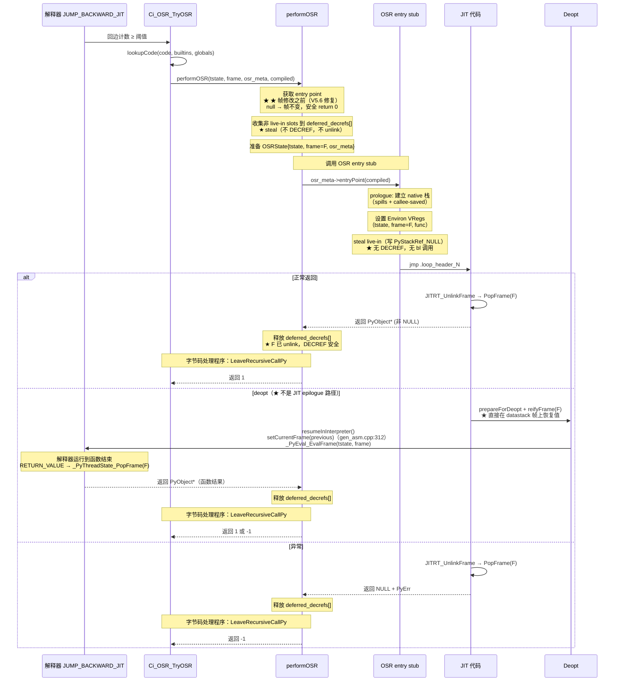

**对称设计对比**：

| 阶段 | deopt（现有） | OSR（新增） |
|------|-------------|-----------|
| 触发 | JIT guard 失败 | 解释器回边计数≥阈值 |
| 元数据 | `DeoptMetadata`（deopt.h:119） | `OSRMetadata`（osr.h，新增） |
| 活跃值 | `LiveValue`（PhyLocation + RefKind + ValueKind） | `OSRLiveIn`（源localsplus索引 + PhyLocation + RefKind + ValueKind） |
| 帧重建 | `reifyFrame()` 从 JIT 状态恢复解释器帧 | stub 设置 Environ VRegs + 恢复 live-in 到 JIT 寄存器/栈槽 |
| 入口 | stage1→2→3 三级 trampoline | per-backedge OSR entry 函数（`osr_meta->entryPoint()`） |
| 引用计数 | `reifyFrame` 转移引用到解释器帧 | performOSR 延迟 DECREF 非 live-in（收集→stub→释放）+ stub steal live-in |
| 返回路径 | `resumeInInterpreter()` → `setCurrentFrame(previous)` → `_PyEval_EvalFrame()`（解释器运行到函数结束，RETURN_VALUE 时 PopFrame） | 正常返回：JITRT_UnlinkFrame → PopFrame(F)；deopt：reifyFrame → resumeInInterpreter → 解释器运行到函数结束；三态返回值；rc≠0 时字节码处理程序调用 `_Py_LeaveRecursiveCallPy` |
| deopt 行为 | `prepareForDeopt` → `reifyFrame`（遍历 inline depth + 1 层帧）→ `releaseRefs` → `resumeInInterpreter` | 与正常 kNormal JIT 完全相同（不需要任何修改） |

### 实现设计

#### OSRState 结构（kNormal 简化版）

`OSRState` 是 `performOSR` 与 OSR entry stub 之间的数据传递结构。kNormal 模式大幅简化：仅包含 `tstate`、`frame`（= `tstate->current_frame`）、`osr_meta` 三个指针。`performOSR` 设置所有字段并调用 `osr_entry(&state)`，stub 从 state 读取后不持有 state 超过 stub 执行期。

#### OSR ABI：完整的调用/返回约定

OSR 进入的核心挑战：当前 JIT 函数的入口遵循 vectorcall ABI（`func, args, nargs, kwnames`），执行完整的 prologue（帧分配、`asm_tstate` 初始化、帧链链接）。`CompiledFunction::staticEntry()` 对非静态编译函数返回 `nullptr`（`compiled_function.cpp:239~248`），且其 prologue 从 args 数组加载 locals，不接受已有的 `_PyInterpreterFrame`。

因此 OSR 需要**专用入口**，不依赖 vectorcall 或 static entry。

**OSR 进入方案：per-backedge 专用 OSR entry 函数**

为每个 `OSRMetadata`（即每个回边循环头）生成独立的 OSR entry 代码段，通过 `OSRMetadata::entry_point_offset` 存储其在 `CompiledFunction` 代码缓冲区中的偏移。`performOSR()` 通过 `osr_meta->entryPoint(compiled)` 获取该回边的专用入口地址：

1. 每个 OSR entry 代码段由 `NativeGenerator` 生成，是独立的代码入口（不与 vectorcall/static entry 共享 prologue）
2. 调用约定：`PyObject* osr_entry(OSRState* state)`，`state->frame` 指向 datastack 上的解释器帧 F
3. stub 建立 kNormal JIT prologue 的 native 栈布局（spills + callee-saved），不分配新帧（F 已在 datastack）
4. **运行时 Environ 寄存器恢复**（★ 关键）：stub 跳过了正常 prologue，但后续 JIT 代码引用 `asm_tstate`、`asm_func`、`asm_interpreter_frame` 等 Environ VReg（generator.cpp:234-236, 4963-4976）。stub 将 `state->tstate`、`state->frame->f_funcobj`、`state->frame` 写入 `osr_meta->tstate_location`/`func_location`/`frame_location` 记录的 PhyLocation。
5. live-in 恢复代码从 `state->frame->localsplus` 读取值，根据 `state->osr_meta->live_ins` 映射到 JIT 寄存器/栈槽。steal 语义——读取后写 `PyStackRef_NULL` 到源 slot。非 live-in slot 已由 `performOSR` 收集阶段清零（steal 到 deferred_decrefs[]，延迟 DECREF 到 stub 返回后）。
6. 跳转到对应 loop header 的正常 JIT 代码
7. 返回值约定（两路）：
   - 非 NULL：函数正常完成（可能是 JIT 直接 return，也可能是 deopt 后解释器运行到函数结束）
   - NULL + PyErr：函数异常退出（可能是 JIT 异常，也可能是 deopt 后解释器运行时异常）
   - ★ V5.8 修复：不存在"NULL + 无 PyErr"的第三路径。deopt 的 `resumeInInterpreter`
     调用 `_PyEval_EvalFrame(tstate, frame, err_occurred)` 运行解释器到函数结束，
     返回值要么是 PyObject*（正常），要么是 NULL + PyErr（异常）。performOSR 从
     `osr_entry_fn` 获得的只有两种结果：非 NULL 或 NULL + PyErr。
     此结论与"核心契约"三态返回约定（rc=1/rc=0/rc=-1）一致——rc 由 performOSR
     内部根据 osr_entry_fn 返回值决定，不暴露给字节码处理程序。

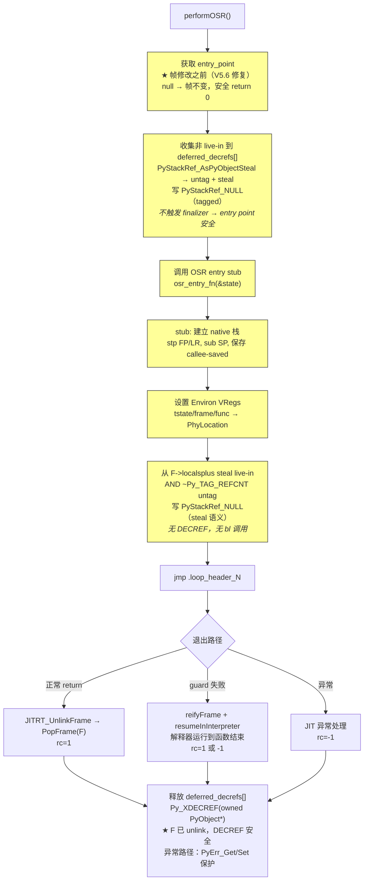

三态返回约定和帧所有权模型详见[核心契约](#核心契约osr-控制流与帧所有权)章节。

**帧所有权模型与三态返回约定**：详见[核心契约](#核心契约osr-控制流与帧所有权)章节。

**与 vectorcall/static entry 的关系**：OSR entry 是第三个独立入口。但与 vectorcall_entry（每个 `CompiledFunction` 一个）不同，OSR entry 为每个回边生成独立的代码段，通过 `OSRMetadata::entry_point_offset` 索引。所有 OSR entry 代码段紧跟在正常 JIT 代码之后生成，共享同一个代码缓冲区和 `CodeRuntime`。

**OSR entry 栈 ABI 与 deopt 兼容性**：

OSR entry stub 的 native 栈布局必须与 kNormal JIT prologue 完全一致（`resume_frame_total_size`/`resume_header_and_spill_size`/`resume_saved_regs` 由 OSRMetadata 提供，见功能项 2）。原因：deopt exit 和 epilogue 的 `hard_exit_label` 从固定的 FP 相对偏移恢复 callee-saved（`translateEpilogueEnd`，autogen.cpp:990-1053）。如果 stub 用不同布局，epilogue 会从错误位置恢复 callee-saved → 破坏 ABI。栈布局详细对照和 deopt trampoline 恢复序列见功能项 2 Stub 章节。

**Stub 运行时行为详述**：

Stub 在运行时执行以下三步操作（与功能项 2 编译期生成的 OSRMetadata 配合）：

**步骤 1：寄存器选择策略**。Stub 使用 caller-saved 寄存器（x9/x10/x11）处理 `OSRState*` 解引用和元数据访问，不使用 callee-saved 寄存器（x19-x28）。原因：
- `computeFrameInfo()`（gen_asm.cpp:867）仅保存 `env_.changed_regs & CALLEE_SAVE_REGS`（JIT body 实际使用的寄存器），如果 JIT body 不用 x19/x20，epilogue 不恢复它们 → 违反平台 ABI
- Stub 内部无 `bl` 调用 → caller-saved 寄存器始终有效，不需要 callee-saved 保存/恢复

**步骤 2：PyStackRef → PyObject* 转换**。Stub 从 `F->localsplus[i]` 读取 `_PyStackRef`，需要剥离标记位后才能作为 `PyObject*` 写入 JIT 物理位置：
- 非 free-threading：`_PyStackRef` 使用 `Py_TAG_REFCNT(=1)` 标记位（pycore_stackref.h:440~514）
  - mortal 对象：`bits == (uintptr_t)obj`（标记位 0，等同于裸指针）
  - immortal 对象/NULL：`bits == (uintptr_t)obj | 1`（需 `AND ~1` 剥离标记位）
  - 转换：`PyStackRef_AsPyObjectBorrow() = BITS_TO_PTR_MASKED() = bits & ~1`
- free-threading：`_PyStackRef` 使用 `Py_TAG_DEFERRED` 标记位，需 unmask
- MVP 仅支持非 free-threading（`isOSREligible` 已拒绝 free-threading 构建）
- deopt 对称方向：`reifyLocalsplus()`（deopt.cpp:115~149）使用 `Ci_STACK_STEAL` 提取 `PyObject*`，OSR 方向对称地使用 `AND ~Py_TAG_REFCNT` 剥离标记位

**步骤 3：kOwned-only 限制的运行时理由**。OSR 仅恢复 `ref_kind == kOwned` 的 live-in，非 kOwned 的 live-in 导致该 OSR entry 被拒绝：
- `deopt releaseRefs`（deopt.cpp:366-379）只释放 kOwned 寄存器，kBorrowed 被跳过
- kNormal 模式下 JIT 从 `F->localsplus` 读取 live-in 后，`refcount_insertion` 对 kOwned live-in 执行 INCREF（steal 后寄存器持有 borrowed ref，INCREF 创建 JIT 的 owned ref）
- deopt 的 `releaseRefs` DECREF 此 owned ref
- 如果 kBorrowed live-in 的 JIT 引用不被 `releaseRefs` 释放 → 内存泄漏
- **kOwned-only 覆盖率影响**：`LOAD_FAST` 产生的值默认为 kBorrowed（parser.cpp:1314）。某些 while 热循环中仅读取局部变量的场景（如 `while i < N: total += arr[i]`），i 和 total 在循环头可能仍是 kBorrowed，导致该 OSR entry 被拒绝。被拒绝的循环继续以解释速度执行，不影响正确性。MVP 明确不保证所有 while 循环都能通过 OSR 加速。Phase 2 扩展路径：在 OSR HIR 中将所有 kBorrowed 标记为 kOwned，让 `refcount_insertion` 自动添加配对的 INCREF/DECREF。

**数据结构扩展**：`CompiledFunctionData::has_osr_entries` 和 `CodeRuntime::osr_metadatas_` 的详细定义见功能项 2"数据结构新增清单（struct diff）"。

**存储 OSRMetadata**：`OSRMetadata` 存储在 `CodeRuntime` 中（与 `DeoptMetadata` 一样通过 `addDeoptMetadata()` 机制存储），生命周期与 `CompiledFunction` 一致。运行时通过 `osr_meta->entryPoint(compiled)` 获取 stub 入口地址，`osr_meta->live_ins` 指导 live-in 恢复。

**帧所有权转移**：详见[核心契约](#核心契约osr-控制流与帧所有权)章节的帧所有权模型和 live-in 引用所有权模型。

#### performOSR 帧操作背景

理解 `performOSR` 需要掌握以下帧操作概念：

- **kNormal 帧链**：`frame->previous` 指向调用者帧，`tstate->current_frame` 指向当前帧。OSR 进入时帧 F 已在 datastack 上，JIT 代码通过 Environ VRegs 访问。performOSR **不执行 PopFrame**——帧生命周期由 JIT epilogue 管理
- **localsplus 组成**：`[0..co_nlocals)` 局部变量，`[co_nlocals..+co_ncells)` cell 变量，`[+co_ncells..+co_nfreevars)` free 变量，之后是操作数栈。OSR live-in 主要来自 locals 部分
- **instr_ptr**：`performOSR` 在调用 stub 前将 `frame->instr_ptr` 设置到 loop header 字节码位置（`osr_meta->target_offset`）。原因：虽然 JIT 代码不使用 `instr_ptr`（直接跳到 loop header 机器码），但 stub 执行期间如果有 tracing、`sys._getframe()` 或 deopt 观察到 F，必须看到正确的字节码位置。不设置会导致 `PyUnstable_InterpreterFrame_GetLine` 返回错误行号
- **kNormal 不需要消耗/重建帧**：F 已在 datastack 上，但 performOSR 必须 steal live-in 并清零 localsplus（使 F 进入与 `JITRT_AllocateAndLinkInterpreterFrame` 相同的初始化状态），否则 deopt/refcount 路径不兼容

**非 live-in 清理的安全不变量**（frame.cpp:656-658）：

CPython 要求帧在 DECREF/clear 前必须被 unlink。`JITRT_UnlinkFrame` 先 `setCurrentFrame(tstate, frame->previous)` 再 `jitFrameClearExceptCode(frame)`。延迟 DECREF 策略确保安全：

1. **前置校验**（帧修改之前）：获取 entry point。如果为 null → 帧完全不变 → 安全 return 0
2. **收集阶段**（不 DECREF、不 unlink）：steal 非 live-in 到临时数组，slot 置 NULL。不触发 finalizer → entry point 在 stub 调用时有效
3. **调用 stub**：JIT epilogue 执行 `JITRT_UnlinkFrame` → PopFrame(F)，F 不再是 current_frame
4. **释放阶段**：stub 返回后执行 `Py_XDECREF`。F 已 unlink → 满足 frame.cpp 不变量

#### performOSR 实现

kNormal 模式下 performOSR 大幅简化——帧已在 datastack 上，不需要消耗/重建。核心流程采用延迟 DECREF 策略，stub 完全不做 DECREF。

```
// cinderx/Jit/osr.cpp — performOSR 实现
int performOSR(tstate, frame, osr_meta, compiled, out_result):

  // [0] 前置校验（帧完全不变）
    code = _PyFrame_GetCode(frame)
    entry_fn = osr_meta->entryPoint(compiled)
    if entry_fn == NULL: return 0    // 帧未修改，安全 rc=0

  // [0.5] 设置 instr_ptr 到 loop header（stub 执行期间可观测性）
    frame->instr_ptr = code_start + osr_meta->target_offset

  // [1] 收集非 live-in（steal，不 DECREF，不 unlink）
    // 延迟 DECREF 策略：收集阶段不触发任何 Python finalizer → entry point 在 stub 调用时必然有效
    // 不需要区分 locals/cells/freevars 分区——OSR 从已正确初始化的帧读取，所有 slot 值有效
    // 不使用 VLA（非标准 C++，大函数有栈溢出风险）→ 固定大小上限 512 slot
    // ★ _PyStackRef 有标记位（pycore_stackref.h:446-455）：mortal 对象标记位=0，immortal/NULL 标记位=1
    //   必须 untag 转为 PyObject* 才能安全 DECREF
    for slot in non_live_in_slots:
        obj = PyStackRef_AsPyObjectSteal(slot)   // untag: bits & ~Py_TAG_REFCNT → owned PyObject*
        if obj != NULL:
            deferred_decrefs[n++] = obj          // steal 到临时数组（owned ref，待 DECREF）
        slot = PyStackRef_NULL                    // 置 NULL（tagged，bits = Py_TAG_REFCNT）

  // [2] 调用 stub
    state = {tstate, frame, osr_meta}
    result = osr_entry_fn(&state)
    // stub 建立 native 栈 + 设置 Environ VRegs + steal live-in → 跳转 JIT loop header
    // JIT epilogue 执行 JITRT_UnlinkFrame → PopFrame(F)，返回 result

  // [3] 释放延迟的 DECREF（JIT epilogue 已 unlink F，finalizer 安全）
    // ★ 异常保护：如果 stub 返回异常（result == NULL），DECREF 前必须保存/恢复异常状态
    //   因为 Py_XDECREF 可能触发 finalizer，finalizer 中的 PyErr_NoMemory 会覆盖当前异常
    saved_exc = (result == NULL) ? PyErr_GetRaisedException() : NULL
    for obj in deferred_decrefs:
        Py_XDECREF(obj)
    if saved_exc != NULL: PyErr_SetRaisedException(saved_exc)

  // [4] 返回三态结果
    if result != NULL: *out_result = result; return 1   // JIT 正常返回
    return -1                                            // JIT 异常
```

#### 帧链管理

kNormal 模式下 OSR 的帧链管理比 lightweight 模式简单得多——解释器帧 F 已经在 datastack 上，不需要消耗/重建帧，不需要 FrameHeader。

**kNormal OSR 帧模型：复用 datastack 上的解释器帧 F**

**帧分配模型**（基于源码）：

| 路径 | 分配位置 | PopFrame? | 代码位置 |
|------|---------|-----------|---------|
| 解释器帧 | datastack（`_PyThreadState_PushFrame`） | `_PyThreadState_PopFrame` | ceval.c |
| kNormal JIT 帧 | datastack（`JITRT_AllocateAndLinkInterpreterFrame`） | `JITRT_UnlinkFrame` → `Cix_PyThreadState_PopFrame` | jit_rt.cpp:575-598 |
| **OSR（kNormal）** | **复用 datastack 上的 F** | **JIT epilogue 的 JITRT_UnlinkFrame 负责** | osr.cpp |

**kNormal 模式的关键简化**：
- 无 FrameHeader（`frameHeaderSize() == 0`，frame_header.cpp:19）
- JIT 代码通过 Environ VRegs（`asm_interpreter_frame`）访问 F
- JIT epilogue 调用 `JITRT_UnlinkFrame` → `Cix_PyThreadState_PopFrame(F)` 清理帧
- OSR entry stub 只需建立 native 栈执行上下文（spills + callee-saved），不需要分配/初始化帧
- 非 live-in 清理由 performOSR 在 C++ 土地完成（延迟 DECREF 策略），stub 仅 steal live-in

```
// cinderx/Jit/osr.cpp — 帧链管理与 OSR 进入步骤
OSR 前帧链：   caller_frame ← F（解释器帧，datastack 上）
OSR 执行中：   caller_frame ← F（不变，JIT 通过 Environ VRegs 访问）
OSR 返回后：   caller_frame（F 被 JIT epilogue 的 JITRT_UnlinkFrame → PopFrame 清理）

OSR 进入步骤（延迟 DECREF 策略，V5.6 修复 entry null 帧安全）：
  [0] 前置校验（帧完全不变）：
      获取 code 信息（_PyFrame_GetCode，borrowed ref）
      获取 entry_point（osr_meta->entryPoint(compiled)）
      如果 entry_point 为 null → return 0（帧完全不变，安全）
  [1] 收集非 live-in（不 DECREF，不 unlink）：
      构建 is_live_in 索引集合
      for slot in non_live_in_slots:
          deferred_decrefs[n++] = slot         // steal 到临时数组
          slot = PyStackRef_NULL               // 置 NULL（不 DECREF）
  [2] 调用 OSR entry stub：
      准备 OSRState{tstate, frame=F, osr_meta}
      osr_entry_fn(&state)
        → stub prologue：建立 native 栈（spills + callee-saved，与 kNormal JIT prologue 一致）
        → 设置 Environ VRegs（tstate, frame=F, func）到 regalloc 分配的位置
        → 从 F->localsplus[] steal live-in（无 DECREF）
        → 跳转到 JIT loop header
        → JIT 执行完毕（return/deopt/exception）
            return 路径：JITRT_UnlinkFrame → PopFrame(F) → 返回 result
            deopt 路径：reifyFrame(F) → resumeInInterpreter → _PyEval_EvalFrame(F)
        → epilogue 返回最终 PyObject* 给 performOSR()
  [3] 释放延迟的 DECREF（JIT epilogue 已 unlink F，安全 DECREF）：
      for obj in deferred_decrefs:
          Py_XDECREF(obj)                       // ★ F 已被 unlink，finalizer 安全
  → performOSR 返回 1 或 -1
  → 字节码处理程序：push result → DISPATCH（或 goto error）
```

**JITRT_UnlinkFrame 行为**（现有代码，无需修改）：

OSR 使用与正常 kNormal JIT 完全相同的帧生命周期。`JITRT_UnlinkFrame`（jit_rt.cpp:777-778）调用 `Cix_PyThreadState_PopFrame(tstate, frame)` 释放 datastack 上的帧。

**deopt 时的帧处理**（与正常 kNormal JIT deopt 完全相同，无需特殊处理）：

kNormal 模式下帧已在 datastack 上，deopt 不需要帧转换。`prepareForDeopt`（gen_asm.cpp:148）在 kNormal 模式下直接执行 `reifyFrame` 循环，跳过 lightweight 帧 reification 分支。`resumeInInterpreter` → `_PyEval_EvalFrame` 运行解释器到函数结束，帧清理由 `_PyEval_EvalFrame` 内部的 `RETURN_VALUE` 处理。

### 增量 SR 清单

| SR 编号 | 描述 |
|---------|------|
| SR-OSR-009 | `OSRState` 结构定义（tstate + frame + osr_meta，kNormal 模式简化版） |
| SR-OSR-010 | `performOSR()` 三态返回：1=完成（JIT epilogue 已 PopFrame）, 0=未尝试（帧不变）, -1=异常（JIT epilogue 已 PopFrame） |
| SR-OSR-011 | 专用 OSR entry 函数的 prologue 代码生成（NativeGenerator，复用 kNormal JIT prologue 栈布局） |
| SR-OSR-012 | OSR live-in 恢复代码生成（从 F->localsplus[] steal，非 live-in 清零由 performOSR 完成） |
| SR-OSR-013 | kNormal 模式下 live-in 引用计数管理（steal 语义 + performOSR 临时 unlink 清零，匹配 JITRT_AllocateAndLinkInterpreterFrame 初始化状态） |
| SR-OSR-014 | `CodeRuntime::osr_metadatas_` 存储 |
| SR-OSR-015 | `CompiledFunctionData::has_osr_entries` 标记 + `OSRMetadata::entry_point_offset` per-backedge 存储 |
| SR-OSR-016 | 验证 OSR JIT 代码共享标准 kNormal deopt 路径（帧已在 datastack 上，prepareForDeopt 直接 reifyFrame） |

### 实现接口设计

#### 实现接口定义

```cpp
int performOSR(tstate, frame, osr_meta, compiled, out_result);  // 三态: 1=完成, 0=未尝试, -1=异常
```

### 功能规格设计

| 规格项 | 规格 |
|--------|------|
| 帧链完整性 | OSR 进入后帧链必须保持完整，traceback 正确 |
| 引用计数正确性 | locals 引用从解释器转移到 JIT 期间无泄漏无 double-free |
| 栈一致性 | 操作数栈在循环头处必须与 `OSRMetadata` 描述一致 |
| 可调试性 | traceback 中应能正确显示 OSR 前的调用栈 |

### DFX 分析

#### 可靠性分析

##### FMEA 分析

| 失效模式 | 影响 | 原因 | 检测手段 | 补偿措施 |
|---------|------|------|---------|---------|
| 引用计数泄漏 | 内存泄漏 | OSR 进入时未正确转移 locals 引用 | refcount 真值比对 | Debug 构建中验证引用计数平衡 |
| 帧链断裂 | traceback 错误、segfault | 帧链指针被错误修改 | 帧链完整性断言 | 帧链检查点 |
| 操作数栈不一致 | JIT 执行语义错误 | 循环头有栈上值但 OSR 未恢复 | 编译时检查 | 拒绝非空栈循环头的 OSR |
| 帧双清（deopt 后） | segfault、use-after-free | deopt 路径已通过 resumeInInterpreter → _PyEval_EvalFrame 清理帧，字节码处理程序不应再做帧清理 | ASAN、帧状态断言 | 三态返回契约：rc==1 时帧已清理，字节码处理程序仅 push result + DISPATCH |

#### 可服务性分析

- Debug 构建中提供 OSR 帧状态验证模式：OSR 进入后立即 deopt，比较帧状态一致性

#### 安全设计检查

##### 安全设计确认

引用计数转移不正确可能导致内存安全问题（use-after-free 或内存泄漏），需通过严格测试覆盖。

##### 敏感操作检查

不涉及。

#### 可用性/性能分析

**OSR 进入开销**：状态构造 + trampoline 跳转，约 1~5 微秒，一次性开销，在热循环的整个执行期间可忽略。

### 影响点列表

| 模块 | 文件 | 影响描述 |
|------|------|---------|
| OSR 运行时 | `cinderx/Jit/osr.h`, `osr_capi.h`, `osr.cpp`（新增） | `performOSR()`、`OSRState`、`OSRLiveIn` |
| CodeRuntime | `cinderx/Jit/code_runtime.h` | 新增 `osr_metadatas_` |
| CompiledFunction | `cinderx/Jit/compiled_function.h` | `CompiledFunctionData` 新增 `has_osr_entries` 标记 |
| Frame 管理 | `cinderx/Jit/frame.h`, `frame.cpp` | 复用 kNormal 帧机制（datastack 分配，无 FrameHeader） |
| JITRT | `cinderx/Jit/jit_rt.cpp` | `JITRT_UnlinkFrame` 无修改（OSR 复用 datastack 上的 F，JIT epilogue 负责 PopFrame）；无需新增 C helper |
| Deopt | `cinderx/Jit/deopt.h`, `deopt.cpp` | 对称参考 `reifyFrame()`、`LiveValue` |
| Codegen | `cinderx/Jit/codegen/gen_asm.h`, `gen_asm.cpp` | per-backedge OSR entry 函数生成（prologue + live-in 恢复，偏移存入 OSRMetadata） |

### 分配需求

| 需求编号 | 描述 |
|---------|------|
| REQ-OSR-003 | 系统应能将解释器帧状态安全迁移到 JIT 代码中执行 |

---

## 功能项 4：OSR 退出与降级

### 功能概述

OSR 进入 JIT 代码后，如果 JIT 代码触发 deopt（guard 失败、类型变化等），需要安全退回到解释器。此外需要定义 OSR 编译结果的失效和回收策略。

### 实现思路

OSR 代码中的 deopt **完全复用现有 deopt 机制**（`reifyFrame()`、`DeoptMetadata`、`resumeInInterpreter()`）。OSR entry 只是一个不同的入口点，进入后执行的 JIT 代码与正常函数入口进入的 JIT 代码相同。OSR 代码和正常代码共享所有 guard 点和 `DeoptMetadata`。

**关键设计**：OSR JIT 代码与正常 JIT 代码共享完全相同的 deopt 路径——包括 `resumeInInterpreter()` → `_PyEval_EvalFrame()`。这意味着 deopt 时帧会被完全清理（`_PyEval_FrameClearAndPop`），`current_frame` 会指向 `caller_frame`。`performOSR` 收到的是最终返回值（与正常 exit 路径相同），字节码处理程序统一处理：push result → DISPATCH。不需要 `JIT_FRAME_OSR` 标记或特殊的"deopt reify"状态。

### 模块调用关系

#### OSR deopt 退出路径（与正常 JIT deopt 完全共享）

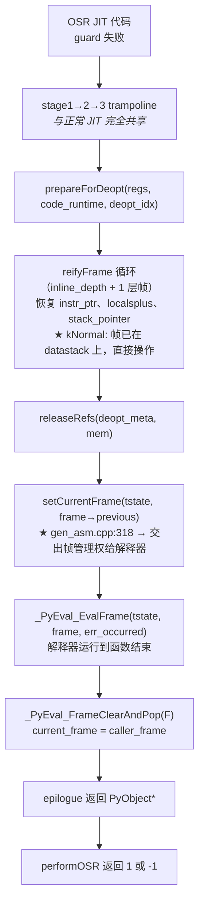

**`reifyFrame()` 和 `prepareForDeopt()` 对 OSR 完全透明**：不关心帧是从正常入口还是 OSR entry 进入的，只依赖 `DeoptMetadata` 中的 `cause_instr_idx` 和 `live_values` 恢复帧状态。不需要修改任何现有 deopt 代码。

#### 编译失效时的清理路径

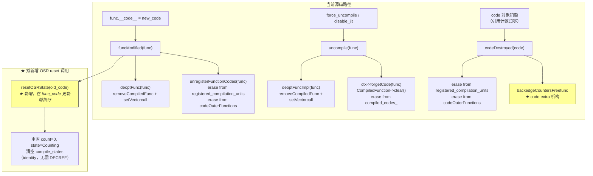

**当前源码路径**（pyjit.cpp）：
- **`funcModified(func)`**（L3692-3700）：调用 `deoptFunc(func)`（设置 vectorcall 为解释器入口）+ `unregisterFunctionCodes(func)`（清除注册信息）。**不调用** `uncompile`/`forgetCode`——`CompiledFunction` 仍保留在 `compiled_codes_` 中，下次 `scheduleCompile()` 重新注册。
- **`uncompile(func)`**（L1275-1278）：调用 `deoptFuncImpl(func)` + `ctx->forgetCode(func)`。`forgetCode`（context.cpp:506-542）执行 `CompiledFunction::clear()` 并从 `compiled_codes_` 中移除——彻底清理。
- **`codeDestroyed(code)`**（L3657-3671）：清除注册信息（`registered_compilation_units`、`codeOuterFunctions`）。code extra 析构函数 `backedgeCountersFreefunc` 自动释放 `BackedgeCounters` 及其 `compile_states`。

**差异**：在 `funcModified()` 末尾、`func->func_code` 更新**之前**增加 `resetOSRState(old_code)` 调用（此时 `func->func_code` 仍指向旧 code）。`codeDestroyed()` 不直接调用 `resetOSRState()`——code 对象销毁时 `backedgeCountersFreefunc`（code extra 析构函数）自动释放 `BackedgeCounters` 及其 `compile_states`（identity 查找，无需 `Py_XDECREF`），无需额外清理。`resetOSRState()` 仅在 code 对象存活但需要重置 OSR 状态时使用（如 `func.__code__` 被替换后旧 code 仍有计数器）。

### 实现设计

#### Deopt 复用验证

需要确认的关键点：

1. **`DeoptMetadata` 完整性**：OSR entry point 进入后，后续所有 guard 的 `Snapshot` 和 `FrameState` 都已正确构建——这由 `HIRBuilder` 保证，与入口点无关。

2. **`reifyFrame()` 正确性**：从 OSR 代码 deopt 时，`reifyFrame()`（`cinderx/Jit/deopt.cpp:335`）能正确恢复到 guard 点对应的字节码位置——这由 `DeoptFrameMetadata::cause_instr_idx` 和 `FrameState` 保证。

3. **引用计数平衡**：OSR 进入时转移的引用，在 deopt 时通过 `reifyFrame()` 正确恢复到解释器帧——`reifyFrame()` 已实现 `reifyLocalsplus()` 和 `reifyStack()`。

#### OSR 编译结果的失效

以下场景需要使 OSR entry 失效：

| 场景 | 处理方式 |
|------|---------|
| 函数代码被修改（`funcModified`，`cinderx/Jit/pyjit.cpp`） | `deoptFunc(func)` + `unregisterFunctionCodes(func)` + **新增** `resetOSRState(old_code)`（在 `func_code` 更新前执行） |
| 类型被修改（`typeModified`，通过 `Context::notifyTypeModified()`） | 触发依赖类型的 guard deopt，OSR entry 不需要特殊处理 |
| 函数被 GC 回收（`funcDestroyed`，`Context::funcDestroyed()`） | `OSRMetadata` 随 `CompiledFunction` 一起被回收 |

#### 回边计数器状态重置

当 OSR 编译的代码被整体失效后，需要将回边计数器重置到 Counting 状态：

```cpp
// cinderx/Jit/osr.cpp

void resetOSRState(PyCodeObject* code) {
  BackedgeCounters* counters = Ci_GetBackedgeCounters(code);
  if (counters != nullptr) {
    for (uint32_t i = 0; i < counters->num_entries; i++) {
      counters->entries[i].count = 0;
      counters->entries[i].state = 1; /* Counting */
    }
    // ★ 清空 per-CompilationKey 编译状态
    //    builtins_id/globals_id 是 uintptr_t identity，无需 DECREF
    counters->num_compile_states = 0;
  }
}
```

在 `jit::funcModified()`（`cinderx/Jit/pyjit.cpp`）中调用 `resetOSRState()`（在 `func_code` 更新前，针对旧 code 执行）。`codeDestroyed()` 不需要调用 `resetOSRState()`——`backedgeCountersFreefunc` 析构时自动释放。

### 增量 SR 清单

| SR 编号 | 描述 |
|---------|------|
| SR-OSR-013 | 验证 OSR 代码 deopt 的正确性 |
| SR-OSR-014 | `resetOSRState()` 在编译失效时被调用 |
| SR-OSR-015 | `codeDestroyed()` / `funcModified()` 中集成 OSR 重置 |

### 实现接口设计

#### 实现接口定义

```cpp
// cinderx/Jit/osr.h

namespace jit {

// 重置 code 对象的 OSR 状态（编译失效时调用）
void resetOSRState(PyCodeObject* code);

} // namespace jit
```

### 功能规格设计

| 规格项 | 规格 |
|--------|------|
| Deopt 兼容性 | OSR 代码的 deopt 复用完全相同的 deopt 路径（不需要任何修改） |
| 失效同步性 | 编译失效时所有 OSR entry 同步失效 |
| 重置幂等性 | `resetOSRState` 可安全多次调用 |

### DFX 分析

#### 可靠性分析

##### FMEA 分析

| 失效模式 | 影响 | 原因 | 检测手段 | 补偿措施 |
|---------|------|------|---------|---------|
| OSR entry 悬空指针 | 使用已失效的 OSR entry | 编译失效但未清除 entry 指针 | 断言检查 | `backedgeCountersFreefunc` 在 code 对象销毁时自动释放（`codeDestroyed()` 不直接调用 `resetOSRState()`） |
| 循环重入 OSR | 无限触发 OSR 编译 | 编译失效后计数器未重置 | 状态检查 | 设置最大 OSR 重试次数 |

#### 可服务性分析

- OSR 统计信息包含：OSR 编译次数、OSR 进入次数、OSR deopt 次数
- 可通过 `cinderx.jit` 模块查看

#### 安全设计检查

##### 安全设计确认

不引入新的安全风险。OSR 退出的 deopt 复用已有安全审计过的机制。

##### 敏感操作检查

不涉及。

#### 可用性/性能分析

无额外性能开销。OSR deopt 与普通 deopt 性能特征一致。

### 影响点列表

| 模块 | 文件 | 影响描述 |
|------|------|---------|
| JIT 入口 | `cinderx/Jit/pyjit.cpp` | `funcModified()` 调用 `resetOSRState(old_code)`；`codeDestroyed()` 依赖 `backedgeCountersFreefunc` 自动清理 |

### 分配需求

| 需求编号 | 描述 |
|---------|------|
| REQ-OSR-004 | OSR 编译失效时应正确清理所有 OSR 状态 |

---

## 设计决策记录（ADR）

本节记录 OSR 设计中做出的重要技术决策及其理由。

### <a id="adr-1-osr-不依赖-_py_tier2"></a>ADR-1: OSR 不依赖 `_Py_TIER2`

- **决策**：OSR 逻辑放在 `_JIT` 块外部（之前），由 `Config::osr_enabled` 运行时控制
- **背景**：`JUMP_BACKWARD_JIT` 的 `_JIT` 子块包含 CPython Tier 2 逻辑，受 `#ifdef _Py_TIER2` 保护。CinderX 默认不定义 `_Py_TIER2`
- **考量**：
  - 方案 A：放在 `_JIT` 块内，依赖 `_Py_TIER2` → OSR 需要 Tier 2 已启用才能工作
  - 方案 B：放在 `_JIT` 块外，由 CinderX 自身配置控制 → OSR 和 Tier 2 完全独立
- **结论**：选择方案 B。OSR 和 Tier 2 是完全独立的特性，互不依赖、互不 fall through

### <a id="adr-2-per-backedge-专用-osr-entry"></a>ADR-2: per-backedge 专用 OSR entry（不复用 vectorcall/static entry）

- **决策**：为每个回边循环头生成独立的 OSR entry 代码段
- **背景**：现有入口遵循 vectorcall ABI（func, args, nargs, kwnames），不接受已有 `_PyInterpreterFrame`。`staticEntry()` 对非静态编译函数返回 `nullptr`
- **考量**：
  - 方案 A：复用 vectorcall entry → 无法传递已有帧
  - 方案 B：复用 static entry → 对非静态函数不可用
  - 方案 C：per-backedge 专用入口 → 完全控制 ABI，调用约定 `PyObject* osr_entry(OSRState*)`
- **结论**：选择方案 C。每个 OSRMetadata 携带独立 entry_point_offset，共享同一 CodeRuntime

### <a id="adr-3-不需要-jit_frame_osr"></a>ADR-3: 不需要 `JIT_FRAME_OSR` 标记和 `rc==2` 状态

- **决策**：OSR JIT 代码与正常 JIT 代码共享完全相同的 exit/deopt 路径，不需要任何 OSR 特殊标志
- **背景**：OSR 进入后可能走正常 return 或 deopt 两条路径
- **考量**：
  - 方案 A：新增 `JIT_FRAME_OSR` 标记，deopt 时检查此标记走不同路径 → 增加复杂度
  - 方案 B：deopt trampoline 无条件执行 `resumeInInterpreter` → `_PyEval_EvalFrame` 已自动清理帧 → 不需要区分
- **结论**：选择方案 B。源码分析证明 deopt trampoline 无条件执行 `resumeInInterpreter`，两条退出路径均导致帧被清理、current_frame 指向 caller_frame。字节码处理程序统一 push result + DISPATCH 即可

### <a id="adr-4-osr-帧使用-native-栈"></a>ADR-4: kNormal OSR 复用 datastack 帧（不消耗/重建帧）

- **决策**：kNormal 模式下 OSR 复用 datastack 上的解释器帧 F，不分配新帧
- **背景**：kNormal 模式（OSS CinderX 3.14）下 `frameHeaderSize() == 0`，JIT 帧通过 `JITRT_AllocateAndLinkInterpreterFrame` 在 datastack 上分配，与解释器帧使用相同机制。JIT 代码通过 Environ VRegs（`asm_interpreter_frame`）访问帧，不需要 FrameHeader。
- **考量**：
  - 方案 A（原 lightweight 设计）：消耗解释器帧 F，在 native 栈分配带 FrameHeader 的 F'，初始化帧字段，steal live-in → 仅适用于 lightweight 模式（`ENABLE_LIGHTWEIGHT_FRAMES`），OSS 3.14 不启用
  - 方案 B（kNormal 设计）：复用 datastack 上的 F，performOSR 收集非 live-in 到临时数组（延迟 DECREF 策略），stub 建立执行上下文 + steal live-in（使 F 进入与正常 JIT 帧相同的初始化状态），stub 返回后执行延迟的 DECREF（JIT epilogue 已 unlink F），JIT epilogue 通过 `JITRT_UnlinkFrame` → `Cix_PyThreadState_PopFrame` 清理帧
- **结论**：选择方案 B。消除 FrameHeader 依赖、消除帧消耗/重建的复杂性、消除重入风险、大幅简化 performOSR（~20 行替代 ~100 行）

### <a id="adr-5-mvp-仅支持-kowned-live-in"></a>ADR-5: MVP 仅支持 kOwned live-in

- **决策**：`markOSREntries()` 编译期拒绝非 kOwned 的 live-in
- **背景**：`deopt releaseRefs`（deopt.cpp:366-379）只释放 kOwned，kBorrowed 被跳过
- **考量**：如果允许 kBorrowed live-in，JIT refcount 管理体系会为这些值创建独立引用，但 deopt releaseRefs 不释放 kBorrowed 寄存器 → 内存泄漏
- **结论**：MVP 阶段只允许 kOwned。kBorrowed/kUncounted 的 live-in 支持需要扩展 deopt releaseRefs，计划在后续版本

### <a id="adr-6-live-in-使用-steal-语义"></a>ADR-6: kNormal 模式下 live-in 必须使用 steal 语义

- **决策**：`performOSR` 收集非 live-in slots 到临时数组（延迟 DECREF 策略：steal 到 `deferred_decrefs[]`，不立即 DECREF），OSR entry stub 从 F->localsplus[] 读取 live-in 值后，写入 `PyStackRef_NULL(=1)` 到源 slot（steal）。stub 返回后（JIT epilogue 已 unlink F）执行延迟的 DECREF。
- **背景**：`reifyLocalsplus`（deopt.cpp:125-136）对 local slots 使用 `Ci_STACK_STEAL`（盲写）和 `Ci_STACK_NULL`（盲写），假设 slots 初始为 NULL。`releaseRefs`（deopt.cpp:366-380）对 kOwned 值 DECREF。如果 OSR 复用 F 而不清零 localsplus，deopt 会泄漏原始解释器引用或对 borrowed 值 DECREF
- **考量**：
  - 不 steal：reifyLocalsplus 盲写覆盖已有值 → 泄漏原始解释器引用
  - steal 但不清零非 live-in：reifyLocalsplus 对 dead locals 写 Ci_STACK_NULL → 覆盖解释器值 → 泄漏
  - steal + 清零：`performOSR` 收集非 live-in（延迟 DECREF）+ stub steal live-in → F->localsplus 进入与 `JITRT_AllocateAndLinkInterpreterFrame` 相同的初始状态 → deopt/return 路径完全兼容
- **结论**：kNormal 必须使用 performOSR 收集（延迟 DECREF）+ stub steal 语义。引用所有权从 F->localsplus 转移到 JIT 寄存器，`refcount_insertion` INCREF 创建 JIT owned ref，`deopt releaseRefs` DECREF 消耗此 owned ref。非 live-in 的 DECREF 推迟到 stub 返回后（JIT epilogue 已 unlink F，安全执行），收集阶段不触发任何 finalizer。stub 无 DECREF 操作。

### <a id="adr-7-stub-写-pystackref_null"></a>ADR-7: steal 时写入 `PyStackRef_NULL(=1)` 而非零

- **决策**：steal 时写入 `PyStackRef_NULL`（bits=1），不能使用零寄存器 `str xzr`
- **背景**：CPython 3.14 非 free-threading 下 `PyStackRef_NULL_BITS = Py_TAG_REFCNT = 1`（pycore_stackref.h:454）
- **考量**：`PyStackRef_CheckValid` 断言 `bits!=0`（pycore_stackref.h:469）。写 0 留下无效 `_PyStackRef`
- **结论**：stub 使用 `mov x9, #1; str x9` 写入正确值，x9 在所有 slot 间复用（stub 使用 caller-saved 临时寄存器，无 bl 调用所以 x9 不被破坏）

### <a id="adr-8-cinderx-必须设置-interp-jit"></a>ADR-8: CinderX 必须设置 `interp->jit` 并覆盖 `_SPECIALIZE_JUMP_BACKWARD`

- **决策**：CinderX 的 `jit::initialize()` 和 `enable_jit_impl()` 必须设置 `tstate->interp->jit = true`，并通过 `override op(_SPECIALIZE_JUMP_BACKWARD)` 强制路由到 `JUMP_BACKWARD_JIT`
- **背景**：`_SPECIALIZE_JUMP_BACKWARD`（`bytecodes.c:2906-2914`）在 `JUMP_BACKWARD` 首次执行时根据 `tstate->interp->jit` 将 opcode 改写为 `JUMP_BACKWARD_JIT` 或 `JUMP_BACKWARD_NO_JIT`。CPython 上游仅在 `#ifdef _Py_TIER2` 时设置 `interp->jit = true`（`pylifecycle.c:1348`），CinderX 不定义 `_Py_TIER2`，默认 `interp->jit = false`（`pystate.c:674`）
- **考量**：
  - 方案 A：仅设置 `interp->jit = true` → 只影响未来首次执行的 `JUMP_BACKWARD`，已在 JIT 启用前执行并 quicken 成 `JUMP_BACKWARD_NO_JIT` 的回边不会再经过 `_SPECIALIZE_JUMP_BACKWARD`，永远不会触发 OSR
  - 方案 B：仅覆盖 `_SPECIALIZE_JUMP_BACKWARD` → 只影响未来首次执行的情况，同样不解决已 quicken 的回边
  - 方案 C：两者都做 + 要求 `interp->jit` 在任何用户字节码执行前设置 → 覆盖正常启动路径（`-X jit` 或 sitecustomize 中 `cinderx._enable_jit()`），已 quicken 的边界场景不会发生
  - **已 quicken 回边的不可恢复性**：`JUMP_BACKWARD` 首次执行后被 quicken 为 `JUMP_BACKWARD_JIT` 或 `JUMP_BACKWARD_NO_JIT`（`bytecodes.c:2912-2914`），此后永远不会再进入 `_SPECIALIZE_JUMP_BACKWARD`。已 quicken 为 `JUMP_BACKWARD_NO_JIT` 的回边**无法**通过运行时修改 `interp->jit` 或 override 恢复——恢复需要逐 code object 扫描并反优化所有 `JUMP_BACKWARD_NO_JIT`，成本高且影响所有已编译代码，MVP 不实现此机制
  - **运行期启用的风险**：`enable_jit_impl()`（`pyjit.cpp:1339`）可在运行时被调用。如果 JIT 启用时已有用户代码执行过，部分 `JUMP_BACKWARD` 可能已被 quicken 为 `JUMP_BACKWARD_NO_JIT`，这些回边将永久绕过 OSR。`Config::state` 可区分首次启用（`kNotInitialized → kRunning`）和运行期重新启用（`kPaused → kRunning`）
- **结论**：选择方案 C + `osr_capable` 运行期防护：
  1. `jit::initialize()`（`pyjit.cpp:3313`）在设置 `Config::state = kRunning`（L3423）的同时设置 `interp->jit = true` 和 `osr_capable = true`。此路径是正常启动（`-X jit`）的唯一入口——`initialize()` 先重置 Config（`getMutableConfig() = Config{}`，L3325），再解析标志，最后设 `kRunning`。`osr_capable` 在 `kRunning` 之前设置，确保 `Ci_OSR_IsEnabled()` 在初始化完成后即可返回 true
  2. `enable_jit_impl()`（`pyjit.cpp:1339`）处理运行期重新启用（`kPaused → kRunning`）。设置 `interp->jit = true`，但**不**设置 `osr_capable`（保持 false），因为运行期重新启用前可能有已 quicken 为 `JUMP_BACKWARD_NO_JIT` 的回边。`Ci_OSR_IsEnabled()` 因 `osr_capable == false` 返回 false，OSR 被安全禁用
  3. `override op(_SPECIALIZE_JUMP_BACKWARD)` 在两条路径上都确保未来新回边路由到 `JUMP_BACKWARD_JIT`，为后续重启后的 OSR 能力做准备
  4. 测试必须验证：`jit::initialize()` 路径下 OSR 完整流程、`enable_jit_impl()` 路径下 OSR 被安全禁用
  5. 测试必须验证：正常启动路径的 OSR 完整流程、运行期启用后 OSR 被安全禁用的行为

### <a id="adr-9-为什么不直接扩展-codeextra-结构"></a>ADR-9: 为什么不直接扩展 CodeExtra 结构

- **决策**：通过独立的 code extra index 旁挂 `BackedgeCounters`，而非扩展现有 `CodeExtra` 结构
- **背景**：`CodeExtra`（`cinderx/Common/code_extra.h`）使用 union（`calls` 与 `next` 共享空间），且是 C 接口
- **考量**：
  - 方案 A：在 `CodeExtra` 中新增字段 → 破坏 union 布局和 free-list 语义，影响所有现有 code extra 用户
  - 方案 B：申请独立的 code extra index（`PyUnstable_Code_GetExtra/SetExtra` 机制）→ 最小侵入，与现有 `CodeExtra` 完全解耦
- **结论**：选择方案 B。`BackedgeCounters` 使用身份查找（`uintptr_t`），不持有 `PyObject*` 强引用，析构仅需 `PyMem_Free`

### <a id="adr-10-解释器侧-vs-编译器侧的索引单位"></a>ADR-10: 解释器侧 vs 编译器侧的索引单位

- **决策**：解释器侧使用 `BCIndex`（code-unit 索引），编译器侧使用 `BCOffset`（字节偏移），`setOSREntryTargetOffsets` 在边界处转换
- **背景**：
  - `BCIndex` = `this_instr - _PyCode_CODE(code)` 的结果，解释器自然单位
  - `BCOffset` = `BCIndex * sizeof(_Py_CODEUNIT)`，HIR block lookup 的键类型（`bytecode_offsets.h`）
- **考量**：
  - 解释器数据结构（`BackedgeEntry::source_index`、`Ci_OSR_TryOSR` 参数）天然使用 code-unit 索引
  - HIR builder 内部用 `BCOffset` 作为 `BasicBlock` 键（`builder.cpp:1066`）
  - `BCIndex::asOffset()` 执行转换（`bytecode_offsets.h:183`）
- **补充——已 quicken 字节码的透明处理**：`BytecodeInstruction::opcode()`（`bytecode.cpp:97`）内部调用 `unspecialize()`，通过 `_CiOpcode_Deopt[]` 表将 `JUMP_BACKWARD_JIT`(175) 映射回 `JUMP_BACKWARD`。因此即使热回边已被 `_SPECIALIZE_JUMP_BACKWARD` 改写，HIRBuilder 的 `case JUMP_BACKWARD:` 分支仍能正确匹配，OSR 编译不受 quicken 影响
- **结论**：Preloader 边界层负责单位转换，两侧各自使用自然单位

---

## 功能域：分阶段落地计划

### Phase 0：原型验证

**目标**：端到端验证 OSR 可行性，仅支持最简单的 `while True` 无栈状态循环。

**范围**：
- 实现回边计数器（功能项 1 基础版）
- 实现最简单的 OSR 编译（功能项 2 基础版，只支持空操作数栈的循环头）
- 实现 OSR 进入（功能项 3 基础版）
- 复用现有 deopt（功能项 4 基础验证）

**明确不支持**：
- `FOR_ITER` 循环（有栈上值）
- 异常处理中的循环
- Generator/Coroutine 中的循环
- 多线程竞争

**验证标准**：
- 能在 `while i < N: i += 1` 循环中触发 OSR 并正确执行（kOwned live-in 的受限 while）
- 性能对比：纯解释器 vs OSR JIT，预期加速 3x~10x
- 正确性：OSR 执行结果与纯解释器结果一致

**预计工期**：2~3 周

### Phase 1：MVP

**目标**：MVP 为 **while-only 原型**，支持基于 `while` 循环的 OSR，验证核心帧迁移机制的正确性和性能收益。默认关闭，需显式启用。**不覆盖 `for-range` 等基于 `FOR_ITER` 的循环——这是 Phase 2 的工作。**

**范围**：
- 支持**受限 `while` 循环头**（空操作数栈 + 所有 live-in 为 kOwned 引用，见 `extractOSRLiveIns` 拒绝条件）
- **首批可接受 bytecode/HIR 形状**：循环头处 `LOAD_FAST` 产生的 local 值在 `refcount_insertion` 后必须为 `kOwned`。当前 `LOAD_FAST` 默认 `kBorrowed`（parser.cpp:1314），仅在以下 HIR 模式下变为 `kOwned`：值经过 `GuardType`/`GuardIs` 等带 `DeoptBase` 的 guard 后（guard 的 `FrameState` 记录 `kOwned` 引用）；或被 `StoreLocals`（`MAKE_CELL`/`STORE_FAST` 后续重载）重新定义。**MVP 核心用例**：循环头处的局部变量已被前序 guard 验证（如 `GuardType<Int>` 后 kOwned），或循环体内有 `STORE_FAST` 重赋值使后续 `LOAD_FAST` 产生 kOwned 值。简单 `while i < N: i += 1` 中 `i` 如果仅通过 `LOAD_FAST` 读取且无 guard，在当前 HIR 下为 `kBorrowed`，会被 `extractOSRLiveIns` 拒绝——**这是已知 MVP 限制**，验证标准需使用触发 guard 的用例（如 `while x < N: x = f(x)` 模式，`f` 的返回值使 `x` 成为 `kOwned`）
- 支持嵌套 `while` 循环中的内层热循环
- 支持循环内包含函数调用
- OSR 编译超时保护
- 完整的 OSR 统计和日志
- 通过配置开关启用

**明确不支持**：
- `FOR_ITER` 循环（含 `for-range`、`for-in`）的 OSR entry——循环头有迭代器在栈上
- Generator 中的 OSR
- 异常处理块中的 OSR（编译期通过 `co_exceptiontable` + `FrameState.block_stack` 检查自动拒绝，不进入 OSR 流程）
- free-threading 下的 OSR
- x86_64 架构的 OSR entry stub（仅 aarch64；`Ci_OSR_IsEnabled()` 在非 aarch64 架构返回 false）

**验证标准**：
- 通过 pyperformance 基准测试验证不引入回归
- **`while` 循环 OSR 场景**（如 `while i < N` 模式）加速 2x~8x
- 无内存泄漏、无引用计数错误
- ★ `for-range` 热循环不在 MVP 验收范围内，但必须证明不引入回归

**预计工期**：3~4 周

### Phase 2：扩展支持

**目标**：默认启用，覆盖更多场景。

**范围**：
- 支持 `FOR_ITER` 循环的 OSR entry（需要恢复栈上的迭代器）
- 支持异常处理块中的循环 OSR
- free-threading 兼容
- OSR 编译结果被后续函数调用直接复用
- 与 Static Python 集成

**预计工期**：4~6 周

---

## 功能域：MVP 明确不支持的场景

| 场景 | 原因 | 计划支持时间 |
|------|------|-------------|
| `FOR_ITER` 循环头 OSR | 循环头有迭代器对象在栈上，OSR 状态恢复复杂 | Phase 2 |
| Generator/Coroutine 中的 OSR | 生成器帧结构不同，需要额外的 yield/resume 状态管理 | Phase 2+ |
| 异常处理块中的循环 | 编译期已通过 `co_exceptiontable` + `FrameState.block_stack` 自动拒绝；运行时 deopt 回退路径不确定 | Phase 2 |
| 嵌套函数/闭包中的循环 | free variable 引用链复杂 | Phase 1 有限支持 |
| 包含 `eval()`/`exec()` 的循环 | 可能动态修改代码对象 | 不计划支持 |
| free-threading 下的 OSR | 需要 per-thread 的 backedge 计数器 | Phase 2 |
| 包含 `yield` 的循环 | yield 点的帧状态管理特殊 | 不计划支持 |

---

## 功能域：新增/修改文件清单

### 新增文件

| 文件 | 职责 |
|------|------|
| `cinderx/Jit/osr.h`, `osr_capi.h` | `BackedgeCounters`、`OSRMetadata`、`OSRState` 结构定义；C/C++ 接口声明 |
| `cinderx/Jit/osr.cpp` | `Ci_OSR_TryOSR()`、`performOSR()`、`compileFunctionWithOSR()`、回边计数器管理 |

### 修改文件

| 文件 | 修改内容 |
|------|---------|
| `cinderx/Jit/config.h` | `Config` 结构体新增 `osr_enabled`、`osr_capable`、`osr_backedge_threshold`、`osr_compile_warn_threshold_ms` |
| `cinderx/Jit/pyjit.cpp` | `initFlagProcessor()` 注册 OSR 选项；新增 `compileFunctionWithOSR()`；`funcModified()` 调用 `resetOSRState(old_code)` |
| `cinderx/Jit/hir/preload.h` | `Preloader` 新增 `osr_entry_offsets_` 字段和存取方法 |
| `cinderx/Jit/hir/function.h`, `function.cpp` | `Function` 新增 `markOSREntries()` / `isOSREntry()` / `buildOSRMetadata()` / `osrMetadatas()` |
| `cinderx/Jit/hir/hir.h` | 新增 `INSTR_CLASS(OSREntry, ..., DeoptBase)` 定义（与 `DeoptPatchpoint` 同模式）；`Opcode` 枚举自动扩展 |
| `cinderx/Jit/hir/hir.cpp` | `OSREntry` 构造/拷贝/`asDeoptBase()` 实现 |
| `cinderx/Jit/hir/printer.h`, `printer.cpp` | `OSREntry` 的 HIR 文本打印/解析支持 |
| `cinderx/Jit/hir/instr_effects.h` | `OSREntry` 的副作用定义（参考 `DeoptPatchpoint`：`kInvalidate`） |
| `cinderx/Jit/hir/refcount_insertion.cpp` | `fillDeoptLiveRegs()` 天然覆盖 `OSREntry`（`asDeoptBase() != nullptr`）；`bindGuards()` 扩展 `IsOSREntry()` 条件 |
| `cinderx/Jit/hir/dead_code_elimination.cpp` | `OSREntry` 不可被 DCE 消除（`asDeoptBase()` 保护） |
| `cinderx/Jit/compiler.cpp` | `Compile()` 内部读取 `preloader.osrEntryTargetOffsets()` 并标记；regalloc 后调用 `buildOSRMetadata()` |
| `cinderx/Jit/lir/instruction.h` | 新增 `kOSREntry` LIR opcode（X macro 扩展），携带 live-in VReg operand |
| `cinderx/Jit/lir/printer.h`, `printer.cpp` | `kOSREntry` LIR 文本打印 |
| `cinderx/Jit/lir/generator.cpp` | 为每个 `OSREntry` HIR 指令生成 `kOSREntry` LIR pseudo instruction |
| `cinderx/Jit/codegen/gen_asm.h`, `gen_asm.cpp` | OSR entry stub 代码生成 |
| `cinderx/Jit/codegen/autogen.cpp` | `fillOSRLiveInLocations()` 回填 `PhyLocation`（与 `fillDeoptLiveInLocations` 同路径） |
| `cinderx/Jit/code_runtime.h` | `CodeRuntime` 存储 `OSRMetadata` |
| `cinderx/module_state.h` | 新增 `int osr_backedge_counters_extra_index` 字段（code extra index 注册，与现有 `code_extra_index` 同级，参考 module_state.h:137） |
| `cinderx/_cinderx-lib.cpp` | 模块 init 中调用 `PyUnstable_Eval_RequestCodeExtraIndex(backedgeCountersFreefunc)` 注册 index 并存入 `module_state->osr_backedge_counters_extra_index`；模块 fini 中释放（参考 _cinderx-lib.cpp:1162 现有 code_extra_index 模式） |
| `cinderx/Common/code.cpp` | `resetOSRState()` 实现——通过 code extra index 获取/重置 `BackedgeCounters`（参考 code.cpp:170 现有 code extra 模式） |
| `cinderx/Jit/frame_header.h` | 无修改（OSR 复用现有 `JIT_FRAME_INITIALIZED` 标志） |
| `cinderx/Jit/jit_rt.cpp` | `JITRT_UnlinkFrame` 无修改（OSR 复用 datastack 上的 F，JIT epilogue 负责 PopFrame）；无需新增 C helper |
| `cinderx/Interpreter/3.14/cinder-bytecodes.c` | `override op(_SPECIALIZE_JUMP_BACKWARD)`：强制路由到 `JUMP_BACKWARD_JIT`；`override op(_JIT)`：插入 OSR 回边计数检查（独立于 `_Py_TIER2`） |
| `cinderx/Interpreter/3.14/interpreter.c` | 新增 `#include "cinderx/Jit/osr_capi.h"` |
| `cinderx/PythonLib/cinderx/jit.py` | OSR 统计和配置 Python API |

---

## 功能域：测试策略

### 单元测试

| 测试类 | 测试内容 |
|--------|---------|
| `BackedgeCounterTest` | 计数器创建、递增、阈值触发、状态转换 |
| `OSREntryInfoTest` | `Preloader` OSR 偏移设置和读取 |
| `OSRMetadataTest` | `OSRMetadata` 构造和 locals 映射 |
| `OSRStubTest` | OSR entry stub 代码生成正确性 |

### 集成测试

| 测试场景 | 预期结果 |
|---------|---------|
| `while i < N: i += 1` | OSR 触发，结果正确，加速显著（**MVP 首要验收场景**） |
| `for i in range(N)` | MVP 不触发 OSR，正常解释执行（**Phase 2 支持**） |
| 嵌套 `while` 循环，内层热 | 内层循环触发 OSR |
| `while` 循环内包含函数调用 | OSR 正常工作 |
| `while` 循环内触发 deopt | OSR 后 deopt 正确回到解释器 |
| `while` 循环内异常 | OSR 后异常处理正确 |
| `if __name__ == "__main__"` 模式（while 循环） | MVP **不支持**模块级 while——模块帧不是函数帧，`_PyFrame_GetFunction()` 对 `PyFunction_Check` 有断言。改为在 `main()` 函数内测试 |

### 性能测试

| 基准 | 指标 |
|------|------|
| 纯循环热路径（while/for） | 解释器 vs OSR JIT 加速比 |
| pyperformance 全套 | OSR 启用 vs 关闭的回归检查 |
| 编译耗时 | OSR 编译额外耗时 |
| 内存占用 | `BackedgeCounters` 和 `OSRMetadata` 内存 |

### 真值比对模式

在 Debug 构建中提供 OSR 真值比对模式：
- OSR 进入后，立即 deopt 到解释器
- 比较解释器帧状态与 OSR 前的帧状态
- 确保 locals、栈、block stack 一致

---

## 附录

### <a id="附录审校记录"></a>审校记录

本文档经过 19 轮 Codex 对抗性审校，以 CinderX 和 CPython 3.14.3 源码为唯一可信源。

| 轮次 | 版本 | 修改概要 |
|------|------|---------|
| 1 | V1.1 | 每个功能项补充模块调用关系图（原始路径 vs 修改后路径） |
| 2 | V1.2 | 修正 `_Py_TIER2` 错误假设；重构功能项 1 方案 |
| 3 | V1.3 | BCIndex vs BCOffset 区分；OSRMetadata 基于 LiveValue 重新设计；OSR ABI 基于 static entry 复用；编译超时改为预算前置检查 |
| 4 | V1.4 | OSR 控制流改为非返回契约；专用 OSR entry 函数替代 staticEntry 复用；移除 osr_pending_ 共享状态 |
| 5 | V1.5 | Ci_TryOSR 返回值改为 int 三态；OSR entry 改为 per-backedge 独立入口 |
| 6 | V1.6 | 回边源/目标索引分离；OSR 返回 ABI 改为内联 RETURN_VALUE 清理协议；live-in 改为 MVP 仅支持 kObject；新增 isOSREligible 硬门禁 |
| 7 | V1.7 | 帧所有权模型改为四态返回约定；循环头目标索引计算修正；Phi live-in 不再一律拒绝 |
| 8 | V1.8 | OSR 帧模型重新设计（分配 F'，消耗 F）；OSR 感知 deopt ABI 基于 rtfs 标志位 |
| 9 | V1.9 | 修正 `_Py_TIER2` 错误假设（二次确认）；OSR 移至 `_JIT` 块外 |
| 10 | V2.0 | 控制流从四态改为三态；reifier 从 CodeRuntime 获取；Code Extra API 改用 PyUnstable_ 前缀 |
| 11 | V2.1 | BackedgeEntry 改为 opaque + 访问器；帧分配模型修正（datastack + JIT_FRAME_DATASTACK）；异常路径修复 |
| 12 | V2.2 | `_PyStackRef` 标记位修正；帧回收协议修正（三步协议）；live-in 引用所有权修正；SSA 管线改为三阶段机制 |
| 13 | V2.3 | F 消耗后不可返回 0；`frame->previous` UAF 修复；OSR entry prologue 必须复制完整栈布局；generated_cases.c.h 为自动生成文件 |
| 14 | V2.4 | OSRMetadata 三阶段构建机制；performOSR func/code/reifier UAF 修复；回边 API 命名统一；isOSREligible 异常处理移到编译期 |
| 15 | V2.5 | OSR 异常路径 next_instr 同步；F' live-in 引用所有权不闭合（引入 steal 语义）；MVP 范围改为 while-only |
| 16 | V2.6 | OSR eligibility 栈指针同步；JIT_FRAME_INITIALIZED 帧字段补全；stub PyStackRef_NULL(=1) |
| 17 | V3.0 | **架构级变更**：帧分配从 datastack 改为 native 栈；MVP 仅支持 kOwned live-in；IsolatedPreloaders RAII 隔离 |
| 18 | V3.1 | override macro→op(_JIT)（cases_generator 不支持 override macro）；OSR entry stub 补充 asm_tstate/asm_func/asm_interpreter_frame Environ VReg 恢复；OSRState ABI 补全 func/code/reifier/caller_frame/livein_buf/livein_count；Markdown fence 失衡修复 |
| 19 | V3.2 | interp->jit 路由前提（enable_jit_impl 必须设置 interp->jit=true）；OSRCompileState borrowed ref 安全性分析+resetOSRState 清空 compile_states；JITRT_InitOSRFrame 完整帧不变量（localsplus 清零+stackpointer+f_builtins/f_globals/f_locals/frame_obj）；Phase 1 明确仅 aarch64 |
| 20 | V3.3 | isOSREligible 新增非函数帧（PyFunction_Check）和已逃逸帧（frame_obj!=NULL）拒绝；OSRCompileState 改为强引用（Py_INCREF/DECREF）；override op(_SPECIALIZE_JUMP_BACKWARD) 强制路由到 JUMP_BACKWARD_JIT；ADR-8 更新为方案 C（双覆盖+时序约束） |
| 21 | V3.4 | BytecodeInstruction::opcode() 已通过 unspecialize() 处理 quicken（JUMP_BACKWARD_JIT→JUMP_BACKWARD），补文档说明；stub live-in 恢复补充栈槽目标和去重规则；BackedgeEntry.state 新增 3=FailedPermanent（per-code 级）；code extra 析构补充 backedgeCountersFreefunc（释放强引用）；Mermaid 编译失效图拆分 typeModified 和 funcModified 路径 |
| 22 | V3.5 | ADR-8 新增已 quicken 回边不可恢复性分析 + osr_capable 运行期防护（首次启用设 true，运行期重新启用保持 false）；Ci_OSR_IsEnabled 改为完整硬门禁（检查 state/osr_capable/架构/FT）；stub ABI 修复：x0_original/saved_osrstate_offset 替换为 x19 callee-saved 寄存器保存 OSRState*，补充 aarch64 寄存器约定说明；缓存降级修复：无条件生成 OSR entry（移除 osr_enabled 守卫），Ci_OSR_TryOSR 缓存命中无 OSR entry 时 fall-through 重编译而非标记 FailedPermanent |
| 23 | V3.6 | osr_capable 初始化路径修正：从 enable_jit_impl() 改为 jit::initialize()（正常启动路径不经过 enable_jit_impl）；接口分配表拆分为"JIT 初始化"和"JIT 重启用"两行；Ci_OSR_IsEnabled 架构门禁修正：#ifdef CINDER_UNKNOWN → #ifndef CINDER_AARCH64（x86_64 定义 CINDER_X86_64 不是 CINDER_UNKNOWN）；集成测试修正：模块级 while 改为不支持（与 isOSREligible 拒绝非函数帧一致） |
| 24 | V3.7 | 编译期架构门禁：OSR entry 生成加 #ifdef CINDER_AARCH64 保护（"总是生成"改为"在支持 stub 的架构上总是生成"）；live-in 提取时机修复：markOSREntries 插入 OSREntry（DeoptBase 子类）锚点，bindGuards() 转移 FrameState 后删除 Snapshot 不影响 OSREntry；stub ABI 重写：OSRState* 从 x19 改为帧内 spill slot（FP 相对偏移），callee-saved 保存复用 translateSetupFrame 标准布局；deopt mermaid 图修正：加入 convertInterpreterFrameFromStackToSlab(F'→new_frame) 步骤 |
| 25 | V3.8 | 可读性改进：新增"CinderX 帧模型背景"节（_PyInterpreterFrame 字段表/FrameHeader/帧分配模型/帧生命周期）、功能项 1 分派机制背景、功能项 2 Stub 背景和 OSRMetadata 动机、功能项 3 帧操作背景、三态返回和 deopt 帧连接语；缩略语清单扩充为三列 27 项；OSREntry 方案闭合：插入位置从"before first non-Phi"改为"after entrySnapshot"，bindGuards() 显式扩展条件列表添加 IsOSREntry()（不继承 Deopt）；缓存升级闭合：删除方案 1/2 未决分支，选方案 1（调用点设置），Ci_OSR_TryOSR 缓存命中无 OSR entry 时先 uncompile 再重编译；deopt 图顺序修正：reifyLightweightFrames→convertInterpreterFrameFromStackToSlab 在 reifyFrame 之前（与 gen_asm.cpp:148-200 源码一致） |
| 26 | V3.9 | performOSR 重入安全：步骤 1.5 新增 compiled.runtime() 有效性校验（防止 ClearLocals DECREF 触发 __del__→uncompile→UAF），校验失败释放临时强引用返回 -1；Mermaid 图新增重入失效分支；关键规则新增第 5 条"清帧重入安全"；顶层帧异常返回：三态表 rc=-1 拆为两条子路径（entry frame: LeaveRecursiveCallPy+return NULL，Python frame: goto error），bytecodes 代码加 owner 检查（bytecodes.c:5493 assert 防护），Mermaid 图新增 owner 分支；缓存升级状态机：Ci_OSR_TryOSR 区分旧缓存（osrMetadatas().empty()→uncompile 重编译）与 OSR-aware 跳过回边（非空→markOSRFailedPermanentPerCode 避免无限重编译），FailedPermanent 状态说明新增第三种场景 |
| 27 | V4.0 | OSRState spill slot 位置修正：从"FrameHeader 区域内"改为"normal spill 区域（FrameHeader 下方）"，由 LinearScanAllocator::newStackSlot() 分配 FP 负偏移，OSRMetadata 新增 osrstate_spill_offset 字段；CompiledFunction 生命周期安全：步骤 0 缓存 entry_point 函数指针（清帧后不通过 compiled/osr_meta 间接访问），新增 compiled 有效性论证（Python GC 对象 via func.__dict__，GIL 保证存活），步骤 2 直接使用缓存值；Per-backedge FailedPermanent 修正：OSR-aware 跳过回边改用 markOSRFailedPermanentPerCode（BackedgeEntry.state=3，per-backedge）替代 markOSRFailedPermanentPerKey（OSRCompileState.state=3，per-CompilationKey 会误封禁其他回边），编译器跳过原因是 code 级属性与 globals/builtins 无关 |
| 28 | V4.1 | OSR-aware 缓存标识：compiled.has_osr_entries 替代 osrMetadatas().empty()（后者在所有回边被跳过时误判为旧缓存→无限重编译），has_osr_entries 语义明确为"编译管线尝试过 OSR entry 生成"而非"有 entry"；重入失效异常改为 SystemError+优先传播 finalizer 异常（保持 JIT 语义透明，不暴露 OSR 内部细节）；codeDestroyed Mermaid 图修正：forgetCode 改为 erase from registered_compilation_units/codeOuterFunctions（codeDestroyed 不调用 forgetCode，清理由 code extra freefunc 完成）；OSRCompileState 溢出策略：CI_OSR_MAX_COMPILE_KEYS=4 槽满时 getOrCreateOSRCompileState 返回 NULL→markOSRFailedPermanentPerCode（安全降级，不淘汰已有状态） |
| 29 | V4.2 | extractOSRLiveIns RefKind 提取修正：从 raw Register* 调用 getValueKind/getRefKind（不可实现——Register 仅存 id/type/instr，RefKind 由 refcount_insertion 流敏感计算）改为从 DeoptBase::live_regs() 读取 RegState(Register*, ref_kind, value_kind)（refcount_insertion.cpp:920-948 fillDeoptLiveRegs 填充）；被拒绝 entry 不生成 metadata：clear()+push_back() 改为 continue（空 metadata 会被 getOSREntry 匹配到，stub 以零 live-in 执行→未初始化寄存器→UAF/错误结果）；BackedgeEntry Compiling 状态统一重置：rc=1/rc=-1 路径均新增 Ci_OSR_BackedgeSetState(entry, 1)+Ci_OSR_BackedgeSetCount(entry, 0)（旧设计仅 rc=0 重置，rc=1/rc=-1 退出后 entry 永久卡在 Compiling(2)，后续调用 state!=Counting(1) 不再触发 OSR） |
| 30 | V5.0 | **架构级变更**：从 lightweight 帧模型迁移到 kNormal 帧模型（`ENABLE_LIGHTWEIGHT_FRAMES` 仅在 Meta 3.12 内部构建启用，OSS CinderX 3.14 使用 `FrameMode::kNormal`）。帧模型背景重写（datastack 帧、无 FrameHeader）；核心契约简化（performOSR 不执行 PopFrame，无重入风险）；OSR entry stub 重写（建立 native 栈执行上下文，无 FrameHeader/inline _PyInterpreterFrame）；OSRState 从 9 字段简化为 3 字段（tstate/frame/osr_meta）；performOSR 从 ~100 行简化为 ~20 行（无帧消耗/重建/引用保存/重入校验）；删除 JITRT_InitOSRFrame C helper；帧链管理简化（复用 datastack 帧，JIT epilogue 负责 PopFrame）；deopt 与正常 kNormal JIT 完全相同（跳过 reifyLightweightFrames，无 convertInterpreterFrameFromStackToSlab）；★ V5.1 修正：steal 语义必须保留（reifyLocalsplus 盲写假设 slots 为 NULL），此处记录的"live-in 无 steal 语义"为错误描述；OSRMetadata 删除 osrstate_spill_offset/frame_header_size/frame_size，新增 spill_size/arg_buffer_size/callee_saved_size；所有 Mermaid 图更新；ADR-4/ADR-6/ADR-7 重写为 kNormal 语义 |
| 31 | V5.1 | Codex 对抗性审查修复（3 项）：[critical] 恢复 steal 语义——reifyLocalsplus 对 local slots 使用 Ci_STACK_STEAL（盲写）假设 slots 为 NULL，stub 必须 steal live-in（写 PyStackRef_NULL）+ 清零非 live-in slot（Ci_STACK_CLEAR DECREF），使 F 进入与 JITRT_AllocateAndLinkInterpreterFrame 相同的初始化状态；[high] BackedgeEntry 指针生命周期——将 Compiling→Counting 状态重置移到 Ci_OSR_TryOSR 调用前（JIT epilogue 可能触发 codeDestroyed → 释放 BackedgeCounters，返回后 entry 悬空）；[medium] f_funcobj 是 _PyStackRef 带 tag bits——stub 加载后必须 AND ~Py_TAG_REFCNT 剥离标记位 |
| 32 | V5.2 | Codex 第二轮对抗性审查修复（5 项）：[critical-1] 递归计数泄漏——三态契约 rc=1/rc=-1/Python caller 路径补充 `_Py_LeaveRecursiveCallPy(tstate)`，rc=-1/entry frame 路径已有（V3.9）。源码依据：Ci_EvalFrame L475 EnterRecursiveCall，RETURN_VALUE L12273 LeaveRecursiveCallPy，exit_unwind L14122 LeaveRecursiveCallPy。字节码代码 rc=1/rc=-1 两条路径新增 LeaveRecursiveCallPy 调用，所有 Mermaid 图更新；[critical-2] stub 清零顺序——旧顺序"先加载 live-in→再 bl osr_clear_non_liveins"有致命问题：bl clobber x0-x18 caller-saved 寄存器，如果 regalloc 将 live-in 放入 caller-saved → 值被覆盖。且 DECREF 可能触发 finalizer→uncompile，此时 frame 半转换状态被观察到。新顺序：先 bl osr_clear_non_liveins（非 live-in slot DECREF+NULL，live-in slot 保持原值），再加载+steal live-in。引用所有权模型表更新，stub 职责描述更新，Mermaid 时序图更新；[high-1] code extra 引用环——PyCode_Type 无 `Py_TPFLAGS_HAVE_GC`，`tp_traverse` 为空。`OSRCompileState` 的 `PyObject* builtins/globals` 强引用造成 code→co_extra→globals→function→code 不可回收环（GC 看不到 code→co_extra 边，但 co_extra 的强引用阻止 globals 被 GC 回收）。修复：改为 `uintptr_t builtins_id/globals_id` 身份查找，无 INCREF/DECREF。freefunc 简化为 PyMem_Free，resetOSRState 无需 Py_XDECREF；[high-2] live-in 源槽映射——`extractOSRLiveIns` 中 `localsplus_index = -1` 占位符补充为实际反查算法：线性扫描 `FrameState.localsplus[]` 和 `FrameState.stack[]` 匹配 `Register*`。`reconstructible` 条件增加 `localsplus_index >= 0 || stack_index >= 0`（无源 slot 的编译器临时值不可重建）。`hir_reg` 编译期字段加入 `OSRLiveIn` 结构定义和字段表；[medium] Mermaid 路由图——拆分标题为"原始调用路径 vs CinderX 修改后路径"，新增说明块标注 `_SPECIALIZE_JUMP_BACKWARD` 是上游逻辑不 override，`NO_JIT` 分支仅存在于 stock CPython，CinderX override 入口是 `op(_JIT)`。添加 style 标记区分上游节点（橙色）、CinderX 节点（绿色）、不可达节点（灰色） |
| 33 | V5.3 | Codex 第三轮对抗性审查修复（3 项）：[critical] stub DECREF 重入/UAF——源码 frame.cpp:656-658 注释 "Clearing this frame can expose the stack (via finalizers). It's crucial that this frame has been unlinked"，JITRT_UnlinkFrame（jit_rt.cpp:763）先 setCurrentFrame(previous) 再 jitFrameClearExceptCode。旧设计 stub 在 F 仍是 tstate->current_frame 时调用 bl osr_clear_non_liveins（DECREF 非 live-in slot），违反此不变量——DECREF 可触发 finalizer → uncompile → CompiledFunction::clear → 释放 CodeRuntime → stub/JIT 从已释放代码缓冲区执行 → UAF。修复：stub 不清零非 live-in，仅 steal live-in（写 PyStackRef_NULL，无 DECREF）。非 live-in DECREF 清零移到 JIT 代码的 OSR init 序列（JIT 代码从 CodeRuntime 代码缓冲区执行，即使 DECREF 触发 finalizer，代码缓冲区不会被释放——与正常 JIT 执行安全性一致）。关键规则从"无重入风险"改为"stub 无 DECREF → 无重入风险"。引用所有权模型表、stub 职责描述、Mermaid 时序图同步更新；[high] stub ABI caller-saved clobber——旧设计 F 放入 x10、osr_meta 放入 x11（caller-saved），bl osr_clear_non_liveins 后被 clobber，后续代码使用 x10 读 F->localsplus → 读坏指针。修复：F 保存到 callee-saved x19，osr_meta 保存到 callee-saved x20。stub 不再调用 bl（无 C helper），callee-saved 寄存器在整个 stub 生命周期内有效。live-in 加载代码统一使用 x19（F）。注意 x19 不能同时作为 live-in 目标，NativeGenerator 需在 steal 完成后处理此冲突；[medium] Mermaid 路由图正文冲突——图标注 `_SPECIALIZE_JUMP_BACKWARD` 为"上游原始逻辑，不 override"，但正文 L562 明确要求 `override op(_SPECIALIZE_JUMP_BACKWARD)` 强制路由到 `JUMP_BACKWARD_JIT`，不依赖 `interp->jit`。上游原始逻辑（bytecodes.c:2906-2914）按 `interp->jit` 分流到 JIT/NO_JIT，CinderX 不依赖此条件。修正图：显式画出 CinderX override 路径（橙色节点），上游原始逻辑标记为灰色"不使用"对照路径。说明块重写为"两处 override"描述 |
| 34 | V5.4 | Codex 第四轮对抗性审查修复（3 项）：[critical-1] JIT OSR init `bl Py_DECREF` clobber caller-saved live-in——V5.3 将非 live-in 清零移到 JIT OSR init 序列，但 init 在 live-in 已恢复到 JIT 物理位置后执行 `bl Py_DECREF`。aarch64 regalloc 可将 live-in 放到 caller-saved 寄存器（x0-x18），一次 bl 就覆盖这些寄存器，loop header 读到损坏值。本质上是 V5.2 Finding 2 的同一类错误（先加载 live-in 再调用 bl）。[critical-2] 非 live-in 清零在 F 仍是 current_frame 时执行（JIT OSR init 序列）——frame.cpp:656-658 / frame.c:113-115 要求 unlink before clear。JIT 代码中无法 unlink F（JIT 需要 F 作为 current_frame），V5.3 的"JIT 代码从 CodeRuntime 执行不会被释放"论证虽然解决了 UAF 风险，但未解决 frame 不变量违反——DECREF 触发的 finalizer 可通过 sys._getframe() 观察到半清理的 F。修复：非 live-in DECREF 清零完全移到 performOSR（C++ 土地）。performOSR 在调用 stub 前执行：临时 `setCurrentFrame(tstate, frame->previous)` unlink F → 构建 live-in 索引集合 → 遍历 [0, co_nlocalsplus) DECREF 非 live-in → `setCurrentFrame(tstate, frame)` re-link F。安全性：setCurrentFrame 不调整 datastack_top（新帧分配在 F 上方，不覆盖 F 内存）；CodeRuntime 生命周期安全（F->f_funcobj→function→CodeObject 引用链保证当前函数不被 uncompile）。删除整个 JIT OSR init 序列。stub 从 4 步简化为 3 步（删除清理步骤）。[high] stub x19/x20 不在 JIT epilogue 恢复集——computeFrameInfo()（gen_asm.cpp:867）计算 `saved_regs = env_.changed_regs & CALLEE_SAVE_REGS`，仅保存 JIT body 实际使用的 callee-saved。如果 JIT body 不用 x19/x20，epilogue 不恢复它们 → stub 写入 x19/x20 的新值被返回到 performOSR 调用者 → 违反 AArch64 ABI（callee-saved 寄存器必须保留）。修复：stub 改用 caller-saved 临时寄存器 x9/x10/x11 处理 OSR 元数据（F, tstate, osr_meta）。stub 无任何 bl 调用（无 DECREF、无 C helper），caller-saved 寄存器在整个 stub 执行期间不被破坏。删除 x19/x20 的 callee-saved 保存用途，消除与 JIT epilogue 恢复集不一致的 ABI 风险。所有 callee-saved 寄存器可自由分配给 live-in 目标，无 regalloc 冲突。performOSR 流程图、帧链时间线、引用所有权模型表、SR 清单同步更新 |
| 35 | V5.5 | Codex 第五轮对抗性审查修复（4 项）：[critical-1] performOSR 可重入 DECREF 致 entry point 失效——V5.4 在 stub 调用前执行 unlink→DECREF→relink，但 DECREF 可触发 finalizer → force_uncompile → CompiledFunction::clear → 已缓存的 osr_entry_fn 失效。修复：延迟 DECREF 策略——收集阶段仅 steal 到 deferred_decrefs[]（不 DECREF），entry point 在收集后获取，stub 返回后（JIT epilogue 已 unlink F）再执行 DECREF。收集不触发 finalizer → entry point 保证有效。[critical-2] `_PyInterpreterFrame*` 误用 `PyFrame_GetCode((PyFrameObject*)frame)`——CPython 3.14 提供 `_PyFrame_GetCode(_PyInterpreterFrame*)` 返回 borrowed 引用。修复：改为 `_PyFrame_GetCode(frame)`，删除 `Py_DECREF`。[high] OSR stub 栈布局与 translateSetupFrame 不一致——分开 `sub sp` 改变 callee-saved 偏移。修复：OSRMetadata 改用 `resume_frame_total_size`/`resume_header_and_spill_size`/`resume_saved_regs`，stub 一次性 sub 完整帧并按相同布局保存 callee-saved。[medium] Mermaid 编译失效图 funcModified→uncompile 路径与源码不符。修复：拆图为"当前源码路径"（deoptFunc+unregisterFunctionCodes vs uncompile→forgetCode）和"拟新增 OSR reset"。代码行、对称设计对比表、ADR-4/ADR-6、引用所有权模型表、帧链时间线、performOSR 流程图/时序图、修订记录/审计日志同步更新 |
| 36 | V5.6 | Codex 第六轮对抗性审查修复（5 项）：[critical] entry point 为 null 时帧已部分清空——V5.5 在步骤 1 steal 非 live-in 后才获取 entry point，entry 为 null 时 return 0 但帧已清空，违反 rc=0"帧不变"契约。修复：entry point 获取提前到步骤 0（帧修改之前），entry 为 null 时帧完全不变安全 return 0。[high-1] 默认关闭 OSR 时性能——Ci_OSR_IsEnabled() 必须为 static inline + atomic bool 读取（~1ns），不进入函数调用。[high-2] ALREADY_SCHEDULED 误判为 FailedPermanent——compilePreloaderImpl 返回 ALREADY_SCHEDULED 是正常并发/重入场景。修复：显式处理为瞬态结果，return 0 保持 Counting 状态重试。[high-3] Stub 章节残留"stub 前 DECREF/临时 unlink→DECREF→re-link"旧方案。修复：统一为延迟 DECREF 描述。[low] Mermaid flowchart `R3 -> Deferred` 无效箭头改为 `R3 --> Deferred` |
| 37 | V5.7 | Codex 第七轮对抗性审查修复（8 项）：[critical-1] `Ci_OSR_IsEnabled()` C/C++ 边界不可实现——interpreter.c 是 C 文件（CMakeLists.txt:345），不能调用 C++ namespace `jit::getConfig()`，且 Config 字段非 atomic。修复：改为 `static inline` 读取 C 可见 `_Atomic(bool)` 全局 flag（`cinderx_osr_enabled_flag`/`cinderx_osr_capable_flag`/`cinderx_osr_state_flag`），由 C++ 侧 `syncOSRFlags()` 同步。osr_capi.h 重写：声明 atomic 全局变量 + static inline 实现，删除 extern "C" 函数声明。[critical-2] kNormal 不禁用函数内联——`compiler.cpp:157` 条件是 `hir_opts.inliner && stable_frame`，不看 `frame_mode`，kNormal 构建中 inliner 默认活跃。修复：`compileFunctionWithOSR` 新增 `preloader->setDisableInlining(true)` 显式禁用 inliner（OSR 的 live-in/deopt 假设单帧单 FrameState），kNormal 帧模型背景更新，isOSREligible 注释更新。[high-1] performOSR 使用 VLA（非标准 C++，大函数栈溢出风险）+ 未按分区处理 localsplus。修复：改为固定大小上限 MAX_LOCALSPLUS=512（~4KB 栈）+ 运行时断言，补充分区说明（OSR 读取已初始化帧，不需要 deopt 的分区处理）。[high-2] `Ci_OSR_TryOSR()` 状态机伪代码有未定义变量 `backedge_idx`（应为 `source_idx`）、`counters` 判空后无条件使用、`compileFunctionWithOSR` 签名包含未使用参数。修复：统一变量名为 `source_idx`，counters 空值时创建（`Ci_GetOrCreateBackedgeCounters`），删除 `backedge_index` 参数（函数内部用 `collectBackedgeTargetOffsets` 收集所有目标）。[medium-high] 摘要以 `if __name__ == "__main__"` 为动机但测试矩阵排除模块级 while。修复：摘要和示例代码明确 MVP 仅支持函数帧内 while 循环，`_PyFrame_GetFunction()` 断言 `PyFunction_Check`。[medium] `_SPECIALIZE_JUMP_BACKWARD` override 改变所有回边默认路径。修复：兼容性规格标注变更和额外开销（~2-3ns atomic load + 条件跳转），要求 pyperformance 验收，补充备选方案。[Mermaid-1] 时序图和流程图仍显示"先收集再取 entry point"。修复：更新为"先取 entry point 再修改帧"（V5.6 步骤重排的一致性）。[Mermaid-2] deopt 路径混用 JIT epilogue 与 resumeInInterpreter。修复：时序图明确 deopt = `setCurrentFrame(previous)` + `_PyEval_EvalFrame()`（解释器运行到函数结束，RETURN_VALUE 时 PopFrame），流程图 R2 节点更新，对称表 deopt 行更新 |
| 38 | V5.8 | Codex 第八轮对抗性审查修复（4 项）：[high-1] 正常 JIT 编译路径（pyjit.cpp compile_func）在 aarch64 上无条件附加 OSR 偏移但未禁用 inliner——`compiler.cpp:157` 条件 `hir_opts.inliner && stable_frame` 不看 frame_mode，kNormal 下 inliner 默认活跃。如果正常 JIT 先编译含循环的函数并生成 OSR entry 但内联了 callee，后续 OSR 命中缓存时 live-in 映射跨越帧边界。修复：在 `#ifdef CINDER_AARCH64` 块中 `preloader->setDisableInlining(true)`（与 compileFunctionWithOSR 对称），优势列表新增 inliner 一致性说明。[high-2] OSR stub 伪代码将 PhyLocation 当 FP 栈偏移——`str x9, [x29, x12]` 假设所有 Environ VReg 都是栈槽。PhyLocation 可以是寄存器或栈槽（regalloc 决定），寄存器位置被误当栈槽会导致 JIT body 读到未初始化的 tstate/frame/func。修复：改为 PhyLocation 类型分派（REG→mov dest_reg, xN; STACK→str xN, [x29, offset]），添加 callee-saved/caller-saved 冲突分析和备选 pin 方案。[medium-1] OSRCompileState 状态机未实际进入 Compiling/Compiled 状态——TryOSR 伪代码只检查 FailedPermanent，编译前/后无状态设置，preload 重入可导致同一 CompilationKey 重复编译。修复：编译前设 cs->state=Compiling，成功设 Compiled，失败设 FailedPermanent，ALREADY_SCHEDULED 恢复 Idle，Compiled 状态 goto cache_lookup 复用缓存。OSRCompileState 结构注释新增状态迁移图。[medium-2] deopt 返回约定列出"NULL + 无 PyErr"第三路径——deopt 的 `resumeInInterpreter`（gen_asm.cpp:305-359）调用 `_PyEval_EvalFrame(tstate, frame, err_occurred)` 运行解释器到函数结束，返回 PyObject* 或 NULL+PyErr，不存在"NULL + 无 PyErr"路径。保留此路径会误导实现者将普通 guard deopt 当成"只 reify 不 resume"。修复：删除第三路径，统一为两路返回（非 NULL / NULL + PyErr），明确 deopt 后解释器运行到函数结束，三态返回约定（rc=1/0/-1）由 performOSR 内部决定 |
| 39 | V5.9 | Codex 第九轮对抗性审查修复（9 项，基于源码验证）：[critical-1] `_JIT` 路径 SetStackPointer/GetStackPointer 不配对——多条 fall-through 路径缺少 GetStackPointer，第二条 SetStackPointer 触发 `assert(frame->stackpointer == NULL)` 失败。源码依据：`pycore_interpframe.h:228-234,237-240`。修复：删除冗余 SetStackPointer，if(IsEnabled) 块末尾添加统一 GetStackPointer 恢复点。[critical-2] MVP "仅 while" 与 JUMP_BACKWARD 计数矛盾——CPython `for i in range(10)` 生成 `JUMP_BACKWARD`（codegen.c:2086）。修复：摘要/注意事项更新为"MVP 支持所有含 JUMP_BACKWARD 的循环（含 for），不支持模块顶层代码"。[high-1] kNormal/inliner 前提与 `pyjit.cpp:731-732` 不符——`frame_mode != kLightweight` 时已设置 `hir_opts.inliner = false`，Inliner pass 在 kNormal 下全局禁用。`Preloader` 无 `setDisableInlining` 方法（`preload.h:79`）。修复：删除所有 `setDisableInlining` 调用，kNormal 背景更新为"函数内联已禁用"，isOSREligible 注释更新。V5.7/V5.8 中的 inliner 相关修复基于错误前提已全部回退。[high-2] OSR entry 注入点不完整——`compile_all`/`tryCompilePreloaded`/`compile_worker_thread` 均通过 `compilePreloader`→`compilePreloaderImpl`（pyjit.cpp:779-786,901-906），仅在 `compile_func` 注入不够。修复：注入点移到 `compilePreloaderImpl` 内部。[high-3] OSR 编译失败清异常策略——记录必须清异常的理由（字节码处理程序无法传播，与现有 `jit_func_entry` 的 PYTHON_EXCEPTION 传播行为不同）。副作用风险记录为已知权衡。[medium-high] BackedgeEntry 初始状态不闭合——零初始化为 Idle(0) 时 `state == Counting` 检查永远不通过。修复：FindOrCreate 注释明确新 entry 初始化为 Counting(1)。[medium-1] per-code/per-CompilationKey 区分——文档已正确区分，无需修改。[medium-2] operand stack 矛盾——isOSREligible 拒绝非空栈（stack_index 始终 -1），字段保留用于 Phase 2。修复：添加澄清注释。[Mermaid] 签名 `compileFunctionWithOSR(func, offset)` → `(func)`；deopt setCurrentFrame 时序修正到 resumeInInterpreter 阶段；FMEA 表 codeDestroyed/resetOSRState 矛盾修正；失效清理重复段落删除 |
| 40 | V5.10 | Codex 第十轮对抗性审查修复（6 项，基于源码验证）：[P1-1] MVP for/while 矛盾——V5.9 的[critical-2]声称"for 也支持"错误。for 循环的 JUMP_BACKWARD 回边目标是 FOR_ITER（codegen.c:2087），此时操作数栈上有迭代器（bytecodes.c:3164: `iter -- iter, next`），isOSREligible 拒绝非空栈。修复：摘要和注意事项回退为"MVP 仅支持 while（空操作数栈的 JUMP_BACKWARD）"。[P1-2] OSR 偏移注入点——const_cast 是 UB。修复：注入点从 compilePreloaderImpl 内部移到 `Preloader::makePreloader` 创建阶段（preload.h:96-109，preloader 是可变对象），compileFunctionWithOSR 中不再重复注入。[P1-3] osr_capi.h `_Atomic(bool)` + `__atomic_load_n` C/C++ 不兼容——`_Atomic(bool)` 在 C++ 中为 `std::atomic<bool>`（pyatomic_std.h），`__atomic_load_n` 是 GCC C 内建不能用于 `std::atomic`。修复：改用 `int` 变量 + CPython `_Py_atomic_load_int_relaxed`/`_Py_atomic_store_int_relaxed`（cpython/pyatomic.h:322,391）。[P1-4] 缓存升级数据结构清单——添加 struct diff（5 个类型的新增字段/方法、GC/traverse 语义、生命周期）。[P2-5] 异常处理——补充 Ci_OSR_TryOSR 调用时不可能有 pending exception 不变量（JUMP_BACKWARD 只在 DISPATCH 前无异常的正常路径执行）。[P2-6] kOwned-only 覆盖率——LOAD_FAST 默认 kBorrowed（parser.cpp:1314），某些 while 热循环被拒绝。显式标注为 MVP non-goal，记录 Phase 2 扩展路径 |
