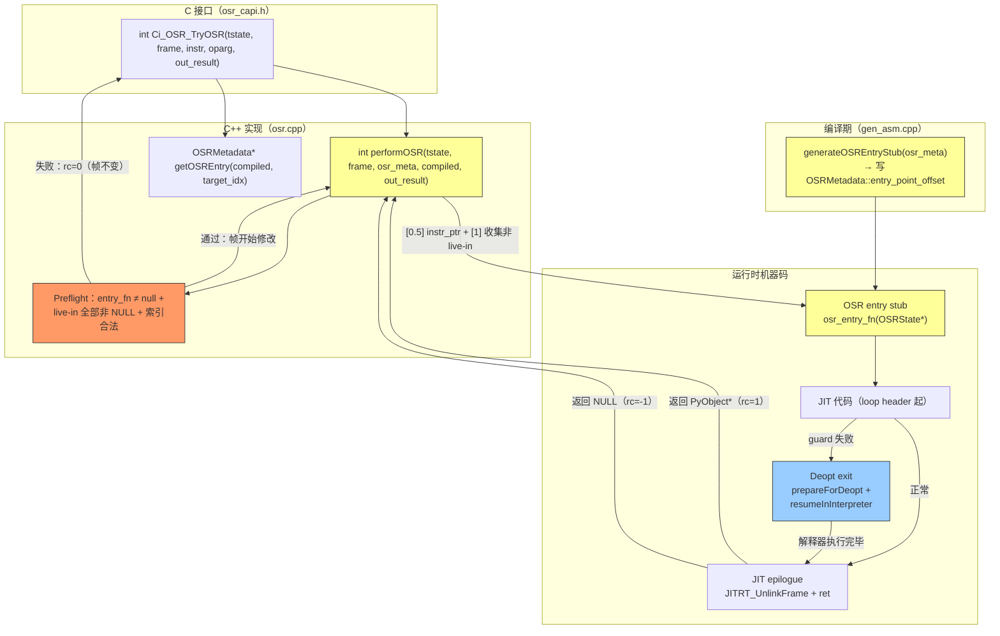

# 详细设计说明书 — OSR 进入（帧状态迁移）

## 产品版本&密级

| 产品 | 版本 | 密级 |
|------|------|------|
| CinderX | 3.14 | 内部公开 |

## 拟制信息

| 角色 | 姓名 | 日期 |
|------|------|------|
| 作者 | Claude Code | 2026-05-21 |

## 修订记录

| 版本 | 日期 | 作者 | 修改概要 |
|------|------|------|---------|
| V1.0 | 2026-05-21 | Claude Code | 初版，基于源码验证编写 |
| V1.1 | 2026-05-21 | Claude Code | 修复 Codex 审查三项问题：(1) stub store 宽度 32→64 位；(2) deferred_decrefs 改动态分配 + preflight 完整性校验；(3) NULL live-in 防护从 Phase 2 提升为 MVP 必须实现 |
| V1.2 | 2026-05-21 | Claude Code | 修复 Codex 二次审查两项问题：(1) OSR_STUB_SCRATCH_REGS 寄存器保留策略，regalloc 排除 X9-X12；(2) preflight 检查移至 instr_ptr 修改之前，保证 rc=0 帧不变契约 |
| V1.3 | 2026-05-21 | Claude Code | 修复 Codex rescue 审查问题：新增 1.2.4 live-in INCREF 与 refcount_insertion 交互；修正 regalloc 生效点为 markDisallowedRegisters；容量改用 distinct localsplus 计算；堆分配移至 instr_ptr 前；架构扩展接口；stub 生成时机精确到 gen_asm.cpp 行号；Mermaid 补全 rc=0/deopt 边 |
| V1.4 | 2026-05-21 | Claude Code | 修复 GitCode Issue #2 评审意见（9 项）——必须修改：(1) 重写 1.2.4 live-in 所有权为 steal 语义，澄清 refcount_insertion 不应对 steal 产物插入多余 INCREF；(2) 补充 SAVE_SP 调用契约 + 操作数栈空校验 + preflight 防御性断言；(3) std::vector 分配失败 try/catch 保护，return 0 在 instr_ptr 修改前；(4) 空 live-in 边界条件增加功能项 2 协调说明；(5) 代码归属改为 ABI 约束，标记功能项 2 实现职责。建议修改：(6) stub callee-saved 补充 VecD d8-d15 保存说明；(7) preflight 防御性断言 JIT_DCHECK；(8) entryPoint 生命周期约束说明；(9) 修正重复编号 1.2.4→1.2.5~1.2.8 |
| V1.5 | 2026-05-21 | Claude Code | 修复 ce-doc-review P0 #1：X10/X11 寄存器冲突——X10=INITIAL_EXTRA_ARGS_REG、X11=INITIAL_TSTATE_REG 不可用于 stub 临时寄存器；OSR_STUB_SCRATCH_REGS 从 X9-X12 收缩为 X9/X12；重写 stub 串行处理策略、live-in steal 步骤、寄存器保留策略、tradeoff 分析、FMEA 表、影响清单、SR 清单 |
| V1.6 | 2026-05-21 | Claude Code | ce-doc-review P2 修复：reifyLocalsplus 兼容性论证补充 freevars 分区分析（OSR steal 覆盖全部 slots 包括 freevars，Ci_STACK_CLEAR/Ci_STACK_XSETREF 对 NULL 安全） |

## Keywords 关键词

OSR, performOSR, OSRState, OSRMetadata, OSRLiveIn, NativeGenerator, OSR entry stub, steal 语义, deferred DECREF, Environ VReg, PhyLocation, _PyStackRef, aarch64

## Abstract 摘要

本文档为功能设计说明书"功能项 3：OSR 进入（帧状态迁移）"的详细设计，聚焦可直接指导编码的接口定义、数据结构、算法流程和汇编级实现细节。

功能项 3 由两个协作组件构成：

**1. `performOSR`（C++ 运行时，`osr.cpp`）**：从 `Ci_OSR_TryOSR` 调用，负责前置校验、非 live-in 清理（延迟 DECREF）、构造 `OSRState`、调用 OSR entry stub、stub 返回后的延迟 DECREF 执行和三态结果报告。

**2. OSR entry stub（机器码，由 `NativeGenerator` 生成）**：每个回边循环头对应一个独立 stub，运行时被 `performOSR` 以 C 函数指针形式调用（`PyObject* osr_entry_fn(OSRState*)`）。Stub 负责建立与 kNormal JIT prologue 完全一致的 native 栈布局、设置 Environ VReg（tstate/frame/func 到 regalloc 分配的物理位置）、从解释器帧 steal live-in 到 JIT 物理寄存器/栈槽，然后直接跳转到 loop header 的 JIT 机器码继续执行。

两个组件通过 `OSRState` 结构传递数据，通过 `OSRMetadata` 共享编译期元数据。所有引用计数管理遵循 **延迟 DECREF 策略**（steal 语义）：非 live-in 槽由 `performOSR` 收集到临时数组后延迟释放；live-in 由 stub steal（写 `PyStackRef_NULL`），使 `localsplus` 进入与 `JITRT_AllocateAndLinkInterpreterFrame` 新分配帧完全相同的初始化状态，保证 deopt `reifyLocalsplus` 的盲写假设成立。

## List of abbreviations 缩略语清单

| 缩略语 | 英文全称 | 中文名 |
|--------|---------|--------|
| OSR | On-Stack Replacement | 栈上替换 |
| JIT | Just-In-Time Compilation | 即时编译 |
| deopt | Deoptimization | 逆优化 |
| ABI | Application Binary Interface | 应用二进制接口 |
| FP | Frame Pointer | 帧指针（aarch64: x29） |
| LR | Link Register | 链接寄存器（aarch64: x30） |
| SP | Stack Pointer | 栈指针（aarch64: sp） |
| DECREF | Decrement Reference Count | 减少引用计数 |
| INCREF | Increment Reference Count | 增加引用计数 |
| steal | — | 引用所有权转移（不 INCREF 不 DECREF） |
| live-in | — | 循环头活跃输入值 |
| HIR | High-level Intermediate Representation | 高级中间表示 |
| LIR | Low-level Intermediate Representation | 低级中间表示 |
| VReg | Virtual Register | 虚拟寄存器 |
| regalloc | Register Allocation | 寄存器分配 |
| MVP | Minimum Viable Product | 最小可行产品 |
| FMEA | Failure Mode and Effects Analysis | 失效模式与影响分析 |
| UAF | Use-After-Free | 释放后使用 |

## 简介

本详细设计聚焦功能项 3 的实现层面，为开发人员提供可直接指导编码的接口定义、数据结构、算法伪代码和汇编级实现细节。

**上游文档**：《OSR 热循环功能设计说明书》（`【功能设计】基于热循环的OSR能力.md`）功能项 3 章节，以及核心契约章节（三态返回约定、帧所有权模型、live-in 引用所有权模型）。

**前置功能项**：功能项 1（热循环检测，提供 `Ci_OSR_TryOSR` 调用入口），功能项 2（OSR 编译，提供 `OSRMetadata`、OSR entry stub 机器码、`has_osr_entries` 标志）。

**源码基线**（截至 2026-05-21）：

| 文件 | 用途 |
|------|------|
| `cinderx/Jit/deopt.cpp:115-183` | `reifyLocalsplus` / `reifyStack`（对称参考） |
| `cinderx/Jit/codegen/gen_asm.cpp:148-388` | `prepareForDeopt` / `resumeInInterpreter` |
| `cinderx/Jit/codegen/autogen.cpp:909-1163` | `translateEpilogueEnd` / `translateSetupFrame` / `translatePrologue` |
| `cinderx/Jit/jit_rt.cpp:575-782` | `JITRT_AllocateAndLinkInterpreterFrame` / `JITRT_UnlinkFrame` |
| `cinderx/Jit/codegen/environ.h:156-159` | `resume_frame_total_size` / `resume_header_and_spill_size` / `resume_saved_regs` |
| `cinderx/Jit/codegen/arch/aarch64.h:311-319` | `CALLEE_SAVE_REGS` / `CALLER_SAVE_REGS` |
| `cinderx/Common/py-portability.h:61,197-224` | `interpFrameFromThreadState` / `Ci_STACK_*` 宏 |
| `cpython/Python/ceval_macros.h:351-361` | `LOAD_IP` / `LOAD_SP` / `SAVE_SP` |
| `cpython/Include/internal/pycore_interpframe.h:101-240` | `_PyFrame_Stackbase` / `_PyFrame_GetStackPointer` / `_PyFrame_SetStackPointer` |
| `cpython/Include/internal/pycore_stackref.h:439-525` | `PyStackRef_NULL_BITS` / `PyStackRef_AsPyObjectSteal` / `BITS_TO_PTR_MASKED` |

---

# 上游文档引用

| 上游文档章节 | 引用内容 |
|------------|---------|
| 核心契约：三态返回约定 | `performOSR` 返回值语义（1=完成，0=未尝试，-1=异常）及字节码处理程序责任 |
| 核心契约：帧所有权模型（kNormal） | F 不被 PopFrame，由 JIT epilogue 负责清理 |
| 核心契约：live-in 引用所有权模型 | steal 语义与 deferred DECREF 策略 |
| 功能项 3：OSRState 结构 | kNormal 简化版：tstate / frame / osr_meta 三字段 |
| 功能项 3：OSR ABI 完整调用/返回约定 | stub 调用约定 / Environ VReg 恢复 / live-in 恢复 / 跳转目标 |
| 功能项 3：performOSR 实现（伪代码） | 四步流程：前置校验 → 收集非 live-in → 调用 stub → 延迟 DECREF |
| 功能项 3：帧链管理 | kNormal 帧链在 OSR 前后的不变量 |
| 功能项 2：OSRMetadata 结构 | stub 所需编译期元数据字段的来源与语义 |
| 功能项 2：功能项 2 → 功能项 3 交付契约 | 功能项 3 依赖的编译产物列表 |
| ADR-4：kNormal OSR 复用 datastack 帧 | 不分配/消耗帧，直接复用解释器帧 F |
| ADR-5：MVP 仅支持 kOwned live-in | kBorrowed live-in 导致整个 entry 被拒绝 |
| ADR-6：live-in 必须使用 steal 语义 | 保证 deopt `reifyLocalsplus` 盲写假设成立 |
| ADR-7：steal 时写入 `PyStackRef_NULL(=1)` 而非零 | `PyStackRef_NULL_BITS = Py_TAG_REFCNT = 1`，不能用 `str xzr` |

---

# 1. 实现设计

## 1.1 实现概述

功能项 3 包含以下四个实现子组件：

| 子组件 | 位置 | 职责 |
|--------|------|------|
| **`OSRState`** | `cinderx/Jit/osr.h` | performOSR 与 stub 之间的数据传递结构 |
| **`performOSR`** | `cinderx/Jit/osr.cpp` | 运行时 OSR 进入入口：校验 + 收集 + 调用 stub + 延迟 DECREF |
| **OSR entry stub ABI 约束** | 功能项 2（OSR 编译）实现生成 | stub 的栈布局、Environ VReg 位置、live-in destination 等编译产物由功能项 2 的 `NativeGenerator` 生成；本功能项定义 ABI 约束和消费接口 |
| **OSR entry stub 内容** | 生成的机器码 | 运行时建立 native 栈 + Environ VReg + steal live-in + jmp |

架构关系如下：

```
Ci_OSR_TryOSR(tstate, frame, instr, oparg, &result)
  └─▶ performOSR(tstate, frame, osr_meta, compiled, &result)
        ├─ [0] 前置校验（帧完全不变，仅读操作）：
        │       ├─ 获取 entry_fn，null → return 0
        │       └─ preflight：live-in 非 NULL + 索引合法，失败 → return 0
        ├─ [0.5] 设置 frame->instr_ptr 到 loop header（首次帧修改，此后不再 return 0）
        ├─ [1] 收集非 live-in slots → deferred_decrefs[]（steal，不 DECREF）
        ├─ [2] osr_entry_fn(&OSRState{tstate, frame, osr_meta})
        │       ├─ stub prologue: stp fp/lr; mov fp, sp; sub sp, sp, #total_size
        │       ├─ stub: 保存 callee-saved（仅 resume_saved_regs 中的）
        │       ├─ stub: 设置 Environ VReg（tstate → tstate_location 等）
        │       ├─ stub: steal live-in（从 F->localsplus[i] 读取 + AND ~Py_TAG_REFCNT + 写 JIT PhyLocation + str PyStackRef_NULL 64-bit）
        │       └─ stub: b .loop_header_N（跳 JIT 代码）
        │              ↓ JIT 执行（正常/deopt/异常三路返回）
        ├─ [3] 延迟 DECREF：释放 deferred_decrefs[]（异常时用 PyErr_Get/Set 保护）
        └─ [4] 三态返回给 Ci_OSR_TryOSR
```

## 1.2 关键算法与流程

### 1.2.1 performOSR 算法

`performOSR` 是 kNormal 模式下 OSR 进入的 C++ 入口，设计要点是**延迟 DECREF 策略**——收集阶段不 DECREF 也不 unlink，确保 entry point 在 stub 调用时必然有效。

```cpp
// cinderx/Jit/osr.cpp — performOSR 详细实现
//
// 字节码处理程序调用契约（Ci_OSR_TryOSR 调用前）：
//   调用者（字节码处理程序 JUMP_BACKWARD_JIT）在调用 Ci_OSR_TryOSR 之前
//   必须执行 SAVE_SP() 将本地 stack_pointer 同步到 frame->stackpointer，
//   因为 performOSR 中的 preflight 检查可能读取 frame->stackpointer
//   （如空操作数栈校验）。如果调用者未 SAVE_SP，frame->stackpointer
//   可能反映过期值，导致校验误判。
//   参考：ceval_macros.h:351-361 SAVE_SP/LOAD_SP 宏定义
//
int performOSR(
    PyThreadState* tstate,
    _PyInterpreterFrame* frame,
    const OSRMetadata* osr_meta,
    const CompiledFunction* compiled,
    PyObject** out_result)
{
  // [0] 前置校验（此时帧完全不变）
  //   所有可能 return 0 的检查必须在此处完成——
  //   rc=0 契约要求帧完全不变（instr_ptr / localsplus / 帧链均不修改）

  // 防御性断言（debug 构建）
  //   out_result 不应为 nullptr（调用者必须提供有效指针）
  //   frame 必须是 tstate->current_frame（保证帧链一致性）
  JIT_DCHECK(out_result != nullptr, "performOSR: out_result is null");
  JIT_DCHECK(tstate->current_frame == frame, "performOSR: frame != tstate->current_frame");

  using OsrEntryFn = PyObject*(*)(OSRState*);
  OsrEntryFn entry_fn =
      reinterpret_cast<OsrEntryFn>(osr_meta->entryPoint(*compiled));
  if (entry_fn == nullptr) {
    return 0;  // 帧完全未修改
  }

  // ── Preflight 校验（帧仍未修改）──
  //   检查所有 live-in slot 非 NULL，以及 localsplus_index 在合法范围内。
  //   必须在修改 instr_ptr 或 localsplus 之前完成，否则 return 0 路径会违反
  //   "帧完全不变"的 rc=0 契约。

  // MVP 空操作数栈校验：
  //   JUMP_BACKWARD_JIT 到达时操作数栈必须为空（stackpointer == Stackbase）
  //   这是功能设计 MVP 约束的一部分（功能项 2 isOSREligible 检查编译期版本）
  //   此处做运行时二次确认，防止编译期分析遗漏
  //   注意：此检查依赖调用者已执行 SAVE_SP()
  if (_PyFrame_GetStackPointer(frame) != _PyFrame_Stackbase(frame)) {
    return 0;  // 操作数栈非空，拒绝 OSR
  }

  int num_nlocalsplus = _PyFrame_GetCode(frame)->co_nlocalsplus;
  for (const auto& li : osr_meta->live_ins) {
    if (li.localsplus_index >= 0) {
      if (li.localsplus_index >= num_nlocalsplus) {
        return 0;  // 索引越界，元数据不一致，拒绝 OSR
      }
      if (PyStackRef_IsNull(frame->localsplus[li.localsplus_index])) {
        return 0;  // live-in 为 NULL（未绑定 local），拒绝 OSR
      }
    }
  }
  // 至此：entry_fn 有效 + 所有 live-in 非 NULL + 索引合法
  // 后续代码不再有 return 0 路径（只有 return 1 或 return -1）

  // [0.75] 预分配所有堆内存（在修改帧状态之前）
  //   理由：std::vector 分配失败时抛出 std::bad_alloc。
  //   如果此时 instr_ptr 或 localsplus 已被修改，无法安全 return 0（帧不变契约）。
  //   因此所有可能失败的分配必须在 instr_ptr 修改之前完成，并用 try/catch
  //   保护——分配失败时 return 0，帧完全不变。
  //   源码参考：code.cpp:213-214 的 code extra 分配也显式处理 nullptr。

  std::vector<bool> is_live_in_set;
  std::vector<PyObject*> deferred_decrefs;
  int distinct_localsplus_live_in = 0;
  int non_live_in_count = 0;

  try {
    // 构建 is_live_in 位集合（按 localsplus_index 索引）
    //   大小由 co_nlocalsplus 决定，保证遍历覆盖全部 [0, nlocalsplus)
    //   使用 std::vector<bool> 动态分配，避免固定上限导致的部分迁移
    is_live_in_set.resize(num_nlocalsplus, false);
    // 计算独立的 localsplus live-in 数量（排除 stack live-in 和重复索引）
    //   live_ins 中可能包含 stack_index != -1 的栈上 live-in（Phase 2），
    //   以及 localsplus_index 相同的多个条目（phi 节点）。
    //   只计数唯一的 localsplus_index 以正确估算容量。
    for (const auto& li : osr_meta->live_ins) {
      if (li.localsplus_index >= 0 && li.localsplus_index < num_nlocalsplus) {
        if (!is_live_in_set[li.localsplus_index]) {
          is_live_in_set[li.localsplus_index] = true;
          distinct_localsplus_live_in++;
        }
      }
    }

    // 动态分配 deferred_decrefs：大小 = nlocalsplus - distinct_localsplus_live_in
    //   保证所有非 live-in slot 都能被收集，不存在截断风险
    //   使用 distinct 计数而非 live_ins.size()，避免栈上 live-in 或重复映射导致越界
    non_live_in_count = num_nlocalsplus - distinct_localsplus_live_in;
    if (non_live_in_count > 0) {
      deferred_decrefs.resize(non_live_in_count);
    }
  } catch (const std::bad_alloc&) {
    return 0;  // 堆分配失败，帧完全不变，回退到解释器执行
  }
  // 至此：所有堆分配完成，后续无可能抛出异常的操作
  // 下一步（[0.5]）修改 instr_ptr 后，不再有 return 0 路径

  // [0.5] 设置 frame->instr_ptr 到 loop header 字节码位置
  //   目的：stub 执行期间及 deopt 观察时，frame 显示正确的字节码位置
  //   安全：此时已通过所有 preflight 检查 + 堆分配完成，不存在 return 0 路径
  //   code_start = PyBytes_AS_STRING(frame->f_executable.bits & ~Py_TAG_REFCNT)
  //              = 等效于 _PyFrame_GetCode(frame) 指向的字节码起始地址
  //   osr_meta->target_offset 是 BCOffset（字节单位），与 _Py_CODEUNIT* 步长一致
  _Py_CODEUNIT* code_start =
      _PyCode_CODE(_PyFrame_GetCode(frame));
  frame->instr_ptr = code_start + osr_meta->target_offset / sizeof(_Py_CODEUNIT);

  // [1] 收集非 live-in slots → deferred_decrefs[]
  //   策略：steal（写 PyStackRef_NULL），不立即 DECREF，不 unlink 帧
  //   理由：不触发任何 Python finalizer，entry point 在 stub 调用时必然有效
  //   注意：PyStackRef_NULL_BITS = Py_TAG_REFCNT = 1（非 GIL 版本）
  //
  //   live-in 集合由 osr_meta->live_ins[] 中 localsplus_index != -1 的条目确定
  //   最多 co_nlocalsplus 个 slot
  int n_deferred = 0;

  for (int i = 0; i < num_nlocalsplus; i++) {
    if (is_live_in_set[i]) {
      continue;  // live-in 槽由 stub 处理（steal + 写 PyStackRef_NULL）
    }
    _PyStackRef slot = frame->localsplus[i];
    if (!PyStackRef_IsNull(slot)) {
      // untag → owned PyObject*，收集到延迟释放数组
      // PyStackRef_AsPyObjectSteal 内部：
      //   mortal（bits & TAG == 0）→ return (PyObject*)bits（owned，无 INCREF）
      //   immortal（bits & TAG == 1）→ Py_NewRef(bits & ~TAG)（INCREF，caller owns）
      deferred_decrefs[n_deferred++] = PyStackRef_AsPyObjectSteal(slot);
    }
    frame->localsplus[i] = PyStackRef_NULL;  // 写 NULL（bits = Py_TAG_REFCNT = 1）
  }

  // [2] 调用 OSR entry stub
  OSRState state{tstate, frame, osr_meta};
  PyObject* result = entry_fn(&state);
  // stub 内部：
  //   prologue → 保存 callee-saved → 设置 Environ VReg → steal live-in → jmp .loop_header
  //   JIT 执行完毕：JITRT_UnlinkFrame → PopFrame(F) → 返回 result（或 NULL+PyErr）

  // [3] 释放延迟的 DECREF（JIT epilogue 已 unlink F，DECREF 安全）
  //   异常保护：result == NULL 时，DECREF 触发 finalizer 可能覆盖当前异常
  //   → 先保存异常，释放完毕后恢复
  PyObject* saved_exc = nullptr;
  if (result == nullptr) {
    saved_exc = PyErr_GetRaisedException();  // 3.12+ API
  }
  for (int i = 0; i < n_deferred; i++) {
    Py_XDECREF(deferred_decrefs[i]);
  }
  if (saved_exc != nullptr) {
    PyErr_SetRaisedException(saved_exc);  // 恢复原始异常
  }

  // [4] 三态返回
  if (result != nullptr) {
    *out_result = result;
    return 1;   // JIT 正常完成（epilogue 已 PopFrame）
  }
  return -1;    // JIT 异常（epilogue 已 PopFrame，PyErr 已设置）
  // rc=0 路径：entry_fn == nullptr 时在 [0] 处已提前 return 0
}
```

### 1.2.2 OSR entry stub 代码生成（NativeGenerator，aarch64）

**触发时机**：在 `NativeGenerator::generateCode()` 的末尾、正常 vectorcall entry 和 deopt exit 生成完成后，为每个 OSR entry block 生成对应的 stub。

**stub 接口**：

```
调用约定: PyObject* osr_entry_fn(OSRState* state)
  参数: state 在 x0（aarch64 ARGUMENT_REGS[0]）
返回: x0 = PyObject*（非 NULL = 正常, NULL = 异常）
```

**stub 结构（aarch64 汇编伪代码）**：

```asm
// stub 入口：每个 OSRMetadata 对应一个独立代码段
// entry_point_offset = (此处代码地址 - codeBuffer 起始) 写入 OSRMetadata::entry_point_offset

osr_entry_stub_N:
// ──────────────────────────────────────────────────────────────
// 步骤 1：建立与 kNormal JIT prologue 完全一致的 native 栈布局
// ──────────────────────────────────────────────────────────────
// 对应 translatePrologue（autogen.cpp:1063-1076）
    stp     fp, lr, [sp, #-16]!    // 分配 frame record，保存 FP/LR
    mov     fp, sp                  // fp = new SP（帧指针）

// 对应 translateSetupFrame（autogen.cpp:1081-1164）
//   sub sp, sp, #resume_frame_total_size
//   (等效拆分为：allocateHeaderAndSpillSpace + saveCalleeSaved)
    sub     sp, sp, #<resume_frame_total_size>

// 保存 resume_saved_regs 中的 callee-saved 寄存器
// 计算 base = fp - resume_header_and_spill_size（start of callee-saved area）
    sub     x13, fp, #<resume_header_and_spill_size>

// ── GP callee-saved 保存 ──
//   示例：resume_saved_regs 包含 {x19, x20, x21, x22}（偶数对用 stp）
    stp     x19, x20, [x13, #-16]  // 保存寄存器对
    stp     x21, x22, [x13, #-32]
    // ... 按 CALLEE_SAVE_REGS 顺序（translateSetupFrame 的 gp_regs 遍历顺序）

// ── VecD callee-saved 保存（d8-d15）──
//   resume_saved_regs 可能包含 d8-d15（aarch64.h:311-319 CALLEE_SAVE_REGS 包含 VecD）
//   必须完整复制 translateSetupFrame 的保存逻辑：
//     for VecD reg in resume_saved_regs（按 d8, d9, ..., d15 顺序）:
//       str dN, [x13, #offset]（8 字节写入，每个 VecD 一个 slot）
//   或当连续 VecD 出现时使用 stp dN, dN+1, [x13, #offset]（16 字节对齐）
//
//   **重要**：如果 resume_saved_regs 包含 VecD 但 stub 未保存，
//   epilogue 恢复时会从错误位置读取 → d8-d15 值损坏 → 调用者浮点状态破坏
//
//   示例（resume_saved_regs 包含 {d8, d9, d10, d11}）：
//     stp     d8, d9, [x13, #<-GP_size - 16]
//     stp     d10, d11, [x13, #<-GP_size - 32]
//
//   实现时必须与 translateSetupFrame（autogen.cpp:1081-1164）完全对称，
//   遍历 resume_saved_regs 中的所有寄存器（GP 和 VecD），按相同顺序和偏移保存

// ──────────────────────────────────────────────────────────────
// 步骤 2：使用 stub 保留寄存器处理 OSRState 解引用
//
//   Stub 保留寄存器集合（OSR_STUB_SCRATCH_REGS）：
//     X9, X12
//
//   **寄存器保留策略**：
//   这两个寄存器在 OSR 编译的 regalloc 阶段被排除在可分配集合之外
//   （等同于 DISALLOWED_REGISTERS 的处理方式），确保 regalloc 永远不会
//   将 Environ VReg 或 live-in 的 PhyLocation 目标分配到这些寄存器。
//   因此 stub 可以安全地使用它们作为临时寄存器，不存在自踩风险。
//
//   **为什么不用 X10/X11**：
//   X10 = INITIAL_EXTRA_ARGS_REG（generator.cpp:233 bindVReg asm_extra_args）
//   X11 = INITIAL_TSTATE_REG（generator.cpp:234 bindVReg asm_tstate）
//   这两个寄存器在正常 JIT prologue 中有约定用途（Environ VReg 初始位置）。
//   虽然 stub 执行时会覆盖这些值（并在 Environ 设置步骤中写入正确值），
//   但将它们加入 disallowed 集合会阻止 regalloc 为其他 VReg 使用 X10/X11，
//   不必要地减少寄存器池。仅使用 X9/X12 足以满足 stub 需求。
//
//   **stub 两寄存器策略**：
//   仅使用 X9（持久状态）和 X12（临时操作），串行处理 Environ 设置和 live-in steal：
//     X9 = state* → 读取各字段后转为 frame 指针 → 转为 localsplus 基地址
//     X12 = 临时：逐个读取 OSRState 字段、AND 操作、PyStackRef_NULL 常量
//
//   不使用 x19-x28（callee-saved，可能超出 JIT body 的 epilogue 恢复范围）
//   架构 scratch x13/x14 已在 DISALLOWED 中（regalloc 不分配），可安全用于
//   load/and 等临时操作（伪汇编中 ldr x13, str x13 等），但不能作为 Environ/live-in
//   目标寄存器
//
//   **实现位置**：在 regalloc 的 `markDisallowedRegisters()`（regalloc.cpp:34-42）
//   中扩展 disallowed 集合。该函数在 regalloc 线性扫描阶段读取
//   DISALLOWED_REGISTERS 常量并标记寄存器为不可用。
//   OSR 编译路径需将该函数改为接受参数化的 disallowed 集合：
//     void markDisallowedRegisters(std::vector<LIRLocation>& locs,
//                                  PhyRegisterSet extra_disallowed = {});
//   OSR 编译时传入 extra_disallowed = OSR_STUB_SCRATCH_REGS。
//   注意：`computeFrameInfo()` 在 regalloc 完成后才运行（gen_asm.cpp:1185），
//   不能在那里设置寄存器保留——必须发生在 regalloc 之前或期间。
//
//   **tradeoff**：OSR 编译的函数少 2 个 caller-saved GP 寄存器（X9/X12），
//   对绝大多数函数无影响。若 regalloc 因寄存器不足失败，
//   OSR entry 会被自然拒绝（entry_point_offset = -1），回退到解释器执行。
// ──────────────────────────────────────────────────────────────
// x0 = OSRState* = state（函数入参）
    mov     x9, x0                  // x9 = state*（持久）

// 串行读取 state 字段（OSRState 布局：tstate + frame + osr_meta，各 8 字节）
//   每次读取后立即写入 Environ 目标位置，然后 X12 可重用

// ──────────────────────────────────────────────────────────────
// 步骤 3：设置 Environ VReg（tstate / frame / func → PhyLocation）
//
//   osr_meta->tstate_location / func_location / frame_location
//   存储 regalloc 后的物理位置（PhyLocation）
//
//   PhyLocation 分派（is_memory() = loc < 0）：
//     is_register() → mov Xdst, Xsrc
//     is_memory()   → str Xsrc, [fp, #loc]（loc 是 FP 相对偏移，负值）
//
//   **安全保证**：由于 OSR_STUB_SCRATCH_REGS(X9/X12) 在 regalloc 中被排除，
//   tstate_location / func_location / frame_location 的目标寄存器
//   不可能是 X9 或 X12，因此写入不会覆盖 stub 的临时值。
//
//   **串行处理**：使用 X12 作为唯一临时寄存器，逐个处理 Environ VReg。
//   每步完成后 X12 可重用。frame 在需要时从 frame_location 重载
//   （或直接从 X9 重读 state->frame）。
// ──────────────────────────────────────────────────────────────

// 设置 asm_tstate
    ldr     x12, [x9, #0]           // X12 = state->tstate
    // emit_set_environ(X12, tstate_location)
    // 示例：tstate_location = X19
    mov     x19, x12                // asm_tstate_reg = tstate

// 设置 asm_interpreter_frame
    ldr     x12, [x9, #8]           // X12 = state->frame（= F）
    // emit_set_environ(X12, frame_location)
    // 示例：frame_location 是栈槽 -8
    str     x12, [fp, #-8]          // spill frame ptr to stack slot

// 设置 asm_func——需要 frame 来读 f_funcobj
//   重用 X9（state* 不再需要）：加载 frame → 读取 f_funcobj
    ldr     x9, [x9, #8]           // X9 = state->frame（重载到 X9，X9 改持 frame 指针）
    ldr     x12, [x9, #<offsetof(_PyInterpreterFrame, f_funcobj)>]
    and     x12, x12, #~1           // 剥离 Py_TAG_REFCNT 标记位
    // emit_set_environ(X12, func_location)
    // 示例：func_location = X20
    mov     x20, x12                // asm_func_reg = func

// ──────────────────────────────────────────────────────────────
// 步骤 4：steal live-in（从 F->localsplus 读取 → PhyLocation）
//
//   对每个 OSRLiveIn li in osr_meta->live_ins：
//     1. 读取 F->localsplus[li.localsplus_index]（_PyStackRef.bits）
//     2. AND ~Py_TAG_REFCNT 剥离标记位，得到 PyObject*
//        （非 free-threading：BITS_TO_PTR_MASKED = bits & ~1）
//     3. 写入 li.destination（PhyLocation）
//        is_register() → mov Xdst, Xval
//        is_memory()   → str Xval, [fp, #loc]
//     4. 写 PyStackRef_NULL（= Py_TAG_REFCNT = 1）到 F->localsplus[i]
//        str Xone, [x11, #<localsplus_offset + i*8>]（必须 64 位写入！）
//        注意：PyStackRef_NULL.bits = 1（NOT 0），必须显式写 1
//              不能用 str xzr（零寄存器），否则 PyStackRef_IsNull 检查失败
//              不能用 str w10（32 位），_PyStackRef 是 8 字节 union，
//              32 位 store 残留高 4 字节 → PyStackRef_IsNull(bits==1) 失败
//
//   **安全保证**：由于 OSR_STUB_SCRATCH_REGS(X9/X12) 在 regalloc 中被排除，
//   li.destination 的目标寄存器不可能是 X9 或 X12。
//   Stub 的 localsplus 基地址（X9）和 PyStackRef_NULL 常量（X12）不会被 live-in 写入覆盖。
// ──────────────────────────────────────────────────────────────

// 预加载 localsplus 基地址和 PyStackRef_NULL 常量
//   复用 X9（此时 state* 已不再需要）作为 localsplus 基地址
    ldr     x9, [x9, #8]           // X9 = state->frame（重载 frame 指针）
    add     x9, x9, #<offsetof(_PyInterpreterFrame, localsplus)>  // X9 = &F->localsplus[0]
    mov     x12, #1                 // X12 = PyStackRef_NULL_BITS = Py_TAG_REFCNT = 1
                                    // 注意：必须用 64 位 x12 而非 w12
                                    // _PyStackRef 是 8 字节 union（uintptr_t bits）
                                    // 32 位 str w12 只覆盖低 4 字节，高 4 字节残留
                                    // 后续 PyStackRef_IsNull(bits == 1) 检查失败 → UAF

// 示例：li[0] = {localsplus_index=0, destination=X21, ref_kind=kOwned}
    ldr     x13, [x9, #0]           // 读取 localsplus[0].bits（_PyStackRef）
    and     x21, x13, #~1           // AND ~Py_TAG_REFCNT → PyObject*（steal）
    str     x12, [x9, #0]           // localsplus[0] = PyStackRef_NULL（64-bit 写入 bits=1）

// 示例：li[1] = {localsplus_index=1, destination=StackSlot(-16), ref_kind=kOwned}
    ldr     x13, [x9, #8]           // 读取 localsplus[1].bits
    and     x13, x13, #~1           // AND ~Py_TAG_REFCNT
    str     x13, [fp, #-16]         // 写入栈槽 FP-16
    str     x12, [x9, #8]           // localsplus[1] = PyStackRef_NULL（64-bit 写入）

// ──────────────────────────────────────────────────────────────
// 步骤 5：跳转到 loop header 的 JIT 代码
// ──────────────────────────────────────────────────────────────
    b       .loop_header_N          // 直接跳，不是调用（bl）
                                    // JIT 代码从 loop header 开始执行

// ──────────────────────────────────────────────────────────────
// 返回路径（由 JIT epilogue 的 translateEpilogueEnd 生成）
// ──────────────────────────────────────────────────────────────
// .hard_exit_label:                // translateEpilogueEnd（autogen.cpp:990-1056）
//   恢复 callee-saved（从固定 FP 相对偏移，与 stub 保存顺序/位置一致）
//   mov sp, fp
//   ldp fp, lr, [sp], #16
//   ret lr
// → 返回 x0 = PyObject*（非 NULL = 正常返回，NULL = 异常）
```

**为什么 stub 必须复制 kNormal JIT prologue 布局**：

deopt exit 和 epilogue 的 `hard_exit_label` 从固定的 FP 相对偏移恢复 callee-saved（autogen.cpp:990-1056）。FP 由 prologue 的 `mov fp, sp` 设置。如果 stub 使用不同的栈布局，epilogue 会从错误位置读取 callee-saved → 寄存器值损坏 → ABI 违反。

`resume_frame_total_size`、`resume_header_and_spill_size`、`resume_saved_regs` 三个字段（由 `NativeGenerator::computeFrameInfo()` 计算后写入 `Environ`，再写入 `OSRMetadata`）完整描述了正常 JIT prologue 的栈布局，stub 必须完全复制这个布局。

### 1.2.3 live-in steal 语义的 _PyStackRef 转换细节

非 free-threading（MVP 唯一支持的模式）下 `_PyStackRef` 的 bits 字段布局（pycore_stackref.h:439-525）：

```
mortal 对象：   bits = (uintptr_t)obj          // TAG 位 = 0
immortal 对象： bits = (uintptr_t)obj | 1      // TAG 位 = Py_TAG_REFCNT = 1
NULL：          bits = 1                        // PyStackRef_NULL_BITS = 1
```

提取 `PyObject*` 的公式：`PyObject* obj = (PyObject*)(bits & ~1)`（即 `BITS_TO_PTR_MASKED`）。

在 stub 中用单条 `and xDst, xSrc, #~1` 指令（aarch64 AND with NOT 立即数）完成。

**三种 slot 状态的处理**：

| slot 状态 | bits | AND ~1 结果 | steal 后写入 localsplus | 是否允许 |
|-----------|------|------------|------------------------|---------|
| mortal PyObject* | `(uintptr_t)obj` | `obj`（正确） | `PyStackRef_NULL`（bits=1） | 允许 |
| immortal PyObject* | `(uintptr_t)obj \| 1` | `obj`（正确） | `PyStackRef_NULL`（bits=1） | 允许 |
| NULL | `1` | `0`（nullptr） | — | **拒绝进入 OSR** |

**NULL live-in 防护（MVP 必须实现，不延迟到 Phase 2）**：

NULL 情况：`AND ~1` 结果为 0，即 `nullptr`。JIT `refcount_insertion` 对 kOwned live-in 执行 INCREF——对 `nullptr` 执行 `Py_INCREF(nullptr)` 是 UB（CPython 3.14 断言 `_Py_REFCNT(obj) >= 0`，`_Py_INCREF_STAT` 追踪也会失败）。

MVP 采用**两层防护**，确保 NULL live-in 不会进入 JIT 代码：

1. **编译期**：`extractOSRLiveIns`（功能项 2）在构建 OSRMetadata 时，对 HIR 中需要 `LOAD_FAST_CHECK` 保护的变量（即可能未绑定的 local）设置 `reconstructible=false`，使整个 OSR entry 被永久拒绝。这通过分析 loop header 的 FrameState 中每个 local 的 definite-assignment 状态实现。

2. **运行时 preflight**：`performOSR` 在步骤 [1] 修改任何 `localsplus` slot 之前，遍历 `osr_meta->live_ins`，检查每个 `localsplus_index >= 0` 的 slot 是否为 `PyStackRef_NULL`。发现任何 NULL slot 立即 `return 0`（帧完全不变，字节码处理程序走 fallthrough 路径继续解释执行）。这是编译期分析的最后一道运行时防线，覆盖：
   - 编译期无法静态证明 definite-assignment 的边界情况
   - 含 cell/freevar 的复杂作用域
   - 通过 `del local_name` 在运行时置 NULL 的情况

**与 `performOSR` 收集非 live-in 的区别**：`performOSR` 使用 `PyStackRef_AsPyObjectSteal()`（mortal → 直接返回裸指针作为 owned ref；immortal/NULL → `Py_NewRef(BITS_TO_PTR_MASKED)` INCREF 再返回）。Stub 使用 `AND ~1` 纯取位操作，不 INCREF——live-in 通过 steal 语义获得 owned ref（refcount 不变），JIT 退出/deopt 时 `releaseRefs` 负责释放。两种转换路径互补，覆盖所有 slot 类型。

### 1.2.4 live-in 引用所有权与 steal 语义

**核心语义**：stub 对 live-in 执行 steal 操作——从 `F->localsplus[i]` 读取 `_PyStackRef.bits`，AND ~1 提取 `PyObject*`，写入 JIT PhyLocation（寄存器或栈槽），然后将 `PyStackRef_NULL(=1)` 写回源 slot。Steal 意味着**引用所有权从 localsplus 转移到 JIT 目标位置**，不执行 INCREF 也不执行 DECREF。这与 `PyStackRef_AsPyObjectSteal` 的语义一致——调用者获得 owned ref，源 slot 被置 NULL。

**为什么 steal 不需要额外 INCREF**：

在解释器帧中，`localsplus[i]` 持有一个 owned ref（由 LOAD_FAST / STORE_NAME 等字节码保证）。Stub 执行 steal 后：
1. 源 slot 被写为 `PyStackRef_NULL`，解释器不再持有该 ref
2. JIT PhyLocation 获得裸 `PyObject*`（AND ~1 的结果），所有权已转移
3. 此时 JIT 代码拥有该 ref，refcount 不变（steal = 不 INCREF 不 DECREF）

**JIT 侧引用计数管理**：

JIT body 通过两个机制管理 live-in 的引用计数：
- **正常退出路径**：`translateEpilogueEnd` 中的 `releaseRefs` 对 `kOwned` live_values 执行 DECREF，释放所有权
- **Deopt 路径**：`prepareForDeopt` 中的 `releaseRefs` 同样对 `kOwned` live_values 执行 DECREF

这两条路径都假设 JIT 代码持有 owned ref。Steal 语义保证了这一点——refcount 从解释器帧到 JIT 代码是 1:1 转移，不存在泄漏。

**`refcount_insertion` pass 与 OSR 的关系**：

`refcount_insertion` pass 是 JIT 编译管道的一部分，在 HIR 层面为整个函数（包括 OSR entry）插入 `IncRef` / `DecRef` 指令。对于 OSR entry edge，pass 在 loop header 入口处观察到 live-in 寄存器的 refcount 状态，可能插入额外的 `IncRef`。

然而，stub 的 steal 语义独立于 `refcount_insertion`——stub 写入 JIT 位置的值已经是 owned ref（steal 获得）。如果 `refcount_insertion` 额外插入 `IncRef`，会导致引用计数泄漏（多一次 INCREF，但 releaseRefs 只 DECREF 一次）。

**因此，必须确保 `refcount_insertion` 不在 OSR entry 处为 steal 产生的 owned ref 插入多余的 INCREF。** 实现方式：在 `extractOSRLiveIns` 中，将每个 live-in 的 HIR `Register` 的初始 refcount 状态标记为 owned（而非 borrowed），使 refcount pass 知道这些值已经持有 owned ref，无需额外 INCREF。具体机制：

1. **HIR 层面**：`OSREntry` 是编译期 metadata anchor，插入在 loop header block 的 Snapshot 之后。它**不新增 HIR CFG 外部前驱**（compile-detailed-design 3.2.6），不改变普通函数入口或普通 JIT loop backedge 的控制流。`OSREntry` 继承 `DeoptBase`，通过 `bindGuards()` 获得与 Snapshot 相同的 `FrameState`（包括 `live_regs` 及其 `RefKind`）。

2. **Phi 消除**：`RefcountInsertion::Run()` 首先调用 `PhiElimination{}.Run(func)` 消除 phi，建立统一的数据流。Phi 消除后，loop header 入口处每个 live-in 有确定的 refcount 状态。

3. **OSR entry 处的 refcount 状态**：`extractOSRLiveIns` 在 `refcount_insertion` pass 之后运行（编译流水线顺序：markOSREntries → runPasses[含 RefcountInsertion] → extractOSRLiveIns），读到的 `RefKind` 是 refcount pass 填充的最终结果。MVP 只接受 `kOwned`——这意味着该 live-in 在 loop header 处已经被 refcount_insertion 的数据流分析确认为 owned（由前序 guard/STORE_FAST 等产生），refcount pass **不会为已 owned 的值插入额外 INCREF**。Steal 语义与此一致：stub steal 获得的 ref 与 JIT 侧 refcount 分析的 owned 状态匹配，不会产生重复 INCREF。

4. **与正常函数入口的对称性**：正常函数入口通过 `JITRT_AllocateAndLinkInterpreterFrame` 创建 owned ref（`PyStackRef_FromPyObjectNew` 内部 INCREF）。OSR 入口通过 stub steal 获得 owned ref（无 INCREF）。两者最终在 JIT body 入口处持有相同的引用所有权状态，但路径不同——正常入口 INCREF 创建新 ref，OSR steal 转移现有 ref。

**编译期验证**：`extractOSRLiveIns` 必须将每个 live-in 的 `ref_kind` 设为 `kOwned`（MVP 不支持 kBorrowed，ADR-5），使 JIT 代码在退出和 deopt 时正确 DECREF。如果错误地设为 `kBorrowed`，`releaseRefs` 不会 DECREF → 引用泄漏（refcount 永远不会归零）。

### 1.2.5 Environ VReg 恢复逻辑

JIT body 通过三个固定 Environ VReg 访问运行时数据（environ.h:116-119）：

```cpp
jit::lir::Instruction* asm_tstate{nullptr};            // PyThreadState*
jit::lir::Instruction* asm_func{nullptr};              // PyFunctionObject*（f_funcobj）
jit::lir::Instruction* asm_interpreter_frame{nullptr}; // _PyInterpreterFrame*（帧指针 F）
```

正常函数 prologue（`JITRT_AllocateAndLinkInterpreterFrame` 之后）将这三个值写入 regalloc 分配的物理位置。OSR stub 跳过了正常 prologue，因此必须在 stub 内重建这三个值。

从 `OSRMetadata` 读取编译期确定的物理位置（`tstate_location`、`func_location`、`frame_location`），然后按 `PhyLocation::is_register()` / `is_memory()` 分派写入：

```
// PhyLocation 分派逻辑（C++ 伪代码，在 NativeGenerator 中生成对应汇编）
auto emit_set_environ = [&](arch::Gp value_reg, PhyLocation dest) {
  if (dest.is_register()) {
    // dest 是 GP 寄存器
    as->mov(a64::x(dest.loc), value_reg);
  } else {
    // dest 是栈槽（loc < 0，FP 相对偏移）
    as->str(value_reg, a64::ptr(arch::fp, dest.loc));
  }
};
```

`asm_func` 对应的值来源于 `F->f_funcobj`（`_PyStackRef` 类型），需要 AND ~1 提取 `PyFunctionObject*`，然后按上述逻辑写入 `func_location`。

### 1.2.6 NativeGenerator 中 OSR stub 的生成时机

在 `NativeGenerator::generateCode()` 的汇编代码生成阶段（gen_asm.cpp:1313-1417），完整的生成顺序为：

1. **`generateAssemblyBody()`**（gen_asm.cpp:1314）：主代码体（vectorcall entry + kSetupFrame + kOSREntry pseudo + HIR body）
2. **Static entry point**（gen_asm.cpp:1325）：静态入口（如适用）
3. **Correct argument count entry**（gen_asm.cpp:1335）：参数校验入口
4. **`generateEpilogue()`**（gen_asm.cpp:1354）：epilogue 代码（hard_exit_label + callee-saved 恢复）
5. **Static typecheck failure stub**（gen_asm.cpp:1357-1398）
6. **Prologue exit stub**（gen_asm.cpp:1405-1408）
7. **Boxed-return wrapper**（gen_asm.cpp:1412-1415）
8. **`generateDeoptExits()`**（gen_asm.cpp:1417）：deopt exit 代码
9. **OSR stubs 生成**（**新增**，在 deopt exits 之后、常量池之前）：遍历 `irfunc_->osrEntries()`，为每个 OSR entry BasicBlock 调用 `generateOSREntryStub(osr_meta)`
10. **常量池 / asmjit finalize**：asmjit 的 `CodeHolder::finalize()` 解析所有前向引用（包括 OSR stub 的 `b .loop_header_N`），生成最终机器码

**`entry_point_offset` 记录**：`generateOSREntryStub` 在调用前记录当前 asmjit cursor 的偏移作为 `entry_point_offset`，写入 `OSRMetadata`。此时 asmjit 尚未 finalize，偏移量是相对于 CodeHolder 缓冲区起始的内部偏移，finalize 后保持一致。

**与 `.loop_header_N` 标签的绑定**：stub 末尾的 `b .loop_header_N` 需要跳转到 HIR loop header block 在 asmjit 中对应的 `asmjit::Label`，该 Label 在步骤 1 的 `generateAssemblyBody()` 中已创建（由 `env_.block_label_map` 查找）。OSR stub 的 `b` 指令使用 asmjit 前向引用，在步骤 10 的 `finalize()` 中解析。

### 1.2.7 OSRMetadata::entryPoint 实现

```cpp
// cinderx/Jit/osr.h
void* OSRMetadata::entryPoint(const CompiledFunction& cf) const {
  if (entry_point_offset < 0) {
    return nullptr;
  }
  const std::byte* base = cf.codeBuffer().data();
  return const_cast<std::byte*>(base) + entry_point_offset;
}
```

`codeBuffer()` 返回编译完成后的机器码缓冲区（`CompiledFunctionData::code` 字段，类型 `std::span<const std::byte>`）。`entry_point_offset` 是 stub 代码距缓冲区起始的字节偏移，由 `NativeGenerator` 在生成 stub 前确定。

**生命周期约束**：`performOSR` 从 `entryPoint()` 获取函数指针到 stub 执行完毕（`entry_fn` 返回），期间 `CompiledFunction`（持有 `codeBuffer`）和 `CodeRuntime`（持有 `osr_metadatas_`）必须保持存活。在 CinderX 当前架构中，`CompiledFunction` 和 `CodeRuntime` 由 JIT 缓存管理，只要代码对象未被修改（code Modified），它们就不会被回收。`performOSR` 的调用发生在 `Ci_OSR_TryOSR` 中，而 `Ci_OSR_TryOSR` 是在字节码处理程序的同步执行路径上，此时 GIL 持有且代码对象引用稳定。因此生命周期约束在现有架构下自然满足，无需额外保护。

### 1.2.8 OSR stub 寄存器保留策略

**问题背景**：Stub 使用 X9 和 X12 作为临时寄存器（X9 为持久状态/localsplus 基地址，X12 为临时操作/PyStackRef_NULL 常量）。X10 和 X11 不可用（X10 = `INITIAL_EXTRA_ARGS_REG`，X11 = `INITIAL_TSTATE_REG`，均在 generator.cpp:233-234 通过 `bindVReg` 绑定），但不将 X10/X11 纳入 disallowed 集合以保留更大的寄存器池。X9/X12 属于 `CALLER_SAVE_REGS`（aarch64.h:321），regalloc 可以将它们分配为 Environ VReg 或 live-in 的 PhyLocation 目标寄存器。如果某个 `tstate_location` 或 `li.destination` 落在 X9/X12，stub 的 `mov/str` 写入会覆盖自身还在使用的临时值 → 后续 live-in 读写错槽、localsplus 清零错误。

**解决方案**：在 OSR 编译的 regalloc 阶段将 X9/X12 加入 `DISALLOWED` 集合，使 regalloc 不可能将这两个寄存器分配为任何 VReg 的物理位置。

```cpp
// cinderx/Jit/codegen/arch/aarch64.h 新增

// OSR stub 保留的临时寄存器（aarch64）
// 仅 X9（持久状态/localsplus 基地址）和 X12（临时操作/NULL 常量）
// X10/X11 分别绑定为 INITIAL_EXTRA_ARGS_REG/INITIAL_TSTATE_REG，
// 但它们仍可用于 regalloc 分配，不纳入 disallowed 集合
constexpr PhyRegisterSet OSR_STUB_SCRATCH_REGS =
    PhyRegisterSet(X9) | PhyRegisterSet(X12);
```

**生效位置**：在 `markDisallowedRegisters()`（regalloc.cpp:34-42）中实现。当前该函数直接读取 `DISALLOWED_REGISTERS` 常量（行 35）。需改为接受参数化的额外 disallowed 集合：

```cpp
// regalloc.cpp 修改
void markDisallowedRegisters(
    std::vector<LIRLocation>& locs,
    PhyRegisterSet extra_disallowed = {}) {   // 新增参数
  auto disallowed_registers = DISALLOWED_REGISTERS | extra_disallowed;
  while (!disallowed_registers.Empty()) {
    auto reg = disallowed_registers.GetFirst();
    disallowed_registers.RemoveFirst();
    locs[reg.loc] = START_LOCATION;
  }
}

// 调用侧（regalloc.cpp:796 附近）
PhyRegisterSet extra;
if (has_osr_entries) {
  extra = OSR_STUB_SCRATCH_REGS;
}
markDisallowedRegisters(locs, extra);
```

**注意时序**：`markDisallowedRegisters` 在 regalloc 线性扫描期间执行（regalloc.cpp:796），而 `computeFrameInfo()` 在 regalloc 完成后才运行（gen_asm.cpp:1185）。因此寄存器保留必须在 regalloc 层面完成，不能依赖 codegen 后期的 `computeFrameInfo()`。

**编译期验证**：`generateOSREntryStub` 在生成 stub 代码前，断言所有 PhyLocation 目标不在 `OSR_STUB_SCRATCH_REGS` 中：

```cpp
// generateOSREntryStub 中的防御性断言
auto assert_not_stub_scratch = [](PhyLocation loc, const char* name) {
  if (loc.is_register()) {
    assert(!OSR_STUB_SCRATCH_REGS.Has(loc) &&
           "Environ VReg / live-in destination conflicts with stub scratch register");
  }
};
assert_not_stub_scratch(osr_meta->tstate_location, "tstate");
assert_not_stub_scratch(osr_meta->func_location, "func");
assert_not_stub_scratch(osr_meta->frame_location, "frame");
for (const auto& li : osr_meta->live_ins) {
  assert_not_stub_scratch(li.destination, "live-in");
}
```

**tradeoff 分析**：OSR 编译的函数少 2 个 caller-saved GP 寄存器（X9/X12）。aarch64 `ALL_GP_REGISTERS` = 32（X0-X30+XZR），`DISALLOWED` GP = 6（X29/X30/XZR/X13/X14/X16），`INIT_REGISTERS` GP = 26，`CALLEE_SAVE` GP = 10（X19-X28），减去 stub 保留（2 个：X9/X12），仍有 14 个可分配 GP 寄存器 + 全部浮点寄存器。对绝大多数 Python 函数无影响。若极端情况下 regalloc 因寄存器压力过大失败，OSR entry 会被自然拒绝（`entry_point_offset = -1`），函数回退到正常 JIT 执行（无 OSR 加速）。

**对非 OSR 编译无影响**：`OSR_STUB_SCRATCH_REGS` 仅在 `has_osr_entries == true` 的函数中生效。普通 JIT 编译路径使用标准 `DISALLOWED_REGISTERS`，寄存器池不受影响。

**架构扩展性**：当前定义针对 aarch64。Phase 2 增加 x86_64 支持时，应在 `arch.h`（非 arch-specific 头文件）定义统一的接口：

```cpp
// cinderx/Jit/codegen/arch.h（架构无关接口）
PhyRegisterSet GetOSRStubScratchRegs();  // 由各 arch 实现
```

各架构在对应的 `arch/aarch64.h`、`arch/x86_64.h` 中实现，返回该架构 stub 使用的临时寄存器集合。`markDisallowedRegisters` 的 `extra_disallowed` 参数传递此集合。这避免在 regalloc 或 stub 生成代码中硬编码架构特定常量。

## 1.3 行为模型

### 1.3.1 正常流程

#### 流程 1：OSR 进入，JIT 正常执行并返回（rc=1）

```
解释器 JUMP_BACKWARD_JIT 回边计数 ≥ 阈值
  → Ci_OSR_TryOSR(tstate, frame=F, instr, oparg, &result)
      → performOSR(tstate, F, osr_meta, compiled, &result)
          [0] 前置校验（帧不变）：entry_fn 非 NULL + live-in 全部非 NULL + 索引合法
          [0.5] F->instr_ptr = loop_header 字节码位置（首次帧修改）
          [1] 收集非 live-in → deferred_decrefs[](steal)，F->localsplus[i] 置 NULL
          [2] result = entry_fn(&OSRState{tstate, F, osr_meta})
                stub prologue: stp fp/lr; mov fp, sp; sub sp; 保存 callee-saved
                stub: 设置 Environ VReg（tstate/frame/func → PhyLocation）
                stub: steal live-in（read + AND ~1 + write PhyLocation + str PyStackRef_NULL 64-bit）
                stub: b .loop_header_N
                [JIT 热循环执行中...]
                JIT epilogue: JITRT_UnlinkFrame → setCurrentFrame(tstate, F.previous)
                              → jitFrameClearExceptCode(F)
                              → Cix_PyThreadState_PopFrame(F)
                              translateEpilogueEnd: 恢复 callee-saved + ldp fp/lr + ret
                result = PyObject*（非 NULL）
          [3] deferred_decrefs 释放（F 已 unlink，DECREF 安全）
          [4] return 1
      → Ci_OSR_TryOSR: *out_result = result; return 1
  → _JIT 字节码处理程序：
      _Py_LeaveRecursiveCallPy(tstate)
      frame = tstate->current_frame  // = F.previous（caller 帧）
      LOAD_SP(); LOAD_IP(frame->return_offset)  // 恢复 caller 的 sp/ip
      push(result); DISPATCH()
```

**关键时序约束**：JITRT_UnlinkFrame（jit_rt.cpp:757-782）先 `setCurrentFrame(tstate, frame->previous)`，再 `jitFrameClearExceptCode(frame)`，再 `Cix_PyThreadState_PopFrame(tstate, frame)`。此时序确保 F 的引用计数在清理时不再是 `tstate->current_frame`，满足 frame.cpp:656-658 不变量。`performOSR` 步骤 [3] 的延迟 DECREF 在 JIT epilogue 已返回后执行，此时 F 已被 PopFrame，安全。

#### 流程 2：OSR 进入后 JIT deopt，解释器运行到函数结束（rc=1 或 rc=-1）

```
[JIT 热循环执行中，guard 失败]
  → stage1 trampoline: push deopt_meta_index
  → stage2 trampoline: 保存 CodeRuntime* + epilogue_addr
  → 全局 deopt trampoline: 保存所有 GP 寄存器到 regs[] 数组
  → prepareForDeopt(regs, code_runtime, deopt_idx)
      → reifyFrame: 从 DeoptMetadata 恢复 F 的 instr_ptr/localsplus/stackpointer
          reifyLocalsplus: 对 live slot: STACK_STEAL(mem.readOwned()) [盲写，假设 slots 初始为 NULL ✓]
          reifyStack: 恢复操作数栈
      → releaseRefs(meta, mem): 对 kOwned live_values 执行 DECREF
      → setCurrentFrame(tstate, F->previous)
  → resumeInInterpreter(F, code_runtime, deopt_idx, err_occurred)
      → _PyEval_EvalFrame(tstate, F, err_occurred)
          → 解释器从 guard 点字节码继续执行到函数结束
          → RETURN_VALUE / exit_unwind → _PyEval_FrameClearAndPop(F)
          → 返回 PyObject*（正常）或 NULL（异常）
  → epilogue translateEpilogueEnd: 恢复 callee-saved + ret
  → result 返回给 performOSR 的 entry_fn 调用
  → performOSR [3]: 释放 deferred_decrefs（F 已由 _PyEval_FrameClearAndPop 清理）
  → 返回 rc=1（正常）或 rc=-1（异常）
```

**`reifyLocalsplus` 兼容性保证**（deopt.cpp:115-149）：
- 对 locals（`[0, free_offset)` 范围）：dead slot → `Ci_STACK_NULL`（盲写 NULL）；live slot → `mem.readOwned() + Ci_STACK_STEAL`（盲写，不 DECREF 旧值）
- 对 freevars（`[free_offset, nlocalsplus)` 范围）：dead slot → `Ci_STACK_CLEAR`（DECREF + 写 NULL）；live slot → `Ci_STACK_XSETREF`（DECREF 旧值 + 写新值）
- OSR 的 steal 语义确保：所有 slot 已置 NULL（非 live-in 由 performOSR 清零，live-in 由 stub steal 清零）→ `Ci_STACK_STEAL` 和 `Ci_STACK_NULL` 的盲写假设成立，`Ci_STACK_CLEAR` 对 NULL 安全（Py_CLEAR 对 NULL 无操作），`Ci_STACK_XSETREF` 对 NULL 旧值安全（DECREF NULL 无操作 + 写新值）
- **freevars 分区说明**：OSR steal 覆盖 `[0, co_nlocalsplus)` 全部 slots（包括 freevars），不受 locals/cellvars/freevars 分区影响。deopt `reifyLocalsplus` 对 freevars 使用 `Ci_STACK_CLEAR`/`Ci_STACK_XSETREF`（含 DECREF），而 OSR steal 写入的 `PyStackRef_NULL` 使旧值为 NULL，DECREF NULL 无操作。因此 freevars 分区的 DECREF 语义与 OSR steal 完全兼容

### 1.3.2 异常流程

#### 异常流程 1：JIT 代码直接抛出异常（rc=-1）

JIT 代码在未触发 guard deopt 的情况下通过正常异常路径退出（如 `CALL_INTRINSIC_1` 引发的 Python 异常）。JIT epilogue 仍执行 `JITRT_UnlinkFrame` → `PopFrame(F)`，然后 `ret x0=NULL`（`PyErr` 已设置）。`performOSR` 收到 `result == NULL`，进入延迟 DECREF（带异常保护），返回 rc=-1。

字节码处理程序处理 rc=-1 时：`_Py_LeaveRecursiveCallPy(tstate)` → 恢复 `frame = tstate->current_frame`（= F.previous）→ 根据 `frame->owner` 判断是否顶层函数（见功能设计的三态返回约定）。

#### 异常流程 2：entry_fn 为 nullptr 或 preflight 失败（rc=0）

所有 rc=0 路径在步骤 [0] 中完成（`frame->instr_ptr` 修改之前），严格保证帧不变：
- `osr_meta->entryPoint(compiled)` 返回 nullptr（`entry_point_offset < 0`，编译时此 entry 被拒绝）
- live-in preflight 发现 `PyStackRef_NULL`（未绑定 local）
- `localsplus_index` 越界（`>= co_nlocalsplus`，元数据不一致）

帧完全未修改，返回 rc=0，字节码处理程序走 `osr_skip` fallthrough 路径。

#### 异常流程 3：`deferred_decrefs` 中的 DECREF 触发 finalizer 设置异常

在 `result == nullptr` 路径，步骤 [3] 调用 `Py_XDECREF` 可能触发对象 `__del__` → `PyErr_NoMemory()` 等，覆盖原始异常。`performOSR` 通过 `PyErr_GetRaisedException()` 保存原始异常，`Py_XDECREF` 执行完毕后 `PyErr_SetRaisedException()` 恢复。这与 CPython 的 `_PyEval_FrameClearAndPop` 中的异常保护模式对称。

## 1.4 数据模型

### 1.4.1 数据结构定义

#### OSRState

```cpp
// cinderx/Jit/osr.h — 新增

struct OSRState {
  PyThreadState* tstate;              // 当前线程状态
  _PyInterpreterFrame* frame;         // 解释器帧 F（datastack 上，= tstate->current_frame）
  const OSRMetadata* osr_meta;        // 编译期元数据（live-in 映射 + 栈布局参数）
};

// 在 osr_capi.h 中提供 C 可见的前向声明：
// typedef struct OSRState_s OSRState;
```

`OSRState` 生命周期：在 `performOSR` 栈上分配，传递给 stub 后不持有超过 stub 执行期。Stub 通过 x0（第一个参数寄存器，aarch64）接收指针，读取完字段后不再引用。

#### OSRLiveIn

```cpp
// cinderx/Jit/osr.h — 新增

struct OSRLiveIn {
  int localsplus_index{-1};    // 源：F->localsplus[] 索引（-1 = 不在 localsplus）
  int stack_index{-1};         // 源：操作数栈索引（MVP 始终为 -1，空栈约束）
  codegen::PhyLocation destination;   // 目标：JIT 物理位置（regalloc 后回填）
  hir::ValueKind value_kind;   // MVP 仅 kObject
  hir::RefKind ref_kind;       // MVP 仅 kOwned
  bool reconstructible{true};  // 可从 FrameState 重建
  bool is_phi{false};          // 是否 SSA phi 节点（loop header 的 phi 输出）
  // 编译期临时，不写入最终产物：
  hir::Register* hir_reg{nullptr};  // 对应 HIR Register*
};
```

#### OSRMetadata

```cpp
// cinderx/Jit/osr.h — 新增

struct OSRMetadata {
  BCOffset target_offset;               // 循环头字节码偏移（BCOffset = 字节单位）
  FrozenList<OSRLiveIn> live_ins;        // live-in 映射列表（regalloc 后回填 destination）
  int owned_ref_count{0};               // kOwned live-in 计数（用于 debug 验证）
  ptrdiff_t entry_point_offset{-1};     // stub 代码在 codeBuffer 中的字节偏移（-1 = 无效）

  // Environ VReg 物理位置（regalloc 后确定）
  codegen::PhyLocation tstate_location;
  codegen::PhyLocation func_location;
  codegen::PhyLocation frame_location;

  // Stub prologue 帧布局参数（与 kNormal JIT prologue 完全一致）
  //   来源：NativeGenerator::computeFrameInfo() 计算后存入 Environ，再写入此处
  int32_t resume_frame_total_size{0};          // Environ::resume_frame_total_size
  int32_t resume_header_and_spill_size{0};     // Environ::resume_header_and_spill_size
  codegen::PhyRegisterSet resume_saved_regs;   // Environ::resume_saved_regs（= env_.changed_regs & CALLEE_SAVE_REGS）

  void* entryPoint(const CompiledFunction& cf) const;
  bool allReconstructible() const;
};
```

#### OSRLiveIn 物理位置（destination）的来源

`destination` 字段在三阶段流水线的第三阶段（regalloc 后）由 `fillOSRLiveInLocations()` 回填：

```
阶段 1（markOSREntries）：插入 kOSREntry pseudo instruction，destination 留空占位
阶段 2（extractOSRLiveIns）：从 FrameState 提取 live-in Register*，destination 仍为空
阶段 3（regalloc 后 fillOSRLiveInLocations）：
    kOSREntry pseudo instruction 携带 live-in HIR 寄存器作为 LIR operand
    → regalloc 重写为 PhyLocation
    → fillOSRLiveInLocations 遍历 live_ins[]，从 LIR operand 回填 destination
```

这与 `DeoptMetadata::live_values[i].location` 的回填路径完全对称（autogen.cpp 中 `fillDeoptLiveLocations` 的处理模式）。

### 1.4.2 数据流转

```
编译期（NativeGenerator + regalloc）：
  OSREntry HIR 锚点（含 FrameState）
    → extractOSRLiveIns: Register* + RefKind + ValueKind + localsplus_index
    → kOSREntry LIR pseudo instruction（携带 live-in VReg operand）
    → regalloc: VReg → PhyLocation
    → fillOSRLiveInLocations: 回填 OSRLiveIn::destination
  computeFrameInfo()
    → Environ::resume_frame_total_size / resume_header_and_spill_size / resume_saved_regs
    → OSRMetadata::resume_*（写入）
  代码生成 generateOSREntryStub：
    → OSRMetadata::entry_point_offset（stub 起始偏移写入）

运行时（performOSR + stub）：
  _PyInterpreterFrame* F（datastack 上，tstate->current_frame）
    → performOSR [1]: localsplus[i]（非 live-in）→ deferred_decrefs[]（steal）→ 写 NULL
    → stub step 4: localsplus[li.localsplus_index]（live-in）
                   AND ~Py_TAG_REFCNT → PyObject*
                   → li.destination（PhyLocation，寄存器或栈槽）
                   → 写 PyStackRef_NULL（bits=1）到 localsplus[i]

返回路径（JIT epilogue）：
  JITRT_UnlinkFrame → setCurrentFrame(previous) → jitFrameClearExceptCode → PopFrame
  → result 返回给 entry_fn 调用者（performOSR）
  → performOSR [3]: deferred_decrefs[] 中的 PyObject* 逐一 Py_XDECREF
```

## 1.5 接口设计

### 1.5.1 内部接口关系图



### 1.5.2 接口定义

#### performOSR（C++ 内部接口）

```cpp
// cinderx/Jit/osr.cpp

// 三态返回：1=完成（JIT epilogue 已 PopFrame），0=未尝试（帧不变），-1=异常（JIT epilogue 已 PopFrame）
// 前提：tstate->current_frame == frame，frame 在 datastack 上，OSRMetadata 有效
// rc=0 保证：帧完全不变（instr_ptr / localsplus / 帧链均未修改），
//   所有可能 return 0 的检查（entry_fn null、live-in NULL、索引越界）
//   在修改任何帧状态之前完成
// 副作用（仅 rc=1 或 rc=-1）：非 live-in slots 被清零（steal + deferred DECREF），
//   live-in 由 stub steal，frame->instr_ptr 被设置到 loop header 位置
int performOSR(
    PyThreadState* tstate,
    _PyInterpreterFrame* frame,
    const OSRMetadata* osr_meta,
    const CompiledFunction* compiled,
    PyObject** out_result);
```

#### OSRMetadata::entryPoint

```cpp
// cinderx/Jit/osr.h

// 返回 OSR entry stub 的绝对地址（可作为函数指针调用）
// cf.codeBuffer().data() + entry_point_offset
// entry_point_offset < 0 时返回 nullptr
void* OSRMetadata::entryPoint(const CompiledFunction& cf) const;
```

#### NativeGenerator::generateOSREntryStub（新增私有方法）

```cpp
// cinderx/Jit/codegen/gen_asm.h — NativeGenerator 私有方法

// 为单个 OSR entry BasicBlock 生成汇编 stub
// 调用前 as_->cursor() 即为 stub 起始位置
// 调用后写入 osr_meta->entry_point_offset（= stub 起始距 codeBuffer 的偏移）
void generateOSREntryStub(OSRMetadata* osr_meta, asmjit::Label loop_header_label);
```

#### fillOSRLiveInLocations（新增，在 autogen.cpp 或 gen_asm.cpp 中）

```cpp
// cinderx/Jit/codegen/autogen.cpp 或 gen_asm.cpp

// regalloc 完成后，从 kOSREntry pseudo instruction 的 LIR operand 回填 destination
// 与 fillDeoptLiveLocations（现有）完全对称
void fillOSRLiveInLocations(const lir::Function& lir_func,
                             std::vector<OSRMetadata>& osr_metadatas);
```

### 1.5.3 OSR entry stub 的调用约定文档

**调用者（performOSR）合同**：
- 调用前：`F->localsplus` 中所有非 live-in slots 已被清零（steal + 写 PyStackRef_NULL）
- 调用前：`F->instr_ptr` 已设置到 loop header 字节码位置
- 调用前：`F` 仍是 `tstate->current_frame`（JIT epilogue 负责 PopFrame）
- 参数：`x0 = &OSRState{tstate, frame=F, osr_meta}`（aarch64 calling convention）

**stub 内部合同**：
- 建立与 `resume_frame_total_size` / `resume_header_and_spill_size` / `resume_saved_regs` 完全一致的 native 栈布局
- 设置所有 Environ VReg 到 `osr_meta` 记录的物理位置
- 对每个 `live_ins[i]`：从 `F->localsplus[localsplus_index]` steal（AND ~1 + 写 destination + str PyStackRef_NULL 64-bit），无 DECREF，无 bl 调用
- 跳转到 loop header（`b`，不是 `bl`）

**返回值合同**：
- 非 NULL：JIT 正常完成（或 deopt 后解释器正常完成），JIT epilogue 已 PopFrame(F)
- NULL：JIT 异常退出（PyErr 已设置），JIT epilogue 已 PopFrame(F)
- **不存在** NULL + 无 PyErr 的情况（`resumeInInterpreter` → `_PyEval_EvalFrame` 保证）

---

# 2. DFX 分析

## 2.1 可靠性分析

### 2.1.1 FMEA 分析

| 失效模式 | 影响 | 原因 | 检测手段 | 补偿措施 |
|---------|------|------|---------|---------|
| stub 栈布局与 JIT prologue 不一致 | epilogue 恢复错误 callee-saved → 寄存器值损坏 → UAF / crash | `resume_*` 字段计算错误或 stub 生成未完全复制 | Debug 构建断言 / ASAN | `resume_*` 三字段从同一 `computeFrameInfo()` 结果写入 OSRMetadata，stub 生成用相同字段 |
| live-in destination 错误 | JIT body 读取错误值 → 语义错误 | `fillOSRLiveInLocations` 与 regalloc 不一致 | Debug 构建：OSR 进入后立即触发 deopt，比较帧状态 | kOSREntry LIR operand 经 regalloc 后与正常 VReg 用同一路径确定 PhyLocation |
| non-live-in slot 未清零 | deopt `reifyLocalsplus` 盲写泄漏解释器引用 | performOSR 收集循环遗漏 slot | ASAN refcount 追踪 | 遍历 `[0, co_nlocalsplus)` 全部 slot，依据 `is_live_in_set` 过滤 |
| PyStackRef_NULL 写入错误值 | `PyStackRef_IsNull` 检查失败，或解引用 NULL | 两种独立错误模式：(a) `str xzr` 写入 0 而非 bits=1（PyStackRef_NULL_BITS=1，非 0），`PyStackRef_IsNull(bits==1)` 检查失败；(b) 32 位 `str w10` 只写低 4 字节，高 4 字节残留旧值，`_PyStackRef` 是 8 字节 union，后续 `PyStackRef_IsNull` 检查失败 | Debug 构建 `PyStackRef_CheckValid` 断言；ASAN 检测损坏 bits 被误认为对象指针 | 用 `mov x10, #1; str x10, [base, offset]` 写完整 8 字节 bits=1（64 位写入） |
| deferred_decrefs 异常未保护 | 当前 Python 异常被 finalizer 覆盖 | result==NULL 时未保存/恢复异常 | Python 异常类型不符合预期 | `PyErr_GetRaisedException()` 保存 → DECREF 循环 → `PyErr_SetRaisedException()` 恢复 |
| 循环头有非空操作数栈 | stub steal 遗漏栈上值 → deopt 恢复操作数栈不一致 | `isOSREligible` 检查失效 | `frame->stackpointer != _PyFrame_Stackbase(frame)` 运行时断言 | `isOSREligible` 拒绝 `stackpointer != _PyFrame_Stackbase(frame)`（pycore_interpframe.h:101） |
| frame->instr_ptr 未设置 | 调试器/tracing 显示错误行号 | performOSR [0.5] 步骤遗漏 | sys._getframe().f_lineno 验证 | performOSR 在调用 stub 前设置 instr_ptr |
| kBorrowed live-in 进入 OSR | deopt releaseRefs 不释放 kBorrowed → 内存泄漏 | `extractOSRLiveIns` 未正确拒绝 kBorrowed | ASAN refcount 追踪 | extractOSRLiveIns 对 kBorrowed 设 `reconstructible=false`，整个 entry 被拒绝（ADR-5） |
| stub 临时寄存器与 regalloc 目标冲突 | stub 覆盖自身临时值（state*/localsplus_base/NULL_const）→ live-in 读写错槽 → 崩溃/UAF | regalloc 将 Environ VReg 或 live-in destination 分配到 X9/X12（stub 保留的临时寄存器） | `generateOSREntryStub` 中的 `assert_not_stub_scratch` 断言；Debug 构建验证 | regalloc 阶段将 `OSR_STUB_SCRATCH_REGS(X9/X12)` 加入 disallowed 集合，从根源排除冲突 |

### 2.1.2 边界条件

| 条件 | 处理 |
|------|------|
| `osr_meta->live_ins` 为空（无 live-in） | performOSR 收集全部 nlocalsplus 个 slot；stub 只做 prologue + Environ VReg + jmp，不 steal 任何值。**注意**：功能项 2（OSR 编译）的 `extractOSRLiveIns` 可能在特定情况下产生空 live-in 列表（如循环头无活跃变量），此时 entry 仍然有效——stub 跳过 steal 步骤直接 jmp。这与功能项 2 的实现需协调：`extractOSRLiveIns` 不应以"live-in 为空"为由拒绝整个 OSR entry |
| `co_nlocalsplus == 0` | 收集循环立即退出，n_deferred=0；stub 无 steal 操作 |
| 所有 slot 均为 PyStackRef_NULL | 收集循环跳过 NULL slot（`PyStackRef_IsNull` 检查），n_deferred=0；但 preflight 检查发现 live-in 为 NULL → return 0（拒绝 OSR） |
| stub 内 jmp 到 loop_header 时 FP 相关访问越界 | 由 `resume_frame_total_size` 保证 native 栈足够大，与 JIT body 的 spill 假设一致 |

## 2.2 可服务性分析

- Debug 构建提供 OSR 帧状态验证模式：OSR 进入后立即触发 deopt，比较 `F->localsplus` 恢复后的值与预期一致性
- `[OSR]` 日志前缀：`JIT_LOG("[OSR] performOSR: func={}, target_offset={}, live_ins={}", ...)`
- ASAN / TSAN 测试覆盖：deferred DECREF + steal 路径、deopt 后引用计数平衡
- 新增计数器：`osr_entry_count`（OSR 成功进入次数）、`osr_deopt_count`（OSR 后 deopt 次数），通过 `cinderx.jit` 模块查看

## 2.3 安全设计检查

### 2.3.1 安全设计确认

引用计数管理是本功能项的核心安全点。以下设计保证内存安全：

1. **无泄漏**：每个 `PyObject*` 在 `performOSR` 离开时恰好经历一次 DECREF（非 live-in 在步骤 [3] 释放；live-in 由 stub steal 转移 ownership 到 JIT，JIT 退出/deopt 时 `releaseRefs` 负责释放）
2. **无 double-free**：steal 语义保证每个 slot 只有一个 owner；performOSR 与 stub 分工明确（performOSR 只收集非 live-in，stub 只 steal live-in）
3. **无 UAF**：延迟 DECREF 在 JIT epilogue 已 PopFrame 之后执行；stub 内无 DECREF 操作，避免在帧链中 F 还是 current_frame 时触发 finalizer

### 2.3.2 敏感操作检查

- `Py_XDECREF` 调用在 performOSR 步骤 [3] 中，此时持有 GIL（正常 CPython 解释器环境），无并发风险
- MVP 不支持 free-threading（`isOSREligible` 拒绝 `#ifdef Py_GIL_DISABLED`），无需考虑跨线程 refcount

## 2.4 可用性/性能分析

**performOSR 运行时开销**（一次性 overhead，在 OSR 进入时发生一次）：
- 前置校验：1 次指针解引用（`entryPoint`）
- 收集非 live-in：O(co_nlocalsplus) 次 `PyStackRef_IsNull` + 条件分支 + slot 写 NULL
- Stub 执行：`sub sp + 保存 callee-saved + N 次 ldr/and/str（live-in steal）+ b`
- 延迟 DECREF：O(co_nlocalsplus - live_in_count) 次 `Py_XDECREF`

典型函数（10 个 locals，2 个 live-in）：stub 约 15-25 条指令（~10-15ns）。整个 OSR 进入包括 `performOSR` 约 1-5μs（含 Python 层 overhead）。这是一次性开销，在后续 JIT 执行的热循环收益中可以快速摊还。

---

# 3. 影响点列表

| 模块 | 文件 | 影响描述 |
|------|------|---------|
| OSR 运行时 | `cinderx/Jit/osr.h`（新增） | `OSRState`、`OSRLiveIn`、`OSRMetadata` 结构定义；`performOSR` 声明 |
| OSR 运行时 | `cinderx/Jit/osr.cpp`（新增） | `performOSR` 实现；`OSRMetadata::entryPoint` 实现 |
| Codegen | `cinderx/Jit/codegen/gen_asm.h` | `NativeGenerator` 新增 `generateOSREntryStub` 私有方法（**功能项 2 实现**，本功能项定义 ABI 约束） |
| Codegen | `cinderx/Jit/codegen/gen_asm.cpp` | `generateCode()` 中新增 OSR stub 生成循环；`generateOSREntryStub` 实现（prologue + Environ VReg + steal + jmp）；`fillOSRLiveInLocations` 实现（**功能项 2 实现**，本功能项定义 stub 对 `OSRMetadata` 各字段的使用契约） |
| Regalloc | `cinderx/Jit/codegen/arch/aarch64.h` | 新增 `OSR_STUB_SCRATCH_REGS` 常量（X9/X12），OSR 编译时加入 disallowed 集合（**功能项 2 实现**，本功能项定义 stub 临时寄存器的保留需求） |
| HIR Function | `cinderx/Jit/hir/function.h` | 新增 `markOSREntries()`、`isOSREntry()`、`extractOSRLiveIns()`（由功能项 2 定义，本功能项消费） |
| CodeRuntime | `cinderx/Jit/code_runtime.h` | 新增 `addOSRMetadata()`、`osrMetadatas()`、`hasOSREntries()`、`osr_metadatas_`（由功能项 2 定义，本功能项消费） |
| CompiledFunction | `cinderx/Jit/compiled_function.h` | `CompiledFunctionData` 新增 `has_osr_entries` 标记（由功能项 2 定义，本功能项消费） |
| Frame 管理 | `cinderx/Jit/jit_rt.cpp` | `JITRT_UnlinkFrame` 无修改（OSR 复用现有帧清理路径） |
| Deopt | `cinderx/Jit/deopt.h`, `deopt.cpp` | 无修改（OSR deopt 复用现有路径，见功能项 4） |

---

# 4. 增量 SR 清单

| SR 编号 | 描述 | 对应源文件 |
|---------|------|----------|
| SR-OSR-009 | `OSRState` 结构定义（tstate + frame + osr_meta，kNormal 简化版） | `osr.h` |
| SR-OSR-010 | `performOSR()` 四步算法：前置校验 + 收集非 live-in（deferred DECREF）+ 调用 stub + 延迟 DECREF + 三态返回 | `osr.cpp` |
| SR-OSR-011 | `generateOSREntryStub`：prologue（stp fp/lr + mov fp/sp + sub sp）+ callee-saved 保存（按 `resume_saved_regs`）+ Environ VReg 恢复（PhyLocation 分派）+ live-in steal（AND ~Py_TAG_REFCNT + str PyStackRef_NULL 64-bit）+ b .loop_header | `gen_asm.cpp` |
| SR-OSR-012 | `fillOSRLiveInLocations`：regalloc 后从 kOSREntry LIR operand 回填 `OSRLiveIn::destination` | `autogen.cpp` 或 `gen_asm.cpp` |
| SR-OSR-013 | live-in 引用计数管理：steal 语义（performOSR 收集延迟 DECREF；stub AND ~1 steal 无 DECREF/INCREF，ownership 转移到 JIT；JIT 退出/deopt 时 releaseRefs DECREF；refcount_insertion 不应对 steal 产物插入多余 INCREF） | `osr.cpp`, `gen_asm.cpp` |
| SR-OSR-014 | `OSRMetadata` 存储在 `CodeRuntime::osr_metadatas_`，与 `DeoptMetadata` 对称 | `code_runtime.h`, `osr.h` |
| SR-OSR-015 | `OSRMetadata::entry_point_offset` per-backedge 存储 + `OSRMetadata::entryPoint()` 实现 | `osr.h`, `osr.cpp` |
| SR-OSR-016 | OSR deopt 路径验证：确认 OSR 进入的 JIT 代码与正常 kNormal JIT 代码共享相同的 deopt 路径（不需要修改 deopt 代码） | `gen_asm.cpp`, `deopt.cpp`（验证测试） |
| SR-OSR-017 | `OSR_STUB_SCRATCH_REGS`（X9/X12）寄存器保留：regalloc 阶段排除 stub 临时寄存器 + `generateOSREntryStub` 防御性断言 | `aarch64.h`, `regalloc.cpp`, `gen_asm.cpp` |
| SR-OSR-018 | `performOSR` preflight 时序：所有可能 return 0 的检查（entry_fn null、live-in NULL）必须在修改 `frame->instr_ptr` 之前完成，保证 rc=0 帧不变契约 | `osr.cpp` |

---

# 5. 分配需求

| 需求编号 | 描述 |
|---------|------|
| REQ-OSR-003 | 系统应能将解释器帧状态安全迁移到 JIT 代码中执行 |

---

# 附录：关键源码位置索引

| 源码位置 | 用途 |
|---------|------|
| `cinderx/Jit/jit_rt.cpp:575-598` | `allocate_and_link_interpreter_frame`：理解 kNormal 帧初始化状态（localsplus 清零） |
| `cinderx/Jit/jit_rt.cpp:757-782` | `JITRT_UnlinkFrame`：OSR 的帧清理路径（setCurrentFrame + jitFrameClearExceptCode + PopFrame） |
| `cinderx/Jit/codegen/autogen.cpp:909-1060` | `translateEpilogueEnd`：epilogue 的 callee-saved 恢复顺序和 FP 相对偏移（stub 必须与其一致） |
| `cinderx/Jit/codegen/autogen.cpp:1063-1076` | `translatePrologue`：kNormal JIT prologue 的 `stp fp/lr + mov fp/sp`（stub 复制此结构） |
| `cinderx/Jit/codegen/autogen.cpp:1081-1164` | `translateSetupFrame`：kNormal JIT 的 `sub sp + callee-saved 保存`（stub 复制此结构） |
| `cinderx/Jit/codegen/environ.h:156-159` | `resume_frame_total_size` / `resume_header_and_spill_size` / `resume_saved_regs` 字段 |
| `cinderx/Jit/codegen/arch/aarch64.h:311-319` | `CALLEE_SAVE_REGS`（x19-x28, d8-d15）/ `CALLER_SAVE_REGS`（用于 stub 选择临时寄存器） |
| `cinderx/Jit/deopt.cpp:115-149` | `reifyLocalsplus`：对 slot 的盲写假设（OSR steal 语义保证此假设成立） |
| `cinderx/Jit/deopt.cpp:366-380` | `releaseRefs`：对 kOwned live_values DECREF（不释放 kBorrowed，OSR ADR-5 的根本原因） |
| `cinderx/Common/py-portability.h:197-224` | `Ci_STACK_*` 宏（`Ci_STACK_STEAL` / `Ci_STACK_NULL`，kNormal 模式下 localsplus 写操作） |
| `cpython/Python/ceval_macros.h:351-361` | `LOAD_IP` / `LOAD_SP` / `SAVE_SP`（字节码处理程序恢复 caller frame 的状态） |
| `cpython/Include/internal/pycore_interpframe.h:101` | `_PyFrame_Stackbase`：空操作数栈检查基准（`stackpointer != _PyFrame_Stackbase(frame)` 拒绝非空栈） |
| `cpython/Include/internal/pycore_interpframe.h:222-240` | `_PyFrame_GetStackPointer` / `_PyFrame_SetStackPointer`：debug 构建置 NULL 行为（SAVE_SP/LOAD_SP 配对约束） |
| `cpython/Include/internal/pycore_stackref.h:439-525` | `PyStackRef_NULL_BITS=1` / `BITS_TO_PTR_MASKED` / `PyStackRef_AsPyObjectSteal`：stub AND ~1 的理论基础 |
