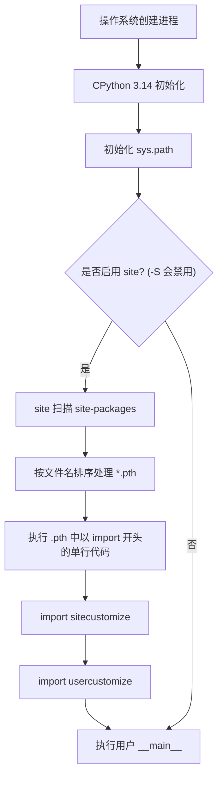

## 产品版本&密级

| 产品版本 | 密级 |
| -------- | ---- |
| V1.0     | 公开 |

## 拟制信息

| 角色     | 姓名         | 日期       |
| -------- |------------| ---------- |
| 拟制人   | @jiabiao_o | 2026-05-15 |
| 审核人   |            |            |
| 批准人   |            |            |

## 修订记录

| 版本 | 日期       | 修订人 | 修订内容     |
| ---- | ---------- | ------ | ------------ |
| V1.0 | 2026-05-15 |        | 初始版本     |

## Keywords 关键词

CinderX, auto import, .pth, site.py, CPython 3.14, 帧解释器, 自动注入, site-packages

## Abstract 摘要

本文档详细描述了 CinderX 在 CPython 3.14 启动过程中通过 `.pth` 文件实现自动导入（auto import）的设计方案。该方案利用 Python `site` 模块在启动时自动扫描 `site-packages/*.pth` 的机制，在用户代码执行前完成 CinderX JIT 帧解释器的注入。同时通过 `CINDERX_PLUGIN_ENABLE` 环境变量提供可控开关，实现最小改动的自动注入能力。

## List of abbreviations 缩略语清单

| 缩略语 | 全称                        | 说明                           |
| ------ | --------------------------- | ------------------------------ |
| .pth   | Path configuration file     | Python 路径配置文件            |
| site   | site module                 | Python 标准库中的 site 模块    |

## 简介

CinderX 需要在用户代码执行之前完成插件的自动import。理解注入时机的前提是理解 Python 的完整启动流程。CPython 3.14 在启动时会自动执行 `import site`（除非使用 `python -S` 禁用），site 模块会扫描 `site-packages` 目录下的 `.pth` 文件，并执行其中以 `import` 开头的行。本方案利用这一机制，在 `.pth` 文件中触发 CinderX 的自动导入，从而在用户代码执行前完成 JIT 帧解释器的注入。

## 上游文档引用

| 文档名称 | 版本 | 说明 |
| -------- | ---- | ---- |
| CPython 3.14 site 模块文档 | -    | site.py 启动机制参考 |

## 实现设计

### 设计目标

在当前 `.pth` 方案基础上，增加对 `CINDERX_PLUGIN_ENABLE` 环境变量的检查，实现可控开关。用户通过 `pip install` 安装 CinderX 后，设置环境变量 `CINDERX_PLUGIN_ENABLE=1` 即可自动启用 JIT，无需修改任何用户代码。

### 架构图

```
Python 启动
    │
    ▼
site.py 自动导入
    │
    ▼
扫描 site-packages/*.pth
    │
    ▼
发现 cinderx.pth ──▶ 执行 .pth 中的代码
    │
    ▼
┌──────────────────────────────────────┐
│  import os                           │
│  if os.environ.get(                  │
│      "CINDERX_PLUGIN_ENABLE") == "1":│
│      import cinderx                  │
│      cinderx.jit.auto()              │
└──────────────────────────────────────┘
    │
    ▼
用户代码执行（JIT 已就绪）
```

### 注入时机

```
Python 启动时间线:
[Py_Initialize] → [site.py] → [.pth 处理] ← 注入点 → [sitecustomize] → [usercustomize] → [用户代码]
```

## 实现概述

本方案由两个核心文件组成：

1. **`cinderx/PythonLib/cinderx.pth`**：放置在 `site-packages` 目录下的 `.pth` 文件，内容为单行 `import _cinderx_auto`，由 site 模块在启动时自动执行。
2. **`cinderx/PythonLib/_cinderx_auto.py`**：实际的自动导入逻辑模块，负责检查环境变量并执行 CinderX 的导入和 JIT 启用。

安装方式：通过 `pip install` 将上述两个文件安装到 `site-packages` 目录，卸载即失效。

## 关键算法与流程

### CPython 3.14 启动时序

```text
Python 启动
    │
    ▼
import site   ← 自动执行，除非 python -S
    │
    ├── 1. 计算 site-packages 路径
    │       系统级: /usr/lib/python3.12/site-packages/
    │       用户级: ~/.local/lib/python3.12/site-packages/
    │
    ├── 2. 把这些路径加到 sys.path 末尾
    │       sys.path = [
    │           "",                          ← 当前目录
    │           "/usr/lib/python3.12/...",   ← 标准库
    │           "/usr/lib/python3.12/site-packages/",  ← ★ site 加的
    │           "~/.local/lib/python3.12/site-packages/",
    │       ]
    │
    ├── 3. 处理 .pth 文件
    │       扫描 site-packages 下所有 .pth 文件
    │       - 普通行: 追加到 sys.path
    │       - import 开头的行: exec() 执行
    │
    ├── 4. import sitecustomize（如果存在）
    │
    ├── 5. import usercustomize（如果存在）
    │
    └── 6. 设置 quit/exit 等内置帮助（交互模式）
```


### 自动导入决策流程

```
启动 → site 扫描 .pth → 执行 import _cinderx_auto
    → _should_enable() 检查 CINDERX_PLUGIN_ENABLE
        ├── ≠ "1" → 直接返回，不启用 JIT
        └── = "1" → import cinderx → cinderx.jit.auto() → JIT 就绪
```

## 行为模型



## 正常流程

1. 用户通过 `pip install cinderx` 安装 CinderX，`cinderx.pth` 和 `_cinderx_auto.py` 被放置到 `site-packages` 目录。
2. 用户设置环境变量 `CINDERX_PLUGIN_ENABLE=1`。
3. 用户正常启动 Python 程序（如 `python app.py`）。
4. CPython 启动，自动执行 `import site`。
5. site 模块扫描 `site-packages` 目录，按文件名排序处理 `.pth` 文件。
6. 发现 `cinderx.pth`（建议使用 `00_cinderx.pth` 前缀以抢占优先位置），执行其中的 `import _cinderx_auto`。
7. `_cinderx_auto.py` 被加载，`_try_enable()` 函数执行。
8. `_should_enable()` 检查到 `CINDERX_PLUGIN_ENABLE=1`，返回 `True`。
9. 执行 `import cinderx`。
10. 用户代码开始执行。

## 异常流程

### 异常场景一：python -S 跳过 site 模块

- **触发条件**：用户使用 `python -S` 启动，跳过整个 site 模块。
- **表现**：`.pth` 文件不会被处理，CinderX 不会被自动导入。
- **处理**：这是 `.pth` 方案的已知盲区，无法规避。用户需手动 `import cinderx; cinderx.jit.auto()`。

### 异常场景二：CINDERX_PLUGIN_ENABLE 未设置或不为 "1"

- **触发条件**：环境变量 `CINDERX_PLUGIN_ENABLE` 未设置，或值不为 `"1"`。
- **表现**：`_should_enable()` 返回 `False`，`_try_enable()` 直接返回，CinderX 不会被导入。
- **处理**：符合预期，这是可控开关的设计目标。

### 异常场景三：cinderx 模块导入失败

- **触发条件**：`import cinderx` 抛出异常（如模块未安装完整、依赖缺失等）。
- **表现**：异常被 `try/except` 捕获，静默失败。
- **处理**：当前方案为静默失败，不利于排查问题。建议后续版本补充 runtime warning 输出。

### 异常场景四：.pth 文件执行顺序问题

- **触发条件**：其他 `.pth` 文件在 `cinderx.pth` 之前执行，且依赖了 CinderX 的帧解释器。
- **表现**：先执行的 `.pth` 代码运行在原始帧解释器上。
- **处理**：使用 `00_` 前缀命名 `cinderx.pth`，确保其在所有 `.pth` 文件中优先执行。

## 数据模型

### 环境变量

| 变量名                   | 类型   | 默认值 | 说明                                              |
| ------------------------ | ------ | ------ | ------------------------------------------------- |
| `CINDERX_PLUGIN_ENABLE` | string | `"0"`  | 值为 `"1"` 时启用 CinderX 自动导入，其他值均不启用 |

## 数据结构定义

### cinderx.pth 文件

- **路径**：`<site-packages>/cinderx.pth`（建议命名为 `00_cinderx.pth`）
- **格式**：纯文本，每行一个路径或 `import` 语句
- **内容**：
  ```
  import _cinderx_auto
  ```
- **约束**：可执行行必须是单行，复杂逻辑应放到被调用的模块中。

### _cinderx_auto.py 模块

- **路径**：`<site-packages>/_cinderx_auto.py`
- **职责**：检查环境变量并执行 CinderX 自动导入
- **对外接口**：无（模块加载时自动执行）

## 数据流转

```
环境变量 CINDERX_PLUGIN_ENABLE
    │
    ▼
_cinderx_auto._should_enable()  ← 读取环境变量
    │
    ├── False → 流程终止
    │
    └── True
          │
          ▼
      import cinderx  ← 导入 CinderX 模块
          │
          ▼
      cinderx.jit.auto()  ← 替换帧解释器
          │
          ▼
      用户代码执行（JIT 已就绪）
```

## 接口设计

### 外部接口

本方案不对外暴露编程接口。自动导入行为完全由环境变量 `CINDERX_PLUGIN_ENABLE` 控制。

| 接口名称             | 类型       | 说明                            |
| -------------------- | ---------- | ------------------------------- |
| CINDERX_PLUGIN_ENABLE | 环境变量   | 值为 `"1"` 时启用自动导入       |
| cinderx.pth          | 文件接口   | site 模块自动发现并执行的入口    |

## 内部接口设计

`_cinderx_auto.py` 模块内部包含两个核心函数：

### _should_enable()

- **职责**：检查是否应启用 CinderX 自动导入
- **输入**：无（读取环境变量 `CINDERX_PLUGIN_ENABLE`）
- **输出**：`bool`，`True` 表示应启用
- **逻辑**：判断 `os.environ.get("CINDERX_PLUGIN_ENABLE", "0") == "1"`

### _try_enable()

- **职责**：尝试执行 CinderX 自动导入
- **输入**：无
- **输出**：无
- **逻辑**：调用 `_should_enable()`，若返回 `True` 则执行 `import cinderx`，异常时静默处理

## 内部接口定义

```python
def _should_enable() -> bool:
    """检查是否应启用 CinderX 自动注入"""
    enable = os.environ.get("CINDERX_PLUGIN_ENABLE", "0")
    return enable == "1"


def _try_enable() -> None:
    """尝试启用 CinderX"""
    if not _should_enable():
        return
    try:
        import cinderx
    except Exception:
        # 补充 runtime warning
        pass
```

## 代码实现要点

### 关键约束

1. **`.pth` 文件按文件名排序处理**。如果多个 `.pth` 都要做帧解释器替换，文件名排在前面的先执行。因此 CinderX 的 `.pth` 应使用 `00_` 前缀来抢占优先位置。
2. **`python -S` 会跳过整个 site 模块**，`.pth` 不会执行。这是本方案的已知盲区。
3. **`.pth` 中的可执行行必须是单行**，官方建议复杂逻辑放到被调用的模块中。

### 实现文件清单

| 文件                              | 说明                       |
| --------------------------------- | -------------------------- |
| `cinderx/PythonLib/cinderx.pth`   | .pth 入口文件              |
| `cinderx/PythonLib/_cinderx_auto.py` | 自动导入逻辑模块           |

### 伪代码

```python
# cinderx/PythonLib/_cinderx_auto.py
"""
CinderX auto-import hook triggered by .pth file.
This module is executed during site.py initialization.
"""
import os
import sys


def _should_enable() -> bool:
    """Check if CinderX should be auto-injected."""
    enable = os.environ.get("CINDERX_PLUGIN_ENABLE", "0")
    return enable == "1"


def _try_enable() -> None:
    if not _should_enable():
        return
    try:
        import cinderx
    except Exception:
        # 补充runtime warning
        pass


_try_enable()
```

```python
# cinderx/PythonLib/cinderx.pth
import _cinderx_auto
```

## DFX分析

### 可观测性

- 当前方案在导入失败时会有import异常。

### 可测试性

- `_should_enable()` 函数逻辑简单，可通过单元测试覆盖。
- 可通过设置/不设置 `CINDERX_PLUGIN_ENABLE` 环境变量来验证开关行为。
- 可通过 `python -S` 验证 `.pth` 不被执行的场景。

## 可靠性分析

### 已知限制

| 限制                          | 影响                               | 缓解措施                           |
| ----------------------------- | ---------------------------------- | ---------------------------------- |
| `python -S` 跳过 site 模块    | CinderX 不会被自动导入             | 文档说明，用户需手动导入           |
| `.pth` 执行顺序受文件名排序影响 | 可能在其他 .pth 之后执行           | 使用 `00_` 前缀抢占优先位置        |
| 静默失败                      | 导入失败时用户无感知               | 后续版本补充 runtime warning       |
| 无法在 site.py 之前注入       | 无法覆盖 site 模块本身的执行       | 接受此限制，site 模块执行时间极短  |

### 优点

| 优点                       | 说明                                   |
| -------------------------- | -------------------------------------- |
| 改动最小，基于现有方案     | 利用 Python 原生 .pth 机制             |
| 支持环境变量开关           | 通过 CINDERX_PLUGIN_ENABLE 灵活控制    |
| 安装简单                   | pip install 即可，无需额外配置         |
| 卸载即失效                 | 卸载 CinderX 后自动恢复原始行为        |

## 异常处理设计

### 异常处理策略

| 异常场景                     | 处理策略                               |
| ---------------------------- |------------------------------------|
| `import cinderx` 失败        | python的import异常                    |
| 环境变量未设置               | `_should_enable()` 返回 `False`，正常退出 |
| `python -S` 跳过 site        | 无法处理，文档说明                          |
| `.pth` 文件缺失              | site 模块无影响，CinderX 不启用             |

### 异常恢复

- 所有异常均为非致命：CinderX 导入失败不影响 Python 正常启动和用户代码执行。

## 性能分析

- `.pth` 文件处理是 site 模块启动流程的一部分，增加一个 `import _cinderx_auto` 的执行开销极小（仅一次环境变量检查和条件导入）。
- 当 `CINDERX_PLUGIN_ENABLE` 不为 `"1"` 时，`_try_enable()` 在 `_should_enable()` 返回 `False` 后立即返回，几乎零开销。
- 当启用时，`import cinderx` 和 `cinderx.jit.auto()` 的开销属于 JIT 初始化必要成本，与手动导入一致。

## 安全和韧性分析

### 安全考虑

- 环境变量 `CINDERX_PLUGIN_ENABLE` 仅接受 `"1"` 作为启用值，避免意外启用。
- `.pth` 文件内容为固定单行 `import _cinderx_auto`，不执行任意代码，无注入风险。
- 自动导入逻辑在 `_cinderx_auto.py` 中集中管理，便于审计和维护。

### 韧性设计

- 导入失败不影响 Python 正常启动，保证系统韧性。
- 环境变量控制提供灵活的启停能力，无需修改代码或重新安装。
- 卸载 CinderX 即自动移除 `.pth` 文件，恢复原始行为，无残留影响。