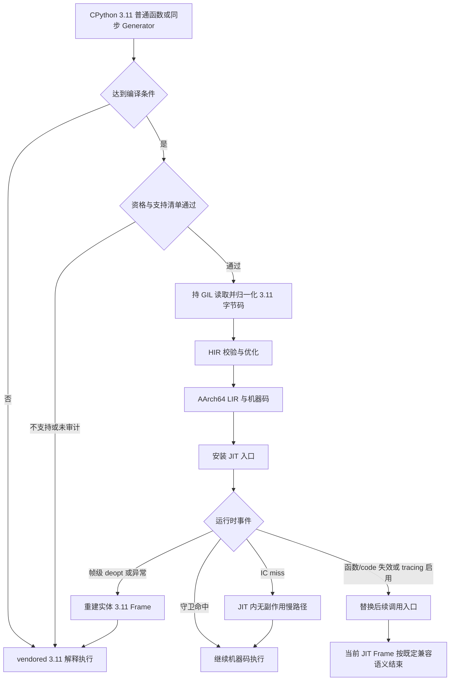
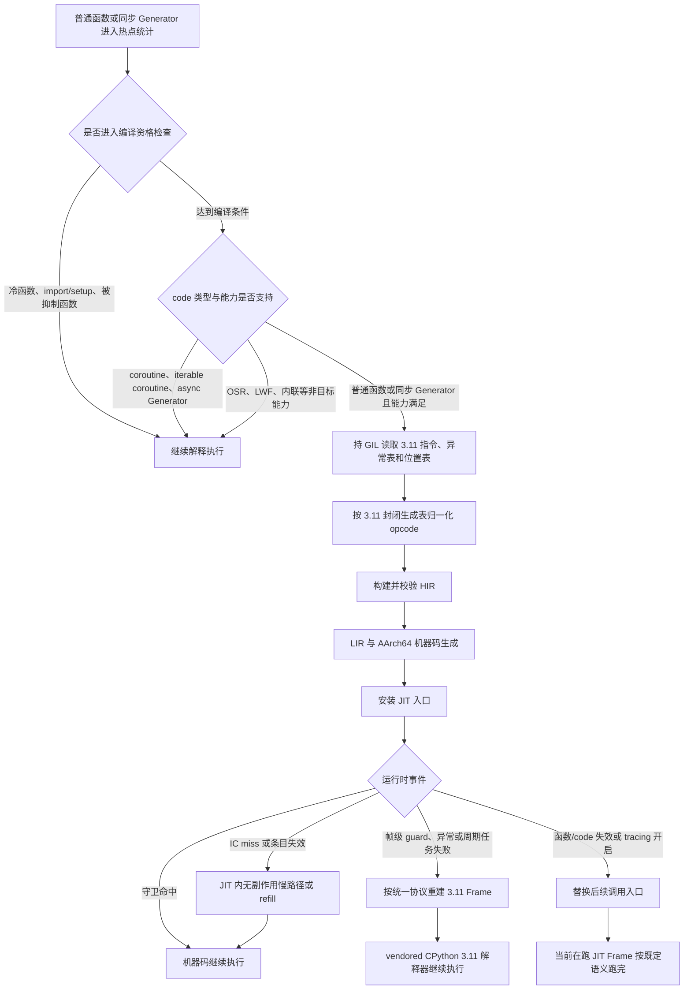
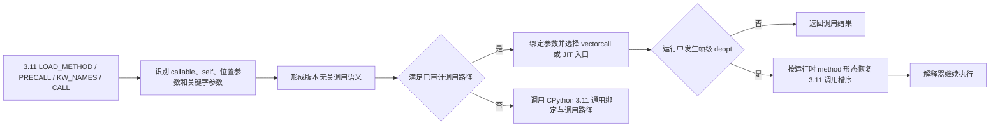
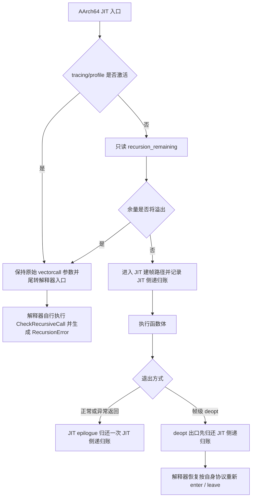
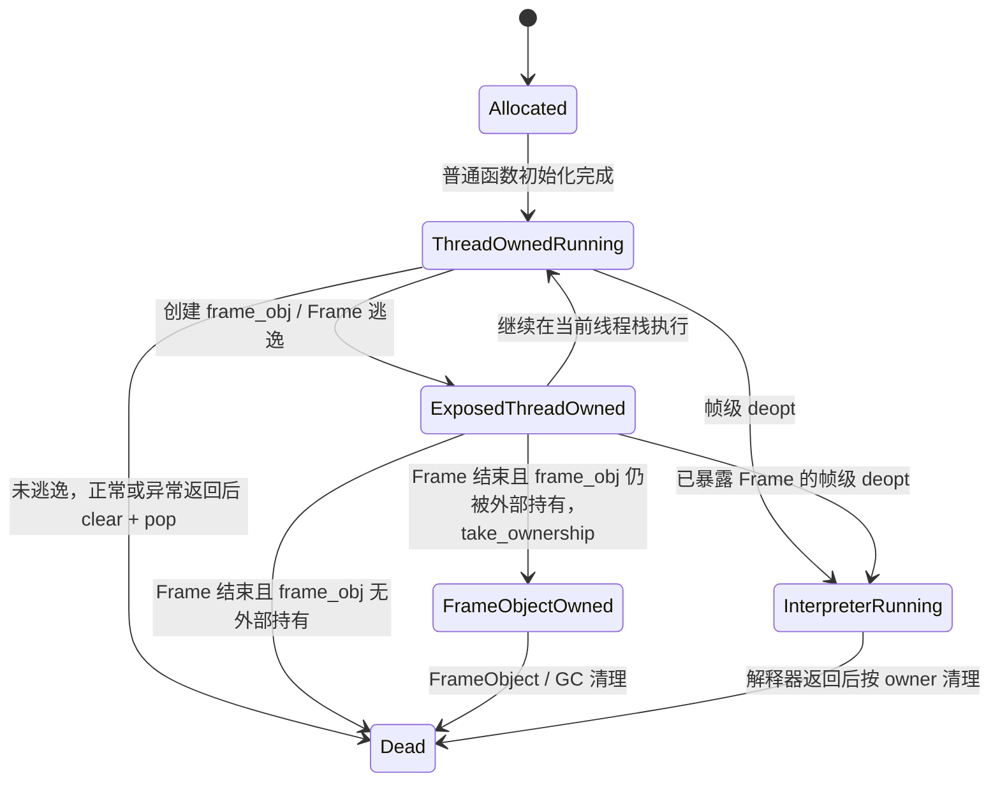
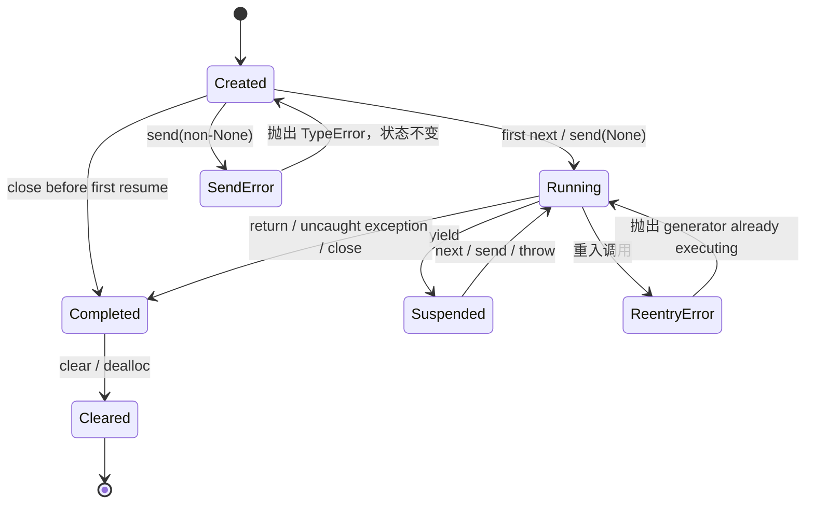

# 【兼容性】CPython 3.11 JIT 执行语义正确性技术方案（RFC）

**状态 (Status):** Draft

**作者 (Authors):** @qq_16646553

**创建日期 (Created):** 2026-07-20

**更新日期 (Updated):** 2026-07-21

**相关 Issue/PR:** 待关联 RFC 评审 Issue

**需求来源:** SR「【兼容性】CPython 3.11 JIT 执行语义正确性」

---

# 1. 概述

## 1.1 简介

本提案面向 openEuler 24.03-LTS-SP3 的 CPython 3.11.6，在 CinderX 已有 JIT 基础上补齐 CPython 3.11 的字节码翻译、调用、Frame、内联缓存、去优化、异常和同步 Generator 语义，使启用 JIT 后的 Python 程序与同版本解释器保持用户可见语义一致。

## 1.2 动机

生产环境以 CPython 3.11 为主要运行版本，而现有 CinderX 共享实现主要面向较新 CPython。CPython 3.11 在字节码、调用协议、Frame、异常、缓存失效和 Generator 对象模型等方面存在明显差异，直接搬运实现容易引入语义错误和生命周期问题。

因此需要针对 CPython 3.11 建立独立审计与适配方案，以同版本解释器为正确性基准，明确不支持能力的安全回退。

## 1.3 目标

### 1.3.1 目标

1. 支持普通 Python 函数和同步 Generator 在 CPython 3.11.6 上进入 CinderX JIT，并与 stock CPython 保持执行语义一致。
2. 正确处理 CPython 3.11 的字节码、参数绑定、递归、Frame 生命周期、自省、异常、对象协议、缓存失效和去优化现场重建。
3. 对 coroutine、iterable coroutine、async Generator 及其他未支持能力执行明确、安全的拒编回退，不创建半成品 JIT 状态。
4. 建立可复现的 Stock、JIT-off、JIT-on、强制编译、函数级失效和 site-deopt 测试链路，并形成 PR 与 Daily 分层门禁。
5. 保持 CPython/CinderX 3.14 参考线行为不变，共享代码修改必须通过反向构建和回归。

### 1.3.2 非目标

本提案不包含以下内容：

- JIT 加速比、优化优先级和性能验收指标；
- x86-64 等非 AArch64 架构交付；
- Lightweight Frames、OSR 和 HIR 函数内联启用；
- 多线程或后台编译；
- coroutine、iterable coroutine 和 async Generator 的 JIT；
- Static Python、Parallel GC、Lazy Import 和子解释器；
- 通用 PyPI cp311 wheel 或面向所有 CPython 3.11 微版本的二进制兼容。

# 2. 用例分析

| 场景 | 主要功能点 | 期望结果 | 主要约束 |
|---|---|---|---|
| 普通 Python 服务启用 auto-JIT | 字节码翻译、函数调用、递归、异常 | 结果、异常和副作用与 stock 一致，连续运行无崩溃 | CPython 3.11.6、AArch64、主解释器 |
| 动态对象模型和热更新 | 属性/方法/global 缓存、descriptor、字典和类型变异 | 变异立即可见，不读取过期值，不跳过用户 hook | 3.11 无 watcher，必须使用拉式证据校验 |
| JIT 中途 guard 失败或异常 | site-deopt、Frame 重建、异常表、traceback | 从正确字节码位置继续解释执行，异常不丢失、不重复 | 只恢复到 vendored 3.11 解释器循环 |
| Frame 自省和调试 | `_getframe`、`f_locals`、traceback、pdb/bdb、trace/profile | 可观察 Frame 字段稳定，调试兼容语义明确 | 采用可观察边界前推式同步 |
| 同步 Generator | `next/send/throw/close/yield from`、PEP 479、挂起恢复 | 状态、异常、GC、自省和引用会计与 stock 一致 | Generator-owned Frame，不启用 LWF |
| 不支持的异步 code | coroutine、iterable coroutine、async Generator | 三类编译入口均明确拒编，解释执行结果正确 | 拒编发生在生成机器码和 JIT 对象创建前 |
| 合入与长期维护 | 差分语料、标准库、ASAN、refleak、生命周期 churn | 新增差异阻断合入，已知豁免可追踪且只减不增 | PR 分钟/小时级，重型扫描进入 Daily |

本提案不处理业务数据，也不改变 Python 应用的编程语法。使用方仍编写普通 Python 代码，JIT 能力作为运行时优化透明启用；当某个 code object 不满足正确性条件时，运行时回退解释器而不是要求业务改写。

# 3. 方案设计

## 3.1 总体方案

### 3.1.1 设计基线

本提案依赖前置设计“可构建运行与自定义解释器循环”提供的 CPython 3.11 构建、vendored 解释器、private API 兼容层和 PEP 523 接入能力。正式目标固定为 openEuler 24.03-LTS-SP3、CPython 3.11.6、AArch64，并以 CPython/CinderX 3.14 作为共享代码参考线，而不是 3.11 正确性的 oracle。

### 3.1.2 设计原则

1. **同版本解释器为 oracle**：正确性比较只在同一 CPython 3.11.6 环境内进行。
2. **失败关闭**：未审计的 opcode、对象形态、内部布局或 helper 一律拒编，不进行近似实现。
3. **版本差异隔离**：小差异使用编译期守卫，结构性差异使用 3.11 专用目录或适配层。
4. **原始语义优先**：能直接调用唯一真源时不复制；无法调用时优先机械 borrow；shim 必须有逐分支等价性证明。
5. **所有权显式化**：Frame、Generator、cache、函数/code 生命周期和 borrowed reference 均明确 owner、失效和清理责任。
6. **门禁先于能力开放**：每个功能域先具备差分、拒编、强制去优化和内存安全验证，再进入正式编译范围。
7. **保护参考线**：3.11 改动不得在 3.14 构建下引入行为或热路径开销变化。

### 3.1.3 总体执行架构

## 3.2 技术选型

| 设计点 | 备选方案 | 选定方案 | 主要理由 |
|---|---|---|---|
| 解释器语义基座 | 手写最小解释器或仅使用宿主默认循环 | vendor 锚定的 CPython 3.11.6 循环，补丁与原始源码分层 | 异常、Frame、quickening 和微版本语义完整，便于哈希和差分审计 |
| 版本代码组织 | 大量共享文件内嵌套 `#if` | 小差异编译期守卫，结构性差异版本目录，重复差异提升适配原语 | 降低共享代码污染和后续上游同步成本 |
| Frame 模型 | 移植 Lightweight Frames | 使用 CPython 3.11 实体 `_PyInterpreterFrame` | LWF 布局和 reifier 能力与 3.11 不匹配 |
| 编译并发 | 后台或无 GIL 编译 | 单线程、持 GIL 编译 | 保证 code object 和 adaptive bytecode 读取一致，减少首期状态空间 |
| 缓存失效 | 空 watcher、回调式 watcher 移植 | 3.11 原生类型/字典版本证据的拉式校验 | 3.11 无相应 watcher；假成功会形成 stale value 和 UAF |
| 去优化目标 | 恢复到宿主任意 `_PyEval_EvalFrameDefault` | 只恢复到同一 vendored 3.11 循环 | 避免 micro-version、Frame 和异常表语义混用 |
| tracing 处理 | 强制栈级去优化全部在跑帧 | 已在栈上的 JIT Frame 跑完，新调用切回解释器 | AArch64 + 3.11 实体 Frame 不具备成熟栈级强制 deopt，行为可测试且可维护 |
| Generator 范围 | 全部拒编或同时支持异步类 | 支持同步 Generator；异步类安全拒编 | 满足当前需求，同时隔离 context/async finalization 等额外状态空间 |
| 正确性验证 | 仅单元断言和冒烟 | Stock/JIT-off/JIT-on 差分 + 强编 + function-uncompile + site-deopt | 能定位 evaluator、编译器、失效和现场重建的不同问题域 |
| 内联和 OSR | 随主链一并启用 | HIR 内联首期关闭，OSR 不实现 | 先把单帧语义和可测试性闭环，避免多帧/栈上切换扩大风险 |

## 3.3 功能与性能设计

### 3.3.1 功能边界与总体链路

#### 3.3.1.1 设计目标

本功能使 CPython 3.11 普通 Python 函数和同步 Generator 在启用 CinderX JIT 后保持与同版本解释器一致的用户可见语义，并保证长时间运行、异常路径、对象变异、Frame 自省、Generator 挂起恢复、调试联动和进程退出阶段无崩溃、无悬垂引用、无静默状态污染。

语义一致性至少包括：

1. 返回值、控制流结果和副作用顺序一致；
2. 异常类型、异常消息、异常链、traceback 行列位置一致；
3. `property`、descriptor、`__getattribute__`、`__getattr__`、`__setattr__`、`__eq__`、`__del__` 等用户对象协议的触发次数和先后顺序一致；
4. `sys._getframe()`、`f_back`、`f_lineno`、`f_locals`、`inspect`、`traceback`、`pdb`、`bdb` 等自省和调试结果符合本节定义的兼容语义；
5. 类、模块、全局字典和实例字典发生变异后，JIT 不得读取过期缓存值；
6. 任意帧级守卫失败、异常退出和测试强制去优化后，解释器继续执行的现场与未编译执行一致；
7. 引用计数、GC 可见性、弱引用和对象生命周期不因 JIT 路径产生额外泄漏、重复释放或释放后访问；
8. 不支持或未审计完成的字节码、调用形态和对象形态必须安全拒绝编译并回退解释器，不允许“尽力编译”；
9. 信号、pending call、GIL 周期检查等 eval-breaker 事件在紧循环中仍能按 CPython 3.11 语义送达。

#### 3.3.1.2 功能范围

| 能力 | 本期设计结论 |
|---|---|
| 普通 Python 函数 JIT | 支持 |
| CPython 3.11 adaptive/specialized bytecode | 支持按 3.11 生成表识别和归一化；表外 opcode 一律拒编 |
| 位置参数、关键字参数、默认参数、绑定方法、builtin/vectorcall、`CALL_FUNCTION_EX` | 支持 |
| 实体 `_PyInterpreterFrame` | 支持，为 CPython 3.11 唯一 Frame 模式 |
| Frame 自省、traceback、tracing/profile 联动 | 支持；采用可观察边界前推式同步和“栈上 JIT Frame 跑完、新调用切回解释器”的正式语义 |
| 属性、方法、类型属性、模块/全局变量内联缓存 | 支持，采用 CPython 3.11 原生版本证据的拉式校验 |
| 帧级去优化、异常传播和执行现场重建 | 支持 |
| 函数/code 生命周期失效 | 支持；通过替换后续调用入口处理，不强制中断当前在跑 Frame |
| 同步 Generator JIT | 支持，覆盖 `next/send/throw/close/yield from`、挂起恢复和挂起点去优化 |
| Coroutine / Iterable Coroutine / Async Generator JIT | 不支持，在 eligibility 阶段明确拒编并解释执行 |
| Lightweight Frames | 不支持，构建配置和运行时双重门禁 |
| OSR | 不实现，不在本次适配范围内 |
| HIR 函数内联 | 首期关闭；开启需先完成多帧 deopt 协议及独立验收 |
| 多线程/后台编译 | 不在本次适配范围内；本期以单线程持 GIL 编译为前提 |
| 目标架构 | 仅 AArch64 |
| Static Python、Parallel GC、Lazy Import | 不在本次适配范围内 |
| 子解释器 | 不支持；初始化或启用 JIT 时明确拒绝 |
| 其他 CPython 3.11 微版本 | 不承诺二进制兼容；必须重新生成源码清单并完成审计 |

#### 3.3.1.3 跨模块语义契约

正式实现必须遵守以下不可降级契约：

| 编号 | 契约 | 违反时的处理 |
|---|---|---|
| C1 | 字节码、Frame、线程态、Generator 和 C API 布局只按 CPython 3.11.6 定义读取 | 构建失败或能力关闭，不按 3.12+ 布局猜测 |
| C2 | 替换 C/C++ helper 时，函数签名、调用约定、返回约定和引用所有权必须精确一致 | 编译期类型检查或 typed wrapper 阻断 |
| C3 | 任何依赖 watcher、monitoring、生命周期通知等隐式上游机制的路径，必须登记 3.11 替代方案或明确关闭 | 未登记则能力默认关闭 |
| C4 | 缓存中的 borrowed reference 只能在全部 owner、形态和版本守卫通过后解引用 | 守卫失败清空条目并走无副作用通用路径 |
| C5 | 每个帧级去优化点都必须具有完整且可重建的执行现场 | 无完整现场的路径不得生成机器码 |
| C6 | 异常返回值与 `PyErr_Occurred()` 状态必须成对一致 | 检测到不一致立即转为内部错误并阻断合入 |
| C7 | 每个 LIR 基本块必须显式终结，不依赖代码布局相邻产生隐式坠落 | LIR verifier 拒绝生成代码 |
| C8 | 不支持的 opcode、调用形态、code 类型和对象协议必须在安装函数入口前拒编 | 保持解释器入口，不挂接半成品代码 |
| C9 | 共享代码变更不得改变 3.14 参考线行为 | 触发 3.14 反向构建和测试；失败阻断合入 |
| C10 | AArch64 汇编中读取的 CPython 字段必须校验 offset、宽度、符号性和硬编码距离 | `static_assert`、生成期校验或构建失败 |
| C11 | Frame 自省一致性由编译器在可观察边界前主动同步保证，不假设 stock 自省入口能够回调 JIT | 无同步证明的路径不得保持 JIT 执行 |
| C12 | 递归、deopt 和解释器恢复分别维护自身计数账本，并在边界处精确配平 | 任一路径重复 enter/leave 或遗漏归还均阻断合入 |

#### 3.3.1.4 总体执行链路

#### 3.3.1.5 实现职责边界

本设计不要求新增一组与职责同名的 C++ 结构体。实现职责按现有模块边界归属：

- 字节码读取、特化指令归一化、inline cache 布局识别、控制流和 eval-breaker 检查由 `bytecode` 与 HIR builder 负责；
- `LOAD_METHOD/PRECALL/KW_NAMES/CALL` 的 3.11 调用栈差异在翻译边界处理，进入共享 HIR 后使用统一调用语义；
- Frame 布局、可观察边界同步、活值物化、去优化现场重建和解释器恢复由 Frame/deopt 路径统一负责；
- 属性、方法、模块和全局变量缓存由 inline cache 路径负责版本证据、引用所有权、无副作用探测和失效处理；
- 同步 Generator 的对象布局、状态转换、引用会计和挂起恢复由 Generator runtime 负责；coroutine、iterable coroutine 和 async Generator 由 eligibility 在创建任何 JIT 状态前统一拒编；
- 强制编译、site 级强制去优化和统计能力由测试构建提供；site-deopt 是需要编译器协作的新建能力，并为后续异常路径完善预留稳定扩展接口；
- 入口语义守卫由 AArch64 生成码 prologue 承担；试用、IC 压力或异常率等策略包装器若保留，必须明确承载机制和退场条件，不得承担语义正确性的唯一职责。

### 3.3.2 【JIT】CPython 3.11 字节码翻译与基础语言语义

#### 3.3.2.1 相关功能元素

字节码翻译负责把 CPython 3.11 code object 中的指令转换为 CinderX HIR，并保证指令含义、操作数栈、异常边、异步事件检查点和源码位置与 CPython 3.11 一致。

| 相关元素 | 作用 | 正确性要求 |
|---|---|---|
| 物理指令流 | code object 当前实际执行的 adaptive/specialized bytecode | 必须按 3.11 编码读取，不能使用 3.14 表解释 |
| 3.11 opcode 生成表 | 给出通用、adaptive、specialized opcode 的封闭集合及 cache 长度 | 作为物理 opcode 识别和 cache 步进的唯一真源；表外 opcode 不得进入翻译 |
| inline cache 单元 | 保存 CPython 特化器产生的类型、版本或索引证据 | 只消费已经审计的 3.11 布局 |
| 操作数栈 | 描述每条指令前后的值和 NULL/method 标记 | 控制流汇合点的栈高度和槽含义必须一致 |
| localsplus | 保存局部变量、cell/freevar 和操作数栈基础区域 | 未绑定值、位置和引用语义与 3.11 一致 |
| exception table | 描述 zero-cost exception handler 范围和目标 | 可能抛出异常的路径必须具有正确异常边 |
| 位置表 | 提供 PEP 657 行列信息 | traceback、`f_lineno` 和 deopt 位置可恢复 |
| eval breaker | 驱动信号、pending calls、GIL 周期任务等异步事件 | 循环回边和对应检查点必须保持用户可见语义 |
| code flags | 区分普通函数、同步 Generator、coroutine 和 async Generator | 普通函数和同步 Generator 进入对应翻译路径；异步类在前端之前拒编 |

本期编译过程为单线程且持有 GIL，翻译期可直接读取当前 `co_code_adaptive` 形成一致的编译视图，不要求额外复制整份冻结字节码。若后续启用多线程或后台编译，复制并冻结指令、cache 和相关元数据是其前置条件，不属于本次适配范围。

#### 3.3.2.2 CPython 3.11 的关键差异

| 相关语义 | CPython 3.11 特点 | 正式实现处理方式 |
|---|---|---|
| adaptive/specialized opcode | opcode 编号和 cache 长度由 3.11 生成表完整给出，运行期不存在“长度未知”的合法特化形 | 以 vendored 3.11 生成表为封闭真源；表外 opcode 或微版本不匹配一律拒编 |
| `LOAD_FAST` | 3.11 没有独立的 `LOAD_FAST_CHECK` 表达未绑定检查 | 局部变量读取显式检查 NULL，产生一致的 `UnboundLocalError` |
| `LOAD_GLOBAL` | `oparg` 低位已包含是否预压 NULL 的调用协议编码 | 按 3.11 原始编码处理，不套用错误版本分界 |
| `LOAD_METHOD` 与 `CALL` | 方法标记和 callable/self 的物理槽序与后续版本不同 | 翻译保留逻辑身份，调用和 deopt 时按 3.11 槽序处理 |
| exception table | 使用 zero-cost exception table，不依赖旧式 `SETUP_*` 块栈 | 所有 `may_raise` 路径建立异常边并保留 handler 恢复位置 |
| 位置表 | 行号和列号由 3.11 位置表提供 | 保存字节码边界对应位置，供 traceback、自省和 deopt 使用 |
| eval breaker | 解释器在循环回边、`RESUME` 等位置检查异步事件 | HIR 保留与 3.11 等价的检查点，触发时运行周期任务或帧级回退 |
| pattern matching | `MATCH_*` 依赖内部 helper 和对象协议 | 完成 helper、异常和 deopt 审计前安全拒编 |
| Generator/async flags | 同步 Generator 与普通函数共享部分 opcode，但对象、Frame owner 和挂起恢复语义不同 | 同步 Generator 进入专用运行时路径；coroutine、iterable coroutine 和 async Generator 在 eligibility 阶段拒编 |

#### 3.3.2.3 翻译流程概述

翻译流程为：持 GIL 读取 code object → 按 3.11 生成表识别物理 opcode 与 cache 长度（表外 opcode 直接拒编）→ 还原通用语言语义 → 校验跳转目标、栈高度、localsplus、异常边和位置 → 按支持清单结论生成 HIR 或返回明确拒编原因；guard、异常和周期任务点建立现场后进入 HIR verifier。

#### 3.3.2.4 字节码支持清单

正式实现建立一份 CPython 3.11 字节码支持清单，作为 translator dispatch、specialized opcode 消费、coverage 工具和测试缺口报告共同使用的单一事实来源。

该清单不是运行时组件，而是正式实现的新建交付物。正式实现不得继续依赖多处手工白名单。

| 处理结论 | 含义 |
|---|---|
| 直接翻译 | 3.11 语义、异常、异步事件检查和 deopt 现场已完整实现 |
| 还原通用语义后翻译 | 物理指令为 adaptive/specialized 形态，但通用语义已完整实现，可忽略或验证特化证据 |
| 安全拒编 | helper、对象协议、异常路径或现场重建尚未完成 |
| 解释器专用 | 当前交付范围明确不允许进入 JIT 的 code 类型或运行形态 |

支持清单至少记录指令名称、处理结论、cache 长度、正常/跳转栈效果、是否可能抛出异常、是否需要 eval-breaker 检查、恢复方式、拒编原因和对应测试。构建和 CI 校验实际 translator、特化消费点与清单一致。

#### 3.3.2.5 基础语言语义处理

首期必须正确覆盖以下语义族；未完成的少量指令可以安全拒编，但不得错误编译：

| 语义族 | 处理方式 |
|---|---|
| 局部变量、cell/free variable | `LOAD_FAST` 读取检查未绑定 NULL；cell/freevar 按 3.11 localsplus 映射访问；异常类型、消息和变量名逐字符一致 |
| 全局、内建和名称解析 | 保持 `LOAD_GLOBAL` NULL 编码、globals/builtins 查找顺序、删除与遮蔽语义 |
| 一元、二元、比较和包含运算 | 满足类型和 slot 身份守卫时走已审计路径；否则调用 CPython 通用语义或帧级 deopt |
| 控制流与异步事件 | 校验 jump target、栈效果和汇合点；在循环回边及等价位置执行 eval-breaker 检查，保证信号、pending calls 和线程调度事件可送达 |
| 迭代、推导式和解包 | 保持 `FOR_ITER`、`UNPACK_SEQUENCE`、`UNPACK_EX` 的 StopIteration、错误消息和引用所有权 |
| 容器构造和下标 | 读写两侧覆盖负下标、布尔下标、越界、别名、`__index__`、`__getitem__`、`__setitem__` 和异常路径 |
| 字符串格式化 | 覆盖 `FORMAT_VALUE`、`BUILD_STRING` 及用户 `__format__` 调用，保持转换标志、异常和副作用顺序 |
| 函数与闭包创建 | `MAKE_FUNCTION`、defaults、kwdefaults、annotations、closure 的槽序和引用所有权按 3.11 处理 |
| `with` 和异常处理 | 按 3.11 exception table 恢复 handler；保持 `WITH_EXCEPT_START`、`finally`、`except` 和 `except*` 协议 |
| pattern matching | 完成 `MATCH_MAPPING/MATCH_KEYS/MATCH_CLASS` 的 helper 和协议审计前拒编 |
| import、类体和模块体 | 默认解释执行；只有支持清单明确允许的普通函数或同步 Generator code object 可编译 |

#### 3.3.2.6 指令边界、异常与安全回退

每个可能产生 guard、helper 异常、周期任务失败或帧级去优化的 HIR 点，都必须关联当前 Python 指令边界、局部变量和操作数栈现场。

默认恢复规则如下：

- **指令前重执行**：现场对应当前 opcode 执行前，解释器恢复后重执行该 opcode；
- **指令后继续**：仅用于已发生不可重复副作用的路径，现场包含结果或异常并从下一条 opcode 继续；
- **当前指令抛出异常**：保留当前指令位置和异常状态，由 3.11 exception table 选择 handler；
- **周期任务失败**：在与解释器等价的检查点恢复，由 vendored 3.11 语义继续处理。

发射 guard 前不得先把当前指令的结果、NULL 哨兵或其他栈变化写入现场，否则恢复后重执行会重复压栈或重复副作用。

以下情况返回明确拒编原因，并保持解释器入口不变：

- opcode 不在 3.11 封闭生成表内，或 cache 长度与锚定表不一致；
- 跳转目标、栈效果、localsplus 或 exception table 校验失败；
- 无法构造完整执行现场；
- helper ABI、异常或引用所有权尚未审计；
- HIR/LIR verifier 发现无终结块、空出口值、非法操作数或不完整异常边；
- 所需 CPython 3.11 私有能力不可用。

拒编属于正确性保障，不计为运行失败。被拒编函数继续由 `Ci_EvalFrameDefault_311` 执行。

### 3.3.3 【JIT】函数调用、参数绑定与递归语义

#### 3.3.3.1 相关功能元素

| 相关元素 | 作用 |
|---|---|
| method/self 标记 | 区分普通 callable 与方法快速调用，决定是否隐式传入 self |
| vectorcall/JIT entry | 最终调用入口及调用约定 |
| REENTRY/STATIC_ENTRY | 参数绑定完成后的生成码重入入口，其相对位置是 AArch64 代码生成硬契约 |
| recursion state | JIT 侧递归计数和解释器侧递归计数的独立账本 |
| 临时对象和引用所有权 | 参数数组、tuple/dict、bound method 和入口 Frame 的清理责任 |

#### 3.3.3.2 CPython 3.11 的关键差异

| 相关语义 | CPython 3.11 差异 | 正式实现处理方式 |
|---|---|---|
| `LOAD_METHOD/PRECALL/KW_NAMES/CALL` | callable、self 和 NULL 标记的物理栈布局与 3.12+ 不同 | 翻译归一化逻辑身份；执行和 deopt 按 3.11 槽序还原 |
| CALL specialization | 安装自定义 PEP 523 evaluator 可能使部分 CALL 特化退化 | 逐条审计所有依赖 evaluator 身份的特化；仅在 vendored evaluator 语义等价时保留，否则按 CPython 规则退化 |
| vectorcall helper | 参数数量、顺序或宽度错一位即可产生 ABI 错位 | 保留函数指针类型并校验签名 |
| Frame 清理责任 | 普通函数经解释器完成后，thread-owned Frame 需要调用方 clear/pop | JIT 正常、异常和 deopt 返回统一进入 3.11 清理路径 |
| recursion check | JIT 裸入口不会自然经过解释器入口处的递归检查 | AArch64 prologue 只读预检；将溢时整调用分流解释器，由解释器产生 `RecursionError` |
| 线程态字段 | `_PyCFrame.use_tracing` 为 3.11 专有窄字段，`recursion_remaining` 布局与后续版本不同 | 对实际读入汇编的 offset、宽度和符号性做构建期校验 |

#### 3.3.3.3 调用协议归一化

翻译器识别 3.11 的 `LOAD_METHOD`、`PRECALL`、`KW_NAMES` 和 `CALL` 组合，并提取：

- 实际 callable；
- 是否存在隐式 self，以及 self 的值；
- 位置参数列表；
- `kwnames` 对应的关键字参数；
- 是否使用 `*args` 或 `**kwargs`；
- 原始调用窗口在 deopt 时应恢复的 3.11 槽序。

共享 HIR/LIR 只使用逻辑调用语义，不直接依赖 3.11 物理槽布局。deopt 现场必须保留 method/普通 callable 的运行时形态，不能只凭 opcode 静态推断。

#### 3.3.3.4 支持的调用形态与参数绑定

支持范围覆盖精确 Python 函数、默认参数、关键字参数、绑定方法、`classmethod`/`staticmethod`、builtin/C function、自定义 callable、`CALL_FUNCTION_EX`、递归和相互递归。所有形态遵循同一处理原则：满足已审计守卫时走快路径，否则使用 CPython 3.11 通用绑定与调用路径，不为快化改变异常或引用约定；快路径入口同时校验函数/code 生命周期、entry generation 和 tracing 状态。

| 调用形态 | 独立设计决策 |
|---|---|
| 绑定方法 | 满足 descriptor 和类型守卫时显式传入 self，避免构造临时 bound-method；否则走通用 descriptor/vectorcall |
| builtin / C function | 使用合法的 `PyObject_Vectorcall`、`_PyObject_VectorcallTstate`、`_PyObject_FastCallDictTstate` 或对应 fastcall 约定 |
| `CALL_FUNCTION_EX` | 仅在 tuple/dict 展开条件已精确证明时快化；其他情况复用 CPython 3.11 通用实现 |
| 递归和相互递归 | 入口预检失败时整调用进入解释器，由解释器负责余量、headroom 和异常消息语义 |

参数绑定语义以 stock CPython 3.11 为 oracle，错误类型、函数限定名和错误消息逐字符一致；不能精确复现时直接调用原生绑定逻辑。具体调用形态由 3.3.8.3 的“调用与 Frame”测试范围覆盖，并在测试清单中维护可审计的维度表。

#### 3.3.3.5 Helper ABI、入口胶水和引用所有权

- 替换 `PyObject_Vectorcall`、`_PyObject_VectorcallTstate`、`_PyObject_FastCallDictTstate` 或其他 C API 时，替身函数的参数顺序、宽度、调用约定和返回约定必须完全一致；
- helper 注册层使用 typed function pointer，禁止仅保存整数地址而失去编译期检查；
- AArch64 的 REENTRY/STATIC_ENTRY 与 vectorcall 入口之间存在硬编码距离，修改入口 prologue 时必须由构建期断言或生成期校验保证；
- 入口守卫中的 tracing 检查和递归预检以生成码 prologue 行内化为正式形态；
- 策略性 C 包装器若用于试用期、IC 压力、异常率熔断等策略，必须写明承载机制、转正后退场条件和 REENTRY 解析方式，不得承担 tracing 或递归正确性的唯一职责；
- 新引用、借用引用和偷取引用在 helper 声明和审计记录中明确标注，并进入引用计数矩阵；
- 编译函数注册表、调用点缓存和入口缓存不得使用无法失效的裸 `PyFunctionObject*` 作为长期键；采用强引用、weakref/attachment 或 GC 可遍历方案；
- 参数绑定失败、callee 异常、函数死亡和进程退出均必须验证临时对象与入口 Frame 正确清理。

#### 3.3.3.6 递归语义

正式递归模型为“**生成码只读预检，超限分流解释器；JIT 和解释器两本账各自配平**”。

实现要求：

1. 预检只读取 `recursion_remaining`，不在失败分支修改递归账；
2. `RecursionError` 的余量、headroom、异常类型和消息由 CPython 3.11 解释器产生；
3. JIT 建帧处完成 JIT 侧计数，正常和异常出口各归还一次；
4. 帧级 deopt 先补平 JIT 侧计数，再由解释器按自己的入口协议重新计数；
5. 不修改 vendored 解释器以“继承”JIT 已计数状态；
6. 构建期校验 `PyThreadState.cframe`、`_PyCFrame.use_tracing` 和 `recursion_remaining` 的 offset、字段宽度和读取符号性；
7. 深递归、互相递归、异常递归、deopt 后继续递归和 tracing 分流分别建立用例。

### 3.3.4 【JIT】Frame 生命周期、自省与调试联动

#### 3.3.4.1 相关元素与 CPython 3.11 差异

| 相关元素 | CPython 3.11 特点 | 正式实现处理方式 |
|---|---|---|
| `_PyInterpreterFrame` | 默认使用实体 Frame，字段和 owner 语义与 3.14 LWF 不同 | 3.11 固定 materialized Frame，构建和运行时禁止 LWF |
| `localsplus` | 同时容纳局部变量、cell/freevar 和操作数栈基础区域 | 按 3.11 code layout 映射，在可观察边界前主动同步 |
| `prev_instr`/位置 | 决定恢复指令、traceback 和 `f_lineno` | 只保存真实 3.11 指令边界，不用机器码 PC 近似 |
| `stacktop`、`is_entry`、`f_locals` | 字段存在性和语义与后续版本不同 | 逐字段按 3.11 审计，不复用 3.12+ 假设 |
| Frame owner | thread-owned、已暴露但仍 thread-owned、FrameObject-owned 的责任不同 | 区分逃逸和所有权转移，死亡时按 CPython `take_ownership` 规则处理 |
| tracing/profile | 3.11 AArch64 无栈级强制 deopt 机制 | 栈上 JIT Frame 跑完，新调用切回解释器，差异进入版本化豁免 |

构建期校验聚焦三类对象：

1. JIT 汇编实际依赖的字段宽度、符号性和 offset，包括 `PyThreadState.cframe`、`_PyCFrame.use_tracing`、`recursion_remaining`、`stacktop`、`is_entry`、`f_locals` 等；
2. 烘焙进汇编的硬编码常量和入口相对距离；
3. vendored 结构副本、生成物和目标 CPython 3.11.6 头文件的一致性。

仅对同一头文件直接计算普通 C++ `offsetof` 不是独立兼容性证明，必须与实际汇编读取方式或 vendored 副本校验结合。

#### 3.3.4.2 生命周期和所有权

创建 `PyFrameObject` 只表示 Frame 已对 Python 代码可见，不会立即把底层 `_PyInterpreterFrame` 的 owner 改为 FrameObject。只有 thread-owned Frame 死亡且外部仍持有 FrameObject 时，CPython 才执行 `take_ownership`。

| 状态/owner | 清理责任 | 关键约束 |
|---|---|---|
| Thread-owned、未暴露 | JIT 调用方或解释器返回后的统一 clear/pop | 不得遗漏 Frame 引用和 datastack 清理 |
| 已暴露但仍 thread-owned | 继续由线程栈拥有；FrameObject 仅指向当前 Frame | Frame 死亡前不得提前转移或留下悬垂指针 |
| FrameObject-owned | CPython `take_ownership` 搬移后由 FrameObject/GC 管理 | 不再按 thread-owned 路径重复清理 |
| Interpreter-running | vendored 3.11 循环继续执行，返回后按最终 owner 清理 | deopt 不改变既有逃逸事实 |

正式实现必须使用 CPython 3.11 原始语义或逐字 borrow 的等价实现，不手写缺少 `take_ownership` 分支的镜像函数。

#### 3.3.4.3 JIT 活值、GC 可见性与推式同步

CPython 3.11 的 `sys._getframe()`、`f_locals`、traceback、pdb 等 stock 代码直接读取真实 `_PyInterpreterFrame`，没有可供 JIT 拦截的“自省触发回调”。因此本期采用 **可观察边界前推式同步**，而不是由自省入口拉式触发。

正式实现必须：

1. 为每个可抛异常或可能执行 Python 代码的调用边界维护精确 stack map；
2. 在进入可能重入 Python、触发 GC、析构或用户 hook 的 helper 前，同步 CPython 可见的 `prev_instr`、`stacktop` 和需要暴露的 localsplus；
3. 在 traceback 构建、异常传播、tracing 分流、Frame 逃逸和帧级 deopt 前完成同样同步；
4. 在释放 GIL、进入可能释放 GIL 的阻塞调用，或以其他方式允许另一线程观察当前线程 Frame 前，完成 `prev_instr`、`stacktop` 和必要 localsplus 的同步；
5. 对无法在边界前完成同步的路径，保持活值 home 常驻 localsplus，或拒绝该优化；
6. GC 遍历时，所有 Python 对象活值必须由已同步 Frame 或精确 root map 找到；
7. 同一引用不得被 Frame 和 JIT root map 作为两个独立强引用重复管理；
8. materialized Frame 不得长期保持空 localsplus，使 `f_locals` 返回错误快照。

可观察边界至少包括：

- Python/C 调用或可能调用用户代码的 helper；
- descriptor、属性、比较、格式化、容器协议等用户 hook；
- 可能触发 GC、weakref callback 或 `__del__` 的分配和释放；
- eval-breaker 周期任务；
- GIL 释放、可能释放 GIL 的阻塞调用，以及其他允许跨线程读取 Frame 的调度边界；
- 异常出口、traceback 构建、tracing/profile 状态切换；
- FrameObject 创建和任何帧级 deopt 点。

#### 3.3.4.4 自省语义

自省结果必须对应一个明确的 Python 字节码边界：

- `sys._getframe()`、`inspect.currentframe()` 读取到完整 Frame 链；
- `sys._current_frames()` 跨线程读取时，目标线程在最近一次 GIL 释放或调度边界前已经同步 Frame，返回的栈顶、`f_back`、`prev_instr` 和可见 localsplus 不得处于半更新状态；
- `frame.f_back` 链完整无悬垂；Frame 逃逸后后续可观察边界仍持续更新同一个真实 Frame；
- `frame.f_locals` 反映最近一个可观察边界前已同步的局部变量；
- `frame.f_lineno`、traceback 行号和列号来自 CPython 3.11 位置表及当前 `prev_instr`；
- `pdb`、`bdb`、`inspect` 和异常格式化不得读到部分初始化 Frame；

验收必须覆盖“JIT 函数内部调用 `sys._getframe()`”“用户 hook 内读取调用方 Frame”“异常构建 traceback”“GC/析构重入读取 Frame”，以及“另一线程在目标 JIT 线程停于 GIL 释放点、阻塞调用或 eval-breaker 调度边界时调用 `sys._current_frames()`”等场景，不能只测试函数返回后的静态快照。跨线程用例应断言读取过程无崩溃、无悬垂 Frame，并且观察结果对应目标线程释放 GIL 前完成同步的稳定字节码边界。

#### 3.3.4.5 Tracing 和 profiling 联动

本期 AArch64 + CPython 3.11 的正式语义为：

1. `sys.settrace`、`sys.setprofile` 或对应 C API 激活后，新调用不再进入编译入口，而是切回解释器；
2. 已在栈上的 JIT Frame 继续运行至自然返回，不执行栈级强制 deopt；
3. 该 JIT Frame 剩余部分不补发解释器 trace/profile 事件；
4. 清除 tracing/profile 后，函数在入口状态校验通过时可重新进入 JIT；
5. 上述差异作为 CPython 3.11 JIT 的版本化兼容豁免，必须由 `test_sys_settrace`、`test_sys_setprofile` 和专用事件流用例钉住；
6. 已挂起的同步 JIT Generator 后续 resume 属于同一版本化兼容语义：tracing 激活后不创建新的 JIT Generator，但不强制把既有挂起 Generator 转换为解释器 Frame；其剩余事件差异由专用用例钉住；
7. 帧级 deopt 在函数中部恢复且当前 tracing 已激活时，因为恢复跳过函数入口的 `RESUME`，必须显式补设 `f_trace`、`f_trace_lines` 等 CPython 期望状态；
8. tracing 分流不得破坏递归账、异常状态和 `f_back` 链。

本次适配不实现 safepoint 栈级去优化，也不把该能力作为验收条件。

### 3.3.5 【JIT】内联缓存语义、失效与对象协议

#### 3.3.5.1 总体原则

CPython 3.11 不具备 3.12+ 的 type/dict/function watcher 通知能力。兼容头中为编译共享代码而保留的 watcher stub 可以存在，但 **不得承担正确性**。

正式实现采用“填充时记录事实、命中时重新校验”的拉式模式，并执行以下审计：

- 盘点所有调用 `watch*` 并以返回成功作为“已经布防”依据的共享路径；
- 3.11 下将其改为拉式守卫、weakref/attachment 生命周期方案或显式禁用；
- watcher stub 只解决编译兼容，不能作为缓存或注册表的失效证据；
- 每类缓存明确 owner、形态、版本证据、key/index、引用所有权、命中校验和失效动作；
- cache miss、探测和守卫评估必须无用户可见副作用。

#### 3.3.5.2 缓存种类

| 缓存 | 必须守卫的事实 |
|---|---|
| 实例属性读取 | 接收者精确类型、类型版本、实例 dict/values 形态、keys/value 版本、descriptor 优先级 |
| 实例属性写入 | 接收者类型和版本、`__setattr__`/data descriptor 状态、目标槽或 dict 形态、values 容量 |
| 方法加载 | 接收者类型、方法 descriptor、绑定策略、实例覆盖可能性 |
| 类型属性/类型方法 | metaclass、owner 类型版本、descriptor 类型版本 |
| 模块属性 | 模块 `__dict__` 值版本、key/index 一致性 |
| `LOAD_GLOBAL` | globals 和 builtins 的查找顺序、值版本、删除/遮蔽语义 |
| 调用入口缓存 | 函数/code 生命周期、入口 generation、tracing/失效状态 |

#### 3.3.5.3 CPython 3.11 的关键差异

| 差异 | 风险 | 正式实现处理方式 |
|---|---|---|
| 无 `PyType_Watch` | 类或 descriptor 变异后缓存仍返回旧值，甚至引用已释放对象 | 使用类型指针、`tp_version_tag` 和有效标志拉式校验 |
| 无 `PyDict_Watch` | global、module 或实例字典变异无法主动通知 | 根据缓存事实校验 value version、keys version、key、index 和形态 |
| 无 function destroy watcher | 已编译函数或入口缓存可能保留死亡函数裸指针 | 使用 weakref/attachment、强引用环配合 GC 或其他显式生命周期方案 |
| descriptor 分类会变化 | 删除或替换 descriptor 类型的 `__get__/__set__` 后原缓存分类失效 | 同时守卫 descriptor 自身类型和版本 |
| split dict/shared keys | keys 成长、values 迁移或容量变化使 offset/index 失效 | 校验当前形态、容量和版本；不能证明时走无副作用通用路径 |
| dict 内部查找 helper 不可链接 | 手写线性扫描错误且性能不可接受，复刻哈希探测又存在微版本耦合 | 优先 borrow/真源；确需复刻时逐分支审计并纳入源码锚定 |

#### 3.3.5.4 类型版本校验

3.11 类型缓存使用 `tp_version_tag` 和 `Py_TPFLAGS_VALID_VERSION_TAG`：

1. fill 时只检查类型是否已有有效 version tag；
2. 3.11 JIT 不主动复制或分配类型版本号；若 tag 无效，放弃填充并走通用路径，由 CPython 自身查找流程在合适时机赋号；
3. 记录接收者类型指针和 version tag；
4. hit 时先验证类型指针、有效标志和版本号，再读取 borrowed descriptor/value；
5. 版本失效条目立即清空；
6. data descriptor 缓存同时记录 descriptor 自身类型和版本，覆盖 descriptor 分类变化；
7. `__class__` 重绑定由“接收者类型指针 + version tag”组合守卫覆盖，其中类型指针变化是直接失效原因；
8. 基类变更和子类传播由 CPython 类型版本失效机制覆盖。

#### 3.3.5.5 Dict、模块和全局变量校验

- 缓存具体值时使用能够反映值替换的 value version；
- `dk_version` 只证明 keys 结构事实，不得单独证明某个 value 未变化；
- 缓存 index 后，hit 先验证 owner、形态和 keys version；对不能由版本完全证明的路径再验证 key；
- 删除 global、从 globals 切换到 builtins、builtins 被遮蔽或恢复必须立即可见；
- split values 读取和写入必须校验实际 values 容量，不能仅以 `dk_nentries` 判定安全；
- 缓存探测和守卫评估不得触发 values→dict 物化、惰性字典创建或其他受者形态变化；
- refill 使用 CPython dict 查找、机械 borrow 或经审计的等价哈希探测，不以线性扫描 unicode keys 作为长期实现。

dict 版本发号器按目标环境执行两分支裁决：

1. 在目标 openEuler `libpython3.11.so` 上验证 `_pydict_global_version` 等所需真源的动态可链接性；
2. 若可链接，直接使用 libpython 唯一真源；
3. 若不可链接，才允许采用影子发号器；正式设计必须记录播种间距、与运行时区间的隔离规则、最大生命周期内变异上界和 ABA 碰撞论证，并由压力测试证明；
4. 影子方案不得扩散到类型版本等已有 CPython 有机赋号机制的对象；
5. 裁决结果、目标二进制符号表和测试证据随审计报告归档。

如果因私有 helper 不可链接而复刻 `unicodekeys_lookup_unicode` 等哈希探测逻辑，该复刻件必须：

- 按 CPython 3.11.6 分支逐项审计驻留指针快判、hash 比较、开放寻址、`DKIX_DUMMY` 和终止条件；
- 纳入核心源码/函数体哈希锚定；
- 随目标微版本变化重新审计；
- 用 shared keys、dummy 槽、hash 冲突、非驻留等值字符串和大字典用例验证。

#### 3.3.5.6 慢路径与形态副作用约束

命中校验顺序为：类型指针/有效 tag/版本 → dict/values 形态、keys/value 版本与容量 → descriptor 与对象协议证据；全部通过后才解引用 borrowed value/descriptor。任一失败即清空条目并进入无副作用通用路径；refill 仅在取得可证明的新证据时发生。

形态副作用测试至少断言：

- IC miss 前后实例仍保持相同 values/dict 形态，除非用户操作本身要求物化；
- 属性/方法探测不得因 JIT 额外创建 `__dict__`；
- split values 写入不会越过实例实际容量；
- 慢路径触发用户 hook 的次数和顺序与解释器一致。

#### 3.3.5.7 引用所有权和对象协议

- value/descriptor 借用的前提是 owner 强引用存在、GIL 持有且全部守卫已通过；守卫失败时不得解引用、decref 或调用旧值；需要跨 owner 生命周期保存的对象改为强引用并纳入 GC traverse/clear；owner 必须在 cache 生命周期内稳定存活；
- debug/ASAN 构建在条目清空后写 poison，验证失败路径不再读取旧槽；
- 对象协议语义（data/non-data descriptor 优先级、`property`、`__getattribute__`/`__getattr__`、`__setattr__`/`__delattr__`、metaclass 查找等）以 stock 双模差分为 oracle，快路径必须覆盖或主动排除；其中 3.11 形态相关项单独覆盖 split dict、shared keys 成长、values 迁移、模块 `__getattr__` 以及 `__eq__`/`__del__` 重入再变异；
- 无法证明完整协议等价时调用 CPython generic 路径；IC 失效本身不进入 Frame 重建协议。

### 3.3.6 【JIT】去优化、异常传播与执行现场重建

#### 3.3.6.1 触发源分级

需要区分帧级去优化、函数级失效和 IC 慢路径，三者不能共用一个含混的“deopt”概念。

| 类型 | 典型触发源 | 处理方式 |
|---|---|---|
| 帧级去优化 | `GuardFailure`、`YieldFrom`、`Raise`/`RaiseStatic`、`UnhandledException`、`UnhandledUnboundLocal`、`UnhandledUnboundFreevar`、`UnhandledNullField`、`PeriodicTaskFailure`、测试 site 强制触发 | 重建当前 Frame 现场并进入 vendored 3.11 解释器 |
| 函数级失效 | `force_uncompile`、函数/code 修改或死亡、JIT pause、tracing/profile 激活后的新调用 | 替换函数后续调用入口；不强制中断当前在跑 Frame |
| IC miss/条目失效 | 类型或字典版本不匹配、形态改变、条目驱逐 | 在 JIT 内进入无副作用慢路径或 refill；不做 Frame 重建 |

只有帧级去优化点需要统一现场恢复协议和稳定 site kind。上表列出当前基线中的帧级原因；正式可枚举集合以 `DeoptReason`/site-kind 的单一事实来源为准。新增、删除或重命名原因时，必须同步更新元数据生成、运行时恢复、测试 site 枚举和覆盖矩阵，不能只修改某一处分支。函数级失效与 IC 失效分别由入口生命周期和缓存子系统管理。

#### 3.3.6.2 现场要素

帧级恢复信息至少包括：

- 恢复到哪条 Python 指令，以及重执行还是从下一条继续；
- localsplus 中每个局部变量、cell 和 free variable 的活值索引，或显式死值标记；
- 当前操作数栈及槽含义；
- 当前异常、handled exception 和 exception group 状态；
- 调用窗口中的 callable、self、NULL 标记和参数；
- Frame owner；
- 本次是否为 instrumentation deopt；
- Python 对象值当前由谁持有引用，重建时复制还是转移。

死值在 metadata 中必须显式标记，恢复为未绑定/NULL，不得为了“保存每个局部变量”而强行延长死值生命周期，影响寄存器分配和引用语义。

递归状态不以“继承一个已计数布尔值”交给解释器。帧级 deopt 出口先归还 JIT 侧递归账，解释器恢复再按自身入口和返回协议维护解释器侧账。

#### 3.3.6.3 现场重建流程

三类运行时事件的分流见 3.3.1.4 总体执行链路：IC miss 在 JIT 内走无副作用慢路径后继续当前 Frame；函数/code 失效只替换后续调用入口；仅帧级事件进入现场重建。

帧级恢复步骤为：定位帧级恢复元数据 → 归还 JIT 侧递归账并冻结机器活值 → 重建 localsplus、cell/freevar 和操作数栈 → 恢复 3.11 调用窗口、`prev_instr`、`stacktop` 和异常状态 → 按引用所有权复制或转移 → 进入 `Ci_EvalFrameDefault_311`，解释器按自身协议继续执行并维护递归账。

恢复只能进入本设计锚定的 vendored CPython 3.11 循环，不能跳入宿主中其他 micro-version 的 `_PyEval_EvalFrameDefault`。

#### 3.3.6.4 调用窗口和异常重建

现场必须记录：

- method 形态或普通 callable 形态；
- callable、self、NULL 标记和参数的逻辑身份；
- 当前 CALL 是否重执行；
- 恢复时应使用的 3.11 物理槽序。

method 形态不能只靠静态 opcode 判断，必要时根据运行时 `self_or_null` 交换槽位。`LOAD_GLOBAL` 等预压 NULL 的指令，其 guard 现场必须对应指令执行前，避免恢复重执行时重复压入 NULL。

异常恢复要求：

- helper 正常返回时不得残留异常，失败返回时必须已设置异常；
- 保存当前异常、handled exception 和 exception group 状态；
- 按 3.11 exception table 查找 handler，保持 `except`、`except*`、`finally` 和 `with` 行为；
- traceback 的 code、行号、列号和 Frame 链由恢复位置生成；
- `instrumentation_deopt` 等参数显式装配，禁止依赖未初始化寄存器；
- tracing 已激活且帧从函数中部恢复时，显式补设 `f_trace`、`f_trace_lines`，因为该 Frame 不会重新执行入口 `RESUME`。

#### 3.3.6.5 引用计数和清理

- 现场重建明确区分复制、转移和借用引用；
- 被重建到 Frame 的 owned Python 值不再由原机器临时槽重复释放；
- thread-owned Frame 在解释器返回后执行 3.11 对应 clear/pop；
- generator-owned Frame 始终由 Generator 生命周期管理，deopt 后不得进入普通 thread Frame clear/pop；
- 已逃逸 Frame 按最终 owner 进入 `take_ownership` 或正常清理；
- 异常和正常返回共用可审计的清理计划；
- 修改收养、偷取、incref/decref 语义的变更必须运行引用计数矩阵、生命周期搅动和 ASAN。

#### 3.3.6.6 函数内联的开闸前置条件

本期 HIR 内联器关闭，验收配置以关断态为准。首期所有 site 的 inline path 为空，Frame 恢复只处理单一 Python Frame。

后续开启内联前必须单独完成：

1. 为每个内联 Frame 保存独立的 localsplus、操作数栈、异常状态、code 和恢复位置；
2. 从最内层到最外层逐帧重建、链接和清理；
3. 将内联 callee 的结果或异常按调用语义回压 caller；
4. 每一层 thread-owned Frame 均按 3.11 clear/pop 责任处理；
5. site-id 的 inline path 能稳定标识内联调用链；
6. forced-deopt、异常注入、traceback 和 Frame 自省矩阵覆盖不同内联深度。

这些能力作为内联开闸的独立验收，不因穿刺基线已有多帧实现而视为正式完成。

### 3.3.7 【JIT】Generator、挂起执行与异步安全回退

同步 Generator 属于本方案的最终能力，但不是本期设计的主线重点。开发顺序上，在普通函数、Frame、调用和单帧 deopt 主链闭环后再完成 Generator 专项；该顺序只表示优先级后置，不缩减最终交付范围。

#### 3.3.7.1 能力范围

| Code 类型 | 本期结论 |
|---|---|
| 普通同步 Generator（`CO_GENERATOR`，无 coroutine/async 标志） | 支持 JIT，覆盖 `next/send/throw/close/yield from`、PEP 479 和挂起点恢复 |
| Native coroutine | 明确拒编，保持 CPython 3.11 解释执行 |
| Iterable coroutine | 明确拒编，保持 CPython 3.11 解释执行 |
| Async Generator | 明确拒编，保持 CPython 3.11 解释执行 |

coroutine、iterable coroutine 和 async Generator 的拒编必须发生在生成机器码或创建 JIT 运行时对象之前。auto-JIT、显式 `force_compile` 和测试强编应返回一致、可区分的拒编原因，拒编后对象行为不得发生变化。

#### 3.3.7.2 CPython 3.11 的关键差异与处理

| 相关元素 | CPython 3.11 差异 | 正式实现处理方式 |
|---|---|---|
| Generator 对象模型 | 3.11 的 `PyGenObject` 仍暴露 `gi_code`，可见 members/getsets、`am_send`、GC 和 finalize 行为与后续版本不同 | 沿用 CinderX JitGen 运行时对象，但按 stock 3.11 审计用户可见属性、slots、GC、weakref、finalize 和错误语义 |
| code 引用 | `frame->f_code` 和 `gi_code` 分别持有强引用 | 创建、完成、deopt、close 和析构路径分别配平两份引用，不用一处错误抵消另一处 |
| Frame owner | 挂起 Frame 由 Generator 对象持有，不属于线程栈 | Generator-owned Frame 不进入普通函数 clear/pop；deopt 前后 owner 保持不变 |
| 状态机 | 存在 CREATED、RUNNING、SUSPENDED、COMPLETED、CLEARED 等状态 | `send`、重入、完成和异常路径按 3.11 状态及错误消息处理，异常退出后必须复位运行态 |
| `yield from` | 3.11 没有后续版本的 `FRAME_SUSPENDED_YIELD_FROM` 状态 | 使用操作数栈中的 delegate、`prev_instr` 和恢复现场表达委托状态 |
| 自省 | `gi_frame`、`gi_code`、`f_locals` 和 traceback 可在挂起期间被观察 | yield 前及其他可观察边界同步 `prev_instr`、`stacktop` 和必要 localsplus |
| 编译代码生命周期 | Generator 可跨多次调用长期挂起 | 挂起对象钉住其编译代码；完成或 deopt 转解释器后再按所有权释放 |
| tracing/profile | 挂起后的 resume 属于既有执行帧继续运行 | 遵循 3.3.4.5 的版本化兼容语义，不在 tracing 切换时强制转换已挂起 JIT Generator |

本设计不展开 Generator 的全部内部镜像字段；完整 members、getsets、slots 和引用所有权清单作为实现审计附件维护，代码评审时逐项核对。

#### 3.3.7.3 状态机与挂起恢复

每个 yield/suspend 点需要保存恢复所需的最小现场：恢复字节码位置、localsplus 和操作数栈活值、异常状态、`yield from` delegate、Frame owner 及引用转移信息。

在运行中或下一次 resume 时触发帧级 deopt，恢复流程应满足：

1. Generator-owned Frame 仍由原 Generator 对象持有；
2. 按 suspend metadata 将活值重建到 CPython 3.11 Frame；
3. 恢复 `prev_instr`、`stacktop`、异常状态和 delegate；
4. 下一次 `send/throw/close` 进入 vendored 3.11 Generator 路径继续执行；
5. 不把 Generator Frame 当作 thread-owned Frame 重复 clear/pop。

#### 3.3.7.4 安全约束与验收重点

同步 Generator 专项至少验证：

- `next()`、`send(None)`、启动后的 `send(value)`；
- `throw()` 的内部捕获和向外传播；
- `close()`、`GeneratorExit`、`finally`；
- `yield from` 的值、异常和 return value；
- PEP 479：Generator 内逸出的 `StopIteration` 转为 `RuntimeError`；
- 未启动 `send(non-None)`、运行中重入和完成后再次调用的错误语义；
- 多实例交错、cell/free variable、genexpr；
- 挂起期间 GC、weakref、`gi_frame`、`gi_code`、`f_locals` 和 traceback；
- 挂起点 deopt、函数级 uncompile 后的下一次 resume；
- 创建、yield、完成、close、异常和析构路径的引用计数矩阵。

Generator 不启用 Lightweight Frames。遇到尚未审计的 Generator opcode、对象形态或恢复现场时安全拒编该 code，不允许创建半成品 JitGen 状态。coroutine、iterable coroutine 和 async Generator 继续由解释器完整执行，相关测试验证“拒编 + 结果正确”，不得整类 skip。

### 3.3.8 【JIT】JIT 执行语义正确性可测试性

#### 3.3.8.1 设计目标与原则

可测试性属于运行时正确性设计的一部分。正式实现必须让关键执行路径能够被稳定触发、重复运行并明确归因，而不能只依赖 auto-JIT 偶然覆盖。

本节遵循以下原则：

1. 以同一构建环境下的 stock CPython 3.11.6 作为正确性 oracle；
2. 分别验证 evaluator 替换、正式 JIT 执行、函数级失效和帧级现场重建，避免把不同问题混为同一种“deopt”；
3. 强制编译覆盖解释热身前和 quickening 后两种时序；
4. site-deopt 进入与真实帧级守卫失败相同的恢复协议，不建立测试专用恢复路径；
5. 测试控制和详细统计仅在测试/诊断构建或显式开关下启用，release 默认关闭或编译移除；
6. 加载副作用、隔离开关和内存检测作为补充维度，不重复形成无信息量的全量差分执行臂。

#### 3.3.8.2 正确性验证链路

| 验证方式 | 核心作用 | 门禁层级 |
|---|---|---|
| Stock / JIT-off | 验证加载 CinderX、安装 3.11 evaluator 和使用 vendored loop 不改变解释执行语义 | PR |
| JIT-on | 按正式 auto-JIT 配置运行，验证最终产品执行面与 Stock 一致 | PR |
| Force-compile | 覆盖 auto-JIT 不易触发的函数；同时验证解释热身前的 cold 形态和 quickening 后的 warm 形态 | warm 进入 PR，cold 在 Daily 轮换 |
| Function-uncompile / Site-deopt | 分别验证后续调用入口替换和当前 Frame 的现场重建 | function-uncompile 进入 PR；site-deopt 为 PR 定向用例和 Daily 扩展扫描 |

Load-only 不作为全量差分执行臂，而是在每次构建后执行一次加载冒烟检查，验证导入 `_cinderx` 但不安装 evaluator 时没有异常的全局副作用。

IC-off、解释器 quickening/specialization 开关、JIT specialized-opcode 消费开关属于根因定位和 Daily 扰动维度；`PYTHONMALLOC=debug`、ASAN 和 refleak 可叠加到上述验证方式，不单独定义执行语义。

#### 3.3.8.3 测试范围

| 功能域 | 主要覆盖内容 |
|---|---|
| 字节码与基础语言语义 | opcode 的翻译/拒编、控制流、异常、位置表、eval-breaker 和安全回退 |
| 调用与 Frame | 参数绑定、方法调用、递归、自省、`sys._current_frames()`、traceback 和 tracing/profile 兼容语义 |
| 对象协议与缓存 | 类型/字典变异、descriptor、用户 hook、重入、对象形态副作用和函数/code 生命周期 |
| 去优化与异常 | 3.11 调用窗口、localsplus、操作数栈、异常状态、引用所有权和自然抛异常路径 |
| Generator 与异步回退 | 同步 Generator 的协议、挂起恢复和挂起点 deopt；coroutine、iterable coroutine、async Generator 的拒编与解释执行 |
| 稳定性与真实程序面 | 标准库确认清单、pyperformance 连续运行、ASAN、refleak、生命周期 churn 和关机路径 |

具体用例维度和覆盖矩阵在测试清单与 CI 配置中维护；每个功能域都必须具有正常执行、异常或拒编、失效/恢复以及生命周期证据，不能以“未覆盖”作为评审结论。

语料遵循 diffgate 现行确定性约定：固定 `PYTHONHASHSEED`，不依赖随机、时间、网络和不可控进程顺序，全局状态变异在 `finally` 中恢复。标准库范围暂按 basic 26 + expanded 46，共 72 个互不重叠模块设计，最终以需求评审确认的清单为准。标准库模块按功能域聚合的完整清单见附录 B。

#### 3.3.8.4 高风险专项测试

差分门禁保证面上的等价；以下六个专项针对**自然触发稀疏、错误无症状潜伏、组合空间大**的高风险面做定向深挖。每个专项给出风险来源、测试范围与测试方向，判定统一以 stock 双模一致为准，另列专项断言。

| 专项 | 风险来源 | 测试范围 | 测试方向 |
|---|---|---|---|
| 帧级去优化现场重建 | 现场错一个槽即静默数据损坏；自然触发稀疏 | 全部帧级 site；指令前重执行/指令后继续两类恢复；调用窗口 method/非 method 形态；预压 NULL 指令；死值恢复；带异常恢复 | 小型语料全 site 枚举扫描；热循环 site 定向 + `at-or-after` 抽样；恢复后继续执行至函数结束的结果比对 |
| 引用计数与对象生命周期 | 3.11 无 function watcher；清理责任跨 JIT/解释器边界；错误长期无症状 | 对象类别（参数/临时容器/入口 Frame/Generator 双强引用/缓存 owner）× 退出路径（正常/绑定失败/被调异常/帧级 deopt/uncompile/析构/关机） | 引用计数矩阵逐格断言；生命周期搅动（量产→编译→弃引→GC→退出）；关机路径专测；ASAN/`PYTHONMALLOC=debug`/refleak |
| Frame 自省与调试联动 | 推式同步漏一个边界即错误快照，仅运行中观察可暴露 | JIT 函数内 `sys._getframe()`；用户 hook 内读调用方 Frame；异常构建 traceback；GC/析构重入读帧；跨线程 `sys._current_frames()`；tracing/profile 开关全时序 | 运行中观察用例（非静态快照）；settrace/setprofile 事件流基线比对（豁免差异钉住）；deopt 后 `f_trace` 补挂验证 |
| 内联缓存变异与形态 | 无 watcher，失效全靠命中校验；漏一类变异即读旧值或悬垂引用 | 变异类型（类属性/基类/`__class__` 重绑定/descriptor 重分类/global 删除与 builtins 遮蔽/keys 成长与 values 迁移）× 时机（命中间隙/hook 重入中）；形态无副作用；发号器压力（如走影子分支） | 变异矩阵语料 + 重入变异用例；IC 探测前后形态计数断言；大字典/hash 冲突/非驻留字符串边界；IC-off 对照定位 |
| 异步事件送达 | 检查点被编译消除后平时零症状，仅事件到达热循环时暴露 | 紧循环中 signal/KeyboardInterrupt；pending call；多线程 GIL 切换；周期任务失败的帧级恢复 | 定时注入信号的紧循环用例；多线程饥饿检测；送达位置为字节码边界的断言 |
| Generator 状态机与挂起恢复 | 对象行为逐项镜像 stock，等价面宽；挂起态与 GC/uncompile/tracing 交叉 | 状态 × 操作全矩阵（含未启动 close/throw、`send(非 None)`、重入）；挂起期间 GC/weakref/自省；挂起点强制 deopt 后 resume；uncompile 后 resume；PEP 479；多实例交错；析构与关机 | 状态机穷举语料；挂起态搅动（大量挂起对象 + GC 循环）；镜像完整性清单逐项比对 |

专项用例纳入 3.3.8.6 门禁分层执行：矩阵与搅动类进 Daily，最小回归集进 PR。

#### 3.3.8.5 强制去优化测试能力

site-deopt 是需要编译器和运行时共同支持的测试能力，不能以函数级 `force_uncompile` 代替。正式实现要求：

1. 每个帧级去优化点具有稳定的 site id，标识为 `code identity + inline path + bytecode offset + site kind`；
2. 首期内联器关闭时 inline path 恒为空，但该维度仍保留，避免后续内联开闸时改变既有 site 标识；
3. site kind 只使用 3.3.6.1 定义的帧级触发域，不混入函数级失效或 IC miss；
4. site id 登记到对应 `CodeRuntime` 并可枚举，测试可指定 site、第 N 次命中或 `at-or-after N` 触发；
5. 命中后进入与真实 guard failure 相同的现场重建和解释器恢复协议；
6. 测试触发逻辑在 release 构建中默认关闭或编译移除，不改变正式执行路径。

该 site 基建为后续异常路径完善预留稳定扩展接口；新增动作不得改变 site 标识、恢复协议和报告格式，也不作为当前交付与验收项。

#### 3.3.8.6 门禁与验收

PR 门禁覆盖：

- Stock、JIT-off 和正式 JIT-on 的主差分链；
- warm force-compile、function-uncompile 和小型定向 site-deopt；
- 加载冒烟检查、引用计数快速档和必要的 3.14 反向构建。

Daily 门禁补充：

- cold force-compile、site-deopt 扩展扫描和配置扰动轮换；
- 标准库宽口径、pyperformance 连续运行、ASAN、refleak、生命周期 churn 和关机路径检查。

返回值、控制流、异常、用户 hook、缓存失效和对象生命周期属于硬等价范围，新增差异、崩溃或内存安全问题阻断合入。allowlist 只允许经评审的版本化偏差，条目必须具备适用版本、理由、owner 和钉住测试；失败基线只允许收缩。

门禁输出遵循 3.4.6 的可观测性要求，至少能够定位构建、编译/拒编、函数级失效、帧级 site、差分结果和内存安全状态，并提供可复现配置。

### 3.3.9 功能验收与代码影响范围

#### 3.3.9.1 验收映射

| 功能域 | 主要验收证据 |
|---|---|
| 字节码翻译 | 新建字节码支持清单、封闭生成表一致性校验、opcode 覆盖矩阵、基础语义 corpus |
| eval breaker | 紧循环信号/KeyboardInterrupt、pending call、周期任务和线程切换送达 |
| 调用与递归 | 调用形态矩阵、参数绑定错误逐字符比对、递归预检分流、JIT/解释器两本账配平 |
| Frame/调试 | 可观察边界同步、`frame/inspect/traceback/pdb/bdb` 双模一致、逃逸与 take_ownership、tracing 版本化语义 |
| IC | watcher 路径审计、变异矩阵、descriptor 重分类、dict 发号器裁决、形态无副作用、ASAN |
| deopt/异常 | site 级 forced-deopt、自然异常语料、调用槽序、traceback/handler 和引用计数矩阵；site 基建为后续异常路径完善预留扩展接口 |
| Generator | 同步 Generator 的协议、挂起恢复、挂起点 deopt、PEP 479、GC、自省与引用会计双模一致；coroutine、iterable coroutine、async Generator 拒编原因一致且解释执行正确 |
| 可测试性 | 加载冒烟检查、JIT-off/JIT-on、cold/warm force compile、function-uncompile、site-deopt、分层门禁和 allowlist 治理 |
| 整体验收 | 暂按 72 个标准库模块双模一致，最终以需求评审确认的清单为准；pyperformance 全量连续 3 轮零崩溃；无新增 ASAN、引用计数和关机路径问题 |

#### 3.3.9.2 主要代码影响范围

| 目录/模块 | 预期改动 |
|---|---|
| `cinderx/Interpreter/3.11/` | 帧级 deopt resume 接合、eval-breaker 语义验证、必要的 Frame/异常接合点 |
| `cinderx/Jit/bytecode.*` | 3.11 封闭生成表接入、opcode 归一化和支持清单校验 |
| `cinderx/Jit/hir/builder.*` | 3.11 opcode、调用协议、eval-breaker、执行现场和 guard 发射 |
| `cinderx/Jit/hir/simplify.*` | 3.11 特化消费、安全慢路径和对象协议约束 |
| `cinderx/Jit/frame.*` | materialized Frame 初始化、可观察边界同步、自省和所有权 |
| `cinderx/Jit/deopt.*` | 帧级原因分类、死值、调用窗口、localsplus/stack/异常状态恢复 |
| `cinderx/Jit/inline_cache.*` | watcher 路径收编、拉式守卫、形态无副作用、owner/引用管理 |
| `cinderx/Jit/generators_*`、`jit_rt.*` | 同步 Generator 的 3.11 对象布局、状态机、引用会计、挂起恢复和异步类型安全拒编 |
| `cinderx/Common/dict.h` 等私有 helper | dict 哈希探测 borrow/复刻审计及微版本锚定 |
| `cinderx/Jit/context.*`、`pyjit.*` | eligibility、同步 Generator 准入、异步 code 拒编、入口语义守卫和函数/code 生命周期 |
| `cinderx/Jit/lir/`、`codegen/` | AArch64 helper ABI、字段宽度/offset、显式 CFG、入口 prologue 和恢复参数装配 |
| `ci_pipeline/diffgate/`、测试套件 | 新增加载冒烟、JIT-off/JIT-on、site-deopt、function-uncompile、cold/warm 强编、配置扰动和覆盖报告 |

同步 Generator JIT 纳入当前交付范围，但只完成执行语义正确性所需的对象模型、状态机、引用会计和挂起恢复；尺寸门、resume 快路径和其他专项性能优化不在本功能设计中展开。

#### 3.3.9.3 正式开发切分建议

1. **审计和事实源先行**：冻结字节码支持清单、跨版本机制假设表、Frame/引用所有权表、调用栈契约及目标 openEuler 符号可链接性报告；
2. **可测试性底座**：建立加载冒烟检查，新建 JIT-off、正式 JIT-on、site-deopt 和 cold/warm force-compile 能力，并规范 function-uncompile；site 基建为后续异常路径完善预留扩展接口；
3. **字节码与安全拒编**：保证每条 3.11 指令有明确翻译、通用化或拒编结论，并补齐 eval-breaker 和字符串格式化语义；
4. **调用 + Frame 最小闭环**：普通函数完成编译、执行、参数绑定、递归预检、可观察边界同步、异常和清理；
5. **帧级 deopt 与异常重建**：单 Frame 模式下完成 site 级恢复、调用窗口转换、tracing 补挂和引用会计；
6. **内联缓存**：完成 watcher 共享路径盘点、发号器两分支裁决、哈希探测审计和对象形态无副作用后逐类开放；
7. **同步 Generator 正确性闭环**：在普通函数主链稳定后，完成同步 Generator 的对象初始化、状态机、引用会计、挂起恢复和挂起点 deopt；coroutine、iterable coroutine 与 async Generator 保持安全拒编；
8. **真实程序面和稳定性收敛**：标准库确认清单、pyperformance 连续运行、ASAN、refleak、生命周期 churn 和关机路径检查；
9. HIR 内联器、OSR、多线程编译和 LWF 均不得混入本期提交；同步 Generator 只实现本方案明确列出的正确性范围；
10. 每个提交同时运行 CPython 3.11 门禁和 3.14 反向构建，机械生成物、共享代码和功能实现分别提交。

## 3.4 安全隐私与 DFX 设计

### 3.4.1 安全与隐私

本提案不新增网络访问、持久化业务数据或跨进程数据交换。JIT 编译的输入仍是当前 Python 进程内的 code object，不把业务参数、对象内容或完整对象表示写入默认日志。

测试用强制编译、site-deopt、详细计数和未来异常注入扩展仅在测试/诊断构建或显式开关下可用，release 默认关闭或编译移除。结构化报告只记录 code identity 的稳定标识、字节码偏移、拒编/deopt 原因和构建信息；源文件路径支持脱敏或哈希化。

可执行内存分配沿用 CinderX 现有安全策略。本提案不把 JIT 视为安全隔离边界，所有内部指针、汇编偏移和引用所有权错误均按高严重度内存安全问题处理，并由 ASAN、`PYTHONMALLOC=debug`、引用计数矩阵和生命周期搅动测试覆盖。

### 3.4.2 兼容性

- 仅承诺 openEuler 24.03-LTS-SP3、CPython 3.11.6、AArch64 和主解释器。
- Python 微版本、SOABI、构建选项、内部源码或核心哈希不匹配时失败关闭，不猜测兼容。
- coroutine、iterable coroutine、async Generator、OSR、LWF、内联等非交付能力不得以空实现或假成功暴露为可用。
- PEP 523 evaluator 安装需保持所有权，不覆盖第三方 evaluator；卸载只恢复自身保存的原入口。
- 所有共享代码变更同时执行 3.14 反向构建与回归，保持现有 3.14 使用方式和行为不变。

### 3.4.3 可靠性

- 编译失败或拒编不影响函数正常解释执行，不安装半成品入口。
- 初始化、入口挂接、Frame/Generator 清理和进程退出均采用可回滚、可重复的生命周期管理。
- 帧级 deopt 使用单一恢复协议；函数级失效只影响后续调用；IC miss 不触发 Frame 重建。
- 任何 helper 返回值与 `PyErr_Occurred()` 不一致、LIR 块无显式终结或恢复元数据不完整时，构建/门禁直接失败。
- 概率性崩溃必须重复运行并使用检测器确定化，不能以一次未复现作为关闭结论。

### 3.4.4 可维护性

- 维护 source manifest、核心源码哈希、补丁台账、borrow manifest、字节码支持清单和跨版本机制假设表。
- 生成文件必须可重新生成并逐字比较，禁止在生成物上手工修补。
- 3.11 专用实现优先放入版本目录；共享逻辑只有在语义真正一致时抽象复用。
- 每个缓存、注册表和运行时对象必须有唯一 owner、失效路径和清理责任说明。
- 每个从穿刺或正式测试发现的缺陷，在关闭问题前必须蒸馏为最小回归用例。

### 3.4.5 可测试性

PR 门禁采用分层执行臂：Stock、JIT-off、正式 JIT-on、warm force-compile、function-uncompile，以及小语料 site-deopt。Daily 增加 cold force-compile、site-deopt 全量扫描、隔离开关轮换、ASAN、refleak、生命周期 churn 和标准库宽口径测试。

Load-only 不作为全量差分臂，而作为每次构建一次的加载副作用冒烟。IC-off、解释器特化开关和 JIT specialized-opcode 消费开关用于根因定位和 Daily 扰动，不重复形成无信息量的全量执行臂。

当前标准库口径暂按 basic 26 + expanded 46，共 72 个互不重叠模块设计。pyperformance 只验证真实程序面、连续三轮正常完成和进程退出无崩溃，不作为性能验收。

### 3.4.6 可观测性

门禁和诊断输出至少包含：构建 commit、Python build 信息、SO build-id、目标平台、编译/拒编原因、函数级失效、帧级 deopt site、cold/warm 编译形态、IC 失效、Generator 状态、引用计数漂移、ASAN 结果和可复现命令。

release 默认不输出逐函数详细日志。诊断计数器必须有明确开关和可控开销，不能因观测机制改变 JIT 正确性结论。

### 3.4.7 性能影响说明

本方案不定义加速比目标。实现中仍需避免无界扫描、每调用哈希查找和不必要的热路径对象分配，但任何性能优化均不得削弱异常、Frame、对象协议或失效检查。正式性能目标和优化顺序由后续性能优化专项单独评审。

## 3.5 编程与调用设计

本提案不新增公开 Python API，也不改变应用的编程方式。应用继续沿用 CinderX 现有初始化和 JIT 启用方式；普通函数和同步 Generator 在满足能力条件时进入 JIT，不支持的 code 自动拒编并回退 CPython 3.11 解释器。

CPython 3.11 适配主要调整内部字节码翻译、运行时语义和能力判定。现有强制编译、状态查询及函数级取消编译接口继续用于开发和测试；site-deopt、隔离开关和详细统计属于内部测试能力，不承诺公共 API 稳定性。

相关支持范围、环境约束和常用验证方法在现有 CinderX 使用与开发文档中补充 CPython 3.11 说明，不单独设计新的编程模型或编程手册。

# 4. 缺点和风险

| 风险/缺点 | 可能影响 | 应对措施 |
|---|---|---|
| 依赖 CPython 3.11 内部 API 和布局 | 微版本或发行版补丁变化可能导致崩溃或错误执行 | 精确版本锚定、source manifest、核心哈希、构建期宽度/offset 校验，变化后重新审计 |
| 3.11 无 type/dict/function watcher | 缓存 stale、UAF、函数死亡后入口悬垂 | 拉式版本守卫、显式生命周期方案、weakref/GC 管理和 churn 测试 |
| Frame 自省没有 JIT reifier 回调点 | `f_locals`、traceback 或跨线程 Frame 可能观察到旧状态 | 在所有可观察/GIL 释放边界前推式同步，加入 `_current_frames` 等验收 |
| deopt 恢复协议复杂 | 错误槽序、异常丢失、重复清理或递归计数漂移 | 单一帧级恢复协议、site-deopt、引用计数矩阵和异常/traceback 差分 |
| 同步 Generator 状态和所有权复杂 | 挂起态 UAF、双重释放、永久 RUNNING 或 PEP 479 错误 | Generator 专项状态机、双强引用会计、挂起点 metadata 和完整协议矩阵 |
| 门禁组合较多 | CI 时间和维护成本增加 | PR/Daily 分层，加载冒烟和隔离开关不重复形成全量执行臂 |
| tracing 正式语义与逐帧解释器事件不完全相同 | 调试工具可能观察到版本化事件差异 | 明确限定“栈上跑完、新调用回退”语义，由事件流测试钉住并文档化 |
| 共享代码可能污染 3.14 | 上游同步或现有产品线回归 | 版本目录隔离、3.14 反向构建、共享目录评审和生成物校验 |
| 当前方案不以性能达标为目标 | 正确实现初期可能慢于预期 | 保存真实程序面基线，正确性闭环后由后续性能优化专项处理，不以错误快路径换性能 |
| 仅支持 AArch64 和固定 3.11.6 | 使用范围受限 | 在支持声明中明确；其他架构/微版本通过独立评审和重新锚定扩展 |

本提案不修改现有 3.14 用户的公共 API，不要求业务代码迁移。CPython 3.11 的交付物面向固定 openEuler 环境；不匹配环境采用明确失败或解释器回退，不提供未经验证的兼容模式。

# 5. 现有技术

| 技术/项目 | 借鉴内容 | 本提案的差异 |
|---|---|---|
| CinderX 3.14 参考线 | HIR/LIR、AArch64 codegen、调用、deopt 和内联缓存总体架构 | 仅作为共享实现和行为参考；3.11 字节码、Frame、缓存失效和对象布局独立适配 |
| CPython 3.11.6 | 字节码、adaptive specialization、exception table、Frame、Generator 和对象协议的语义真源 | 使用 vendored/锚定源码和同版本 stock 解释器作为正确性 oracle |
| PEP 523 | Frame evaluator 接管机制 | 只在明确所有权和固定主解释器环境下安装，不覆盖第三方 evaluator |
| PEP 659 | CPython 3.11 adaptive/specialized bytecode | 使用 3.11 生成表为封闭真源，JIT 仅消费已审计证据 |
| PEP 657 | traceback 精确位置信息 | deopt 和异常恢复必须保留行列位置，不以机器码 PC 近似替代 |
| V8 Foozzie | 以最简单执行配置为 oracle 的差分正确性、豁免治理 | 用固定 Python 语料和基线收缩管理，不引入大规模随机集群基础设施 |
| JavaScriptCore stress/fault injection | 配置矩阵、确定性 site 触发和异常/deopt 检查思想 | 当前先交付稳定 site-deopt；site 基建为后续异常路径完善保留扩展接口 |

# 6. 未解决问题

以下问题需要在 RFC 通过或对应功能开发启动前关闭：

| 问题 | 当前建议 | 关闭条件 |
|---|---|---|
| 目标 openEuler Python 包的最终 release/errata 锚点 | 固定 SP3 的具体包版本和容器 digest | source manifest、核心 diff 和构建配置评审通过 |
| 标准库正式验收清单 | 暂按 basic 26 + expanded 46，共 72 个模块 | 需求负责人确认最终附件，失败后不得随意移出 |
| CPython 3.11 支持声明中的 tracing 事件差异措辞 | 明确适用范围，包含挂起 Generator resume | 文档、事件流测试和 allowlist 命名一致 |

---

# 附录

## A. 术语表

| 术语 | 含义 |
|---|---|
| Stock | 不加载 CinderX 的同版本 CPython，正确性 oracle |
| JIT-off | 安装 CinderX 3.11 evaluator，但禁止编译，用于验证 vendored loop 等价性 |
| JIT-on | 使用正式 auto-JIT 配置的产品执行臂 |
| Force-compile warm | 先解释执行完成 quickening，再强制编译 |
| Force-compile cold | 不热身直接强制编译，覆盖 generic/早编译形态 |
| Function-uncompile | 运行中替换函数后续入口，不强制重建当前 Frame |
| Site-deopt | 在指定帧级 guard/site 强制进入现场重建协议 |
| Vendored loop | 锚定并受哈希保护的 CPython 3.11.6 解释器循环 |
| 拉式校验 | cache 命中时读取并验证当前类型/字典版本证据，而非依赖 watcher 回调 |
| 可观察边界 | Python/调试器/GC/其他线程可能读取 Frame 状态之前的同步边界 |
| Frame owner | 负责 Frame 生命周期和清理的 thread、Generator 或 FrameObject |

## B. 标准库差分模块清单（72 个，按功能域聚合）

| 分类 | 对应功能域 | 模块 | 数量 |
|---|---|---|---|
| 语言核心与字节码语义 | 3.3.2 | test_grammar、test_types、test_scope、test_augassign、test_unpack、test_unpack_ex、test_listcomps、test_dictcomps、test_fstring、test_format、test_with、test_contextlib、test_code、test_dis | 14 |
| 数据类型与运算协议 | 3.3.2 / 3.3.5 | test_int、test_long、test_float、test_complex、test_bool、test_bytes、test_dict、test_set、test_list、test_tuple、test_slice、test_index、test_binop、test_richcmp、test_range、test_enumerate、test_iter、test_itertools、test_sort | 19 |
| 调用与参数绑定 | 3.3.3 | test_call、test_extcall、test_builtin、test_keywordonlyarg、test_positional_only_arg、test_functools | 6 |
| 对象模型与属性协议 | 3.3.5 | test_descr、test_property、test_super、test_class、test_subclassinit、test_metaclass、test_abc、test_isinstance、test_enum、test_dataclasses、test_funcattrs | 11 |
| 异常与 traceback | 3.3.2 / 3.3.6 | test_exceptions、test_raise、test_except_star、test_exception_group、test_traceback | 5 |
| Frame 自省与调试联动 | 3.3.4 | test_frame、test_inspect、test_sys_settrace、test_sys_setprofile、test_cprofile | 5 |
| Generator 与异步回退 | 3.3.7 | test_generators、test_genexps、test_yield_from、test_asyncgen、test_coroutines、test_contextlib_async | 6 |
| 生命周期、GC 与导入 | 3.3.4 / 3.3.5 / 3.3.6 跨域 | test_gc、test_weakref、test_finalization、test_copy、test_pickle、test_import | 6 |

合计 72 个模块，互不重叠（basic 26 + expanded 46）。最终清单以需求评审确认为准；模块失败后不得移出清单，只能修复或走豁免评审。
