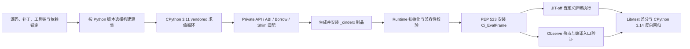
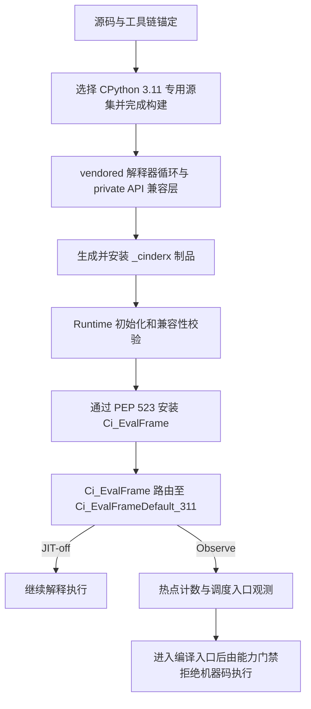
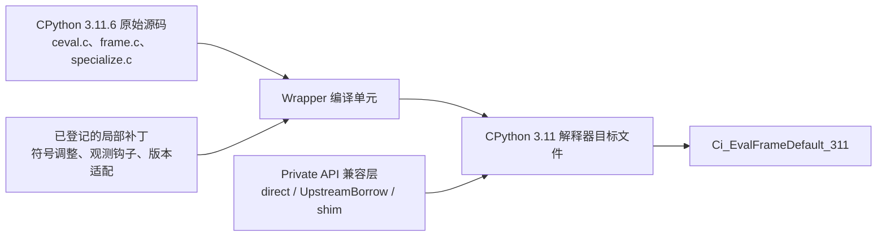
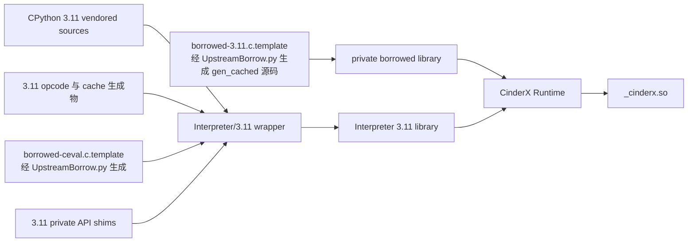
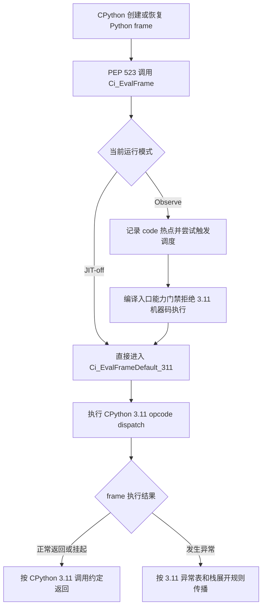
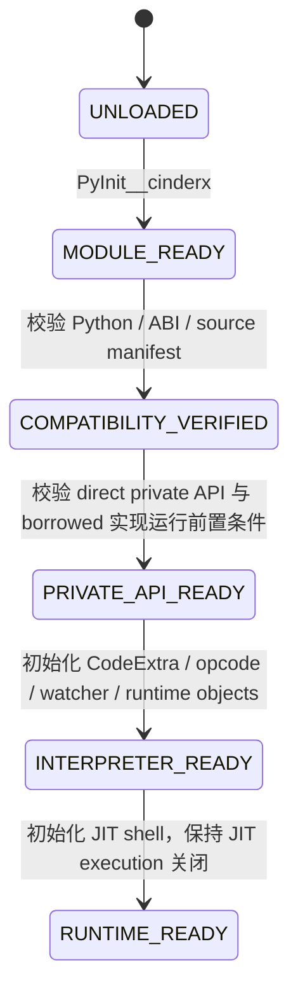
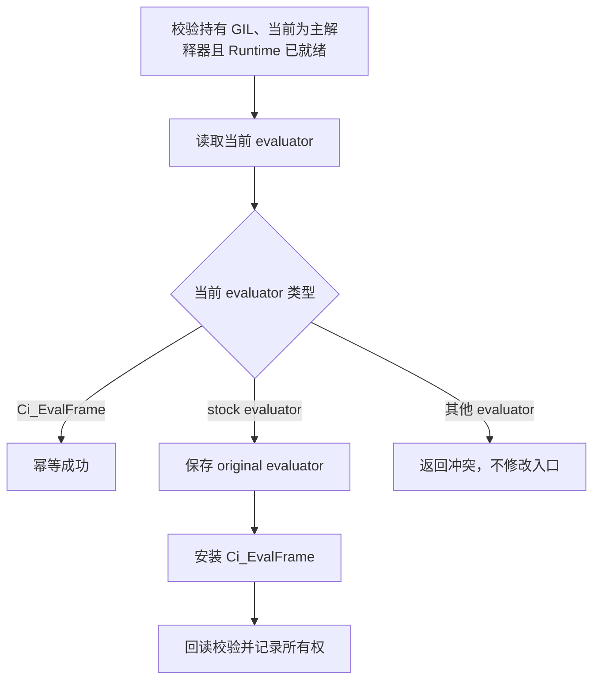
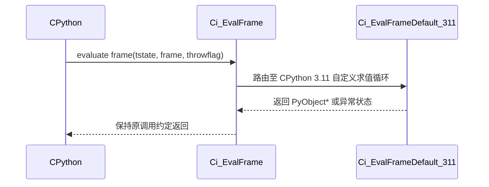

# RFC：【兼容性】CPython 3.11 可构建运行与自定义解释器循环

**状态（Status）：** Reviewing  
**作者（Authors）：** @jiabiao_o  
**创建日期（Created）：** 2026-07-20  
**更新日期（Updated）：** 2026-07-20  


---

# 1. 概述

## 1.1 简介

本提案为 CinderX 建立 CPython 3.11.6 的可构建、可加载和可运行基座，并将 CPython 3.11.6 的解释器求值循环接入 CinderX。完成适配后，CinderX 能够在 openEuler 24.03-LTS-SP3 的目标环境中生成可安装制品，通过 PEP 523 接管 Python frame 求值入口，并在 JIT 关闭时使用自定义解释器循环执行普通 Python 代码。

本提案是 CPython 3.11 兼容工作的第一阶段，重点解决版本锚定、构建接入、版本代码隔离、解释器循环、私有 API、Runtime 初始化和求值入口接管问题；同时建立构建、加载、JIT-off 语义差分、热点调度入口和 CPython 3.14 反向验证能力。CPython 3.11 JIT 机器码的生成、挂接、执行以及相关语义正确性由后续需求单独设计和验收。

## 1.2 动机

CinderX 当前工程结构、解释器集成和 JIT Runtime 主要面向 CPython 3.14。CPython 3.11 在 frame 数据结构、opcode 与 inline cache、specialization、私有 API、求值入口及生成物等方面与 CPython 3.14 存在差异，无法仅通过少量条件编译直接复用现有实现。

在穿刺验证阶段已经证明 CPython 3.11 的构建接入、自定义解释器循环和基础调度链路具备可行性，同时也暴露出以下正式实现必须解决的问题：
- CPython 私有 API 不具备跨版本稳定性，近似实现可能造成缓存、frame 或引用所有权错误；
- 解释器源码、生成物和 Borrow 结果需要按版本隔离并建立来源校验；
- PEP 523 接管会影响解释器全局执行路径，必须处理入口所有权、初始化失败回滚和退出恢复；
- 如果构建、解释执行和 JIT 机器码语义同时推进，问题将跨多个层次耦合，难以定位和评审。

因此，需要先形成经过评审的解释执行运行基座，再在此基础上开展 CPython 3.11 JIT 执行语义正确性工作。不实施本提案，后续开发将缺少稳定的构建基线、解释执行对照组和自动化回归能力。

## 1.3 目标

### 1.3.1 目标

- 将目标环境固定为 openEuler 24.03-LTS-SP3 和 CPython 3.11.6，并记录源码、发行版补丁、工具链、SOABI 和依赖信息；
- 支持在目标环境中构建、安装和加载 CinderX，生成 CPython 3.11 可识别的 `_cinderx` 扩展及 wheel 制品；
- 建立 CPython 3.11 与 CPython 3.14 的版本化源码、生成物和构建源集隔离机制；
- 将 CPython 3.11.6 原始求值循环接入 CinderX，并完成必要的私有 API、ABI 和 opcode 适配；
- 完成 Runtime 初始化和 PEP 523 求值入口接管，使 Python frame 能够进入 CinderX 自定义解释器循环；
- 在 JIT-off 模式下保持与 stock CPython 3.11.6 一致的解释执行语义；
- 在 observe 模式下验证热点计数、调度请求和编译入口可达；
- 建立 CPython 3.11.6 自动化验收和 CPython 3.14 反向回归机制。

### 1.3.2 非目标

- 不实现 Lightweight Frames、OSR、deopt、JIT generator/coroutine、Static Python、Parallel GC 和 Lazy Import；
- 不支持子解释器；
- 不承诺兼容 CPython 3.11.6 之外的其他 CPython 3.11 微版本；
- 不在本阶段以性能收益为目标，自定义解释器循环的性能要求以避免明显回退为主；
- 不直接修改 openEuler CPython 的默认求值循环，CinderX 通过扩展模块和 PEP 523 进行受控接入；

# 2. 用例分析

## 2.1 目标环境构建与安装

构建工程师或 CI 在固定的 openEuler 24.03-LTS-SP3 环境中，使用 CPython 3.11.6 发起 CinderX 构建。构建流程应校验目标 Python、源码清单、openEuler 补丁、Borrow 生成物和版本化源集，最终生成可安装的 CPython 3.11 wheel，并在独立虚拟环境中完成安装和导入验证。

该用例重点关注构建可复现性、输入来源可追踪性、3.11/3.14 源集隔离和制品有效性。

## 2.2 CinderX 加载与自定义解释器循环运行

应用显式加载 `_cinderx` 或 `cinderx`，Runtime 完成版本、ABI、私有 API 和解释器依赖初始化。加载动作本身不自动修改 frame evaluator；在显式调用接口或启用受控启动配置后，CinderX 通过 PEP 523 安装 `Ci_EvalFrame`，并将 Python frame 路由至 CPython 3.11 专用求值循环。

在 JIT-off 模式下，普通函数调用、异常处理、frame 生命周期、specialization、tracing 和 C/Python 调用边界应继续遵循 CPython 3.11.6 解释执行语义。

## 2.3 热点计数与调度入口验证

在 observe 模式下配置热点阈值，重复调用目标函数。阈值达到前不得触发调度；达到阈值后应产生热点事件并进入 CinderX 编译入口，但必须在 CPython 3.11 字节码翻译和机器码生成前被能力门禁拒绝。

该用例只验证后续 JIT 需求所依赖的调度基座，不验证机器码执行结果。

## 2.4 兼容性与回归验证

同一套 CPython 3.11.6 测试语料分别在 stock 模式和 CinderX 自定义解释器 JIT-off 模式下运行，比较成功、失败、异常、崩溃和超时结果。同时使用 CPython 3.14 构建同一提交，确认 3.11 适配没有破坏现有参考实现。

# 3. 方案设计

## 3.1 总体方案

方案按“源码与构建基线、解释器适配、Runtime 接管、自动化验证”四个部分实施：



整体设计遵循以下原则：

1. **版本锚定。** 构建和运行只接受已经评审的 CPython 3.11.6 与 openEuler 组合；未知微版本默认失败。
2. **原始语义优先。** 自定义解释器循环以 CPython 3.11.6 原始实现为基线，不手写简化解释器。
3. **版本化隔离。** 完整算法、数据布局和生成物按 Python 版本独立组织；公共代码只保留真正可共享的抽象。
4. **复用现有机制。** 私有 API 适配沿用 CinderX 3.14 已有 UpstreamBorrow 工具链，避免额外维护第二套提取机制。
5. **失败关闭。** 无法证明等价的私有接口关闭相关优化或阻断加载，不提供近似值或假成功。
6. **受控接管。** 模块加载与 evaluator 安装解耦；只在持有入口所有权时修改或恢复 PEP 523 evaluator。
7. **阶段隔离。** 本阶段只验证解释执行和 JIT 调度入口，不启用 CPython 3.11 机器码执行。

## 3.2 技术选型

| 设计项 | 候选方案 | 本提案选择 | 选择原因 |
| --- | --- | --- | --- |
| CPython 集成方式 | 修改 CPython 主程序；通过扩展模块接入 | 扩展模块 + PEP 523 | 能够使用同一 CPython 二进制比较 stock 与 CinderX 行为，降低发行版侵入性 |
| 解释器循环 | 手写精简循环；复用 CPython 3.11 原始循环 | vendored 原始循环 + wrapper | 异常、frame、specialization 和 opcode 语义复杂，原始实现更容易审计和差分 |
| 私有实现复用 | 手工复制；新增自定义提取器；复用 UpstreamBorrow | 复用现有 UpstreamBorrow | 与 CPython 3.14 工程机制一致，减少新的工具和维护路径 |
| 版本隔离 | 大量散布条件编译；版本化源集 | 版本化源集为主，小范围守卫为辅 | 避免 3.11 假设扩散到 3.14，并减少热路径分支 |
| 求值入口安装 | import 时无条件接管；显式或受控接管 | 加载与安装解耦 | 降低安装副作用，并能处理第三方 evaluator 冲突 |
| JIT 验证方式 | 本阶段直接执行机器码；只验证调度入口 | JIT-off + observe | 先稳定解释执行基座，避免与后续 JIT 语义问题混杂 |
| Frame 模型 | 复用 3.14 Lightweight Frames；沿用 3.11 实体 frame | CPython 3.11 实体 `_PyInterpreterFrame` | 与目标版本语义一致，减少布局和生命周期风险 |

## 3.3 功能与性能设计

### 3.3.1 【JIT】可构建运行与自定义解释器循环

#### 3.3.1.1 功能边界与总体链路

本功能建立 CinderX 在 CPython 3.11.6 上的解释执行运行基座，完成以下闭环：

1. 固定 CPython 3.11.6、openEuler 补丁、构建工具链和依赖版本；
2. 构建系统按目标 Python 版本选择 CPython 3.11 专用源集；
3. 将 CPython 3.11.6 求值循环接入 CinderX，并适配其私有 API；
4. 加载 `_cinderx`，完成运行时初始化；
5. 通过 PEP 523 将 frame 求值入口切换到 CinderX 自定义解释器循环；
6. 在 JIT-off 模式下执行普通 Python 代码；
7. 在 observe 模式下验证热点计数、调度请求和编译入口可达，但禁止生成、挂接和执行 CPython 3.11 机器码。

本功能的边界如下：

| 能力                                                   | 本期结论                             |
| ---------------------------------------------------- | -------------------------------- |
| CPython 3.11.6 构建、安装和加载                              | 支持                               |
| CinderX 自定义解释器循环                                     | 支持                               |
| JIT-off 解释执行                                         | 支持，要求与 stock CPython 3.11.6 语义等价 |
| 热点计数和编译入口观测                                          | 支持，仅用于验证调度基座                     |
| CPython 3.11 JIT 机器码执行                               | 不支持，由能力门禁阻断                      |
| Lightweight Frames、OSR、deopt、JIT generator/coroutine | 不在本期范围                           |
| 子解释器                                                 | 不支持，加载时明确拒绝                      |
| 非 CPython 3.11.6 小版本                                 | 不承诺兼容，默认失败关闭                     |

总体链路如下：



#### 3.3.1.2 版本基线与源码锚定

##### 3.3.1.2.1 目标基线

正式实现固定以下目标组合：

| 项目     | 目标值                     | 约束               |
| ------ | ----------------------- | ---------------- |
| 操作系统   | openEuler 24.03-LTS-SP3 | 使用不可变构建容器 digest |
| Python | CPython 3.11.6          | 构建和运行时均进行精确版本校验  |
| 参考版本   | CPython/CinderX 3.14    | 用于共享代码反向构建和回归    |

不得仅以 `3.11` 或 `PY_VERSION_HEX` 的主次版本部分作为兼容依据。源码清单必须同时记录 Python 微版本、SOABI、debug/pymalloc/shared 配置和工具链信息。

##### 3.3.1.2.2 上游与 openEuler 源码取值规则

CPython 3.11 vendored 源码按以下流程确定：
1. 使用版本控制中的核心文件清单，对上游 v3.11.6 与 openEuler post-patch 源码逐文件比较；
2. 对每个差异记录补丁来源、影响范围和处置结论；
3. 核心文件无差异时使用上游 v3.11.6 文件；
4. 核心文件存在有效发行版差异时使用 post-patch 文件，并记录上游和发行版双重来源；
5. 出现无法归因的差异时终止清单生成和构建。

核心文件清单至少覆盖：

- `Python/ceval.c`、`Python/frame.c`、`Python/specialize.c`；
- `Python/ceval_gil.h`、`Python/condvar.h`、`Python/opcode_targets.h`；
- `Include/internal/pycore_frame.h`、`pycore_code.h`、`pycore_dict.h`、`pycore_function.h`、`pycore_ceval.h`；
- CPython 3.11 opcode、inline cache 和 specialization 的生成输入；
- `UpstreamBorrow/borrowed-3.11.c.template` 和 `Interpreter/3.11/borrowed-ceval.c.template` 中 `@Borrow` 指令引用的全部 CPython 上游源文件。

#### 3.3.1.3 构建接入与版本代码隔离

##### 3.3.1.3.1 版本化源码组织


```text
cinderx/
├── Interpreter/
│   ├── 3.11/
│   │   ├── upstream/                  # 与锚定源码逐字节一致，禁止手工修改
│   │   ├── wrappers/                  # 符号重命名和局部解释器补丁
│   │   ├── generated/                 # opcode、targets、metadata 等生成物
│   │   ├── borrowed-ceval.c.template  # 解释器局部 Borrow 指令，沿用 3.14 机制
│   │   ├── shims/                     # 不能原样复用上游实现的轻量适配
│   │   ├── patch_ledger.toml
│   │   └── source_manifest.json
│   ├── 3.14/                          # 现有参考实现
│   └── interpreter_base.cpp           # 跨版本公共入口
├── UpstreamBorrow/
│   ├── UpstreamBorrow.py              # 3.11/3.14 共用 Borrow 生成工具
│   ├── clang_parser.py                 # 基于编译数据库解析 CPython 源码
│   ├── callgraph.py                    # 辅助生成函数依赖的 @Borrow 指令
│   ├── borrowed.h                      # 各版本共用声明和符号重命名
│   ├── borrowed-3.11.c.template        # CPython 3.11 通用 Borrow 模板
│   ├── borrowed-3.11.gen_cached.c      # 由现有工具生成的缓存源码
│   ├── borrowed-3.14.c.template        # CPython 3.14 现有模板
│   └── borrowed-3.14.gen_cached.c      # CPython 3.14 现有生成源码
├── Common/
│   └── py-portability.h
└── PythonLib/opcodes/
    ├── 3.11/opcode.py
    └── 3.14/opcode.py
```

目录职责必须保持稳定：

- `upstream/` 只保存未经本地修改的锚定源码；
- `wrappers/` 只承载编译包装和已登记补丁；
- `generated/` 只保存 opcode、targets、metadata 等解释器生成物；
- `borrowed-3.11.c.template` 是 CPython 3.11 通用私有实现复用的唯一 Borrow 指令入口，结构与 3.14 模板保持一致；
- `borrowed-ceval.c.template` 只承载解释器局部的 Borrow 指令和必要适配，机制与 `Interpreter/3.14/borrowed-ceval.c.template` 一致；
- `borrowed-3.11.gen_cached.c` 是工具生成结果，禁止手工修改；`borrowed.h` 由各版本共用，用于统一声明和解决符号冲突；
- `shims/` 只保存无法直接调用、也不适合通过现有 UpstreamBorrow 机制原样复用的轻量适配；
- 跨版本公共代码只放置经过抽象后真正共享的逻辑。

##### 3.3.1.3.2 构建能力矩阵

构建系统以能力矩阵选择源集，不允许业务代码自行推导版本能力。

| 能力                      | CPython 3.11.6 | CPython 3.14 |
| ----------------------- | -------------: | -----------: |
| 自定义解释器循环                |             ON |         保持现状 |
| PEP 523 接管              |             ON |         保持现状 |
| Lightweight Frames      |            OFF |         保持现状 |
| JIT observe             |       测试/诊断可开启 |         保持现状 |
| JIT machine execution   |            OFF |         保持现状 |
| Static Python           |       OFF/stub |         保持现状 |
| OSR                     |            OFF |         保持现状 |
| Parallel GC、Lazy Import |            OFF |         保持现状 |
| 子解释器                    |            不支持 |         保持现状 |

##### 3.3.1.3.3 构建流程

1. **识别目标环境。** 使用发起构建的 Python 作为唯一目标解释器，获取其精确版本、SOABI、头文件路径、库路径及主要编译配置。对于 CPython 3.11，仅接受文档锚定的 3.11.6 环境；不支持的版本在配置阶段直接终止。
2. **校验受控输入。** 在编译前校验 CPython 3.11 vendored 源码、source manifest、核心文件哈希、opcode 生成物，以及 `UpstreamBorrow.py`、3.11 Borrow 模板和对应 `gen_cached` 生成源码。CI 需使用锚定的 CPython 3.11.6 源码重新生成并比较 Borrow 输出；校验失败时不继续编译。
3. **选择版本化源集。** CMake 根据目标版本和能力矩阵，在 3.11 与 3.14 实现之间进行编译期选择。CPython 3.11 构建只引入 `Interpreter/3.11`、`UpstreamBorrow/borrowed-3.11.gen_cached.c` 和 3.11 opcode 元数据，不同时编译或链接 3.14 专用实现。正式实现将 3.11 纳入与 3.14 相同的 `borrowed-${PY_VERSION}.gen_cached.c` 选择逻辑，替换穿刺版本的 `borrowed-3.11-fallback.c`。
4. **编译和链接。** CPython 3.11 构建先将 `borrowed-3.11.gen_cached.c` 编译为与 3.14 相同职责的私有 `borrowed` 库，再编译 vendored 解释器循环、解释器局部 Borrow 生成内容和 Shim，最终与公共 Runtime、JIT 调度外壳及模块初始化代码链接为 `_cinderx` 扩展模块。JIT 调度外壳只提供本期所需的 JIT-off 和 observe 能力，不包含 CPython 3.11 机器码执行能力。
5. **生成和验证制品。** 原生扩展编译完成后生成 cp311 wheel。
##### 3.3.1.3.4 代码隔离规则

| 差异类型                           | 处理方式                   |
| ------------------------------ | ---------------------- |
| 单点、小范围 API 差异                  | 就地版本守卫                 |
| 同类差异重复出现                       | 提升到 `py-portability.h` |
| 完整函数、数据布局或算法差异                 | 版本目录独立实现               |
| opcode、targets | 版本化生成器和生成物 |
| borrowed helper | 共用 `UpstreamBorrow.py`，使用版本化模板和 `gen_cached` 生成源码 |
| 初始化阶段能力差异                      | 能力矩阵和初始化策略             |
| 解释器/JIT 热路径差异                  | 编译期选择，不做运行时版本判断        |

#### 3.3.1.4 CPython 3.11 自定义解释器循环接入

##### 3.3.1.4.1 接入方式

自定义解释器循环以 CPython 3.11.6 原始求值循环为语义基线，采用“**原始源码 + 编译包装 + 补丁**”的方式接入：



禁止手写一个功能不完整的最小解释器替代 CPython 3.11 `ceval`。异常表、frame 生命周期、specialization 和 adaptive opcode 的语义均以锚定源码为准。

##### 3.3.1.4.2 vendored 源码范围

vendored 文件包括：

- `ceval.c` 及其编译依赖头文件；
- `frame.c`；
- `specialize.c`；
- CPython 3.11 opcode targets、cache layout 和相关生成内容。

要求：

- 保留上游许可证和版权信息；
- `upstream/` 中的文件与 source manifest 逐字节一致；
- 本地修改只允许通过 wrapper、独立补丁文件或生成器完成；
- CPython 安全修复进入 vendored 源码前，必须先更新源码锚定和差分报告。


##### 3.3.1.4.3 编译包装与符号隔离

CPython 3.11 的解释器源码不能直接以原符号名称编入 `_cinderx.so`，否则可能与目标 CPython 进程中的默认实现产生符号冲突，也无法区分 stock 求值循环和 CinderX 自定义求值循环。正式实现通过独立 wrapper 编译单元完成接入：

1. wrapper 在包含 vendored 源码前，将默认 frame 求值入口重命名为 `Ci_EvalFrameDefault_311`；
2. vendored 源码内部的静态 helper 保持编译单元内可见，不对外形成新的公共接口；
3. CPython 3.11 缺失或不可直接链接的私有 helper，优先通过与 3.14 相同的 UpstreamBorrow 机制提供：通用 helper 写入 `borrowed-3.11.c.template`，解释器局部 helper 写入 `Interpreter/3.11/borrowed-ceval.c.template`；仅在不能原样复用上游实现时使用 Shim；
4. opcode targets、inline cache 布局和 specialization 元数据使用 CPython 3.11 专用生成物，不引用 3.14 版本内容；
5. wrapper 中的本地修改必须登记在补丁台账中，禁止直接修改 `upstream/` 下的锚定源码。

编译依赖关系如下：



使 3.11 解释器实现以独立源集参与构建，跨版本公共代码只依赖统一入口和能力接口，避免在解释器 opcode 热路径中增加 3.11/3.14 运行时判断。

##### 3.3.1.4.4 求值执行链路与关键适配点

PEP 523 接管完成后，CPython 创建或恢复 Python frame 时进入 `Ci_EvalFrame`。`Ci_EvalFrame` 负责执行模式判断和必要的 JIT 调度观测，然后将 frame、线程状态和 `throwflag` 原样传递给 `Ci_EvalFrameDefault_311`。后者执行锚定的 CPython 3.11 求值循环，并将返回值或异常状态按原有调用约定返回给上层。



接入过程中重点处理以下兼容点：

| 适配点               | 设计处理                                                               | 约束                              |
| ----------------- | ------------------------------------------------------------------ | ------------------------------- |
| 求值入口              | 将 stock 默认求值入口重命名为 `Ci_EvalFrameDefault_311`，由 `Ci_EvalFrame` 统一路由 | 不改变 PEP 523 的参数和返回约定            |
| opcode dispatch   | 使用 CPython 3.11 的 opcode targets、指令编号和 inline cache 布局             | 不混用 CPython 3.14 生成物            |
| frame 状态          | 保留 3.11 的指令位置、数据栈、localsplus、frame 链接和所有权语义                        | 不引入 3.14 Lightweight Frames 假设  |
| 异常处理              | 沿用 3.11 exception table、异常栈展开和 `throwflag` 处理                      | JIT-off 下不得改变异常类型、消息和 traceback |
| tracing/profiling | 保持 CPython 3.11 对 tracing、profiling、递归检查和 eval breaker 的处理         | 不通过跳过检查换取性能                     |
| specialization    | 复用 3.11 adaptive opcode 和 specialization 路径；缺失的私有能力按 3.3.1.5 降级    | 不允许以近似缓存值维持 specialization      |
| C/Python 调用边界     | 保持 vectorcall、Python-to-Python 调用和 C-to-Python 回调进入同一 frame 求值路径   | 自定义循环不得绕过 PEP 523 所有权判断         |

JIT-off 是主路径：除求值入口被替换为 CinderX 入口外，frame 的创建、执行、挂起、恢复、清理和异常传播均继续遵循 CPython 3.11.6 的解释执行语义。Observe 模式只在 frame 入口增加热点观测，不改变 opcode 执行结果；达到阈值后进入编译入口，但在机器码生成前被能力门禁终止。

##### 3.3.1.4.5 Frame 模型

本期 CPython 3.11 固定使用实体 `_PyInterpreterFrame`：

- `CINDERX_CAP_LIGHTWEIGHT_FRAMES=false`；
- frame 的创建、链接、压栈、弹栈和清理沿用 CPython 3.11 原始实现；
- 指令位置、数据栈、localsplus、异常状态和 frame owner 等字段按 3.11 布局访问；
- generator/coroutine 在解释模式下沿用 CPython 3.11 的 frame 挂起与恢复语义，但其 JIT 编译和机器码执行不在本期范围；
- JIT frame、frame reify、deopt frame 和 3.14 轻量帧布局不可达；
- 不允许根据 CinderX 3.14 的默认值推导 CPython 3.11 frame 行为。

#### 3.3.1.5 私有 API 与 ABI 适配

##### 3.3.1.5.1 适配原则

CPython 私有 API 不具备跨版本稳定性。CPython 3.11 的适配沿用 CinderX 适配 CPython 3.14 时的处理顺序：

1. **能够直接调用的接口，继续调用 CPython 提供的实现；**
2. **不能直接调用但可原样复用的上游实现，使用现有 UpstreamBorrow 机制生成并编入私有 `borrowed` 库；**
3. **需要 CinderX 语义调整或跨版本接口收敛时，使用薄 Wrapper、已登记 transform 或 Shim；**
4. **无法证明语义等价时，关闭相关优化或阻断加载。**

Borrow 是构建期源码复用机制，不是运行时动态加载层。正式实现不新增独立的 Borrow manifest、独立函数提取器或手工 fallback 聚合文件。“能够编译或链接”也不是私有 API 适配完成的判据。

##### 3.3.1.5.2 私有 API 分级

| 等级  | 接口类型 | 处理策略 | 典型对象 |
| --- | --- | --- | --- |
| A | 进程唯一状态和编号分配器 | 优先直接调用 CPython 真源；若采用 Borrow，必须按 3.14 的做法完整列出与该状态耦合的函数、变量及依赖，并通过统一符号重命名形成自洽实现，禁止只复制单个发号函数 | dict/function version、CodeExtra index |
| B | specialization 或 inline cache 的值生产者 | 直接调用，或通过 UpstreamBorrow 原样提取函数及完整依赖；禁止近似重写 | `_PyDict_GetItemHint` 类接口 |
| C | 引用计数、frame 和 GC 所有权操作 | 优先通过 UpstreamBorrow 复用上游完整实现；存在 CinderX 改动时使用薄 Wrapper/transform，并进行内存安全审计 | frame clear/pop、stack helper |
| D | 无全局状态的纯计算 helper | 在版本模板中使用 `@Borrow` 指令提取，必要时增加小型 Wrapper | 行表解析、局部计算 helper |
| E | 本期关闭的功能依赖 | 明确返回 unsupported，不提供假成功 | OSR、Static Python 专用接口 |

关键规则：

- Borrow 的来源清单直接体现在版本化模板的 `@Borrow` 指令中；函数依赖可使用现有 `callgraph.py` 辅助生成，但最终依赖必须在模板中显式可审计；
- 对彼此共享静态变量、版本号或缓存状态的实现，必须借用完整依赖集合并保持内部引用绑定到同一份 borrowed 状态，禁止只复制单个入口形成不一致的影子状态；
- 由 `borrowed.h` 统一处理跨版本声明和需要改名的非导出符号，避免与 CPython 进程内符号冲突；
- 缓存索引或版本语义无法通过 direct 或完整 Borrow 保证时，关闭对应 specialization，不使用近似值；
- 会改变引用所有权或 frame 生命周期的接口必须具有 ASAN、refleak 和差分证据；
- 所有 fallback、stub 和 `NotImplemented` 必须进入机器可读清单。

##### 3.3.1.5.3 Borrow 层

CPython 3.11 沿用 CinderX 适配 CPython 3.14 的 UpstreamBorrow 机制，不新增独立的 Borrow 清单、提取器或手工 fallback 聚合层。

```text
UpstreamBorrow/borrowed-3.11.c.template
        │  UpstreamBorrow.py + Clang AST
        ▼
UpstreamBorrow/borrowed-3.11.gen_cached.c
        │  CMake
        ▼
private borrowed library
```

具体规则如下：

- 通用私有实现写入 `borrowed-3.11.c.template`；解释器局部依赖写入 `Interpreter/3.11/borrowed-ceval.c.template`，分别对应 3.14 的同类模板；
- 模板使用现有 `@Borrow` 指令声明需要复用的 function、typedef、var、struct、enum 和预处理指令，函数依赖可由 `callgraph.py` 辅助生成；
- 复用现有 `UpstreamBorrow.py`、`clang_parser.py` 和公共 `borrowed.h`；`borrowed.h` 负责跨版本声明及必要的符号重命名；
- 可原样复用的复杂 CPython 实现通过 Borrow 生成；需要 CinderX 语义调整时使用模板内 Wrapper、已登记 transform 或独立 Shim，不直接修改生成源码；
- CMake 将 CPython 3.11 纳入与 3.14 相同的 `borrowed-${PY_VERSION}.gen_cached.c` 选择逻辑，并将生成源码编译为私有 `borrowed` 库；
- CI 基于锚定的 CPython 3.11.6 源码重新生成并比较 `gen_cached` 文件。模板、生成工具和生成源码纳入 source manifest；生成源码禁止手工修改；


##### 3.3.1.5.4 Shim 层
- 当 CPython 3.11 私有接口无法从目标 `libpython` 直接调用，并且该逻辑不能通过现有 UpstreamBorrow 模板原样复用，或需要收敛不同版本接口时，可通过 Shim 层进行轻量封装。对于可原样复用的复杂 CPython 实现，应优先增加 `@Borrow` 指令，而不是在 Shim 中手工复制函数体。
- Shim 层的主要作用是隔离 CPython 3.11 内部结构、字段名称和接口签名差异，为 CinderX 公共代码提供语义明确、职责单一的兼容接口。Shim 不用于重新实现 CPython 的复杂内部逻辑，也不能通过近似行为掩盖不兼容问题。
- 跨版本公共代码不得直接访问 CPython 3.11 私有结构字段，而应通过 Shim 或公共 portability 接口访问，从而避免 CPython 3.11 的结构布局假设扩散到共享代码和 CPython 3.14 实现中。
- 每个 Shim 必须明确说明以下内容：
    1. 原接口及目标 CPython 版本；
    2. 无法直接调用的原因；
    3. 参数、返回值、异常和引用所有权；
    4. 是否参与 cache、GC 或 frame 生命周期；
    5. 与原实现的逐分支对应关系；
    6. 语义差分和内存安全测试。
- Shim示例如下：
``` c
PyObject* CiFrame_Function(...) {
#if PY_VERSION_HEX < 0x030C0000
    return _PyOldFrameFunction(...);
#else
    return _PyNewFrameFunction(...);
#endif
}
```
##### 3.3.1.5.5 ABI 校验

构建期校验：

- 被访问内部结构的 `sizeof` 和 `offsetof`；
- `_PyInterpreterFrame`、`PyCodeObject`、`PyFunctionObject`、`PyThreadState`、`PyDictKeysObject` 的相关字段；
- 编译期 SOABI、debug/pymalloc/shared 配置。

运行时校验：

- `sys.implementation.name == "cpython"`；
- Python 精确版本为 3.11.6；
- 编译期与运行时 SOABI 一致；
- 当前为主解释器；
- 对要求直接调用 CPython 真源的关键动态符号，确认其来自预期的 libpython 或主程序映射；通过 UpstreamBorrow 生成并由 `borrowed.h` 重命名的 `_Ci*`/`Cix_*` 私有符号属于 CinderX 内部实现，不按该规则误判为影子副本。

#### 3.3.1.6 Runtime 加载与生命周期

##### 3.3.1.6.1 加载原则

模块加载与求值入口接管分为两个独立动作：

- `import _cinderx` 只完成兼容性校验和 Runtime 初始化；
- 安装 PEP 523 evaluator 由显式接口或受控启动配置触发。

因此，加载 CinderX 不应自动改变所有 Python 进程的求值入口。

##### 3.3.1.6.2 初始化状态机



`RUNTIME_READY` 表示模块具备安装 evaluator 的条件，但不表示 evaluator 已经安装。

##### 3.3.1.6.3 初始化阶段职责

| 阶段            | 主要动作                                | 失败行为                                |
| ------------- | ----------------------------------- | ----------------------------------- |
| Module        | 创建模块状态和静态类型                         | 释放已创建 Python 对象                     |
| Compatibility | 校验版本、SOABI、主解释器和 manifest           | 直接终止加载，不安装 evaluator                |
| Private API   | 探测必须直接调用的私有符号，并初始化 borrowed 实现依赖的模块级状态（如有）；Borrow 源码已在构建期生成并链接 | 关闭可降级优化或终止加载 |
| Interpreter   | 初始化 CodeExtra、opcode、watcher 和解释器依赖 | 按已完成步骤逆序清理                          |
| JIT shell     | 初始化配置和编译入口外壳                        | 保持 JIT execution capability 为 false |
| Ready         | 标记 Runtime 可用                       | 允许后续安装 evaluator                    |

本期不允许以空 watcher、假版本号或空实现把未完成能力标记为可用。

##### 3.3.1.6.4 失败回滚与退出

初始化过程维护 cleanup 栈。任一阶段失败时，只回滚已经完成的阶段，并保留最初的主错误。

正常退出顺序：

1. 进入 `finalizing` 状态，禁止新热点调度；
2. 若 evaluator 由 CinderX 持有，先恢复原 evaluator；
3. 清理 JIT shell、CodeExtra 数据和 watcher；
4. 清理 private API 相关模块状态、Python 引用和 C++ 模块状态；Borrow 生成代码本身不存在运行时动态资源；
5. 清除全局状态指针。

运行中不得在存在不可安全切换的 CinderX frame 时强制卸载 evaluator。

#### 3.3.1.7 PEP 523 求值入口接管

##### 3.3.1.7.1 所有权模型

CinderX 仅在当前 frame evaluator 仍为 stock 默认入口时安装，不覆盖第三方 profiler、debugger 或其他 JIT 的 evaluator。

```c
struct EvalHookState311 {
    _PyFrameEvalFunction original;
    PyInterpreterState* owner_interp;
    bool installed;
    uint64_t generation;
};
```

##### 3.3.1.7.2 安装流程



安装成功后执行路径为：



##### 3.3.1.7.3 卸载流程

卸载前重新读取当前 evaluator：

- 当前仍为 `Ci_EvalFrame`：恢复保存的 `original`；
- 当前已被其他组件替换：返回 `EVAL_HOOK_OWNERSHIP_LOST`，不覆盖新入口；
- 从未安装：幂等成功。

正式实现必须恢复保存的原函数指针，不以写入 `nullptr` 代替所有权恢复。

##### 3.3.1.7.4 入口约束

- 仅支持主解释器；
- 安装和卸载必须持有 GIL；
- Runtime 未就绪时不得安装；
- 初始化失败后不得留下指向已释放状态的 evaluator；
- evaluator 所有权变化必须产生结构化诊断事件。

#### 3.3.1.8 运行模式与 JIT 能力边界

##### 3.3.1.8.1 运行模式

本功能定义以下运行形态：

| 模式 | 模块加载 | CinderX evaluator | 热点观测 | 机器码执行 | 用途 |
|---|---:|---:|---:|---:|---|
| Stock | 否 | 否 | 否 | 否 | CPython 基线 |
| Load-only | 是 | 否 | 否 | 否 | 验证模块加载副作用 |
| Eval/JIT-off | 是 | 是 | 关闭 | 否 | 本期主交付形态 |
| Eval/Observe | 是 | 是 | 开启 | 否 | 验证热点和编译入口 |
| Full JIT | 是 | 是 | 开启 | 是 | 后续需求，不在本期实现 |

##### 3.3.1.8.2 热点观测

observe 模式只验证调度基座：

1. 在统一 frame 入口对 code 对象计数；
2. 达到阈值时产生一次调度请求；
3. 进入 CinderX 编译器统一入口；
4. 在读取和翻译 CPython 3.11 字节码前，由能力门禁返回 `CINDERX311_JIT_EXEC_DISABLED`；
5. 不分配函数机器码、不修改 function vectorcall、不挂接 native entrypoint。

计数状态与 code 生命周期绑定，不使用裸地址作为长期键。递归或重入情况下，同一阈值只产生一次调度事件。

##### 3.3.1.8.3 机器码执行门禁

CPython 3.11 的 JIT execution 在以下层级同时关闭：

- 配置解析不接受 `execute`；
- eligibility 返回明确的不可编译原因；
- `compileFunction` 和 OSR 编译入口拒绝；
- attach/patch function entrypoint 路径不可达；
- 直接调用测试私有接口也不得生成或挂接机器码。

##### 3.3.1.8.4 CALL specialization 兼容

CPython 3.11 会根据 evaluator 身份决定部分 CALL specialization 是否退化。CinderX 只在以下条件全部成立时，将自定义 evaluator 视为受信的同构解释循环：

```text
current evaluator == Ci_EvalFrame
AND runtime mode in {Eval/JIT-off, Eval/Observe}
AND JIT execution capability == false
AND vendored loop manifest verified
```

第三方 evaluator、未来的 JIT compiled evaluator 以及 manifest 未通过校验的情况继续保持 CPython 原始退化行为。

##### 3.3.1.8.5 启动控制

| 配置                                         | 默认值     | 作用                              |
| ------------------------------------------ | ------- | ------------------------------- |
| `CINDERX_PLUGIN_ENABLE`                    | `0`     | 是否通过启动模块加载 native 扩展            |
| `CINDERX_DISABLE`                          | `0`     | 强制禁止 CinderX 加载                 |
| `CINDERX_EVAL_MODE`                        | `stock` | 选择 stock 或 cinder evaluator     |
| `CINDERX_JIT_MODE`                         | `off`   | 3.11 只接受 `off` 和测试环境的 `observe` |
| `CINDERX_JIT_DISABLE` / `PYTHONJITDISABLE` | `1`     | 禁止 JIT 调度和执行                    |
| `CINDERX_JIT_OBSERVE_FILE`                 | 空       | observe 事件输出位置                  |

wheel 安装完成后默认不安装 evaluator。只有显式调用 `install_frame_evaluator()`，或同时启用插件并配置 `CINDERX_EVAL_MODE=cinder` 时，才执行接管。

#### 3.3.1.9 性能设计

- vendored loop 的编译参数与目标 CPython 对齐，避免编译选项造成虚假回退或虚假收益；
- Python 版本和能力选择在配置、编译或初始化阶段完成，opcode 热路径不进行运行时版本判断；
- `Ci_EvalFrame` 只执行必要状态判断并尾调用 `Ci_EvalFrameDefault_311`；
- JIT-off 模式不执行热点计数，或仅保留一个可预测的 frame 级旁路；
- 测试计数和详细日志在 release 构建中编译移除；
- 私有接口不可用时优先关闭单个 specialization，不在解释器热路径增加兼容逻辑；
- CALL specialization 的受信 evaluator 规则只恢复 CPython 原有解释执行优化，不放宽到机器码执行。

### 3.3.2 【JIT】可构建运行与自定义解释器循环可测试性

#### 3.3.2.1 测试目标

通过自动化用例验证 CPython 3.11.6 适配基座可构建、可加载、可执行，并确保自定义解释器循环在 JIT 关闭模式下不引入新的语义差异。同时验证 JIT 热点计数和编译入口调度链路可触发，以及 CPython 3.14 参考线不受影响。

自动化测试使用固定的 CPython 3.11.6 环境和同一份 CinderX 源码执行，测试结果应能够输出明确的成功、失败和差异信息，便于问题定位和回归比较。

#### 3.3.2.2 自动化验收场景

| 场景 | 自动化用例设计 | 通过标准 |
| --- | --- | --- |
| CPython 3.11.6 构建 | 在目标 CPython 3.11.6 环境中执行干净构建，生成 `_cinderx` 扩展及 wheel 等可安装制品，并在独立虚拟环境中完成安装 | 构建和安装成功；制品存在且可被目标 Python 识别；无未定义符号或版本不匹配错误 |
| CinderX 加载与初始化 | 在新建虚拟环境中执行 `import _cinderx` 和 `import cinderx`，检查模块初始化结果、目标 Python 版本及 Runtime 状态 | import 成功，进程无崩溃；Runtime 初始化完成；版本和能力信息符合 CPython 3.11.6 配置 |
| JIT-off 语义差分 | 分别使用 stock CPython 3.11.6 和“加载 CinderX、自定义解释器循环、JIT 关闭”的环境运行同一组 CPython `Lib/test` 用例，并比较测试结果 | CinderX 环境无新增 FAIL、ERROR、崩溃或超时；基线已有失败允许保留，但不得新增差异 |
| JIT 热点与编译入口 | 开启 JIT 调度或 observe 模式，设置固定热点阈值，重复调用测试函数并采集热点计数和编译入口事件 | 阈值前不触发，达到阈值后能够触发热点调度并进入编译入口；函数执行结果保持正确。本阶段不要求验证机器码执行 |
| CPython 3.14 反向验证 | 使用 CPython 3.14 对同一提交执行构建、安装、import 和基础冒烟用例 | 3.14 构建和加载成功，已有基础功能用例通过，确认 3.11.6 适配未破坏参考线 |

#### 3.3.2.3 用例组织建议

自动化用例按以下三类组织：

1. **构建与加载用例：** 覆盖干净构建、制品安装、模块 import 和 Runtime 初始化，作为后续测试的前置门禁；
2. **运行行为用例：** 覆盖 JIT-off `Lib/test` 差分，以及热点阈值和编译入口触发；
3. **兼容性用例：** 覆盖 CPython 3.14 反向构建和基础冒烟。

#### 3.3.2.4 测试输出

自动化任务至少输出以下结果：

- CPython 3.11.6 构建及制品安装结果；
- CinderX import 和 Runtime 初始化结果；
- JIT-off `Lib/test` 基线与适配环境的差分结果；
- 热点计数、阈值触发和编译入口调度结果；
- CPython 3.14 反向构建和冒烟结果。

## 3.4 安全隐私与 DFX 设计

### 3.4.1 兼容性

-  openEuler 24.03-LTS-SP3、CPython 3.11.6、SOABI 和编译配置承诺兼容；
- 构建期和运行时均执行精确版本及 ABI 校验，避免在未知环境中继续运行；
- CPython 3.11 与 CPython 3.14 使用独立源集和生成物，公共代码变更必须通过 3.14 反向构建；
- 子解释器及本期未支持能力返回明确错误，不采用部分可用或静默降级方式；
- 对可降级的 specialization，只允许回退至 CPython 通用解释路径，不改变语言语义。

### 3.4.2 可维护性

- vendored 原始源码、wrapper、generated、Borrow 模板、Borrow 生成源码和 Shim 分区管理；
- `upstream/` 和生成源码禁止手工修改，变更必须通过来源更新或生成工具完成；
- 版本差异优先放入版本化目录，只有小范围接口差异使用条件编译；

### 3.4.3 可测试性
- 由3.3.2 章节的可测试性需求承载
### 3.4.4 可靠性

- evaluator 安装前保存原入口，只有当前入口仍由 CinderX 持有时才恢复，避免覆盖第三方组件；
- 退出时先停止新的热点调度并恢复 evaluator，再释放其依赖的 Runtime 状态；
- 私有 API 缺失或语义不确定时关闭相关能力，不以空实现、假版本号或近似缓存值继续运行；

### 3.4.5 安全与隐私

- 默认不开启 CinderX evaluator，只有显式调用或受控配置才改变 Python 求值入口；
- CPython 3.11 JIT 机器码执行通过配置、编译入口等方式关闭；
- observe 模式只记录函数标识、热点计数、调度结果和错误码，不记录函数参数、返回对象或业务数据；
- 诊断日志默认关闭，正式构建中移除仅用于测试的高频计数和详细日志。

# 4. 缺点和风险

| 风险                                 | 影响                               | 应对措施                                                     |
| ---------------------------------- | -------------------------------- | -------------------------------------------------------- |
| CPython 私有 ABI 不稳定                 | 编译失败、运行崩溃或静默语义错误                 | 精确版本锚定、结构校验、direct/Borrow/Shim 分级和失败关闭                   |
| vendored 源码与发行版补丁漂移                | 自定义循环与目标 CPython 行为不一致           | 自动比较上游与 openEuler post-patch 源码，更新 source manifest 和差分报告 |
| Borrow 的依赖集合不完整                    | 共享状态或静态变量不一致                     | 使用现有 Clang AST/callgraph 工具，显式审计模板中的依赖，并重新生成比较           |
| PEP 523 与第三方 evaluator 冲突          | 覆盖 profiler、debugger 或其他 JIT 的入口 | 只在 stock evaluator 下安装；保存原入口；所有权丢失时不恢复                   |
| 3.11 条件代码影响 3.14                   | 现有构建或运行功能回归                      | 版本化源集、公共代码最小化和 3.14 强制反向构建                               |
| 适配代码和测试维护成本增加                      | 后续升级成本上升                         | 复用 3.14 已有 UpstreamBorrow 与构建机制，限制新增工具和重复实现              |


# 5. 现有技术

## 5.1 CPython PEP 523

PEP 523 提供 per-interpreter frame evaluation hook，使扩展组件能够替换 Python frame 的求值函数。CinderX 使用该机制安装 `Ci_EvalFrame`，同时增加入口所有权、显式安装、冲突检测和退出恢复，避免无条件覆盖其他组件。

## 5.2 CPython 3.11 解释器实现

CPython 3.11 的 `ceval`、frame、exception table、adaptive opcode 和 specialization 共同构成解释执行语义。本提案不重新设计这些机制，而是以锚定的 CPython 3.11.6 原始源码为基线，通过 wrapper 和受控补丁接入 CinderX。

## 5.3 CinderX 3.14 的 UpstreamBorrow 与版本化实现

CinderX 已使用 UpstreamBorrow 从指定 CPython 源码生成所需的私有实现，并通过模板、Clang AST 和公共声明处理非导出符号。本提案将 CPython 3.11 纳入同一机制，不新增独立提取器或手工 fallback 聚合层。


---

# 附录 A：参考资料

1. CPython PEP 523：<https://peps.python.org/pep-0523/>
2. CPython v3.11.6：<https://github.com/python/cpython/tree/v3.11.6>
3. CinderX：<https://github.com/facebookincubator/cinderx>


# 附录 B：术语表

| 术语             | 说明                                                |
| -------------- | ------------------------------------------------- |
| stock CPython  | 未安装 CinderX frame evaluator 的目标 CPython 默认执行形态    |
| JIT-off        | 使用 CinderX 自定义解释器循环，但关闭 JIT 调度和机器码执行              |
| observe        | 开启热点计数和编译入口观测，但禁止生成、挂接和执行机器码                      |
| vendored       | 从固定 CPython/openEuler 来源复制并纳入 CinderX 版本管理的源码     |
| UpstreamBorrow | CinderX 使用模板和 Clang AST 从指定 CPython 源码生成私有实现的构建机制 |
| Shim           | 用于隔离私有 API 签名、字段或轻量语义差异的兼容封装                      |
| evaluator 所有权  | CinderX 只在确认入口可接管时安装，并只在当前入口仍属于 CinderX 时恢复的规则    |

